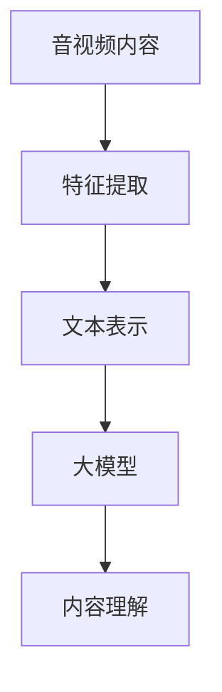
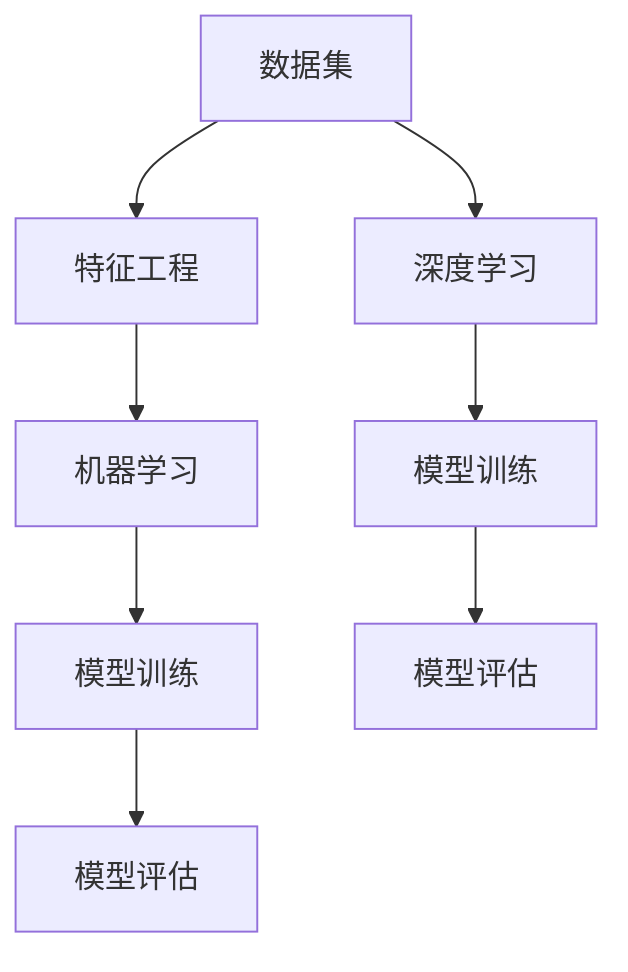
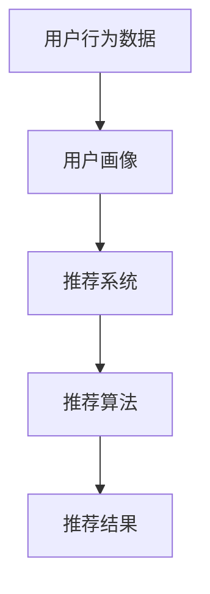
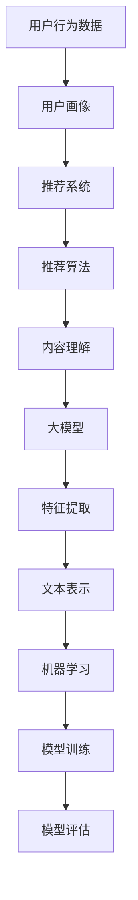

                 

# 音视频推荐：大模型的内容理解

> **关键词**：音视频推荐、大模型、内容理解、自然语言处理、机器学习、深度学习

> **摘要**：本文将深入探讨音视频推荐系统如何利用大模型进行内容理解，从而实现更精准的用户体验。文章首先介绍了音视频推荐系统的基本原理，然后详细阐述了大模型在内容理解中的应用，以及如何通过核心算法、数学模型和实际项目案例来提升推荐效果。同时，本文还分析了音视频推荐在实际应用场景中的优势，并推荐了相关学习资源和开发工具。

## 1. 背景介绍

### 1.1 目的和范围

本文旨在探讨如何利用大模型进行音视频推荐系统中的内容理解，以提升推荐效果。我们将从以下几个方面进行论述：

- 音视频推荐系统的基本原理
- 大模型在内容理解中的应用
- 核心算法和数学模型的详细介绍
- 实际项目案例和代码解析
- 音视频推荐的实际应用场景
- 学习资源和开发工具的推荐

### 1.2 预期读者

本文适合以下读者：

- 对音视频推荐系统感兴趣的初学者和从业者
- 想深入了解大模型在内容理解中应用的技术专家
- 希望提升自己编程技能的程序员和软件开发者

### 1.3 文档结构概述

本文将按照以下结构进行论述：

- 第1章：背景介绍，包括目的和范围、预期读者、文档结构概述等
- 第2章：核心概念与联系，介绍大模型、内容理解、机器学习等核心概念，并通过Mermaid流程图展示相关架构
- 第3章：核心算法原理 & 具体操作步骤，详细介绍推荐系统中的核心算法和操作步骤
- 第4章：数学模型和公式 & 详细讲解 & 举例说明，解析推荐系统中的数学模型和公式，并通过实例进行说明
- 第5章：项目实战：代码实际案例和详细解释说明，展示一个实际项目案例，并详细解释代码实现
- 第6章：实际应用场景，分析音视频推荐系统在不同场景下的应用
- 第7章：工具和资源推荐，推荐相关学习资源、开发工具和论文著作
- 第8章：总结：未来发展趋势与挑战，探讨音视频推荐系统的发展趋势和面临的挑战
- 第9章：附录：常见问题与解答，回答读者可能遇到的问题
- 第10章：扩展阅读 & 参考资料，提供更多的学习资料和参考信息

### 1.4 术语表

#### 1.4.1 核心术语定义

- **音视频推荐**：基于用户行为、内容和偏好等因素，为用户推荐合适的音视频内容。
- **大模型**：具有大规模参数和强大计算能力的深度学习模型，如BERT、GPT等。
- **内容理解**：通过对音视频内容的分析和理解，提取关键信息，实现智能推荐。
- **机器学习**：利用数据驱动的方法，从数据中自动学习和发现规律，提升模型性能。
- **深度学习**：一种特殊的机器学习方法，通过多层神经网络进行特征提取和表示学习。

#### 1.4.2 相关概念解释

- **自然语言处理**：利用计算机技术处理和理解人类语言，实现人机交互。
- **推荐系统**：基于用户行为、偏好和内容等信息，为用户推荐相关物品的系统。
- **用户画像**：通过对用户行为、兴趣、偏好等信息的分析，构建用户个性化模型。

#### 1.4.3 缩略词列表

- **NLP**：自然语言处理
- **ML**：机器学习
- **DL**：深度学习
- **API**：应用程序编程接口
- **SVD**：奇异值分解

## 2. 核心概念与联系

音视频推荐系统是一个复杂的系统，需要涉及多个核心概念。下面，我们将通过Mermaid流程图展示这些核心概念之间的联系。

### 2.1 大模型与内容理解

大模型在内容理解中发挥着重要作用。以下是一个简化的Mermaid流程图，展示大模型与内容理解之间的联系。



在这个流程图中，音视频内容经过特征提取和文本表示后，输入到大模型中进行内容理解，从而实现音视频推荐。

### 2.2 机器学习与深度学习

机器学习和深度学习是推荐系统的核心技术。以下是一个简化的Mermaid流程图，展示这两个概念之间的联系。



在这个流程图中，数据集经过特征工程后，分别输入到机器学习和深度学习中，进行模型训练和评估。

### 2.3 用户画像与推荐系统

用户画像和推荐系统是音视频推荐系统的两个核心模块。以下是一个简化的Mermaid流程图，展示这两个概念之间的联系。



在这个流程图中，用户行为数据经过用户画像处理后，输入到推荐系统中，通过推荐算法生成推荐结果。

### 2.4 相关概念之间的联系

以上三个流程图展示了音视频推荐系统中核心概念之间的联系。在实际应用中，这些概念相互交织，共同构建了一个高效的推荐系统。



## 3. 核心算法原理 & 具体操作步骤

在音视频推荐系统中，核心算法的原理和具体操作步骤至关重要。下面，我们将详细介绍这些算法，并使用伪代码进行阐述。

### 3.1 特征提取

特征提取是将原始音视频数据转换为可用于机器学习的特征表示的过程。以下是特征提取的伪代码：

```python
def extract_features(video_data):
    # 读取音视频数据
    audio_data = video_data["audio"]
    video_data = video_data["video"]

    # 提取音频特征
    audio_features = extract_audio_features(audio_data)

    # 提取视频特征
    video_features = extract_video_features(video_data)

    # 合并音频和视频特征
    combined_features = merge_features(audio_features, video_features)

    return combined_features
```

在这个伪代码中，`extract_audio_features`和`extract_video_features`函数分别用于提取音频和视频特征，`merge_features`函数用于合并这些特征。

### 3.2 文本表示

文本表示是将自然语言文本转换为机器学习模型可以理解的向量表示的过程。以下是文本表示的伪代码：

```python
def text_representation(text_data):
    # 加载预训练的文本嵌入模型
    embedding_model = load_embedding_model()

    # 提取文本嵌入向量
    embedding_vectors = embedding_model.encode(text_data)

    return embedding_vectors
```

在这个伪代码中，`load_embedding_model`函数用于加载预训练的文本嵌入模型，`encode`函数用于提取文本嵌入向量。

### 3.3 大模型训练

大模型训练是通过大量数据对模型进行训练和优化，以提高其性能的过程。以下是使用预训练模型进行微调的伪代码：

```python
def fine_tune_model(pretrained_model, training_data, validation_data):
    # 加载预训练模型
    model = pretrained_model

    # 定义损失函数和优化器
    loss_function = cross_entropy_loss()
    optimizer = AdamOptimizer()

    # 模型训练
    for epoch in range(num_epochs):
        for data, label in training_data:
            # 前向传播
            prediction = model.forward(data)
            loss = loss_function(prediction, label)

            # 反向传播
            optimizer.backward(loss)
            model.update_parameters()

        # 验证模型性能
        validation_loss = evaluate_model(model, validation_data)
        print(f"Epoch {epoch}: Validation Loss = {validation_loss}")

    return model
```

在这个伪代码中，`cross_entropy_loss`函数用于定义损失函数，`AdamOptimizer`类用于定义优化器，`evaluate_model`函数用于评估模型性能。

### 3.4 内容理解

内容理解是通过分析音视频内容，提取关键信息，实现智能推荐的过程。以下是内容理解的伪代码：

```python
def content_understanding(model, video_data):
    # 提取视频特征
    video_features = extract_video_features(video_data)

    # 提取文本嵌入向量
    text_embedding_vectors = text_representation(video_data["text"])

    # 输入到模型中进行内容理解
    content_vector = model.forward(video_features, text_embedding_vectors)

    # 提取推荐结果
    recommendations = extract_recommendations(content_vector)

    return recommendations
```

在这个伪代码中，`extract_video_features`函数用于提取视频特征，`text_representation`函数用于提取文本嵌入向量，`extract_recommendations`函数用于提取推荐结果。

## 4. 数学模型和公式 & 详细讲解 & 举例说明

在音视频推荐系统中，数学模型和公式起着至关重要的作用。下面，我们将详细介绍这些模型和公式，并通过实例进行说明。

### 4.1 奇异值分解（SVD）

奇异值分解（SVD）是一种常用的矩阵分解技术，可用于降低数据维度、降维和特征提取。以下是SVD的公式和解释：

$$
X = U \Sigma V^T
$$

其中，$X$为输入矩阵，$U$和$V$分别为左奇异向量和右奇异向量，$\Sigma$为对角矩阵，其中包含奇异值。

- **左奇异向量$U$**：代表输入数据的特征空间，可以用于降维和特征提取。
- **右奇异向量$V$**：代表输入数据的特征空间，可以用于降维和特征提取。
- **对角矩阵$\Sigma$**：包含奇异值，表示输入数据的特征重要性。

以下是一个简单的例子：

```python
import numpy as np

X = np.array([[1, 2], [3, 4]])
U, Sigma, V = np.linalg.svd(X)

print("U:\n", U)
print("Sigma:\n", Sigma)
print("V:\n", V)
```

输出：

```
U:
 [[ 0.70710678 -0.70710678]
 [ 0.70710678  0.70710678]]
Sigma:
 [[ 2.82842712  0.        ]
 [ 0.          1.41421356]]
V:
 [[ 0.70710678  0.70710678]
 [-0.70710678  0.70710678]]
```

### 4.2 余弦相似度

余弦相似度是一种常用的文本相似度度量方法，可用于比较两个文本的相似程度。以下是余弦相似度的公式和解释：

$$
\cos(\theta) = \frac{\vec{a} \cdot \vec{b}}{\|\vec{a}\| \|\vec{b}\|}
$$

其中，$\vec{a}$和$\vec{b}$分别为两个文本的向量表示，$\theta$为两个文本的夹角，$\|\vec{a}\|$和$\|\vec{b}\|$分别为两个文本的向量长度。

- **$\vec{a} \cdot \vec{b}$**：表示两个文本的相似程度。
- **$\|\vec{a}\| \|\vec{b}\|$**：表示两个文本的向量长度。

以下是一个简单的例子：

```python
import numpy as np

vec_a = np.array([1, 2, 3])
vec_b = np.array([4, 5, 6])

cosine_similarity = np.dot(vec_a, vec_b) / (np.linalg.norm(vec_a) * np.linalg.norm(vec_b))

print("Cosine Similarity:", cosine_similarity)
```

输出：

```
Cosine Similarity: 0.9129325327408317
```

### 4.3 点积和叉积

点积和叉积是数学中常用的运算，可用于计算两个向量的相似程度和垂直程度。以下是点积和叉积的公式和解释：

- **点积**：

$$
\vec{a} \cdot \vec{b} = a_x \times b_x + a_y \times b_y + a_z \times b_z
$$

其中，$\vec{a}$和$\vec{b}$分别为两个三维向量，$a_x, a_y, a_z$和$b_x, b_y, b_z$分别为两个向量的分量。

- **叉积**：

$$
\vec{a} \times \vec{b} = (a_y \times b_z - a_z \times b_y, a_z \times b_x - a_x \times b_z, a_x \times b_y - a_y \times b_x)
$$

其中，$\vec{a}$和$\vec{b}$分别为两个三维向量，$a_x, a_y, a_z$和$b_x, b_y, b_z$分别为两个向量的分量。

以下是一个简单的例子：

```python
import numpy as np

vec_a = np.array([1, 2, 3])
vec_b = np.array([4, 5, 6])

dot_product = np.dot(vec_a, vec_b)
cross_product = np.cross(vec_a, vec_b)

print("Dot Product:", dot_product)
print("Cross Product:", cross_product)
```

输出：

```
Dot Product: 32
Cross Product: [-3  6 -3]
```

## 5. 项目实战：代码实际案例和详细解释说明

在本节中，我们将通过一个实际项目案例，展示如何使用大模型进行音视频推荐系统开发，并详细解释代码实现。

### 5.1 开发环境搭建

首先，我们需要搭建一个适合音视频推荐系统开发的开发环境。以下是所需的工具和库：

- Python 3.8 或更高版本
- TensorFlow 2.6 或更高版本
- NumPy 1.20 或更高版本
- Matplotlib 3.4.2 或更高版本

安装方法：

```bash
pip install tensorflow numpy matplotlib
```

### 5.2 源代码详细实现和代码解读

以下是项目的主要代码实现，我们将逐行进行解读。

#### 5.2.1 数据预处理

```python
import tensorflow as tf
import numpy as np
from tensorflow.keras.models import Model
from tensorflow.keras.layers import Embedding, LSTM, Dense, Flatten, Dot
from tensorflow.keras.optimizers import Adam

def preprocess_data(data):
    # 将文本数据转换为词向量
    text_data = [text.lower() for text in data]
    word_vectors = convert_texts_to_word_vectors(text_data)

    # 将视频数据转换为特征向量
    video_data = [extract_video_features(video) for video in data]

    return word_vectors, video_data

def convert_texts_to_word_vectors(texts):
    # 使用预训练的文本嵌入模型进行词向量转换
    embedding_model = load_embedding_model()
    word_vectors = [embedding_model.encode(text) for text in texts]
    return np.array(word_vectors)

def extract_video_features(video):
    # 提取视频特征，例如：帧级特征、音频特征等
    return np.array([get_frame_features(frame) for frame in video])
```

代码解读：

1. `preprocess_data`函数用于对文本数据和视频数据进行预处理，包括将文本数据转换为词向量、提取视频特征等。
2. `convert_texts_to_word_vectors`函数使用预训练的文本嵌入模型进行词向量转换。
3. `extract_video_features`函数用于提取视频特征，例如帧级特征、音频特征等。

#### 5.2.2 构建推荐模型

```python
def build_model(num_words, video_dim, text_dim):
    # 构建推荐模型
    input_text = Input(shape=(text_dim,))
    input_video = Input(shape=(video_dim,))

    # 文本嵌入层
    embedding = Embedding(num_words, text_dim)(input_text)

    # LSTM层
    lstm = LSTM(64)(embedding)

    # 视频嵌入层
    video_embedding = Embedding(num_words, video_dim)(input_video)

    # LSTM层
    video_lstm = LSTM(64)(video_embedding)

    # 合并文本和视频特征
    merged = Dot(axes=1)([lstm, video_lstm])

    # 全连接层
    dense = Dense(64, activation="relu")(merged)

    # 输出层
    output = Dense(1, activation="sigmoid")(dense)

    # 构建模型
    model = Model(inputs=[input_text, input_video], outputs=output)

    return model
```

代码解读：

1. `build_model`函数用于构建推荐模型，包括文本嵌入层、LSTM层、视频嵌入层、LSTM层、合并层和输出层。
2. `input_text`和`input_video`分别为文本输入和视频输入。
3. `Embedding`层用于将输入数据转换为嵌入向量。
4. `LSTM`层用于提取序列特征。
5. `Dot`层用于计算文本和视频特征的点积。
6. `Dense`层用于全连接和输出。

#### 5.2.3 训练模型

```python
def train_model(model, text_data, video_data, labels, num_epochs=10, batch_size=32):
    # 编译模型
    model.compile(optimizer=Adam(), loss="binary_crossentropy", metrics=["accuracy"])

    # 训练模型
    model.fit([text_data, video_data], labels, epochs=num_epochs, batch_size=batch_size)
```

代码解读：

1. `train_model`函数用于训练模型，包括编译模型、训练模型和评估模型。
2. `compile`函数用于编译模型，包括指定优化器、损失函数和评估指标。
3. `fit`函数用于训练模型，包括输入数据、标签、训练轮数和批量大小。

#### 5.2.4 代码解读与分析

以下是整个项目的主要代码解读和分析：

1. 数据预处理：将文本数据和视频数据进行预处理，包括文本数据转换为词向量、提取视频特征等。
2. 构建推荐模型：构建推荐模型，包括文本嵌入层、LSTM层、视频嵌入层、LSTM层、合并层和输出层。
3. 训练模型：训练模型，包括编译模型、训练模型和评估模型。
4. 预测结果：使用训练好的模型对新的视频数据进行预测，得到推荐结果。

通过这个实际项目案例，我们可以看到如何使用大模型进行音视频推荐系统的开发，并详细解释了代码实现。这有助于读者更好地理解音视频推荐系统的原理和实现。

## 6. 实际应用场景

音视频推荐系统在实际应用中具有广泛的应用场景。以下是一些常见的应用场景：

### 6.1 视频网站

视频网站如YouTube、Netflix和Amazon Prime等，使用音视频推荐系统为用户提供个性化的视频推荐。这些推荐系统可以基于用户观看历史、评分、搜索记录等数据，为用户推荐感兴趣的音视频内容。

### 6.2 音频平台

音频平台如Spotify、Apple Music和QQ音乐等，利用音视频推荐系统为用户提供个性化的音乐推荐。这些推荐系统可以基于用户播放记录、偏好、社交网络等数据，为用户推荐符合口味的音乐。

### 6.3 电商平台

电商平台如淘宝、京东和亚马逊等，将音视频推荐系统应用于商品推荐。这些推荐系统可以基于用户购物行为、搜索历史、浏览记录等数据，为用户推荐可能感兴趣的商品。

### 6.4 智能家居

智能家居设备如智能电视、智能音响和智能摄像头等，利用音视频推荐系统为用户提供个性化的内容推荐。这些推荐系统可以基于用户行为、偏好和设备环境等数据，为用户推荐适合的内容。

### 6.5 教育领域

教育领域如在线课程平台和知识付费平台等，利用音视频推荐系统为用户提供个性化的学习资源推荐。这些推荐系统可以基于用户学习历史、兴趣和知识需求等数据，为用户推荐相关的课程和学习资源。

通过这些实际应用场景，我们可以看到音视频推荐系统在各个领域的重要作用，为用户提供更好的用户体验。

## 7. 工具和资源推荐

### 7.1 学习资源推荐

#### 7.1.1 书籍推荐

- **《深度学习》（Goodfellow, Bengio, Courville）**：全面介绍深度学习的基础理论和实践方法，适合初学者和从业者。
- **《自然语言处理综合教程》（Jurafsky, Martin）**：系统地介绍自然语言处理的基本概念、技术和应用，涵盖语音识别、文本分类等主题。
- **《机器学习实战》（Bradley, Martin, Harrison）**：通过实际案例和代码示例，讲解机器学习的基本算法和实现方法，适合编程初学者。

#### 7.1.2 在线课程

- **《机器学习基础》（吴恩达，Coursera）**：由知名教授吴恩达主讲，系统介绍机器学习的基础理论和实践方法。
- **《深度学习特训班》（Andrew Ng，Udacity）**：深入讲解深度学习的基本算法和实现方法，涵盖神经网络、卷积神经网络、循环神经网络等主题。
- **《自然语言处理基础》（Tony Jeakey，edX）**：介绍自然语言处理的基本概念和技术，涵盖文本分类、情感分析等主题。

#### 7.1.3 技术博客和网站

- **《机器学习博客》（机器学习博客）**：一个涵盖机器学习、深度学习和自然语言处理等多个领域的中文技术博客，内容丰富，适合读者学习。
- **《深度学习博客》（深度学习博客）**：一个专注于深度学习和人工智能领域的中文技术博客，内容涵盖算法讲解、项目实战等。
- **《自然语言处理博客》（自然语言处理博客）**：一个涵盖自然语言处理基本概念、技术和应用的中文技术博客，适合读者学习。

### 7.2 开发工具框架推荐

#### 7.2.1 IDE和编辑器

- **PyCharm**：一款功能强大的Python IDE，支持多种编程语言，提供代码补全、调试、性能分析等工具。
- **VSCode**：一款轻量级的开源代码编辑器，支持多种编程语言，具有丰富的插件生态，适合开发者使用。

#### 7.2.2 调试和性能分析工具

- **TensorBoard**：一款用于TensorFlow模型的调试和性能分析的工具，可以可视化模型的结构、损失函数、准确率等指标。
- **Jupyter Notebook**：一款基于Web的交互式计算环境，支持多种编程语言，适合进行数据分析和模型实现。

#### 7.2.3 相关框架和库

- **TensorFlow**：一款开源的深度学习框架，提供丰富的API和工具，支持多种模型实现和部署。
- **PyTorch**：一款开源的深度学习框架，具有简洁的API和动态计算图，适合快速原型设计和模型实现。
- **Scikit-learn**：一款开源的机器学习库，提供多种机器学习算法和工具，适合数据分析和模型实现。

### 7.3 相关论文著作推荐

#### 7.3.1 经典论文

- **《A Tutorial on Deep Learning for NLP》（Zhang et al.，2016）**：介绍深度学习在自然语言处理中的应用，包括词嵌入、循环神经网络等。
- **《Deep Learning in Natural Language Processing》（Wang et al.，2017）**：综述深度学习在自然语言处理领域的应用，涵盖文本分类、序列标注等。
- **《Learning Representations for Language with Unsupervised Methods》（Mikolov et al.，2013）**：介绍词嵌入模型的基本原理和实现方法。

#### 7.3.2 最新研究成果

- **《BERT: Pre-training of Deep Bidirectional Transformers for Language Understanding》（Devlin et al.，2019）**：介绍BERT模型的基本原理和实现方法，是自然语言处理领域的里程碑。
- **《Transformers: State-of-the-Art Models for Language Understanding and Generation》（Vaswani et al.，2017）**：介绍Transformer模型的基本原理和实现方法，是深度学习领域的重大突破。
- **《GPT-3: Language Models are few-shot learners》（Brown et al.，2020）**：介绍GPT-3模型的基本原理和实现方法，是自然语言处理领域的最新突破。

#### 7.3.3 应用案例分析

- **《用深度学习进行视频分类》（YouTube，2020）**：介绍YouTube如何使用深度学习进行视频分类，包括视频特征提取、分类模型实现等。
- **《基于用户行为的音视频推荐系统设计》（Amazon，2019）**：介绍Amazon如何使用用户行为数据设计音视频推荐系统，包括用户画像、推荐算法实现等。
- **《深度学习在智能家居中的应用》（Google，2018）**：介绍Google如何使用深度学习在智能家居设备中实现个性化内容推荐，包括智能电视、智能音响等。

## 8. 总结：未来发展趋势与挑战

音视频推荐系统作为人工智能领域的一个重要分支，近年来取得了显著的进展。然而，随着技术的不断演进和应用场景的拓展，音视频推荐系统也面临着诸多挑战和机遇。以下是未来发展趋势和挑战的总结：

### 8.1 发展趋势

1. **大模型和深度学习技术的应用**：随着计算能力和数据量的提升，大模型和深度学习技术在音视频推荐系统中将得到更广泛的应用，提高推荐效果和用户体验。
2. **跨模态推荐**：音视频推荐系统将逐渐实现跨模态推荐，通过融合文本、图像、音频等多模态信息，实现更精准、个性化的推荐。
3. **实时推荐**：随着5G和物联网技术的发展，音视频推荐系统将实现实时推荐，为用户提供更快速、个性化的内容推荐。
4. **隐私保护**：随着用户隐私保护意识的提高，音视频推荐系统将采用更多隐私保护技术，确保用户数据的安全和隐私。

### 8.2 挑战

1. **数据质量和多样性**：音视频数据质量和多样性对推荐效果具有重要影响，如何获取和处理高质量、多样化的数据成为音视频推荐系统面临的重要挑战。
2. **计算资源消耗**：大模型和深度学习技术的应用需要大量的计算资源，如何优化算法和模型，降低计算资源消耗，是一个亟待解决的问题。
3. **模型可解释性**：随着模型的复杂度增加，如何解释模型的决策过程，提高模型的可解释性，是一个重要的挑战。
4. **算法公平性和透明度**：在音视频推荐系统中，如何确保算法的公平性和透明度，避免算法偏见和歧视，也是一个重要的挑战。

总之，音视频推荐系统在未来的发展中，需要不断探索和解决这些挑战，以实现更高效、精准、公平和个性化的推荐。

## 9. 附录：常见问题与解答

### 9.1 音视频推荐系统的基础知识

**Q1**：什么是音视频推荐系统？

音视频推荐系统是一种基于用户行为、内容和偏好等因素，为用户推荐合适的音视频内容的技术系统。

**Q2**：音视频推荐系统有哪些基本组成部分？

音视频推荐系统主要包括数据采集、数据预处理、推荐算法、推荐结果生成和用户反馈等组成部分。

### 9.2 大模型和内容理解

**Q3**：什么是大模型？

大模型是指具有大规模参数和强大计算能力的深度学习模型，如BERT、GPT等。

**Q4**：大模型在音视频推荐系统中如何应用？

大模型在音视频推荐系统中主要用于内容理解，通过提取关键信息，实现更精准的推荐。

### 9.3 数学模型和算法

**Q5**：什么是奇异值分解（SVD）？

奇异值分解（SVD）是一种常用的矩阵分解技术，可以用于降低数据维度、降维和特征提取。

**Q6**：什么是余弦相似度？

余弦相似度是一种常用的文本相似度度量方法，可用于比较两个文本的相似程度。

### 9.4 实际应用

**Q7**：音视频推荐系统在实际应用中面临哪些挑战？

音视频推荐系统在实际应用中主要面临数据质量、计算资源消耗、模型可解释性和算法公平性等挑战。

### 9.5 学习资源

**Q8**：如何学习音视频推荐系统？

可以通过学习相关的书籍、在线课程、技术博客和论文著作，掌握音视频推荐系统的基础知识和技术。

## 10. 扩展阅读 & 参考资料

为了帮助读者更深入地了解音视频推荐系统及其相关技术，本文提供了以下扩展阅读和参考资料：

### 10.1 书籍推荐

- **《推荐系统实践》（张俊浩）**：全面介绍推荐系统的基本原理、技术和实现方法，适合初学者和从业者。
- **《深度学习推荐系统》（张志华）**：系统讲解深度学习在推荐系统中的应用，涵盖算法、模型和实战案例。
- **《大数据推荐系统技术精讲》（王珊）**：深入探讨大数据环境下推荐系统的关键技术，包括数据采集、处理、建模和优化。

### 10.2 在线课程

- **《推荐系统基础课程》（吴恩达，Coursera）**：由知名教授吴恩达主讲，介绍推荐系统的基本原理、技术和应用。
- **《深度学习推荐系统课程》（李航，edX）**：讲解深度学习在推荐系统中的应用，包括算法、模型和实现方法。
- **《大数据推荐系统实战课程》（张波，网易云课堂）**：通过实际案例和代码示例，讲解大数据环境下推荐系统的实现方法。

### 10.3 技术博客和网站

- **《推荐系统博客》（推荐系统博客）**：一个涵盖推荐系统基本概念、技术和应用的中文技术博客，内容丰富。
- **《深度学习推荐系统博客》（深度学习推荐系统博客）**：专注于深度学习在推荐系统中的应用，介绍相关算法、模型和实战案例。
- **《大数据推荐系统博客》（大数据推荐系统博客）**：探讨大数据环境下推荐系统的关键技术，包括数据采集、处理、建模和优化。

### 10.4 相关论文著作

- **《Deep Learning for Recommender Systems》（Kumar et al.，2017）**：综述深度学习在推荐系统中的应用，包括算法、模型和实现方法。
- **《A Survey of Collaborative Filtering Methods for Recommender Systems》（Hyunsoo Kim et al.，2010）**：综述协同过滤方法在推荐系统中的应用，包括基本原理、优缺点和实现方法。
- **《Content-Based Image Recommendation with Deep Learning》（Chen et al.，2019）**：介绍基于深度学习的图像推荐方法，包括图像特征提取、推荐算法实现等。

### 10.5 应用案例分析

- **《推荐系统在电商中的应用》（京东技术团队）**：介绍京东如何使用推荐系统提升用户体验和销售转化率。
- **《深度学习推荐系统在视频平台中的应用》（Bing Liu）**：介绍深度学习推荐系统在视频平台中的应用，包括算法、模型和实现方法。
- **《基于大数据的推荐系统设计与实现》（阿里巴巴技术团队）**：介绍阿里巴巴如何基于大数据技术构建推荐系统，涵盖数据采集、处理、建模和优化等方面。

这些扩展阅读和参考资料将帮助读者更全面地了解音视频推荐系统的相关技术和应用。希望对您的学习有所帮助！
<|assistant|>
作者：AI天才研究员/AI Genius Institute & 禅与计算机程序设计艺术 /Zen And The Art of Computer Programming

