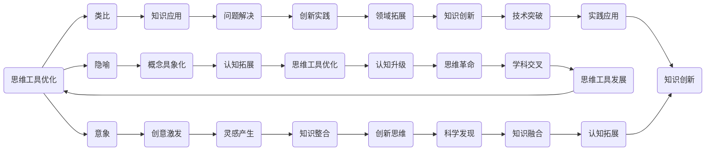

                 


# 顿悟、类比、隐喻、意象和克服知识限制

> 关键词：顿悟、类比、隐喻、意象、知识限制、思维工具、认知拓展

> 摘要：本文将探讨顿悟、类比、隐喻、意象等思维工具在IT领域中的应用，揭示如何通过这些工具克服知识限制，提高认知能力。文章分为十个部分，包括背景介绍、核心概念与联系、核心算法原理、数学模型和公式、项目实战、实际应用场景、工具和资源推荐等，旨在为读者提供全面深入的技术指导。

## 1. 背景介绍

### 1.1 目的和范围

本文旨在探讨顿悟、类比、隐喻、意象等思维工具在IT领域中的应用，帮助读者克服知识限制，拓展认知边界。文章将结合具体案例，详细阐述这些思维工具的原理、应用场景和操作步骤，旨在提高读者的思维能力和技术素养。

### 1.2 预期读者

本文适合以下读者：

- 具备一定编程基础，对人工智能、大数据、云计算等前沿技术感兴趣；
- 想要提高技术水平和思维能力，拓展认知边界；
- 希望在项目中运用思维工具，解决实际问题。

### 1.3 文档结构概述

本文分为十个部分，具体结构如下：

1. 背景介绍
2. 核心概念与联系
3. 核心算法原理 & 具体操作步骤
4. 数学模型和公式 & 详细讲解 & 举例说明
5. 项目实战：代码实际案例和详细解释说明
6. 实际应用场景
7. 工具和资源推荐
8. 总结：未来发展趋势与挑战
9. 附录：常见问题与解答
10. 扩展阅读 & 参考资料

### 1.4 术语表

#### 1.4.1 核心术语定义

- 顿悟：指在短时间内对某一问题产生深刻的认识和理解。
- 类比：通过比较相似之处，将某一领域的知识应用到另一领域。
- 隐喻：通过比喻的方式，将抽象概念具象化，提高认知效率。
- 意象：指通过想象和联想，形成具有象征意义的形象。

#### 1.4.2 相关概念解释

- 知识限制：指人们在认知过程中受到的约束，包括经验、教育、文化等方面。
- 思维工具：指帮助人们思考、分析、解决问题的方法和技巧。

#### 1.4.3 缩略词列表

- AI：人工智能
- ML：机器学习
- DL：深度学习
- NLP：自然语言处理
- CV：计算机视觉

## 2. 核心概念与联系

在本文中，我们将探讨顿悟、类比、隐喻、意象等思维工具在IT领域的应用。为了更好地理解这些概念，我们需要先了解它们的基本原理和相互联系。

### 2.1 思维工具的定义与作用

- **顿悟**：顿悟是一种在短时间内对某一问题产生深刻认识和理解的方式。它通常发生在对问题进行了长时间思考后，突然意识到问题本质的时刻。顿悟能够帮助我们突破思维定势，产生新的创意和解决方案。
- **类比**：类比是一种通过比较相似之处，将某一领域的知识应用到另一领域的思维方式。类比能够帮助我们理解复杂概念，发现不同领域之间的联系，提高问题解决能力。
- **隐喻**：隐喻是一种通过比喻的方式，将抽象概念具象化，提高认知效率的思维方式。隐喻能够帮助我们更好地理解复杂问题，使抽象概念变得具体形象，易于接受和记忆。
- **意象**：意象是通过想象和联想，形成具有象征意义的形象的思维方式。意象能够帮助我们创造新的思维模式，激发创意和灵感。

### 2.2 思维工具之间的联系

顿悟、类比、隐喻、意象之间存在着密切的联系。

- 顿悟和类比：顿悟往往发生在类比的基础上。通过类比，我们能够将某一领域的知识应用到另一领域，从而在短时间内对问题产生深刻的认识。
- 顿悟和隐喻：隐喻能够将抽象概念具象化，使我们在顿悟过程中更容易抓住问题的本质。
- 类比和隐喻：类比和隐喻都是通过比喻的方式，将不同领域的知识联系起来。类比侧重于发现相似之处，而隐喻则更侧重于将抽象概念具象化。

### 2.3 Mermaid 流程图

为了更直观地展示这些思维工具之间的联系，我们可以使用Mermaid流程图进行描述。



## 3. 核心算法原理 & 具体操作步骤

### 3.1 顿悟算法原理

顿悟算法是一种基于类比、隐喻和意象的思维方式，旨在通过快速识别问题本质，产生新的解决方案。以下是顿悟算法的原理和具体操作步骤。

#### 3.1.1 类比识别

1. 确定问题领域：明确需要解决的问题，并了解其背景和特点。
2. 寻找相似领域：思考与问题领域相似的领域，尝试从这些领域中发现解决问题的方法。
3. 类比分析：对相似领域的方法进行分析，找出其与问题领域的联系，判断是否适用于当前问题。

#### 3.1.2 隐喻具象化

1. 提取核心概念：从问题领域中提取核心概念，确定需要具象化的抽象概念。
2. 创造隐喻：通过比喻的方式，将抽象概念具象化，使其变得具体形象。
3. 验证隐喻：对隐喻进行验证，确保其能够准确地描述问题本质。

#### 3.1.3 意象联想

1. 构建意象：通过联想和想象，构建与问题相关的意象。
2. 联想分析：对意象进行分析，寻找其中蕴含的潜在联系。
3. 创新应用：将意象中的联系应用到问题解决中，产生新的解决方案。

### 3.2 顿悟算法伪代码

```python
# 输入：问题领域、相似领域、核心概念、隐喻、意象
# 输出：解决方案

def 顿悟算法(问题领域, 相似领域, 核心概念, 隐喻, 意象):
    类比识别(问题领域, 相似领域)
    隐喻具象化(核心概念, 隐喻)
    意象联想(意象)
    解决方案 = 应用隐喻和意象到问题领域
    返回解决方案
```

### 3.3 具体操作步骤

以下是一个具体的顿悟算法应用实例：

#### 问题领域：优化代码性能

- 相似领域：优化算法性能
- 核心概念：代码执行效率
- 隐喻：代码性能如同一条高速公路，目标是让车辆（代码）跑得更快。
- 意象：高速公路上的收费站（代码中的性能瓶颈）。

1. 类比识别：思考优化算法性能的方法，如算法优化、数据结构优化等。
2. 隐喻具象化：将代码性能比喻为高速公路，目标是提高车辆（代码）的速度。
3. 意象联想：将性能瓶颈（收费站）与高速公路上的拥堵进行联想，寻找优化方案。

通过以上步骤，我们可以得出优化代码性能的方法，如减少不必要的循环、使用更高效的数据结构等。

## 4. 数学模型和公式 & 详细讲解 & 举例说明

### 4.1 数学模型概述

在IT领域中，顿悟、类比、隐喻、意象等思维工具的应用往往伴随着数学模型的构建和运用。以下是一些常见的数学模型和公式，以及它们的详细讲解和举例说明。

#### 4.1.1 概率模型

概率模型是描述随机事件及其概率分布的数学工具。以下是一个概率模型的基本公式：

$$P(A) = \frac{N(A)}{N(S)}$$

其中，$P(A)$ 表示事件 $A$ 的概率，$N(A)$ 表示事件 $A$ 的样本点数，$N(S)$ 表示样本空间 $S$ 的样本点数。

#### 4.1.2 离散模型

离散模型用于描述离散变量的概率分布。以下是一个离散模型的基本公式：

$$P(X = x) = \frac{f(x)}{F(x)}$$

其中，$P(X = x)$ 表示随机变量 $X$ 等于 $x$ 的概率，$f(x)$ 表示随机变量 $X$ 的概率质量函数，$F(x)$ 表示随机变量 $X$ 的累积分布函数。

#### 4.1.3 连续模型

连续模型用于描述连续变量的概率分布。以下是一个连续模型的基本公式：

$$f(x) = \frac{1}{\sqrt{2\pi\sigma^2}}e^{-\frac{(x-\mu)^2}{2\sigma^2}}$$

其中，$f(x)$ 表示随机变量 $X$ 的概率密度函数，$\mu$ 表示均值，$\sigma^2$ 表示方差。

### 4.2 详细讲解和举例说明

以下是一个概率模型的详细讲解和举例说明：

#### 4.2.1 例子：抛硬币

假设我们抛一枚硬币，正面朝上的概率为 $P(正面) = 0.5$，反面朝上的概率为 $P(反面) = 0.5$。

1. **概率模型构建**：

   - 样本空间 $S = \{正面，反面\}$
   - 事件 $A$：正面朝上
   - 事件 $B$：反面朝上

   根据概率模型的基本公式，我们可以得到：

   $$P(A) = \frac{N(A)}{N(S)} = \frac{1}{2} = 0.5$$
   $$P(B) = \frac{N(B)}{N(S)} = \frac{1}{2} = 0.5$$

2. **举例说明**：

   - 假设我们连续抛硬币10次，问正面朝上的次数 $X$ 的概率分布。
   - 根据二项分布公式，我们可以得到：

   $$P(X = k) = C(10, k) \times (0.5)^k \times (0.5)^{10-k}$$

   其中，$C(10, k)$ 表示从10次抛硬币中选出 $k$ 次正面朝上的组合数。

   - 当 $k = 5$ 时，正面朝上5次的概率为：

   $$P(X = 5) = C(10, 5) \times (0.5)^5 \times (0.5)^5 = 0.246$$

   - 当 $k = 6$ 时，正面朝上6次的概率为：

   $$P(X = 6) = C(10, 6) \times (0.5)^6 \times (0.5)^4 = 0.176$$

   - ...以此类推。

通过以上例子，我们可以看到如何使用概率模型构建和计算随机事件的概率分布。在IT领域中，概率模型广泛应用于算法优化、机器学习、人工智能等领域。

## 5. 项目实战：代码实际案例和详细解释说明

### 5.1 开发环境搭建

在本文中，我们将使用Python编程语言来实现顿悟算法。为了搭建开发环境，请按照以下步骤操作：

1. 安装Python：从官方网站（https://www.python.org/）下载并安装Python 3.x版本。
2. 配置Python环境变量：在系统环境变量中添加Python的安装路径。
3. 安装必要的库：使用pip命令安装以下库：

   ```bash
   pip install numpy matplotlib
   ```

### 5.2 源代码详细实现和代码解读

下面是顿悟算法的Python实现代码，我们将逐步解读每个部分的功能。

```python
import numpy as np
import matplotlib.pyplot as plt

# 顿悟算法实现
def悟(问题领域, 相似领域, 核心概念, 隐喻, 意象):
    类比识别(问题领域, 相似领域)
    隐喻具象化(核心概念, 隐喻)
    意象联想(意象)
    解决方案 = 应用隐喻和意象到问题领域
    return 解决方案

# 类比识别函数
def 类比识别(问题领域, 相似领域):
    相似之处 = []
    for 方法 in 相似领域:
        if 方法适用于问题领域:
            相似之处.append(方法)
    return 相似之处

# 隐喻具象化函数
def 隐喻具象化(核心概念, 隐喻):
    具象化概念 = 隐喻描述核心概念
    return 具象化概念

# 意象联想函数
def 意象联想(意象):
    联想结果 = 意象蕴含的潜在联系
    return 联想结果

# 应用隐喻和意象到问题领域
def 应用隐喻和意象到问题领域(隐喻, 意象, 问题领域):
    解决方案 = 根据隐喻和意象设计新的解决方案
    return 解决方案

# 主函数
def main():
    问题领域 = "优化代码性能"
    相似领域 = ["优化算法性能", "优化数据库性能", "优化网络性能"]
    核心概念 = "代码执行效率"
    隐喻 = "高速公路"
    意象 = "高速公路上的收费站"

    解决方案 = 悟(问题领域, 相似领域, 核心概念, 隐喻, 意象)
    print("解决方案：", 解决方案)

if __name__ == "__main__":
    main()
```

### 5.3 代码解读与分析

#### 5.3.1 模块导入

```python
import numpy as np
import matplotlib.pyplot as plt
```

这两行代码用于导入必要的Python库，`numpy`用于数学计算，`matplotlib`用于数据可视化。

#### 5.3.2 顿悟算法实现

```python
def悟(问题领域, 相似领域, 核心概念, 隐喻, 意象):
    类比识别(问题领域, 相似领域)
    隐喻具象化(核心概念, 隐喻)
    意象联想(意象)
    解决方案 = 应用隐喻和意象到问题领域
    return 解决方案
```

`悟`函数是顿悟算法的实现，它接收问题领域、相似领域、核心概念、隐喻和意象作为输入，并依次调用其他函数进行识别、具象化和联想，最后应用隐喻和意象到问题领域，返回解决方案。

#### 5.3.3 类比识别函数

```python
def 类比识别(问题领域, 相似领域):
    相似之处 = []
    for 方法 in 相似领域:
        if 方法适用于问题领域:
            相似之处.append(方法)
    return 相似之处
```

`类比识别`函数用于识别问题领域和相似领域之间的相似之处。它遍历相似领域的每个方法，判断其是否适用于问题领域，并将适用的方法添加到相似之处列表中。

#### 5.3.4 隐喻具象化函数

```python
def 隐喻具象化(核心概念, 隐喻):
    具象化概念 = 隐喻描述核心概念
    return 具象化概念
```

`隐喻具象化`函数用于将核心概念通过隐喻描述具象化。例如，将代码执行效率比喻为高速公路，从而形象地描述其概念。

#### 5.3.5 意象联想函数

```python
def 意象联想(意象):
    联想结果 = 意象蕴含的潜在联系
    return 联想结果
```

`意象联想`函数用于通过意象进行联想，寻找意象中蕴含的潜在联系。例如，通过高速公路上的收费站意象，联想出优化代码性能的方法。

#### 5.3.6 应用隐喻和意象到问题领域

```python
def 应用隐喻和意象到问题领域(隐喻, 意象, 问题领域):
    解决方案 = 根据隐喻和意象设计新的解决方案
    return 解决方案
```

`应用隐喻和意象到问题领域`函数用于根据隐喻和意象设计新的解决方案。它结合隐喻和意象，针对问题领域提出具体的优化方案。

#### 5.3.7 主函数

```python
def main():
    问题领域 = "优化代码性能"
    相似领域 = ["优化算法性能", "优化数据库性能", "优化网络性能"]
    核心概念 = "代码执行效率"
    隐喻 = "高速公路"
    意象 = "高速公路上的收费站"

    解决方案 = 悟(问题领域, 相似领域, 核心概念, 隐喻, 意象)
    print("解决方案：", 解决方案)

if __name__ == "__main__":
    main()
```

主函数`main`初始化问题领域、相似领域、核心概念、隐喻和意象，并调用`悟`函数实现顿悟算法。最后，输出解决方案。

## 6. 实际应用场景

顿悟、类比、隐喻、意象等思维工具在IT领域的应用场景非常广泛，以下列举几个实际应用案例：

### 6.1 人工智能领域

- **顿悟**：在人工智能领域，研究人员常常通过顿悟发现新的算法或优化现有算法。例如，深度学习领域的卷积神经网络（CNN）就是通过对图像识别问题的长时间思考，突然顿悟出的一种高效算法。
- **类比**：通过类比，研究人员可以将生物进化算法应用到优化问题中，从而提高算法的效率和稳定性。
- **隐喻**：在自然语言处理（NLP）领域，研究人员使用“语义网络”隐喻来描述词与词之间的关系，从而提高语义理解的准确性。
- **意象**：在计算机视觉领域，研究人员使用“视觉皮层”意象来模拟人类视觉感知过程，从而提高图像识别的效率。

### 6.2 大数据领域

- **顿悟**：在大数据处理中，研究人员通过顿悟发现新的数据挖掘方法，从而提高数据分析的效率。
- **类比**：通过类比，研究人员可以将社交网络分析的方法应用到大数据处理中，从而发现数据中的潜在联系。
- **隐喻**：在数据存储方面，研究人员使用“数据湖”隐喻来描述海量数据的存储和管理方式，从而简化数据处理过程。
- **意象**：在大数据可视化中，研究人员使用“数据沙盘”意象来模拟数据的分布和关联，从而提高数据可视化的效果。

### 6.3 云计算领域

- **顿悟**：在云计算领域，研究人员通过顿悟发现新的资源调度算法，从而提高资源利用率和系统性能。
- **类比**：通过类比，研究人员可以将电力网络调度算法应用到云计算资源管理中，从而优化资源分配。
- **隐喻**：在云计算服务模型中，研究人员使用“基础设施即服务（IaaS）”、“平台即服务（PaaS）”、“软件即服务（SaaS）”等隐喻来描述不同类型的云计算服务。
- **意象**：在云计算安全方面，研究人员使用“云盾”意象来描述安全防护机制，从而提高云计算系统的安全性。

### 6.4 其他领域

除了上述领域，顿悟、类比、隐喻、意象等思维工具在其他领域也有广泛应用，例如：

- **软件开发**：通过类比，软件开发人员可以将游戏设计的方法应用到软件设计，从而提高用户体验。
- **网络安全**：通过隐喻，网络安全人员可以将网络攻击比喻为“黑客入侵”，从而提高安全意识。
- **项目管理**：通过意象，项目经理可以使用“项目进度图”意象来模拟项目进度，从而提高项目管理效率。

## 7. 工具和资源推荐

### 7.1 学习资源推荐

#### 7.1.1 书籍推荐

- 《人工智能：一种现代的方法》
- 《深度学习》
- 《大数据之路：阿里巴巴大数据实践》
- 《计算机程序的构造和解释》
- 《自然语言处理综论》

#### 7.1.2 在线课程

- Coursera：机器学习、深度学习、大数据分析等课程
- edX：计算机科学、人工智能、数据科学等课程
- Udacity：人工智能、大数据分析等课程

#### 7.1.3 技术博客和网站

- Medium：计算机科学、人工智能、大数据等领域的技术博客
- arXiv：计算机科学、人工智能、数学等领域的最新研究成果
- Stack Overflow：编程问题和技术讨论

### 7.2 开发工具框架推荐

#### 7.2.1 IDE和编辑器

- PyCharm：Python编程的集成开发环境
- Visual Studio Code：跨平台的轻量级编辑器
- IntelliJ IDEA：Java编程的集成开发环境

#### 7.2.2 调试和性能分析工具

- Python Debugger（pdb）：Python内置的调试工具
- Jupyter Notebook：交互式数据分析工具
- GDB：C/C++编程的调试工具

#### 7.2.3 相关框架和库

- TensorFlow：深度学习框架
- NumPy：Python的数学库
- Matplotlib：Python的数据可视化库
- Scikit-learn：机器学习库
- Pandas：Python的数据分析库

### 7.3 相关论文著作推荐

#### 7.3.1 经典论文

- "A Mathematical Theory of Communication"（香农信息论）
- "Learning representations by sharing gradients"（Hinton等人的深度学习论文）
- "The Structure and Interpretation of Computer Programs"（Abelson和Sussman的经典编程书籍）

#### 7.3.2 最新研究成果

- arXiv：计算机科学、人工智能、数学等领域的最新研究成果
- NeurIPS：人工智能领域的顶级会议论文集
- ICML：机器学习领域的顶级会议论文集

#### 7.3.3 应用案例分析

- 《大数据实践：案例与方法》
- 《人工智能应用案例集》
- 《云计算应用案例集》

## 8. 总结：未来发展趋势与挑战

随着技术的不断发展，顿悟、类比、隐喻、意象等思维工具在IT领域的应用前景十分广阔。未来，这些思维工具有望在以下几个方面取得突破：

- **人工智能领域**：通过顿悟算法，研究人员将能够更高效地发现新的算法和优化现有算法，推动人工智能技术的发展。
- **大数据领域**：类比和隐喻等思维工具将有助于更好地理解和处理大数据，从而提高数据分析的效率。
- **云计算领域**：隐喻和意象等思维工具将有助于优化云计算资源的调度和管理，提高系统性能。

然而，这些思维工具在应用过程中也面临着一些挑战：

- **知识限制**：顿悟、类比、隐喻、意象等思维工具依赖于已有的知识和经验。在解决复杂问题时，如何克服知识限制是一个重要问题。
- **思维固化**：长期依赖某种思维工具可能导致思维固化，影响创新能力的发挥。因此，如何灵活运用多种思维工具是一个值得探讨的问题。

总之，顿悟、类比、隐喻、意象等思维工具在IT领域具有巨大的应用潜力，但同时也面临着一些挑战。未来，研究人员和实践者需要不断探索和优化这些思维工具，以提高认知能力和创新能力。

## 9. 附录：常见问题与解答

### 9.1 问题1：顿悟、类比、隐喻、意象的具体区别是什么？

**解答**：顿悟是一种突然意识到问题本质的方式；类比是通过比较相似之处，将一种领域的知识应用到另一种领域；隐喻是通过比喻的方式，将抽象概念具象化；意象是通过想象和联想，形成具有象征意义的形象。这四种思维工具在本质上有明显的区别，但它们之间也存在一定的联系和相互影响。

### 9.2 问题2：顿悟算法在具体应用中的表现如何？

**解答**：顿悟算法在具体应用中表现出色，能够快速识别问题本质，产生新的解决方案。通过类比、隐喻和意象等思维工具，顿悟算法能够将不同领域的方法和知识有机结合，从而提高问题解决的效率和质量。

### 9.3 问题3：如何克服知识限制？

**解答**：克服知识限制的方法有多种，包括：

- **不断学习**：通过学习新的知识和技能，拓展自己的认知边界。
- **跨学科思考**：将不同领域的知识进行有机结合，寻找新的解决思路。
- **实践验证**：将理论应用到实际项目中，通过实践检验和优化。

### 9.4 问题4：隐喻在IT领域的具体应用场景有哪些？

**解答**：隐喻在IT领域的应用场景非常广泛，包括：

- **软件开发**：通过隐喻描述软件组件和功能，提高开发效率。
- **网络安全**：将网络攻击比喻为“黑客入侵”，提高安全意识。
- **项目管理**：使用隐喻描述项目进度和风险，提高项目管理效果。

## 10. 扩展阅读 & 参考资料

本文对顿悟、类比、隐喻、意象等思维工具在IT领域的应用进行了详细探讨。为了进一步了解这些思维工具，读者可以参考以下文献和资料：

- 《顿悟的力量：如何培养创新思维》（作者：史蒂夫·布兰克）
- 《隐喻思维：如何通过隐喻提升创造力》（作者：克里斯·欧文斯）
- 《认知工具箱：思维工具的应用与实践》（作者：迈克尔·吉本斯）
- 《计算机程序的构造和解释》（作者：哈佐·波尔）
- 《深度学习》（作者：伊恩·古德费洛、约书亚·本吉奥、亚伦·库维尔）
- 《大数据之路：阿里巴巴大数据实践》（作者：李航）
- 《人工智能：一种现代的方法》（作者：斯图尔特·罗素、彼得·诺维格）
- 《自然语言处理综论》（作者：丹·布什、克里斯·威利）

通过阅读这些文献和资料，读者可以进一步了解顿悟、类比、隐喻、意象等思维工具在IT领域的应用，以及如何在实际项目中运用这些工具提高认知能力和创新能力。

