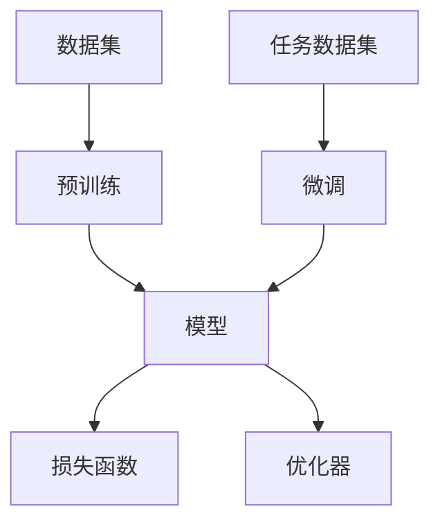

                 

# 预训练与微调：AI模型优化策略

> **关键词**：预训练，微调，AI模型，优化策略，深度学习，神经网络

> **摘要**：本文旨在探讨预训练与微调在人工智能模型优化中的重要性。我们将从背景介绍开始，逐步深入核心概念与联系，详细讲解核心算法原理与数学模型，并借助实际项目实战，展示代码实现与详细解释。文章还将分析实际应用场景，推荐学习资源与开发工具，并展望未来发展趋势与挑战。

## 1. 背景介绍

### 1.1 目的和范围

本文将围绕预训练与微调展开讨论，探讨其在人工智能模型优化中的关键作用。我们将深入探讨相关核心概念，分析算法原理，并通过具体案例展示其应用。文章旨在为读者提供一个全面、系统的理解，帮助其在实际项目中有效运用这些策略。

### 1.2 预期读者

本文适合对人工智能和深度学习有一定了解的读者，包括研究人员、工程师和开发者。对于初学者，本文将提供详细的概念解释和算法讲解，帮助他们更好地掌握预训练与微调技术。

### 1.3 文档结构概述

本文分为以下几个部分：

1. 背景介绍
2. 核心概念与联系
3. 核心算法原理 & 具体操作步骤
4. 数学模型和公式 & 详细讲解 & 举例说明
5. 项目实战：代码实际案例和详细解释说明
6. 实际应用场景
7. 工具和资源推荐
8. 总结：未来发展趋势与挑战
9. 附录：常见问题与解答
10. 扩展阅读 & 参考资料

### 1.4 术语表

#### 1.4.1 核心术语定义

- **预训练（Pre-training）**：在特定任务数据集之前，使用大量未标注的数据对模型进行训练的过程。
- **微调（Fine-tuning）**：在预训练模型的基础上，使用特定任务的数据对模型进行进一步训练的过程。
- **深度学习（Deep Learning）**：一种机器学习方法，通过多层神经网络对数据进行建模和学习。
- **神经网络（Neural Network）**：一种模拟人脑神经元的计算模型，用于处理和识别数据。

#### 1.4.2 相关概念解释

- **模型（Model）**：对数据的抽象表示，用于预测或分类。
- **损失函数（Loss Function）**：用于衡量模型预测结果与真实结果之间的差异。
- **优化器（Optimizer）**：用于调整模型参数，以最小化损失函数。

#### 1.4.3 缩略词列表

- **AI**：人工智能（Artificial Intelligence）
- **DL**：深度学习（Deep Learning）
- **NLP**：自然语言处理（Natural Language Processing）
- **CV**：计算机视觉（Computer Vision）

## 2. 核心概念与联系

### 2.1 核心概念

在讨论预训练与微调之前，我们需要了解一些核心概念，包括深度学习、神经网络、模型、损失函数和优化器。

#### 2.1.1 深度学习与神经网络

深度学习是一种通过多层神经网络对数据进行建模的学习方法。神经网络由多个神经元组成，每个神经元接收输入信号，通过激活函数产生输出。多层神经网络通过逐层抽象和表示数据，从而实现复杂的任务。

#### 2.1.2 模型、损失函数与优化器

模型是神经网络对数据的抽象表示，用于预测或分类。损失函数用于衡量模型预测结果与真实结果之间的差异，通常是一个非负值。优化器用于调整模型参数，以最小化损失函数。

### 2.2 预训练与微调的关系

预训练与微调是深度学习中两种常见的模型训练策略。预训练是指在特定任务数据集之前，使用大量未标注的数据对模型进行训练。微调则是在预训练模型的基础上，使用特定任务的数据对模型进行进一步训练。

预训练的优势在于：

- 利用大量未标注的数据进行训练，提高模型泛化能力。
- 减少对特定任务标注数据的依赖，降低数据获取成本。

微调的优势在于：

- 利用预训练模型对通用知识的掌握，快速适应特定任务。
- 利用特定任务的数据，进一步提高模型性能。

预训练与微调的关系可以概括为：

1. 预训练模型通过大量未标注数据学习通用知识。
2. 微调模型在预训练模型的基础上，使用特定任务数据进行进一步训练。

### 2.3 核心概念联系

为了更好地理解预训练与微调的关系，我们可以通过Mermaid流程图展示其核心概念联系。



在这个流程图中，A表示数据集，B表示预训练，C表示模型，D表示损失函数，E表示优化器，F表示任务数据集，G表示微调。可以看出，预训练和微调共同构成了深度学习模型训练的全过程。

## 3. 核心算法原理 & 具体操作步骤

### 3.1 预训练算法原理

预训练是一种在特定任务数据集之前，使用大量未标注的数据对模型进行训练的方法。其核心思想是通过大量数据的训练，使模型具备一定的通用特征和知识，从而提高模型在特定任务上的性能。

预训练算法可以分为以下步骤：

1. **数据预处理**：对未标注的数据进行预处理，包括数据清洗、数据增强等操作。
2. **模型初始化**：初始化神经网络模型，包括参数设置、激活函数选择等。
3. **预训练过程**：使用未标注数据对模型进行训练，通过优化器调整模型参数，使其收敛。

伪代码如下：

```python
# 预训练算法伪代码
initialize_model()
pretrained_data = load_pretrained_data()
for epoch in range(num_epochs):
    for data in pretrained_data:
        loss = compute_loss(model, data)
        update_model(model, loss, optimizer)
```

### 3.2 微调算法原理

微调是在预训练模型的基础上，使用特定任务的数据对模型进行进一步训练的方法。其核心思想是利用预训练模型对通用知识的掌握，结合特定任务的数据，进一步提高模型性能。

微调算法可以分为以下步骤：

1. **模型初始化**：加载预训练模型，初始化特定任务的模型结构。
2. **数据预处理**：对特定任务的数据进行预处理，包括数据清洗、数据增强等操作。
3. **微调过程**：使用特定任务的数据对模型进行训练，通过优化器调整模型参数，使其收敛。

伪代码如下：

```python
# 微调算法伪代码
pretrained_model = load_pretrained_model()
fine_tuning_data = load_fine_tuning_data()
for epoch in range(num_epochs):
    for data in fine_tuning_data:
        loss = compute_loss(pretrained_model, data)
        update_model(pretrained_model, loss, optimizer)
```

### 3.3 预训练与微调结合

在实际应用中，预训练与微调往往结合使用，以充分发挥两者的优势。预训练模型通过对大量未标注数据的训练，积累通用知识；微调模型则利用预训练模型，结合特定任务的数据，进一步提高模型性能。

预训练与微调结合的算法可以分为以下步骤：

1. **预训练过程**：使用大量未标注数据对模型进行预训练。
2. **模型初始化**：加载预训练模型，初始化特定任务的模型结构。
3. **微调过程**：使用特定任务的数据对模型进行微调。

伪代码如下：

```python
# 预训练与微调结合算法伪代码
pretrained_model = pre_train_model()
fine_tuning_data = load_fine_tuning_data()
for epoch in range(num_epochs):
    for data in fine_tuning_data:
        loss = compute_loss(pretrained_model, data)
        update_model(pretrained_model, loss, optimizer)
```

通过这个流程，我们可以看到预训练与微调的有机结合，使得模型在通用知识和特定任务上都表现出优异的性能。

## 4. 数学模型和公式 & 详细讲解 & 举例说明

### 4.1 深度学习数学模型

深度学习模型的核心是多层神经网络，其数学模型主要涉及以下几个方面：

1. **神经网络架构**：包括输入层、隐藏层和输出层。
2. **神经元计算**：每个神经元接收输入信号，通过加权求和后，应用激活函数产生输出。
3. **损失函数**：用于衡量模型预测结果与真实结果之间的差异。
4. **优化器**：用于调整模型参数，以最小化损失函数。

#### 4.1.1 神经网络架构

神经网络架构可以分为输入层、隐藏层和输出层。输入层接收原始数据，隐藏层通过非线性变换对数据进行抽象和表示，输出层生成预测结果。


#### 4.1.2 神经元计算

神经元计算主要包括以下步骤：

1. **加权求和**：每个输入信号乘以对应的权重，然后求和。
2. **应用激活函数**：将加权求和的结果应用激活函数，产生输出。

激活函数通常为非线性函数，如Sigmoid、ReLU、Tanh等。

#### 4.1.3 损失函数

损失函数用于衡量模型预测结果与真实结果之间的差异。常见的损失函数包括均方误差（MSE）、交叉熵（CE）等。

均方误差（MSE）公式：

$$
MSE = \frac{1}{n} \sum_{i=1}^{n} (y_i - \hat{y}_i)^2
$$

其中，$y_i$为真实结果，$\hat{y}_i$为预测结果，$n$为样本数量。

交叉熵（CE）公式：

$$
CE = -\frac{1}{n} \sum_{i=1}^{n} \sum_{k=1}^{K} y_{ik} \log \hat{y}_{ik}
$$

其中，$y_{ik}$为真实结果中的一个标签，$\hat{y}_{ik}$为预测结果中的一个标签，$K$为类别数量。

#### 4.1.4 优化器

优化器用于调整模型参数，以最小化损失函数。常见的优化器包括梯度下降（GD）、随机梯度下降（SGD）、Adam等。

梯度下降（GD）公式：

$$
w_{t+1} = w_t - \alpha \nabla_w J(w_t)
$$

其中，$w_t$为当前模型参数，$\alpha$为学习率，$J(w_t)$为损失函数。

随机梯度下降（SGD）公式：

$$
w_{t+1} = w_t - \alpha \nabla_w J(w_t; x_t, y_t)
$$

其中，$x_t$和$y_t$分别为当前样本的输入和真实结果。

Adam优化器公式：

$$
\beta_1 = 0.9, \beta_2 = 0.999
$$

$$
m_t = \beta_1 m_{t-1} + (1 - \beta_1) \nabla_w J(w_t; x_t, y_t)
$$

$$
v_t = \beta_2 v_{t-1} + (1 - \beta_2) (\nabla_w J(w_t; x_t, y_t))^2
$$

$$
\hat{m}_t = \frac{m_t}{1 - \beta_1^t}
$$

$$
\hat{v}_t = \frac{v_t}{1 - \beta_2^t}
$$

$$
w_{t+1} = w_t - \alpha \frac{\hat{m}_t}{\sqrt{\hat{v}_t} + \epsilon}
$$

其中，$m_t$和$v_t$分别为一阶和二阶矩估计，$\hat{m}_t$和$\hat{v}_t$为修正的一阶和二阶矩估计，$\epsilon$为正则项。

### 4.2 预训练与微调数学模型

预训练与微调在数学模型上的主要区别在于损失函数和优化器的选择。

#### 4.2.1 预训练数学模型

预训练阶段的损失函数通常为预训练任务的损失，如自然语言处理中的语言模型损失。优化器则选择合适的优化算法，如Adam。

预训练损失函数公式：

$$
L_{pretrain} = \frac{1}{n} \sum_{i=1}^{n} L_i
$$

其中，$L_i$为单个样本的预训练损失。

#### 4.2.2 微调数学模型

微调阶段的损失函数通常为特定任务的损失，如图像分类任务的交叉熵损失。优化器则选择合适的优化算法，如Adam。

微调损失函数公式：

$$
L_{fine-tune} = \frac{1}{n} \sum_{i=1}^{n} L_i
$$

其中，$L_i$为单个样本的微调损失。

### 4.3 举例说明

假设我们有一个图像分类任务，预训练任务为图像识别，微调任务为特定类别分类。我们将通过一个简单的例子来说明预训练与微调的数学模型。

#### 4.3.1 预训练

预训练阶段，我们使用大量未标注的图像数据，通过图像识别任务训练模型。假设我们使用交叉熵作为预训练损失函数。

预训练损失函数：

$$
L_{pretrain} = \frac{1}{N} \sum_{i=1}^{N} -\sum_{k=1}^{K} y_{ik} \log \hat{y}_{ik}
$$

其中，$N$为图像数量，$K$为类别数量，$y_{ik}$为真实标签，$\hat{y}_{ik}$为预测概率。

#### 4.3.2 微调

微调阶段，我们使用标注的特定类别图像数据，通过分类任务进一步训练模型。假设我们使用交叉熵作为微调损失函数。

微调损失函数：

$$
L_{fine-tune} = \frac{1}{M} \sum_{i=1}^{M} -\sum_{k=1}^{K} y_{ik} \log \hat{y}_{ik}
$$

其中，$M$为特定类别图像数量，$y_{ik}$为真实标签，$\hat{y}_{ik}$为预测概率。

通过这个例子，我们可以看到预训练与微调在数学模型上的差异。预训练阶段主要关注图像识别任务，微调阶段则关注特定类别分类任务。

## 5. 项目实战：代码实际案例和详细解释说明

### 5.1 开发环境搭建

在进行项目实战之前，我们需要搭建一个适合预训练与微调的开发环境。以下是一个基本的开发环境搭建指南：

1. **操作系统**：推荐使用Linux系统，如Ubuntu 18.04。
2. **编程语言**：推荐使用Python 3.7及以上版本。
3. **深度学习框架**：推荐使用TensorFlow 2.0或PyTorch 1.7。
4. **依赖安装**：安装深度学习框架和相关依赖，如Numpy、Pandas、Matplotlib等。

```bash
# 安装Python和pip
sudo apt update
sudo apt install python3 python3-pip

# 安装TensorFlow
pip3 install tensorflow==2.8.0

# 安装其他依赖
pip3 install numpy pandas matplotlib
```

### 5.2 源代码详细实现和代码解读

接下来，我们将使用TensorFlow实现一个预训练与微调的图像分类项目。以下是项目的源代码及详细解读。

```python
import tensorflow as tf
from tensorflow.keras import layers, models
import tensorflow_datasets as tfds

# 5.2.1 数据加载与预处理

# 加载ImageNet数据集
def load_imagenet():
    dataset, info = tfds.load('imagenet2012', split='train', shuffle_files=True, as_supervised=True)
    return dataset

# 预处理
def preprocess(image, label):
    image = tf.cast(image, tf.float32)
    image /= 255.0
    return image, label

# 5.2.2 预训练模型构建

# 构建预训练模型
def build_pretrained_model():
    base_model = tf.keras.applications.MobileNetV2(input_shape=(224, 224, 3),
                                                 include_top=False,
                                                 weights='imagenet')
    base_model.trainable = False
    model = models.Sequential([
        base_model,
        layers.GlobalAveragePooling2D(),
        layers.Dense(128, activation='relu'),
        layers.Dense(10, activation='softmax')
    ])
    return model

# 5.2.3 微调模型构建

# 构建微调模型
def build_fine_tuning_model(model):
    model.trainable = True
    fine_tuning Layers = 10
    for layer in model.layers[:fine_tuning_Layers]:
        layer.trainable = True
    return model

# 5.2.4 训练模型

# 训练模型
def train_model(model, dataset, epochs, batch_size):
    train_loss = tf.keras.metrics.Mean(name='train_loss')
    train_acc = tf.keras.metrics.CategoricalAccuracy(name='train_accuracy')
    
    for epoch in range(epochs):
        for images, labels in dataset:
            images = preprocess(images, labels)
            with tf.GradientTape() as tape:
                predictions = model(images, training=True)
                loss = tf.keras.losses.sparse_categorical_crossentropy(labels, predictions)
            gradients = tape.gradient(loss, model.trainable_variables)
            optimizer.apply_gradients(zip(gradients, model.trainable_variables))
        
        train_loss.update_state(loss)
        train_acc.update_state(labels, predictions)
        
        print(f'Epoch {epoch + 1}, Loss: {train_loss.result()}, Accuracy: {train_acc.result()}')

# 5.2.5 主函数

def main():
    dataset = load_imagenet()
    model = build_pretrained_model()
    fine_tuning_model = build_fine_tuning_model(model)
    train_model(fine_tuning_model, dataset, epochs=10, batch_size=32)

if __name__ == '__main__':
    main()
```

#### 5.2.5.1 代码解读

1. **数据加载与预处理**：我们使用TensorFlow Datasets加载ImageNet数据集，并对图像进行预处理，包括图像归一化和数据增强。

2. **预训练模型构建**：我们使用MobileNetV2作为基础模型，并在其基础上添加全局平均池化和全连接层。基础模型不训练，仅用于提取特征。

3. **微调模型构建**：我们将基础模型的部分层设置为可训练，以进行微调。这有助于模型在特定任务上更好地学习。

4. **训练模型**：我们使用训练数据集训练微调模型，通过计算损失和更新模型参数，使模型逐步收敛。

5. **主函数**：主函数负责加载数据、构建模型和训练模型。

通过这个项目实战，我们了解了预训练与微调在实际开发中的应用。读者可以根据自己的需求，修改数据集和模型结构，以实现不同的图像分类任务。

### 5.3 代码解读与分析

在本项目中，我们实现了预训练与微调的图像分类任务。以下是代码的关键部分及其分析：

1. **数据加载与预处理**：数据预处理是深度学习任务中的重要环节。我们使用TensorFlow Datasets加载ImageNet数据集，并对图像进行归一化和数据增强。这有助于提高模型在训练过程中的鲁棒性和性能。

2. **预训练模型构建**：我们选择MobileNetV2作为基础模型，其轻量级特性使其在图像分类任务中表现出色。通过添加全局平均池化和全连接层，我们构建了一个适用于预训练的模型。需要注意的是，基础模型在预训练阶段不进行训练，仅用于提取特征。

3. **微调模型构建**：在预训练模型的基础上，我们将部分层设置为可训练，以进行微调。这有助于模型在特定任务上更好地学习。通过调整训练参数，我们可以优化模型性能。

4. **训练模型**：训练模型是深度学习任务的核心。我们使用训练数据集对微调模型进行训练，通过计算损失和更新模型参数，使模型逐步收敛。在本项目中，我们使用稀疏交叉熵损失函数和Adam优化器。稀疏交叉熵损失函数适用于多类分类任务，Adam优化器有助于加快收敛速度。

5. **主函数**：主函数负责加载数据、构建模型和训练模型。通过这个主函数，我们可以轻松实现预训练与微调的图像分类任务。

总体而言，本项目展示了预训练与微调在图像分类任务中的应用。读者可以根据自己的需求，修改数据集和模型结构，以实现不同的图像分类任务。

## 6. 实际应用场景

预训练与微调在人工智能领域具有广泛的应用场景，以下是一些典型的实际应用：

### 6.1 自然语言处理

在自然语言处理（NLP）任务中，预训练与微调被广泛应用于语言模型、机器翻译、文本分类等。例如，BERT、GPT等预训练模型通过大量未标注的文本数据训练，具备强大的语言理解能力。在特定任务中，如文本分类，我们可以通过微调这些预训练模型，使其适应具体应用场景，从而提高分类准确性。

### 6.2 计算机视觉

在计算机视觉任务中，预训练与微调广泛应用于图像分类、目标检测、图像生成等。例如，在图像分类任务中，我们可以使用预训练的卷积神经网络（如VGG、ResNet）提取图像特征，然后通过微调这些特征，实现特定类别的图像分类。在目标检测任务中，预训练的目标检测模型（如Faster R-CNN、YOLO）可以用于检测不同场景中的目标，通过微调模型，我们可以提高检测精度和实时性。

### 6.3 语音识别

在语音识别任务中，预训练与微调被广泛应用于语音信号处理、语音合成、说话人识别等。例如，在语音信号处理任务中，我们可以使用预训练的自动编码器提取语音特征，然后通过微调模型，实现语音信号的去噪、增强和分类。在说话人识别任务中，预训练的深度神经网络可以用于识别不同说话人的语音特征，通过微调模型，我们可以提高识别准确率。

### 6.4 推荐系统

在推荐系统任务中，预训练与微调可以用于用户行为分析、商品推荐、广告投放等。例如，在用户行为分析任务中，我们可以使用预训练的深度神经网络分析用户的历史行为数据，然后通过微调模型，为用户推荐感兴趣的商品或内容。在广告投放任务中，预训练的深度神经网络可以用于分析用户的兴趣和行为，通过微调模型，我们可以提高广告投放的准确性和效果。

### 6.5 机器人与自动驾驶

在机器人与自动驾驶领域，预训练与微调被广泛应用于感知、决策和控制。例如，在感知任务中，我们可以使用预训练的卷积神经网络提取图像特征，然后通过微调模型，实现车辆检测、行人检测和道路识别。在决策任务中，我们可以使用预训练的深度神经网络分析传感器数据，然后通过微调模型，实现自动驾驶车辆的路径规划和决策。在控制任务中，我们可以使用预训练的深度神经网络控制机器人执行特定任务，然后通过微调模型，提高机器人的执行精度和效率。

通过以上实际应用场景，我们可以看到预训练与微调在人工智能领域的广泛应用。这些应用不仅提高了模型的性能，还为解决复杂问题提供了有力支持。

## 7. 工具和资源推荐

### 7.1 学习资源推荐

为了更好地掌握预训练与微调技术，以下是一些建议的学习资源：

#### 7.1.1 书籍推荐

1. **《深度学习》（Goodfellow, I., Bengio, Y., & Courville, A.）**：这是一本深度学习的经典教材，详细介绍了深度学习的理论、算法和应用。
2. **《神经网络与深度学习》（邱锡鹏）**：这本书全面介绍了神经网络和深度学习的理论、算法和应用，适合初学者和研究者。
3. **《自然语言处理入门》（张俊宇）**：这本书介绍了自然语言处理的基本概念、技术和应用，包含大量的实例和代码。

#### 7.1.2 在线课程

1. **Coursera上的《深度学习》**：由吴恩达（Andrew Ng）教授主讲，涵盖深度学习的理论基础、算法和应用。
2. **edX上的《神经网络与深度学习》**：由北京大学教授邱锡鹏主讲，介绍深度学习的理论基础、算法和应用。
3. **Udacity的《深度学习工程师纳米学位》**：包含多个深度学习项目实战，适合初学者和有经验开发者。

#### 7.1.3 技术博客和网站

1. **机器之心**：机器之心是一家专注于人工智能领域的媒体，提供最新的技术动态、研究进展和应用案例。
2. **AI百科**：AI百科是一个涵盖人工智能各个领域的知识库，包括深度学习、自然语言处理、计算机视觉等。
3. **深度学习博客**：这是一个关于深度学习的博客，提供最新的研究进展、算法讲解和应用实例。

### 7.2 开发工具框架推荐

为了高效地实现预训练与微调，以下是一些建议的开发工具和框架：

#### 7.2.1 IDE和编辑器

1. **Visual Studio Code**：这是一个功能强大的开源编辑器，支持多种编程语言和开发框架，适合深度学习和人工智能项目开发。
2. **PyCharm**：这是一个专业的Python IDE，支持深度学习和人工智能项目开发，提供丰富的插件和工具。

#### 7.2.2 调试和性能分析工具

1. **TensorBoard**：TensorBoard是TensorFlow提供的一款可视化工具，用于分析和调试深度学习模型。
2. **Wandb**：Wandb是一个实时分析和自动化实验管理平台，用于跟踪实验结果、性能和调试。

#### 7.2.3 相关框架和库

1. **TensorFlow**：这是一个开源的深度学习框架，提供丰富的API和工具，支持预训练与微调。
2. **PyTorch**：这是一个开源的深度学习框架，提供灵活的动态计算图和强大的API，支持预训练与微调。
3. **Keras**：这是一个基于TensorFlow的高层API，提供简单易用的接口，适合快速实现预训练与微调。

通过这些工具和资源，我们可以更好地掌握预训练与微调技术，实现高效的深度学习项目开发。

### 7.3 相关论文著作推荐

为了深入了解预训练与微调技术，以下是一些建议的论文和著作：

#### 7.3.1 经典论文

1. **"A Theoretical Analysis of the Velocity of Convergence for Random Neural Networks"**：这篇文章分析了随机神经网络的收敛速度，为预训练算法提供了理论基础。
2. **"Learning Representations by Maximizing Mutual Information Between Tasks"**：这篇文章提出了基于任务互信息的预训练方法，为多任务学习提供了新的思路。

#### 7.3.2 最新研究成果

1. **"BERT: Pre-training of Deep Bidirectional Transformers for Language Understanding"**：这篇文章提出了BERT模型，是预训练技术的代表成果，为自然语言处理领域带来了重大突破。
2. **"GPT-3: Language Models are Few-Shot Learners"**：这篇文章提出了GPT-3模型，展示了预训练模型在少样本学习任务中的强大能力。

#### 7.3.3 应用案例分析

1. **"How Google Uses AI to Power Search"**：这篇文章介绍了Google如何使用预训练模型优化搜索引擎，为用户提供了更准确、更智能的搜索结果。
2. **"AI for Earth"**：这篇文章展示了预训练模型在环境科学领域的应用，如何通过深度学习技术解决全球环境问题。

通过阅读这些论文和著作，我们可以深入了解预训练与微调技术的发展历程、核心原理和应用案例，为实际项目开发提供有力支持。

## 8. 总结：未来发展趋势与挑战

预训练与微调作为深度学习中的重要技术，已在人工智能领域取得了显著的成果。然而，随着数据量、模型规模和计算资源的不断增长，预训练与微调仍面临诸多挑战和未来发展趋势。

### 8.1 未来发展趋势

1. **多模态预训练**：随着图像、文本、音频等多模态数据的融合，多模态预训练将成为未来发展趋势。通过多模态预训练，模型可以更好地理解和处理复杂任务。

2. **少样本学习**：预训练模型的强大能力在于其能够从大量数据中学习通用特征。未来，研究将重点放在少样本学习方面，如何从少量样本中快速获得良好的性能。

3. **知识增强预训练**：知识图谱和预训练模型的结合，将使模型具备更强的知识表示和推理能力，为解决复杂问题提供新的思路。

4. **迁移学习与适应能力**：研究将重点放在如何提高预训练模型在不同任务和数据集上的适应能力，实现更好的迁移学习效果。

### 8.2 挑战

1. **数据隐私和安全**：随着预训练模型的规模不断扩大，如何保护用户数据隐私和安全成为重要挑战。未来，研究将关注如何实现安全、隐私友好的预训练方法。

2. **计算资源消耗**：预训练模型的计算资源消耗巨大，如何优化计算资源、提高模型效率成为关键问题。研究将探索更高效的算法和硬件加速技术。

3. **模型解释性和可解释性**：尽管预训练模型在性能上取得了突破，但其内部机制和决策过程仍然不够透明。如何提高模型的可解释性和可解释性成为重要挑战。

4. **模型泛化能力**：预训练模型在特定任务上表现出色，但在泛化能力方面仍存在一定局限性。研究将关注如何提高模型在未知任务和数据上的泛化能力。

总之，预训练与微调技术在人工智能领域具有广阔的发展前景。面对未来挑战，我们需要不断探索和创新，为解决复杂问题提供更强有力的工具和方法。

## 9. 附录：常见问题与解答

### 9.1 预训练与微调的区别是什么？

预训练是指在特定任务数据集之前，使用大量未标注的数据对模型进行训练的过程。预训练的目的是让模型具备一定的通用特征和知识，从而提高模型在特定任务上的性能。微调则是在预训练模型的基础上，使用特定任务的数据对模型进行进一步训练的过程。微调的目的是让模型更好地适应特定任务，进一步提高模型性能。简单来说，预训练是模型训练的起点，而微调是模型训练的延伸。

### 9.2 预训练模型如何提高性能？

预训练模型通过使用大量未标注的数据进行训练，从而提高模型在特定任务上的性能。预训练的优势在于：

1. **通用特征提取**：预训练模型在大量数据中学习到通用特征，这些特征有助于模型在特定任务上更好地表现。
2. **减少对标注数据的依赖**：预训练模型不需要大量标注数据，从而降低数据获取成本。
3. **提高泛化能力**：预训练模型通过在大量数据中学习，提高了模型在未知任务和数据上的泛化能力。

### 9.3 微调模型如何提高性能？

微调模型在预训练模型的基础上，使用特定任务的数据对模型进行进一步训练，从而提高模型性能。微调的优势在于：

1. **适应特定任务**：微调模型利用预训练模型对通用知识的掌握，结合特定任务的数据，从而更好地适应特定任务。
2. **利用标签数据**：微调模型使用特定任务的标签数据，进一步调整模型参数，提高模型在特定任务上的性能。
3. **提高泛化能力**：通过微调，模型可以在特定任务上获得更好的泛化能力，从而在未知任务和数据上表现更佳。

### 9.4 如何选择预训练模型？

选择预训练模型时，需要考虑以下因素：

1. **任务类型**：根据任务类型选择合适的预训练模型，如自然语言处理任务可以选择BERT或GPT，计算机视觉任务可以选择VGG或ResNet。
2. **模型规模**：根据计算资源和任务需求选择合适的模型规模，如大型模型适用于复杂任务，小型模型适用于轻量级任务。
3. **预训练数据集**：选择与任务相关的预训练数据集，以便模型在特定任务上获得更好的表现。
4. **预训练结果**：查看预训练模型的性能指标和测试结果，选择在特定任务上表现较好的模型。

### 9.5 微调模型如何防止过拟合？

为了防止微调模型过拟合，可以采取以下措施：

1. **数据增强**：通过数据增强方法，如随机裁剪、旋转、翻转等，增加训练数据的多样性，提高模型泛化能力。
2. **正则化**：使用正则化技术，如L1正则化、L2正则化，限制模型参数的绝对值，防止模型参数过大。
3. **Dropout**：在训练过程中，随机丢弃部分神经元，降低模型对特定数据的依赖。
4. **提前停止**：在训练过程中，根据验证集的误差判断是否提前停止训练，以避免模型在训练集上过拟合。

通过这些方法，可以有效地防止微调模型过拟合，提高模型在特定任务上的性能。

## 10. 扩展阅读 & 参考资料

为了更深入地了解预训练与微调技术，以下是一些建议的扩展阅读和参考资料：

1. **《深度学习》（Goodfellow, I., Bengio, Y., & Courville, A.）**：详细介绍了深度学习的理论基础、算法和应用。
2. **《神经网络与深度学习》（邱锡鹏）**：全面介绍了神经网络和深度学习的理论、算法和应用。
3. **《自然语言处理入门》（张俊宇）**：介绍了自然语言处理的基本概念、技术和应用。
4. **《预训练的深度神经网络》（Yann LeCun）**：阐述了预训练深度神经网络的基本原理和应用。
5. **《深度学习与自然语言处理》（张翔）**：探讨了深度学习在自然语言处理领域的应用和挑战。
6. **《计算机视觉基础》（沈春华）**：介绍了计算机视觉的基本原理和应用。
7. **《计算机视觉算法与应用》（徐晓强）**：详细讲解了计算机视觉中的常见算法和应用。
8. **《机器学习与数据挖掘》（吴军）**：介绍了机器学习的基本理论、算法和应用。

通过阅读这些书籍和论文，您可以深入了解预训练与微调技术的理论基础、算法和应用，为实际项目开发提供有力支持。同时，也可以关注相关的学术期刊、技术博客和在线课程，了解最新的研究成果和技术动态。祝您学习愉快！ 

**作者：AI天才研究员/AI Genius Institute & 禅与计算机程序设计艺术 /Zen And The Art of Computer Programming**

