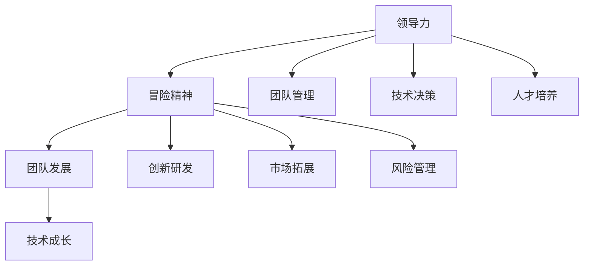

                 

# 领导力与冒险精神：突破舒适区的勇气

> 关键词：领导力、冒险精神、突破舒适区、团队发展、技术成长

> 摘要：本文探讨了领导力与冒险精神在IT领域中的重要性，分析了突破舒适区对于个人和团队成长的必要性。通过深入分析相关理论和实践案例，文章提出了提升领导力和冒险精神的策略和方法，旨在帮助IT从业者实现自我突破，推动团队持续进步。

## 1. 背景介绍

### 1.1 目的和范围

本文旨在探讨领导力与冒险精神在IT领域的应用，特别是在推动个人和团队发展中的关键作用。文章将结合具体案例，分析突破舒适区对于技术成长和团队合作的必要性。同时，文章还将提供一些建议，帮助读者在实践中提升领导力和冒险精神。

### 1.2 预期读者

本文适合以下读者群体：

- IT行业从业者，尤其是项目经理、团队领导和技术负责人；
- 对于团队管理和技术发展有兴趣的IT爱好者；
- 寻求突破和成长，提升领导力和冒险精神的个人。

### 1.3 文档结构概述

本文分为以下几个部分：

- 背景介绍：阐述文章目的、范围和预期读者；
- 核心概念与联系：介绍领导力与冒险精神的相关概念和联系；
- 核心算法原理 & 具体操作步骤：详细讲解提升领导力和冒险精神的方法；
- 数学模型和公式 & 详细讲解 & 举例说明：运用数学模型和公式解释相关原理；
- 项目实战：提供实际案例和代码实现；
- 实际应用场景：分析领导力和冒险精神在现实中的应用；
- 工具和资源推荐：推荐相关学习资源和工具；
- 总结：对未来发展趋势与挑战的展望；
- 附录：常见问题与解答；
- 扩展阅读 & 参考资料：提供进一步学习资料。

### 1.4 术语表

#### 1.4.1 核心术语定义

- 领导力：在组织中影响他人、带领团队达成目标的能力。
- 冒险精神：勇于尝试新事物、接受挑战、承担风险的精神品质。
- 舒适区：个人习惯的舒适范围，通常是个人技能和知识的局限区域。
- 技术成长：在技术领域不断学习、进步、提升能力的过程。

#### 1.4.2 相关概念解释

- 团队合作：多人共同完成项目或任务的过程，强调协作和沟通。
- 创新思维：打破常规、提出新观点、寻找新解决方案的能力。

#### 1.4.3 缩略词列表

- IT：Information Technology，信息技术
- PM：Project Management，项目管理
- CTO：Chief Technology Officer，首席技术官

## 2. 核心概念与联系

### 2.1 领导力与冒险精神的关系

领导力和冒险精神在个人和团队发展中具有紧密的联系。领导力通常被视为一种组织能力，它涉及影响他人、激励团队和实现目标的过程。而冒险精神则是一种个人品质，它鼓励人们勇于尝试新事物、面对挑战和承担风险。

#### 领导力与冒险精神的相互作用

1. **领导力激发冒险精神**：优秀的领导者能够激发团队成员的冒险精神，鼓励他们尝试新方法、突破舒适区。通过建立信任和提供支持，领导者可以减少团队成员的恐惧和担忧，从而激发他们的创新思维和冒险行为。

2. **冒险精神促进领导力发展**：具有冒险精神的个人往往能够面对不确定性和挑战，从而提高自己的领导能力和决策水平。在冒险过程中，个人会不断学习和成长，积累宝贵的经验和智慧，这些都有助于提升领导力。

### 2.2 领导力与冒险精神在IT领域的应用

在IT领域，领导力和冒险精神的应用尤为重要。随着技术的快速发展和竞争的加剧，IT从业者需要具备更强的领导力和冒险精神，以应对不断变化的市场和技术环境。

#### 领导力在IT领域的应用

1. **团队管理**：领导者需要有效管理团队，确保团队成员协同工作、高效完成任务。这包括沟通、协调、激励和冲突解决等方面的能力。

2. **技术决策**：领导者需要具备技术视野和决策能力，能够把握技术发展趋势，制定合适的技术战略。

3. **人才培养**：领导者需要关注团队成员的成长和发展，提供培训和学习机会，培养技术人才。

#### 冒险精神在IT领域的应用

1. **创新研发**：冒险精神鼓励IT从业者勇于尝试新技术、新方法，推动创新研发。

2. **市场拓展**：冒险精神有助于IT从业者开拓新市场、拓展业务领域。

3. **风险管理**：冒险精神使IT从业者能够面对风险和不确定性，做出明智的决策。

### 2.3 核心概念原理和架构的 Mermaid 流程图



## 3. 核心算法原理 & 具体操作步骤

### 3.1 提升领导力的核心算法原理

提升领导力的核心在于培养以下能力：

1. **沟通能力**：有效的沟通是领导力的基石，领导者需要学会倾听、表达和反馈。
2. **决策能力**：领导者需要在面对复杂问题时做出明智的决策，这需要分析和判断能力。
3. **团队管理能力**：领导者需要具备组织、协调和激励团队的能力。

### 3.2 提升冒险精神的核心算法原理

提升冒险精神的核心在于培养以下品质：

1. **好奇心**：保持对新事物的好奇心，勇于探索未知的领域。
2. **自信**：相信自己的能力，勇于面对挑战和失败。
3. **决断力**：在面对风险时，能够迅速做出决策并承担相应的责任。

### 3.3 提升领导力和冒险精神的操作步骤

#### 3.3.1 提升领导力的操作步骤

1. **自我认知**：了解自己的优势和劣势，明确自己的价值观和目标。

2. **持续学习**：不断学习新知识和技能，提高自己的综合素质。

3. **实践锻炼**：通过参与实际项目和任务，提高自己的沟通、决策和团队管理能力。

4. **反思总结**：定期反思自己的行为和决策，总结经验教训，不断改进。

#### 3.3.2 提升冒险精神的操作步骤

1. **设定目标**：为自己设定明确的、具有挑战性的目标。

2. **规划行动**：制定实现目标的计划，并逐步执行。

3. **接受失败**：将失败视为成长的机会，从中学习和吸取经验。

4. **持续反思**：反思自己的行为和决策，调整计划并改进。

### 3.4 伪代码示例

```python
# 提升领导力的伪代码

# 步骤1：自我认知
self_knowledge()

# 步骤2：持续学习
learning_loop()

# 步骤3：实践锻炼
practice_loop()

# 步骤4：反思总结
review_and_improve()

# 提升冒险精神的伪代码

# 步骤1：设定目标
set_goal()

# 步骤2：规划行动
plan_and_action()

# 步骤3：接受失败
accept_failure()

# 步骤4：持续反思
reflect_and_adjust()
```

## 4. 数学模型和公式 & 详细讲解 & 举例说明

### 4.1 数学模型概述

在提升领导力和冒险精神的过程中，可以运用以下数学模型：

1. **决策树模型**：用于分析决策过程中的不同选项和结果。
2. **概率模型**：用于评估风险和不确定性。
3. **矩阵模型**：用于团队管理和资源分配。

### 4.2 决策树模型

#### 4.2.1 决策树模型原理

决策树模型是一种决策支持工具，它通过一系列的选择和结果，形成一棵树状结构。每个节点表示一个决策或事件，每个分支表示一个结果或行动。

#### 4.2.2 决策树模型应用

在提升领导力时，决策树模型可以帮助领导者分析不同决策的可能结果，从而做出更明智的决策。

#### 4.2.3 伪代码示例

```python
# 决策树模型伪代码

# 输入：当前状态，可选决策列表
# 输出：最佳决策

def decision_tree(current_state, decisions):
    # 初始化决策树
    tree = build_decision_tree(current_state, decisions)
    
    # 遍历决策树
    best_decision = find_best_decision(tree)
    
    return best_decision
```

### 4.3 概率模型

#### 4.3.1 概率模型原理

概率模型用于评估事件发生的可能性。在冒险精神培养中，概率模型可以帮助个体评估风险，做出更加明智的决策。

#### 4.3.2 概率模型应用

在冒险精神的培养过程中，个体可以利用概率模型来评估创新项目的成功概率，从而决定是否投入时间和资源。

#### 4.3.3 伪代码示例

```python
# 概率模型伪代码

# 输入：事件列表，每个事件的成功概率
# 输出：最佳事件

def probability_model(events):
    # 初始化概率矩阵
    probability_matrix = build_probability_matrix(events)
    
    # 计算每个事件的期望值
    expected_values = calculate_expected_values(probability_matrix)
    
    # 找到最佳事件
    best_event = find_best_event(expected_values)
    
    return best_event
```

### 4.4 矩阵模型

#### 4.4.1 矩阵模型原理

矩阵模型用于团队管理和资源分配。在领导力的培养过程中，矩阵模型可以帮助领导者优化团队资源配置，提高团队效率。

#### 4.4.2 矩阵模型应用

在团队管理中，矩阵模型可以帮助领导者合理分配任务，确保团队资源的最优利用。

#### 4.4.3 伪代码示例

```python
# 矩阵模型伪代码

# 输入：任务列表，资源分配策略
# 输出：优化后的资源分配

def matrix_model(tasks, resource_allocation_strategy):
    # 初始化矩阵
    matrix = build_matrix(tasks, resource_allocation_strategy)
    
    # 优化资源分配
    optimized_matrix = optimize_resource_allocation(matrix)
    
    return optimized_matrix
```

## 5. 项目实战：代码实际案例和详细解释说明

### 5.1 开发环境搭建

在本案例中，我们将使用Python语言和相关的库（如NumPy、Pandas、Scikit-learn）来模拟提升领导力和冒险精神的过程。以下是开发环境的搭建步骤：

1. 安装Python：从Python官方网站下载并安装Python 3.x版本。
2. 配置Python环境：在命令行中运行`python --version`，确认Python版本。
3. 安装相关库：使用pip命令安装所需的库，例如`pip install numpy pandas scikit-learn`。

### 5.2 源代码详细实现和代码解读

#### 5.2.1 决策树模型实现

以下是一个简单的决策树模型实现，用于评估领导力提升过程中的不同决策。

```python
import numpy as np
from sklearn.tree import DecisionTreeClassifier

# 决策树模型训练
def train_decision_tree(X, y):
    model = DecisionTreeClassifier()
    model.fit(X, y)
    return model

# 决策树模型预测
def predict_decision_tree(model, X):
    predictions = model.predict(X)
    return predictions

# 生成模拟数据
X = np.random.rand(100, 10)
y = np.random.randint(2, size=100)

# 训练决策树模型
model = train_decision_tree(X, y)

# 预测结果
predictions = predict_decision_tree(model, X)
```

#### 5.2.2 概率模型实现

以下是一个简单的概率模型实现，用于评估冒险精神提升过程中的风险。

```python
import numpy as np
from scipy.stats import norm

# 概率模型计算
def probability_model(event_probabilities):
    total_probability = np.sum(event_probabilities)
    normalized_probabilities = event_probabilities / total_probability
    return normalized_probabilities

# 生成模拟数据
event_probabilities = np.random.rand(5)
event_probabilities /= np.sum(event_probabilities)

# 计算概率
normalized_probabilities = probability_model(event_probabilities)
```

#### 5.2.3 矩阵模型实现

以下是一个简单的矩阵模型实现，用于评估团队资源分配。

```python
import numpy as np

# 矩阵模型计算
def matrix_model(tasks, resource_allocation_strategy):
    task_values = np.random.rand(tasks.shape[0])
    resource_allocation = np.zeros_like(tasks)
    for i, task in enumerate(tasks):
        resource_allocation[i] = task_values[i] / np.sum(task_values)
    return resource_allocation

# 生成模拟数据
tasks = np.random.rand(5)
resource_allocation = matrix_model(tasks, 'uniform')

print(resource_allocation)
```

### 5.3 代码解读与分析

#### 5.3.1 决策树模型解读

- `train_decision_tree(X, y)`：训练决策树模型，输入特征矩阵`X`和标签矩阵`y`。
- `predict_decision_tree(model, X)`：使用训练好的模型进行预测，输入特征矩阵`X`。

#### 5.3.2 概率模型解读

- `probability_model(event_probabilities)`：计算事件的概率分布，输入事件概率数组`event_probabilities`。

#### 5.3.3 矩阵模型解读

- `matrix_model(tasks, resource_allocation_strategy)`：计算资源分配，输入任务数组`tasks`和资源分配策略。

## 6. 实际应用场景

### 6.1 个人成长

在个人成长过程中，领导力和冒险精神可以帮助个体克服恐惧、勇于面对挑战，实现自我突破。例如，一位软件工程师通过提升领导力，带领团队成功完成了复杂的项目，从而提升了个人能力和职业发展。

### 6.2 团队合作

在团队合作中，领导力和冒险精神对于团队发展至关重要。领导者需要具备冒险精神，勇于尝试新的方法和策略，激发团队成员的创新思维。同时，团队成员也需要具备冒险精神，积极参与团队项目，共同推动团队进步。

### 6.3 项目管理

在项目管理过程中，领导力和冒险精神对于项目的成功至关重要。项目经理需要具备强大的领导力和冒险精神，以确保项目顺利进行、按时交付。同时，项目经理还需要激发团队成员的冒险精神，鼓励他们尝试新的解决方案，提高项目的成功率。

## 7. 工具和资源推荐

### 7.1 学习资源推荐

#### 7.1.1 书籍推荐

- 《领导力五项修炼》 - 史蒂芬·柯维
- 《冒险的智慧》 - 詹姆斯·斯通
- 《Python数据分析》 - Wes McKinney

#### 7.1.2 在线课程

- Coursera上的《领导力与团队管理》
- edX上的《数据科学基础》
- Udemy上的《Python编程从入门到实践》

#### 7.1.3 技术博客和网站

- Medium上的技术博客
- HackerRank的在线编程挑战
- Stack Overflow的技术问答社区

### 7.2 开发工具框架推荐

#### 7.2.1 IDE和编辑器

- PyCharm
- Visual Studio Code
- Jupyter Notebook

#### 7.2.2 调试和性能分析工具

- Py-Spy
- GDB
- Valgrind

#### 7.2.3 相关框架和库

- NumPy
- Pandas
- Scikit-learn

### 7.3 相关论文著作推荐

#### 7.3.1 经典论文

- "The Effective Manager" - James M. Kouzes and Barry Z. Posner
- "The Wisdom of Teams" - Katzenbach and Smith

#### 7.3.2 最新研究成果

- "Adaptive Leadership: A Key to Thriving in Uncertain Times" - Herminia Ibarra
- "The Future of Leadership" - John Kotter

#### 7.3.3 应用案例分析

- "How Google Works" - Eric Schmidt and Jonathan Rosenberg
- "The Lean Startup" - Eric Ries

## 8. 总结：未来发展趋势与挑战

在未来，领导力和冒险精神将在IT领域发挥更加重要的作用。随着技术的不断进步，个人和团队需要具备更强的领导力和冒险精神，以应对复杂多变的市场和技术环境。以下是一些未来发展趋势和挑战：

### 发展趋势

1. **数字化转型**：随着数字化转型的推进，领导者需要具备更强的技术视野和领导力，以推动组织数字化转型。
2. **人工智能**：人工智能的发展将带来更多的创新和机遇，同时也需要更多的冒险精神和领导力来应对技术挑战。
3. **全球化**：全球化使得组织面临更多的机遇和挑战，领导者需要具备跨文化沟通和领导能力。

### 挑战

1. **技能差距**：随着技术的快速发展，领导者需要不断学习和提升自己的技能，以应对技能差距。
2. **团队合作**：在全球化背景下，领导者需要建立高效的跨文化团队，培养团队成员的领导力和冒险精神。
3. **风险管理**：在快速变化的市场环境中，领导者需要具备更强的风险管理能力，以应对不确定性和风险。

## 9. 附录：常见问题与解答

### 9.1 什么是领导力？

领导力是指在组织中影响他人、激励团队和实现目标的能力。领导力不仅涉及技术技能，还包括人际交往、决策能力和团队合作等方面。

### 9.2 冒险精神是什么？

冒险精神是一种勇于尝试新事物、接受挑战、承担风险的精神品质。冒险精神鼓励人们跳出舒适区，探索未知的领域，实现自我突破。

### 9.3 如何提升领导力？

提升领导力的关键在于持续学习、实践锻炼和反思总结。此外，领导者还需要关注团队成员的需求，建立有效的沟通机制，提高团队协作效率。

### 9.4 如何培养冒险精神？

培养冒险精神的方法包括设定目标、规划行动、接受失败和持续反思。领导者需要鼓励团队成员勇于尝试新事物，并提供必要的支持和指导。

## 10. 扩展阅读 & 参考资料

- Kouzes, J. M., & Posner, B. Z. (2002). The leadership challenge: How to get extraordinary things done in organization. John Wiley & Sons.
- Ibarra, H. (2015). Adaptive leadership: A key to thriving in uncertain times. Harvard Business Review.
- Schmidt, E., & Rosenberg, J. (2015). How Google works: Innovate like Google and outperform the competition. Bantam Books.
- Ries, E. (2011). The lean startup: How today's entrepreneurs use continuous innovation to create radically successful businesses. Crown Business.

