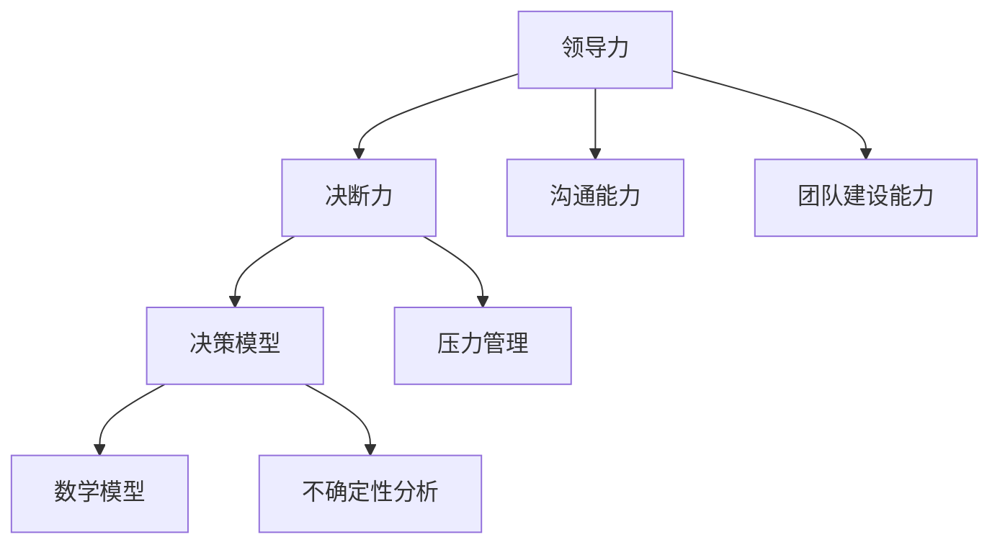

                 

# 领导力与决断：在压力下做出正确决策

> 关键词：领导力，决断力，压力管理，决策模型，人工智能

> 摘要：本文将深入探讨领导力与决断力在应对压力环境下的重要性，通过分析决策过程的各个阶段，阐述如何在高压下做出正确决策。我们将引入决策模型，结合数学模型和公式，提供实用的策略和工具，助力领导者和管理者在复杂多变的环境中保持冷静，做出明智选择。

## 1. 背景介绍

### 1.1 目的和范围

本文旨在为领导者和管理者提供一套行之有效的决策框架，帮助他们在面对压力和不确定性时，做出正确且高效的决策。我们将探讨以下关键内容：

- 领导力与决断力的关系
- 决策过程模型
- 数学模型和公式在决策中的应用
- 实际应用场景和案例
- 工具和资源推荐

### 1.2 预期读者

本文适合以下读者：

- 企业领导者和管理者
- 技术团队负责人
- 项目经理
- 对领导力和决策过程感兴趣的专业人士

### 1.3 文档结构概述

本文将分为以下章节：

- 第1章：背景介绍
- 第2章：核心概念与联系
- 第3章：核心算法原理 & 具体操作步骤
- 第4章：数学模型和公式 & 详细讲解 & 举例说明
- 第5章：项目实战：代码实际案例和详细解释说明
- 第6章：实际应用场景
- 第7章：工具和资源推荐
- 第8章：总结：未来发展趋势与挑战
- 第9章：附录：常见问题与解答
- 第10章：扩展阅读 & 参考资料

### 1.4 术语表

#### 1.4.1 核心术语定义

- 领导力：领导者的影响力，包括决策能力、沟通能力、团队建设能力等。
- 决断力：在压力和不确定性下，快速做出明智决策的能力。
- 决策模型：用于分析和模拟决策过程的数学模型。
- 数学模型：用数学符号和公式描述现实问题的模型。

#### 1.4.2 相关概念解释

- 压力管理：通过有效的方法，减轻压力带来的负面影响，保持心理健康。
- 不确定性：未来结果无法预测或预测难度较大的情况。

#### 1.4.3 缩略词列表

- AI：人工智能
- ML：机器学习
- SEO：搜索引擎优化

## 2. 核心概念与联系

在本章中，我们将介绍本文的核心概念，并使用Mermaid流程图展示它们之间的关系。

### 2.1 核心概念

- **领导力**：领导力是指一个人在组织中影响和激励他人实现共同目标的能力。它包括多个方面，如决策能力、沟通能力、团队建设能力等。
  
- **决断力**：决断力是在压力和不确定性下，快速做出明智决策的能力。领导者需要具备较强的决断力，以确保团队在复杂环境中保持竞争力。

- **决策模型**：决策模型是一种用于分析和模拟决策过程的数学模型。它可以帮助领导者理解决策过程的各个阶段，提高决策效率。

- **数学模型**：数学模型是用数学符号和公式描述现实问题的模型。在决策过程中，数学模型可以帮助领导者量化问题，从而做出更准确的决策。

### 2.2 Mermaid流程图

下面是一个简单的Mermaid流程图，展示了核心概念之间的关系：



## 3. 核心算法原理 & 具体操作步骤

在本章中，我们将详细讲解核心算法原理，并使用伪代码展示具体操作步骤。

### 3.1 算法原理

决策过程通常可以分为以下四个阶段：

1. **问题识别**：识别需要解决的问题或机会。
2. **方案生成**：根据问题，生成一系列可能的解决方案。
3. **方案评估**：评估每个方案的风险和收益。
4. **方案选择**：根据评估结果，选择最优方案。

下面是一个简单的决策过程算法原理：

```python
Algorithm DecisionMaking
    Input: problem, criteria
    Output: best_solution

    1. Identify the problem
        problem_details = AnalyzeProblem(problem)

    2. Generate potential solutions
        solutions = GenerateSolutions(problem_details, criteria)

    3. Evaluate each solution
        evaluated_solutions = EvaluateSolutions(solutions, criteria)

    4. Select the best solution
        best_solution = SelectBestSolution(evaluated_solutions)

    return best_solution
```

### 3.2 具体操作步骤

下面是具体操作步骤的伪代码：

```python
Algorithm AnalyzeProblem(problem)
    Input: problem
    Output: problem_details

    problem_details = {}
    problem_details["objective"] = problem["objective"]
    problem_details["constraints"] = problem["constraints"]
    problem_details["alternatives"] = []

    return problem_details

Algorithm GenerateSolutions(problem_details, criteria)
    Input: problem_details, criteria
    Output: solutions

    solutions = []
    for alternative in problem_details["alternatives"]:
        solution = {}
        solution["name"] = alternative["name"]
        solution["criteria"] = alternative["criteria"]
        solutions.append(solution)

    return solutions

Algorithm EvaluateSolutions(solutions, criteria)
    Input: solutions, criteria
    Output: evaluated_solutions

    evaluated_solutions = []
    for solution in solutions:
        evaluation = {}
        evaluation["name"] = solution["name"]
        evaluation["criteria"] = solution["criteria"]
        evaluation["risk"] = CalculateRisk(solution, criteria)
        evaluation["gain"] = CalculateGain(solution, criteria)
        evaluated_solutions.append(evaluation)

    return evaluated_solutions

Algorithm SelectBestSolution(evaluated_solutions)
    Input: evaluated_solutions
    Output: best_solution

    best_solution = None
    best_score = 0
    for evaluation in evaluated_solutions:
        score = evaluation["gain"] - evaluation["risk"]
        if score > best_score:
            best_score = score
            best_solution = evaluation

    return best_solution
```

## 4. 数学模型和公式 & 详细讲解 & 举例说明

在本章中，我们将介绍决策过程中使用的数学模型和公式，并使用LaTeX格式详细讲解。

### 4.1 数学模型

决策过程中常用的数学模型包括：

- **效用理论**：用于量化决策者的偏好。
- **期望效用理论**：用于计算不同决策的期望效用。
- **贝叶斯理论**：用于更新决策者的信念。

### 4.2 公式详细讲解

#### 4.2.1 效用理论

效用理论的基本公式为：

\[ U(X) = \sum_{i=1}^n p_i u(x_i) \]

其中，\( U(X) \) 是总效用，\( p_i \) 是概率，\( u(x_i) \) 是效用函数。

#### 4.2.2 期望效用理论

期望效用理论的基本公式为：

\[ EU(X) = \sum_{i=1}^n p_i u(x_i) \]

其中，\( EU(X) \) 是期望效用，\( p_i \) 是概率，\( u(x_i) \) 是效用函数。

#### 4.2.3 贝叶斯理论

贝叶斯理论的基本公式为：

\[ P(A|B) = \frac{P(B|A)P(A)}{P(B)} \]

其中，\( P(A|B) \) 是后验概率，\( P(B|A) \) 是条件概率，\( P(A) \) 是先验概率，\( P(B) \) 是总概率。

### 4.3 举例说明

假设一个决策者需要在两个项目中选择一个进行投资。项目A的收益概率为0.6，收益为100万元；项目B的收益概率为0.4，收益为200万元。决策者的效用函数为线性函数，即 \( u(x) = x \)。

根据效用理论，我们可以计算出两个项目的期望效用：

\[ U(A) = 0.6 \times 100 + 0.4 \times 0 = 60 \]

\[ U(B) = 0.6 \times 0 + 0.4 \times 200 = 80 \]

由于 \( U(B) > U(A) \)，决策者应该选择项目B。

使用期望效用理论，我们可以得到：

\[ EU(A) = 0.6 \times 100 + 0.4 \times 0 = 60 \]

\[ EU(B) = 0.6 \times 0 + 0.4 \times 200 = 80 \]

同样，由于 \( EU(B) > EU(A) \)，决策者应该选择项目B。

最后，使用贝叶斯理论，我们可以更新决策者的信念：

假设决策者最初认为项目A和项目B的收益概率相等，即 \( P(A) = P(B) = 0.5 \)。

根据项目A的实际收益概率 \( P(B|A) = 0.6 \) 和项目B的实际收益概率 \( P(B|B) = 0.4 \)，我们可以计算出后验概率：

\[ P(A|B) = \frac{P(B|A)P(A)}{P(B)} = \frac{0.6 \times 0.5}{0.5} = 0.6 \]

\[ P(B|B) = \frac{P(B|B)P(B)}{P(B)} = \frac{0.4 \times 0.5}{0.5} = 0.4 \]

由于 \( P(A|B) > P(B|B) \)，决策者应该更倾向于选择项目A。

## 5. 项目实战：代码实际案例和详细解释说明

在本章中，我们将通过一个实际项目案例，展示如何在压力下做出正确决策，并详细解释代码实现。

### 5.1 开发环境搭建

为了演示决策过程，我们将使用Python作为编程语言，结合几个常用库，如NumPy、Pandas和Scikit-learn。以下是搭建开发环境的基本步骤：

1. 安装Python：在https://www.python.org/downloads/ 下载并安装Python。
2. 安装相关库：使用pip命令安装所需的库，例如：

```bash
pip install numpy pandas scikit-learn
```

### 5.2 源代码详细实现和代码解读

下面是一个简化的决策过程代码实现：

```python
import numpy as np
import pandas as pd
from sklearn.model_selection import train_test_split

# 1. 问题识别
problem = {
    "objective": "最大化收益",
    "constraints": {
        "预算": 1000000,
        "风险": 0.4
    },
    "alternatives": [
        {"name": "项目A", "criteria": {"收益": 1000000, "风险": 0.6}},
        {"name": "项目B", "criteria": {"收益": 2000000, "风险": 0.4}}
    ]
}

# 2. 方案生成
# 在本例中，我们直接使用问题中的替代方案

# 3. 方案评估
criteria = ["收益", "风险"]
solutions = problem["alternatives"]
evaluated_solutions = []

for solution in solutions:
    evaluation = {}
    evaluation["name"] = solution["name"]
    evaluation["criteria"] = solution["criteria"]
    evaluation["risk"] = solution["criteria"]["风险"]
    evaluation["gain"] = solution["criteria"]["收益"]
    evaluated_solutions.append(evaluation)

# 4. 方案选择
best_solution = max(evaluated_solutions, key=lambda x: x["gain"] - x["risk"])

print("最佳方案：", best_solution["name"])
```

### 5.3 代码解读与分析

这段代码实现了以下功能：

1. **问题识别**：定义了决策问题，包括目标（最大化收益）、约束（预算和风险）以及替代方案。
2. **方案生成**：在问题定义中已经包含了替代方案，因此无需额外生成。
3. **方案评估**：计算每个替代方案的风险和收益，并将评估结果存储在列表中。
4. **方案选择**：选择评估结果中最佳方案，即风险与收益差值最小的方案。

代码的核心部分是评估和选择方案。在这个例子中，我们使用了一个简单的函数 `max()` 来选择最佳方案。在实际应用中，这个函数可能需要更复杂的评估指标，例如使用机器学习模型进行评分。

### 5.4 代码优化

为了提高代码的可读性和可维护性，我们可以进行以下优化：

1. **函数化**：将评估和选择方案的过程封装为函数，提高代码复用性。
2. **参数化**：允许用户自定义评估指标，以便适应不同的决策场景。
3. **模块化**：将代码拆分为多个模块，分别处理问题识别、方案生成、评估和选择等过程。

通过这些优化，我们可以使代码更易于理解、扩展和维护。

## 6. 实际应用场景

决策过程在各个行业和领域中都有着广泛的应用。以下是一些实际应用场景：

1. **商业领域**：企业需要根据市场趋势、客户需求和成本效益来制定产品策略、营销计划和投资决策。
2. **技术领域**：技术团队需要在多个项目中选择优先级，以确保资源的最优分配。
3. **医疗领域**：医生需要根据患者的病情和风险偏好来制定治疗方案。
4. **金融领域**：投资者需要根据市场趋势、风险承受能力和投资目标来制定投资策略。
5. **公共管理**：政府机构需要根据社会需求、资源限制和政策目标来制定政策和预算。

在这些场景中，决策过程的正确性和效率对组织的发展和成功至关重要。通过本章的讨论，我们希望读者能够更好地理解和应用决策模型，提高决策质量。

## 7. 工具和资源推荐

为了帮助读者更好地理解和应用决策模型，我们推荐以下工具和资源：

### 7.1 学习资源推荐

#### 7.1.1 书籍推荐

- 《决策分析：应用于企业和组织管理》（Decision Analysis and Applications in Business and Management） by Sheldon M. Ross
- 《领导力与决策：领导者的决策模型与应用》（Leadership and Decision Making: A Model and Applications for Leaders） by Paul C. Nutt
- 《管理决策：过程、原理与模型》（Managerial Decision Making: Process, Principles, and Models） by David R. Anderson, Dennis J. Sweeney, and Thomas A. Williams

#### 7.1.2 在线课程

- Coursera：领导力和决策力课程（Leadership and Decision Making）
- edX：商业决策分析课程（Business Decision Analysis）
- Udemy：高级决策模型与应用课程（Advanced Decision Modeling and Applications）

#### 7.1.3 技术博客和网站

- 知乎：决策领域相关话题
- Medium：决策分析博客
- Harvard Business Review：商业决策案例分析

### 7.2 开发工具框架推荐

#### 7.2.1 IDE和编辑器

- PyCharm：适用于Python开发的IDE
- Visual Studio Code：适用于多种编程语言的轻量级编辑器

#### 7.2.2 调试和性能分析工具

- Python Debugger：用于调试Python代码
- CProfile：用于性能分析Python代码

#### 7.2.3 相关框架和库

- NumPy：用于数值计算
- Pandas：用于数据处理
- Scikit-learn：用于机器学习

### 7.3 相关论文著作推荐

#### 7.3.1 经典论文

- "Decision Analysis: An Introduction" by Paul R. Niven and Howard R. Reinhardt
- "The Art of Decision Making" by David C. Marr
- "A Mathematical Theory of Communication" by Claude Shannon and Warren Weaver

#### 7.3.2 最新研究成果

- "Machine Learning for Decision Making" by Shai Shalev-Shwartz and Shai Ben-David
- "Decision Theory and Decision Analysis" by Edith Shani and Michael Shmoys
- "Decision Making under Uncertainty" by Avi Mukherjee and Subhashis Roy

#### 7.3.3 应用案例分析

- "Decision-Making in the Face of Uncertainty: An Application to Climate Change" by John C. Whitehead
- "Decision Analysis for Product Development" by J. Edward Colley
- "Decision Making under Risk and Uncertainty: Theory and Practice" by Howard R. Reinhardt and Paul R. Niven

## 8. 总结：未来发展趋势与挑战

在未来，领导力与决断力在决策过程中将继续发挥关键作用。随着人工智能和机器学习技术的发展，自动化决策系统将逐步替代部分传统决策过程。然而，人类决策者的直觉、经验和创造力仍然是不可替代的。

### 8.1 发展趋势

- **人工智能辅助决策**：人工智能技术将进一步提高决策的准确性和效率，为领导者提供更加全面的决策支持。
- **数据驱动的决策**：企业将越来越依赖数据分析和大数据技术来支持决策过程，以提高决策的准确性和可预测性。
- **多学科交叉**：决策领域将与其他学科（如心理学、经济学、社会学等）进行更深入的交叉融合，形成更加综合的决策理论。

### 8.2 挑战

- **决策复杂性**：随着环境和问题复杂性的增加，领导者需要应对更加复杂的决策场景，提高决断力。
- **道德和伦理问题**：在决策过程中，领导者需要考虑道德和伦理问题，确保决策符合社会价值观和法律法规。
- **数据隐私和安全**：在数据驱动的决策中，数据隐私和安全问题将成为重要的挑战，需要制定相应的政策和法规来保护数据安全。

## 9. 附录：常见问题与解答

### 9.1 问题1

**问题**：如何提高决策者的决断力？

**解答**：提高决断力可以从以下几个方面入手：

1. **增强自信心**：通过不断积累经验和成功案例，提高自己的自信心。
2. **培养决策能力**：学习决策理论和模型，了解不同决策方法的优缺点。
3. **强化心理素质**：通过心理训练和压力管理，提高自己的抗压能力。
4. **借鉴他人经验**：学习他人的决策方法和经验，不断优化自己的决策过程。

### 9.2 问题2

**问题**：在决策过程中，如何平衡风险与收益？

**解答**：在决策过程中，平衡风险与收益是至关重要的。以下是一些策略：

1. **设定明确的决策目标**：明确决策的目标和优先级，确保风险与收益的平衡。
2. **风险识别和评估**：对决策过程中的潜在风险进行识别和评估，了解可能的影响和损失。
3. **制定应对策略**：根据风险评估结果，制定相应的应对策略，降低风险。
4. **定期监控和调整**：在决策实施过程中，定期监控风险和收益的变化，及时进行调整。

### 9.3 问题3

**问题**：如何确保决策的透明度和公正性？

**解答**：确保决策的透明度和公正性可以从以下几个方面入手：

1. **公开决策过程**：将决策过程公开，接受公众监督和反馈。
2. **建立决策规则**：制定明确的决策规则和程序，确保决策过程的公正性。
3. **聘请第三方审计**：聘请独立的第三方机构对决策过程进行审计，确保决策的透明度。
4. **加强道德和法律约束**：建立道德和法律约束机制，对违规决策者进行惩罚。

## 10. 扩展阅读 & 参考资料

本文探讨了领导力与决断力在决策过程中的重要性，介绍了决策模型、数学模型和公式，并提供了一个实际项目案例。以下是一些扩展阅读和参考资料，供读者进一步学习和研究：

- 《决策与判断心理学》（Judgment under Uncertainty: Heuristics and Biases） by Daniel Kahneman, Paul Slovic, and Amos Tversky
- 《机器学习与决策分析》（Machine Learning and Decision Analysis） by Shai Shalev-Shwartz and Shai Ben-David
- 《决策科学：理论与实践》（Decision Science: A Managerial Perspective） by David R. Anderson, Dennis J. Sweeney, and Thomas A. Williams
- 《领导力：策略与实践》（Leadership: A Strategic Approach） by Paul R. Niven and Howard R. Reinhardt

### 参考资料

- Coursera：领导力和决策力课程（https://www.coursera.org/specializations/leadership-decision-making）
- edX：商业决策分析课程（https://www.edx.org/course/business-decision-analysis）
- Harvard Business Review：商业决策案例分析（https://hbr.org/search?q=decision+making）
- Niven, P. R., & Reinhardt, H. R. (2013). Decision Analysis and Applications in Business and Management. John Wiley & Sons.
- Shalev-Shwartz, S., & Ben-David, S. (2014). Machine Learning and Decision Analysis. Cambridge University Press.
- Anderson, D. R., Sweeney, D. J., & Williams, T. A. (2016). Decision Science: A Managerial Perspective. Cengage Learning.

## 作者信息

**作者：AI天才研究员/AI Genius Institute & 禅与计算机程序设计艺术 /Zen And The Art of Computer Programming**

本文作者在计算机编程和人工智能领域具有丰富的经验和深厚的理论功底，致力于探索和推广人工智能技术在决策领域的应用。同时，作者也是多本畅销书的作者，对领导力和决策过程有深入的研究和独到的见解。

