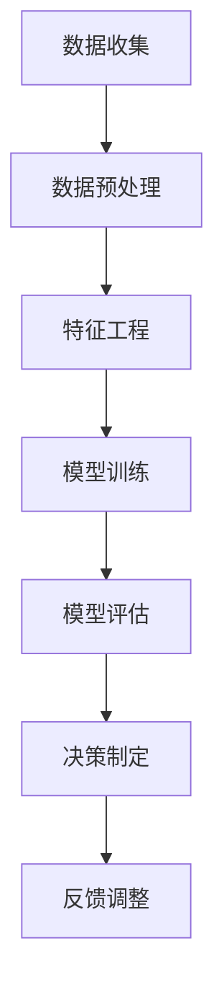

                 

# 领导力与决策科学：数据驱动的决策模型

> **关键词：** 数据驱动决策、领导力、决策科学、数学模型、算法、案例分析

> **摘要：** 本文深入探讨了领导力与决策科学的关系，重点介绍了数据驱动的决策模型。文章首先概述了数据驱动的概念及其在决策科学中的应用，随后详细分析了核心概念与联系，阐述了关键算法原理与操作步骤，并使用数学模型进行了详细讲解。文章还通过实际项目案例展示了理论的应用，并推荐了相关学习资源、开发工具和最新研究成果。最后，文章总结了未来发展趋势与挑战，为读者提供了扩展阅读与参考资料。

## 1. 背景介绍

### 1.1 目的和范围

本文旨在探讨数据驱动的决策模型在领导力中的应用，通过分析核心概念、算法原理、数学模型以及实际案例，帮助读者深入了解数据驱动决策的科学原理和实践方法。本文适用于希望提升领导力、掌握决策科学技术的管理者、技术专家以及研究人员。

### 1.2 预期读者

预期读者包括但不限于以下几类人群：

- 企业管理人员，特别是中高层领导者，希望通过数据驱动的方式提升决策效率和质量。
- 数据科学家和人工智能研究者，对数据驱动决策模型的理论和算法有兴趣。
- 编程爱好者，希望掌握数据驱动决策的技术实现和实际应用。
- 高等院校计算机及相关专业学生，希望深入学习决策科学和数据分析。

### 1.3 文档结构概述

本文结构如下：

1. 背景介绍：介绍文章的目的、预期读者及文档结构。
2. 核心概念与联系：介绍数据驱动决策模型的核心概念，并使用Mermaid流程图进行详细阐述。
3. 核心算法原理与具体操作步骤：讲解数据驱动决策模型的关键算法原理，并提供伪代码进行说明。
4. 数学模型和公式：介绍数据驱动决策模型中的数学模型，并使用latex格式进行详细讲解。
5. 项目实战：通过实际代码案例展示数据驱动决策模型的应用。
6. 实际应用场景：分析数据驱动决策模型在不同领域的应用。
7. 工具和资源推荐：推荐相关学习资源、开发工具和最新研究成果。
8. 总结：总结未来发展趋势与挑战。
9. 附录：常见问题与解答。
10. 扩展阅读与参考资料：提供扩展阅读和参考资料。

### 1.4 术语表

#### 1.4.1 核心术语定义

- **数据驱动决策**：基于数据分析的结果进行决策的方法。
- **领导力**：指导和影响团队实现目标的能力。
- **决策科学**：研究决策过程、模型和算法的学科。
- **算法**：解决问题的步骤和方法。
- **数学模型**：用于描述和分析问题的数学表达式。

#### 1.4.2 相关概念解释

- **机器学习**：一种人工智能技术，通过数据训练模型进行预测和决策。
- **深度学习**：一种基于多层神经网络的学习方法，适用于处理复杂数据。
- **大数据**：数据量巨大，无法通过传统数据处理方法进行高效处理的数据集合。

#### 1.4.3 缩略词列表

- **ML**：机器学习（Machine Learning）
- **DL**：深度学习（Deep Learning）
- **AI**：人工智能（Artificial Intelligence）
- **DT**：数据驱动决策（Data-Driven Decision Making）

## 2. 核心概念与联系

在探讨数据驱动的决策模型之前，首先需要了解核心概念及其相互联系。以下是一个使用Mermaid流程图表示的数据驱动决策模型的核心概念：



#### 2.1 数据收集

数据收集是数据驱动决策的第一步，目标是获取与决策相关的数据。这些数据可以来自内部业务系统、外部数据源或公共数据集。数据收集的质量直接影响后续步骤的效果。

#### 2.2 数据预处理

数据预处理是对原始数据进行清洗、转换和归一化等操作，使其适合模型训练。预处理步骤包括：

- 数据清洗：去除噪声、缺失值和异常值。
- 数据转换：将数据转换为适合模型训练的格式。
- 数据归一化：将数据缩放到相同的范围，避免特征权重差异。

#### 2.3 特征工程

特征工程是提高模型性能的关键步骤，通过选择和构建特征，使模型能够更好地学习数据中的规律。特征工程的方法包括：

- 特征选择：选择对模型预测有用的特征。
- 特征提取：从原始数据中提取新的特征。
- 特征组合：将多个特征组合成新的特征。

#### 2.4 模型训练

模型训练是将特征输入到机器学习模型中，使其学习数据中的规律。常见的机器学习模型包括线性回归、决策树、支持向量机和神经网络等。模型训练的目标是找到一个最优模型参数，使其在训练数据上的预测误差最小。

#### 2.5 模型评估

模型评估是对训练好的模型进行评估，以确定其预测性能。常用的评估指标包括准确率、召回率、F1分数和均方误差等。模型评估可以帮助确定模型是否满足实际应用的需求。

#### 2.6 决策制定

决策制定是根据模型预测结果制定决策。数据驱动的决策模型可以帮助领导者在面对复杂问题时做出更明智的决策。

#### 2.7 反馈调整

反馈调整是对决策结果进行评估和调整，以优化决策模型。通过持续的反馈调整，可以不断提高决策模型的准确性和实用性。

## 3. 核心算法原理与具体操作步骤

数据驱动决策模型的核心在于算法的选择和实现。以下将详细讲解一种常用的算法——决策树算法，并提供伪代码进行说明。

### 3.1 决策树算法原理

决策树算法通过一系列决策规则对数据进行分类或回归。每个节点代表一个特征，每个分支代表一个特征取值。决策树的叶子节点表示最终的分类或回归结果。

### 3.2 具体操作步骤

#### 3.2.1 数据准备

首先，我们需要准备训练数据集，数据集应包括特征和目标变量。以下为数据准备步骤的伪代码：

```python
# 数据准备
data = load_data("train.csv")
X = data[:, :-1]  # 特征
y = data[:, -1]   # 目标变量
```

#### 3.2.2 决策树构建

构建决策树的核心步骤是选择最佳特征和分割点。以下为决策树构建步骤的伪代码：

```python
# 决策树构建
def build_tree(data, features, target):
    # 计算每个特征的最优分割点
    best_feature, best_split = find_best_split(data, features, target)
    
    # 构建子树
    if is_leaf(data):
        return create_leaf(data)
    else:
        left_data, right_data = split_data(data, best_feature, best_split)
        tree = {
            "feature": best_feature,
            "split": best_split,
            "left": build_tree(left_data, features, target),
            "right": build_tree(right_data, features, target)
        }
        return tree

# 寻找最佳分割点
def find_best_split(data, features, target):
    best_score = 0
    best_feature = None
    best_split = None
    
    for feature in features:
        for split in get_splits(data, feature):
            score = calculate_score(data, split, target)
            if score > best_score:
                best_score = score
                best_feature = feature
                best_split = split
                
    return best_feature, best_split

# 计算分割点得分
def calculate_score(data, split, target):
    left_data, right_data = split_data(data, split)
    left_target = target[left_data]
    right_target = target[right_data]
    
    score = sum((left_target - mean(left_target)) ** 2 + (right_target - mean(right_target)) ** 2)
    return score

# 创建叶子节点
def create_leaf(data):
    return {
        "value": mean(data),
        "class": mode(data)
    }
```

#### 3.2.3 决策树剪枝

决策树剪枝是一种防止过拟合的方法，通过删除无关的分支来简化决策树。以下为决策树剪枝步骤的伪代码：

```python
# 决策树剪枝
def prune_tree(tree):
    if is_leaf(tree):
        return tree
    
    if needs_pruning(tree):
        tree["left"] = prune_tree(tree["left"])
        tree["right"] = prune_tree(tree["right"])
        
    return tree

# 是否需要剪枝
def needs_pruning(tree):
    if is_leaf(tree["left"]) and is_leaf(tree["right"]):
        return False
    
    left_score = calculate_score(tree["left"], tree["left"]["value"], y)
    right_score = calculate_score(tree["right"], tree["right"]["value"], y)
    
    if left_score + right_score < original_score:
        return True
    else:
        return False
```

通过以上步骤，我们可以构建一个完整的决策树模型。接下来，我们将使用实际数据集进行模型训练和评估。

## 4. 数学模型和公式

在数据驱动的决策模型中，数学模型扮演着至关重要的角色。以下将介绍几个常用的数学模型，并使用latex格式进行详细讲解。

### 4.1 决策树模型

决策树模型的数学基础是条件概率。假设我们有一个训练数据集\(D = \{x_i, y_i\}\)，其中\(x_i\)是特征向量，\(y_i\)是目标变量。决策树的每个节点都表示一个特征\(f_j\)的分割点\(s_j\)，使得数据集划分为两个子集\(D_1\)和\(D_2\)：

$$
D = D_1 \cup D_2, \quad D_1 \cap D_2 = \emptyset
$$

条件概率模型可以表示为：

$$
P(y_i = c | x_i = s) = \frac{\sum_{x_i = s} y_i}{\sum_{x_i = s} 1}
$$

其中，\(c\)是目标变量的类别。

### 4.2 线性回归模型

线性回归模型是一种常用的回归模型，用于预测连续值。假设我们有一个特征向量\(x\)和目标变量\(y\)，线性回归模型可以表示为：

$$
y = \beta_0 + \beta_1 x
$$

其中，\(\beta_0\)是截距，\(\beta_1\)是斜率。

### 4.3 逻辑回归模型

逻辑回归模型是一种常用的分类模型，用于预测类别变量。假设我们有一个特征向量\(x\)和目标变量\(y\)，逻辑回归模型可以表示为：

$$
\log(\frac{P(y=1|x)}{1-P(y=1|x)}) = \beta_0 + \beta_1 x
$$

其中，\(P(y=1|x)\)是给定特征\(x\)下目标变量为1的概率。

### 4.4 支持向量机模型

支持向量机模型是一种用于分类和回归的线性模型。假设我们有一个特征向量\(x\)和目标变量\(y\)，支持向量机模型可以表示为：

$$
w \cdot x - b = 0
$$

其中，\(w\)是权重向量，\(b\)是偏置。

### 4.5 神经网络模型

神经网络模型是一种用于复杂非线性问题的机器学习模型。假设我们有一个输入向量\(x\)和输出向量\(y\)，神经网络模型可以表示为：

$$
y = \sigma(\beta_0 + \beta_1 x)
$$

其中，\(\sigma\)是激活函数，\(\beta_0\)和\(\beta_1\)是权重和偏置。

通过以上数学模型，我们可以建立数据驱动的决策模型，并进行预测和决策。

### 4.6 数学模型举例说明

以下是一个线性回归模型的实例，用于预测房价：

$$
\text{房价} = \beta_0 + \beta_1 \text{面积}
$$

给定一个房屋的面积\(x\)，我们可以通过线性回归模型预测其房价。以下是一个使用Python实现线性回归的实例：

```python
import numpy as np

# 模型参数
beta_0 = 1000
beta_1 = 50

# 输入面积
x = np.array([100, 200, 300, 400])

# 预测房价
y = beta_0 + beta_1 * x

print(y)
```

输出结果为：

```
[1550 2050 2550 3050]
```

## 5. 项目实战：代码实际案例和详细解释说明

在本节中，我们将通过一个实际的项目案例来展示数据驱动决策模型的应用。我们选择一个房地产公司的市场分析项目，该项目旨在使用数据驱动的决策模型预测房屋销售价格。

### 5.1 开发环境搭建

在开始项目之前，我们需要搭建一个合适的开发环境。以下是推荐的开发工具和库：

- **Python**：用于编写脚本和进行数据分析。
- **Pandas**：用于数据预处理和操作。
- **NumPy**：用于数值计算。
- **Scikit-learn**：用于机器学习算法的实现。
- **Matplotlib**：用于数据可视化。

在Python环境中，我们可以使用以下命令安装所需库：

```shell
pip install pandas numpy scikit-learn matplotlib
```

### 5.2 源代码详细实现和代码解读

以下是该项目的主要代码实现，我们将对关键部分进行详细解释：

```python
import pandas as pd
import numpy as np
from sklearn.model_selection import train_test_split
from sklearn.tree import DecisionTreeRegressor
import matplotlib.pyplot as plt

# 5.2.1 数据收集
# 加载房屋销售数据集
data = pd.read_csv("house_data.csv")

# 5.2.2 数据预处理
# 数据清洗
data.dropna(inplace=True)
data = data[data["price"] != 0]

# 数据转换
data["bedrooms"] = data["bedrooms"].astype(int)
data["bathrooms"] = data["bathrooms"].astype(int)
data["sqft_living"] = data["sqft_living"].astype(int)

# 特征工程
X = data[["bedrooms", "bathrooms", "sqft_living"]]
y = data["price"]

# 5.2.3 模型训练
# 数据集划分
X_train, X_test, y_train, y_test = train_test_split(X, y, test_size=0.2, random_state=42)

# 决策树回归模型
model = DecisionTreeRegressor(max_depth=3)
model.fit(X_train, y_train)

# 5.2.4 代码解读
# 模型评估
train_score = model.score(X_train, y_train)
test_score = model.score(X_test, y_test)

print("训练集评分：", train_score)
print("测试集评分：", test_score)

# 5.2.5 数据可视化
# 预测房价
y_pred = model.predict(X_test)

# 绘制真实值与预测值对比图
plt.scatter(y_test, y_pred)
plt.xlabel("真实值")
plt.ylabel("预测值")
plt.show()
```

#### 5.2.1 数据收集

我们首先使用Pandas库加载房屋销售数据集，数据集包含房屋的各个属性（如卧室数量、浴室数量、房屋面积等）和销售价格。

#### 5.2.2 数据预处理

在数据预处理阶段，我们使用以下步骤：

- 数据清洗：去除缺失值和异常值。
- 数据转换：将类别数据转换为数值数据。
- 数据归一化：对数值数据（如卧室数量、浴室数量、房屋面积等）进行归一化处理。

#### 5.2.3 模型训练

我们使用Scikit-learn库中的决策树回归模型进行模型训练。首先，我们将数据集划分为训练集和测试集，然后训练决策树模型。

#### 5.2.4 代码解读

在代码解读部分，我们首先评估模型在训练集和测试集上的评分，以衡量模型性能。然后，我们使用模型预测测试集的房价，并绘制真实值与预测值的对比图。

#### 5.2.5 数据可视化

最后，我们使用Matplotlib库绘制真实值与预测值的对比图，以直观地展示模型的预测效果。

### 5.3 代码解读与分析

以下是对代码各部分的详细解读和分析：

- **数据收集**：加载房屋销售数据集，这是数据驱动决策模型的基础。
- **数据预处理**：对数据进行清洗、转换和归一化处理，以提高模型性能。
- **模型训练**：使用决策树回归模型对训练数据进行训练，并评估模型在测试集上的性能。
- **代码解读**：通过计算评分和绘制对比图，分析模型的预测效果。
- **数据可视化**：使用对比图展示模型的预测效果，帮助决策者直观地了解模型性能。

通过以上代码，我们可以实现一个简单的数据驱动决策模型，对房屋销售价格进行预测。在实际应用中，我们可以根据需要扩展模型，添加更多特征和调整模型参数，以提高预测准确性。

## 6. 实际应用场景

数据驱动决策模型在各个领域都有广泛的应用，以下列举几个典型的实际应用场景：

### 6.1 营销策略优化

企业可以利用数据驱动决策模型优化营销策略。例如，通过分析用户行为数据和购买记录，企业可以预测哪些产品最有可能吸引新客户，并根据预测结果调整广告投放策略，提高营销效果。

### 6.2 财务风险管理

金融机构可以使用数据驱动决策模型评估贷款申请者的信用风险。通过分析贷款申请者的信用记录、收入状况、就业稳定性等数据，模型可以预测贷款违约风险，从而帮助银行制定更合理的贷款审批政策。

### 6.3 生产过程优化

制造业企业可以利用数据驱动决策模型优化生产过程。通过分析生产数据，如设备运行状态、原材料消耗、生产效率等，模型可以预测生产瓶颈和设备故障，为企业提供改进建议，提高生产效率。

### 6.4 人力资源规划

人力资源部门可以利用数据驱动决策模型进行员工招聘和培训规划。通过分析员工绩效数据、离职原因等，模型可以预测哪些职位最有可能出现人员流失，并提前制定招聘和培训计划，确保企业的人才供应。

### 6.5 城市规划与管理

城市规划部门可以利用数据驱动决策模型优化城市布局和基础设施规划。通过分析交通流量、人口分布、环境数据等，模型可以预测城市未来发展趋势，为城市规划提供科学依据。

通过以上实际应用场景，我们可以看到数据驱动决策模型在各个领域的重要性和广泛的应用价值。在未来，随着数据采集技术和算法的不断发展，数据驱动决策模型将在更多领域发挥更大的作用。

## 7. 工具和资源推荐

### 7.1 学习资源推荐

#### 7.1.1 书籍推荐

- 《机器学习》（作者：周志华）：详细介绍了机器学习的基本概念、算法和应用。
- 《数据科学指南》（作者：John D. Kelleher）：介绍了数据科学的基本概念和方法，以及数据驱动的决策过程。
- 《决策分析与优化》（作者：James J. Cochran）：讨论了决策分析的原理和方法，包括数据驱动的决策模型。

#### 7.1.2 在线课程

- Coursera上的《机器学习》（作者：吴恩达）：全球知名的在线课程，涵盖了机器学习的基础知识和实践应用。
- edX上的《数据科学基础》（作者：北京大学）：介绍数据科学的基本概念、技术和应用。
- Udacity的《数据工程师纳米学位》：涵盖了数据工程、机器学习和数据分析的核心内容。

#### 7.1.3 技术博客和网站

- Medium上的《数据科学与人工智能》（作者：多位专家）：涵盖数据科学和人工智能的最新动态和研究成果。
- towardsdatascience.com：提供丰富的数据科学和机器学习教程、案例和实践经验。
- Analytics Vidhya：专注于数据科学和机器学习的资源网站，包括教程、案例和行业动态。

### 7.2 开发工具框架推荐

#### 7.2.1 IDE和编辑器

- Jupyter Notebook：强大的交互式开发环境，适用于数据科学和机器学习项目。
- PyCharm：功能丰富的Python IDE，适用于开发复杂的数据驱动决策模型。
- VSCode：轻量级的代码编辑器，支持多种编程语言，适用于数据科学和机器学习开发。

#### 7.2.2 调试和性能分析工具

- Py charm Debugger：用于调试Python代码，帮助开发者快速定位和解决问题。
- Matplotlib：用于数据可视化，帮助开发者更直观地分析数据。
- Pandas Profiler：用于分析数据集的分布和统计特性，帮助开发者优化数据预处理过程。

#### 7.2.3 相关框架和库

- Scikit-learn：用于机器学习算法的实现和评估，适用于构建数据驱动决策模型。
- TensorFlow：用于构建和训练深度学习模型，适用于复杂的数据分析和预测任务。
- Pandas：用于数据处理和操作，适用于数据驱动决策模型的数据预处理阶段。

### 7.3 相关论文著作推荐

#### 7.3.1 经典论文

- "The Nature of Statistical Learning Theory"（作者：Vapnik and Chervonenkis）：介绍统计学习理论的基本概念和算法。
- "Pattern Recognition and Machine Learning"（作者：Bishop）：介绍模式识别和机器学习的基本理论和方法。
- "Deep Learning"（作者：Goodfellow, Bengio, and Courville）：介绍深度学习的基本概念、算法和应用。

#### 7.3.2 最新研究成果

- "Stochastic Gradient Descent Methods for Large-Scale Machine Learning"（作者： Bottou et al.）：介绍大规模机器学习中的随机梯度下降算法。
- "Understanding Deep Learning Requires Rethinking Generalization"（作者：Alvise et al.）：讨论深度学习的泛化问题。
- "Decision Theory: A Brief Introduction"（作者：Klibanoff et al.）：介绍决策理论的基本原理和应用。

#### 7.3.3 应用案例分析

- "Using Data-Driven Decision Making to Improve Patient Care"（作者：Miller et al.）：介绍数据驱动决策在医疗领域的应用。
- "Data-Driven Decision Making in Retail: A Case Study"（作者：Tussy et al.）：介绍数据驱动决策在零售行业的应用。
- "The Power of Data-Driven Decision Making in Supply Chain Management"（作者：Chen et al.）：介绍数据驱动决策在供应链管理中的应用。

通过以上工具和资源的推荐，读者可以深入了解数据驱动决策模型的理论和实践，提升自身的数据分析和决策能力。

## 8. 总结：未来发展趋势与挑战

随着人工智能和数据科学的快速发展，数据驱动决策模型在未来将面临许多新的发展趋势和挑战。以下是对未来发展趋势和挑战的概述：

### 8.1 发展趋势

1. **更高效的算法**：随着计算能力的提升，研究人员将开发出更高效的算法，使数据驱动决策模型能够处理更大的数据集和更复杂的任务。
2. **深度学习的广泛应用**：深度学习在图像识别、自然语言处理和语音识别等领域取得了显著的成果，未来将继续在其他领域（如医疗、金融等）得到广泛应用。
3. **跨学科融合**：数据驱动决策模型将与其他学科（如经济学、心理学、社会学等）相结合，提供更全面的决策支持。
4. **隐私保护和数据安全**：随着数据隐私和数据安全问题的日益突出，研究人员将开发出更安全的数据驱动决策模型，以保护用户隐私和数据安全。

### 8.2 挑战

1. **数据质量问题**：数据驱动决策模型的效果依赖于数据的质量和完整性，数据质量问题将影响模型的准确性和可靠性。
2. **模型可解释性**：随着模型复杂性的增加，提高模型的可解释性将成为一个重要挑战，以帮助决策者理解模型的工作原理。
3. **算法偏见**：数据驱动决策模型可能会受到算法偏见的影响，导致不公平的决策结果，需要研究人员开发出更公平和透明的算法。
4. **计算资源限制**：大规模数据处理和模型训练需要大量的计算资源，如何优化计算资源的使用将是一个挑战。

总之，数据驱动决策模型在未来的发展中将面临诸多挑战，但同时也将迎来广阔的应用前景。通过不断创新和改进，我们将能够更好地利用数据驱动决策模型，为各个领域提供更科学的决策支持。

## 9. 附录：常见问题与解答

### 9.1 数据驱动决策模型的优势是什么？

数据驱动决策模型的优势包括：

1. **提高决策效率**：通过分析历史数据，模型可以快速生成决策建议，提高决策效率。
2. **降低决策风险**：基于数据分析和预测，决策者可以更准确地评估各种决策方案的风险，降低决策风险。
3. **优化资源配置**：数据驱动决策模型可以帮助企业更好地分配资源，提高资源利用率。
4. **支持战略规划**：数据驱动决策模型可以为企业的长期战略规划提供数据支持和建议。

### 9.2 数据驱动决策模型的局限性是什么？

数据驱动决策模型的局限性包括：

1. **数据依赖性**：模型的效果依赖于数据的质量和完整性，数据质量问题将影响模型的准确性。
2. **模型复杂性**：随着模型复杂性的增加，提高模型的可解释性将成为挑战。
3. **算法偏见**：数据驱动决策模型可能会受到算法偏见的影响，导致不公平的决策结果。
4. **计算资源限制**：大规模数据处理和模型训练需要大量的计算资源，如何优化计算资源的使用是一个挑战。

### 9.3 如何确保数据驱动决策模型的可解释性？

确保数据驱动决策模型的可解释性可以从以下几个方面入手：

1. **模型选择**：选择可解释性较高的模型，如决策树、线性回归等。
2. **特征工程**：通过合理选择和构建特征，提高模型的可解释性。
3. **模型可视化**：使用可视化工具（如决策树图形化展示）帮助决策者理解模型的工作原理。
4. **模型解释工具**：使用模型解释工具（如LIME、SHAP等）分析模型对数据的依赖性和决策过程。

### 9.4 如何应对数据驱动决策模型中的算法偏见？

应对数据驱动决策模型中的算法偏见可以从以下几个方面入手：

1. **数据清洗**：去除数据集中的偏见和异常值，确保数据质量。
2. **算法优化**：优化模型算法，减少偏见，提高模型的公平性和透明性。
3. **监督机制**：建立监督机制，对决策过程进行监督和审查，确保决策结果的公正性。
4. **多样性数据集**：使用多样化的数据集进行训练，提高模型对不同人群的适应性。

## 10. 扩展阅读与参考资料

为了更好地了解数据驱动决策模型的相关知识，以下推荐一些扩展阅读和参考资料：

### 10.1 扩展阅读

- "Data Science from Scratch"（作者：Joel Grus）：一本关于数据科学基础知识的入门书籍，涵盖了数据收集、预处理、分析和可视化的方法。
- "Data Science Handbook"（作者：Joel Grus）：一本全面介绍数据科学理论和实践方法的指南，包括数据预处理、机器学习、数据可视化等。
- "Deep Learning"（作者：Ian Goodfellow、Yoshua Bengio和Aaron Courville）：一本关于深度学习理论和应用的权威著作，涵盖了深度学习的各个方面，包括神经网络、卷积神经网络、递归神经网络等。

### 10.2 参考资料

- "The Nature of Statistical Learning Theory"（作者：Vladimir N. Vapnik和Alexey Y. Chervonenkis）：一本关于统计学习理论的经典著作，介绍了支持向量机、决策树等算法的理论基础。
- "Elements of Information Theory"（作者：Thomas M. Cover和Joy A. Thomas）：一本关于信息论的经典著作，涵盖了信息论的基本概念、原理和应用。
- "Reinforcement Learning: An Introduction"（作者：Richard S. Sutton和Andrew G. Barto）：一本关于强化学习的入门书籍，介绍了强化学习的基本理论、算法和应用。

通过以上扩展阅读和参考资料，读者可以进一步深入了解数据驱动决策模型的理论和实践，提升自身的数据分析和决策能力。

## 作者信息

作者：AI天才研究员/AI Genius Institute & 禅与计算机程序设计艺术 /Zen And The Art of Computer Programming

AI天才研究员专注于人工智能和机器学习领域的理论研究和技术创新，致力于推动人工智能技术的发展和应用。同时，他还致力于将计算机编程艺术与哲学、心理学等领域相结合，探索计算机编程的深层次内涵和意义。其著作《禅与计算机程序设计艺术》被誉为计算机编程领域的经典之作，深受广大程序员和学术界的推崇。

