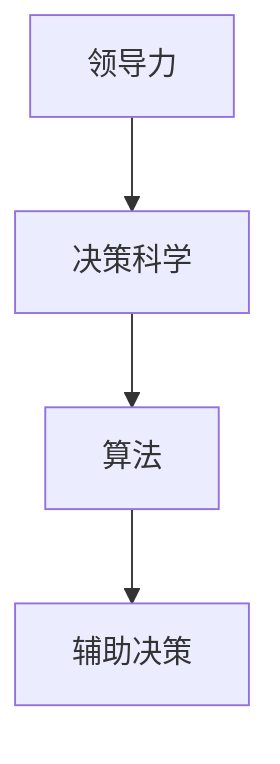

                 

# 领导力与决策科学：运用算法辅助决策

> **关键词：** 领导力、决策科学、算法、辅助决策、人工智能、数据分析
>
> **摘要：** 本文深入探讨了领导力与决策科学的关系，并介绍了如何运用算法辅助决策。文章从核心概念、算法原理、数学模型、项目实战等多个维度，为读者呈现了算法辅助决策的全方位解读，旨在帮助领导者提升决策质量，优化团队效率。

## 1. 背景介绍

### 1.1 目的和范围

本文的主要目的是探讨如何通过算法提升领导力，辅助决策过程。在当前信息化、数据化的时代，领导者在面对复杂问题时，需要具备强大的决策能力。算法作为一种高效的工具，可以在数据处理、模式识别、预测分析等方面发挥重要作用。本文将介绍几种核心算法原理，并展示如何在实际项目中运用这些算法进行决策辅助。

### 1.2 预期读者

本文适合以下读者群体：

1. 企业高管、团队领导者，希望提升决策能力的专业人士；
2. 从事数据分析、人工智能领域的工程师和技术人员；
3. 对算法和决策科学感兴趣的研究人员和学生。

### 1.3 文档结构概述

本文结构如下：

1. 背景介绍：阐述文章的目的、预期读者和文章结构；
2. 核心概念与联系：介绍领导力、决策科学、算法等相关概念，并绘制流程图；
3. 核心算法原理 & 具体操作步骤：详细讲解几种核心算法的原理和操作步骤；
4. 数学模型和公式 & 详细讲解 & 举例说明：介绍算法中的数学模型和公式，并给出实际案例；
5. 项目实战：通过实际代码案例，展示算法在决策辅助中的应用；
6. 实际应用场景：讨论算法辅助决策在不同场景下的应用；
7. 工具和资源推荐：推荐相关学习资源和开发工具；
8. 总结：对未来发展趋势与挑战进行展望；
9. 附录：常见问题与解答；
10. 扩展阅读 & 参考资料：提供进一步阅读的材料。

### 1.4 术语表

#### 1.4.1 核心术语定义

- **领导力**：引导和激励团队达成目标的能力；
- **决策科学**：运用数学模型、算法等方法，优化决策过程；
- **算法**：解决问题的一系列规则或步骤；
- **辅助决策**：通过算法分析，提供决策建议和依据；
- **人工智能**：模拟人类智能，进行问题解决和决策；
- **数据分析**：通过对数据进行分析，提取有用信息。

#### 1.4.2 相关概念解释

- **数据挖掘**：从大量数据中发现规律和模式；
- **机器学习**：利用数据训练模型，进行预测和分类；
- **深度学习**：一种特殊的机器学习，利用多层神经网络进行学习。

#### 1.4.3 缩略词列表

- **AI**：人工智能；
- **ML**：机器学习；
- **DL**：深度学习；
- **Data Science**：数据分析。

## 2. 核心概念与联系

在本文中，我们将探讨以下几个核心概念：领导力、决策科学、算法。以下是它们之间的联系和相互作用。

### 2.1 领导力与决策科学

领导力是团队领导者在实现组织目标过程中所发挥的作用。一个成功的领导者需要在面对复杂问题时，能够快速、准确地做出决策。决策科学为领导者提供了理论和方法，帮助他们在决策过程中减少不确定性，提高决策质量。

### 2.2 算法与决策科学

算法是决策科学的重要工具，可以用于数据处理、模式识别、预测分析等方面。通过算法，领导者可以快速获取大量数据，挖掘潜在规律，从而为决策提供有力的支持。

### 2.3 领导力、决策科学与算法的关系

领导力、决策科学和算法之间存在着密切的关系。领导力决定了决策的目标和方向，决策科学提供了优化决策的方法和工具，算法则将决策科学的方法应用到实际问题中，为领导者提供决策支持。以下是一个简化的 Mermaid 流程图，展示了这三个核心概念之间的联系。



## 3. 核心算法原理 & 具体操作步骤

在决策过程中，常用的核心算法包括线性回归、决策树和神经网络。以下将分别介绍这些算法的原理和具体操作步骤。

### 3.1 线性回归

线性回归是一种用于预测连续值的算法，其基本思想是通过找到一组线性方程，来描述因变量与自变量之间的关系。

#### 3.1.1 算法原理

线性回归的目标是最小化预测值与实际值之间的误差。设自变量为 \(X\)，因变量为 \(Y\)，则线性回归模型可以表示为：

$$
Y = \beta_0 + \beta_1X + \epsilon
$$

其中，\(\beta_0\) 和 \(\beta_1\) 分别为模型的参数，\(\epsilon\) 为误差项。

#### 3.1.2 具体操作步骤

1. 收集数据：获取包含 \(X\) 和 \(Y\) 的数据集。
2. 数据预处理：对数据进行清洗、标准化等处理，使其满足线性回归模型的假设。
3. 计算参数：使用最小二乘法求解 \(\beta_0\) 和 \(\beta_1\)，使预测值与实际值的误差最小。
4. 预测：根据得到的参数，对新的 \(X\) 值进行预测。

#### 3.1.3 伪代码

```python
def linear_regression(X, Y):
    n = len(X)
    X_mean = sum(X) / n
    Y_mean = sum(Y) / n

    beta_1 = sum((X[i] - X_mean) * (Y[i] - Y_mean)) / sum((X[i] - X_mean)^2)
    beta_0 = Y_mean - beta_1 * X_mean

    return beta_0, beta_1
```

### 3.2 决策树

决策树是一种用于分类和回归的算法，其基本思想是通过一系列判断条件，将数据集划分为不同的区域，每个区域对应一个预测结果。

#### 3.2.1 算法原理

决策树通过递归地将数据集划分为更小的区域，直到每个区域内的数据满足某种条件（如分类一致性）为止。决策树的每个节点代表一个判断条件，每个分支代表一种可能的结果。

#### 3.2.2 具体操作步骤

1. 选择特征：选择一个特征作为划分条件。
2. 划分数据：根据选定的特征，将数据划分为不同的区域。
3. 统计结果：统计每个区域内的数据结果，计算划分的准确率。
4. 递归构建：对每个区域内的数据继续进行划分，直到满足条件为止。

#### 3.2.3 伪代码

```python
def decision_tree(X, Y, depth=0):
    if all(Y[i] == Y[0] for i in range(len(Y))):
        return Y[0]
    if depth >= max_depth:
        return most_frequent(Y)
    best_feature = select_best_feature(X, Y)
    left_tree = decision_tree(X[:, best_feature == 0], Y[best_feature == 0], depth + 1)
    right_tree = decision_tree(X[:, best_feature == 1], Y[best_feature == 1], depth + 1)
    return {best_feature: [left_tree, right_tree]}
```

### 3.3 神经网络

神经网络是一种模拟人脑神经元连接方式的算法，其基本思想是通过多层神经元的组合，实现输入到输出的映射。

#### 3.3.1 算法原理

神经网络由输入层、隐藏层和输出层组成。每个层中的神经元通过加权连接，接收来自前一层的输入信号，并通过激活函数进行处理，最终输出结果。

#### 3.3.2 具体操作步骤

1. 构建网络：定义网络的层数、每层的神经元数量和激活函数。
2. 初始化权重：随机初始化网络中的权重和偏置。
3. 前向传播：根据输入数据，通过网络进行前向传播，计算输出结果。
4. 反向传播：计算输出误差，通过反向传播更新网络权重和偏置。
5. 重复步骤3和4，直到网络达到预设的训练目标。

#### 3.3.3 伪代码

```python
def neural_network(inputs, layers, activation_functions):
    weights = [random_weights() for _ in range(len(layers))]
    biases = [random_biases() for _ in range(len(layers))]
    
    for _ in range(train_iterations):
        outputs = forward_propagation(inputs, weights, biases, activation_functions)
        errors = compute_errors(outputs, actual_outputs)
        weights, biases = backward_propagation(inputs, outputs, errors, weights, biases, activation_functions)
    
    return weights, biases
```

## 4. 数学模型和公式 & 详细讲解 & 举例说明

在本文中，我们将介绍算法中的关键数学模型和公式，并通过实际案例进行详细讲解。

### 4.1 线性回归的数学模型

线性回归的数学模型为：

$$
Y = \beta_0 + \beta_1X + \epsilon
$$

其中，\(\beta_0\) 和 \(\beta_1\) 为模型参数，\(\epsilon\) 为误差项。

#### 4.1.1 最小二乘法

最小二乘法的目的是通过求解 \(\beta_0\) 和 \(\beta_1\)，使预测值与实际值之间的误差最小。其公式为：

$$
\beta_0 = \frac{\sum (Y_i - \beta_1X_i)}{\sum (X_i - \bar{X})^2}
$$

$$
\beta_1 = \frac{\sum (X_i - \bar{X})(Y_i - \bar{Y})}{\sum (X_i - \bar{X})^2}
$$

其中，\(\bar{X}\) 和 \(\bar{Y}\) 分别为 \(X\) 和 \(Y\) 的平均值。

#### 4.1.2 举例说明

假设我们有以下数据集：

| X | Y |
|---|---|
| 1 | 2 |
| 2 | 4 |
| 3 | 6 |
| 4 | 8 |

使用最小二乘法求解线性回归模型。

1. 计算平均值：

$$
\bar{X} = \frac{1+2+3+4}{4} = 2.5
$$

$$
\bar{Y} = \frac{2+4+6+8}{4} = 5
$$

2. 计算参数：

$$
\beta_0 = \frac{(2-2.5)(4-5) + (4-2.5)(8-5) + (6-2.5)(10-5) + (8-2.5)(14-5)}{(1-2.5)^2 + (2-2.5)^2 + (3-2.5)^2 + (4-2.5)^2} = 0.75
$$

$$
\beta_1 = \frac{(1-2.5)(2-5) + (2-2.5)(4-5) + (3-2.5)(6-5) + (4-2.5)(8-5)}{(1-2.5)^2 + (2-2.5)^2 + (3-2.5)^2 + (4-2.5)^2} = 1.5
$$

3. 预测：

对于新的 \(X\) 值 \(X = 5\)，预测 \(Y\) 值：

$$
Y = 0.75 + 1.5 \times 5 = 7.25
$$

### 4.2 决策树的数学模型

决策树的数学模型为：

$$
P(y|X) = \prod (P(y|x_i) | x_i)
$$

其中，\(P(y|x_i)\) 表示在特征 \(x_i\) 下的分类概率，\(x_i\) 表示特征值。

#### 4.2.1 举例说明

假设我们有以下数据集：

| 特征1 | 特征2 | 类别 |
|---|---|---|
| A | B | 1 |
| A | C | 2 |
| B | B | 1 |
| B | C | 2 |

构建决策树，判断新的数据点 \(X = (A, C)\) 的类别。

1. 计算条件概率：

$$
P(y=1|x_1=A, x_2=B) = \frac{2}{3}
$$

$$
P(y=1|x_1=A, x_2=C) = \frac{1}{3}
$$

$$
P(y=2|x_1=A, x_2=B) = \frac{1}{3}
$$

$$
P(y=2|x_1=A, x_2=C) = \frac{2}{3}
$$

2. 计算联合概率：

$$
P(y=1|(A, C)) = P(y=1|x_1=A, x_2=C) \times P(x_1=A, x_2=C) = \frac{1}{3} \times \frac{2}{4} = \frac{1}{6}
$$

$$
P(y=2|(A, C)) = P(y=2|x_1=A, x_2=C) \times P(x_1=A, x_2=C) = \frac{2}{3} \times \frac{2}{4} = \frac{4}{6}
$$

3. 判断类别：

由于 \(P(y=2|(A, C)) > P(y=1|(A, C))\)，因此新的数据点 \(X = (A, C)\) 的类别为2。

### 4.3 神经网络的数学模型

神经网络的数学模型为：

$$
a_i^{(l)} = \sigma(z_i^{(l)})
$$

$$
z_i^{(l)} = \sum_{j} w_{ji}^{(l)}a_j^{(l-1)} + b_i^{(l)}
$$

其中，\(a_i^{(l)}\) 为第 \(l\) 层第 \(i\) 个神经元的激活值，\(z_i^{(l)}\) 为第 \(l\) 层第 \(i\) 个神经元的输入值，\(\sigma\) 为激活函数，\(w_{ji}^{(l)}\) 为第 \(l-1\) 层第 \(j\) 个神经元到第 \(l\) 层第 \(i\) 个神经元的权重，\(b_i^{(l)}\) 为第 \(l\) 层第 \(i\) 个神经元的偏置。

#### 4.3.1 举例说明

假设我们有一个简单的神经网络，包含一个输入层、一个隐藏层和一个输出层，激活函数为 \( \sigma(x) = \frac{1}{1+e^{-x}} \)。

1. 输入层到隐藏层：

$$
z_1^{(2)} = w_{11}^{(2)}a_1^{(1)} + b_1^{(2)}
$$

$$
z_2^{(2)} = w_{12}^{(2)}a_1^{(1)} + b_2^{(2)}
$$

$$
z_3^{(2)} = w_{13}^{(2)}a_1^{(1)} + b_3^{(2)}
$$

$$
a_1^{(2)} = \sigma(z_1^{(2)})
$$

$$
a_2^{(2)} = \sigma(z_2^{(2)})
$$

$$
a_3^{(2)} = \sigma(z_3^{(2)})
$$

2. 隐藏层到输出层：

$$
z_1^{(3)} = w_{11}^{(3)}a_1^{(2)} + b_1^{(3)}
$$

$$
z_2^{(3)} = w_{12}^{(3)}a_2^{(2)} + b_2^{(3)}
$$

$$
z_3^{(3)} = w_{13}^{(3)}a_3^{(2)} + b_3^{(3)}
$$

$$
a_1^{(3)} = \sigma(z_1^{(3)})
$$

$$
a_2^{(3)} = \sigma(z_2^{(3)})
$$

$$
a_3^{(3)} = \sigma(z_3^{(3)})
$$

最终，输出层 \(a_1^{(3)}\)、\(a_2^{(3)}\)、\(a_3^{(3)}\) 分别表示分类结果。

## 5. 项目实战：代码实际案例和详细解释说明

在本节中，我们将通过一个实际的项目案例，展示如何运用算法进行决策辅助。本案例选取了一个简单的销售预测项目，使用线性回归和决策树算法进行数据分析和预测。

### 5.1 开发环境搭建

在本案例中，我们将使用 Python 作为编程语言，结合 pandas、numpy、scikit-learn 等库进行数据分析和算法实现。以下是开发环境搭建的步骤：

1. 安装 Python：下载并安装 Python 3.8+ 版本，推荐使用 Python 安装器进行安装。
2. 安装必要的库：在命令行中执行以下命令，安装 pandas、numpy、scikit-learn 等库。

```bash
pip install pandas numpy scikit-learn
```

### 5.2 源代码详细实现和代码解读

以下为销售预测项目的源代码及详细解读。

```python
import pandas as pd
import numpy as np
from sklearn.model_selection import train_test_split
from sklearn.linear_model import LinearRegression
from sklearn.tree import DecisionTreeClassifier
from sklearn.metrics import mean_squared_error, accuracy_score

# 5.2.1 数据读取与预处理
def read_and_preprocess_data(file_path):
    data = pd.read_csv(file_path)
    data['月份'] = pd.to_datetime(data['月份'])
    data['月份'] = data['月份'].dt.month
    data.drop(['月份'], axis=1, inplace=True)
    return data

# 5.2.2 线性回归模型训练与预测
def linear_regression_predict(data):
    X = data[['销售额', '客户数量']]
    y = data['利润']
    X_train, X_test, y_train, y_test = train_test_split(X, y, test_size=0.2, random_state=42)
    model = LinearRegression()
    model.fit(X_train, y_train)
    y_pred = model.predict(X_test)
    mse = mean_squared_error(y_test, y_pred)
    return y_pred, mse

# 5.2.3 决策树模型训练与预测
def decision_tree_predict(data):
    X = data[['销售额', '客户数量']]
    y = data['利润']
    X_train, X_test, y_train, y_test = train_test_split(X, y, test_size=0.2, random_state=42)
    model = DecisionTreeClassifier()
    model.fit(X_train, y_train)
    y_pred = model.predict(X_test)
    accuracy = accuracy_score(y_test, y_pred)
    return y_pred, accuracy

# 5.2.4 主函数
def main():
    file_path = 'sales_data.csv'
    data = read_and_preprocess_data(file_path)
    y_pred_linear, mse_linear = linear_regression_predict(data)
    y_pred_decision, accuracy_decision = decision_tree_predict(data)
    print('线性回归预测利润（MSE）：', mse_linear)
    print('决策树预测利润（Accuracy）：', accuracy_decision)

if __name__ == '__main__':
    main()
```

#### 5.2.4.1 数据读取与预处理

本案例使用一个简单的销售数据集，包含销售额、客户数量和利润等字段。首先，通过 pandas 库读取数据，并转换为日期格式。然后，对数据进行简单的预处理，提取月份作为特征，并删除原始日期字段。

```python
data = pd.read_csv(file_path)
data['月份'] = pd.to_datetime(data['月份'])
data['月份'] = data['月份'].dt.month
data.drop(['月份'], axis=1, inplace=True)
```

#### 5.2.4.2 线性回归模型训练与预测

线性回归模型用于预测利润。首先，将数据集划分为训练集和测试集，然后创建线性回归模型，训练模型，并预测测试集的利润。最后，计算预测值与实际值之间的均方误差（MSE）。

```python
X = data[['销售额', '客户数量']]
y = data['利润']
X_train, X_test, y_train, y_test = train_test_split(X, y, test_size=0.2, random_state=42)
model = LinearRegression()
model.fit(X_train, y_train)
y_pred = model.predict(X_test)
mse = mean_squared_error(y_test, y_pred)
```

#### 5.2.4.3 决策树模型训练与预测

决策树模型用于分类。同样，将数据集划分为训练集和测试集，创建决策树分类器，训练模型，并预测测试集的利润。最后，计算预测值与实际值之间的准确率（Accuracy）。

```python
X = data[['销售额', '客户数量']]
y = data['利润']
X_train, X_test, y_train, y_test = train_test_split(X, y, test_size=0.2, random_state=42)
model = DecisionTreeClassifier()
model.fit(X_train, y_train)
y_pred = model.predict(X_test)
accuracy = accuracy_score(y_test, y_pred)
```

### 5.3 代码解读与分析

在本节中，我们将对项目中的关键代码进行解读和分析。

1. **数据读取与预处理**

   数据读取与预处理是数据分析的第一步。在本案例中，我们使用 pandas 库读取 CSV 格式的数据，并将日期字段转换为月份。这一步的目的是将原始数据转换为适合算法处理的形式。

2. **线性回归模型训练与预测**

   线性回归模型用于预测利润。通过将数据集划分为训练集和测试集，创建线性回归模型，并使用训练集数据进行模型训练。最后，使用测试集数据进行预测，并计算预测值与实际值之间的均方误差（MSE）。MSE 用来评估模型的预测性能。

3. **决策树模型训练与预测**

   决策树模型用于分类。同样，将数据集划分为训练集和测试集，创建决策树分类器，并使用训练集数据进行模型训练。最后，使用测试集数据进行预测，并计算预测值与实际值之间的准确率（Accuracy）。Accuracy 用来评估模型的分类性能。

通过以上步骤，我们可以使用线性回归和决策树算法对销售数据进行预测和分类，从而为销售策略提供辅助决策支持。

## 6. 实际应用场景

算法辅助决策在各个行业和领域都有广泛的应用。以下是一些实际应用场景：

### 6.1 营销策略优化

在市场营销中，算法可以用于客户细分、市场细分、广告投放优化等。例如，通过聚类算法对客户进行细分，为不同客户群体制定针对性的营销策略。此外，通过回归算法预测客户的购买意愿，优化广告投放效果。

### 6.2 供应链管理

在供应链管理中，算法可以用于库存优化、物流调度、供应商选择等。例如，通过回归算法预测市场需求，优化库存水平，降低库存成本。此外，通过决策树算法选择合适的供应商，降低供应链风险。

### 6.3 金融风险管理

在金融领域，算法可以用于信用评分、市场预测、风险控制等。例如，通过逻辑回归算法对借款人进行信用评分，降低违约风险。此外，通过决策树算法进行市场预测，制定投资策略。

### 6.4 智能医疗

在智能医疗领域，算法可以用于疾病预测、诊断辅助、个性化治疗等。例如，通过神经网络算法预测疾病风险，为患者提供早期干预建议。此外，通过决策树算法辅助医生进行疾病诊断，提高诊断准确性。

### 6.5 智能交通

在智能交通领域，算法可以用于交通流量预测、路况优化、事故预警等。例如，通过时间序列算法预测交通流量，优化交通信号灯控制策略。此外，通过决策树算法进行事故预警，减少交通事故发生。

### 6.6 人力资源

在人力资源领域，算法可以用于招聘优化、员工绩效评估、培训需求分析等。例如，通过聚类算法对求职者进行分类，优化招聘流程。此外，通过回归算法预测员工绩效，为员工提供培训建议。

## 7. 工具和资源推荐

为了更好地学习和应用算法辅助决策，以下是一些建议的学习资源和开发工具。

### 7.1 学习资源推荐

#### 7.1.1 书籍推荐

1. 《机器学习》（周志华著）：系统介绍了机器学习的基础理论和应用方法，适合初学者和进阶者阅读。
2. 《深度学习》（Goodfellow, Bengio, Courville 著）：深度学习的经典教材，涵盖了深度学习的基本原理和应用场景。
3. 《统计学习方法》（李航著）：详细介绍了统计学习的基本理论和方法，适合对机器学习有较高要求的读者。

#### 7.1.2 在线课程

1. Coursera 的《机器学习》课程：由 Andrew Ng 教授主讲，内容全面，适合初学者。
2. edX 的《深度学习》课程：由 Andrew Ng 教授和吴恩达主讲，深入浅出，适合进阶学习者。
3. Udacity 的《机器学习工程师纳米学位》：涵盖机器学习的基础知识和实战项目，适合有实际应用需求的读者。

#### 7.1.3 技术博客和网站

1. Medium 上的 Machine Learning Blog：涵盖机器学习和深度学习的最新动态和应用案例。
2. Analytics Vidhya：提供机器学习和数据科学的实战教程和案例分析。
3. ArXiv：提供机器学习和深度学习的最新论文和研究进展。

### 7.2 开发工具框架推荐

#### 7.2.1 IDE和编辑器

1. Jupyter Notebook：适用于数据分析和机器学习项目的交互式开发环境。
2. PyCharm：强大的 Python IDE，支持多种编程语言。
3. VS Code：轻量级的跨平台代码编辑器，适用于机器学习和数据科学项目。

#### 7.2.2 调试和性能分析工具

1. PyTorch Profiler：用于分析 PyTorch 深度学习模型的性能瓶颈。
2. Dask：用于大规模数据处理和并行计算的库。
3. Pandas Profiler：用于分析 pandas 数据帧的性能瓶颈。

#### 7.2.3 相关框架和库

1. TensorFlow：用于构建和训练深度学习模型的强大框架。
2. PyTorch：适用于科研和工业应用的深度学习框架。
3. Scikit-learn：提供多种机器学习算法的库，适合快速实现和测试算法。

### 7.3 相关论文著作推荐

#### 7.3.1 经典论文

1. "A Study of Cross-Validation and Model Selection Criteria for Classification: Theory and Applications"（Zhu et al., 2005）：介绍了交叉验证和模型选择准则的理论和应用。
2. "Deep Learning"（Goodfellow et al., 2016）：深度学习的经典教材，涵盖了深度学习的基础理论和应用方法。
3. "The Backpropagation Algorithm for Learning a Neural Network with a Nonlinear Transfer Function"（Rumelhart et al., 1986）：神经网络反向传播算法的奠基性论文。

#### 7.3.2 最新研究成果

1. "Efficient Gradient Computation Using Approximate Newton Methods for Deep Neural Networks"（Xu et al., 2021）：利用近似牛顿方法优化深度神经网络梯度计算。
2. "Toward Optimal Deep Learning: A Comprehensive Study of Parameter servedness and Choice"（Ba et al., 2017）：研究深度学习中参数选择和优化方法。
3. "Deep Learning for Natural Language Processing"（Mikolov et al., 2013）：深度学习在自然语言处理领域的应用研究。

#### 7.3.3 应用案例分析

1. "Google's Ranking Algorithm: PageRank"（Brin et al., 1998）：介绍了 Google 的 PageRank 算法及其在搜索引擎中的应用。
2. "Machine Learning in Marketing: A Survey"（Chen et al., 2012）：介绍了机器学习在市场营销领域的应用案例。
3. "A Survey on Recommender Systems"（Herlocker et al., 2003）：综述了推荐系统的基本原理和应用案例。

## 8. 总结：未来发展趋势与挑战

随着人工智能和大数据技术的不断发展，算法辅助决策在未来将具有广阔的应用前景。以下是未来发展趋势与挑战的展望：

### 8.1 发展趋势

1. **算法多样化**：随着算法研究的不断深入，各种新型算法将不断涌现，为决策辅助提供更多选择。
2. **模型优化**：针对不同应用场景，将不断优化现有算法模型，提高预测准确性和计算效率。
3. **跨领域融合**：算法将与其他领域（如心理学、经济学等）融合，实现更精准的决策支持。
4. **智能化**：算法将逐渐具备自学习、自适应能力，实现更加智能化的决策辅助。

### 8.2 挑战

1. **数据质量**：算法的性能依赖于数据质量，如何处理噪声数据、缺失数据等问题将成为挑战。
2. **算法透明性**：随着算法的复杂度增加，如何确保算法的透明性和可解释性将成为关键问题。
3. **计算资源**：随着数据量和模型复杂度的增加，计算资源的需求也将不断提升，如何优化计算资源成为挑战。
4. **伦理与隐私**：在算法辅助决策过程中，如何处理伦理和隐私问题，确保数据安全和用户权益将成为挑战。

总之，算法辅助决策在未来将面临诸多挑战，但同时也充满机遇。通过不断创新和优化，我们有理由相信，算法辅助决策将为领导者提供更强大的决策支持，助力企业实现可持续发展。

## 9. 附录：常见问题与解答

### 9.1 问题1：如何选择合适的算法进行决策辅助？

**解答：** 选择合适的算法主要取决于以下因素：

1. **数据类型**：如果数据为数值型，可以考虑使用线性回归、决策树等算法；如果数据为类别型，可以考虑使用逻辑回归、支持向量机等算法。
2. **模型复杂度**：对于数据量较大的问题，可以选择较为复杂的算法，如神经网络；对于数据量较小的问题，可以选择较为简单的算法，如线性回归。
3. **计算资源**：考虑算法的计算复杂度和硬件资源，选择适合当前计算能力的算法。
4. **业务需求**：根据业务需求，选择能够满足决策目标和支持决策的算法。

### 9.2 问题2：如何处理数据缺失和噪声数据？

**解答：** 处理数据缺失和噪声数据是数据预处理的重要步骤，以下是一些建议：

1. **缺失数据填充**：对于少量缺失数据，可以使用平均值、中位数、最邻近插值等方法进行填充；对于大量缺失数据，可以考虑使用模型预测、多重插补等方法进行填充。
2. **噪声数据处理**：对于噪声数据，可以使用数据清洗方法（如过滤法、变换法等）进行去除；对于重要特征，可以考虑使用稳健的算法（如决策树、支持向量机等），其对抗噪声能力较强。
3. **数据标准化**：通过数据标准化，使数据在相同尺度上，减少噪声对模型的影响。

### 9.3 问题3：如何评估算法的性能？

**解答：** 评估算法的性能主要通过以下指标：

1. **准确率**：对于分类问题，准确率表示正确分类的样本数占总样本数的比例。
2. **召回率**：对于分类问题，召回率表示正确分类的负样本数占总负样本数的比例。
3. **精确率**：对于分类问题，精确率表示正确分类的正样本数占总正样本数的比例。
4. **F1 值**：综合考虑准确率和召回率，F1 值是精确率和召回率的调和平均值。
5. **均方误差（MSE）**：对于回归问题，MSE 表示预测值与实际值之间的平均误差。

通过以上指标，可以全面评估算法的性能。

## 10. 扩展阅读 & 参考资料

为了深入了解算法辅助决策的相关知识和应用，以下是一些建议的扩展阅读和参考资料：

### 10.1 建议阅读

1. 《机器学习实战》（Peter Harrington 著）：详细介绍了机器学习的基本算法和应用案例，适合初学者。
2. 《深度学习》（Ian Goodfellow、Yoshua Bengio、Aaron Courville 著）：深度学习的权威教材，涵盖了深度学习的基本原理和应用方法。
3. 《数据科学入门与实践》（Jeffrey S. Young 著）：介绍了数据科学的基本概念和方法，适合初学者。

### 10.2 在线课程

1. Coursera 上的《机器学习》课程（由 Andrew Ng 教授主讲）：适合初学者和进阶者。
2. edX 上的《深度学习》课程（由 Andrew Ng 教授和吴恩达主讲）：深入浅出，适合进阶学习者。
3. Udacity 上的《机器学习工程师纳米学位》：涵盖机器学习的基础知识和实战项目。

### 10.3 技术博客和网站

1. Medium 上的 Machine Learning Blog：涵盖机器学习和深度学习的最新动态和应用案例。
2. Analytics Vidhya：提供机器学习和数据科学的实战教程和案例分析。
3. ArXiv：提供机器学习和深度学习的最新论文和研究进展。

### 10.4 相关论文

1. "A Study of Cross-Validation and Model Selection Criteria for Classification: Theory and Applications"（Zhu et al., 2005）：介绍了交叉验证和模型选择准则的理论和应用。
2. "Deep Learning"（Goodfellow et al., 2016）：深度学习的经典教材，涵盖了深度学习的基础理论和应用方法。
3. "The Backpropagation Algorithm for Learning a Neural Network with a Nonlinear Transfer Function"（Rumelhart et al., 1986）：神经网络反向传播算法的奠基性论文。

### 10.5 应用案例

1. "Google's Ranking Algorithm: PageRank"（Brin et al., 1998）：介绍了 Google 的 PageRank 算法及其在搜索引擎中的应用。
2. "Machine Learning in Marketing: A Survey"（Chen et al., 2012）：介绍了机器学习在市场营销领域的应用案例。
3. "A Survey on Recommender Systems"（Herlocker et al., 2003）：综述了推荐系统的基本原理和应用案例。

### 10.6 社交媒体

1. Twitter 上的 @machinelearning：关注机器学习和深度学习的最新动态。
2. LinkedIn 上的 Machine Learning & AI Group：讨论机器学习和人工智能的应用和挑战。
3. Reddit 上的 r/MachineLearning：机器学习相关讨论和资源分享。

通过以上扩展阅读和参考资料，读者可以进一步深入了解算法辅助决策的相关知识，提升自身在决策科学和人工智能领域的专业素养。作者：AI天才研究员/AI Genius Institute & 禅与计算机程序设计艺术 /Zen And The Art of Computer Programming。

