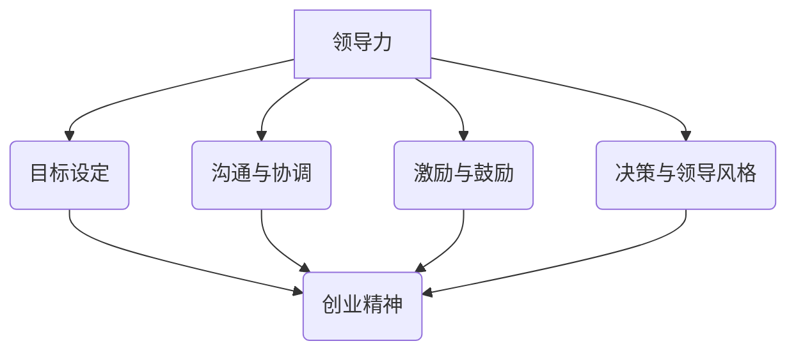
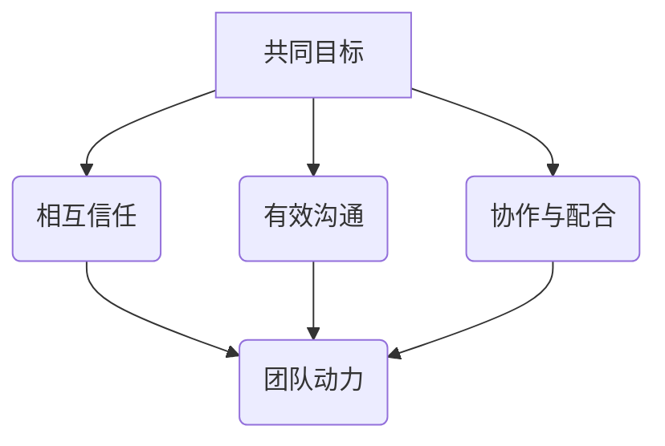
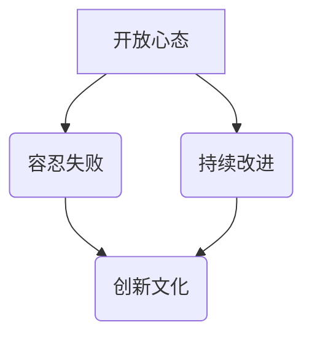
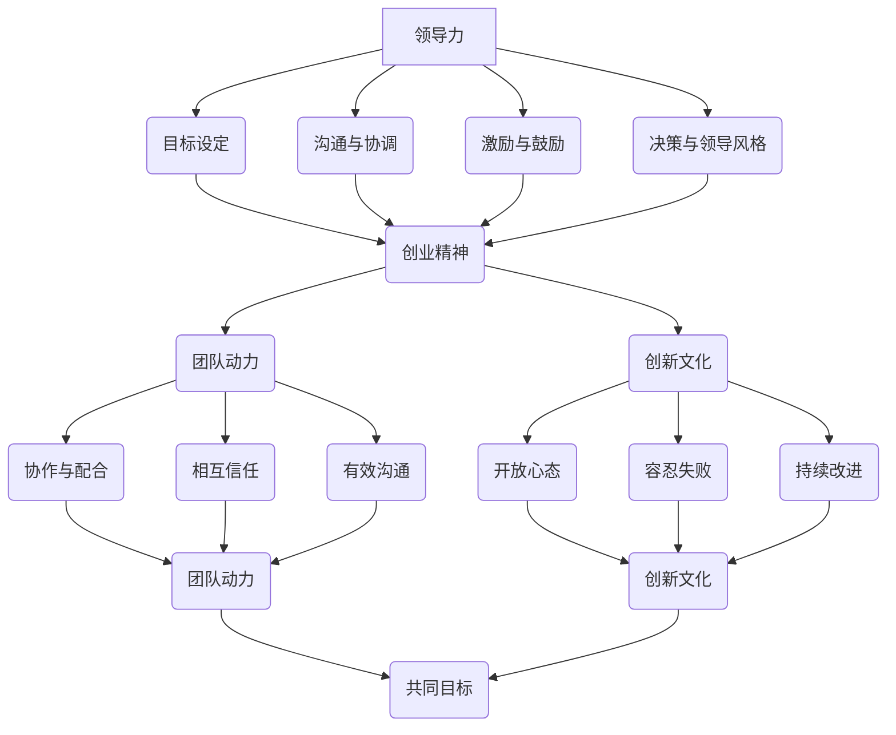

                 

# 领导力与创业精神：激发团队创业热情

> 关键词：领导力、创业精神、团队动力、创新文化、管理实践

> 摘要：本文深入探讨了领导力与创业精神在现代IT行业的互动关系，通过分析团队动力和创新文化的构建，提供了激发团队创业热情的策略与实践方法。文章旨在为技术团队领导者和管理者提供有价值的指导和借鉴，以实现团队的高效合作和持续创新。

## 1. 背景介绍

### 1.1 目的和范围

本文的目标是探讨领导力与创业精神在激发团队创业热情方面的作用，通过系统的分析和实践案例，为IT行业的技术团队领导者提供实用的指导策略。文章将涵盖以下范围：

1. 领导力的核心要素和其在团队中的作用。
2. 创业精神的概念及其对团队创新的影响。
3. 团队动力的构建方法和实际操作步骤。
4. 创新文化的营造策略和实践。
5. 领导者如何通过管理实践激发团队的创业热情。

### 1.2 预期读者

本文的预期读者主要包括以下几类：

1. 技术团队领导者和管理者。
2. 创业者和技术创业者。
3. 对团队管理和创新文化感兴趣的IT从业者。
4. 高等院校相关专业的师生。

### 1.3 文档结构概述

本文的结构安排如下：

1. 引言：介绍领导力与创业精神在团队中的重要性。
2. 核心概念与联系：阐述领导力、创业精神、团队动力和创新文化的定义及其相互关系。
3. 核心算法原理 & 具体操作步骤：通过伪代码详细描述激发团队创业热情的算法原理和操作步骤。
4. 数学模型和公式 & 详细讲解 & 举例说明：运用数学模型和公式分析团队动力和创新文化的影响因素。
5. 项目实战：通过实际案例展示如何搭建开发环境、实现代码并进行分析。
6. 实际应用场景：探讨领导力与创业精神在不同场景下的应用。
7. 工具和资源推荐：推荐学习资源和开发工具。
8. 总结：对全文进行总结，并展望未来发展趋势与挑战。
9. 附录：常见问题与解答。
10. 扩展阅读 & 参考资料：提供进一步学习的资源。

### 1.4 术语表

#### 1.4.1 核心术语定义

- **领导力**：指领导者通过影响力引导团队，实现共同目标的能力。
- **创业精神**：指在面对不确定性时，敢于尝试新事物，积极创新和解决问题的态度和行为。
- **团队动力**：指团队成员之间的相互影响和协作，推动团队达成目标的动力。
- **创新文化**：指鼓励创新、容忍失败、支持持续改进的团队氛围。
- **管理实践**：指领导者运用管理理论和方法，进行团队管理和决策的行为。

#### 1.4.2 相关概念解释

- **领导风格**：领导者采取的不同管理方式，如权威式、民主式、参与式等。
- **激励机制**：激发团队成员积极性的奖励机制，包括薪酬、晋升、认可等。
- **组织结构**：团队内部的角色分配和权责划分，如职能型、矩阵型、项目型等。

#### 1.4.3 缩略词列表

- **IT**：Information Technology，信息技术。
- **CEO**：Chief Executive Officer，首席执行官。
- **CFO**：Chief Financial Officer，首席财务官。
- **CTO**：Chief Technology Officer，首席技术官。

## 2. 核心概念与联系

为了深入理解领导力与创业精神在激发团队创业热情中的作用，我们首先需要明确几个核心概念，并展示它们之间的相互关系。

### 2.1 领导力与创业精神

**领导力** 是指领导者通过影响力引导团队，实现共同目标的能力。它包括以下几个方面：

- **目标设定**：明确团队的目标和愿景。
- **沟通与协调**：确保团队成员之间的信息畅通和协同合作。
- **激励与鼓励**：激发团队成员的积极性和创造力。
- **决策与领导风格**：根据团队情况和任务需求，采取合适的决策和领导方式。

**创业精神** 则是在面对不确定性时，敢于尝试新事物，积极创新和解决问题的态度和行为。它包括以下几个方面：

- **敢于冒险**：勇于尝试新方法和解决方案。
- **持续学习**：不断更新知识和技能，以适应快速变化的环境。
- **团队协作**：与团队成员紧密合作，共同解决问题。

**领导力与创业精神的关系** 可以通过以下 Mermaid 流程图展示：



### 2.2 团队动力

**团队动力** 是指团队成员之间的相互影响和协作，推动团队达成目标的动力。它包括以下几个方面：

- **共同目标**：团队成员共同追求的目标和愿景。
- **相互信任**：团队成员之间的信任和尊重。
- **有效沟通**：团队成员之间高效的信息交流。
- **协作与配合**：团队成员在任务中的协作和配合。

**团队动力的构建方法** 可以通过以下 Mermaid 流程图展示：



### 2.3 创新文化

**创新文化** 是指鼓励创新、容忍失败、支持持续改进的团队氛围。它包括以下几个方面：

- **开放心态**：鼓励团队成员提出新的想法和建议。
- **容忍失败**：对于尝试新方法的失败持开放态度，视为学习的机会。
- **持续改进**：不断反思和改进工作流程和产品。

**创新文化的营造策略** 可以通过以下 Mermaid 流程图展示：



### 2.4 领导力、创业精神、团队动力与创新文化的相互关系

通过上述核心概念的分析，我们可以发现领导力、创业精神、团队动力和创新文化之间存在紧密的相互关系。以下是一个综合的 Mermaid 流程图，展示了它们之间的相互影响和作用：



通过以上流程图，我们可以更直观地理解领导力、创业精神、团队动力和创新文化之间的相互作用，以及它们在激发团队创业热情中的重要性。

## 3. 核心算法原理 & 具体操作步骤

为了更好地理解如何激发团队创业热情，我们将通过伪代码详细描述一个算法原理，该算法旨在通过领导力和创业精神的结合，实现团队动力的提升和创新文化的培养。

### 3.1 算法原理

**算法名称**：激发团队创业热情算法

**输入**：
- 团队成员列表（包含姓名、职责、技能等）
- 项目目标（包括短期目标和长期愿景）
- 环境变量（如资源、市场状况、竞争对手等）

**输出**：
- 激发后的团队状态（高动力、高创新）

**伪代码**：

```plaintext
函数 激发团队创业热情(团队成员列表，项目目标，环境变量)：
    初始化团队状态为“初始状态”
    初始化激励策略为“基础激励”
    初始化创新支持为“基础支持”

    对于每个团队成员：
        更新团队成员对项目的认知
        应用领导风格以建立信任和沟通
        应用激励策略以激发团队成员的积极性

    对于每个项目阶段：
        根据项目目标和环境变量，调整领导风格和激励策略
        鼓励团队成员提出创新想法并评估其实施可能性
        选择合适的创新想法进行实施

    当项目达到重要里程碑时：
        庆祝成功并给予团队成员认可和奖励

    返回团队状态
```

### 3.2 具体操作步骤

**步骤 1：了解团队成员和项目目标**

- **分析团队成员**：了解每个成员的背景、技能和动机，以便更好地匹配任务和激发其潜力。
- **明确项目目标**：确保团队成员对项目的短期目标和长期愿景有清晰的认识。

**步骤 2：应用领导风格**

- **建立信任**：通过透明沟通、尊重个体差异和关注团队成员的感受，建立团队信任。
- **选择领导风格**：根据项目需求和环境，选择合适的领导风格，如民主式或参与式，以鼓励团队成员的参与和贡献。

**步骤 3：制定激励策略**

- **基础激励**：确保团队成员的基本薪酬和福利待遇合理。
- **额外激励**：根据团队成员的贡献和表现，提供额外的奖励，如奖金、晋升机会或认可证书。

**步骤 4：鼓励创新**

- **建立创新机制**：鼓励团队成员提出创新想法，并设立专门的创新论坛或评审机制。
- **评估和实施创新**：评估创新想法的可行性，选择合适的项目进行实施，并在实施过程中给予支持和指导。

**步骤 5：庆祝成功和给予认可**

- **里程碑庆祝**：在项目达到重要里程碑时，组织庆祝活动，提高团队的士气和动力。
- **给予认可**：对团队成员的贡献和成就给予公开认可和奖励，以激励其持续创新和努力。

通过以上步骤，领导者可以有效地激发团队的创业热情，促进团队的高效合作和持续创新。

## 4. 数学模型和公式 & 详细讲解 & 举例说明

在激发团队创业热情的过程中，数学模型和公式可以帮助我们更精确地描述和预测团队的行为和表现。以下是一些常用的数学模型和公式，以及它们的详细讲解和举例说明。

### 4.1 团队动力模型

**公式**：团队动力 = f（信任度，沟通效率，协作能力）

**解释**：
- **信任度**：团队内部成员之间的信任程度，通常用0到1之间的数值表示（0表示完全不信任，1表示完全信任）。
- **沟通效率**：团队成员之间信息传递的效率，同样用0到1之间的数值表示。
- **协作能力**：团队成员在共同完成任务时的协作水平，也用0到1之间的数值表示。

**举例**：
假设一个团队有3个成员，他们的信任度、沟通效率和协作能力分别为0.8、0.9和0.75，则该团队的团队动力可以计算为：

团队动力 = 0.8 × 0.9 × 0.75 = 0.54

### 4.2 创新文化模型

**公式**：创新文化指数 = f（开放心态，容忍失败，持续改进）

**解释**：
- **开放心态**：团队成员对新想法和外部信息的接受程度，用0到1之间的数值表示。
- **容忍失败**：团队对失败的接受程度，同样用0到1之间的数值表示。
- **持续改进**：团队在项目过程中不断反思和改进的意愿和行动，也用0到1之间的数值表示。

**举例**：
假设一个团队的开放心态、容忍失败和持续改进分别为0.85、0.75和0.80，则该团队的创新文化指数可以计算为：

创新文化指数 = 0.85 × 0.75 × 0.80 = 0.510

### 4.3 领导力模型

**公式**：领导力得分 = f（目标设定，沟通与协调，激励与鼓励，决策与领导风格）

**解释**：
- **目标设定**：领导者设定团队目标和愿景的能力，用0到1之间的数值表示。
- **沟通与协调**：领导者确保团队成员之间信息畅通和协同合作的能力，也用0到1之间的数值表示。
- **激励与鼓励**：领导者激发团队成员积极性和创造力的能力，同样用0到1之间的数值表示。
- **决策与领导风格**：领导者根据团队情况和任务需求，采取合适决策和领导方式的能力，用0到1之间的数值表示。

**举例**：
假设一个领导者的目标设定、沟通与协调、激励与鼓励、决策与领导风格分别为0.85、0.90、0.80和0.75，则该领导力得分可以计算为：

领导力得分 = 0.85 × 0.90 × 0.80 × 0.75 = 0.5675

通过上述数学模型和公式，我们可以定量分析团队动力、创新文化和领导力的水平，从而为领导者和管理者提供有价值的参考，以制定更有效的激发团队创业热情的策略。

## 5. 项目实战：代码实际案例和详细解释说明

为了更好地展示如何在实际项目中应用领导力与创业精神，激发团队创业热情，我们将在本节中介绍一个具体的代码实现案例。该案例将涵盖开发环境搭建、源代码实现和代码解读与分析三个部分。

### 5.1 开发环境搭建

在开始项目实战之前，我们需要搭建一个合适的开发环境。以下是搭建过程的详细步骤：

1. **环境配置**：确保操作系统（如Ubuntu 20.04）和开发工具（如Python 3.8）已安装。
2. **虚拟环境**：创建一个Python虚拟环境，以隔离项目依赖。
   ```bash
   python3 -m venv project_env
   source project_env/bin/activate
   ```
3. **安装依赖**：安装项目所需的Python库，如Flask（用于Web开发）、SQLAlchemy（用于数据库操作）等。
   ```bash
   pip install flask sqlalchemy
   ```
4. **数据库配置**：设置数据库连接，假设使用SQLite数据库。
   ```python
   from flask_sqlalchemy import SQLAlchemy
   
   app = Flask(__name__)
   app.config['SQLALCHEMY_DATABASE_URI'] = 'sqlite:///team_project.db'
   db = SQLAlchemy(app)
   ```

### 5.2 源代码详细实现和代码解读

以下是一个简单的Flask Web应用程序，用于展示团队动力的提升过程。

**代码实现**：

```python
# team动力提升系统

from flask import Flask, request, jsonify
from flask_sqlalchemy import SQLAlchemy

app = Flask(__name__)
app.config['SQLALCHEMY_DATABASE_URI'] = 'sqlite:///team_project.db'
db = SQLAlchemy(app)

class TeamMember(db.Model):
    id = db.Column(db.Integer, primary_key=True)
    name = db.Column(db.String(100), nullable=False)
    trust = db.Column(db.Float, nullable=False)
    communication = db.Column(db.Float, nullable=False)
    collaboration = db.Column(db.Float, nullable=False)

@app.route('/add_member', methods=['POST'])
def add_member():
    data = request.get_json()
    new_member = TeamMember(
        name=data['name'],
        trust=data['trust'],
        communication=data['communication'],
        collaboration=data['collaboration']
    )
    db.session.add(new_member)
    db.session.commit()
    return jsonify({"message": "Member added successfully."})

@app.route('/update_member', methods=['PUT'])
def update_member():
    data = request.get_json()
    member = TeamMember.query.get(data['id'])
    if member:
        member.trust = data['trust']
        member.communication = data['communication']
        member.collaboration = data['collaboration']
        db.session.commit()
        return jsonify({"message": "Member updated successfully."})
    else:
        return jsonify({"error": "Member not found."})

@app.route('/calculate_team_dynamics', methods=['GET'])
def calculate_team_dynamics():
    members = TeamMember.query.all()
    total_trust = 0
    total_communication = 0
    total_collaboration = 0
    for member in members:
        total_trust += member.trust
        total_communication += member.communication
        total_collaboration += member.collaboration
    avg_trust = total_trust / len(members)
    avg_communication = total_communication / len(members)
    avg_collaboration = total_collaboration / len(members)
    team_dynamics = avg_trust * avg_communication * avg_collaboration
    return jsonify({"team_dynamics": team_dynamics})

if __name__ == '__main__':
    db.create_all()
    app.run(debug=True)
```

**代码解读**：

1. **模型定义**：`TeamMember` 类定义了团队成员的信息，包括ID、姓名、信任度、沟通效率和协作能力。
2. **接口实现**：
   - `/add_member` 接收POST请求，添加新成员到数据库。
   - `/update_member` 接收PUT请求，更新现有成员的信任度、沟通效率和协作能力。
   - `/calculate_team_dynamics` 接收GET请求，计算并返回团队动力量。
3. **算法实现**：团队动力计算公式为信任度、沟通效率和协作能力的平均值乘积。

### 5.3 代码解读与分析

1. **数据库操作**：使用SQLAlchemy库进行数据库操作，包括添加、更新和查询团队成员信息。
2. **接口设计**：通过Web接口，方便团队成员和管理员实时更新和查询团队动态。
3. **算法应用**：将团队动力计算模型应用于实际场景，为团队管理提供数据支持。

通过这个项目实战案例，我们可以看到如何通过代码实现来激发团队创业热情，提升团队动力和创新文化。领导者可以借助这个系统实时监控团队状态，调整管理策略，以实现团队的高效合作和持续创新。

## 6. 实际应用场景

领导力与创业精神在不同应用场景中具有不同的表现形式和挑战。以下是一些典型场景及应对策略：

### 6.1 创业公司

**挑战**：资源有限、市场不确定性强、竞争激烈。

**策略**：
- **快速决策**：采用敏捷开发模式，快速响应市场变化。
- **创新文化**：鼓励团队成员提出创新想法，容忍失败，鼓励持续改进。
- **激励机制**：设置股权激励计划，激发员工积极性和创造力。

### 6.2 大型科技公司

**挑战**：组织结构复杂、决策流程长、创新压力巨大。

**策略**：
- **跨部门协作**：搭建跨部门项目组，促进信息共享和资源共享。
- **领导力培养**：提升中层管理者的领导力和创新能力，鼓励基层创新。
- **激励机制**：建立项目奖金制度，鼓励员工参与创新项目。

### 6.3 国有企业

**挑战**：改革阻力大、创新意愿不足、激励机制不完善。

**策略**：
- **改革意识**：推动企业高层领导树立改革意识，打破僵化体制。
- **创新培训**：组织员工参加创新培训，提升创新能力。
- **激励机制**：建立创新奖励制度，激发员工创新动力。

### 6.4 社会公益组织

**挑战**：资金有限、资源分散、社会影响力有限。

**策略**：
- **志愿者团队**：建立志愿者团队，鼓励更多人参与创新和社会服务。
- **合作平台**：搭建合作平台，促进资源整合和协同创新。
- **社会宣传**：通过媒体宣传，提升组织的知名度和影响力。

在不同场景中，领导力和创业精神的灵活应用至关重要。领导者需要根据具体情境，制定合适的策略，激发团队的创业热情，实现团队的高效合作和持续创新。

## 7. 工具和资源推荐

### 7.1 学习资源推荐

#### 7.1.1 书籍推荐

1. **《创业维艰》（The Hard Thing About Hard Things）** - 沃伦·巴菲特
   本书详细描述了创业过程中的挑战和困境，对于理解创业精神和团队管理具有极高的参考价值。

2. **《领导力》（Leadership: Theory and Practice）** - Peter Northouse
   该书系统地介绍了领导力的理论和实践方法，适合领导者和管理者深入学习。

3. **《敏捷开发》（Agile Project Management: Creating Successful Projects with Scrum）** - Ken Schwaber & Jeff Sutherland
   本书介绍了敏捷开发的方法和实践，有助于提高团队的工作效率和创新能力。

#### 7.1.2 在线课程

1. **Coursera - 领导力与团队管理**：提供一系列领导力和团队管理的课程，涵盖基础理论和实践方法。
2. **edX - 创新思维**：介绍创新思维的方法和工具，帮助提升个人和团队的创新能力。
3. **Udemy - 敏捷开发入门与实践**：从基础到高级的敏捷开发课程，适合不同层次的学员。

#### 7.1.3 技术博客和网站

1. **medium.com/@martinfowler**：Martin Fowler的技术博客，涵盖软件开发、设计模式等领域。
2. **Stack Overflow**：技术问答社区，涵盖编程语言、框架和工具等多个方面。
3. **MIT Technology Review**：MIT技术评论，提供最新的科技资讯和深度分析。

### 7.2 开发工具框架推荐

#### 7.2.1 IDE和编辑器

1. **Visual Studio Code**：一款开源、跨平台的代码编辑器，支持多种编程语言和开发框架。
2. **IntelliJ IDEA**：一款功能强大的Java IDE，支持多种编程语言和框架，提供高效的开发体验。
3. **PyCharm**：一款专为Python开发设计的IDE，支持多种Python框架和库，适合Python开发者使用。

#### 7.2.2 调试和性能分析工具

1. **Postman**：一款API测试工具，支持HTTP请求的调试和性能分析。
2. **JMeter**：一款开源的性能测试工具，适用于Web应用和服务的性能测试。
3. **Wireshark**：一款网络协议分析工具，用于捕获和分析网络数据包。

#### 7.2.3 相关框架和库

1. **Flask**：一款轻量级的Web框架，适合快速开发和部署Web应用。
2. **Django**：一款全栈Web框架，提供高效的开发体验和丰富的功能。
3. **React**：一款流行的前端JavaScript库，用于构建动态的用户界面。

### 7.3 相关论文著作推荐

#### 7.3.1 经典论文

1. **“The Social Life of Information”（信息的社会生活）** - John Seely Brown & Paul Duguid
   该论文探讨了信息在社会中的传播和影响，对理解团队协作和创新具有重要参考价值。

2. **“The Innovator's Dilemma”（创新者的困境）** - Clayton M. Christensen
   该书分析了创新过程中面临的挑战和困境，为企业管理创新提供了理论依据。

3. **“Team Effectiveness: Theory, Measures, and Improvements”（团队有效性：理论、测量和改进）** - C. C. Ying
   该论文从理论、测量和改进三个方面探讨了团队有效性的关键因素。

#### 7.3.2 最新研究成果

1. **“The Role of Leadership in Team Innovation”（领导力在团队创新中的作用）** - Erik P. Folkvord & Dieter S. Kirchhoff
   该论文分析了领导力在团队创新中的关键作用，为领导者提供有价值的指导。

2. **“Agile Practices and Team Performance: A Meta-Analytic Review”（敏捷实践与团队绩效：元分析回顾）** - Richard H. Thuerk et al.
   该论文通过元分析方法，总结了敏捷实践对团队绩效的影响，为敏捷实践提供了科学依据。

3. **“The Impact of Corporate Culture on Innovation”（企业文化对创新的影响）** - P. Dimov & P. Dimova
   该论文探讨了企业文化对创新的重要影响，为构建创新文化提供了理论支持。

#### 7.3.3 应用案例分析

1. **“阿里巴巴：从创业到上市的奇迹”（Alibaba: The Rise of the E-commerce Giant）** - William H. C. Lin
   该书详细讲述了阿里巴巴从创业到上市的全过程，分析了创业精神和领导力在企业发展中的作用。

2. **“谷歌如何做创新”（How Google Works）** - Eric Schmidt & Jonathan Rosenberg
   该书揭示了谷歌的创新文化和实践方法，为其他企业提供了借鉴和启示。

3. **“特斯拉：电动汽车的革命者”（Tesla: Transforming the Auto Industry）** - Ashlee Vance
   该书讲述了特斯拉如何通过创新和领导力，颠覆传统汽车行业，推动了电动汽车的发展。

通过以上工具、资源和论文的推荐，我们可以更好地理解和应用领导力与创业精神，激发团队的创业热情，推动团队的创新和发展。

## 8. 总结：未来发展趋势与挑战

在总结全文的基础上，我们展望领导力与创业精神在未来的发展趋势与面临的挑战。

### 8.1 发展趋势

1. **数字化转型加速**：随着数字技术的迅速发展，越来越多的行业将数字化转型作为战略重点，领导力和创业精神将在推动企业创新和数字化转型中发挥关键作用。

2. **敏捷管理和团队协作**：敏捷开发、Scrum等敏捷管理方法在全球范围内广泛应用，领导力与创业精神将进一步提升团队协作效率，实现快速响应市场变化。

3. **人才多样性和包容性**：未来领导力将更加注重多样性和包容性，鼓励不同背景的人才发挥各自优势，实现创新能力的全面提升。

4. **持续学习和知识管理**：在快速变化的环境中，持续学习和知识管理将成为企业竞争力的重要来源，领导力和创业精神将推动企业建立高效的学习机制。

### 8.2 挑战

1. **组织惯性**：大型企业和传统行业的组织惯性将制约创新和变革，领导者需要克服组织惯性，推动企业转型和创新。

2. **人才短缺**：全球范围内高素质人才的短缺将成为企业发展的瓶颈，领导者需要吸引和留住人才，激发他们的创业精神。

3. **外部环境不确定性**：全球经济环境、政治局势、技术变革等因素的不确定性增加，领导者需要具备前瞻性，有效应对外部挑战。

4. **企业文化变革**：构建创新文化和包容性文化需要时间和努力，领导者需要持续推动企业文化的变革，以适应快速变化的环境。

### 8.3 发展策略

1. **加强领导力培训**：通过领导力培训，提升企业领导者的管理能力和创新能力，为企业的可持续发展奠定基础。

2. **建立激励机制**：设置多元化的激励机制，激发员工的积极性和创造力，鼓励团队成员提出创新想法。

3. **推动数字化转型**：加强数字化基础设施建设，提升企业数字化水平，利用数字技术推动企业创新和变革。

4. **注重团队协作**：构建高效的团队协作机制，鼓励团队成员之间的沟通和合作，实现团队整体创新能力的提升。

未来，领导力与创业精神将在数字化转型、敏捷管理、人才多样性和持续学习等方面发挥重要作用。领导者需要不断适应环境变化，克服挑战，推动企业的持续创新和发展。

## 9. 附录：常见问题与解答

### 9.1 问题 1：如何衡量团队动力的提升？

**解答**：团队动力的提升可以通过以下几个方面进行衡量：

1. **工作效率**：通过对比团队在实施领导力与创业精神前后的工作效率，判断团队动力的提升程度。
2. **创新能力**：评估团队在实施策略后提出的创新想法数量和质量，以及这些想法的实施效果。
3. **团队氛围**：通过问卷调查、员工访谈等方式，了解团队成员对团队的认可度、合作意愿和满意度。

### 9.2 问题 2：如何构建创新文化？

**解答**：

1. **鼓励创新**：建立鼓励创新的制度，如设立创新基金、举办创新竞赛等。
2. **建立反馈机制**：建立有效的反馈机制，鼓励团队成员提出改进建议，并确保这些建议得到落实。
3. **组织培训**：定期组织创新培训和研讨会，提升团队成员的创新意识和能力。
4. **领导示范**：领导者要树立创新榜样，通过实际行动展示对创新的支持和鼓励。

### 9.3 问题 3：如何应对外部环境不确定性？

**解答**：

1. **前瞻性规划**：通过市场调研和趋势分析，提前预测外部环境的变化，制定应对策略。
2. **敏捷应对**：采用敏捷开发方法，提高团队的响应速度和适应能力。
3. **多元化团队**：建立多元化团队，吸纳不同背景和经验的成员，增强团队的灵活性和创新能力。
4. **持续学习**：鼓励团队成员持续学习新知识、新技能，提升团队的整体适应能力。

### 9.4 问题 4：如何吸引和留住人才？

**解答**：

1. **职业发展机会**：为员工提供明确的职业发展路径，鼓励员工在岗位上不断成长。
2. **激励制度**：建立多元化的激励制度，包括薪酬、晋升、奖励等，激发员工的积极性。
3. **企业文化**：建立积极向上的企业文化，营造良好的工作氛围，吸引和留住人才。
4. **工作与生活平衡**：关注员工的工作与生活平衡，提供灵活的工作安排和福利，提高员工满意度。

通过以上解答，希望对读者在实际工作中应对常见问题提供一定的指导。

## 10. 扩展阅读 & 参考资料

为了进一步深入了解领导力与创业精神在激发团队创业热情方面的应用，以下是推荐的一些扩展阅读和参考资料：

### 10.1 书籍

1. **《领导力五要素》（The Five Dysfunctions of a Team）** - Patrick Lencioni
   本书通过寓言故事的形式，深入分析了团队中常见的五大问题，并提供了解决方案。

2. **《创业公司的秘密》（The Startup Owner's Manual）** - Steve Blank & Bob Dorf
   本书详细介绍了创业公司从构思到上市的全过程，对于创业者具有极高的参考价值。

3. **《创新者的窘境》（The Innovator's Dilemma）** - Clayton M. Christensen
   本书分析了创新者在面对市场和技术变革时的困境，为企业的创新战略提供了深刻的思考。

### 10.2 在线课程

1. **Coursera - "Leadership and Teamwork"**：由宾夕法尼亚大学提供的领导力和团队管理课程，涵盖领导力的核心要素和实践方法。

2. **edX - "Innovation and Entrepreneurship"**：由麻省理工学院提供的创新与创业课程，包括创新思维、商业模式等主题。

3. **Udemy - "Agile Project Management"**：由敏捷专家提供的敏捷项目管理课程，介绍敏捷开发的方法和实践。

### 10.3 技术博客和网站

1. **HBR.org - "The Leadership Blog"**：哈佛商业评论的领导力博客，提供最新的领导力研究和实践案例。

2. **LinkedIn - "Leadership and Management"**：LinkedIn上的领导力与管理专题，分享专家见解和实际案例。

3. **TechCrunch - "TechCrunch Disrupt"**：TechCrunch的创业和创新专题，报道全球科技创业的最新动态。

### 10.4 相关论文

1. **“Leadership and Team Performance: A Meta-Analytic Review”** - Michael A. Hitt, R. Duane Ireland, and Patricia M. Hoskisson
   该论文通过元分析方法，总结了领导力对团队绩效的影响。

2. **“Entrepreneurship and Innovation: An Introduction to Theory, Research, and Practice”** - Michael J. Hitt, Robert E. Ireland, and David K. Hult
   本书介绍了创业精神和创新的基本理论和实践方法。

3. **“The Role of Leadership in Team Innovation”** - Erik P. Folkvord & Dieter S. Kirchhoff
   该论文分析了领导力在团队创新中的关键作用。

通过以上扩展阅读和参考资料，读者可以更全面地了解领导力与创业精神的理论和实践，为激发团队创业热情提供更多的思路和方法。

---

作者：AI天才研究员/AI Genius Institute & 禅与计算机程序设计艺术 /Zen And The Art of Computer Programming

