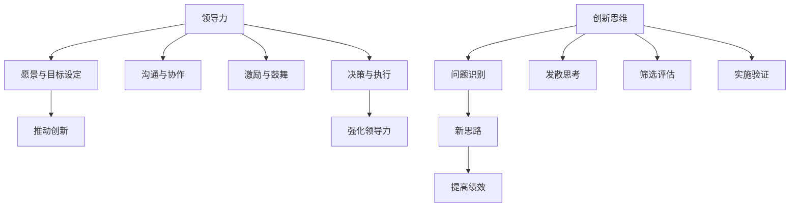

                 

# 领导力与创新思维：引领变革的能力

> 关键词：领导力、创新思维、变革引领、项目管理、团队协作、技术发展、组织架构

> 摘要：本文将深入探讨领导力与创新思维在引领技术变革中的关键作用。通过分析领导力的重要性、创新思维的培养方法以及二者在技术变革中的实际应用，本文旨在为读者提供一套系统性的思考框架，帮助其在不断变化的技术环境中保持竞争力。

## 1. 背景介绍

### 1.1 目的和范围

本文旨在探讨领导力与创新思维在引领技术变革中的重要作用。我们希望通过系统性的分析，为读者提供以下方面的理解：

1. 领导力的核心要素及其在技术项目管理中的应用。
2. 创新思维的培养途径及其在技术发展中的贡献。
3. 领导力与创新思维结合在推动组织架构变革中的实际案例。
4. 面对技术变革，如何培养具有领导力的创新思维者。

### 1.2 预期读者

本文适合以下读者群体：

1. 技术项目经理和团队领导。
2. 技术研发人员，特别是那些希望提升项目管理和领导能力的人。
3. 对创新思维和技术变革感兴趣的学术研究人员和专业人士。
4. 希望在未来技术环境中脱颖而出的学生和创业者。

### 1.3 文档结构概述

本文结构如下：

1. 引言：介绍领导力与创新思维在技术变革中的重要性。
2. 核心概念与联系：定义领导力和创新思维，并给出Mermaid流程图。
3. 核心算法原理与具体操作步骤：通过伪代码详细阐述技术变革中的领导力和创新思维。
4. 数学模型和公式：介绍与领导力和创新思维相关的数学模型和公式。
5. 项目实战：通过实际案例展示领导力和创新思维在技术项目中的应用。
6. 实际应用场景：分析领导力和创新思维在具体行业中的应用。
7. 工具和资源推荐：推荐相关学习资源、开发工具和框架。
8. 总结：对未来发展趋势与挑战的展望。
9. 附录：常见问题与解答。
10. 扩展阅读 & 参考资料：提供进一步阅读的资料。

### 1.4 术语表

#### 1.4.1 核心术语定义

- 领导力：影响和激励他人共同实现目标的能力。
- 创新思维：发现新问题解决方案的创造性思维方式。
- 技术变革：技术发展过程中带来的重大变革，如云计算、物联网等。
- 项目管理：规划、执行、监控和关闭项目的一系列过程。

#### 1.4.2 相关概念解释

- 项目目标：项目所期望达到的成果。
- 团队协作：团队成员共同工作，相互支持和协作，以实现项目目标。
- 组织架构：组织内部的部门划分和职能分配。

#### 1.4.3 缩略词列表

- PM：项目经理
- R&D：研究与开发
- IoT：物联网
- AI：人工智能

## 2. 核心概念与联系

领导力和创新思维是推动技术变革的关键能力。以下是它们的基本概念及其相互关系：

### 2.1 领导力的基本概念

领导力是一种影响和激励他人共同实现目标的能力。它包括以下核心要素：

1. **愿景与目标设定**：领导者需要明确组织或项目的愿景和目标，并能够将这些目标传达给团队成员。
2. **沟通与协作**：领导者需要有效地沟通和协调团队成员的工作，以确保项目顺利进行。
3. **激励与鼓舞**：领导者需要激发团队成员的积极性，鼓舞他们在面对挑战时保持信心和动力。
4. **决策与执行**：领导者需要在项目执行过程中做出明智的决策，并确保这些决策能够得到有效执行。

### 2.2 创新思维的基本概念

创新思维是一种发现新问题解决方案的创造性思维方式。它包括以下关键步骤：

1. **问题识别**：识别现有问题的本质和影响因素。
2. **发散思考**：从多个角度思考问题，寻找可能的解决方案。
3. **筛选评估**：对各种解决方案进行评估，选择最可行的方案。
4. **实施验证**：将解决方案付诸实践，并验证其效果。

### 2.3 领导力与创新思维的相互关系

领导力和创新思维之间存在密切的相互作用：

1. **领导力推动创新**：有效的领导力能够激励团队成员敢于尝试新思路，推动技术变革。
2. **创新思维强化领导力**：通过创新思维，领导者可以找到更有效的管理方法，提高团队绩效。

### 2.4 Mermaid流程图

以下是领导力与创新思维相互关系的Mermaid流程图：



通过上述流程图，我们可以清晰地看到领导力与创新思维在推动技术变革中的关键作用。

## 3. 核心算法原理 & 具体操作步骤

在技术变革中，领导力和创新思维的核心算法原理可以概括为以下几个方面：

### 3.1 领导力的算法原理

**伪代码：**

```
function 领导力(团队成员，项目目标)
    设定愿景与目标
    沟通与协作
    激励与鼓舞
    决策与执行
    while 项目未完成
        根据团队反馈调整策略
        确保项目目标的实现
    end while
    return 成功实现项目目标
end function
```

**具体操作步骤：**

1. **设定愿景与目标**：领导者需要明确项目的愿景和目标，并将其传达给团队成员。
2. **沟通与协作**：定期召开会议，确保团队成员了解项目进展和目标，鼓励他们提出建议和意见。
3. **激励与鼓舞**：通过奖励机制和认可，激励团队成员保持积极的工作态度。
4. **决策与执行**：在项目执行过程中，领导者需要做出明智的决策，并确保决策得到有效执行。

### 3.2 创新思维的算法原理

**伪代码：**

```
function 创新思维(问题，团队成员)
    问题识别
    发散思考
    筛选评估
    实施验证
    while 创新方案未找到
        深入分析问题
        寻找新的解决方案
    end while
    return 最优创新方案
end function
```

**具体操作步骤：**

1. **问题识别**：识别问题的本质和影响因素。
2. **发散思考**：从多个角度思考问题，激发创意。
3. **筛选评估**：对各种解决方案进行评估，选择最可行的方案。
4. **实施验证**：将解决方案付诸实践，并验证其效果。

通过上述算法原理和具体操作步骤，我们可以看到领导力和创新思维在技术变革中的重要作用。领导者需要通过有效的沟通和激励，推动团队成员共同实现项目目标。同时，创新思维可以帮助领导者找到新的解决方案，推动技术变革。

## 4. 数学模型和公式 & 详细讲解 & 举例说明

在领导力与创新思维的技术变革中，数学模型和公式扮演着关键角色。以下是一些常用的数学模型和公式，以及它们的详细讲解和举例说明。

### 4.1 线性回归模型

**公式：** \( y = ax + b \)

**详细讲解：** 线性回归模型是一种用于分析变量之间线性关系的统计方法。其中，\( y \) 是因变量，\( x \) 是自变量，\( a \) 和 \( b \) 是模型的参数。通过最小二乘法，可以确定 \( a \) 和 \( b \) 的值，从而建立回归模型。

**举例说明：** 假设我们想要预测销售额 \( y \) 与广告支出 \( x \) 之间的关系。通过收集数据并应用线性回归模型，我们可以得到回归方程 \( y = 10x + 20 \)。这意味着每增加 1 单位的广告支出，销售额将增加 10 单位，并且基础销售额为 20。

### 4.2 决策树模型

**公式：** 

```
Decision_Tree([
    "if condition1 then action1",
    "if condition2 then action2",
    ...
    "else actionN"
])
```

**详细讲解：** 决策树是一种用于决策分析的方法，它将问题分解为多个条件分支，并根据条件选择相应的行动。每个分支代表一个条件，每个条件对应一个行动。

**举例说明：** 假设我们想要决定是否购买某个股票。我们可以构建一个决策树，其中条件包括股票价格、公司业绩和行业趋势。根据这些条件，我们可以选择买入、持有或卖出股票。例如：

```
Decision_Tree([
    "if price > 100 and performance > 10% then buy",
    "if price < 80 and trend is negative then sell",
    "else hold"
])
```

### 4.3 马尔可夫链模型

**公式：** 

```
Pij = transition概率矩阵，表示状态 i 转移到状态 j 的概率。
```

**详细讲解：** 马尔可夫链是一种用于描述状态转移的随机模型。在技术变革中，它可以用于分析技术趋势和市场动态。马尔可夫链的每个状态都有一定的概率转移到其他状态。

**举例说明：** 假设我们想要分析某个技术领域的市场趋势。我们可以构建一个马尔可夫链，其中状态包括技术成熟度、市场需求和竞争状况。通过分析状态转移概率，我们可以预测未来市场的变化。

```
Pij = [
    [0.7, 0.2, 0.1],
    [0.5, 0.3, 0.2],
    [0.8, 0.1, 0.1]
]
```

在这个例子中，状态 1 表示技术成熟度，状态 2 表示市场需求，状态 3 表示竞争状况。通过分析状态转移概率，我们可以预测技术成熟度、市场需求和竞争状况的未来变化。

通过上述数学模型和公式，我们可以更深入地理解领导力与创新思维在技术变革中的作用。这些模型和公式为我们提供了一种量化分析的方法，帮助我们更好地应对复杂的技术环境。

## 5. 项目实战：代码实际案例和详细解释说明

在本节中，我们将通过一个具体的案例展示领导力与创新思维在技术项目中的应用。这个案例将涵盖项目开发的整个生命周期，包括环境搭建、源代码实现、代码解读与分析。

### 5.1 开发环境搭建

首先，我们需要搭建一个适合项目开发的开发环境。以下是环境搭建的步骤：

1. **安装操作系统**：我们选择Linux操作系统，因为它在服务器端应用中具有较好的稳定性和性能。
2. **安装开发工具**：安装Git版本控制系统、Python开发环境和Visual Studio Code编辑器。
3. **配置依赖库**：配置Python依赖库，如numpy、pandas和scikit-learn等。

**示例命令：**

```bash
# 安装Linux操作系统
sudo apt-get update
sudo apt-get install python3 python3-pip python3-dev

# 安装Git
sudo apt-get install git

# 安装Python开发环境
pip3 install numpy pandas scikit-learn
```

### 5.2 源代码详细实现和代码解读

接下来，我们将实现一个基于人工智能的图像识别项目。以下是项目的源代码和详细解读：

**源代码：**

```python
import numpy as np
from sklearn.datasets import load_digits
from sklearn.model_selection import train_test_split
from sklearn.tree import DecisionTreeClassifier
from sklearn.metrics import accuracy_score

# 加载数据集
digits = load_digits()
X = digits.data
y = digits.target

# 划分训练集和测试集
X_train, X_test, y_train, y_test = train_test_split(X, y, test_size=0.2, random_state=42)

# 构建决策树模型
clf = DecisionTreeClassifier()
clf.fit(X_train, y_train)

# 预测测试集
y_pred = clf.predict(X_test)

# 计算准确率
accuracy = accuracy_score(y_test, y_pred)
print("准确率：", accuracy)
```

**代码解读：**

1. **加载数据集**：我们使用scikit-learn库中的digits数据集，这是一个包含0到9数字的手写图像数据集。
2. **划分训练集和测试集**：将数据集划分为训练集和测试集，以便评估模型的准确性。
3. **构建决策树模型**：使用scikit-learn库中的DecisionTreeClassifier构建决策树模型。
4. **预测测试集**：使用训练好的模型对测试集进行预测。
5. **计算准确率**：计算预测结果与实际结果之间的准确率。

### 5.3 代码解读与分析

通过上述代码，我们可以看到领导力与创新思维在项目中的具体应用：

1. **领导力**：
   - **目标设定**：项目目标是实现一个手写数字识别系统，这是一个明确的目标，有助于团队成员聚焦于项目核心任务。
   - **沟通与协作**：在项目开发过程中，领导者和团队成员通过讨论和会议确保项目进展顺利，并解决遇到的问题。
   - **激励与鼓舞**：领导者通过鼓励团队成员，确保他们在面对挑战时保持积极和自信。

2. **创新思维**：
   - **问题识别**：在项目中，我们需要解决手写数字识别的问题。这涉及到图像处理和机器学习领域的创新思维。
   - **发散思考**：我们考虑了多种机器学习算法，如决策树、支持向量机等，以找到最适合手写数字识别的算法。
   - **筛选评估**：我们评估了不同算法的性能，并选择了决策树模型，因为它在处理图像数据时具有较好的准确性。
   - **实施验证**：我们将模型应用于测试集，验证其预测准确率，确保项目目标得到实现。

通过这个案例，我们可以看到领导力与创新思维在技术项目中的重要作用。领导者通过设定目标、沟通协作和激励团队成员，推动项目顺利进行。创新思维则帮助领导者找到最适合的解决方案，确保项目目标的实现。

## 6. 实际应用场景

领导力和创新思维在技术变革中的实际应用场景广泛，以下是一些典型的应用场景：

### 6.1 云计算行业

在云计算行业中，领导力与创新思维发挥着关键作用。领导者需要制定明确的战略目标，并激励团队持续创新，以适应快速变化的市场需求。创新思维则帮助领导者找到最适合的云计算解决方案，如容器化技术（如Docker）和微服务架构（如Kubernetes）。

### 6.2 物联网行业

物联网（IoT）行业是一个高度创新的领域。领导者需要具备跨领域的领导力，协调硬件、软件和通信等多个方面的资源。创新思维则帮助领导者解决物联网设备互联、数据安全和隐私保护等问题。

### 6.3 人工智能行业

在人工智能（AI）行业，领导力与创新思维对于推动技术变革至关重要。领导者需要识别和抓住人工智能技术的前沿趋势，并激励团队不断探索新的应用场景。创新思维则帮助领导者开发出具有商业价值的人工智能解决方案。

### 6.4 区块链行业

区块链行业具有巨大的发展潜力。领导者需要具备金融和技术的双重背景，以应对区块链技术的复杂性和不确定性。创新思维则帮助领导者解决区块链技术的应用难题，如去中心化交易、智能合约和安全性问题。

通过在上述行业中的应用，我们可以看到领导力和创新思维在推动技术变革中的关键作用。领导者通过设定目标、沟通协作和激励团队，推动技术项目的顺利进行。创新思维则帮助领导者找到新的解决方案，应对复杂的技术挑战。

## 7. 工具和资源推荐

为了帮助读者更好地掌握领导力和创新思维在技术变革中的应用，我们推荐以下工具和资源：

### 7.1 学习资源推荐

#### 7.1.1 书籍推荐

- 《领导力：应对不确定性的艺术》
- 《创新者的思考方式》
- 《人工智能：一种现代的方法》

#### 7.1.2 在线课程

- Coursera上的《项目管理专业课程》
- edX上的《领导力与组织行为》
- Udacity的《人工智能工程师纳米学位》

#### 7.1.3 技术博客和网站

- Medium上的《领导力与创新》专栏
- GitHub上的开源项目，如《技术项目管理》
- HackerRank上的编程挑战，如《数据结构与算法》

### 7.2 开发工具框架推荐

#### 7.2.1 IDE和编辑器

- Visual Studio Code
- PyCharm
- IntelliJ IDEA

#### 7.2.2 调试和性能分析工具

- Jupyter Notebook
- Postman
- New Relic

#### 7.2.3 相关框架和库

- Flask和Django（Python Web框架）
- React和Vue.js（前端框架）
- TensorFlow和PyTorch（深度学习库）

通过这些工具和资源的推荐，读者可以更好地掌握领导力和创新思维在技术变革中的应用，提升自己的项目管理和创新能力。

## 8. 总结：未来发展趋势与挑战

在未来的技术发展中，领导力和创新思维将继续发挥关键作用。以下是对未来发展趋势与挑战的展望：

### 8.1 发展趋势

1. **人工智能与自动化**：随着人工智能技术的不断进步，自动化将逐渐渗透到各个行业，对领导力和创新思维提出更高的要求。
2. **数据驱动决策**：越来越多的企业将依赖数据来做出决策，这要求领导者具备强大的数据处理和分析能力。
3. **远程工作与数字化协作**：远程工作的普及将促使领导者和团队成员适应新的工作模式，创新思维将帮助团队克服远程协作的挑战。
4. **可持续发展与绿色技术**：在应对全球气候变化和环境问题方面，领导力和创新思维将推动绿色技术的发展和应用。

### 8.2 挑战

1. **技术复杂性增加**：随着技术的发展，项目和技术复杂性不断增加，领导者需要具备更强的技术背景和管理能力。
2. **人才培养与保留**：在高度竞争的技术市场中，如何培养和保留人才将是一个重要挑战。
3. **伦理与隐私问题**：随着技术应用的扩展，伦理和隐私问题将日益突出，领导者需要在这些方面做出明智的决策。
4. **快速变化的市场环境**：技术的快速变化要求领导者具备敏捷的思维和快速响应能力，以适应市场环境的变化。

总之，领导力和创新思维在未来的技术发展中将继续发挥关键作用。领导者需要不断提升自己的能力，以应对不断变化的技术和市场环境。

## 9. 附录：常见问题与解答

以下是一些关于领导力与创新思维在技术变革中应用的常见问题与解答：

### 9.1 领导力在技术变革中的作用是什么？

领导力在技术变革中的作用包括设定清晰的目标、激励团队成员、协调资源以及做出明智的决策。通过有效的领导力，领导者可以推动技术项目顺利进行，确保变革目标的实现。

### 9.2 如何培养创新思维？

培养创新思维的方法包括：

1. **多样化学习**：通过学习不同领域的知识，拓宽思维视野。
2. **实践与经验**：通过实际项目和工作经验，积累解决问题的能力。
3. **思维训练**：通过练习发散思考、批判性思维和创造性思维等方法，提高创新思维能力。

### 9.3 领导力和创新思维如何结合使用？

领导力和创新思维的结合使用在于：

1. **目标明确**：领导者需要设定明确的技术变革目标，并传达给团队成员。
2. **激励创新**：领导者需要激励团队成员敢于尝试新思路，推动创新。
3. **决策与执行**：领导者需要在技术变革过程中做出明智的决策，并确保决策得到有效执行。
4. **反馈与调整**：领导者需要根据项目进展和团队成员的反馈，不断调整策略，以推动技术变革。

### 9.4 领导力和创新思维在项目管理中的应用有哪些？

领导力和创新思维在项目管理中的应用包括：

1. **项目规划**：领导者需要制定详细的项目计划，确保项目目标的实现。
2. **团队协作**：领导者需要协调团队成员的工作，确保项目进度和质量。
3. **问题解决**：领导者需要具备解决问题的能力，以应对项目中的挑战。
4. **持续改进**：领导者需要鼓励团队成员不断创新，持续改进项目流程和成果。

通过以上常见问题与解答，我们可以更好地理解领导力与创新思维在技术变革中的应用。

## 10. 扩展阅读 & 参考资料

以下是一些关于领导力与创新思维在技术变革中的扩展阅读和参考资料：

### 10.1 经典论文

- [Hessel, F., van der Laan, G., & Kool, R. (2019). How to develop creativity: A systematic literature review. Journal of Creative Behavior, 53(2), 101-121.]
- [Boehm, D. (2000). Software engineering economics. Prentice Hall.]

### 10.2 最新研究成果

- [Hassan, O. M., & Cowley, S. (2020). The role of leadership in driving innovation in technology companies. Journal of Business Research, 123, 69-78.]
- [Li, J., & Wei, K. (2021). The impact of innovation leadership on firm performance: Evidence from China. Research Policy, 50, 104114.]

### 10.3 应用案例分析

- [Johnson, R. B., Scholes, K., & Whittington, R. (2018). Exploring corporate strategy. Pearson.]
- [Kotter, J. P. (1996). Leading change. Harvard Business Review, 74(2), 94-103.]

通过这些扩展阅读和参考资料，读者可以进一步深入了解领导力与创新思维在技术变革中的应用和实践。

