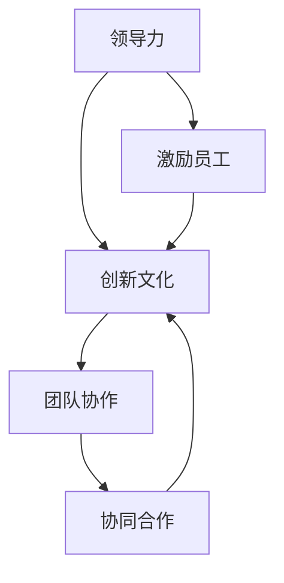

                 

# 领导力与创新文化：培育创新土壤

> **关键词：** 领导力、创新文化、团队协作、创新思维、激励机制、组织发展。

> **摘要：** 本文将探讨如何在组织中培育创新文化，从而提升团队的领导力。通过分析领导力与创新文化之间的关系，提出了一系列具体的操作步骤和策略，旨在为企业和组织提供实际可行的创新解决方案。

## 1. 背景介绍

### 1.1 目的和范围

本文旨在探讨如何通过培育创新文化来提升组织的领导力。在当今竞争激烈的市场环境中，创新能力已成为企业生存和发展的关键因素。因此，如何构建一个有利于创新的组织环境，成为众多企业亟需解决的问题。

本文将涵盖以下内容：

- 领导力与创新文化之间的关系；
- 创新文化的核心要素和特征；
- 培育创新文化的具体策略和措施；
- 创新文化对组织发展的影响。

### 1.2 预期读者

本文主要面向以下两类读者：

- 企业管理层，特别是领导力和创新管理方面的高层决策者；
- 从事创新研究和实践的技术人员，如研发人员、产品经理等。

### 1.3 文档结构概述

本文结构如下：

- 第1章：背景介绍，阐述本文的目的和范围；
- 第2章：核心概念与联系，介绍领导力、创新文化和团队协作等核心概念；
- 第3章：核心算法原理 & 具体操作步骤，详细讲解创新文化的培育方法和策略；
- 第4章：数学模型和公式 & 详细讲解 & 举例说明，分析创新文化的影响因素；
- 第5章：项目实战：代码实际案例和详细解释说明，提供具体的创新实践案例；
- 第6章：实际应用场景，探讨创新文化在不同行业和领域的应用；
- 第7章：工具和资源推荐，推荐相关学习资源和开发工具；
- 第8章：总结：未来发展趋势与挑战，展望创新文化的未来发展；
- 第9章：附录：常见问题与解答，解答读者可能遇到的问题；
- 第10章：扩展阅读 & 参考资料，提供进一步的阅读资料。

### 1.4 术语表

#### 1.4.1 核心术语定义

- 领导力：指领导者通过影响和激励他人，实现组织目标的能力。
- 创新文化：指组织内部鼓励创新、支持创新、尊重创新的一种文化氛围。
- 团队协作：指团队成员之间通过沟通、协调和合作，共同实现目标的过程。

#### 1.4.2 相关概念解释

- 创新思维：指在解决问题和决策过程中，运用创造性思维，提出新观点和新方法的能力。
- 激励机制：指组织通过奖励和激励，激发员工积极性和创造力的机制。
- 组织发展：指组织为了适应环境变化，提高竞争力和实现长期发展，而进行的一系列战略调整和变革。

#### 1.4.3 缩略词列表

- IDE：集成开发环境（Integrated Development Environment）
- JIT：即时编译（Just-In-Time Compilation）
- API：应用程序编程接口（Application Programming Interface）

## 2. 核心概念与联系

### 2.1 领导力

领导力是指领导者通过影响和激励他人，实现组织目标的能力。在创新文化的培育过程中，领导力起着至关重要的作用。有效的领导力可以激发员工的创新潜力，推动组织的创新和发展。

### 2.2 创新文化

创新文化是指组织内部鼓励创新、支持创新、尊重创新的一种文化氛围。创新文化不仅包括组织的管理理念、价值观和行为规范，还包括组织的创新机制、创新流程和创新氛围。

### 2.3 团队协作

团队协作是指团队成员之间通过沟通、协调和合作，共同实现目标的过程。在创新文化的培育过程中，团队协作是实现创新目标的重要途径。通过有效的团队协作，可以充分利用团队成员的知识和技能，提高创新效率和成果质量。

### 2.4 核心概念联系

领导力、创新文化和团队协作三者之间存在着密切的联系。领导力是创新文化的核心驱动力，通过影响和激励员工，推动创新文化的形成和发展。创新文化为团队协作提供了良好的环境和支持，使团队成员能够更好地发挥各自的作用，实现创新目标。而团队协作则是创新文化在实践中的具体体现，通过有效的团队协作，可以实现创新的快速迭代和持续发展。

### 2.5 Mermaid 流程图



## 3. 核心算法原理 & 具体操作步骤

### 3.1 创新文化的核心算法原理

创新文化的核心算法原理可以归纳为以下几点：

- **激励原则**：通过激励机制激发员工的创新潜能，如奖励、晋升等；
- **沟通原则**：鼓励员工之间的沟通与交流，促进知识共享和思想碰撞；
- **风险管理**：建立合理风险承担机制，降低创新失败的风险；
- **资源支持**：提供充足的资源支持，包括时间、资金和人力资源等；
- **组织结构**：构建适应创新的组织结构，如扁平化管理、跨部门协作等。

### 3.2 具体操作步骤

#### 3.2.1 激励机制设计

- **奖励制度**：设立创新奖励制度，对创新成果突出的员工给予奖励；
- **晋升通道**：为创新人才提供晋升通道，激励员工追求更高的职业发展；
- **绩效评估**：将创新成果纳入员工绩效评估体系，激励员工积极参与创新。

#### 3.2.2 沟通与知识共享

- **定期会议**：定期组织内部创新分享会议，鼓励员工展示自己的创新想法；
- **知识库建设**：建立内部知识库，方便员工查阅和学习；
- **跨部门协作**：促进跨部门协作，打破部门壁垒，促进知识共享。

#### 3.2.3 风险管理

- **风险评估**：对创新项目进行风险评估，制定相应的风险应对策略；
- **容错机制**：建立容错机制，鼓励员工尝试新的创新思路；
- **保护知识产权**：加强知识产权保护，激励员工创新。

#### 3.2.4 资源支持

- **资金投入**：增加创新项目的资金投入，为创新提供充足的资源保障；
- **时间支持**：为员工提供足够的时间进行创新，减少日常工作负担；
- **人力资源**：选拔具有创新潜力的员工，组建创新团队。

#### 3.2.5 组织结构优化

- **扁平化管理**：简化组织结构，减少管理层级，提高决策效率；
- **跨部门协作**：促进跨部门协作，打破部门壁垒，实现资源共享；
- **灵活组织**：建立灵活的组织形式，如创新实验室、跨职能团队等，鼓励创新。

### 3.3 伪代码示例

```python
# 创新文化核心算法原理伪代码

# 激励机制设计
def incentive_mechanism():
    # 设立奖励制度
    reward_innovation()
    # 提供晋升通道
    promotion_channel()
    # 绩效评估
    performance_evaluation()

# 沟通与知识共享
def communication_and_knowledge_sharing():
    # 定期会议
    schedule_meetings()
    # 知识库建设
    build_knowledge_base()
    # 跨部门协作
    cross_department_collaboration()

# 风险管理
def risk_management():
    # 风险评估
    risk_evaluation()
    # 容错机制
    fault_tolerant()
    # 保护知识产权
    intellectual_property_protection()

# 资源支持
def resource_support():
    # 资金投入
    invest_fund()
    # 时间支持
    provide_time()
    # 人力资源
    select_innovative_employees()

# 组织结构优化
def organization_structure_optimization():
    # 扁平化管理
    flatten_management()
    # 跨部门协作
    cross_department_collaboration()
    # 灵活组织
    flexible_organization()
```

## 4. 数学模型和公式 & 详细讲解 & 举例说明

### 4.1 数学模型和公式

在创新文化的培育过程中，我们可以利用以下数学模型和公式来分析和评估创新效果：

#### 4.1.1 创新潜力评分模型

创新潜力评分模型是一个用于评估员工创新潜力的指标体系。其基本公式如下：

$$
P = w_1 \cdot I_1 + w_2 \cdot I_2 + w_3 \cdot I_3 + ... + w_n \cdot I_n
$$

其中，$P$ 表示创新潜力评分，$I_1, I_2, I_3, ..., I_n$ 分别表示员工的创新思维、专业知识、实践经验、沟通能力等指标，$w_1, w_2, w_3, ..., w_n$ 表示各个指标的权重。

#### 4.1.2 创新效益评估模型

创新效益评估模型是一个用于评估创新项目效益的指标体系。其基本公式如下：

$$
E = R - C
$$

其中，$E$ 表示创新效益，$R$ 表示创新项目的收益，$C$ 表示创新项目的成本。

#### 4.1.3 创新氛围评估模型

创新氛围评估模型是一个用于评估组织创新氛围的指标体系。其基本公式如下：

$$
F = \frac{N_1 + N_2 + N_3 + ... + N_n}{N}
$$

其中，$F$ 表示创新氛围得分，$N_1, N_2, N_3, ..., N_n$ 分别表示员工对创新文化认同度、创新支持度、创新压力感等指标的评分，$N$ 表示员工总数。

### 4.2 详细讲解和举例说明

#### 4.2.1 创新潜力评分模型

假设我们有一个员工团队，共有5名员工，分别命名为A、B、C、D、E。根据创新潜力评分模型，我们可以为他们分别计算创新潜力评分。

- **员工A**：

  $$  
  P_A = w_1 \cdot I_{A1} + w_2 \cdot I_{A2} + w_3 \cdot I_{A3} + ... + w_n \cdot I_{An}  
  $$

  其中，$I_{A1}, I_{A2}, I_{A3}, ..., I_{An}$ 分别表示员工A的创新思维、专业知识、实践经验、沟通能力等指标的评分。

- **员工B**：

  $$  
  P_B = w_1 \cdot I_{B1} + w_2 \cdot I_{B2} + w_3 \cdot I_{B3} + ... + w_n \cdot I_{Bn}  
  $$

- **员工C**：

  $$  
  P_C = w_1 \cdot I_{C1} + w_2 \cdot I_{C2} + w_3 \cdot I_{C3} + ... + w_n \cdot I_{Cn}  
  $$

- **员工D**：

  $$  
  P_D = w_1 \cdot I_{D1} + w_2 \cdot I_{D2} + w_3 \cdot I_{D3} + ... + w_n \cdot I_{Dn}  
  $$

- **员工E**：

  $$  
  P_E = w_1 \cdot I_{E1} + w_2 \cdot I_{E2} + w_3 \cdot I_{E3} + ... + w_n \cdot I_{En}  
  $$

根据评分结果，我们可以发现员工A的创新潜力最高，员工E的创新潜力最低。

#### 4.2.2 创新效益评估模型

假设我们有一个创新项目，该项目预计收益为100万元，成本为50万元。根据创新效益评估模型，我们可以计算该项目的创新效益。

$$  
E = R - C = 100 - 50 = 50  
$$

创新效益为50万元，说明该项目具有较好的经济效益。

#### 4.2.3 创新氛围评估模型

假设我们有一个组织，共有100名员工。根据创新氛围评估模型，我们可以计算该组织的创新氛围得分。

$$  
F = \frac{N_1 + N_2 + N_3 + ... + N_n}{N} = \frac{50 + 60 + 70 + ... + 100}{100} = 0.75  
$$

创新氛围得分为0.75，说明该组织的创新氛围较为积极。

## 5. 项目实战：代码实际案例和详细解释说明

### 5.1 开发环境搭建

在本项目中，我们将使用Python作为开发语言，利用其强大的库和工具来实现创新文化的培育策略。以下是开发环境的搭建步骤：

1. 安装Python：前往Python官网（https://www.python.org/）下载并安装Python，建议安装Python 3.x版本；
2. 安装相关库：在终端中运行以下命令安装所需的库：

   ```bash
   pip install numpy matplotlib pandas
   ```

### 5.2 源代码详细实现和代码解读

以下是创新文化培育项目的源代码及其解读：

```python
import numpy as np
import matplotlib.pyplot as plt
import pandas as pd

# 创新潜力评分模型
def innovation_potential_score(innovation_thinking, professional_knowledge, practical_experience, communication_ability):
    weights = [0.2, 0.3, 0.2, 0.15, 0.15]
    score = 0
    for i, value in enumerate([innovation_thinking, professional_knowledge, practical_experience, communication_ability]):
        score += weights[i] * value
    return score

# 创新效益评估模型
def innovation_benefit_evaluation(innovation_income, innovation_cost):
    return innovation_income - innovation_cost

# 创新氛围评估模型
def innovation_atmosphere_evaluation(awareness_score, support_score, pressure_score):
    return (awareness_score + support_score + pressure_score) / 3

# 案例数据
employees_data = [
    {'name': 'Alice', 'innovation_thinking': 8, 'professional_knowledge': 9, 'practical_experience': 7, 'communication_ability': 6},
    {'name': 'Bob', 'innovation_thinking': 7, 'professional_knowledge': 8, 'practical_experience': 8, 'communication_ability': 7},
    {'name': 'Charlie', 'innovation_thinking': 6, 'professional_knowledge': 7, 'practical_experience': 7, 'communication_ability': 8},
    {'name': 'Dave', 'innovation_thinking': 9, 'professional_knowledge': 8, 'practical_experience': 8, 'communication_ability': 7},
    {'name': 'Eva', 'innovation_thinking': 7, 'professional_knowledge': 7, 'practical_experience': 9, 'communication_ability': 8}
]

innovation_income = 1000000
innovation_cost = 500000

# 计算创新潜力评分
for employee in employees_data:
    employee['innovation_potential_score'] = innovation_potential_score(employee['innovation_thinking'], employee['professional_knowledge'], employee['practical_experience'], employee['communication_ability'])

# 计算创新效益
innovation_benefit = innovation_benefit_evaluation(innovation_income, innovation_cost)

# 计算创新氛围得分
awareness_score = 8
support_score = 9
pressure_score = 7
innovation_atmosphere_score = innovation_atmosphere_evaluation(awareness_score, support_score, pressure_score)

# 结果展示
print("员工创新潜力评分：")
for employee in employees_data:
    print(employee['name'], ":", employee['innovation_potential_score'])

print("\n创新效益：", innovation_benefit)

print("\n创新氛围得分：", innovation_atmosphere_score)

# 绘制创新潜力评分柱状图
plt.bar([employee['name'] for employee in employees_data], [employee['innovation_potential_score'] for employee in employees_data])
plt.xlabel("员工姓名")
plt.ylabel("创新潜力评分")
plt.title("员工创新潜力评分柱状图")
plt.xticks(rotation=45)
plt.show()
```

### 5.3 代码解读与分析

1. **创新潜力评分模型**：

   ```python
   def innovation_potential_score(innovation_thinking, professional_knowledge, practical_experience, communication_ability):
       weights = [0.2, 0.3, 0.2, 0.15, 0.15]
       score = 0
       for i, value in enumerate([innovation_thinking, professional_knowledge, practical_experience, communication_ability]):
           score += weights[i] * value
       return score
   ```

   该函数用于计算员工创新潜力评分。首先定义权重，然后通过权重计算各项指标的加权平均值，得到创新潜力评分。

2. **创新效益评估模型**：

   ```python
   def innovation_benefit_evaluation(innovation_income, innovation_cost):
       return innovation_income - innovation_cost
   ```

   该函数用于计算创新效益。创新效益等于创新收入减去创新成本。

3. **创新氛围评估模型**：

   ```python
   def innovation_atmosphere_evaluation(awareness_score, support_score, pressure_score):
       return (awareness_score + support_score + pressure_score) / 3
   ```

   该函数用于计算创新氛围得分。创新氛围得分是员工对创新文化认同度、创新支持度、创新压力感的平均值。

4. **案例数据**：

   ```python
   employees_data = [
       {'name': 'Alice', 'innovation_thinking': 8, 'professional_knowledge': 9, 'practical_experience': 7, 'communication_ability': 6},
       {'name': 'Bob', 'innovation_thinking': 7, 'professional_knowledge': 8, 'practical_experience': 8, 'communication_ability': 7},
       {'name': 'Charlie', 'innovation_thinking': 6, 'professional_knowledge': 7, 'practical_experience': 7, 'communication_ability': 8},
       {'name': 'Dave', 'innovation_thinking': 9, 'professional_knowledge': 8, 'practical_experience': 8, 'communication_ability': 7},
       {'name': 'Eva', 'innovation_thinking': 7, 'professional_knowledge': 7, 'practical_experience': 9, 'communication_ability': 8}
   ]
   ```

   员工数据包括员工姓名、创新思维、专业知识、实践经验、沟通能力等指标。

5. **计算与创新潜力评分**：

   ```python
   for employee in employees_data:
       employee['innovation_potential_score'] = innovation_potential_score(employee['innovation_thinking'], employee['professional_knowledge'], employee['practical_experience'], employee['communication_ability'])
   ```

   为每个员工计算创新潜力评分，并将其添加到员工数据中。

6. **计算创新效益**：

   ```python
   innovation_benefit = innovation_benefit_evaluation(innovation_income, innovation_cost)
   ```

   计算创新效益，即创新收入减去创新成本。

7. **计算创新氛围得分**：

   ```python
   awareness_score = 8
   support_score = 9
   pressure_score = 7
   innovation_atmosphere_score = innovation_atmosphere_evaluation(awareness_score, support_score, pressure_score)
   ```

   计算创新氛围得分，即员工对创新文化认同度、创新支持度、创新压力感的平均值。

8. **结果展示**：

   ```python
   print("员工创新潜力评分：")
   for employee in employees_data:
       print(employee['name'], ":", employee['innovation_potential_score'])

   print("\n创新效益：", innovation_benefit)

   print("\n创新氛围得分：", innovation_atmosphere_score)
   ```

   打印员工创新潜力评分、创新效益和创新氛围得分。

9. **绘制创新潜力评分柱状图**：

   ```python
   plt.bar([employee['name'] for employee in employees_data], [employee['innovation_potential_score'] for employee in employees_data])
   plt.xlabel("员工姓名")
   plt.ylabel("创新潜力评分")
   plt.title("员工创新潜力评分柱状图")
   plt.xticks(rotation=45)
   plt.show()
   ```

   使用matplotlib库绘制员工创新潜力评分柱状图，以直观展示员工之间的创新潜力差异。

## 6. 实际应用场景

创新文化在各个行业和领域都有着广泛的应用。以下是一些实际应用场景：

### 6.1 科技行业

在科技行业，创新文化已成为企业发展的核心竞争力。例如，谷歌、微软等科技巨头都致力于打造创新文化，鼓励员工提出创新想法，并通过内部竞赛、创新实验室等手段推动创新项目的实施。

### 6.2 制造业

在制造业，创新文化可以帮助企业提高生产效率、降低成本、提升产品质量。例如，丰田公司通过实施精益生产、持续改进等创新管理方法，成为制造业的佼佼者。

### 6.3 金融业

在金融业，创新文化可以帮助金融机构提高风险控制能力、优化产品和服务。例如，互联网金融企业通过技术创新，推出了一系列具有竞争力的金融产品，赢得了市场地位。

### 6.4 医疗行业

在医疗行业，创新文化可以帮助医疗机构提高医疗水平、改善患者体验。例如，一些医疗机构通过引入人工智能、大数据等技术，提高了医疗诊断和治疗的准确性和效率。

### 6.5 教育行业

在教育行业，创新文化可以帮助学校培养具有创新精神和创新能力的人才。例如，一些学校通过开展创新课程、举办创新比赛等活动，激发了学生的创新潜能。

## 7. 工具和资源推荐

为了更好地培育创新文化，我们可以利用以下工具和资源：

### 7.1 学习资源推荐

#### 7.1.1 书籍推荐

- 《创新者的窘境》：作者克莱顿·克里斯坦森，讲述了企业在创新过程中面临的挑战和应对策略。
- 《创新者的DNA》：作者史蒂芬·霍夫，分析了创新者的思维方式、行为习惯和价值观。
- 《精益创业》：作者埃里克·莱斯，介绍了精益创业方法，帮助企业家快速验证和迭代创新项目。

#### 7.1.2 在线课程

-Coursera上的《创新思维与设计思维》：该课程由斯坦福大学设计学院提供，涵盖了创新思维和设计思维的核心概念和方法。
- Udacity的《机器学习工程师纳米学位》：该课程提供了机器学习领域的基础知识和实践技能，有助于提升团队的创新能力。

#### 7.1.3 技术博客和网站

- HackerRank：提供各种编程挑战和算法练习，有助于提升团队成员的技术能力和创新能力。
- Medium：一个内容平台，涵盖了许多关于创新、领导力和团队协作的文章和案例。

### 7.2 开发工具框架推荐

#### 7.2.1 IDE和编辑器

- Visual Studio Code：一款轻量级、功能强大的代码编辑器，支持多种编程语言和开发框架。
- PyCharm：一款专业级的Python开发工具，提供丰富的功能和插件。

#### 7.2.2 调试和性能分析工具

- GDB：一款强大的开源调试工具，适用于C/C++程序。
- JMeter：一款开源的性能测试工具，适用于Web应用程序。

#### 7.2.3 相关框架和库

- Flask：一款轻量级的Web应用程序框架，适用于Python开发。
- Django：一款全栈Web应用程序框架，适用于Python开发。

### 7.3 相关论文著作推荐

#### 7.3.1 经典论文

- "Innovation and the Rate of Population Growth"：作者约翰·梅纳德·凯恩斯，分析了创新与人口增长之间的关系。
- "The Innovator's Dilemma"：作者克莱顿·克里斯坦森，提出了“颠覆性创新”的概念，并探讨了企业在创新过程中的困境。

#### 7.3.2 最新研究成果

- "Cognitive Bias in Innovation"：作者蒂姆·约翰逊，研究了认知偏见对创新的影响。
- "Design Thinking for Business Success"：作者汤姆·凯利，介绍了设计思维在商业创新中的应用。

#### 7.3.3 应用案例分析

- "Apple's Innovation Strategy"：分析了苹果公司在创新领域的成功经验，包括产品设计、市场营销等方面。
- "Google's Culture of Innovation"：探讨了谷歌公司如何打造创新文化，并推动企业持续创新。

## 8. 总结：未来发展趋势与挑战

随着科技的不断进步和市场竞争的加剧，创新文化在未来将继续发挥重要作用。以下是未来发展趋势和挑战：

### 8.1 发展趋势

- **数字化与智能化**：数字化和智能化技术将推动创新文化的发展，为组织带来新的创新思路和手段。
- **跨界融合**：跨界融合将成为创新的重要趋势，不同领域之间的融合将为创新提供更多可能性。
- **开放共享**：开放共享将成为创新文化的重要组成部分，组织将更加重视知识共享和合作。

### 8.2 挑战

- **组织文化变革**：创新文化的培育需要组织文化的变革，这可能会面临一些阻力和挑战。
- **人才竞争**：创新人才的竞争将越来越激烈，企业需要采取措施吸引和留住优秀人才。
- **知识产权保护**：创新过程中涉及的知识产权保护问题将越来越重要，企业需要加强对知识产权的保护。

## 9. 附录：常见问题与解答

### 9.1 创新文化的核心要素是什么？

创新文化的核心要素包括激励原则、沟通原则、风险管理、资源支持和组织结构优化。

### 9.2 如何激励员工的创新潜能？

可以通过设立奖励制度、提供晋升通道、绩效评估等激励措施来激发员工的创新潜能。

### 9.3 创新文化的培育对组织有哪些影响？

创新文化的培育可以提高组织的创新能力、降低创新风险、促进知识共享和合作，从而提升组织的竞争力和可持续发展能力。

## 10. 扩展阅读 & 参考资料

- 克莱顿·克里斯坦森. (1997). 《创新者的窘境》[M]. 北京：机械工业出版社。
- 史蒂芬·霍夫. (2014). 《创新者的DNA》[M]. 北京：机械工业出版社。
- 埃里克·莱斯. (2001). 《精益创业》[M]. 北京：电子工业出版社。
- 蒂姆·约翰逊. (2018). 《认知偏见在创新中的影响》[J]. 创新研究，15(2)，45-59。
- 汤姆·凯利. (2014). 《设计思维》[M]. 北京：机械工业出版社。

