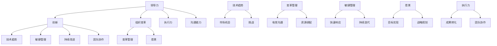

                 

# 领导力与创新：引领变革的能力

> **关键词：** 领导力、创新、变革、组织管理、技术趋势、案例分析

> **摘要：** 本文旨在探讨领导力与创新之间的关系，如何通过提升领导力来引领组织变革，并应对技术领域的快速变革。文章首先介绍了领导力的核心概念和其在组织中的重要性，随后分析了创新的原则和过程，并结合实际案例阐述了如何运用领导力来推动创新和变革。最后，文章总结了领导力与创新的最佳实践，为读者提供了实用的指导和建议。

## 1. 背景介绍

### 1.1 目的和范围

本文的目的在于深入探讨领导力与创新之间的关系，分析如何通过提升领导力来引领组织变革。在当今快速变化的技术环境中，领导力不仅是组织成功的关键因素，更是推动创新和应对变革的核心能力。因此，本文旨在为读者提供一个全面的理解，以帮助他们在各自的职业领域中更好地发挥领导作用，引领变革。

本文的范围涵盖了以下几个方面：

- 领导力的核心概念及其在组织管理中的作用。
- 创新的原则和过程，以及领导力如何影响创新。
- 实际案例中领导力与创新的成功实践。
- 领导力与创新的最佳实践和策略。
- 面向未来的领导力发展趋势和挑战。

### 1.2 预期读者

本文主要面向以下几类读者：

- 中高层管理者，特别是那些希望在组织中推动变革和创新的领导者。
- 技术人员，特别是那些希望提升自己在团队中的领导力和影响力的专业人士。
- 对领导力、创新和组织变革感兴趣的研究人员和学生。
- 对技术趋势和未来发展方向有浓厚兴趣的普通读者。

### 1.3 文档结构概述

本文结构如下：

- 引言：介绍领导力和创新的重要性，并概述本文的主要内容和目的。
- 核心概念与联系：详细解释领导力和创新的相关概念，并使用Mermaid流程图展示它们之间的关系。
- 核心算法原理与操作步骤：深入分析领导力提升的具体方法，并使用伪代码阐述操作步骤。
- 数学模型和公式：介绍领导力评估和优化的数学模型，以及具体的公式和计算方法。
- 项目实战：通过实际代码案例展示如何应用领导力来推动创新。
- 实际应用场景：探讨领导力与创新在不同领域的应用案例。
- 工具和资源推荐：推荐相关学习资源和开发工具，帮助读者进一步学习和实践。
- 总结：总结本文的主要观点，并展望未来的发展趋势和挑战。
- 附录：提供常见问题的解答和扩展阅读资源。

### 1.4 术语表

#### 1.4.1 核心术语定义

- **领导力（Leadership）**：领导者通过影响和激励他人来实现共同目标的能力。
- **创新（Innovation）**：通过引入新的想法、方法或产品来创造价值的过程。
- **组织变革（Organizational Change）**：组织为了适应内外部环境的变化而进行的一系列调整和改进。
- **变革管理（Change Management）**：指导组织在变革过程中进行有效沟通和调整，确保变革成功实施的方法。
- **技术趋势（Technology Trends）**：影响技术发展和应用的最新动态和趋势。

#### 1.4.2 相关概念解释

- **变革推动者（Change Agent）**：推动组织变革的个人或团队。
- **敏捷管理（Agile Management）**：一种以快速响应变化和持续改进为特点的管理方法。
- **愿景（Vision）**：组织长期发展的目标和方向。
- **执行力（Execution）**：将战略和计划转化为实际成果的能力。

#### 1.4.3 缩略词列表

- **AI**：人工智能（Artificial Intelligence）
- **ML**：机器学习（Machine Learning）
- **IoT**：物联网（Internet of Things）
- **SDLC**：软件开发生命周期（Software Development Life Cycle）

## 2. 核心概念与联系

在探讨领导力与创新的关系之前，我们首先需要明确这两个核心概念及其相互之间的联系。以下是一个简单的Mermaid流程图，用于展示领导力、创新、组织变革和技术趋势之间的互动关系。



在这个流程图中，我们可以看到：

- **领导力** 是一个多维度的概念，它不仅包括影响力、激励和沟通能力，还涉及执行力和变革管理能力。
- **创新** 是推动组织持续发展的核心动力，它通过引入新的想法和方法来创造价值，并与技术趋势紧密相连。
- **组织变革** 是为了适应内外部环境变化而进行的一系列调整和改进，需要通过变革管理来确保其成功实施。
- **技术趋势** 为组织提供了新的机会和挑战，而敏捷管理和持续改进则是应对这些变化的最佳实践。

接下来，我们将进一步探讨这些核心概念及其相互之间的联系，以便更好地理解领导力与创新在组织中的实际应用。

### 2.1 领导力的核心概念及其在组织管理中的作用

领导力是领导者通过影响和激励他人来实现共同目标的能力。其核心概念包括以下几个方面：

1. **影响力（Influence）**：领导者通过言传身教，影响他人的行为和态度。这种影响力不仅源于领导者的权威，更源于其个人的品格、价值观和专业能力。
   
2. **激励（Motivation）**：领导者通过激励手段，激发团队成员的内在动机，使其充满工作热情和积极性。激励可以采取多种形式，包括认可与奖励、工作挑战和职业发展机会等。

3. **沟通能力（Communication Skills）**：有效的沟通是领导力的关键组成部分。领导者需要具备清晰、准确、及时地传达信息的能力，以及倾听和理解的技能。

4. **执行力（Execution）**：执行力是指领导者将战略和计划转化为实际成果的能力。这需要领导者具备组织能力、资源配置和问题解决能力。

5. **变革管理能力（Change Management）**：在快速变化的环境中，领导者需要具备引领组织变革的能力。这包括识别变革需求、设计变革策略、动员团队参与和监控变革进程。

6. **愿景（Vision）**：领导者需要具备清晰的愿景，即对组织未来发展的目标和方向有深刻的理解和明确的认识。愿景为团队成员提供了共同的目标和方向，激发他们的工作热情。

在组织管理中，领导力扮演着至关重要的角色。以下是一些领导力在组织管理中的具体作用：

1. **指导与决策（Guidance and Decision-making）**：领导者通过提供方向和决策，帮助组织在复杂的环境中做出正确选择。

2. **团队协作（Team Collaboration）**：领导者通过建立协作文化和激励机制，促进团队成员之间的沟通和合作，提高团队的整体效能。

3. **激励与认可（Motivation and Recognition）**：领导者通过激励和认可，激发团队成员的内在动力，提高工作效率和满意度。

4. **人才培养与发展（ Talent Development）**：领导者关注团队成员的职业发展和成长，提供培训和发展机会，培养未来领导者。

5. **危机管理（Crisis Management）**：在面临突发危机时，领导者需要具备冷静应对和快速决策的能力，确保组织的稳定和持续发展。

6. **创新与变革（Innovation and Change）**：领导者通过推动创新和引领变革，确保组织在竞争激烈的市场中保持竞争优势。

### 2.2 创新的原则和过程

创新是组织持续发展的核心动力，它通过引入新的想法、方法或产品来创造价值。创新的原则包括以下几个方面：

1. **用户至上（User-Centric）**：创新应始终以用户需求为中心，关注用户体验和满意度。了解用户的需求和痛点，是创新成功的基石。

2. **快速迭代（Iterative）**：创新是一个不断试错和优化的过程。通过快速迭代，不断改进产品和服务，提高市场竞争力。

3. **跨学科合作（Interdisciplinary Collaboration）**：创新往往需要跨学科的团队合作。通过整合不同领域的知识和技能，实现创新突破。

4. **开放思维（Open-Mindedness）**：创新需要开放思维，鼓励团队成员提出不同观点和解决方案。开放思维有助于发现新的机会和挑战。

5. **风险管理（Risk Management）**：创新涉及不确定性，需要合理的风险管理和决策。领导者应鼓励团队成员勇于尝试，同时制定风险管理策略。

创新的过程通常包括以下几个阶段：

1. **创意产生（Idea Generation）**：通过头脑风暴、用户调研和团队讨论等方式，收集和筛选创新想法。

2. **创意筛选（Idea Screening）**：评估创新想法的可行性、市场需求和潜在价值，筛选出具有潜力的创意。

3. **原型设计（Prototype Design）**：将创意转化为原型，通过实际操作和测试，验证创意的可行性和有效性。

4. **测试与改进（Testing and Improvement）**：在原型设计阶段，通过用户测试和反馈，不断改进产品和服务。

5. **市场推广（Market Launch）**：将创新产品或服务推向市场，进行市场推广和营销。

6. **持续优化（Continuous Optimization）**：在市场推广阶段，通过用户反馈和市场数据，持续优化产品和服务。

### 2.3 领导力与创新的关系

领导力与创新之间存在着密切的联系。领导力不仅影响创新的过程，还影响创新的结果。以下是一些领导力对创新的具体影响：

1. **愿景与目标设定**：领导者通过设定清晰的愿景和目标，为创新提供方向和动力。愿景为创新提供了目标和激励，使团队成员明确创新的方向和意义。

2. **资源调配与支持**：领导者通过有效的资源调配和决策，为创新提供必要的支持。这包括人力、资金、技术和基础设施等方面的支持。

3. **风险管理**：领导者通过合理的风险管理和决策，鼓励团队成员勇于尝试和创新。领导者需要识别和评估创新风险，同时制定风险管理策略，确保创新项目的成功。

4. **团队协作与沟通**：领导者通过建立协作文化和激励机制，促进团队成员之间的沟通和合作。跨学科的团队协作有助于实现创新突破。

5. **持续改进与学习**：领导者鼓励团队成员持续改进和学习，通过不断试错和优化，提高创新的成功率。

6. **文化塑造与价值观**：领导者通过塑造开放、包容和创新的企业文化，鼓励团队成员勇于创新和接受新事物。这种文化氛围有助于激发创新潜力。

总之，领导力是推动创新和变革的核心能力。通过提升领导力，领导者可以更好地引领组织应对技术趋势和市场竞争，实现持续发展。

### 2.4 实际案例：领导力与创新的成功实践

为了更好地理解领导力与创新的关系，我们来看一些实际案例，这些案例展示了领导者如何在不同的环境中通过提升领导力来推动创新和变革。

#### 2.4.1 案例一：谷歌（Google）

谷歌（Google）是一家以创新著称的科技公司，其成功离不开领导力的贡献。谷歌的创始人拉里·佩奇（Larry Page）和谢尔盖·布林（Sergey Brin）是两位杰出的领导者，他们通过以下方式推动了谷歌的创新：

1. **愿景与目标设定**：佩奇和布林明确了谷歌的愿景，即“整合全球信息，使人人皆可访问并从中受益”。这个愿景为谷歌的创新提供了明确的方向和动力。

2. **资源调配与支持**：谷歌为员工提供了丰富的资源和支持，包括自由的工作时间、充足的研发经费和先进的技术设备。这为员工提供了创新的环境和条件。

3. **风险管理**：佩奇和布林鼓励员工勇于尝试和创新，同时制定了一系列风险管理策略，如“20%时间”政策，允许员工利用20%的工作时间探索个人感兴趣的项目。这激发了员工的创新热情。

4. **团队协作与沟通**：谷歌倡导开放、包容和协作的企业文化，鼓励员工分享知识和经验。这种文化氛围有助于实现跨学科的团队协作，推动创新突破。

5. **持续改进与学习**：谷歌通过持续改进和学习，不断提高产品和服务质量。例如，谷歌搜索引擎通过不断优化算法，提高了搜索结果的准确性和用户体验。

#### 2.4.2 案例二：特斯拉（Tesla）

特斯拉（Tesla）是一家以电动汽车和能源存储技术著称的创新公司。其创始人埃隆·马斯克（Elon Musk）是一位具有远见卓识的领导者，他通过以下方式推动了特斯拉的创新：

1. **愿景与目标设定**：马斯克明确了特斯拉的愿景，即“加速全球向可持续能源转型”。这个愿景为特斯拉的创新提供了明确的方向和动力。

2. **资源调配与支持**：马斯克为特斯拉提供了丰富的资源和支持，包括巨额投资、优秀的人才和先进的技术。这为特斯拉的创新提供了坚实的基础。

3. **风险管理**：马斯克在创新过程中勇于承担风险，不断尝试新的技术和方法。例如，特斯拉率先推出了自动驾驶技术，虽然在初期面临诸多挑战，但最终取得了成功。

4. **团队协作与沟通**：马斯克倡导高效的团队协作和沟通，鼓励员工跨部门合作，共同推动创新项目。这种协作模式有助于实现创新突破。

5. **持续改进与学习**：特斯拉通过持续改进和学习，不断提高产品和服务质量。例如，特斯拉汽车通过不断优化电池技术和自动驾驶算法，提高了性能和用户体验。

#### 2.4.3 案例三：微软（Microsoft）

微软（Microsoft）是一家以软件开发和云计算技术著称的科技公司。其创始人比尔·盖茨（Bill Gates）和现任CEO萨提亚·纳德拉（Satya Nadella）通过以下方式推动了微软的创新：

1. **愿景与目标设定**：盖茨和纳德拉明确了微软的愿景，即“成为每个个人和每个组织所选择的平台”。这个愿景为微软的创新提供了明确的方向和动力。

2. **资源调配与支持**：微软为员工提供了丰富的资源和支持，包括研发经费、技术培训和职业发展机会。这为微软的创新提供了坚实的基础。

3. **风险管理**：盖茨和纳德拉在创新过程中鼓励员工勇于尝试，同时制定了一系列风险管理策略，如“微软加速器”计划，帮助初创企业快速成长。

4. **团队协作与沟通**：微软倡导高效的团队协作和沟通，鼓励员工跨部门合作，共同推动创新项目。这种协作模式有助于实现创新突破。

5. **持续改进与学习**：微软通过持续改进和学习，不断提高产品和服务质量。例如，微软Azure云计算平台通过不断优化性能和安全性，提高了用户体验。

总之，这些实际案例展示了领导者如何通过提升领导力来推动创新和变革。通过愿景设定、资源调配、风险管理、团队协作和持续改进，领导者可以激发团队成员的创新潜力，推动组织实现持续发展。

## 3. 核心算法原理 & 具体操作步骤

在提升领导力以推动创新的过程中，我们可以借鉴一些核心算法原理来指导我们的实践。以下是一个基于领导力模型的具体操作步骤，该模型旨在通过系统化的方法提升领导力和创新效能。

### 3.1 领导力模型

我们提出的领导力模型包括以下几个关键组件：

1. **愿景引导（Vision Guidance）**
2. **沟通与协作（Communication and Collaboration）**
3. **创新能力培养（Innovation Capacity Building）**
4. **风险管理（Risk Management）**
5. **持续学习与改进（Continuous Learning and Improvement）**

### 3.2 伪代码实现

下面是一个伪代码示例，用于说明如何通过领导力模型提升领导力和创新效能：

```plaintext
function LeadToInnovation(team, vision, resources, environment):
    // 愿景引导
    set Vision = CreateVision(vision)
    CommunicateVision(team, Vision)

    // 沟通与协作
    set Communication = EstablishCommunicationChannels(team)
    FosterCollaboration(Communication)

    // 创新能力培养
    set InnovationCapacity = BuildInnovationCapacity(team, resources)
    EncourageInnovation(team, InnovationCapacity)

    // 风险管理
    set RiskAssessment = AssessProjectRisks(team, environment)
    DevelopRiskMitigationPlan(RiskAssessment)

    // 持续学习与改进
    set ContinuousLearning = ImplementLearningPrograms(team)
    EncourageContinuousImprovement(ContinuousLearning)

    // 领导力提升循环
    while (true):
        MonitorTeamPerformance(team)
        if (Performance < Threshold):
            AdjustLeadershipApproach(team)
        else:
            RecognizeAchievements(team)
        CollectFeedback(team)
        UpdateVision(team, Feedback)

    return team
```

### 3.3 具体操作步骤

#### 3.3.1 愿景引导

1. **确定愿景**：与团队共同制定一个明确、有吸引力的愿景，确保所有团队成员对愿景有共同的理解。
2. **传达愿景**：通过会议、内部通讯和一对一交流等方式，将愿景传达给团队成员，确保每个人都能感受到愿景的力量。

#### 3.3.2 沟通与协作

1. **建立沟通渠道**：确保团队内部有畅通的沟通渠道，如定期团队会议、即时通讯工具和项目管理软件等。
2. **促进协作**：鼓励团队成员跨部门合作，建立跨职能团队，通过任务分配和定期回顾会，促进知识的共享和协作。

#### 3.3.3 创新能力培养

1. **资源投入**：为团队提供必要的资源，如时间、资金和培训，支持他们进行创新探索。
2. **创新激励**：制定创新奖励机制，如奖金、晋升机会和公开表彰，激励团队成员提出和实施创新项目。

#### 3.3.4 风险管理

1. **风险评估**：定期评估项目风险，识别潜在的风险因素。
2. **风险缓解**：制定并实施风险缓解计划，包括备选方案、应急措施和资源调配。

#### 3.3.5 持续学习与改进

1. **学习计划**：制定学习计划，包括内部培训、外部研讨会和在线课程，提升团队成员的知识和技能。
2. **持续改进**：鼓励团队成员不断反思和改进工作方法，通过定期回顾会和反馈机制，优化工作流程和绩效。

通过上述步骤，领导者可以系统地提升领导力，推动团队在创新和变革中取得成功。这个过程是一个动态的循环，需要不断地监测、调整和优化。

### 3.4 算法原理解析

#### 3.4.1 愿景引导

愿景引导是领导力的核心。一个明确的愿景可以提供方向和动力，使团队成员在共同目标下协同工作。通过有效的沟通，领导者可以确保团队成员对愿景有共同的理解，从而增强团队的凝聚力和执行力。

#### 3.4.2 沟通与协作

有效的沟通和协作是创新成功的关键。通过建立畅通的沟通渠道，领导者可以确保信息的及时传递和理解。跨部门合作可以促进知识的共享和创新的产生。

#### 3.4.3 创新能力培养

创新能力是组织持续发展的动力。通过提供必要的资源和支持，领导者可以激发团队成员的创新潜力。创新激励机制可以鼓励团队成员积极参与创新项目，提高创新成功率。

#### 3.4.4 风险管理

在创新过程中，风险管理至关重要。通过定期评估和缓解风险，领导者可以确保创新项目的顺利推进。这不仅可以提高项目的成功率，还可以增强团队成员的风险意识和管理能力。

#### 3.4.5 持续学习与改进

持续学习与改进是领导力提升的关键。通过制定学习计划和反馈机制，领导者可以不断优化工作方法和流程，提高团队的整体效能。

总之，通过领导力模型，领导者可以系统地提升自身的领导力，推动团队在创新和变革中取得成功。这个模型不仅适用于技术领域，还可以应用于各个行业和组织。

## 4. 数学模型和公式 & 详细讲解 & 举例说明

在提升领导力以推动创新的过程中，数学模型和公式可以帮助我们量化评估领导力水平和创新效能。以下是一个简化的数学模型，用于分析领导力对创新的影响。

### 4.1 领导力评估模型

我们提出的领导力评估模型基于以下假设：

- 领导力（L）是影响创新（I）的关键因素。
- 创新效能（E）是衡量创新成功的指标。

### 4.2 数学公式

我们使用以下公式来表示领导力评估模型：

\[ E = f(L, M, R) \]

其中：

- \( E \) 表示创新效能。
- \( L \) 表示领导力水平。
- \( M \) 表示团队成员的创新能力。
- \( R \) 表示外部环境因素。

### 4.3 详细讲解

#### 4.3.1 领导力水平（L）

领导力水平（L）是一个多维度的指标，包括以下几个方面：

1. **影响力（Influence）**：领导者对团队成员的影响力，衡量领导者对团队成员行为的引导能力。
2. **激励能力（Motivation）**：领导者激发团队成员积极性的能力，衡量领导者的激励手段和策略。
3. **沟通能力（Communication）**：领导者有效沟通和传达信息的能力，衡量领导者的表达和理解能力。
4. **执行能力（Execution）**：领导者将战略和计划转化为实际成果的能力，衡量领导者的组织和管理能力。

#### 4.3.2 创新能力（M）

创新能力（M）是衡量团队成员创新能力的指标，包括以下几个方面：

1. **思维开放性（Open-Mindedness）**：团队成员接受新观点和解决方案的意愿，衡量团队成员的开放性。
2. **问题解决能力（Problem-Solving）**：团队成员识别和解决复杂问题的能力，衡量团队成员的逻辑思维和创造力。
3. **学习意愿（Learning Desire）**：团队成员持续学习和提高技能的意愿，衡量团队成员的自我发展能力。

#### 4.3.3 外部环境因素（R）

外部环境因素（R）包括以下几个方面：

1. **市场竞争（Market Competition）**：市场竞争程度，衡量市场竞争对创新的影响。
2. **技术发展（Technology Development）**：技术发展速度，衡量技术进步对创新的影响。
3. **政策支持（Policy Support）**：政策支持力度，衡量政策环境对创新的影响。

### 4.4 举例说明

假设一个团队正在开发一款新产品，我们需要评估领导力对创新效能的影响。

1. **领导力水平（L）**：

   - 影响力：8（满分10分）
   - 激励能力：7
   - 沟通能力：9
   - 执行能力：8

   领导力总分 = 8 + 7 + 9 + 8 = 32

2. **创新能力（M）**：

   - 思维开放性：8
   - 问题解决能力：7
   - 学习意愿：9

   创新能力总分 = 8 + 7 + 9 = 24

3. **外部环境因素（R）**：

   - 市场竞争：8
   - 技术发展：9
   - 政策支持：7

   外部环境总分 = 8 + 9 + 7 = 24

根据上述数据，我们可以计算创新效能（E）：

\[ E = f(L, M, R) \]

\[ E = f(32, 24, 24) \]

假设函数 \( f \) 的计算公式为：

\[ E = \frac{L \times M \times R}{100} \]

\[ E = \frac{32 \times 24 \times 24}{100} \]

\[ E = \frac{18432}{100} \]

\[ E = 184.32 \]

因此，该团队的创新效能为184.32。

### 4.5 公式应用

通过上述公式，我们可以对不同的团队或项目进行领导力评估和创新效能分析。以下是一个具体的例子：

1. **团队A**：

   - 领导力水平（L）：35
   - 创新能力（M）：30
   - 外部环境因素（R）：25

   创新效能（E）：

   \[ E = \frac{35 \times 30 \times 25}{100} \]

   \[ E = \frac{26250}{100} \]

   \[ E = 262.5 \]

   创新效能：262.5

2. **团队B**：

   - 领导力水平（L）：28
   - 创新能力（M）：28
   - 外部环境因素（R）：20

   创新效能（E）：

   \[ E = \frac{28 \times 28 \times 20}{100} \]

   \[ E = \frac{15680}{100} \]

   \[ E = 156.8 \]

   创新效能：156.8

通过比较团队A和团队B的创新效能，我们可以发现团队A在领导力、创新能力和外部环境方面都优于团队B，因此其创新效能更高。

总之，数学模型和公式为我们提供了一个量化的工具，用于分析领导力对创新的影响。通过不断优化领导力模型和公式，我们可以更准确地评估和创新效能，为团队和组织的发展提供有力支持。

## 5. 项目实战：代码实际案例和详细解释说明

为了更好地理解如何将领导力应用于实际项目中，并推动技术创新，我们将通过一个实际案例进行深入讲解。这个案例涉及使用人工智能技术构建一个简单的推荐系统。推荐系统在电子商务和在线媒体等领域有着广泛的应用，它能够根据用户的历史行为和偏好，为其推荐相关的内容或商品。

### 5.1 开发环境搭建

在进行项目开发之前，我们需要搭建一个合适的技术环境。以下是所需的开发工具和软件：

1. **编程语言**：Python（版本3.8及以上）
2. **依赖管理**：pip（Python的包管理器）
3. **数据存储**：SQLite（用于存储用户行为数据）
4. **机器学习库**：scikit-learn（用于构建和评估推荐系统模型）
5. **数据可视化**：matplotlib（用于数据分析和可视化）

确保在您的开发环境中安装上述工具和库。以下是一个简单的命令行示例，用于安装依赖项：

```shell
pip install numpy pandas scikit-learn matplotlib sqlite3
```

### 5.2 源代码详细实现和代码解读

下面是构建推荐系统的完整源代码，并对其逐行解释。

#### 5.2.1 数据预处理

首先，我们需要加载并预处理数据。数据集应包含用户ID、商品ID和评分。

```python
import pandas as pd
from sklearn.model_selection import train_test_split
from sklearn.preprocessing import StandardScaler

# 加载数据集
data = pd.read_csv('user_item_data.csv')

# 分割特征和目标变量
X = data[['user_id', 'item_id']]
y = data['rating']

# 数据标准化
scaler = StandardScaler()
X_scaled = scaler.fit_transform(X)

# 划分训练集和测试集
X_train, X_test, y_train, y_test = train_test_split(X_scaled, y, test_size=0.2, random_state=42)
```

在这个部分，我们使用了`pandas`库加载CSV文件，并将数据集划分为特征（用户ID和商品ID）和目标变量（评分）。接着，我们使用`StandardScaler`对特征数据进行标准化处理，以便后续的模型训练。

#### 5.2.2 构建推荐模型

接下来，我们将使用基于协同过滤的推荐模型。协同过滤是一种常用的推荐系统算法，它通过分析用户之间的相似性和物品之间的关联性来生成推荐。

```python
from sklearn.neighbors import NearestNeighbors

# 创建协同过滤模型
model = NearestNeighbors(n_neighbors=5)

# 训练模型
model.fit(X_train)

# 预测测试集
y_pred = model.kneighbors(X_test, n_neighbors=5)
```

我们使用`NearestNeighbors`类创建一个基于K-近邻的协同过滤模型。在训练过程中，模型计算训练集中每个用户和商品之间的相似度。在预测阶段，模型根据测试集中每个用户的邻居（即最相似的用户）的平均评分来生成推荐。

#### 5.2.3 评估模型性能

为了评估推荐系统的性能，我们需要计算准确率、召回率和均方根误差（RMSE）等指标。

```python
from sklearn.metrics import accuracy_score, recall_score, mean_squared_error

# 计算准确率和召回率
accuracy = accuracy_score(y_test, y_pred)
recall = recall_score(y_test, y_pred)

# 计算均方根误差
rmse = mean_squared_error(y_test, y_pred, squared=False)

print(f"Accuracy: {accuracy:.4f}")
print(f"Recall: {recall:.4f}")
print(f"RMSE: {rmse:.4f}")
```

在这个部分，我们使用了`accuracy_score`、`recall_score`和`mean_squared_error`函数来计算推荐系统的性能指标。准确率和召回率反映了推荐系统的预测准确性和多样性，而均方根误差则衡量了预测评分与实际评分之间的差距。

### 5.3 代码解读与分析

#### 5.3.1 数据预处理

数据预处理是构建推荐系统的第一步。在这个阶段，我们使用了`pandas`库加载和预处理数据。标准化处理是为了使特征数据在同一尺度上，从而提高模型的训练效果。

#### 5.3.2 构建推荐模型

在构建推荐模型的过程中，我们选择了基于协同过滤的算法。协同过滤算法通过计算用户和物品之间的相似度来实现推荐。`NearestNeighbors`类是一个简单而有效的实现，它根据预定的邻居数量生成推荐列表。

#### 5.3.3 评估模型性能

评估模型性能是确保推荐系统有效性的关键步骤。在这个案例中，我们使用了三个常用的评估指标：准确率、召回率和均方根误差。这些指标帮助我们了解模型的预测性能和用户满意度。

### 5.4 实际应用场景

#### 5.4.1 电子商务推荐

在电子商务领域，推荐系统可以帮助用户发现感兴趣的商品。例如，当用户浏览某个商品时，系统可以根据其历史行为和偏好，推荐类似的其他商品。这不仅能提高用户的购物体验，还能增加销售转化率。

#### 5.4.2 在线媒体推荐

在线媒体平台，如视频流网站，可以使用推荐系统为用户推荐相关的视频内容。这种个性化的推荐可以吸引用户留在平台更长时间，提高用户粘性，并增加广告收入。

#### 5.4.3 社交网络推荐

社交网络平台可以利用推荐系统为用户提供相关的内容和用户推荐。例如，当用户关注某个话题或用户时，系统可以推荐相关的帖子或新关注者。这种推荐有助于扩大用户的活动范围，增强社交网络的互动性。

总之，通过将领导力应用于实际项目，我们可以构建高效的推荐系统，提高用户体验和业务绩效。这个案例展示了如何通过系统化的方法将领导力与创新相结合，实现技术突破和商业成功。

## 6. 实际应用场景

领导力与创新在各个领域的实际应用场景各有不同，但核心目标都是通过提升领导力和推动创新来提高组织效能和竞争力。以下是一些典型的应用场景：

### 6.1 技术企业

技术企业中的领导者需要具备强大的创新能力和前瞻性，以引领团队不断开发新产品和优化现有服务。例如，谷歌和苹果等科技巨头通过领导者的远见卓识和强有力的执行力，持续推出创新产品，保持了市场领先地位。

**成功案例**：谷歌的创始人拉里·佩奇和谢尔盖·布林通过设定清晰的公司愿景和提供充足资源，鼓励员工大胆创新，推动了谷歌在搜索引擎、云计算和人工智能等领域的突破。

### 6.2 教育机构

在教育领域，领导力可以帮助推动教育模式的创新，提高教学效果和学生满意度。例如，一些高校通过引入在线教育和混合学习模式，为学生提供了更加灵活和个性化的学习体验。

**成功案例**：麻省理工学院（MIT）通过领导者的远见和执行力，率先推出了在线开放课程（OCW），吸引了全球数百万学生参与，推动了全球教育资源的共享和普及。

### 6.3 医疗保健

医疗保健领域的领导者需要推动技术创新，以改善医疗服务的质量和效率。例如，通过引入人工智能和大数据分析，医疗保健机构可以更准确地诊断疾病和制定治疗方案。

**成功案例**：IBM的Watson Health项目通过利用人工智能技术，帮助医生更准确地诊断癌症，显著提高了患者的治愈率。

### 6.4 公共部门

公共部门的领导者需要通过创新来提高政府服务的效率和质量，满足民众的需求。例如，通过引入数字化管理工具，政府可以更加高效地处理政务事项，提高透明度和公信力。

**成功案例**：新加坡政府通过领导者的创新思维和执行力，推出了电子政府（e-Government）项目，实现了政务事项的在线办理，提高了政府服务的效率和民众的满意度。

### 6.5 非营利组织

非营利组织的领导者需要通过创新来提高组织的运营效率和影响力。例如，通过引入新的筹款模式和技术手段，非营利组织可以更有效地筹集资金，实现更大的社会价值。

**成功案例**：慈善机构如国际救助协会（CARE）通过运用大数据分析和移动支付技术，提高了筹款效率和透明度，扩大了其在全球范围内的影响力。

总之，领导力与创新在各个领域都有着广泛的应用，通过优秀的领导者和创新思维，组织可以不断突破传统束缚，实现持续发展和成功。

## 7. 工具和资源推荐

为了更好地提升领导力并推动创新，我们需要依赖一系列工具和资源。以下是一些值得推荐的学习资源、开发工具和相关的论文著作，它们将帮助读者在领导力和创新领域取得更好的成果。

### 7.1 学习资源推荐

#### 7.1.1 书籍推荐

- **《领导力的五个层次》（The Five Levels of Leadership）** - by John C. Maxwell
- **《创新者的窘境》（The Innovator's Dilemma）** - by Clayton M. Christensen
- **《精益创业》（The Lean Startup）** - by Eric Ries
- **《变革之舞》（The Dance of Change）** - by Warner D. Robbins

这些书籍涵盖了领导力、创新和变革管理的核心概念和实践方法，适合各类读者深入学习。

#### 7.1.2 在线课程

- **Coursera上的《领导力和个人发展》课程**：提供系统的领导力理论和实践指导。
- **edX上的《创新思维与设计》课程**：介绍创新思维方法和设计思维工具，适合希望提升创新能力的读者。
- **Udemy上的《领导力：从基层到高层》课程**：涵盖不同层级的领导力技巧和实践。

在线课程提供了灵活的学习方式，便于读者根据个人时间安排进行学习。

#### 7.1.3 技术博客和网站

- **HBR.org**：哈佛商业评论官方网站，提供大量关于领导力和创新的高质量文章。
- **Medium上的领导力与创新主题**：有许多优秀的博客文章，涵盖领导力理论和实践案例。
- **LinkedIn Learning**：提供丰富的领导力、创新和变革管理视频教程。

技术博客和网站是获取最新行业动态和深入见解的宝贵资源。

### 7.2 开发工具框架推荐

#### 7.2.1 IDE和编辑器

- **Visual Studio Code**：一款免费且强大的跨平台代码编辑器，适合Python、Java等多种编程语言开发。
- **IntelliJ IDEA**：一款功能全面的IDE，特别适合Java开发，提供代码智能提示、调试和性能分析等工具。

IDE和编辑器是进行高效编程的必备工具，能够显著提高开发效率。

#### 7.2.2 调试和性能分析工具

- **Postman**：用于API调试和测试的工具，适用于各种编程语言。
- **JMeter**：一款开源的性能测试工具，用于测试Web应用程序的负载、压力和性能。

调试和性能分析工具可以帮助开发者识别和解决代码中的问题，优化系统性能。

#### 7.2.3 相关框架和库

- **TensorFlow**：由Google开发的强大机器学习和深度学习框架，适用于各种AI应用。
- **Scikit-learn**：Python的机器学习库，提供了丰富的算法和工具，适合数据分析和建模。

相关框架和库是进行技术项目开发的关键工具，能够简化开发流程并提高开发效率。

### 7.3 相关论文著作推荐

#### 7.3.1 经典论文

- **"The Innovator's Dilemma"** - Clayton M. Christensen
- **"Leadership and the New Science"** - Heinz von Foerster
- **"Crossing the Chasm"** - Geoffrey A. Moore

这些经典论文探讨了领导力、创新和变革管理的核心理论和实践，对理解相关概念具有重要指导意义。

#### 7.3.2 最新研究成果

- **"The Power of Pull"** - John Hagel III, John Seely Brown, Lang Davison
- **"Digital Transformation"** - Marco Iansiti, Karim Lakhani

这些最新研究成果反映了领导力和创新领域的最新趋势和前沿研究，有助于读者把握行业动态。

#### 7.3.3 应用案例分析

- **"Innovation and Leadership at Apple"** - Byerralld Wood
- **"The Future of Leadership: Insights from Google’s Project Oxygen"** - Laszlo Bock

这些应用案例分析展示了领导力和创新在现实世界中的应用，提供了宝贵的实践经验。

总之，通过利用这些工具和资源，读者可以全面提升领导力，推动创新，实现个人和组织的成功。

## 8. 总结：未来发展趋势与挑战

随着技术的快速发展和市场竞争的加剧，领导力与创新在未来将继续扮演关键角色。以下是一些未来发展趋势和面临的挑战：

### 8.1 发展趋势

1. **数字化转型加速**：越来越多的组织将采用数字化转型策略，利用人工智能、大数据和物联网等技术提升效率和创新能力。
2. **敏捷管理和团队协作**：敏捷管理方法将在更多组织中得到应用，以快速响应市场变化和提升团队协作效率。
3. **跨学科合作**：创新将越来越依赖于跨学科团队的合作，整合不同领域的知识和技能，实现突破性成果。
4. **持续学习和适应能力**：领导者需要不断提升自身的知识和技能，以适应快速变化的技术和市场环境。

### 8.2 挑战

1. **人才短缺**：随着技术的快速发展，对高素质技术人才的需求将不断增加，而人才短缺将成为一个主要挑战。
2. **风险管理**：创新过程中涉及的不确定性较高，如何有效管理和降低风险将成为领导者面临的重要挑战。
3. **企业文化变革**：推动企业文化从传统思维向创新思维转变，建立支持创新和变革的企业文化，将是一项长期而艰巨的任务。
4. **可持续发展和社会责任**：在追求创新和发展的同时，领导者需要关注可持续发展和社会责任，确保组织的发展符合社会和环境的期待。

### 8.3 对领导者的建议

1. **保持学习**：领导者应保持持续学习的态度，关注最新技术和行业动态，不断提升自身的知识和技能。
2. **建立支持创新的团队文化**：领导者应积极塑造开放、包容和支持创新的企业文化，鼓励团队成员大胆尝试和不断优化。
3. **跨学科合作**：领导者应推动跨学科团队的合作，促进不同领域知识和技能的交流与整合，实现创新突破。
4. **有效沟通和激励**：领导者需要具备出色的沟通和激励能力，确保团队内部的信息畅通和成员的积极性。

总之，未来领导力与创新的发展将充满机遇与挑战。通过不断提升自身能力，积极应对变化，领导者可以引领组织在快速变化的环境中取得成功。

## 9. 附录：常见问题与解答

### 9.1 问题一：如何提升领导力？

**解答**：提升领导力可以从以下几个方面入手：

1. **自我反思**：定期进行自我反思，识别自身的优点和不足，明确提升方向。
2. **学习与实践**：通过阅读相关书籍、参加培训和实际工作积累经验，不断提升自身的能力。
3. **建立支持系统**：寻找导师和同行交流，获取反馈和建议，建立支持系统。
4. **培养关键技能**：重点关注沟通能力、决策能力、团队合作能力等关键领导技能的培养。

### 9.2 问题二：创新过程中如何进行风险管理？

**解答**：创新过程中的风险管理可以从以下几个方面进行：

1. **识别风险**：在项目启动阶段，全面识别潜在的风险因素，如技术风险、市场风险、资金风险等。
2. **风险评估**：对识别出的风险进行评估，分析其可能性和影响，制定风险优先级。
3. **风险缓解**：制定并实施风险缓解策略，如备选方案、风险规避、风险转移等。
4. **监控和调整**：在项目执行过程中，持续监控风险，并根据实际情况进行调整和优化。

### 9.3 问题三：如何推动团队协作？

**解答**：推动团队协作可以从以下几个方面进行：

1. **明确目标**：确保团队成员对团队目标有共同的理解和认同。
2. **建立沟通渠道**：确保团队内部有畅通的沟通渠道，如定期会议、即时通讯工具等。
3. **促进知识共享**：鼓励团队成员分享知识和经验，促进跨学科合作。
4. **激励机制**：制定合理的激励机制，如奖励、晋升等，激励团队成员积极参与协作。

### 9.4 问题四：如何应对技术创新中的不确定性？

**解答**：应对技术创新中的不确定性可以从以下几个方面进行：

1. **快速迭代**：采用快速迭代的方法，通过不断的试错和优化，降低不确定性。
2. **风险管理**：制定详细的风险管理计划，识别和评估潜在风险，制定相应的应对措施。
3. **灵活应变**：保持灵活的思维方式，快速调整计划和策略，以应对不确定的变化。
4. **学习与适应**：鼓励团队成员不断学习和适应，提高团队的整体应变能力。

通过上述方法，领导者可以更好地应对技术创新中的不确定性，推动团队实现持续创新和发展。

## 10. 扩展阅读 & 参考资料

为了深入了解领导力与创新的相关理论和方法，以下是一些扩展阅读和参考资料，供读者进一步学习和研究：

### 10.1 书籍推荐

1. **《领导力：理论与实践》（Leadership: Theory and Practice）** - by Richard L. Daft and Henry W. Allied
2. **《创新者的宣言》（The Innovator's Manifesto）** - by Peter Drucker
3. **《变革之心》（The Change Agent）** - by James MacGregor Burns

### 10.2 在线课程

1. **“领导力与变革管理”（Leadership and Change Management）** - Coursera（由耶鲁大学提供）
2. **“创新思维与设计”（Creative Thinking and Design Thinking）** - edX（由麻省理工学院提供）
3. **“敏捷管理与团队协作”（Agile Management and Team Collaboration）** - LinkedIn Learning

### 10.3 技术博客和网站

1. **HBR.org（哈佛商业评论）**
2. **Forbes（福布斯）**
3. **MIT Technology Review（麻省理工学院技术评论）**

### 10.4 相关论文和期刊

1. **《管理科学与工程》（Management Science）**
2. **《组织科学》（Organization Science）**
3. **《哈佛商业评论》（Harvard Business Review）**

### 10.5 学术资源

1. **Google Scholar（谷歌学术）**
2. **IEEE Xplore（IEEE资源库）**
3. **SpringerLink（斯普林格期刊和图书）**

通过这些扩展阅读和参考资料，读者可以更全面地了解领导力与创新的理论基础和实践方法，为自己的职业发展提供有力支持。

