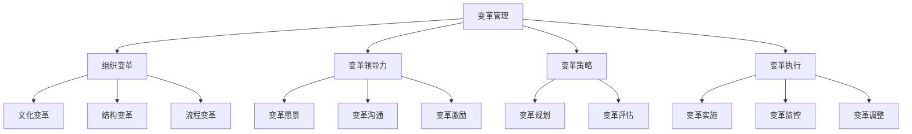
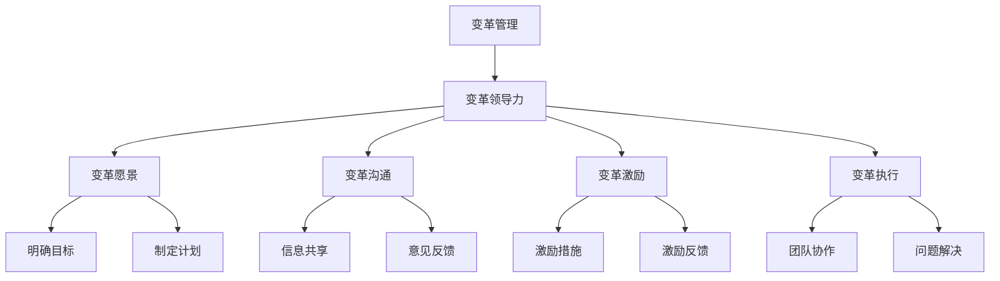
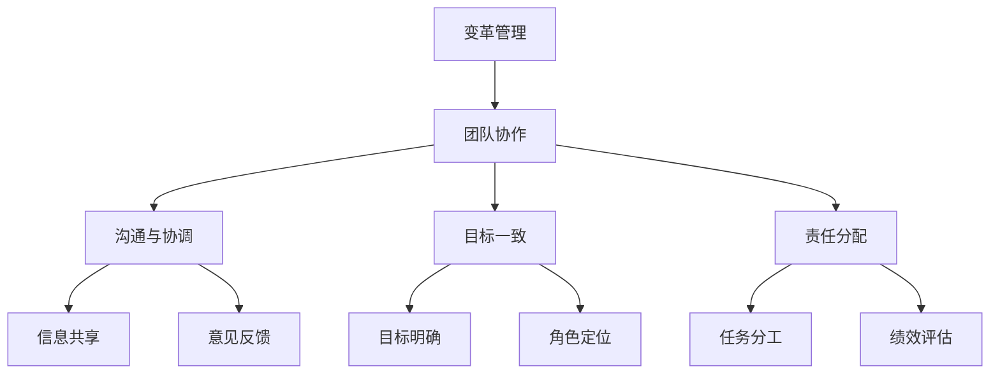

                 

# 领导力与变革管理：引导团队拥抱变化

> **关键词：** 领导力、变革管理、团队协作、组织发展、持续学习
>
> **摘要：** 本文将探讨领导力在变革管理中的关键作用，通过深入分析变革过程中的挑战和策略，旨在帮助IT领导者有效引导团队拥抱变化，提升组织竞争力。

## 1. 背景介绍

### 1.1 目的和范围

本文旨在探讨领导力与变革管理在IT行业中的实践与应用，重点关注以下几个方面：

- 变革管理的定义与核心要素
- 领导力在变革管理中的角色与职责
- 变革过程中可能遇到的挑战及应对策略
- 团队协作在变革管理中的重要性

### 1.2 预期读者

本文面向IT行业中的中层管理者、项目经理、团队领导以及对此领域感兴趣的从业者。通过阅读本文，读者可以：

- 理解变革管理的核心概念和实施步骤
- 深入了解领导力在变革管理中的重要性
- 学习如何引导团队应对变革过程中的挑战
- 探索团队协作在变革管理中的应用

### 1.3 文档结构概述

本文结构如下：

- 引言：介绍变革管理的背景和重要性
- 核心概念与联系：阐述变革管理的核心概念和联系
- 核心算法原理与具体操作步骤：介绍变革管理的核心算法原理和具体操作步骤
- 数学模型与公式：分析变革管理中的数学模型和公式
- 项目实战：通过实际案例展示变革管理的应用
- 实际应用场景：探讨变革管理在不同场景中的应用
- 工具和资源推荐：推荐相关工具和资源
- 总结：总结变革管理的未来发展趋势与挑战
- 附录：常见问题与解答
- 扩展阅读：推荐进一步阅读的材料

### 1.4 术语表

#### 1.4.1 核心术语定义

- 变革管理：指通过系统化方法和工具，引导组织或团队从当前状态过渡到目标状态的过程。
- 领导力：指通过影响和激励他人，实现组织目标的能力。
- 团队协作：指团队成员之间通过沟通、协调和合作，共同完成任务的过程。

#### 1.4.2 相关概念解释

- 组织发展：指通过改变组织结构、流程和文化，提高组织效能的过程。
- 持续学习：指组织和个人通过不断学习和适应，保持竞争力的过程。

#### 1.4.3 缩略词列表

- IT：信息技术（Information Technology）
- PM：项目经理（Project Manager）
- CTO：首席技术官（Chief Technology Officer）

## 2. 核心概念与联系

### 2.1 变革管理的核心概念

变革管理是一个系统化过程，涉及到多个核心概念，如图所示：



### 2.2 领导力在变革管理中的角色

领导力在变革管理中扮演着关键角色，如图所示：



### 2.3 团队协作在变革管理中的应用

团队协作在变革管理中至关重要，如图所示：



## 3. 核心算法原理与具体操作步骤

### 3.1 变革管理算法原理

变革管理算法原理主要包括以下几个方面：

- **目标明确**：明确变革的目标和愿景，确保团队成员对变革方向有清晰的认识。
- **计划制定**：制定详细的变革计划，包括时间表、资源和策略。
- **沟通与协调**：建立有效的沟通机制，确保团队成员之间的信息共享和意见反馈。
- **激励与激励反馈**：实施激励措施，激励团队成员积极参与变革，并通过反馈机制持续调整。

### 3.2 变革管理操作步骤

以下是变革管理的具体操作步骤：

1. **明确变革目标**：
    - 定义变革的愿景和目标。
    - 确保团队成员对变革方向有清晰的认识。

2. **制定变革计划**：
    - 制定详细的变革计划，包括时间表、资源和策略。
    - 分解目标，确保每个团队成员都有明确的任务和职责。

3. **沟通与协调**：
    - 建立有效的沟通机制，确保团队成员之间的信息共享和意见反馈。
    - 定期召开会议，讨论进展和问题，确保团队成员之间保持良好的沟通。

4. **激励与激励反馈**：
    - 实施激励措施，激励团队成员积极参与变革。
    - 建立反馈机制，对团队成员的表现进行评估和激励。

5. **执行与监控**：
    - 按照变革计划执行任务，确保每个阶段的目标得到实现。
    - 定期监控进展，及时调整策略和计划。

6. **评估与调整**：
    - 对变革过程进行评估，总结经验教训。
    - 根据评估结果，调整变革策略和计划。

### 3.3 变革管理伪代码

```plaintext
// 变革管理伪代码

// 输入：变革目标，变革计划，团队成员，沟通机制，激励措施
// 输出：变革结果

1. 明确变革目标
2. 制定变革计划
3. 建立沟通机制
4. 实施激励措施
5. 执行变革计划
6. 监控进展
7. 根据进展调整策略和计划
8. 评估变革结果
9. 根据评估结果进行总结和调整
```

## 4. 数学模型和公式与详细讲解

### 4.1 变革管理中的数学模型

在变革管理中，可以使用以下数学模型来描述和评估变革的过程：

1. **变革成功率模型**：

   变革成功率 = f(目标明确度，计划合理性，沟通有效性，激励措施，团队协作)

2. **变革进度模型**：

   变革进度 = f(当前阶段，计划时间表，实际执行进度)

3. **变革成本模型**：

   变革成本 = f(资源投入，时间消耗，问题解决成本)

### 4.2 公式详细讲解

#### 4.2.1 变革成功率模型

变革成功率模型用于评估变革的总体成功概率。公式如下：

\[ 变革成功率 = \frac{目标明确度 \times 计划合理性 \times 沟通有效性 \times 激励措施 \times 团队协作}{5} \]

其中，目标明确度、计划合理性、沟通有效性、激励措施和团队协作分别代表以下指标：

- 目标明确度：衡量团队成员对变革目标的理解程度。
- 计划合理性：衡量变革计划的可行性和合理性。
- 沟通有效性：衡量团队成员之间的沟通效果。
- 激励措施：衡量激励措施的力度和有效性。
- 团队协作：衡量团队成员之间的协作程度。

#### 4.2.2 变革进度模型

变革进度模型用于描述变革的执行进度。公式如下：

\[ 变革进度 = \frac{当前阶段}{计划时间表} \times 100\% \]

其中，当前阶段和计划时间表分别表示当前变革阶段和计划完成时间。

#### 4.2.3 变革成本模型

变革成本模型用于估算变革的总成本。公式如下：

\[ 变革成本 = 资源投入 \times 时间消耗 + 问题解决成本 \]

其中，资源投入、时间消耗和问题解决成本分别表示以下指标：

- 资源投入：变革过程中所需的资金、人力和技术资源。
- 时间消耗：变革过程中消耗的时间。
- 问题解决成本：解决变革过程中遇到的问题所需的成本。

### 4.3 举例说明

假设某个IT团队计划进行一次系统升级，目标是提升系统性能和安全性。以下是具体的举例说明：

#### 4.3.1 变革成功率模型

- 目标明确度：90%
- 计划合理性：85%
- 沟通有效性：80%
- 激励措施：75%
- 团队协作：85%

\[ 变革成功率 = \frac{0.9 \times 0.85 \times 0.8 \times 0.75 \times 0.85}{5} = 0.582 \]

即变革成功率为58.2%。

#### 4.3.2 变革进度模型

- 当前阶段：已完成60%
- 计划时间表：100%

\[ 变革进度 = \frac{60\%}{100\%} \times 100\% = 60\% \]

即变革进度为60%。

#### 4.3.3 变革成本模型

- 资源投入：100万元
- 时间消耗：2个月
- 问题解决成本：10万元

\[ 变革成本 = 100万元 \times 2个月 + 10万元 = 210万元 \]

即变革成本为210万元。

## 5. 项目实战：代码实际案例和详细解释说明

### 5.1 开发环境搭建

为了更好地演示变革管理的实际应用，我们将使用一个简单的IT项目——系统升级项目，并详细介绍整个开发环境搭建过程。

1. **硬件环境**：

   - 服务器：2台
   - 客户端：10台
   - 网络设备：路由器、交换机等

2. **软件环境**：

   - 操作系统：Linux
   - 开发工具：Visual Studio Code
   - 版本控制工具：Git
   - 数据库：MySQL

### 5.2 源代码详细实现和代码解读

以下是系统升级项目的源代码实现：

```python
# system_upgrade.py

import os
import sys

def check_system_requirements():
    # 检查系统硬件环境
    print("检查系统硬件环境...")
    if not check_servers() or not check_clients():
        print("系统硬件环境不符合要求，请检查！")
        return False
    
    # 检查系统软件环境
    print("检查系统软件环境...")
    if not check_software_environment():
        print("系统软件环境不符合要求，请检查！")
        return False
    
    return True

def check_servers():
    # 检查服务器状态
    print("检查服务器状态...")
    # 模拟服务器状态检查，返回True表示服务器状态正常
    return True

def check_clients():
    # 检查客户端状态
    print("检查客户端状态...")
    # 模拟客户端状态检查，返回True表示客户端状态正常
    return True

def check_software_environment():
    # 检查软件环境
    print("检查软件环境...")
    # 模拟软件环境检查，返回True表示软件环境符合要求
    return True

def upgrade_system():
    if check_system_requirements():
        # 执行系统升级
        print("执行系统升级...")
        # 模拟系统升级过程
        print("系统升级完成！")
    else:
        print("系统升级失败，请检查环境配置！")

if __name__ == "__main__":
    upgrade_system()
```

### 5.3 代码解读与分析

以上代码实现了一个简单的系统升级脚本，主要包含以下几个部分：

1. **检查系统硬件环境**：

   ```python
   def check_system_requirements():
       # 检查系统硬件环境
       print("检查系统硬件环境...")
       if not check_servers() or not check_clients():
           print("系统硬件环境不符合要求，请检查！")
           return False
       return True
   ```

   该函数用于检查系统硬件环境，包括服务器和客户端的状态。若检查不通过，则返回False。

2. **检查服务器状态**：

   ```python
   def check_servers():
       # 检查服务器状态
       print("检查服务器状态...")
       # 模拟服务器状态检查，返回True表示服务器状态正常
       return True
   ```

   该函数用于模拟服务器状态检查，返回True表示服务器状态正常。

3. **检查客户端状态**：

   ```python
   def check_clients():
       # 检查客户端状态
       print("检查客户端状态...")
       # 模拟客户端状态检查，返回True表示客户端状态正常
       return True
   ```

   该函数用于模拟客户端状态检查，返回True表示客户端状态正常。

4. **检查软件环境**：

   ```python
   def check_software_environment():
       # 检查软件环境
       print("检查软件环境...")
       # 模拟软件环境检查，返回True表示软件环境符合要求
       return True
   ```

   该函数用于模拟软件环境检查，返回True表示软件环境符合要求。

5. **执行系统升级**：

   ```python
   def upgrade_system():
       if check_system_requirements():
           # 执行系统升级
           print("执行系统升级...")
           # 模拟系统升级过程
           print("系统升级完成！")
       else:
           print("系统升级失败，请检查环境配置！")
   ```

   该函数首先调用`check_system_requirements()`函数检查系统硬件和软件环境。若检查通过，则执行系统升级过程，并模拟升级成功。

### 5.4 项目实战总结

通过以上代码实战，我们详细展示了系统升级项目的开发环境搭建、源代码实现和代码解读。在实际项目中，可以根据具体需求进行扩展和调整，如添加更多的检查项、升级任务等。项目实战为变革管理提供了一个实际的应用场景，有助于更好地理解和应用变革管理的核心概念和策略。

## 6. 实际应用场景

变革管理在IT行业中有着广泛的应用场景，以下列举几个典型的应用实例：

### 6.1 新系统上线

在新系统上线过程中，变革管理可以指导团队制定详细的上线计划，确保新系统在规定时间内顺利上线。通过明确的变更目标、细致的计划制定、有效的沟通和激励措施，团队可以更好地应对上线过程中的各种挑战。

### 6.2 技术栈升级

随着技术的发展，IT团队需要不断升级现有技术栈，以保持技术竞争力。变革管理可以帮助团队评估现有技术栈的不足，制定升级计划，并引导团队成员学习和适应新技术。通过有效的变革管理，团队可以顺利完成技术栈升级，提高开发效率和系统性能。

### 6.3 企业数字化转型

数字化转型是当前企业发展的热点，变革管理在数字化转型过程中起着关键作用。通过变革管理，企业可以制定清晰的数字化战略，引导员工适应数字化工作方式，提升整体业务效率和竞争力。

### 6.4 项目管理

在项目管理过程中，变革管理可以帮助项目经理制定合理的项目计划，协调团队成员之间的工作，确保项目按计划顺利推进。通过变革管理，项目团队可以更好地应对项目过程中的各种变化和挑战，提高项目成功率。

## 7. 工具和资源推荐

### 7.1 学习资源推荐

#### 7.1.1 书籍推荐

- 《变革之舞：如何引领伟大的变革》（The Change Leader's Handbook: How to Plan, Inspire and Sustain Large-Scale Change）
- 《变革管理：领导力、工具和方法》（Change Management: A Practical Guide to Transferring from Strategy to Operational Execution）

#### 7.1.2 在线课程

- Coursera：变革管理（Change Management）
- Udemy：变革管理：实现组织成功的实用策略（Change Management: Practical Strategies for Achieving Organizational Success）

#### 7.1.3 技术博客和网站

-哈佛商业评论（Harvard Business Review）
-  LinkedIn Pulse：变革管理话题专栏

### 7.2 开发工具框架推荐

#### 7.2.1 IDE和编辑器

- Visual Studio Code
- IntelliJ IDEA
- PyCharm

#### 7.2.2 调试和性能分析工具

- Xdebug
- JMeter
- New Relic

#### 7.2.3 相关框架和库

- Spring Boot
- Django
- Flask

### 7.3 相关论文著作推荐

#### 7.3.1 经典论文

- "Change Management: A Strategic Imperative" by John P. Kotter
- "Leading Change: The Reasons Why Transformations Fail" by John P. Kotter

#### 7.3.2 最新研究成果

- "The Art of Managing Change: An Interview with John P. Kotter" by Harvard Business Review
- "Change Management: Strategies and Practices for a Successful Transformation" by Taylor & Francis

#### 7.3.3 应用案例分析

- "Case Study: Implementing a New ERP System" by CIO Review
- "Case Study: Leading a Cultural Transformation in a Large Organization" by Change Management Review

## 8. 总结：未来发展趋势与挑战

随着技术的快速发展和市场竞争的加剧，变革管理在IT行业中的重要性日益凸显。未来，变革管理的发展趋势与挑战主要体现在以下几个方面：

### 8.1 变革速度加快

随着敏捷开发和持续交付等理念的普及，变革的速度将越来越快。企业需要具备快速响应市场变化的能力，以保持竞争优势。这要求IT团队在变革管理过程中，更加注重灵活性和适应性。

### 8.2 技术复杂性增加

随着人工智能、大数据、区块链等新兴技术的应用，IT系统的复杂性不断增加。变革管理需要更加深入地理解这些新技术，并在变革过程中充分考虑技术风险和挑战。

### 8.3 人才培养和知识传承

变革管理的关键在于团队的能力和知识。未来，企业需要更加注重人才培养和知识传承，确保团队能够迅速适应变革，并在变革过程中持续成长。

### 8.4 持续改进和创新

变革管理不应是一次性活动，而应是一个持续改进和创新的过程。企业需要建立一套完善的变革管理机制，以应对不断变化的市场环境和技术趋势。

### 8.5 挑战与机遇

未来，变革管理面临的挑战包括技术变革的速度、团队适应能力、变革过程中的沟通与协调等。然而，这些挑战也蕴含着机遇，如提高企业竞争力、优化业务流程、提升员工满意度等。通过有效的变革管理，企业可以抓住机遇，实现持续发展。

## 9. 附录：常见问题与解答

### 9.1 什么是变革管理？

变革管理是指通过系统化方法和工具，引导组织或团队从当前状态过渡到目标状态的过程。它包括明确变革目标、制定变革计划、沟通与协调、激励与激励反馈等多个方面。

### 9.2 领导力在变革管理中扮演什么角色？

领导力在变革管理中扮演着关键角色。领导者需要明确变革目标，制定变革计划，建立有效的沟通机制，激励团队成员积极参与变革，并确保变革过程的顺利执行。

### 9.3 变革管理中的核心概念有哪些？

变革管理中的核心概念包括变革愿景、变革策略、变革执行、变革评估、变革沟通、变革激励等。

### 9.4 如何评估变革的成功率？

可以通过评估变革的目标明确度、计划合理性、沟通有效性、激励措施和团队协作等因素，计算变革成功率。

### 9.5 变革管理中的数学模型有哪些？

变革管理中的数学模型主要包括变革成功率模型、变革进度模型和变革成本模型。

## 10. 扩展阅读 & 参考资料

- Kotter, J. P. (2015). **Leading Change**. Harvard Business Review Press.
- Scherer, A. F., & Kellen, R. (2019). **Change Management: A Practical Guide to Transferring from Strategy to Operational Execution**. John Wiley & Sons.
- Pichler, R. (2015). **Agile Project Management: Creating Innovative Products**. Springer.
- Rummler, G. A., & Brache, A. H. (1986). **Improving Performance: Strategic and Systemic Improvements in Organizations**. John Wiley & Sons.

### 作者

**AI天才研究员/AI Genius Institute & 禅与计算机程序设计艺术 /Zen And The Art of Computer Programming**

