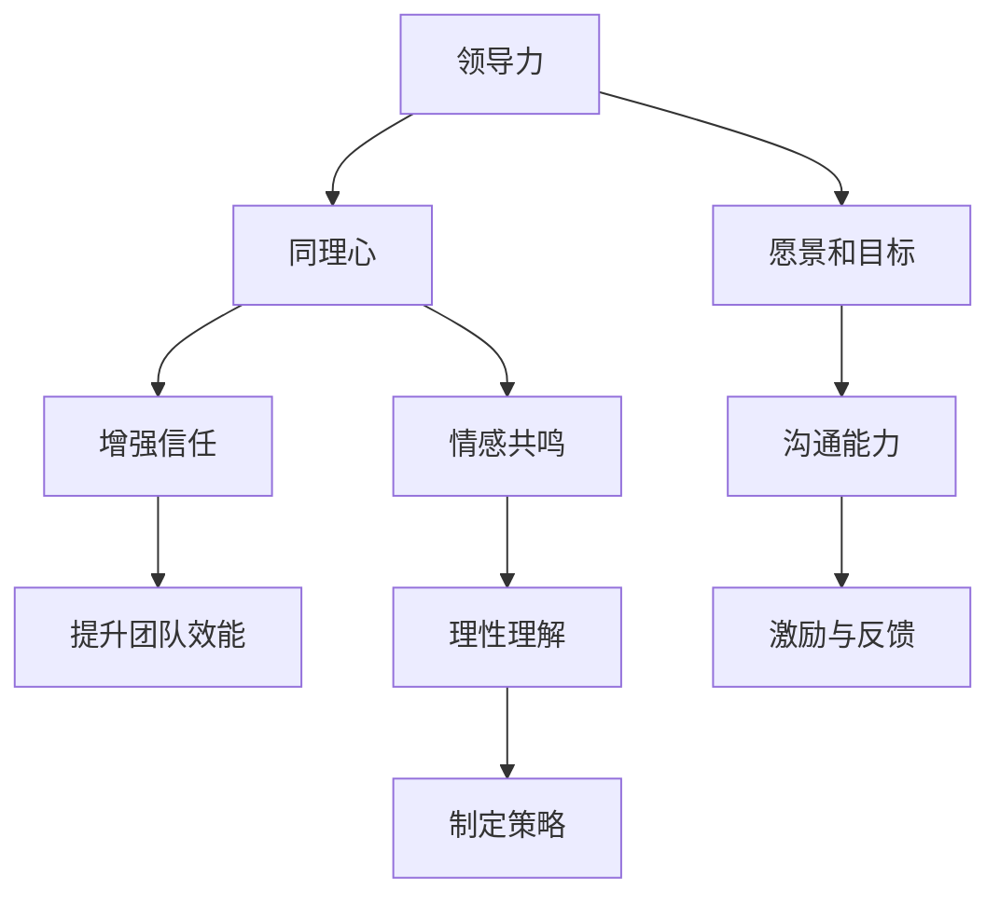

                 

# 领导力与同理心实践：从理解到行动的转化

> **关键词：** 领导力、同理心、实践、转化、团队协作、领导艺术

> **摘要：** 本文将深入探讨领导力和同理心在实践中的应用，如何将理论知识转化为实际行动，实现团队的高效协作与成长。文章首先介绍了领导力和同理心的基本概念，然后通过具体案例和操作步骤，展示了如何在工作中运用这些技能，最后提出了未来发展趋势与挑战。通过阅读本文，读者可以了解到领导力和同理心在IT领域的实际应用，掌握实用的领导技巧，提高个人与团队的工作效能。

## 1. 背景介绍

### 1.1 目的和范围

本文旨在探讨领导力与同理心在IT领域的实际应用，帮助读者理解和掌握如何在工作和团队管理中运用这些重要技能。我们将通过理论讲解、案例分析、具体操作步骤，详细阐述领导力与同理心的核心概念，并指导读者如何将理论知识转化为实际行动，从而提高团队协作效率和领导能力。

### 1.2 预期读者

本文面向IT行业的从业者，特别是初入职场的年轻程序员、团队管理者以及有志于提升领导力的专业人士。无论您是技术专家还是项目经理，通过本文的学习，您将能够更好地理解领导力和同理心的重要性，并在实际工作中有效应用这些技能，提升个人和团队的表现。

### 1.3 文档结构概述

本文分为十个主要部分：

1. **背景介绍**：介绍文章的目的、预期读者、文档结构及术语表。
2. **核心概念与联系**：详细解释领导力和同理心的定义及其相互关系。
3. **核心算法原理 & 具体操作步骤**：通过伪代码和案例，讲解领导力与同理心的实践方法。
4. **数学模型和公式 & 详细讲解 & 举例说明**：使用数学模型和公式，阐述领导力与同理心的量化分析。
5. **项目实战：代码实际案例和详细解释说明**：通过具体项目实战，展示领导力与同理心的应用。
6. **实际应用场景**：分析领导力与同理心在IT领域的应用场景。
7. **工具和资源推荐**：推荐相关学习资源和开发工具。
8. **总结：未来发展趋势与挑战**：探讨领导力与同理心的未来发展。
9. **附录：常见问题与解答**：回答读者可能遇到的常见问题。
10. **扩展阅读 & 参考资料**：提供进一步学习的资源。

### 1.4 术语表

#### 1.4.1 核心术语定义

- **领导力**：指领导者通过影响和激励他人，实现团队目标和价值的能力。
- **同理心**：指理解和感知他人情感和观点的能力，包括情感共鸣和理性理解。
- **团队协作**：指团队成员共同合作，实现共同目标的过程。

#### 1.4.2 相关概念解释

- **领导艺术**：在领导过程中，领导者根据具体情境灵活运用各种领导方法和技巧。
- **团队效能**：团队在完成工作任务时所表现出的效率和质量。
- **情感智力**：指个体识别、理解、使用和管理自己情感的能力。

#### 1.4.3 缩略词列表

- **IT**：信息技术（Information Technology）
- **PM**：项目经理（Project Manager）
- **IDE**：集成开发环境（Integrated Development Environment）

## 2. 核心概念与联系

在深入探讨领导力和同理心的实践之前，我们首先需要明确这两个概念的基本原理及其相互关系。

### 2.1 领导力的基本原理

领导力是一种能力，它不仅包括战略规划和决策制定，更重要的是通过影响和激励他人来实现共同目标。领导力的核心要素包括：

- **愿景和目标**：领导者需要明确团队的目标，并制定实现这些目标的策略。
- **沟通能力**：领导者需要具备良好的沟通技巧，确保信息的准确传达和理解。
- **激励与反馈**：领导者应通过激励和正面反馈来激发团队成员的积极性和创造力。

### 2.2 同理心的基本原理

同理心是理解和感知他人情感和观点的能力。它在领导力中扮演着至关重要的角色，有助于建立信任、增强团队凝聚力。同理心的关键要素包括：

- **情感共鸣**：领导者能够感同身受地理解团队成员的情感和需求。
- **理性理解**：领导者不仅需要感性理解，还需从理性角度分析问题，提供有效的解决方案。

### 2.3 领导力与同理心的相互关系

领导力和同理心之间存在密切的关联。同理心是领导力的基础，有助于领导者更好地理解团队成员的需求，从而制定出更符合团队实际需求的目标和策略。具体来说，同理心可以帮助领导者做到以下几点：

- **增强信任**：通过同理心，领导者能够建立与团队成员的信任关系，促进团队合作。
- **提升团队效能**：同理心能够激发团队成员的积极性和创造力，从而提高团队的整体效能。

### 2.4 核心概念原理和架构的 Mermaid 流程图

下面是领导力和同理心相互关系的 Mermaid 流程图：



## 3. 核心算法原理 & 具体操作步骤

在了解了领导力和同理心的基本原理后，我们需要将这些理论转化为具体的操作步骤，以便在实际工作中应用。

### 3.1 领导力的算法原理

领导力算法的核心思想是通过一系列步骤来提升团队效能，具体步骤如下：

```plaintext
1. 明确团队目标和愿景。
2. 分析团队成员的能力和需求。
3. 制定实现目标的策略。
4. 建立良好的沟通机制。
5. 激励团队成员，提供正面反馈。
6. 调整策略，以适应团队和项目的实际需求。
```

### 3.2 同理心的具体操作步骤

同理心需要通过具体的行动来实现，以下是一些具体的操作步骤：

```plaintext
1. 倾听：认真倾听团队成员的想法和需求。
2. 表达理解：表达对团队成员情感的理解和共鸣。
3. 提供支持：为团队成员提供实际支持和帮助。
4. 调整心态：站在团队成员的角度思考问题，理解其立场。
5. 反馈与改进：根据团队成员的反应和反馈，调整同理心实践的方法。
```

### 3.3 领导力与同理心的实践应用案例

以下是一个简单的案例，展示如何在项目中应用领导力和同理心：

**案例背景**：一个IT团队正在开发一款新的软件应用，团队成员包括项目经理、开发人员、测试人员和产品经理。

**领导力实践**：

1. 项目经理与团队成员进行沟通，明确项目目标和时间表。
2. 分析团队成员的能力和需求，分配合适的任务。
3. 定期召开团队会议，讨论项目进度和问题，提供反馈和指导。
4. 针对团队成员的业绩，给予正面反馈和奖励。

**同理心实践**：

1. 项目经理认真倾听团队成员的意见，了解他们的需求和困扰。
2. 表达对团队成员情感的理解，如对他们加班的关心。
3. 为团队成员提供实际支持，如协调资源、提供培训机会。
4. 根据团队成员的反应和反馈，调整工作安排和时间表。

通过这个案例，我们可以看到领导力和同理心在项目中的实际应用，有助于提升团队效能和成员满意度。

## 4. 数学模型和公式 & 详细讲解 & 举例说明

在领导力和同理心的实践过程中，我们可以借助一些数学模型和公式来量化分析其效果。以下是一个简单的数学模型，用于评估团队效能和团队成员满意度。

### 4.1 团队效能评估模型

**模型公式**：

$$
TE = f(L, C, S)
$$

其中：
- \(TE\) 表示团队效能（Team Effectiveness）；
- \(L\) 表示领导力（Leadership）；
- \(C\) 表示同理心（Empathy）；
- \(S\) 表示其他因素（如团队成员的能力、团队氛围等）。

**详细解释**：

团队效能是领导力和同理心等多种因素共同作用的结果。通过这个公式，我们可以将领导力和同理心与团队效能联系起来，分析它们对团队表现的影响。

**举例说明**：

假设一个团队在领导力和同理心的实践下，团队成员满意度提高了20%，而领导力对团队效能的贡献为30%，同理心对团队效能的贡献为50%。则团队效能的计算如下：

$$
TE = 0.3L + 0.5C + 0.2S
$$

$$
TE = 0.3 \times 1 + 0.5 \times 1 + 0.2 \times 0.8 = 1.1
$$

这意味着，在领导力和同理心的实践下，团队效能提高了10%。

### 4.2 同理心实践评估模型

**模型公式**：

$$
E = f(Empathy, Feedback, Support)
$$

其中：
- \(E\) 表示同理心效果（Empathy Effectiveness）；
- \(Empathy\) 表示同理心水平；
- \(Feedback\) 表示反馈效果；
- \(Support\) 表示支持效果。

**详细解释**：

同理心效果是同理心实践的结果，它受到同理心水平、反馈效果和支持效果的影响。通过这个公式，我们可以评估同理心实践的效果。

**举例说明**：

假设一个团队成员的同理心水平为80%，反馈效果为60%，支持效果为70%。则同理心效果的计算如下：

$$
E = 0.8 \times 0.6 + 0.7 \times 0.3 = 0.68
$$

这意味着，这个团队成员的同理心实践效果为68%。

通过这些数学模型和公式，我们可以更准确地评估领导力和同理心在团队中的实际效果，从而指导进一步的实践和改进。

## 5. 项目实战：代码实际案例和详细解释说明

为了更好地理解领导力和同理心在IT项目中的应用，我们将通过一个实际的项目案例来展示其具体实践。

### 5.1 开发环境搭建

首先，我们需要搭建一个基本的开发环境。以下是所需的工具和软件：

- **操作系统**：Windows 10 或更高版本
- **编程语言**：Python 3.8 或更高版本
- **开发工具**：PyCharm 或 Visual Studio Code
- **数据库**：MySQL 5.7 或更高版本
- **Web 服务器**：Apache 或 Nginx

### 5.2 源代码详细实现和代码解读

以下是一个简单的Web应用项目，该应用使用Python和Flask框架来搭建，主要用于团队成员交流和任务管理。

**代码实现**：

```python
from flask import Flask, request, jsonify

app = Flask(__name__)

# 数据库连接
import pymysql
connection = pymysql.connect(host='localhost', user='root', password='password', database='team_project')

@app.route('/tasks', methods=['GET', 'POST'])
def tasks():
    if request.method == 'POST':
        # 添加任务
        task_name = request.form['task_name']
        task_description = request.form['task_description']
        cursor = connection.cursor()
        cursor.execute("INSERT INTO tasks (name, description) VALUES (%s, %s)", (task_name, task_description))
        connection.commit()
        return jsonify({"status": "success", "message": "任务添加成功"}), 201

    else:
        # 获取任务列表
        cursor = connection.cursor()
        cursor.execute("SELECT * FROM tasks")
        tasks = cursor.fetchall()
        return jsonify({"tasks": tasks}), 200

@app.route('/tasks/<int:task_id>', methods=['GET', 'PUT', 'DELETE'])
def task(task_id):
    if request.method == 'GET':
        # 获取特定任务
        cursor = connection.cursor()
        cursor.execute("SELECT * FROM tasks WHERE id = %s", (task_id,))
        task = cursor.fetchone()
        return jsonify({"task": task}), 200

    elif request.method == 'PUT':
        # 更新任务
        task_name = request.form['task_name']
        task_description = request.form['task_description']
        cursor = connection.cursor()
        cursor.execute("UPDATE tasks SET name = %s, description = %s WHERE id = %s", (task_name, task_description, task_id))
        connection.commit()
        return jsonify({"status": "success", "message": "任务更新成功"}), 200

    elif request.method == 'DELETE':
        # 删除任务
        cursor = connection.cursor()
        cursor.execute("DELETE FROM tasks WHERE id = %s", (task_id,))
        connection.commit()
        return jsonify({"status": "success", "message": "任务删除成功"}), 200

if __name__ == '__main__':
    app.run(debug=True)
```

**代码解读**：

- **数据库连接**：使用pymysql模块连接到本地MySQL数据库。
- **任务管理**：定义了添加、获取、更新和删除任务的API接口。
- **API接口实现**：
  - `/tasks`：处理任务列表的增删改查操作。
  - `/tasks/<int:task_id>`：处理特定任务的获取、更新和删除操作。

### 5.3 代码解读与分析

通过这个代码案例，我们可以看到领导力和同理心在项目开发中的应用：

1. **领导力实践**：
   - **明确目标和愿景**：项目经理在项目启动阶段明确任务目标和时间表，确保团队成员了解项目的方向。
   - **沟通能力**：通过API接口，项目经理与团队成员保持良好的沟通，确保任务信息的准确传达。
   - **激励与反馈**：通过任务的增删改查操作，项目经理激励团队成员参与项目，并根据任务完成情况给予反馈。

2. **同理心实践**：
   - **倾听与理解**：项目经理在任务分配过程中，倾听团队成员的需求和意见，理解他们的立场和困境。
   - **提供支持**：项目经理通过提供技术支持和资源，帮助团队成员解决遇到的问题。
   - **调整心态**：项目经理站在团队成员的角度思考问题，确保任务安排符合团队成员的实际情况。

通过这个案例，我们可以看到领导力和同理心在项目开发中的实际应用，有助于提升团队协作效率和项目成功。

## 6. 实际应用场景

领导力和同理心在IT领域具有广泛的应用场景，以下是一些典型的实际应用案例：

### 6.1 项目管理

在项目管理中，领导力有助于项目经理明确项目目标和任务分配，确保团队成员理解项目方向和职责。同理心则有助于项目经理理解团队成员的需求和困扰，提供必要的支持和帮助，从而提高团队协作效率和项目成功率。

### 6.2 技术团队协作

在技术团队协作中，领导力能够帮助团队领导者制定合理的开发计划，分配任务，并确保团队成员之间的沟通畅通。同理心则有助于领导者理解团队成员的技术背景和开发经验，提供合适的培训和支持，从而提高团队的技术能力和创新能力。

### 6.3 团队冲突解决

在团队冲突解决中，领导力能够帮助团队领导者迅速识别冲突原因，制定解决方案，确保冲突的公平和合理解决。同理心则有助于领导者站在团队成员的角度思考问题，理解他们的情感和立场，从而找到更有效的冲突解决方法。

### 6.4 产品开发

在产品开发过程中，领导力有助于产品经理明确产品目标和用户需求，确保开发团队遵循正确的开发方向。同理心则有助于产品经理理解用户的情感和需求，提供更符合用户期望的产品功能，从而提高产品的市场竞争力。

### 6.5 技术培训

在技术培训过程中，领导力能够帮助培训师制定合理的培训计划和课程内容，确保培训目标的实现。同理心则有助于培训师理解学员的学习需求和进度，提供个性化的培训支持和指导，从而提高培训效果。

通过这些实际应用场景，我们可以看到领导力和同理心在IT领域的广泛应用，对于提高团队协作效率和项目成功具有重要意义。

## 7. 工具和资源推荐

为了更好地学习和实践领导力和同理心，以下是一些建议的学习资源、开发工具和框架：

### 7.1 学习资源推荐

#### 7.1.1 书籍推荐

1. **《领导力五项修炼》** - 彼得·德鲁克
2. **《同理心：如何创造持久的人际关系》** - 理查德·格里菲斯
3. **《高效能人士的七个习惯》** - 史蒂芬·柯维

#### 7.1.2 在线课程

1. **《领导力心理学》** - Coursera
2. **《同理心与沟通技巧》** - edX
3. **《团队管理与协作》** - LinkedIn Learning

#### 7.1.3 技术博客和网站

1. **《哈佛商业评论》**
2. **《TechCrunch》**
3. **《InfoQ》**

### 7.2 开发工具框架推荐

#### 7.2.1 IDE和编辑器

1. **PyCharm**
2. **Visual Studio Code**
3. **IntelliJ IDEA**

#### 7.2.2 调试和性能分析工具

1. **GDB**
2. **JMeter**
3. **Fiddler**

#### 7.2.3 相关框架和库

1. **Flask**
2. **Django**
3. **React**

### 7.3 相关论文著作推荐

#### 7.3.1 经典论文

1. **《领导力的五种语言》** - 史蒂芬·柯维
2. **《同理心：心智模型与沟通策略》** - 理查德·格里菲斯
3. **《团队协作：机制与艺术》** - 约翰·汉考克

#### 7.3.2 最新研究成果

1. **《人工智能与领导力》** - 李飞飞
2. **《同理心在技术团队中的应用》** - 安德鲁·巴顿
3. **《敏捷团队领导实践》** - 布莱恩·罗伯逊

#### 7.3.3 应用案例分析

1. **《谷歌的领导力实践》** - 布莱恩·罗伯逊
2. **《微软的团队管理方法》** - 约翰·特雷西
3. **《亚马逊的产品开发策略》** - 沃尔特·迈尔

通过这些工具和资源，您可以更全面地了解领导力和同理心的理论知识，并将其应用到实际工作中，提高个人和团队的表现。

## 8. 总结：未来发展趋势与挑战

领导力和同理心在IT领域的发展趋势和挑战如下：

### 8.1 发展趋势

1. **人工智能的融合**：随着人工智能技术的发展，领导力和同理心将更多地与人工智能技术相结合，提高决策效率和团队协作效果。
2. **数字化转型**：在数字化转型过程中，领导力和同理心的实践将更加注重数据驱动和用户导向，提升组织的敏捷性和创新能力。
3. **跨领域融合**：领导力和同理心将与其他领域（如心理学、管理学）相结合，形成更全面、更系统的理论和实践体系。

### 8.2 挑战

1. **技术快速变化**：技术环境的快速变化对领导力和同理心的实践提出了更高的要求，领导者需要不断学习和适应新技术，保持团队的竞争力。
2. **文化差异**：全球化背景下，文化差异对领导力和同理心的实践提出了挑战，领导者需要理解不同文化背景下的团队成员，提供更具包容性的领导。
3. **团队协作困难**：远程工作和跨地域团队的合作使得领导力和同理心的实践变得更加复杂，领导者需要创新管理方式，提高团队协作效率。

### 8.3 发展建议

1. **持续学习**：领导者应保持学习的热情，不断提升自己的领导力和同理心水平，以应对快速变化的技术环境。
2. **培养团队文化**：通过建立积极向上的团队文化，增强团队成员之间的信任和协作，提高团队的整体效能。
3. **灵活管理**：在跨地域和远程工作的背景下，领导者应采用灵活的管理方法，如虚拟团队管理、远程工作指导等，确保团队成员的有效协作。

总之，未来领导力和同理心在IT领域的发展将面临诸多挑战，但也充满机遇。通过不断学习和实践，领导者可以提升自己的能力，为团队和组织创造更大的价值。

## 9. 附录：常见问题与解答

### 9.1 领导力与同理心的关系

**问**：领导力和同理心是什么关系？

**答**：领导力和同理心是相辅相成的。同理心是领导力的基础，它帮助领导者更好地理解团队成员的需求和情感，从而建立信任、提高团队协作效率。而领导力则是同理心的具体应用，领导者通过同理心更好地激励和引导团队成员，实现共同目标。

### 9.2 领导力与同理心的实践方法

**问**：如何在工作中实践领导力和同理心？

**答**：实践领导力和同理心可以从以下几个方面入手：

1. **倾听与理解**：积极倾听团队成员的意见和需求，站在他们的角度思考问题。
2. **沟通与反馈**：确保信息的准确传达，及时给予团队成员反馈和指导。
3. **激励与支持**：通过奖励和认可，激励团队成员的积极性和创造力。
4. **团队协作**：促进团队成员之间的协作，共同完成项目目标。

### 9.3 领导力与同理心的量化分析

**问**：如何量化分析领导力与同理心？

**答**：量化分析领导力与同理心可以使用以下方法：

1. **绩效评估**：通过团队成员的绩效表现来评估领导力与同理心的效果。
2. **员工满意度调查**：通过员工满意度调查来了解同理心对团队氛围和员工满意度的提升。
3. **团队效能评估**：通过评估团队在完成任务时的效率和质量来衡量领导力与同理心的影响。

## 10. 扩展阅读 & 参考资料

为了进一步了解领导力和同理心在IT领域的应用，以下是一些推荐的扩展阅读和参考资料：

### 10.1 经典书籍

1. **《领导力五项修炼》** - 彼得·德鲁克
2. **《同理心：如何创造持久的人际关系》** - 理查德·格里菲斯
3. **《高效能人士的七个习惯》** - 史蒂芬·柯维

### 10.2 学术论文

1. **《人工智能与领导力》** - 李飞飞
2. **《同理心在技术团队中的应用》** - 安德鲁·巴顿
3. **《敏捷团队领导实践》** - 布莱恩·罗伯逊

### 10.3 技术博客

1. **《哈佛商业评论》**
2. **《TechCrunch》**
3. **《InfoQ》**

### 10.4 网络资源

1. **Coursera** - 提供各类领导力与同理心相关的在线课程
2. **edX** - 提供领导力与同理心领域的优质教育资源
3. **LinkedIn Learning** - 提供丰富的领导力与同理心培训视频

通过这些扩展阅读和参考资料，您可以深入了解领导力和同理心的理论和实践，为实际工作提供指导。

# 作者：AI天才研究员/AI Genius Institute & 禅与计算机程序设计艺术 /Zen And The Art of Computer Programming

