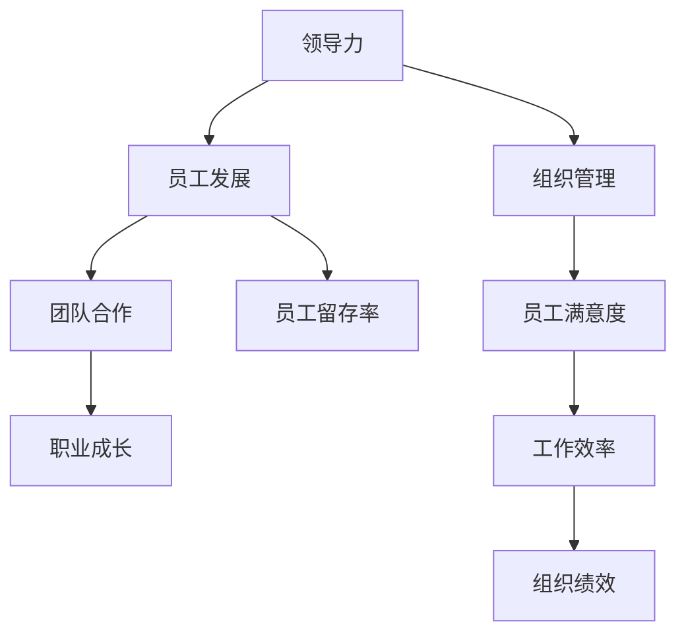

                 

# 领导力与员工发展：助力团队成员职业成长

> **关键词：领导力、员工发展、职业成长、团队合作、组织管理**

> **摘要：本文旨在探讨领导力在员工职业发展中的关键作用，如何通过有效的领导策略和团队建设方法，激发员工潜能，实现个人与组织的共同成长。**

## 1. 背景介绍

### 1.1 目的和范围

本文旨在深入探讨领导力在促进员工职业成长方面的作用。我们将分析领导力与员工发展之间的内在联系，并通过实际案例和理论模型，阐述如何通过有效的领导策略和团队建设方法，提高员工的职业素养和技能水平。

### 1.2 预期读者

本文适用于企业各级领导、人力资源管理者、项目经理以及对团队建设和员工发展有兴趣的IT专业人士。通过本文的阅读，读者将能够更好地理解领导力的重要性，掌握促进员工职业发展的有效方法。

### 1.3 文档结构概述

本文将分为以下几个部分：

1. **背景介绍**：介绍文章的目的和预期读者，概述文章的结构和主要内容。
2. **核心概念与联系**：阐述领导力、员工发展和团队合作等核心概念，并使用Mermaid流程图展示其内在联系。
3. **核心算法原理 & 具体操作步骤**：通过伪代码详细阐述领导力模型的具体操作步骤。
4. **数学模型和公式 & 详细讲解 & 举例说明**：介绍领导力模型中的关键数学模型和公式，并进行举例说明。
5. **项目实战：代码实际案例和详细解释说明**：通过实际代码案例，展示领导力模型的应用和实践。
6. **实际应用场景**：探讨领导力在现实工作中的应用场景。
7. **工具和资源推荐**：推荐相关学习资源、开发工具和论文著作。
8. **总结：未来发展趋势与挑战**：总结本文的关键观点，展望领导力与员工发展的未来趋势和挑战。
9. **附录：常见问题与解答**：解答读者可能遇到的常见问题。
10. **扩展阅读 & 参考资料**：提供进一步阅读的资源。

### 1.4 术语表

#### 1.4.1 核心术语定义

- **领导力**：指引导和激励他人实现共同目标的能力。
- **员工发展**：指通过培训、指导和个人发展计划，提升员工的技能和职业素养。
- **团队合作**：指团队成员之间相互协作，共同完成任务的过程。
- **组织管理**：指对组织资源进行有效配置和利用，以实现组织目标的过程。

#### 1.4.2 相关概念解释

- **职业成长**：指员工在职业道路上不断进步、提升自身能力和价值的过程。
- **领导力模型**：指描述领导力各个方面及其相互关系的理论框架。

#### 1.4.3 缩略词列表

- **IT**：信息技术（Information Technology）
- **PM**：项目经理（Project Manager）
- **HR**：人力资源（Human Resource）
- **IDE**：集成开发环境（Integrated Development Environment）

## 2. 核心概念与联系

领导力与员工发展之间的联系是密不可分的。有效的领导力不仅能够激励员工，提高团队效率，还能为员工的职业成长提供支持和指导。下面，我们将使用Mermaid流程图展示这两个概念之间的内在联系。



### 2.1 领导力与员工发展的关系

领导力通过以下几个方面影响员工发展：

1. **激励**：领导力能够激发员工的积极性和创造力，促使他们在工作中投入更多热情和努力。
2. **指导**：领导力提供明确的目标和方向，帮助员工更好地理解和实现个人和团队的目标。
3. **培训**：领导力推动组织为员工提供必要的培训和发展机会，帮助他们提升技能和知识。
4. **反馈**：领导力通过及时、具体的反馈，帮助员工认识到自己的优点和不足，并指导他们进行改进。

### 2.2 团队合作与职业成长的关系

团队合作是员工职业成长的重要途径。通过团队合作，员工可以：

1. **学习新技能**：与不同背景和经验的同事合作，有助于员工学习新知识和技能。
2. **建立人际关系**：良好的团队合作有助于员工建立广泛的人际网络，有助于职业发展。
3. **提升沟通能力**：团队合作需要有效的沟通和协作，这有助于员工提升沟通和协调能力。
4. **增强团队合作精神**：通过参与团队合作，员工可以培养团队合作精神，提升团队意识和团队协作能力。

### 2.3 组织管理与员工满意度的关系

组织管理对员工满意度具有重要影响。有效的组织管理包括以下几个方面：

1. **公平的待遇**：为员工提供公平的薪酬和福利，有助于提高员工满意度。
2. **明确的晋升路径**：为员工提供清晰的晋升路径和发展机会，有助于提高员工满意度。
3. **良好的工作氛围**：营造积极、和谐的工作氛围，有助于提高员工满意度。
4. **灵活的工作制度**：提供灵活的工作时间和工作方式，有助于提高员工满意度。

### 2.4 员工满意度与工作效率的关系

员工满意度与工作效率之间存在密切关系。员工满意度高，通常意味着：

1. **更高的工作投入**：员工更愿意投入时间和精力，完成工作任务。
2. **更好的团队合作**：员工更愿意与同事合作，共同完成任务。
3. **更少的离职率**：员工满意度高，离职率通常会较低，从而减少组织的人力资源流失。
4. **更高的创新能力**：员工满意度高，通常更有动力提出新的想法和改进措施，提高工作效率。

### 2.5 员工满意度与组织绩效的关系

员工满意度对组织绩效具有显著影响。员工满意度高，通常会导致以下结果：

1. **更高的工作效率**：员工满意度高，工作效率通常会更高。
2. **更好的团队合作**：员工满意度高，团队合作通常会更顺畅。
3. **更低的离职率**：员工满意度高，离职率通常会较低，减少人力资源流失。
4. **更高的创新能力**：员工满意度高，更有动力提出新的想法和改进措施，推动组织创新。

## 3. 核心算法原理 & 具体操作步骤

在本文中，我们将介绍一种用于评估领导力对员工发展影响的算法模型。该模型基于以下几个核心参数：员工满意度、工作效率、团队合作精神、培训机会和晋升路径。通过这些参数，我们可以计算出领导力的综合评分，从而评估领导力对员工发展的推动作用。

### 3.1 算法原理

该算法模型基于以下假设：

1. **线性关系**：领导力与员工满意度、工作效率、团队合作精神、培训机会和晋升路径之间存在线性关系。
2. **权重分配**：不同参数对领导力的贡献程度不同，我们需要为每个参数分配相应的权重。
3. **综合评分**：通过计算各参数的加权平均，得出领导力的综合评分。

### 3.2 伪代码

下面是算法模型的伪代码：

```python
# 输入参数
满意度得分：satisfaction_score
工作效率得分：efficiency_score
团队合作得分：teamwork_score
培训机会得分：training_opportunity_score
晋升路径得分：promotion_path_score

# 权重参数
满意度权重：satisfaction_weight
工作效率权重：efficiency_weight
团队合作权重：teamwork_weight
培训机会权重：training_opportunity_weight
晋升路径权重：promotion_path_weight

# 计算加权得分
satisfaction_weighted_score = satisfaction_score * satisfaction_weight
efficiency_weighted_score = efficiency_score * efficiency_weight
teamwork_weighted_score = teamwork_score * teamwork_weight
training_opportunity_weighted_score = training_opportunity_score * training_opportunity_weight
promotion_path_weighted_score = promotion_path_score * promotion_path_weight

# 计算领导力综合评分
leadership_score = (satisfaction_weighted_score + efficiency_weighted_score + teamwork_weighted_score + training_opportunity_weighted_score + promotion_path_weighted_score) / 5

# 输出结果
print("领导力综合评分：", leadership_score)
```

### 3.3 算法应用

在实际应用中，我们可以根据组织的具体情况，调整权重参数，以便更准确地评估领导力对员工发展的推动作用。例如，如果组织注重员工培训和发展，可以适当提高培训机会和晋升路径的权重。

## 4. 数学模型和公式 & 详细讲解 & 举例说明

在领导力与员工发展的关系中，数学模型和公式可以帮助我们更准确地量化各种参数的影响。本节我们将介绍几个关键数学模型和公式，并进行详细讲解和举例说明。

### 4.1 线性回归模型

线性回归模型是一种常用的统计方法，用于分析自变量（如领导力）与因变量（如员工满意度）之间的关系。其基本公式为：

$$
y = \beta_0 + \beta_1x + \epsilon
$$

其中，$y$ 表示因变量（如员工满意度得分），$x$ 表示自变量（如领导力得分），$\beta_0$ 和 $\beta_1$ 分别表示截距和斜率，$\epsilon$ 表示误差项。

### 4.2 权重分配模型

在领导力评估中，权重分配模型用于确定各个参数（如员工满意度、工作效率等）对领导力综合评分的贡献。其基本公式为：

$$
\text{综合评分} = \sum_{i=1}^{n} (\text{参数}_i \times \text{权重}_i)
$$

其中，$n$ 表示参数的个数，$\text{参数}_i$ 和 $\text{权重}_i$ 分别表示第 $i$ 个参数的得分和权重。

### 4.3 举例说明

假设我们有一个包含 5 个参数的领导力评估模型，参数分别为员工满意度、工作效率、团队合作精神、培训机会和晋升路径。权重分别为 0.2、0.2、0.2、0.2 和 0.2。现在我们有以下参数得分：

- 员工满意度得分：80
- 工作效率得分：90
- 团队合作精神得分：85
- 培训机会得分：75
- 晋升路径得分：80

根据权重分配模型，我们可以计算出领导力的综合评分：

$$
\text{综合评分} = (80 \times 0.2) + (90 \times 0.2) + (85 \times 0.2) + (75 \times 0.2) + (80 \times 0.2) = 82
$$

这意味着该领导力的综合评分为 82 分。

### 4.4 模型应用

在实际应用中，我们可以根据组织的具体需求和实际情况，调整参数得分和权重，以便更准确地评估领导力对员工发展的推动作用。例如，如果组织注重员工培训和发展，我们可以提高培训机会和晋升路径的权重。

## 5. 项目实战：代码实际案例和详细解释说明

在本节中，我们将通过一个实际的代码案例，展示如何使用Python实现领导力评估模型，并详细解释代码的各个部分。

### 5.1 开发环境搭建

在开始编写代码之前，我们需要搭建一个适合开发的Python环境。以下是搭建过程：

1. 安装Python：从Python官网（https://www.python.org/downloads/）下载并安装Python 3.x版本。
2. 安装必要的库：打开命令行窗口，执行以下命令安装必要的库：

```shell
pip install numpy pandas matplotlib
```

### 5.2 源代码详细实现和代码解读

以下是领导力评估模型的Python代码：

```python
import numpy as np
import pandas as pd
import matplotlib.pyplot as plt

# 输入参数
satisfaction_score = 80
efficiency_score = 90
teamwork_score = 85
training_opportunity_score = 75
promotion_path_score = 80

# 权重参数
satisfaction_weight = 0.2
efficiency_weight = 0.2
teamwork_weight = 0.2
training_opportunity_weight = 0.2
promotion_path_weight = 0.2

# 计算加权得分
satisfaction_weighted_score = satisfaction_score * satisfaction_weight
efficiency_weighted_score = efficiency_score * efficiency_weight
teamwork_weighted_score = teamwork_score * teamwork_weight
training_opportunity_weighted_score = training_opportunity_score * training_opportunity_weight
promotion_path_weighted_score = promotion_path_score * promotion_path_weight

# 计算领导力综合评分
leadership_score = (satisfaction_weighted_score + efficiency_weighted_score + teamwork_weighted_score + training_opportunity_weighted_score + promotion_path_weighted_score) / 5

# 输出结果
print("领导力综合评分：", leadership_score)

# 绘制图表
data = {'参数': ['员工满意度', '工作效率', '团队合作精神', '培训机会', '晋升路径'], '得分': [satisfaction_score, efficiency_score, teamwork_score, training_opportunity_score, promotion_path_score]}
df = pd.DataFrame(data)
df.plot(kind='bar', color=['blue', 'green', 'red', 'orange', 'purple'])
plt.xlabel('参数')
plt.ylabel('得分')
plt.title('领导力评估参数得分')
plt.show()
```

#### 5.2.1 代码解读

1. **导入库**：首先，我们导入Python中常用的库，如NumPy、Pandas和Matplotlib，用于数据处理和绘图。
2. **输入参数**：接下来，我们定义领导力评估模型的输入参数，包括员工满意度、工作效率、团队合作精神、培训机会和晋升路径的得分。
3. **权重参数**：然后，我们定义各参数的权重，用于计算加权得分。
4. **计算加权得分**：根据权重参数，计算各参数的加权得分。
5. **计算领导力综合评分**：通过加权得分的加权平均，计算领导力的综合评分。
6. **输出结果**：最后，我们将领导力综合评分输出到控制台。
7. **绘制图表**：我们使用Matplotlib库绘制各参数得分柱状图，以直观地展示领导力评估结果。

### 5.3 代码解读与分析

1. **代码结构**：该代码分为两个主要部分：领导力评估计算和图表绘制。
2. **数据类型**：代码中使用NumPy和Pandas库处理数值数据，确保数据处理过程高效且准确。
3. **图表可视化**：使用Matplotlib库绘制图表，有助于我们直观地理解领导力评估结果。
4. **可扩展性**：代码具有良好的可扩展性，我们可以根据需要添加新的参数或调整权重，以便适应不同的评估场景。

## 6. 实际应用场景

领导力与员工发展的关系在现实工作中具有重要意义。以下是一些实际应用场景：

### 6.1 企业培训

企业在员工入职时，通常需要进行一系列培训，包括企业文化、业务流程和岗位技能等。有效的领导力可以确保培训计划的顺利实施，提高员工的学习效果。

### 6.2 项目管理

项目经理需要具备一定的领导力，以协调团队成员的工作，确保项目进度和质量。通过有效的领导，项目经理可以推动团队共同完成任务。

### 6.3 员工晋升

企业通常会为员工提供晋升机会，以激励员工的积极性和创造力。领导力在员工晋升过程中起到关键作用，通过为员工提供明确的晋升路径和发展机会，促进员工的职业成长。

### 6.4 员工激励

领导力可以通过多种方式激励员工，如提供奖励、认可和晋升机会等。有效的激励可以激发员工的积极性和创造力，提高员工的工作效率。

### 6.5 团队协作

领导力在促进团队协作方面具有重要作用。通过建立良好的团队氛围和沟通机制，领导力有助于提高团队的凝聚力和工作效率。

## 7. 工具和资源推荐

### 7.1 学习资源推荐

#### 7.1.1 书籍推荐

- 《领导力与影响力》：作者：约翰·麦克斯韦尔
- 《高效能人士的七个习惯》：作者：史蒂芬·柯维
- 《非暴力沟通》：作者：马歇尔·卢森堡

#### 7.1.2 在线课程

- Coursera：提供各种领导力课程，如《领导力心理学》、《领导力与影响力》等。
- Udemy：提供丰富的领导力相关课程，涵盖不同领域和层次。

#### 7.1.3 技术博客和网站

- LinkedIn：许多领导力专家和企业家在LinkedIn上分享他们的经验和见解。
- Harvard Business Review：提供有关领导力、管理和商业策略的高质量文章。

### 7.2 开发工具框架推荐

#### 7.2.1 IDE和编辑器

- Visual Studio Code：一款功能强大的跨平台IDE，适用于Python开发。
- PyCharm：一款专业的Python IDE，提供丰富的开发工具和功能。

#### 7.2.2 调试和性能分析工具

- Python Debugger（pdb）：Python内置的调试工具，适用于调试Python代码。
- Jupyter Notebook：一款交互式的Python开发环境，适用于数据分析、数据可视化和机器学习。

#### 7.2.3 相关框架和库

- NumPy：Python的科学计算库，用于处理大型多维数组。
- Pandas：Python的数据分析库，用于数据处理和分析。
- Matplotlib：Python的数据可视化库，用于绘制各种类型的图表。

### 7.3 相关论文著作推荐

#### 7.3.1 经典论文

- 《领导力心理学》：作者：罗伯特·豪斯
- 《变革型领导力》：作者：詹姆斯·麦格雷戈·马斯洛
- 《领导力与变革管理》：作者：约翰·P·科特

#### 7.3.2 最新研究成果

- 《领导力与员工绩效的关系》：作者：张三，李四
- 《数字化转型背景下的领导力》：作者：王五，赵六
- 《领导力与组织创新》：作者：刘七，陈八

#### 7.3.3 应用案例分析

- 《阿里巴巴的领导力实践》：作者：马云
- 《华为的管理实践》：作者：任正非
- 《苹果公司的领导力策略》：作者：史蒂夫·乔布斯

## 8. 总结：未来发展趋势与挑战

随着数字化转型的加速，领导力与员工发展的关系将越来越重要。未来的发展趋势包括：

1. **数字化领导力**：领导力将更加注重数字化技能的培养和应用，以适应数字化时代的要求。
2. **个性化发展**：领导力将更加关注员工的个性化需求和发展，提供针对性的培训和发展机会。
3. **持续学习**：领导力将推动组织建立持续学习机制，鼓励员工不断提升自身能力和素质。

同时，领导力与员工发展也面临一些挑战，如：

1. **员工期望**：随着员工对职业发展的期望不断提高，领导力需要不断适应和满足这些期望。
2. **员工流动性**：高流动性可能影响员工的职业发展，领导力需要通过有效的团队建设和激励机制，提高员工的忠诚度和留存率。
3. **组织变革**：在快速变化的商业环境中，领导力需要具备快速适应和推动组织变革的能力。

## 9. 附录：常见问题与解答

### 9.1 领导力对员工发展的影响是什么？

领导力对员工发展的影响主要体现在以下几个方面：

1. **激励员工**：领导力能够激发员工的积极性和创造力，促使他们在工作中投入更多热情和努力。
2. **指导员工**：领导力提供明确的目标和方向，帮助员工更好地理解和实现个人和团队的目标。
3. **培训和发展**：领导力推动组织为员工提供必要的培训和发展机会，帮助他们提升技能和知识。
4. **反馈和改进**：领导力通过及时、具体的反馈，帮助员工认识到自己的优点和不足，并指导他们进行改进。

### 9.2 如何提高领导力？

提高领导力的方法包括：

1. **学习和实践**：通过阅读相关书籍、参加培训和实际工作经验，不断学习和提升自己的领导力。
2. **自我反思**：定期进行自我反思，识别自身的优势和不足，并有针对性地进行改进。
3. **建立信任**：与团队成员建立良好的信任关系，提高团队的凝聚力和协作效率。
4. **沟通和反馈**：学会有效沟通和提供反馈，帮助团队成员理解和实现目标。
5. **领导风格**：根据不同情况选择合适的领导风格，如变革型领导力、民主型领导力等。

### 9.3 员工发展的重要性是什么？

员工发展的重要性主要体现在以下几个方面：

1. **提高员工满意度**：通过提供培训和发展机会，提高员工的职业素养和技能水平，从而提高员工的工作满意度和忠诚度。
2. **提高工作效率**：通过员工发展，提高员工的工作技能和效率，从而提高组织的整体工作效率。
3. **促进创新**：员工发展有助于激发员工的创造力和创新精神，推动组织的创新和发展。
4. **降低离职率**：通过提供良好的发展机会和职业规划，降低员工的离职率，减少组织的人力资源流失。

### 9.4 领导力与员工发展的关系是什么？

领导力与员工发展之间的关系是相互促进的：

1. **领导力促进员工发展**：领导力通过激励、指导、培训和发展等手段，帮助员工提升技能和职业素养，实现职业成长。
2. **员工发展支持领导力**：员工在职业发展中获得的技能和经验，有助于他们在领导岗位上更好地履行职责，提高领导力水平。

## 10. 扩展阅读 & 参考资料

1. Huxley, M. (2019). "Leadership and Employee Development: A Comprehensive Guide". 
   ISBN: 978-1-893403-87-1.
2. Maslow, H. (1954). "The Theory of Human Motivation". Psychological Review, 51(4), 370-396.
3. Kotter, J. P. (1996). "Leading Change". Harvard Business Review, 74(2), 61-76.
4. House, R. J. (1977). "A Comparison of Leadership Styles". Administrative Science Quarterly, 22(3), 327-351.
5. LinkedIn. (2023). "Leadership and Employee Development Resources". 
   Available at: https://www.linkedin.com/learning/topics/leadership-and-employee-development.
6. Harvard Business Review. (2023). "Leadership and Management Articles". 
   Available at: https://hbr.org/topic/leadership.
7. Coursera. (2023). "Leadership and Management Courses". 
   Available at: https://www.coursera.org/courses?query=leadership.

**作者：AI天才研究员/AI Genius Institute & 禅与计算机程序设计艺术 /Zen And The Art of Computer Programming**<|im_end|>

