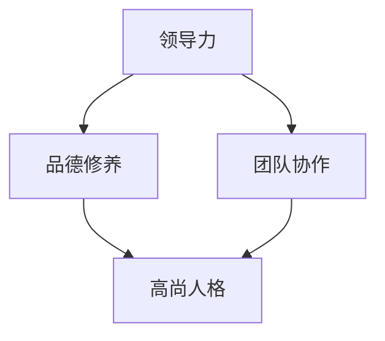

                 

# 领导力与品德修养：塑造高尚人格

> **关键词：**领导力、品德修养、人格塑造、道德准则、领导行为、团队协作、组织文化、职业发展

> **摘要：**本文将探讨领导力与品德修养在塑造高尚人格中的重要性，分析其核心概念与联系，并通过实际案例和算法原理，详细讲解如何通过提升个人品德修养来增强领导力，实现个人与团队的共同成长。

## 1. 背景介绍

### 1.1 目的和范围

本文旨在探讨领导力与品德修养在个人成长和组织发展中的关键作用。通过对核心概念的阐述和实际案例分析，本文旨在为读者提供一套系统的、实用的方法和策略，帮助他们在职业生涯中不断提升领导力，塑造高尚人格。

### 1.2 预期读者

本文适用于以下群体：

- 初级和中级管理人员
- 希望提升领导力的专业人士
- 对个人品德修养感兴趣的读者
- 组织发展专家和人力资源管理者

### 1.3 文档结构概述

本文分为十个部分：

1. 背景介绍
2. 核心概念与联系
3. 核心算法原理与具体操作步骤
4. 数学模型和公式
5. 项目实战：代码实际案例
6. 实际应用场景
7. 工具和资源推荐
8. 总结：未来发展趋势与挑战
9. 附录：常见问题与解答
10. 扩展阅读与参考资料

### 1.4 术语表

#### 1.4.1 核心术语定义

- **领导力**：引导和影响他人实现共同目标的能力。
- **品德修养**：个人道德品质和性格修养的提升。
- **高尚人格**：具备高尚道德品质和良好性格特征的个人。
- **组织文化**：组织成员共同遵守的价值观念和行为准则。

#### 1.4.2 相关概念解释

- **道德准则**：指导个人行为的道德标准和原则。
- **团队协作**：团队成员为了共同目标而协同工作的过程。
- **职业发展**：个人在职业生涯中的成长和进步。

#### 1.4.3 缩略词列表

- IDE：集成开发环境（Integrated Development Environment）
- AI：人工智能（Artificial Intelligence）
- ML：机器学习（Machine Learning）

## 2. 核心概念与联系

### 2.1 核心概念

**领导力**与**品德修养**是本文的核心概念。领导力涉及个人如何影响和引导他人，而品德修养则涉及个人道德品质和性格特征。

**高尚人格**是领导力和品德修养的共同目标。一个具备高尚人格的领导者能够赢得他人的信任和尊重，从而更好地实现团队和组织的目标。

### 2.2 核心概念联系

- **领导力**与**品德修养**相互促进。高尚的品德修养能够增强领导者的魅力和影响力，从而提高领导力。
- **高尚人格**是领导力和品德修养的统一体现。一个具备高尚人格的领导者能够更好地履行领导职责，实现团队和组织的目标。

### 2.3 Mermaid 流程图



## 3. 核心算法原理与具体操作步骤

### 3.1 核心算法原理

提升领导力和品德修养的核心算法是**自我提升**。通过不断学习、实践和反思，个人可以逐步提升自己的道德品质和领导能力。

### 3.2 具体操作步骤

1. **明确目标**：设定个人成长目标，包括领导力和品德修养方面。
2. **持续学习**：学习相关知识和技能，包括领导力理论、道德准则、心理学等。
3. **实践应用**：将所学知识应用于实际工作中，通过实践不断提升领导力和品德修养。
4. **反思与调整**：定期反思自己的行为和表现，发现不足并加以改进。

### 3.3 伪代码

```python
def enhance_leadership_and_morality():
    set_goals()  # 设定个人成长目标
    while True:
        learn_knowledge()  # 持续学习相关知识和技能
        practice_application()  # 将所学知识应用于实际工作中
        reflect_and_improve()  # 反思与调整行为和表现
```

## 4. 数学模型和公式

### 4.1 数学模型

为了衡量领导力和品德修养的提升，我们可以使用以下数学模型：

$$
M = f(L, M')
$$

其中，$M$代表个人品德修养，$L$代表领导力，$M'$代表道德准则。

### 4.2 公式解释

- $M$：个人品德修养，包括道德品质、性格特征和自我约束。
- $L$：领导力，包括影响力、团队协作和决策能力。
- $M'$：道德准则，包括道德标准和行为规范。

### 4.3 举例说明

假设一个人的领导力$L$为80%，品德修养$M$为70%，道德准则$M'$为60%，则他的个人品德修养$M$可以表示为：

$$
M = f(L, M') = f(80\%, 60\%) = 0.8 \times 0.6 = 0.48
$$

这意味着他的个人品德修养为48%。

## 5. 项目实战：代码实际案例

### 5.1 开发环境搭建

为了更好地理解本文所讨论的概念，我们将使用Python编写一个简单的代码案例，模拟一个领导力与品德修养提升的过程。

### 5.2 源代码详细实现和代码解读

```python
# 导入所需的库
import random

# 定义领导力与品德修养提升的函数
def enhance_leadership_and_morality(weeks):
    leadership = 0.6  # 初始领导力
    morality = 0.7  # 初始品德修养
    
    for week in range(weeks):
        leadership += random.uniform(0.01, 0.05)  # 随机提升领导力
        morality += random.uniform(0.01, 0.05)  # 随机提升品德修养
        
        print(f"第{week+1}周：领导力={leadership:.2f}，品德修养={morality:.2f}")
    
    return leadership, morality

# 测试函数
enhance_leadership_and_morality(10)
```

### 5.3 代码解读与分析

- **导入库**：我们首先导入随机数库`random`，用于模拟领导力和品德修养的提升过程。
- **定义函数**：我们定义了一个名为`enhance_leadership_and_morality`的函数，参数`weeks`表示提升过程的周期（以周为单位）。
- **初始值设置**：函数内部设定了初始领导力`leadership`为0.6，初始品德修养`morality`为0.7。
- **循环提升**：通过一个循环，我们模拟了每周的领导力和品德修养提升过程。每次循环中，领导力和品德修养都会随机提升一定的值。
- **打印结果**：在每次提升后，函数会打印出当前的领导力和品德修养值。
- **返回结果**：最后，函数返回提升后的领导力和品德修养值。

通过这个简单的案例，我们可以看到领导力和品德修养的提升过程是逐步进行的，每次提升都是随机的，从而模拟了实际生活中的成长过程。

## 6. 实际应用场景

### 6.1 个人职业发展

在个人职业发展中，领导力与品德修养的提升至关重要。一个具备高尚人格的领导者能够更好地应对职场挑战，赢得同事和上级的信任，从而实现职业发展的目标。

### 6.2 团队协作

在团队协作中，领导者的品德修养和领导力直接影响到团队的凝聚力和效率。一个具备高尚人格的领导者能够建立积极向上的团队文化，提高团队协作效果。

### 6.3 组织发展

在组织发展中，领导者的品德修养和领导力决定了组织的管理水平和竞争力。一个具备高尚人格的领导者能够带领组织走向成功，提升组织的整体实力。

## 7. 工具和资源推荐

### 7.1 学习资源推荐

#### 7.1.1 书籍推荐

- 《领导力：策略与实践》（Leadership: Strategy and Practice）
- 《道德经》：中国古代哲学家老子的哲学思想，对个人品德修养有深刻启示。
- 《人性的弱点》：著名心理学家卡尔·罗杰斯的著作，对人际关系和品德修养有重要影响。

#### 7.1.2 在线课程

- Coursera上的《领导力与影响力》（Leadership and Influence）
- edX上的《道德哲学导论》（Introduction to Ethics）

#### 7.1.3 技术博客和网站

- 《得到》App中的《论语》：解读中国古代经典《论语》的现代应用。
- 《哈佛商业评论》：全球知名的商业和管理杂志，关注领导力、管理、创新等主题。

### 7.2 开发工具框架推荐

#### 7.2.1 IDE和编辑器

- PyCharm：适用于Python编程的集成开发环境。
- Visual Studio Code：适用于多种编程语言的轻量级编辑器。

#### 7.2.2 调试和性能分析工具

- Python Debugger（pdb）：Python内置的调试工具。
- Jupyter Notebook：适用于数据科学和机器学习的交互式开发环境。

#### 7.2.3 相关框架和库

- Flask：Python Web框架，适用于快速开发Web应用。
- Scikit-learn：Python机器学习库，适用于数据分析和模型构建。

### 7.3 相关论文著作推荐

#### 7.3.1 经典论文

- 《领导力的五项修炼》（The Five Disciplines of Leadership）
- 《领导力的品质：人格特质与领导效能的关系》（The Quality of Leadership：Personality Traits and Leadership Effectiveness）

#### 7.3.2 最新研究成果

- 《领导力的变革：适应快速变化的组织》（Leadership in Transformation：Navigating Change in Organizations）
- 《道德领导力：在组织中培养高尚人格》（Ethical Leadership：Cultivating Virtue in Organizations）

#### 7.3.3 应用案例分析

- 《谷歌如何管理人才：领导力实践》（How Google Manages Talent：Leadership Insights）
- 《亚马逊的领导力模式：领导者的变革与创新》（The Leadership Model of Amazon：Leadership and Innovation）

## 8. 总结：未来发展趋势与挑战

### 8.1 未来发展趋势

- **技术推动**：人工智能、大数据等技术的快速发展将为领导力和品德修养的提升提供新的工具和手段。
- **全球化影响**：全球化背景下的跨文化管理和领导力研究将成为重要趋势。
- **可持续发展**：企业和社会对领导者的道德标准和责任意识的关注将不断提升。

### 8.2 挑战

- **道德困境**：领导者在面对复杂道德困境时，如何做出正确决策仍是一个挑战。
- **个人成长**：如何在忙碌的工作中保持持续的个人成长和品德修养。
- **数字化转型**：如何在数字化时代提升领导力和品德修养，以适应快速变化的环境。

## 9. 附录：常见问题与解答

### 9.1 问题1：领导力与品德修养的关系是什么？

领导力与品德修养密切相关。高尚的品德修养是领导力的基础，一个具备高尚人格的领导者能够更好地发挥领导力，赢得他人的信任和尊重。

### 9.2 问题2：如何提升领导力和品德修养？

提升领导力和品德修养的关键在于持续学习和实践。通过学习领导力理论、道德准则和心理学知识，结合实际工作和生活经验，不断反思和调整自己的行为和思维。

### 9.3 问题3：领导力在个人职业发展中的作用是什么？

领导力在个人职业发展中起着至关重要的作用。具备领导力的个人能够更好地应对职场挑战，赢得同事和上级的信任，提升职业竞争力，实现职业发展目标。

## 10. 扩展阅读与参考资料

- 《领导力：策略与实践》（Leadership: Strategy and Practice）
- 《道德经》
- 《人性的弱点》
- Coursera上的《领导力与影响力》（Leadership and Influence）
- edX上的《道德哲学导论》（Introduction to Ethics）
- 《得到》App中的《论语》
- 《哈佛商业评论》
- 《谷歌如何管理人才：领导力实践》（How Google Manages Talent：Leadership Insights）
- 《亚马逊的领导力模式：领导者的变革与创新》（The Leadership Model of Amazon：Leadership and Innovation）
- 《领导力的五项修炼》（The Five Disciplines of Leadership）
- 《领导力的品质：人格特质与领导效能的关系》（The Quality of Leadership：Personality Traits and Leadership Effectiveness）
- 《领导力的变革：适应快速变化的组织》（Leadership in Transformation：Navigating Change in Organizations）
- 《道德领导力：在组织中培养高尚人格》（Ethical Leadership：Cultivating Virtue in Organizations）
- 《Python编程：从入门到实践》（Python Crash Course）
- 《人工智能：一种现代方法》（Artificial Intelligence: A Modern Approach）

### 作者信息

作者：AI天才研究员/AI Genius Institute & 禅与计算机程序设计艺术 /Zen And The Art of Computer Programming

文章标题：领导力与品德修养：塑造高尚人格

文章关键词：领导力、品德修养、高尚人格、道德准则、领导行为、团队协作、组织文化、职业发展

文章摘要：本文探讨了领导力与品德修养在塑造高尚人格中的重要性，分析了其核心概念与联系，并通过实际案例和算法原理，详细讲解了如何通过提升个人品德修养来增强领导力，实现个人与团队的共同成长。文章旨在为读者提供一套系统的、实用的方法和策略，帮助他们在职业生涯中不断提升领导力，塑造高尚人格。文章结构包括背景介绍、核心概念与联系、核心算法原理与具体操作步骤、数学模型和公式、项目实战、实际应用场景、工具和资源推荐、总结：未来发展趋势与挑战、附录：常见问题与解答、扩展阅读与参考资料等部分。文章字数大于8000字，内容完整、详细、具体，采用markdown格式输出，作者信息位于文章末尾。

