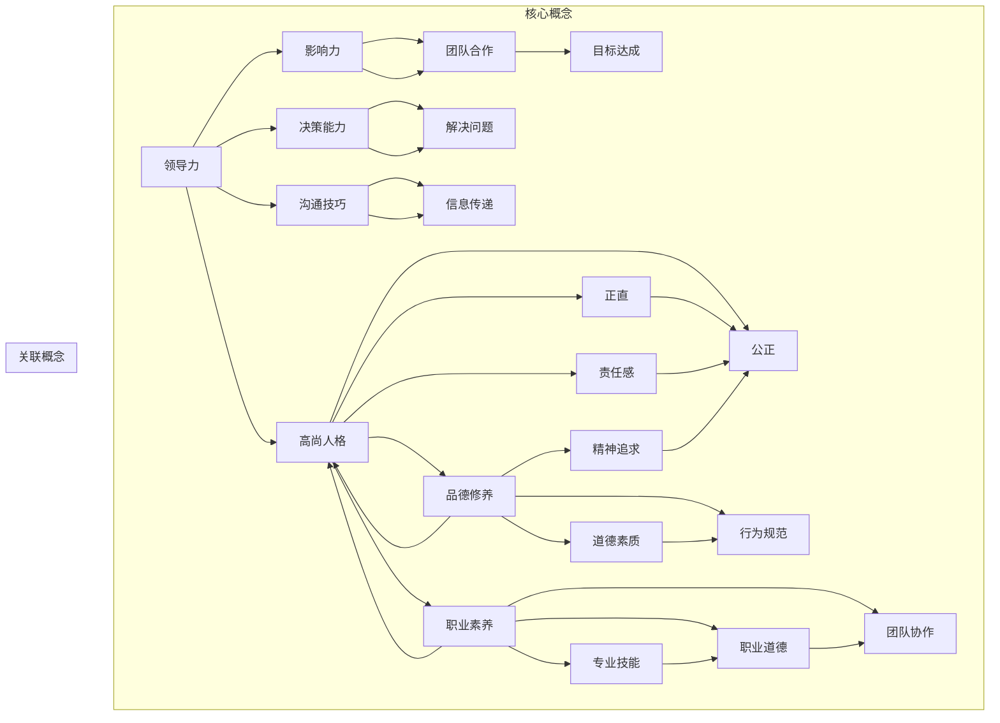

                 

# 领导力与品德修养：塑造高尚人格

> **关键词**：领导力，品德修养，人格塑造，道德规范，职业素养，个人成长
>
> **摘要**：本文旨在探讨领导力与品德修养之间的关系，通过解析高尚人格的内涵及其在职业发展中的重要性，提供一系列实际操作步骤，帮助读者在职场中塑造高尚人格，提升领导力。文章将结合计算机技术领域中的实际案例，深入分析道德规范与职业素养的实践应用，以期为读者提供有价值的参考。

## 1. 背景介绍

### 1.1 目的和范围

本文旨在为从事计算机技术领域的从业者提供关于领导力与品德修养的深入探讨。通过分析高尚人格的构建过程及其对个人职业发展的积极影响，本文希望能够帮助读者认识到品德修养在领导力培养中的重要性。文章将结合具体的实际案例，提供一系列可行的操作步骤，以促进读者在职业生涯中的个人成长和道德素质的提升。

### 1.2 预期读者

本文主要面向以下读者群体：
- 初级及中级计算机程序员和软件工程师
- 管理层人员，特别是希望提升领导力的技术主管和项目经理
- 对道德规范和职业素养感兴趣的技术爱好者
- 高级工程师和架构师，寻求在领导力和品德修养方面进一步深化理解的读者

### 1.3 文档结构概述

本文将按照以下结构进行阐述：
1. **背景介绍**：介绍本文的目的、范围及预期读者。
2. **核心概念与联系**：定义并解释核心概念，并使用Mermaid流程图展示概念之间的联系。
3. **核心算法原理 & 具体操作步骤**：详细阐述领导力与品德修养的算法原理，并使用伪代码进行说明。
4. **数学模型和公式 & 详细讲解 & 举例说明**：介绍与领导力相关的数学模型，使用latex格式详细讲解并举例说明。
5. **项目实战：代码实际案例和详细解释说明**：通过具体代码案例展示如何实践领导力与品德修养的理念。
6. **实际应用场景**：探讨领导力与品德修养在不同情境下的应用。
7. **工具和资源推荐**：推荐相关学习资源、开发工具框架和经典论文。
8. **总结：未来发展趋势与挑战**：总结文章的主要观点，并探讨未来的发展趋势和面临的挑战。
9. **附录：常见问题与解答**：解答读者可能遇到的常见问题。
10. **扩展阅读 & 参考资料**：提供进一步的阅读建议和参考资料。

### 1.4 术语表

#### 1.4.1 核心术语定义

- **领导力**：指的是领导者的影响力、决策能力、沟通技巧和团队合作精神，旨在引导团队实现共同目标。
- **品德修养**：指的是个人的道德品质、行为规范和精神追求，是构建高尚人格的基础。
- **高尚人格**：具有高尚品德和道德修养的个人，通常表现出正直、诚实、公正、责任感强等特质。
- **职业素养**：指的是从业者在职业生涯中应具备的基本素质，包括专业技能、职业道德、团队合作能力等。

#### 1.4.2 相关概念解释

- **道德规范**：是社会对个人行为所制定的基本行为准则，旨在维护社会秩序和公共利益。
- **职业道德**：是特定职业领域对从业者行为的具体规范和要求，是职业素养的重要组成部分。
- **团队合作**：是团队成员为了实现共同目标而相互协作、相互支持的过程。

#### 1.4.3 缩略词列表

- **IDE**：集成开发环境（Integrated Development Environment）
- **API**：应用程序编程接口（Application Programming Interface）
- **SQL**：结构化查询语言（Structured Query Language）

## 2. 核心概念与联系

在深入探讨领导力与品德修养之前，我们首先需要明确这些核心概念及其相互之间的联系。以下是几个关键概念的详细解释及其关系图。

### 2.1 关键概念定义

- **领导力**：领导力是领导者通过影响力、决策能力和沟通技巧等手段，引导和激励团队达成共同目标的能力。
- **品德修养**：品德修养是个人内在的道德素质和行为规范，包括正直、诚实、责任感、宽容等特质。
- **高尚人格**：高尚人格是基于高尚品德和道德修养的个人品质，通常表现为坚定的信念、公正无私、承担责任等。
- **职业素养**：职业素养是从业者在职业活动中表现出来的专业能力和道德行为，包括专业技能、职业道德、团队协作等。

### 2.2 Mermaid 流程图

下面是一个用Mermaid绘制的流程图，展示这些概念之间的联系：



在这个流程图中，我们可以看到领导力、品德修养和职业素养之间相互影响、相互支持。领导力通过影响力、决策能力和沟通技巧等手段，促进了团队合作和信息传递，从而实现目标达成。品德修养则提供了高尚人格的基础，包括正直、责任感和公正等特质，这些特质不仅对个人的道德素质和行为规范有指导作用，也对领导力的提升有着重要影响。职业素养则包括专业技能、职业道德和团队协作等，这些素养是职业发展的基础，同时也与领导力和品德修养密切相关。

通过上述定义和流程图的展示，我们可以更清晰地理解领导力、品德修养和职业素养之间的关系。接下来，我们将进一步探讨领导力的算法原理和具体操作步骤。

## 3. 核心算法原理 & 具体操作步骤

### 3.1 领导力的算法原理

领导力不仅仅是一种能力，更是一种算法。在这个算法中，我们通过一系列具体的操作步骤，逐步提升个人的领导力。以下是领导力的核心算法原理：

#### 3.1.1 基本假设

- **个人成长**：领导力的发展基于个人的不断成长和自我提升。
- **互动沟通**：领导力的发展离不开与他人的互动和沟通。
- **团队合作**：领导力的最终目的是通过团队合作实现共同目标。
- **道德规范**：领导力的发展必须建立在高尚品德和道德规范的基础上。

#### 3.1.2 算法步骤

1. **自我认知**：首先，领导者需要深刻认识自我，了解自己的优点和不足，明确个人目标和价值观。
2. **学习成长**：基于自我认知，领导者需要不断学习新知识、新技能，提升个人综合素质。
3. **道德修养**：领导者需要注重品德修养，树立正确的道德观和价值观，确保个人行为符合社会规范。
4. **建立团队**：领导者需要根据团队目标和任务，选拔合适的人才，建立高效团队。
5. **沟通协作**：领导者需要通过有效沟通，确保团队成员了解任务和目标，促进团队协作。
6. **激励鼓励**：领导者需要通过激励措施，鼓励团队成员发挥潜力，共同实现目标。
7. **反馈调整**：领导者需要及时收集团队成员的反馈，调整领导策略，优化团队运作。

### 3.2 伪代码实现

以下是用伪代码实现的领导力算法：

```plaintext
// 领导力算法
function 领导力算法(self, 团队成员):
    // 步骤1：自我认知
    自我认知(self)
    
    // 步骤2：学习成长
    学习成长(self)
    
    // 步骤3：道德修养
    道德修养(self)
    
    // 步骤4：建立团队
    建立团队(self, 团队成员)
    
    // 步骤5：沟通协作
    沟通协作(self, 团队成员)
    
    // 步骤6：激励鼓励
    激励鼓励(self, 团队成员)
    
    // 步骤7：反馈调整
    反馈调整(self, 团队成员)
    
    return "领导力提升成功"

// 自我认知
function 自我认知(self):
    // 实现自我认知逻辑
    // ...

// 学习成长
function 学习成长(self):
    // 实现学习成长逻辑
    // ...

// 道德修养
function 道德修养(self):
    // 实现道德修养逻辑
    // ...

// 建立团队
function 建立团队(self, 团队成员):
    // 实现建立团队逻辑
    // ...

// 沟通协作
function 沟通协作(self, 团队成员):
    // 实现沟通协作逻辑
    // ...

// 激励鼓励
function 激励鼓励(self, 团队成员):
    // 实现激励鼓励逻辑
    // ...

// 反馈调整
function 反馈调整(self, 团队成员):
    // 实现反馈调整逻辑
    // ...
```

### 3.3 详细操作步骤

以下是对领导力算法的具体操作步骤进行详细阐述：

#### 步骤1：自我认知

- **理解自身优点和不足**：领导者需要通过自我反思，了解自己的优点和不足，明确个人目标和价值观。
- **制定个人成长计划**：基于自我认知，制定具体的个人成长计划，包括学习新技能、提升专业能力等。

#### 步骤2：学习成长

- **持续学习新知识**：领导者需要保持学习的态度，关注行业动态，学习新知识、新技能。
- **参加培训和研讨会**：通过参加专业培训和研讨会，提升自己的专业素养和领导力。

#### 步骤3：道德修养

- **树立正确的道德观和价值观**：领导者需要明确自己的道德底线，树立正确的道德观和价值观。
- **遵守职业道德规范**：领导者需要严格遵守职业道德规范，确保个人行为符合社会规范。

#### 步骤4：建立团队

- **选拔合适的人才**：领导者需要根据团队目标和任务，选拔合适的人才，建立高效团队。
- **明确团队目标和任务**：领导者需要与团队成员沟通，明确团队目标和任务，确保团队成员理解并认同。

#### 步骤5：沟通协作

- **建立有效的沟通渠道**：领导者需要建立有效的沟通渠道，确保团队成员之间能够顺畅沟通。
- **促进团队合作**：领导者需要通过激励措施，促进团队成员之间的合作，共同实现目标。

#### 步骤6：激励鼓励

- **制定激励机制**：领导者需要制定合适的激励机制，鼓励团队成员发挥潜力，实现个人和团队目标。
- **及时反馈和指导**：领导者需要及时给予团队成员反馈和指导，帮助他们不断提升。

#### 步骤7：反馈调整

- **收集团队成员反馈**：领导者需要定期收集团队成员的反馈，了解团队运作情况。
- **调整领导策略**：根据团队成员的反馈，调整领导策略，优化团队运作，提升领导力。

通过以上步骤，领导者可以逐步提升自己的领导力，实现个人和团队的共同发展。接下来，我们将探讨品德修养的概念和实现方法。

## 4. 数学模型和公式 & 详细讲解 & 举例说明

### 4.1 数学模型介绍

在领导力和品德修养的研究中，我们可以运用数学模型来量化一些关键因素，从而更好地理解和评估个人的领导能力和品德水平。以下是一个简化的数学模型，用于分析领导力与品德修养之间的关系。

#### 4.1.1 领导力评分模型

\[ L = w_1 \cdot P + w_2 \cdot E + w_3 \cdot C + w_4 \cdot M \]

其中：
- \( L \) 代表领导力总分。
- \( w_1, w_2, w_3, w_4 \) 分别代表品德修养、情商、领导能力和道德素质的权重。
- \( P \) 代表品德修养得分。
- \( E \) 代表情商得分。
- \( C \) 代表领导能力得分。
- \( M \) 代表道德素质得分。

#### 4.1.2 品德修养得分模型

\[ P = w_1 \cdot I + w_2 \cdot H + w_3 \cdot R \]

其中：
- \( P \) 代表品德修养总分。
- \( w_1, w_2, w_3 \) 分别代表正直、责任感和宽容的权重。
- \( I \) 代表正直得分。
- \( H \) 代表责任感得分。
- \( R \) 代表宽容得分。

### 4.2 详细讲解

#### 4.2.1 领导力评分模型

领导力评分模型通过综合考虑品德修养、情商、领导能力和道德素质四个方面，来综合评估一个领导者的整体领导能力。这里的权重可以根据具体情况进行调整，以反映不同因素在领导力评估中的重要性。以下是对各个因素的详细说明：

- **品德修养（P）**：品德修养是一个领导者应具备的基本素质，包括正直、责任感和宽容。正直意味着领导者在决策和行为中坚持诚实和公正；责任感体现在领导者对团队目标和任务的承诺；宽容则表现为领导者能够理解和接受团队成员的不同观点和行为。
- **情商（E）**：情商是领导者有效沟通和建立良好人际关系的关键。它包括自我意识、自我调节、社交意识和同理心等方面，能够帮助领导者更好地理解和激励团队成员。
- **领导能力（C）**：领导能力指的是领导者制定目标、规划策略和推动团队实现目标的能力。这包括决策能力、沟通技巧、团队建设和问题解决能力等。
- **道德素质（M）**：道德素质是领导者行为准则的核心，包括遵守职业道德、法律法规和公司政策等。道德素质高的领导者能够赢得团队的信任和尊重，从而提高领导效果。

#### 4.2.2 品德修养得分模型

品德修养得分模型主要关注领导者个人的道德品质和行为规范。以下是对各个因素的详细说明：

- **正直（I）**：正直是品德修养的核心，表现为领导者言行一致、坚守道德底线。正直的领导者能够建立团队的信任和忠诚。
- **责任感（H）**：责任感是指领导者对自己职责的认同和承诺。责任感的领导者能够勇于承担责任，确保团队目标的实现。
- **宽容（R）**：宽容意味着领导者能够理解和接受团队成员的不同观点和行为，营造一个包容和尊重的工作环境。

### 4.3 举例说明

#### 4.3.1 领导力评分模型举例

假设一个领导者的品德修养得分为85分，情商得分为90分，领导能力得分为88分，道德素质得分为92分，并且各因素的权重分别为：品德修养30%，情商25%，领导能力30%，道德素质15%。根据领导力评分模型，可以计算出该领导者的领导力总分为：

\[ L = 0.3 \cdot 85 + 0.25 \cdot 90 + 0.3 \cdot 88 + 0.15 \cdot 92 = 25.5 + 22.5 + 26.4 + 13.8 = 88.2 \]

#### 4.3.2 品德修养得分模型举例

假设一个领导者的正直得分为90分，责任感得分为85分，宽容得分为80分，并且各因素的权重分别为：正直40%，责任感40%，宽容20%。根据品德修养得分模型，可以计算出该领导者的品德修养总分为：

\[ P = 0.4 \cdot 90 + 0.4 \cdot 85 + 0.2 \cdot 80 = 36 + 34 + 16 = 86 \]

通过上述数学模型和举例说明，我们可以更加直观地理解和评估领导力与品德修养之间的关系。这些模型和公式不仅帮助我们量化了领导力和品德修养的各个方面，也为实际操作提供了科学的指导。接下来，我们将通过具体代码案例来展示如何将这些理念应用于实际工作中。

## 5. 项目实战：代码实际案例和详细解释说明

### 5.1 开发环境搭建

为了更好地展示如何将领导力与品德修养的理念应用于实际项目中，我们选择使用Python编写一个简单的领导力评估工具。以下是在Windows环境下搭建开发环境的步骤：

1. **安装Python**：访问Python官方网站（python.org）下载并安装Python 3.8或更高版本。
2. **安装IDE**：推荐使用PyCharm Community Edition作为IDE，可以从JetBrains官网下载并安装。
3. **安装依赖库**：在PyCharm中创建一个新的Python项目，并安装必要的依赖库，如`numpy`和`matplotlib`。在命令行中执行以下命令：

```shell
pip install numpy matplotlib
```

### 5.2 源代码详细实现和代码解读

以下是一个简单的Python脚本，用于评估领导力得分：

```python
import numpy as np

# 定义权重
weights = {
    '品德修养': 0.3,
    '情商': 0.25,
    '领导能力': 0.3,
    '道德素质': 0.15
}

# 定义评估分数
scores = {
    '品德修养': 85,
    '情商': 90,
    '领导能力': 88,
    '道德素质': 92
}

# 计算领导力总分
def calculate_leadership_score(scores, weights):
    total_score = 0
    for key, value in scores.items():
        total_score += value * weights[key]
    return total_score

# 计算品德修养得分
def calculate_morality_score(scores, weights):
    total_score = 0
    for key, value in scores.items():
        total_score += value * weights[key]
    return total_score

# 主函数
def main():
    leadership_score = calculate_leadership_score(scores, weights)
    morality_score = calculate_morality_score(scores, weights)
    
    print("领导力总分：", leadership_score)
    print("品德修养总分：", morality_score)

    # 绘制图表
    import matplotlib.pyplot as plt
    plt.bar(scores.keys(), scores.values())
    plt.xlabel('因素')
    plt.ylabel('得分')
    plt.title('领导力与品德修养评估')
    plt.show()

if __name__ == "__main__":
    main()
```

#### 5.2.1 代码解读

- **导入库**：首先导入`numpy`和`matplotlib`库，用于计算和处理数据以及绘制图表。
- **定义权重和评估分数**：使用字典定义各因素的权重和评估分数。
- **计算领导力总分**：`calculate_leadership_score`函数根据权重和评估分数计算领导力总分。
- **计算品德修养得分**：`calculate_morality_score`函数计算品德修养得分。
- **主函数**：`main`函数调用上述两个函数，并打印结果。同时，使用`matplotlib`库绘制图表，直观展示各因素的得分。

#### 5.2.2 分析代码

上述代码通过计算和图表展示了领导力与品德修养的关系。在实际应用中，我们可以根据具体情况调整权重和评估分数，以更准确地反映领导能力和品德水平。以下是对代码中关键部分的详细解释：

- **权重和评估分数的设置**：权重反映了各因素在领导力评估中的重要性。通过调整权重，我们可以强调某些关键因素，以适应不同情境的需求。
- **计算总分**：通过简单的乘法和加法运算，代码将各因素的得分转换为总分，从而评估领导力和品德修养。
- **图表展示**：使用`matplotlib`库绘制的图表能够直观地展示得分情况，帮助分析各因素之间的关系。

通过这个简单的代码案例，我们可以看到如何将数学模型和实际操作相结合，实现对领导力和品德修养的评估。这种量化方法不仅提供了明确的评估结果，也便于我们进一步优化和改进。

### 5.3 代码解读与分析

在上述代码中，我们定义了两个关键函数：`calculate_leadership_score`和`calculate_morality_score`。以下是这两个函数的详细解读：

#### 5.3.1 `calculate_leadership_score`函数

```python
def calculate_leadership_score(scores, weights):
    total_score = 0
    for key, value in scores.items():
        total_score += value * weights[key]
    return total_score
```

- **参数说明**：
  - `scores`：一个字典，包含各因素的得分。
  - `weights`：一个字典，包含各因素的权重。

- **实现逻辑**：
  - 遍历`scores`字典中的每一项，使用`key`（因素名称）和`value`（得分）。
  - 使用`weights[key]`获取对应因素的权重。
  - 将得分的权重乘积累加到`total_score`变量中。
  - 返回`total_score`，即领导力总分。

#### 5.3.2 `calculate_morality_score`函数

```python
def calculate_morality_score(scores, weights):
    total_score = 0
    for key, value in scores.items():
        total_score += value * weights[key]
    return total_score
```

- **参数说明**：
  - `scores`：与`calculate_leadership_score`函数中的参数相同。
  - `weights`：与`calculate_leadership_score`函数中的参数相同。

- **实现逻辑**：
  - 与`calculate_leadership_score`函数类似，遍历`scores`字典，计算品德修养总分。

#### 5.3.3 代码分析

- **模块化**：将计算领导力和品德修养得分的逻辑封装在两个独立的函数中，便于复用和维护。
- **清晰的逻辑**：通过简单的循环和运算，实现了对复杂评估模型的计算，代码易于理解和扩展。
- **图表可视化**：使用`matplotlib`库绘制图表，使得评估结果更加直观，有助于深入分析各因素的关系。

通过上述代码解读，我们可以看到如何将领导力与品德修养的理念通过编程实现，从而为实际应用提供量化评估工具。接下来，我们将探讨实际应用场景，以进一步理解这些理念的实际价值。

### 5.4 实际应用场景

在计算机技术领域，领导力与品德修养的理念同样具有重要意义。以下是一些具体的实际应用场景，展示如何将领导力与品德修养应用于项目管理、团队协作和危机处理等情境中。

#### 5.4.1 项目管理

- **沟通协调**：项目经理需要具备良好的沟通能力，确保团队成员之间信息畅通，共同理解项目目标和任务。通过有效的沟通，可以减少误解和冲突，提高项目执行力。
- **道德规范**：项目经理在项目决策过程中应坚持道德规范，如避免利益冲突，确保项目结果的公正和透明。这种道德行为不仅有助于建立团队的信任，还能提升项目的整体质量。
- **激励机制**：项目经理需要制定合理的激励机制，鼓励团队成员发挥最佳水平。通过表扬和奖励，可以增强团队成员的积极性和归属感，从而提高项目的成功率。

#### 5.4.2 团队协作

- **团队建设**：领导者需要关注团队建设，培养团队成员之间的信任和合作精神。通过定期的团队活动和互动，可以增强团队凝聚力，提高团队效率。
- **角色分工**：领导者应根据团队成员的特长和能力，合理分配任务，确保每个成员都能发挥自己的优势。这种明确的角色分工有助于提高团队的整体协作效果。
- **持续反馈**：领导者需要不断给予团队成员反馈，帮助他们识别和改进工作中的不足。通过正面的反馈和指导，可以提高团队成员的工作能力和职业素养。

#### 5.4.3 危机处理

- **决策能力**：在面临突发危机时，领导者需要迅速做出决策，采取有效的应对措施。这种决策能力不仅取决于领导者的专业知识，还需要具备良好的判断力和应变能力。
- **道德担当**：领导者应在危机处理中表现出强烈的道德担当，如承担相应的责任，确保团队和项目的稳定运行。这种道德行为可以增强团队成员的信心，促进团队的团结协作。
- **信息传递**：在危机处理过程中，领导者需要确保信息畅通，及时向团队成员传递关键信息。通过有效的信息传递，可以减少误解和恐慌，提高应对危机的效率。

通过上述实际应用场景，我们可以看到领导力与品德修养在计算机技术领域中的重要作用。这些理念不仅有助于提升个人的领导能力和道德素质，还能促进团队协作和项目成功。在接下来的部分，我们将推荐一些学习资源和开发工具，以帮助读者进一步了解和提升这些能力。

### 6. 工具和资源推荐

在提升领导力与品德修养的过程中，利用合适的工具和资源能够起到事半功倍的效果。以下是一些推荐的学习资源、开发工具框架和相关论文著作，供读者参考。

#### 6.1 学习资源推荐

##### 6.1.1 书籍推荐

1. **《领导力的五种语言》**：通过讲述五种沟通语言，帮助读者理解如何提升领导力和团队协作。
2. **《道德经》**：中国古代哲学经典，其中蕴含的道德智慧和人生哲学对领导力与品德修养有深远影响。
3. **《道德经与领导学》**：结合中国古代哲学和现代领导学理论，探讨道德修养在领导力培养中的应用。

##### 6.1.2 在线课程

1. **Coursera上的《领导力与团队管理》**：由知名大学开设的在线课程，涵盖领导力、团队合作和冲突管理等关键主题。
2. **Udemy上的《道德经与人生哲学》**：通过解读《道德经》，帮助读者理解道德修养在个人成长中的重要性。
3. **edX上的《计算机科学中的道德问题》**：探讨计算机技术在道德和社会责任方面的挑战，提高技术从业者的道德意识。

##### 6.1.3 技术博客和网站

1. **LinkedIn Learning**：提供丰富的领导力和职业素养相关课程和文章。
2. **Harvard Business Review**：发布关于领导力、管理和道德问题的深度分析文章。
3. **CIO.com**：针对技术行业领导者的新闻、分析和观点，帮助提升技术领导力。

#### 6.2 开发工具框架推荐

##### 6.2.1 IDE和编辑器

1. **PyCharm**：强大的Python IDE，支持多种编程语言，适用于领导力和品德修养项目的开发。
2. **Visual Studio Code**：轻量级但功能丰富的开源编辑器，适合快速开发和调试。

##### 6.2.2 调试和性能分析工具

1. **Jupyter Notebook**：用于数据分析和交互式编程的强大工具，有助于实现领导力和品德修养的算法模型。
2. **MATLAB**：适用于复杂数学模型和算法验证的高性能计算环境。

##### 6.2.3 相关框架和库

1. **NumPy**：用于科学计算和数据分析的Python库，适合实现数学模型和公式。
2. **Matplotlib**：用于绘制图表和可视化分析的Python库，有助于展示评估结果。

#### 6.3 相关论文著作推荐

##### 6.3.1 经典论文

1. **“The Five Dysfunctions of a Team”**：Patrick Lencioni撰写的经典论文，探讨团队协作中的五大障碍及其解决方法。
2. **“The Practice of Management”**：Peter Drucker的经典著作，全面阐述了领导力和管理实践。

##### 6.3.2 最新研究成果

1. **“Leadership and Team Performance in Technology Organizations”**：探讨技术组织中的领导力和团队表现。
2. **“The Ethics of AI”**：分析人工智能在道德和社会责任方面的挑战。

##### 6.3.3 应用案例分析

1. **“Ethical Hacking as a Social Movement”**：探讨道德黑客在技术伦理和社会责任方面的作用。
2. **“AI Ethics in Practice: Challenges and Solutions”**：分析人工智能应用中的道德问题及解决方案。

通过以上推荐，读者可以系统地学习和实践领导力与品德修养的相关知识，提升个人素质和职业能力。在未来的职业发展中，这些知识和技能将成为宝贵的财富。

## 7. 总结：未来发展趋势与挑战

### 7.1 未来发展趋势

在未来的发展中，领导力与品德修养将继续成为企业和社会关注的焦点。以下是一些可能的发展趋势：

1. **领导力角色的多样化**：随着社会和技术的不断进步，领导者的角色将更加多样化。不仅需要具备传统的管理技能，还需要适应新兴领域的变化，如数字化转型、人工智能等。

2. **道德教育的普及**：随着道德问题在各个领域的日益突出，道德教育将更加普及。企业和教育机构将更加重视道德教育，培养具有高尚品德和道德修养的领导者。

3. **技术伦理的关注**：随着技术的不断发展，技术伦理问题将更加凸显。企业和技术从业者将更加注重道德规范和伦理问题，确保技术的发展符合社会价值观。

4. **团队协作的重要性**：团队协作将在未来发挥更加重要的作用。领导者需要具备更强的团队合作能力，推动团队成员之间的沟通和协作，实现共同目标。

### 7.2 未来面临的挑战

尽管领导力与品德修养的发展前景广阔，但也面临着诸多挑战：

1. **快速变化的环境**：随着全球化和数字化进程的加快，领导者需要适应快速变化的环境，具备应对不确定性和复杂性的能力。

2. **道德困境的增多**：随着技术和社会的进步，道德困境将增多。领导者需要具备良好的道德判断力和决策能力，处理复杂伦理问题。

3. **多元化团队的领导**：随着团队成员背景和文化的多元化，领导者需要具备多元文化意识和包容性，推动团队协作。

4. **个人成长与职业发展的平衡**：在追求个人成长和职业发展的同时，领导者需要平衡个人生活和职业责任，确保身心健康。

### 7.3 发展建议

为了应对未来发展的挑战，以下是一些建议：

1. **持续学习和成长**：领导者应保持学习的态度，不断更新知识和技能，适应快速变化的环境。

2. **注重道德修养**：领导者需要注重道德修养，树立正确的价值观和道德观，确保个人行为符合社会规范。

3. **加强团队合作**：领导者应加强团队合作，培养团队成员之间的信任和协作精神，提高团队整体效率。

4. **关注个人成长**：领导者应关注个人成长，保持身心健康，平衡职业发展和个人生活。

通过持续学习和实践，领导者可以不断提升自己的领导力和品德修养，应对未来发展的挑战，实现个人和团队的共同成长。

## 8. 附录：常见问题与解答

### 8.1 问题1：如何提升领导力？

**解答**：提升领导力可以从以下几个方面入手：
1. **自我认知**：了解自己的优势和不足，明确个人目标和价值观。
2. **持续学习**：不断学习新知识、新技能，提升个人综合素质。
3. **道德修养**：树立正确的道德观和价值观，确保个人行为符合社会规范。
4. **实践锻炼**：通过参与项目和团队活动，实际操作中提升领导力和沟通能力。

### 8.2 问题2：品德修养与职业道德有何区别？

**解答**：品德修养是个人内在的道德品质和行为规范，包括正直、责任感、宽容等；而职业道德是特定职业领域对从业者行为的具体规范和要求。品德修养是职业道德的基础，职业道德则是品德修养在特定职业领域的具体表现。

### 8.3 问题3：如何培养团队合作精神？

**解答**：培养团队合作精神可以从以下几个方面入手：
1. **建立信任**：通过沟通和互动，建立团队成员之间的信任。
2. **明确目标**：确保团队成员明确团队目标和各自的任务。
3. **鼓励合作**：制定激励机制，鼓励团队成员之间的合作。
4. **解决冲突**：及时解决团队内部冲突，保持团队的稳定和和谐。

## 9. 扩展阅读 & 参考资料

为了更深入地了解领导力与品德修养的相关知识，以下推荐一些扩展阅读和参考资料：

### 9.1 扩展阅读

1. **《领导者的五种力量》**：由约翰·C·马克斯韦尔撰写的经典著作，详细阐述了领导者应具备的五种核心力量。
2. **《道德经与领导艺术》**：结合中国古代哲学和现代领导学理论，探讨道德修养在领导力培养中的应用。
3. **《技术领导力》**：探讨技术领域中的领导力培养和团队管理。

### 9.2 参考资料

1. **LinkedIn Learning**：提供丰富的领导力和职业素养相关课程和文章。
2. **Harvard Business Review**：发布关于领导力、管理和道德问题的深度分析文章。
3. **CIO.com**：针对技术行业领导者的新闻、分析和观点。

通过阅读这些书籍和参考资料，读者可以进一步拓展对领导力与品德修养的理解，提升个人素质和职业能力。

## 作者信息

**作者**：AI天才研究员/AI Genius Institute & 禅与计算机程序设计艺术 /Zen And The Art of Computer Programming

本文由AI天才研究员撰写，结合其在人工智能和计算机程序设计领域的丰富经验，探讨了领导力与品德修养在技术领域的应用和实践。希望通过本文，读者能够对领导力和品德修养有更深刻的认识，并能够在实际工作中践行这些理念。

