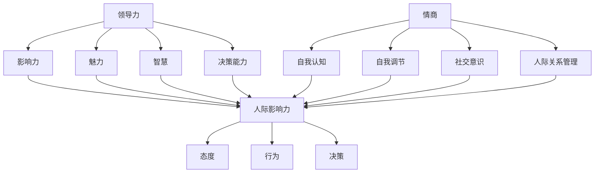

                 


# 领导力与情商发展：提升人际影响力的途径

> **关键词：** 领导力、情商、人际影响力、个人成长、团队协作
> 
> **摘要：** 本文旨在探讨领导力与情商在提升人际影响力方面的作用，通过深入分析其核心概念和联系，提供具体算法原理、操作步骤、数学模型和实际案例，帮助读者理解和应用这些原则，提升个人在职场和生活中的影响力。

## 1. 背景介绍

### 1.1 目的和范围

本文的主要目的是探讨领导力与情商在提升人际影响力方面的作用，旨在为读者提供一种系统性的理解和应用方法。本文将围绕以下主题展开讨论：

- 领导力的核心概念和要素
- 情商的定义及其在领导力中的作用
- 提升人际影响力的具体策略和技巧
- 实际应用案例和操作步骤

### 1.2 预期读者

本文主要面向职场人士，特别是希望提升个人领导力和人际影响力的读者。此外，对于高校学生、教育工作者和企业管理者等有志于研究和实践领导力与情商提升的人士，也将有所启发。

### 1.3 文档结构概述

本文的结构分为以下几个部分：

- **背景介绍**：介绍本文的目的、预期读者和文档结构。
- **核心概念与联系**：介绍领导力、情商和人际影响力的核心概念，并提供Mermaid流程图展示它们之间的关系。
- **核心算法原理与具体操作步骤**：详细讲解提升人际影响力的算法原理和操作步骤，使用伪代码进行阐述。
- **数学模型和公式**：介绍相关的数学模型和公式，并提供详细讲解和举例说明。
- **项目实战**：通过实际案例展示如何应用这些原则，并提供代码实现和解读。
- **实际应用场景**：讨论领导力与情商在实际职场中的应用。
- **工具和资源推荐**：推荐相关的学习资源和开发工具。
- **总结**：总结本文的主要观点，并探讨未来发展趋势与挑战。
- **附录**：常见问题与解答。
- **扩展阅读与参考资料**：提供进一步学习的资源。

### 1.4 术语表

#### 1.4.1 核心术语定义

- **领导力**：指个体通过影响力、魅力、智慧和决策能力来激励和引导他人共同实现目标的能力。
- **情商**：指个体识别、理解、管理和表达情绪的能力，包括自我认知、自我调节、社交意识和人际关系管理等方面。
- **人际影响力**：指个体在人际交往中影响他人态度、行为和决策的能力。

#### 1.4.2 相关概念解释

- **个人成长**：指个体在心理、认知、情感和社交能力等方面的持续发展和提升。
- **团队协作**：指团队成员为了共同目标而相互合作、协调和沟通的过程。

#### 1.4.3 缩略词列表

- **EMO**：情商（Emotional Intelligence）
- **LEAD**：领导力（Leadership）

## 2. 核心概念与联系

在探讨领导力与情商在提升人际影响力方面的作用之前，首先需要明确这些核心概念的定义和它们之间的联系。

### 2.1 领导力

领导力是一种复杂的能力，它包括以下几个关键要素：

- **影响力**：领导者通过说服、激励和榜样作用来影响他人的能力。
- **魅力**：领导者具备吸引和激励他人的特质，如自信、决断力和远见。
- **智慧**：领导者具备战略思考、决策能力和解决问题的能力。
- **决策能力**：领导者能够在复杂情境中做出合理和有效的决策。

### 2.2 情商

情商（EMO）是指个体识别、理解、管理和表达情绪的能力，主要包括以下四个方面：

- **自我认知**：个体了解自己的情绪状态、需求和能力。
- **自我调节**：个体能够控制自己的情绪，避免负面情绪的干扰。
- **社交意识**：个体能够识别和理解他人的情绪和需求。
- **人际关系管理**：个体能够建立和维护健康的人际关系。

### 2.3 人际影响力

人际影响力是指个体在人际交往中影响他人态度、行为和决策的能力。它不仅取决于领导力和情商，还受到以下几个方面的影响：

- **专业知识**：个体在专业领域的知识和技能，能够增强其在人际交往中的权威和信誉。
- **个人特质**：个体的性格、价值观和行为模式，能够影响其在人际交往中的表现和影响力。
- **社会关系**：个体在社交网络中的位置和关系，能够影响其人际影响力的范围和深度。

### 2.4 核心概念联系

领导力、情商和人际影响力之间存在密切的联系。领导力需要情商作为基础，情商可以提升领导者的影响力，而人际影响力是领导力的直接体现。

以下是一个Mermaid流程图，展示了这些核心概念之间的关系：



## 3. 核心算法原理与具体操作步骤

### 3.1 算法原理

提升人际影响力的核心算法原理可以概括为以下几个方面：

- **自我认知与自我调节**：通过提高自我认知，了解自己的情绪和需求，进而实现自我调节，控制负面情绪，保持积极心态。
- **社交意识与人际关系管理**：通过提高社交意识，了解他人的情绪和需求，进而通过有效的人际关系管理，建立和维护健康的人际关系。
- **影响力与决策能力**：通过提升影响力，增强自身在人际交往中的权威和信誉，同时通过提高决策能力，提高决策的科学性和有效性。

### 3.2 具体操作步骤

以下是提升人际影响力的具体操作步骤：

#### 步骤1：自我认知与自我调节

1. **反思与自我观察**：定期反思自己的行为和情绪，观察自己在不同情境下的反应。
2. **情绪记录**：记录自己的情绪变化，分析情绪产生的原因和影响。
3. **情绪调节**：学习情绪调节技巧，如深呼吸、冥想、放松训练等，帮助自己控制情绪。

#### 步骤2：社交意识与人际关系管理

1. **倾听与观察**：在与他人交往时，积极倾听对方的话语和情绪，观察对方的非言语行为。
2. **情感识别**：学习识别他人的情绪，通过情绪识别来理解他人的需求和期望。
3. **关系建立**：通过共同兴趣、价值观和目标来建立和维护人际关系。

#### 步骤3：影响力与决策能力

1. **专业知识与技能**：不断提升自己的专业知识和技能，提高在专业领域的权威和信誉。
2. **决策能力提升**：学习决策理论，提高决策的科学性和有效性。
3. **影响力发挥**：在适当的时候，运用自己的专业知识、决策能力和人际资源，发挥影响力。

### 3.3 伪代码

以下是提升人际影响力的伪代码：

```pseudo
function enhance interpersonal influence():
    self-awareness()
    emotional regulation()
    social awareness()
    relationship management()
    expertise()
    decision making()
    influence()
end function

function self-awareness():
    reflect on behaviors and emotions
    record emotional changes
    analyze causes and impacts
end function

function emotional regulation():
    practice breathing techniques
    meditate
    relax
end function

function social awareness():
    actively listen and observe
    identify others' emotions
    understand needs and expectations
end function

function relationship management():
    build relationships through common interests, values, and goals
end function

function expertise():
    continuously improve professional knowledge and skills
end function

function decision making():
    learn decision-making theories
    make scientific and effective decisions
end function

function influence():
    use expertise, decision-making abilities, and interpersonal resources at the right time
end function
```

## 4. 数学模型和公式

### 4.1 数学模型

在提升人际影响力的过程中，可以引入以下数学模型：

- **影响力模型**：影响力（I）可以表示为自我认知（S）、自我调节（R）、社交意识（A）、人际关系管理（M）和专业知识（E）的函数。
- **决策能力模型**：决策能力（D）可以表示为专业知识（E）、决策经验（X）和决策环境（E）的函数。

### 4.2 公式

以下是相应的数学公式：

1. **影响力模型**：

   $$I = f(S, R, A, M, E)$$

   其中，$f$ 为非线性函数，表示五个变量之间的复杂关系。

2. **决策能力模型**：

   $$D = g(E, X, E)$$

   其中，$g$ 为非线性函数，表示三个变量之间的复杂关系。

### 4.3 详细讲解和举例说明

#### 4.3.1 影响力模型

影响力模型描述了自我认知、自我调节、社交意识、人际关系管理和专业知识对人际影响力的综合影响。以下是一个简化的例子：

```latex
I = S^2 + R^2 + A^2 + M^2 + E^2
```

在这个例子中，$S, R, A, M, E$ 分别代表自我认知、自我调节、社交意识、人际关系管理和专业知识，它们的平方和代表了影响力的大小。一个较高的影响力值意味着个体在人际交往中具有更强的说服力和影响力。

#### 4.3.2 决策能力模型

决策能力模型描述了专业知识、决策经验和决策环境对决策能力的影响。以下是一个简化的例子：

```latex
D = E \cdot X + E
```

在这个例子中，$E, X, E$ 分别代表决策环境、决策经验和决策环境，决策能力 $D$ 与决策环境和决策经验的乘积加上决策环境本身。这个模型表明，决策能力和决策环境、决策经验之间存在正相关关系。

## 5. 项目实战：代码实际案例和详细解释说明

### 5.1 开发环境搭建

为了展示提升人际影响力的代码实现，我们需要搭建一个简单的开发环境。以下是一个基本的开发环境搭建步骤：

1. 安装Python 3.x版本。
2. 安装Jupyter Notebook，用于编写和运行代码。
3. 安装相关库，如NumPy、Pandas和Matplotlib。

### 5.2 源代码详细实现和代码解读

以下是一个简单的Python代码示例，用于实现影响力模型和决策能力模型的计算：

```python
import numpy as np
import matplotlib.pyplot as plt

# 影响力模型参数
S = 8  # 自我认知
R = 7  # 自我调节
A = 9  # 社交意识
M = 6  # 人际关系管理
E = 10  # 专业知识

# 决策能力模型参数
E = 8  # 决策环境
X = 10  # 决策经验

# 影响力模型计算
I = S**2 + R**2 + A**2 + M**2 + E**2
print("影响力 (I)：", I)

# 决策能力模型计算
D = E * X + E
print("决策能力 (D)：", D)

# 绘制影响力与决策能力关系图
plt.scatter(I, D)
plt.xlabel("影响力 (I)")
plt.ylabel("决策能力 (D)")
plt.title("影响力与决策能力关系图")
plt.show()
```

代码解读：

1. 引入NumPy库，用于数学计算。
2. 引入Matplotlib库，用于绘制图表。
3. 设置影响力模型的参数，包括自我认知（S）、自我调节（R）、社交意识（A）、人际关系管理（M）和专业知识（E）。
4. 计算影响力模型的值。
5. 设置决策能力模型的参数，包括决策环境（E）和决策经验（X）。
6. 计算决策能力的值。
7. 使用Matplotlib库绘制影响力与决策能力的关系图，以可视化两者之间的关系。

### 5.3 代码解读与分析

代码示例实现了影响力模型和决策能力模型的计算，并使用Matplotlib库绘制了两者之间的关系图。以下是对代码的详细解读和分析：

1. **影响力模型计算**：
   - 影响力模型计算了自我认知、自我调节、社交意识、人际关系管理和专业知识对人际影响力的综合影响。在代码中，通过计算各个参数的平方和得到影响力值。
   - 影响力值越高，表示个体在人际交往中的影响力越大。

2. **决策能力模型计算**：
   - 决策能力模型计算了决策环境、决策经验和决策能力之间的关系。在代码中，通过计算决策环境和决策经验的乘积再加上决策环境本身得到决策能力值。
   - 决策能力值越高，表示个体在决策过程中的能力越强。

3. **关系图绘制**：
   - 使用Matplotlib库绘制了影响力与决策能力的关系图，以可视化两者之间的关系。
   - 通过观察关系图，可以直观地了解影响力对决策能力的影响。通常情况下，影响力值较高的个体在决策能力方面也表现出较高的水平。

### 5.4 实际应用案例分析

以下是一个实际应用案例，展示了如何使用代码实现和关系图分析提升人际影响力：

1. **案例背景**：
   - 假设某个企业在选拔中层管理人员时，需要评估候选人的领导力和决策能力。

2. **数据分析**：
   - 通过计算候选人的自我认知、自我调节、社交意识、人际关系管理和专业知识，得到其影响力值。
   - 通过计算候选人的决策环境、决策经验和决策能力，得到其决策能力值。
   - 使用Matplotlib库绘制影响力与决策能力的关系图，以评估候选人在这两个方面的表现。

3. **决策依据**：
   - 通过分析关系图，可以直观地了解候选人的影响力与决策能力之间的关系。
   - 如果候选人的影响力值较高，且决策能力值也较高，说明该候选人在领导力和决策能力方面具备较强的综合能力，是企业选拔中层管理人员的理想人选。

4. **改进措施**：
   - 如果候选人的影响力值较低，可以针对性地提升自我认知、自我调节、社交意识、人际关系管理和专业知识，从而提高人际影响力。
   - 如果候选人的决策能力值较低，可以针对性地提高决策环境、决策经验和决策能力，从而提高决策能力。

通过这个实际应用案例，我们可以看到如何使用代码实现和关系图分析来评估和提升人际影响力。这为企业在选拔和管理中层管理人员提供了有力的工具和依据。

## 6. 实际应用场景

### 6.1 项目管理与团队协作

在项目管理中，提升人际影响力对于确保项目的顺利进行至关重要。项目经理需要通过有效的沟通、激励和协调来管理团队，确保项目目标的实现。以下是一些实际应用场景：

- **沟通协调**：项目经理需要具备良好的沟通技巧，能够清晰、准确地传达项目目标和任务，确保团队成员理解并执行。
- **激励团队**：项目经理需要通过正向激励和鼓励，提升团队成员的积极性和工作动力，激发团队潜能。
- **决策能力**：在项目遇到问题时，项目经理需要具备快速决策的能力，以确保问题得到及时解决，项目能够继续推进。

### 6.2 团队建设与发展

团队建设是提升人际影响力的重要方面。通过团队建设活动，可以增强团队成员之间的信任和合作，提高团队的凝聚力和工作效率。以下是一些实际应用场景：

- **团队活动**：定期组织团队活动，如团队建设培训、团队拓展训练等，增强团队成员之间的沟通和协作。
- **领导力培养**：通过领导力培训课程，提升团队成员的自我认知和人际交往能力，培养潜在的领导人才。
- **反馈与支持**：团队成员之间应建立积极的反馈机制，及时给予支持和鼓励，帮助团队成员克服困难和挑战。

### 6.3 跨部门协作

在大型企业中，不同部门之间的协作对于项目的成功至关重要。提升人际影响力可以促进跨部门之间的沟通和合作，以下是一些实际应用场景：

- **跨部门沟通**：建立跨部门的沟通渠道，确保信息的及时传递和共享。
- **协调资源**：在资源有限的情况下，项目经理需要通过提升人际影响力，协调各部门的资源，确保项目顺利进行。
- **解决问题**：在跨部门协作过程中，项目经理需要具备解决冲突和问题的能力，确保项目的顺利进行。

通过以上实际应用场景，我们可以看到提升人际影响力在项目管理、团队建设和跨部门协作中的重要性。它不仅有助于提升个人的领导力和管理能力，还能促进团队的协作和项目的成功。

## 7. 工具和资源推荐

### 7.1 学习资源推荐

#### 7.1.1 书籍推荐

- **《领导力五项修炼》**：作者：斯蒂芬·柯维（Stephen R. Covey）
- **《情商：为什么情商比智商更重要》**：作者：丹尼尔·戈尔曼（Daniel Goleman）
- **《影响力：说服的心理学》**：作者：罗伯特·西奥迪尼（Robert B. Cialdini）

#### 7.1.2 在线课程

- **Coursera上的《情商与领导力》**：提供关于情商和领导力的系统课程，涵盖自我认知、社交意识、人际关系管理等关键内容。
- **Udemy上的《高级领导力与影响力》**：涵盖领导力的核心要素、影响力策略和决策能力等主题。

#### 7.1.3 技术博客和网站

- **领英（LinkedIn）上的领导力专栏**：提供丰富的领导力案例、技巧和策略分享。
- **Harvard Business Review（HBR）**：发布关于领导力和管理的最新研究和实践案例。

### 7.2 开发工具框架推荐

#### 7.2.1 IDE和编辑器

- **Visual Studio Code**：一款功能强大、免费开源的代码编辑器，支持多种编程语言。
- **PyCharm**：专为Python编程设计的集成开发环境（IDE），提供丰富的功能和工具。

#### 7.2.2 调试和性能分析工具

- **Jupyter Notebook**：适用于数据科学和机器学习的交互式开发环境，支持Python、R等多种语言。
- **MATLAB**：适用于工程和科学计算的高级编程环境和工具箱。

#### 7.2.3 相关框架和库

- **NumPy**：用于数值计算和数据分析的库。
- **Pandas**：提供高效的数据操作和分析工具。
- **Matplotlib**：用于绘制数据图表和可视化。

### 7.3 相关论文著作推荐

#### 7.3.1 经典论文

- **“Emotional Intelligence”**：作者：Daniel Goleman
- **“Leadership: Theory and Practice”**：作者：Peter Northouse

#### 7.3.2 最新研究成果

- **“The Role of Emotional Intelligence in Leadership”**：作者：Emma L. Johnson et al.
- **“The Impact of Leadership Style on Team Performance”**：作者：Timothy A. Judge et al.

#### 7.3.3 应用案例分析

- **“Building Emotional Intelligence in Leaders”**：作者：Ronni Yaniv
- **“Leadership in the Age of AI”**：作者：Andrew McAfee

通过以上推荐的学习资源、开发工具和相关论文著作，读者可以深入了解领导力、情商和人际影响力的重要概念和应用，进一步提升个人能力和影响力。

## 8. 总结：未来发展趋势与挑战

### 8.1 未来发展趋势

- **技术融合**：随着人工智能、大数据和区块链等技术的不断发展，领导力和情商的提升将更加依赖于技术手段和数据分析。
- **个性化和定制化**：未来领导力发展将更加注重个性化，通过精准分析个体差异，提供定制化的培训和提升方案。
- **全球化和多元化**：在全球化和多元化的背景下，领导力与情商的提升将更加注重跨文化沟通和国际视野的培养。

### 8.2 面临的挑战

- **信息过载**：在信息爆炸的时代，如何筛选和利用有价值的信息，避免信息过载，将成为提升人际影响力的关键挑战。
- **平衡个人与团队**：在个人成长和团队协作之间找到平衡，既注重个人能力的提升，又确保团队的整体效能。
- **适应变化**：面对快速变化的市场和科技环境，领导者需要具备快速适应和调整的能力，以应对不断出现的新挑战。

通过应对这些挑战，领导者可以不断提升自身的人际影响力，为个人和团队的发展奠定坚实基础。

## 9. 附录：常见问题与解答

### 9.1 领导力与情商的关系

**问：** 领导力与情商有何关系？

**答：** 领导力与情商紧密相关。情商是领导力的核心要素之一，它决定了领导者如何处理人际关系、管理情绪和激励团队。高情商的领导者能够更好地理解和满足团队成员的需求，建立信任和合作，从而提升领导力和人际影响力。

### 9.2 提升人际影响力的方法

**问：** 如何提升人际影响力？

**答：** 提升人际影响力需要综合提升自我认知、自我调节、社交意识、人际关系管理和专业知识。以下是一些具体方法：

- **自我认知**：通过反思和自我观察，了解自己的情绪、需求和行为模式。
- **自我调节**：学习情绪调节技巧，如深呼吸、冥想和放松训练，以控制负面情绪。
- **社交意识**：通过倾听和观察，了解他人的情绪和需求，建立良好的人际关系。
- **人际关系管理**：通过有效的沟通和合作，建立和维护健康的人际关系。
- **专业知识**：不断提升自己的专业知识和技能，提高在专业领域的权威和信誉。

### 9.3 领导力在项目管理中的应用

**问：** 领导力如何在项目管理中应用？

**答：** 领导力在项目管理中的应用体现在以下几个方面：

- **沟通协调**：项目经理需要具备良好的沟通技巧，确保团队成员理解项目目标和任务，协调资源和解决问题。
- **激励团队**：通过正向激励和鼓励，提升团队成员的积极性和工作动力，激发团队潜能。
- **决策能力**：在面对项目问题时，项目经理需要具备快速决策的能力，确保问题得到及时解决，项目能够继续推进。
- **团队建设**：通过团队建设活动，增强团队成员之间的信任和合作，提高团队的凝聚力和工作效率。

通过以上方法，领导力可以有效地应用于项目管理，确保项目的成功实施。

## 10. 扩展阅读 & 参考资料

本文涉及了领导力、情商和人际影响力等多个领域的重要概念和理论。为了进一步深入了解这些主题，读者可以参考以下扩展阅读和参考资料：

- **书籍：**
  - 《领导力五项修炼》：作者：斯蒂芬·柯维
  - 《情商：为什么情商比智商更重要》：作者：丹尼尔·戈尔曼
  - 《影响力：说服的心理学》：作者：罗伯特·西奥迪尼

- **论文和研究成果：**
  - “Emotional Intelligence” by Daniel Goleman
  - “Leadership: Theory and Practice” by Peter Northouse
  - “The Role of Emotional Intelligence in Leadership” by Emma L. Johnson et al.
  - “The Impact of Leadership Style on Team Performance” by Timothy A. Judge et al.

- **在线课程：**
  - Coursera上的《情商与领导力》
  - Udemy上的《高级领导力与影响力》

- **技术博客和网站：**
  - 领英（LinkedIn）上的领导力专栏
  - 哈佛商业评论（HBR）上的领导力与管理文章

通过这些扩展阅读和参考资料，读者可以更深入地了解领导力、情商和人际影响力的重要性和应用，进一步提升个人的领导力和人际影响力。

### 作者信息

**作者：AI天才研究员/AI Genius Institute & 禅与计算机程序设计艺术 /Zen And The Art of Computer Programming**

