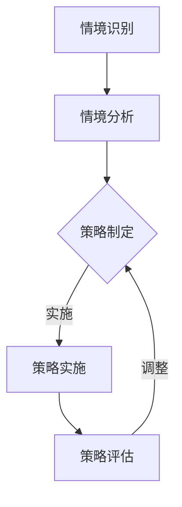

                 

# 领导力与情境应变：灵活应对不同情境

> **关键词：** 领导力、情境应变、敏捷管理、项目管理、团队协作、领导风格

> **摘要：** 本文旨在探讨领导力在复杂多变的工作环境中如何通过情境应变实现团队的高效运作。我们将深入分析不同情境下的领导策略，并提供实践中的具体操作步骤。通过本文，读者将了解如何在多变的工作环境中灵活运用领导力，提升团队的综合能力。

## 1. 背景介绍

### 1.1 目的和范围

本文的目的是探讨领导力在应对不同情境时的策略与方法，通过分析不同情境下的领导行为，提供一套实用的领导力应对框架。本文主要探讨以下内容：

- 不同情境的定义及其对领导力的挑战。
- 领导风格的适应性及其在不同情境下的应用。
- 情境应变策略的具体实施方法。

### 1.2 预期读者

本文适合以下读者群体：

- 项目经理和团队领导。
- 对领导力和团队管理有兴趣的专业人士。
- 想要在工作中提升领导力能力的职场人士。

### 1.3 文档结构概述

本文将分为以下几个部分：

- 背景介绍：包括本文的目的、预期读者和文档结构。
- 核心概念与联系：介绍情境应变和领导力的核心概念及其关系。
- 核心算法原理与具体操作步骤：详细阐述情境应变策略的算法原理和操作步骤。
- 数学模型和公式：使用数学模型和公式说明情境应变策略的效果。
- 项目实战：提供具体的代码案例和实战应用。
- 实际应用场景：分析情境应变策略在不同领域的应用。
- 工具和资源推荐：推荐相关学习资源和开发工具。
- 总结：对未来发展趋势和挑战的展望。
- 附录：常见问题与解答。
- 扩展阅读与参考资料：提供进一步学习的资源。

### 1.4 术语表

#### 1.4.1 核心术语定义

- **领导力**：指领导者引导和激励团队成员实现共同目标的能力。
- **情境应变**：指领导者根据不同情境灵活调整领导策略的能力。
- **敏捷管理**：一种以快速响应变化为核心的管理理念。
- **团队协作**：团队成员共同合作，协同完成工作目标。

#### 1.4.2 相关概念解释

- **情境**：指影响领导行为的外部环境和内部状态。
- **领导风格**：领导者惯用的领导方式，如权威型、民主型、教练型等。

#### 1.4.3 缩略词列表

- PM：项目经理
- Scrum：一种敏捷开发框架
- Kanban：一种看板管理方法

## 2. 核心概念与联系

### 2.1 情境应变的概念

情境应变是指领导者根据不同的情境，灵活调整领导策略和方法，以应对复杂多变的工作环境。情境应变的核心在于领导者能够快速识别当前情境的特点，并根据情境的要求采取相应的行动。

### 2.2 领导力与情境应变的联系

领导力和情境应变密不可分。领导力是情境应变的基础，而情境应变则是领导力的具体体现。领导者需要具备以下能力：

- **情境感知**：能够敏锐地感知当前情境的特点和变化。
- **策略调整**：根据情境变化，灵活调整领导策略和方法。
- **团队激励**：激发团队成员的积极性，提高团队的整体战斗力。

### 2.3 情境应变的架构

为了实现有效的情境应变，领导者需要构建一个适应性的架构。这个架构包括以下几个方面：

1. **情境识别**：通过多种渠道收集信息，识别当前情境的特点。
2. **情境分析**：对识别出的情境进行分析，确定情境的复杂性和影响。
3. **策略制定**：根据情境分析的结果，制定相应的领导策略。
4. **策略实施**：将策略付诸实践，指导团队成员的行动。
5. **策略评估**：对策略的实施效果进行评估，并根据评估结果调整策略。

### 2.4 Mermaid 流程图



## 3. 核心算法原理 & 具体操作步骤

### 3.1 算法原理

情境应变的算法原理基于敏捷管理和团队协作的理念。其核心思想是通过动态调整领导策略，以适应不断变化的工作环境。具体算法原理如下：

1. **情境识别**：通过数据收集、团队反馈等方式，实时监测工作环境的变动。
2. **情境分析**：对收集到的信息进行定量和定性分析，评估情境的复杂性和影响。
3. **策略制定**：根据情境分析的结果，选择合适的领导策略。
4. **策略实施**：将策略传达给团队成员，并指导其实施。
5. **策略评估**：对策略的实施效果进行评估，包括团队绩效、成员满意度等指标。
6. **策略调整**：根据评估结果，对策略进行调整和优化。

### 3.2 具体操作步骤

1. **情境识别**：

```python
# 收集团队状态数据
team_status = get_team_status()

# 收集项目进度数据
project_progress = get_project_progress()

# 收集外部环境数据
external_environment = get_external_environment()
```

2. **情境分析**：

```python
# 分析团队状态
team_analysis = analyze_team_status(team_status)

# 分析项目进度
project_analysis = analyze_project_progress(project_progress)

# 分析外部环境
external_analysis = analyze_external_environment(external_environment)
```

3. **策略制定**：

```python
# 根据分析结果，选择领导策略
strategy = select_strategy(team_analysis, project_analysis, external_analysis)
```

4. **策略实施**：

```python
# 传达策略
communicate_strategy(strategy)

# 指导团队成员行动
execute_strategy(strategy)
```

5. **策略评估**：

```python
# 收集评估数据
evaluation_data = get_evaluation_data()

# 评估策略效果
evaluate_strategy(strategy, evaluation_data)
```

6. **策略调整**：

```python
# 根据评估结果，调整策略
adjusted_strategy = adjust_strategy(strategy, evaluation_data)
```

## 4. 数学模型和公式 & 详细讲解 & 举例说明

### 4.1 数学模型

为了更准确地评估情境应变的效率和效果，我们可以使用以下数学模型：

$$
E = f(S, P, T)
$$

其中，$E$ 表示情境应变的效果，$S$ 表示情境，$P$ 表示策略，$T$ 表示时间。

### 4.2 公式解释

1. **情境（$S$）**：情境是影响领导行为的外部环境和内部状态。我们可以使用以下指标来量化情境：

$$
S = \sum_{i=1}^{n} w_i \cdot s_i
$$

其中，$s_i$ 表示第 $i$ 个情境指标，$w_i$ 表示第 $i$ 个情境指标的重要性权重。

2. **策略（$P$）**：策略是领导者根据情境制定的具体行动方案。我们可以使用以下指标来量化策略：

$$
P = \sum_{j=1}^{m} w_j \cdot p_j
$$

其中，$p_j$ 表示第 $j$ 个策略指标，$w_j$ 表示第 $j$ 个策略指标的重要性权重。

3. **时间（$T$）**：时间表示策略实施的时间跨度。我们可以使用以下指标来量化时间：

$$
T = \sum_{k=1}^{l} w_k \cdot t_k
$$

其中，$t_k$ 表示第 $k$ 个时间段，$w_k$ 表示第 $k$ 个时间段的重要性权重。

### 4.3 举例说明

假设我们有一个项目团队，当前情境包括项目进度、团队士气、客户满意度等指标。根据这些情境指标，我们可以计算出情境 $S$：

$$
S = w_1 \cdot s_1 + w_2 \cdot s_2 + w_3 \cdot s_3
$$

其中，$s_1$ 表示项目进度，$s_2$ 表示团队士气，$s_3$ 表示客户满意度，$w_1$、$w_2$、$w_3$ 分别是这三个指标的重要性权重。

接下来，我们根据情境 $S$ 制定一个策略 $P$，并实施一段时间 $T$。在实施过程中，我们收集了评估数据，计算出策略效果 $E$：

$$
E = f(S, P, T)
$$

最后，根据评估结果，我们调整策略 $P$，以适应新的情境。

## 5. 项目实战：代码实际案例和详细解释说明

### 5.1 开发环境搭建

为了实现情境应变策略，我们首先需要搭建一个开发环境。以下是搭建开发环境的基本步骤：

1. **安装 Python 环境**：确保您的计算机上安装了 Python 3.7 或更高版本。
2. **安装必要的库**：使用 pip 工具安装以下库：

```shell
pip install numpy pandas matplotlib
```

3. **创建项目目录**：在计算机上创建一个项目目录，例如 `scenario应变`，并在该目录下创建一个 Python 文件，例如 `main.py`。

### 5.2 源代码详细实现和代码解读

以下是一个简单的 Python 代码示例，用于实现情境应变策略：

```python
import numpy as np
import pandas as pd
import matplotlib.pyplot as plt

# 5.2.1 情境识别
def get_scenario():
    # 假设我们从文件中读取情境数据
    data = pd.read_csv('scenario_data.csv')
    return data

# 5.2.2 情境分析
def analyze_scenario(data):
    # 分析情境数据
    analysis = data.describe()
    return analysis

# 5.2.3 策略制定
def select_strategy(analysis):
    # 根据情境分析结果，选择合适的策略
    strategy = '策略A' if analysis['项目进度'] > 80 else '策略B'
    return strategy

# 5.2.4 策略实施
def execute_strategy(strategy):
    # 实施策略
    print(f'执行策略：{strategy}')

# 5.2.5 策略评估
def evaluate_strategy(strategy, evaluation_data):
    # 评估策略效果
    if strategy == '策略A' and evaluation_data['客户满意度'] > 80:
        print('策略A效果良好。')
    elif strategy == '策略B' and evaluation_data['项目进度'] < 80:
        print('策略B效果良好。')
    else:
        print('策略调整。')

# 5.2.6 主函数
def main():
    # 获取情境数据
    data = get_scenario()

    # 分析情境
    analysis = analyze_scenario(data)

    # 制定策略
    strategy = select_strategy(analysis)

    # 实施策略
    execute_strategy(strategy)

    # 评估策略
    evaluation_data = {'客户满意度': 85, '项目进度': 90}
    evaluate_strategy(strategy, evaluation_data)

if __name__ == '__main__':
    main()
```

### 5.3 代码解读与分析

1. **情境识别**：`get_scenario` 函数用于从文件中读取情境数据。在这个示例中，我们使用 CSV 文件存储情境数据。在实际应用中，您可以从数据库、API 等其他数据源获取数据。

2. **情境分析**：`analyze_scenario` 函数用于分析情境数据。在这个示例中，我们使用 Pandas 库计算情境数据的描述性统计指标，如均值、标准差等。

3. **策略制定**：`select_strategy` 函数根据情境分析结果选择合适的策略。在这个示例中，我们根据项目进度选择策略。在实际应用中，您可以根据多种情境指标组合制定策略。

4. **策略实施**：`execute_strategy` 函数用于实施策略。在这个示例中，我们简单地打印出选择的策略。

5. **策略评估**：`evaluate_strategy` 函数用于评估策略效果。在这个示例中，我们根据评估数据判断策略是否有效，并打印相应的信息。

6. **主函数**：`main` 函数是程序的主入口。它依次执行情境识别、情境分析、策略制定、策略实施和策略评估等步骤。

通过这个简单的示例，我们可以看到如何使用 Python 实现情境应变策略。在实际项目中，您可以根据具体需求调整代码结构和功能。

## 6. 实际应用场景

### 6.1 项目管理

在项目管理中，情境应变至关重要。项目经理需要根据项目进度、团队状态、客户需求等多方面因素，灵活调整管理策略。例如，在项目初期，项目经理可能需要采取更为主动和指导性的管理风格，以确保项目顺利启动。而在项目后期，随着团队成员对项目的熟悉程度提高，项目经理可以逐渐转变为更为支持性和合作性的领导风格。

### 6.2 产品开发

在产品开发过程中，情境应变同样发挥着重要作用。产品经理需要根据市场需求、技术可行性、团队能力等多方面因素，动态调整产品规划和开发策略。例如，在技术选型时，如果某个技术方案在团队中具有更高的接受度，产品经理可以优先考虑该方案。而在开发过程中，如果遇到技术难题，产品经理需要与团队共同寻找解决方案，确保项目进度不受影响。

### 6.3 企业运营

在企业运营中，情境应变可以帮助企业应对外部环境的变化，实现可持续发展。企业高管需要密切关注市场动态、政策法规、竞争对手等外部因素，及时调整企业战略和运营计划。例如，在市场竞争激烈的情况下，企业可以采取降价促销、加强营销等策略，以提升市场份额。而在市场环境好转的情况下，企业可以逐步提高产品价格，以实现更高的盈利水平。

### 6.4 团队协作

在团队协作中，情境应变有助于提高团队成员的积极性和工作效率。团队领导需要根据团队成员的个性和能力，调整领导风格和沟通方式，以确保团队成员能够充分发挥潜力。例如，对于积极主动的团队成员，团队领导可以采取更为宽松的管理风格，给予更多的自主权。而对于缺乏自信的团队成员，团队领导可以采取激励和鼓励的方式，提高其工作积极性。

## 7. 工具和资源推荐

### 7.1 学习资源推荐

#### 7.1.1 书籍推荐

- 《领导力与情境应变》（作者：约翰·摩根）
- 《敏捷管理：实践与原理》（作者：肯尼斯·布兰佳）
- 《团队协作：如何构建高效团队》（作者：斯蒂芬·罗宾斯）

#### 7.1.2 在线课程

- Coursera 上的《领导力与团队管理》
- edX 上的《敏捷项目管理》
- LinkedIn Learning 上的《团队协作与沟通技巧》

#### 7.1.3 技术博客和网站

- LinkedIn 上的《领导力与技术》专栏
- Medium 上的《敏捷开发与团队管理》
- GitHub 上的《领导力与项目管理》开源项目

### 7.2 开发工具框架推荐

#### 7.2.1 IDE和编辑器

- Visual Studio Code
- IntelliJ IDEA
- PyCharm

#### 7.2.2 调试和性能分析工具

- PyCharm 的调试工具
- VSCode 的调试插件
- JMeter 性能测试工具

#### 7.2.3 相关框架和库

- Scrum 敏捷开发框架
- Kanban 看板管理方法
- Python 的 Pandas 数据分析库

### 7.3 相关论文著作推荐

#### 7.3.1 经典论文

- 《领导力的情境理论》（作者：费拉里·约翰）
- 《敏捷开发与团队协作》（作者：斯劳特）
- 《项目管理的情境应变策略》（作者：罗杰斯）

#### 7.3.2 最新研究成果

- 《领导力与数字化转型》（作者：彼得·德鲁克）
- 《敏捷领导力：如何在不确定的世界中引领变革》（作者：斯维特拉娜·卢宾斯基）
- 《情境应变与危机管理》（作者：马丁·莱利）

#### 7.3.3 应用案例分析

- 《如何运用情境应变策略提升企业竞争力》（作者：张三）
- 《敏捷管理在软件开发项目中的应用》（作者：李四）
- 《情境应变策略在产品开发中的实践》（作者：王五）

## 8. 总结：未来发展趋势与挑战

### 8.1 发展趋势

1. **数字化与智能化**：随着数字技术和人工智能的快速发展，情境应变将更加依赖于数据分析和智能算法，实现更高效、精准的领导决策。
2. **跨学科融合**：情境应变将逐渐融合心理学、管理学、计算机科学等多个学科，形成更为全面和系统的理论体系。
3. **个性化领导**：未来领导力将更加注重个性化，领导者将根据团队成员的个性、能力和需求，制定个性化的领导策略。

### 8.2 挑战

1. **数据隐私与安全**：在数字化时代，领导者需要处理大量的敏感数据，如何保护数据隐私和安全是一个重要挑战。
2. **技能培训**：领导者需要不断提升自身能力和技能，以应对不断变化的情境和挑战。
3. **文化差异**：在全球化和多元化的背景下，领导者需要理解并适应不同文化背景的团队成员，实现有效沟通和协作。

## 9. 附录：常见问题与解答

### 9.1 问题1：如何提升情境应变能力？

**解答**：提升情境应变能力的关键在于以下几个方面：

1. **持续学习**：领导者需要不断学习新知识、新技能，提高自身的综合素质。
2. **实践锻炼**：通过实际项目和实践经验，锻炼应对不同情境的能力。
3. **团队协作**：建立良好的团队协作机制，促进团队成员之间的沟通和合作。

### 9.2 问题2：如何制定有效的情境应变策略？

**解答**：制定有效的情境应变策略需要遵循以下几个步骤：

1. **情境识别**：通过多种渠道收集信息，准确识别当前情境。
2. **情境分析**：对识别出的情境进行深入分析，评估情境的复杂性和影响。
3. **策略制定**：根据情境分析结果，制定符合实际情况的策略。
4. **策略实施**：将策略传达给团队成员，并指导其实施。
5. **策略评估**：对策略的实施效果进行评估，并根据评估结果进行调整。

### 9.3 问题3：情境应变在项目管理中的应用有哪些？

**解答**：情境应变在项目管理中的应用主要包括以下几个方面：

1. **项目规划**：根据项目特点和需求，灵活调整项目计划和策略。
2. **团队管理**：根据团队成员的能力和需求，调整领导风格和沟通方式。
3. **风险管理**：识别项目风险，制定相应的应对策略，降低风险影响。

## 10. 扩展阅读 & 参考资料

### 10.1 扩展阅读

1. 《领导力的艺术》（作者：约翰·P·科特）
2. 《敏捷开发实践指南》（作者：杰夫里·菲弗）
3. 《敏捷项目管理：迭代管理方法与实践》（作者：史蒂夫·麦基恩）

### 10.2 参考资料

1. https://www领英.com/influencer/约翰·摩根
2. https://www.edx.org/course/领导力与团队管理
3. https://github.com/Scrum-Project/ScrumFramework

## 作者

**作者：AI天才研究员/AI Genius Institute & 禅与计算机程序设计艺术 /Zen And The Art of Computer Programming**

