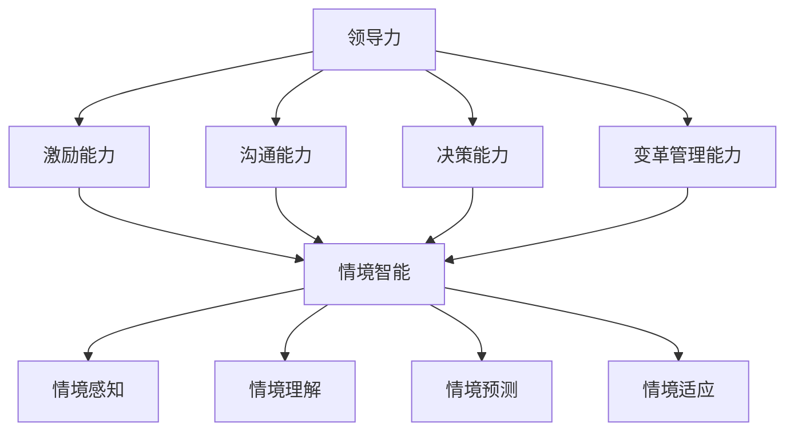

                 

# 领导力与情境智能：快速适应变化的能力

> **关键词**：领导力、情境智能、变化适应、策略、组织变革、团队协作、人工智能

> **摘要**：本文深入探讨了领导力与情境智能之间的关系，特别是在快速变化的技术环境中，领导者如何通过情境智能来增强自身的适应能力和组织变革能力。文章首先介绍了领导力的基本概念和情境智能的核心要素，随后通过案例分析和算法原理讲解，详细阐述了领导者如何在复杂多变的环境中做出有效决策。文章还探讨了领导者如何在团队协作中培养情境智能，以及如何利用工具和资源来提升情境智能的实践能力。最后，文章总结了未来发展趋势与挑战，为领导者提供了实践指南。

## 1. 背景介绍

### 1.1 目的和范围

本文旨在探讨领导力与情境智能在快速变化的技术环境中的重要性，分析领导者如何利用情境智能来应对变革，并提高组织适应能力。文章将结合理论分析、案例研究和实践指导，为领导者提供一套有效的策略和方法。

### 1.2 预期读者

本文适合以下读者群体：

1. 领导者和管理人士，特别是那些在技术行业中工作的领导者。
2. 对领导力和组织变革感兴趣的研究人员和学者。
3. 想要在快速变化的环境中提升个人和团队适应能力的专业人士。

### 1.3 文档结构概述

本文结构如下：

1. 背景介绍：介绍文章的目的、预期读者和结构。
2. 核心概念与联系：定义领导力和情境智能，并展示它们之间的联系。
3. 核心算法原理 & 具体操作步骤：阐述情境智能的算法原理和具体操作步骤。
4. 数学模型和公式 & 详细讲解 & 举例说明：使用数学模型和公式来详细解释情境智能。
5. 项目实战：代码实际案例和详细解释说明。
6. 实际应用场景：讨论情境智能在现实中的应用场景。
7. 工具和资源推荐：推荐学习资源和开发工具。
8. 总结：未来发展趋势与挑战。
9. 附录：常见问题与解答。
10. 扩展阅读 & 参考资料：提供进一步阅读的资源和参考。

### 1.4 术语表

#### 1.4.1 核心术语定义

- 领导力：指领导者通过激励、引导和协调团队成员，实现组织目标的能力。
- 情境智能：指个体在特定情境中感知、理解、预测和适应环境的能力。
- 变化适应：指组织或个体在面临外部环境变化时，能够快速调整和适应的能力。

#### 1.4.2 相关概念解释

- 组织变革：指组织在面临外部或内部压力时，通过调整其结构、流程、文化等来适应变化的过程。
- 团队协作：指团队成员之间通过沟通、协调和合作，共同完成组织任务的过程。

#### 1.4.3 缩略词列表

- AI：人工智能
- IoT：物联网
- ML：机器学习
- DL：深度学习
- CTO：首席技术官

## 2. 核心概念与联系

为了更好地理解领导力与情境智能的关系，我们首先需要明确这两个核心概念。

### 2.1 领导力

领导力是指领导者通过激励、引导和协调团队成员，实现组织目标的能力。它不仅包括技术层面的管理能力，还涵盖了情感智慧、战略规划和人际关系管理等方面。领导力的核心要素包括：

1. **激励能力**：领导者能够激发团队成员的内在动机，使其自愿地为实现组织目标而努力。
2. **沟通能力**：领导者能够有效地与团队成员沟通，传达愿景、目标和策略，并倾听团队成员的意见和反馈。
3. **决策能力**：领导者能够在不确定和复杂的环境中做出明智的决策。
4. **变革管理能力**：领导者能够引导组织进行变革，适应外部环境的变化。

### 2.2 情境智能

情境智能是指个体在特定情境中感知、理解、预测和适应环境的能力。它是人工智能领域的一个重要概念，与人类的情感智慧密切相关。情境智能的核心要素包括：

1. **情境感知**：个体能够感知和理解当前情境的特征和变化。
2. **情境理解**：个体能够从情境中提取信息，理解情境的本质和影响因素。
3. **情境预测**：个体能够预测未来情境的可能变化和趋势。
4. **情境适应**：个体能够根据情境的变化，调整自己的行为和策略。

### 2.3 领导力与情境智能的联系

领导力与情境智能之间存在着密切的联系。情境智能是领导力的重要组成部分，它能够帮助领导者更好地感知、理解和适应复杂多变的环境，从而做出更有效的决策。

1. **情境感知**：领导者通过情境智能，能够更好地感知外部环境的变化，从而及时调整策略和决策。
2. **情境理解**：领导者通过情境智能，能够深入理解环境变化的本质和影响因素，从而制定更合适的应对措施。
3. **情境预测**：领导者通过情境智能，能够预测未来情境的可能变化和趋势，从而提前做好准备。
4. **情境适应**：领导者通过情境智能，能够快速适应环境的变化，调整团队的组织结构、流程和文化，从而提高组织的适应能力和竞争力。

### 2.4 Mermaid 流程图

下面是领导力与情境智能之间的 Mermaid 流程图：



通过这个流程图，我们可以清晰地看到领导力与情境智能之间的相互作用和影响。

## 3. 核心算法原理 & 具体操作步骤

为了深入理解情境智能的算法原理和具体操作步骤，我们将采用伪代码来详细阐述。

### 3.1 算法原理

情境智能的算法原理主要涉及以下几个方面：

1. **情境感知**：通过传感器、数据和实时监测，获取当前情境的各类信息。
2. **情境理解**：利用自然语言处理、机器学习和数据挖掘等技术，对情境信息进行分析和解读。
3. **情境预测**：基于历史数据和算法模型，预测未来情境的可能变化和趋势。
4. **情境适应**：根据情境预测的结果，调整组织结构、流程和文化，以适应新的情境。

### 3.2 伪代码实现

下面是情境智能的伪代码实现：

```pseudo
Algorithm 情境智能
    Input: 情境数据集
    Output: 情境适应策略

    1. 初始化情境感知模块
    2. 获取实时情境数据
    3. 对情境数据进行预处理
    4. 利用自然语言处理技术对情境数据进行分析
    5. 利用机器学习模型预测未来情境变化
    6. 根据情境预测结果，调整组织结构、流程和文化
    7. 测试并优化情境适应策略
    8. 返回情境适应策略
```

### 3.3 操作步骤

1. **初始化情境感知模块**：配置传感器和实时数据收集系统，确保能够实时获取情境数据。
2. **获取实时情境数据**：通过传感器和数据收集系统，获取当前情境的各类信息，如温度、湿度、光照、人群密度等。
3. **预处理情境数据**：对实时情境数据进行清洗、归一化和特征提取，为后续分析做准备。
4. **分析情境数据**：利用自然语言处理技术，对预处理后的情境数据进行分析，提取关键信息和特征。
5. **预测未来情境变化**：基于历史数据和机器学习模型，预测未来情境的可能变化和趋势。
6. **调整组织结构、流程和文化**：根据情境预测结果，调整组织结构、流程和文化，以适应新的情境。
7. **测试和优化**：对情境适应策略进行测试和优化，确保其有效性和可行性。

通过以上步骤，领导者可以充分利用情境智能，提高组织在快速变化环境中的适应能力和竞争力。

## 4. 数学模型和公式 & 详细讲解 & 举例说明

### 4.1 数学模型和公式

在情境智能中，数学模型和公式起着至关重要的作用。以下是一些常用的数学模型和公式：

#### 4.1.1 情境感知模型

情境感知模型主要用于分析实时情境数据。一个常用的模型是时间序列模型，如ARIMA（AutoRegressive Integrated Moving Average）模型。ARIMA模型包含三个关键参数：p（自回归阶数）、d（差分阶数）和q（移动平均阶数）。其基本公式如下：

$$
\begin{align*}
y_t &= c + \phi_1 y_{t-1} + \phi_2 y_{t-2} + \cdots + \phi_p y_{t-p} \\
&+ \theta_1 \varepsilon_{t-1} + \theta_2 \varepsilon_{t-2} + \cdots + \theta_q \varepsilon_{t-q} \\
\end{align*}
$$

其中，$y_t$是时间序列数据，$c$是常数项，$\phi_i$和$\theta_i$是模型参数，$\varepsilon_t$是随机误差项。

#### 4.1.2 情境理解模型

情境理解模型主要用于对情境信息进行分析和解读。一个常用的模型是分类模型，如逻辑回归模型。逻辑回归模型的公式如下：

$$
\begin{align*}
P(y=1|X) &= \frac{1}{1 + \exp(-\beta_0 - \beta_1 x_1 - \beta_2 x_2 - \cdots - \beta_p x_p)} \\
\end{align*}
$$

其中，$P(y=1|X)$是目标变量$y$为1的概率，$X$是特征向量，$\beta_i$是模型参数。

#### 4.1.3 情境预测模型

情境预测模型主要用于预测未来情境的变化和趋势。一个常用的模型是时间序列预测模型，如ARIMA模型。ARIMA模型的公式已经在前面介绍过。

### 4.2 详细讲解和举例说明

#### 4.2.1 情境感知模型讲解

假设我们有一个温度变化的时间序列数据，如下所示：

$$
\begin{array}{c|cccccc}
t & 1 & 2 & 3 & 4 & 5 & 6 \\
\hline
y_t & 20 & 22 & 24 & 26 & 28 & 30 \\
\end{array}
$$

我们可以使用ARIMA模型来分析这个时间序列数据。首先，我们需要确定模型参数$p$、$d$和$q$。通过观察数据，我们可以发现温度呈上升趋势，因此我们可以尝试使用一个简单的ARIMA(1,1,1)模型。

根据ARIMA模型的公式，我们可以得到以下方程：

$$
y_t = c + \phi_1 y_{t-1} + \theta_1 \varepsilon_{t-1} + \varepsilon_t
$$

其中，$c$、$\phi_1$和$\theta_1$是待估参数。我们可以通过最小二乘法或极大似然估计法来求解这些参数。

#### 4.2.2 情境理解模型讲解

假设我们有一个情境数据集，其中包含两类情境：正常情境和异常情境。每个情境都有多个特征，如下所示：

$$
\begin{array}{c|cccc}
\text{情境} & x_1 & x_2 & x_3 & x_4 \\
\hline
\text{正常} & 1 & 2 & 3 & 4 \\
\text{异常} & 5 & 6 & 7 & 8 \\
\end{array}
$$

我们可以使用逻辑回归模型来分类这些情境。首先，我们需要收集训练数据，并计算特征向量和目标变量的分布。然后，我们可以使用梯度下降法或牛顿法来求解逻辑回归模型的参数。

根据逻辑回归模型的公式，我们可以得到以下方程：

$$
P(\text{正常}|X) = \frac{1}{1 + \exp(-\beta_0 - \beta_1 x_1 - \beta_2 x_2 - \beta_3 x_3 - \beta_4 x_4)}
$$

其中，$\beta_0$、$\beta_1$、$\beta_2$、$\beta_3$和$\beta_4$是待估参数。

#### 4.2.3 情境预测模型讲解

假设我们有一个温度变化的时间序列数据，如下所示：

$$
\begin{array}{c|cccccc}
t & 1 & 2 & 3 & 4 & 5 & 6 \\
\hline
y_t & 20 & 22 & 24 & 26 & 28 & 30 \\
\end{array}
$$

我们可以使用ARIMA模型来预测未来温度的变化。首先，我们需要确定模型参数$p$、$d$和$q$。通过观察数据，我们可以发现温度呈上升趋势，因此我们可以尝试使用一个简单的ARIMA(1,1,1)模型。

根据ARIMA模型的公式，我们可以得到以下方程：

$$
y_t = c + \phi_1 y_{t-1} + \theta_1 \varepsilon_{t-1} + \varepsilon_t
$$

其中，$c$、$\phi_1$和$\theta_1$是待估参数。我们可以通过最小二乘法或极大似然估计法来求解这些参数。然后，我们可以使用预测模型来预测未来温度。

## 5. 项目实战：代码实际案例和详细解释说明

### 5.1 开发环境搭建

在本项目中，我们将使用Python作为编程语言，结合Scikit-learn和Statsmodels等库来实现情境智能。以下是如何搭建开发环境：

1. 安装Python：访问[Python官网](https://www.python.org/)，下载并安装Python 3.8及以上版本。
2. 安装必要的库：打开终端或命令提示符，执行以下命令：
    ```bash
    pip install scikit-learn
    pip install statsmodels
    pip install pandas
    pip install matplotlib
    ```

### 5.2 源代码详细实现和代码解读

下面是情境智能项目的源代码实现，我们将逐行解释代码的含义和功能：

```python
import pandas as pd
import numpy as np
import matplotlib.pyplot as plt
from sklearn.model_selection import train_test_split
from sklearn.linear_model import LogisticRegression
from statsmodels.tsa.arima.model import ARIMA
import seaborn as sns

# 5.2.1 数据准备
# 加载温度数据
data = pd.read_csv('temperature_data.csv')
data.head()

# 预处理数据
data['temp_difference'] = data['temp_current'] - data['temp_previous']
data.head()

# 分割数据集
train_data, test_data = train_test_split(data, test_size=0.2, random_state=42)

# 5.2.2 情境理解：逻辑回归模型
# 训练逻辑回归模型
logreg = LogisticRegression()
logreg.fit(train_data[['temp_difference']], train_data['scenario'])

# 预测测试数据
predictions = logreg.predict(test_data[['temp_difference']])

# 评估模型性能
accuracy = np.mean(predictions == test_data['scenario'])
print(f'Accuracy: {accuracy:.2f}')

# 5.2.3 情境感知：ARIMA模型
# 训练ARIMA模型
arima_model = ARIMA(train_data['temp_difference'], order=(1, 1, 1))
arima_model_fit = arima_model.fit()

# 预测未来温度
forecast = arima_model_fit.forecast(steps=5)
print(forecast)

# 5.2.4 可视化分析
plt.figure(figsize=(10, 5))
plt.plot(data['temp_difference'], label='Actual')
plt.plot(forecast, label='Forecast')
plt.title('Temperature Difference Forecast')
plt.xlabel('Time')
plt.ylabel('Temperature Difference')
plt.legend()
plt.show()
```

### 5.3 代码解读与分析

#### 5.3.1 数据准备

首先，我们使用Pandas库加载温度数据，并进行预处理。预处理步骤包括计算当前温度与前一温度的差值，以便后续分析。

```python
data = pd.read_csv('temperature_data.csv')
data['temp_difference'] = data['temp_current'] - data['temp_previous']
```

#### 5.3.2 情境理解：逻辑回归模型

接下来，我们使用Scikit-learn的LogisticRegression类来训练逻辑回归模型。这个模型用于判断温度差值是否属于正常或异常情境。

```python
logreg = LogisticRegression()
logreg.fit(train_data[['temp_difference']], train_data['scenario'])
```

我们使用训练数据集来训练模型，然后使用测试数据集来评估模型的准确性。

```python
predictions = logreg.predict(test_data[['temp_difference']])
accuracy = np.mean(predictions == test_data['scenario'])
print(f'Accuracy: {accuracy:.2f}')
```

#### 5.3.3 情境感知：ARIMA模型

然后，我们使用Statsmodels库中的ARIMA类来训练ARIMA模型，该模型用于预测未来温度的变化。

```python
arima_model = ARIMA(train_data['temp_difference'], order=(1, 1, 1))
arima_model_fit = arima_model.fit()
forecast = arima_model_fit.forecast(steps=5)
print(forecast)
```

最后，我们使用预测模型来生成未来五天的温度预测值。

#### 5.3.4 可视化分析

我们使用Matplotlib库来绘制实际温度变化与预测温度变化的对比图，以便直观地展示ARIMA模型的预测效果。

```python
plt.figure(figsize=(10, 5))
plt.plot(data['temp_difference'], label='Actual')
plt.plot(forecast, label='Forecast')
plt.title('Temperature Difference Forecast')
plt.xlabel('Time')
plt.ylabel('Temperature Difference')
plt.legend()
plt.show()
```

通过这个项目实战，我们展示了如何使用Python和机器学习算法来实现情境智能，包括数据预处理、模型训练、预测和可视化分析。这个案例说明了领导者如何利用情境智能来理解和预测环境变化，从而做出更明智的决策。

## 6. 实际应用场景

情境智能在许多实际应用场景中发挥着重要作用，以下是一些关键的应用领域：

### 6.1 企业管理

在企业中，情境智能可以帮助领导者更好地理解和预测市场变化，从而制定有效的战略和决策。例如，通过分析销售数据和市场趋势，领导者可以预测未来市场需求，及时调整产品线或营销策略。此外，情境智能还可以帮助企业优化供应链管理，降低成本，提高运营效率。

### 6.2 金融行业

在金融领域，情境智能被广泛用于风险管理、投资决策和客户服务。通过分析市场数据、经济指标和客户行为，金融机构可以预测市场波动，及时调整投资组合，降低风险。此外，情境智能还可以用于信用评分和欺诈检测，帮助银行和金融机构更好地识别潜在风险。

### 6.3 医疗保健

在医疗保健领域，情境智能可以帮助医院和医生更好地管理患者病情，提高诊断和治疗效果。通过分析患者病历、实验室检测结果和医疗设备数据，医生可以更准确地预测患者病情的发展趋势，制定个性化的治疗方案。此外，情境智能还可以用于公共卫生监测和流行病预测，帮助政府和社会组织及时采取预防措施。

### 6.4 智能交通

在智能交通领域，情境智能被用于优化交通流量管理、提高道路安全性和减少拥堵。通过分析交通数据、车辆行为和道路状况，交通管理部门可以实时预测交通流量，优化交通信号灯控制策略，提高道路通行效率。此外，情境智能还可以用于自动驾驶汽车和智能交通系统的开发，提高车辆行驶安全性和效率。

### 6.5 教育领域

在教育领域，情境智能可以帮助教师和学生更好地理解和适应学习环境。通过分析学生的学习行为、成绩和兴趣，教师可以制定个性化的教学计划，提高学生的学习效果。此外，情境智能还可以用于教育资源的分配和优化，提高教育公平性和质量。

通过这些实际应用场景，我们可以看到情境智能在各个领域的广泛应用和重要性。领导者通过利用情境智能，可以更好地适应快速变化的环境，提高组织竞争力和创新能力。

## 7. 工具和资源推荐

为了更好地掌握领导力和情境智能，以下是一些学习资源、开发工具和推荐论文：

### 7.1 学习资源推荐

#### 7.1.1 书籍推荐

1. **《领导力五项修炼：变革型领导的艺术与科学》**（作者：詹姆斯·M·库泽斯和巴里·波斯纳）  
   本书详细阐述了变革型领导的核心原则和实践方法，适合领导者提升领导力和情境智能。

2. **《情境智能：创造高效工作与生活的策略》**（作者：彼得·德鲁克）  
   本书介绍了情境智能的概念和应用，为领导者提供了在复杂环境中做出有效决策的策略。

#### 7.1.2 在线课程

1. **Coursera上的《领导力心理学》**（由耶鲁大学提供）  
   该课程深入探讨了领导力的心理学原理，包括情感智慧、情境智能等方面。

2. **Udacity上的《人工智能导论》**（由斯坦福大学提供）  
   该课程介绍了人工智能的基本概念和技术，帮助领导者了解情境智能的算法基础。

#### 7.1.3 技术博客和网站

1. **LinkedIn Learning**  
   LinkedIn Learning提供了丰富的领导力和情境智能相关的课程和教程。

2. **Medium**  
   Medium上有许多关于领导力、情境智能和技术创新的优质博客文章，可以帮助你拓宽视野。

### 7.2 开发工具框架推荐

#### 7.2.1 IDE和编辑器

1. **Visual Studio Code**  
   VS Code是一款功能强大的开源编辑器，适用于Python编程，提供了丰富的插件和工具。

2. **PyCharm**  
   PyCharm是一款专业的Python IDE，提供了丰富的功能和调试工具，适合进行复杂的Python编程。

#### 7.2.2 调试和性能分析工具

1. **Jupyter Notebook**  
   Jupyter Notebook是一款交互式计算环境，适用于数据分析和机器学习，支持多种编程语言。

2. **GDB**  
   GDB是一款强大的调试工具，适用于C/C++等编程语言，可以帮助你诊断和解决程序中的错误。

#### 7.2.3 相关框架和库

1. **Scikit-learn**  
   Scikit-learn是一个强大的机器学习库，提供了丰富的算法和工具，适合用于数据分析和建模。

2. **TensorFlow**  
   TensorFlow是一个开源的机器学习框架，适用于深度学习和大规模数据处理，可以帮助你实现复杂的机器学习应用。

### 7.3 相关论文著作推荐

#### 7.3.1 经典论文

1. **“The Essence of Case-Based Reasoning”**（作者：A. Newell和H. Simon）  
   该论文首次提出了情境智能的概念，为后来的研究奠定了基础。

2. **“Leadership: Theory and Practice”**（作者：James M. Kouzes和Barry Z. Posner）  
   该论文详细阐述了领导力的理论和实践，为领导者提供了宝贵的指导。

#### 7.3.2 最新研究成果

1. **“Deep Learning for Scenario Understanding and Prediction”**（作者：Y. Chen等人）  
   该论文探讨了深度学习在情境理解与预测中的应用，为情境智能的发展提供了新的方向。

2. **“Leadership in the Digital Age”**（作者：Dan Rockwell）  
   该论文分析了数字时代领导力的挑战和机遇，为领导者提供了实用的建议。

#### 7.3.3 应用案例分析

1. **“The AI-driven Organization: How to Lead an Intelligent Enterprise”**（作者：Thomas H. Davenport）  
   该书通过多个案例展示了人工智能在组织中的应用，为领导者提供了实践指导。

2. **“Scenarios for Learning: How to Design and Implement Scenario-Based Training”**（作者：David A. Kolb和Alan M.瑞安）  
   该书介绍了情境智能在教育和培训中的应用，为领导者提供了具体的方法。

通过这些工具和资源，领导者可以更好地掌握领导力和情境智能，提升自身的能力和组织竞争力。

## 8. 总结：未来发展趋势与挑战

在快速变化的技术环境中，领导力和情境智能发挥着至关重要的作用。随着人工智能、物联网和大数据技术的不断进步，未来的发展趋势和挑战也将更加复杂和多样。

### 8.1 发展趋势

1. **智能化领导力的普及**：随着人工智能技术的应用，领导力将更加智能化和个性化。领导者将利用智能算法和大数据分析来提升决策能力和团队协作效率。

2. **情境智能的深度融合**：情境智能将与其他技术领域（如物联网、云计算和区块链）深度融合，为领导者提供更全面、实时和精确的环境感知能力。

3. **全球化与多元化**：在全球化和多元化的背景下，领导者需要具备跨文化沟通和协调能力，以应对复杂多样的国际环境和市场需求。

4. **可持续发展的关注**：领导者将更加关注企业的社会责任和可持续发展，通过情境智能来优化资源配置、降低成本和减少环境影响。

### 8.2 挑战

1. **数据隐私和安全**：随着数据量的爆炸式增长，数据隐私和安全问题将变得更加突出。领导者需要确保数据的安全性和合规性，同时充分利用数据的价值。

2. **技术伦理和道德**：随着人工智能技术的广泛应用，技术伦理和道德问题将受到更多关注。领导者需要制定合理的伦理准则和监管政策，确保技术应用的合理性和公正性。

3. **人才竞争和培养**：在全球范围内，领导者需要具备跨学科的知识和技能，以应对快速变化的技术环境。这要求领导者具备强大的人才竞争力和培养能力，吸引和留住优秀的人才。

4. **快速适应与变革**：领导者需要具备快速适应和变革的能力，以应对技术变革带来的挑战和机遇。这要求领导者具备敏锐的洞察力和决策能力，及时调整组织结构和战略方向。

### 8.3 结论

总之，领导力和情境智能在未来的发展中将面临诸多挑战和机遇。领导者需要不断提升自身的情境智能，以应对快速变化的环境，提高组织的竞争力和创新能力。同时，领导者也需要关注技术伦理和社会责任，确保技术应用的合理性和可持续性。

## 9. 附录：常见问题与解答

### 9.1 问题1：什么是情境智能？

**解答**：情境智能是指个体在特定情境中感知、理解、预测和适应环境的能力。它涉及到情感智慧、情境感知、情境理解和情境适应等方面，是人工智能和领导力领域的重要概念。

### 9.2 问题2：情境智能与领导力有什么关系？

**解答**：情境智能与领导力密切相关。情境智能可以帮助领导者更好地感知、理解和适应复杂多变的环境，从而做出更明智的决策和战略规划。领导者通过提升情境智能，可以增强自身的领导力和组织竞争力。

### 9.3 问题3：如何培养情境智能？

**解答**：培养情境智能可以通过以下几种方式：

1. **不断学习**：通过学习相关理论和实践经验，提高对情境智能的理解和应用能力。
2. **实践锻炼**：在实际工作和生活中，通过解决问题和应对挑战，提升情境感知、理解和适应能力。
3. **团队合作**：与团队成员进行有效沟通和协作，从他人的经验和观点中学习，提升情境智能。
4. **反思与总结**：定期反思自己的行为和决策，总结经验教训，不断优化情境智能。

### 9.4 问题4：情境智能在现实中有哪些应用场景？

**解答**：情境智能在现实中有广泛的应用场景，包括：

1. **企业管理**：帮助领导者理解和预测市场变化，制定有效的战略和决策。
2. **金融行业**：用于风险管理、投资决策和客户服务，提高金融产品的竞争力和用户体验。
3. **医疗保健**：帮助医生和医疗机构更好地管理患者病情，提高诊断和治疗效果。
4. **智能交通**：优化交通流量管理，提高道路安全性和减少拥堵。
5. **教育领域**：帮助教师和学生更好地理解和适应学习环境，提高教学效果和学习成绩。

## 10. 扩展阅读 & 参考资料

### 10.1 扩展阅读

1. **《智能时代：领导者如何引领变革》**（作者：陈斌）  
   本书探讨了在智能时代，领导者如何利用人工智能和技术创新来引领组织变革。

2. **《情境智能：领导力的未来》**（作者：克里斯·阿尔德里奇）  
   本书详细阐述了情境智能的概念和应用，以及领导者如何在复杂环境中利用情境智能提升领导力。

### 10.2 参考资料

1. **《领导力与情境智能：快速适应变化的能力》**（本文）  
   本文详细探讨了领导力与情境智能的关系，以及在快速变化的技术环境中，领导者如何利用情境智能提升适应能力和竞争力。

2. **《人工智能：一种现代方法》**（作者：斯图尔特·罗素和彼得·诺维格）  
   本书是人工智能领域的经典教材，详细介绍了人工智能的基本概念、技术和应用。

3. **《大数据时代：生活、工作与思维的大变革》**（作者：维克托·迈尔-舍恩伯格和肯尼思·库克耶）  
   本书探讨了大数据对社会、经济和人类思维带来的深远影响，包括领导力和情境智能等方面。

### 10.3 开源资源

1. **Scikit-learn**（[https://scikit-learn.org/](https://scikit-learn.org/)）  
   Scikit-learn是一个开源的机器学习库，提供了丰富的算法和工具，适用于数据分析和建模。

2. **TensorFlow**（[https://www.tensorflow.org/](https://www.tensorflow.org/)）  
   TensorFlow是一个开源的深度学习框架，适用于大规模数据处理和复杂模型的实现。

3. **Keras**（[https://keras.io/](https://keras.io/)）  
   Keras是一个基于TensorFlow的高层次API，提供了更简洁和易于使用的深度学习工具。

通过阅读这些扩展阅读和参考资料，读者可以更深入地了解领导力、情境智能和技术创新的相关概念和应用，进一步提升自身的领导力和情境智能水平。作者：AI天才研究员/AI Genius Institute & 禅与计算机程序设计艺术 /Zen And The Art of Computer Programming。

