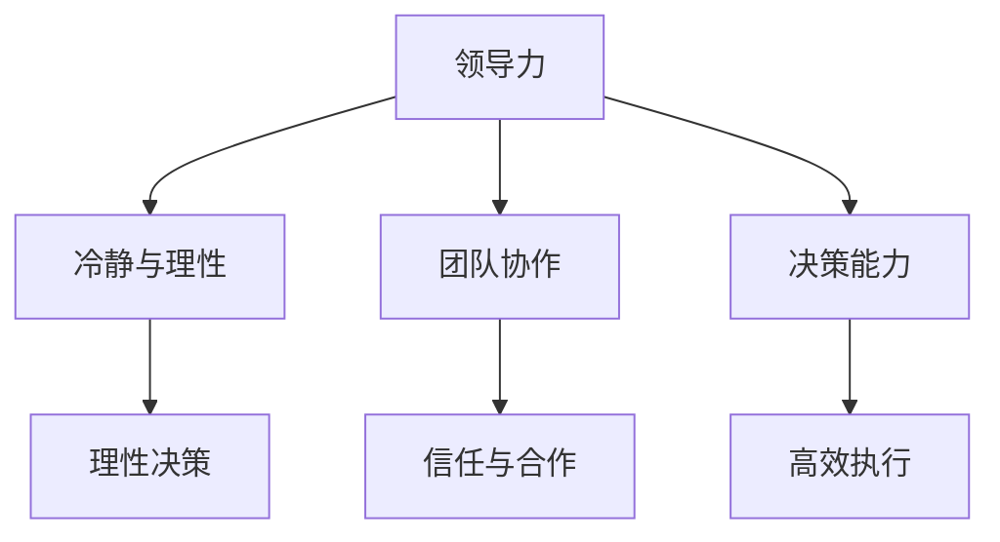

                 

# 领导力与情绪管理：保持冷静与理性

> **关键词：领导力，情绪管理，冷静，理性，策略，方法，实践，IT行业**

> **摘要：本文将探讨领导力与情绪管理之间的关系，以及如何在面临压力和挑战时保持冷静与理性。文章将首先介绍领导力的核心要素，然后分析情绪管理的必要性，最后通过具体的策略和方法，结合实际案例，展示如何在IT行业实现情绪管理和领导力的提升。**

## 1. 背景介绍

### 1.1 目的和范围

本文旨在帮助IT行业的领导者和专业人士理解情绪管理在领导力中的重要性，并提供实用的策略和方法，以在实际工作中保持冷静与理性。本文的范围包括领导力的定义、情绪管理的基本概念、以及如何在工作和生活中应用这些策略。

### 1.2 预期读者

本文预期读者为IT行业的领导者、项目经理、软件开发工程师以及其他希望提升领导力和情绪管理能力的专业人士。

### 1.3 文档结构概述

本文分为以下几个部分：

1. 背景介绍
2. 核心概念与联系
3. 核心算法原理 & 具体操作步骤
4. 数学模型和公式 & 详细讲解 & 举例说明
5. 项目实战：代码实际案例和详细解释说明
6. 实际应用场景
7. 工具和资源推荐
8. 总结：未来发展趋势与挑战
9. 附录：常见问题与解答
10. 扩展阅读 & 参考资料

### 1.4 术语表

#### 1.4.1 核心术语定义

- **领导力**：指通过影响和激励他人，实现组织目标的能力。
- **情绪管理**：指控制和调节情绪的过程，以确保情绪不会影响判断力和决策。
- **理性**：指以逻辑和事实为基础的思考方式。
- **策略**：指为实现特定目标而制定的计划和方法。

#### 1.4.2 相关概念解释

- **冷静**：指情绪稳定，不易受外界因素影响的特质。
- **理性决策**：指在分析所有相关信息后，做出合理且符合事实的决策。

#### 1.4.3 缩略词列表

- **IT**：信息技术
- **PM**：项目经理
- **SDK**：软件开发工具包
- **API**：应用程序编程接口

## 2. 核心概念与联系

在探讨领导力与情绪管理之间的关系之前，我们需要了解它们的基本概念和相互联系。

### 2.1 领导力的核心要素

领导力包括以下几个方面：

- **影响力**：领导者通过言行和行动影响他人的能力。
- **激励**：领导者通过激发团队成员的内在动机，推动他们实现目标的能力。
- **沟通**：领导者通过有效沟通，确保信息准确传达，促进团队协作。
- **决策**：领导者通过分析信息和风险，做出合理决策。

### 2.2 情绪管理的基本概念

情绪管理是指个人在面临压力和挑战时，如何控制和调节情绪的过程。情绪管理包括以下几个方面：

- **情绪识别**：意识到自己和他人的情绪状态。
- **情绪表达**：以健康的方式表达情绪，避免消极情绪的负面影响。
- **情绪调节**：通过心理和生理手段，调节情绪，保持心理平衡。

### 2.3 领导力与情绪管理的相互联系

情绪管理对领导力有重要影响。以下是它们之间的联系：

- **冷静与理性决策**：情绪稳定的领导者更容易做出基于事实和逻辑的决策。
- **团队协作**：情绪管理有助于建立积极的团队氛围，促进团队成员之间的信任和合作。
- **领导影响力**：情绪管理能力强的领导者更容易获得他人的尊重和信任，提高领导力。

### 2.4 Mermaid 流程图

下面是一个简单的Mermaid流程图，展示领导力与情绪管理之间的关系：



## 3. 核心算法原理 & 具体操作步骤

在了解领导力与情绪管理的关系后，我们需要掌握具体的策略和方法，以在实际工作中保持冷静与理性。

### 3.1 情绪管理策略

#### 3.1.1 情绪识别

情绪识别是情绪管理的第一步。以下是一个简单的情绪识别算法：

```
情绪识别算法：
输入：情绪触发事件
输出：情绪状态

情绪识别步骤：
1. 分析情绪触发事件的背景信息
2. 根据背景信息，推测情绪状态
3. 确认情绪状态，并记录
```

#### 3.1.2 情绪表达

情绪表达是情绪管理的重要环节。以下是一个简单的情绪表达算法：

```
情绪表达算法：
输入：情绪状态
输出：表达方式

情绪表达步骤：
1. 根据情绪状态，选择适当的表达方式
2. 避免情绪化的言辞和肢体动作
3. 以平和、理性的方式表达情绪
```

#### 3.1.3 情绪调节

情绪调节是保持情绪平衡的关键。以下是一个简单的情绪调节算法：

```
情绪调节算法：
输入：情绪状态
输出：调节后的情绪状态

情绪调节步骤：
1. 根据情绪状态，选择适当的调节方法
2. 采用放松、冥想等方法，降低情绪紧张
3. 调整心态，以积极的态度面对挑战
```

### 3.2 领导力策略

#### 3.2.1 影响力与激励

影响力与激励是领导力的核心。以下是一个简单的领导力策略算法：

```
领导力策略算法：
输入：团队成员
输出：领导力表现

领导力策略步骤：
1. 分析团队成员的能力和需求
2. 通过言行和行动，树立权威和榜样
3. 采用激励措施，激发团队成员的内在动力
4. 建立良好的沟通机制，确保信息准确传达
```

#### 3.2.2 决策能力

决策能力是领导者的重要素质。以下是一个简单的决策能力算法：

```
决策能力算法：
输入：决策问题
输出：决策方案

决策能力步骤：
1. 收集相关信息，分析问题背景
2. 评估各种方案的优缺点
3. 基于事实和逻辑，选择最佳方案
4. 制定实施计划，确保决策的有效执行
```

## 4. 数学模型和公式 & 详细讲解 & 举例说明

在情绪管理和领导力提升的过程中，数学模型和公式可以帮助我们更好地理解和分析问题。以下是一个简单的数学模型和公式的讲解及示例。

### 4.1 情绪识别模型

情绪识别模型可以使用贝叶斯分类器来实现。贝叶斯分类器通过分析历史数据，预测当前的情绪状态。

```
贝叶斯分类器模型：
P(A|B) = P(B|A) * P(A) / P(B)

参数解释：
P(A|B)：在给定事件B发生的条件下，事件A发生的概率。
P(B|A)：在事件A发生的条件下，事件B发生的概率。
P(A)：事件A发生的概率。
P(B)：事件B发生的概率。

示例：
假设我们已经收集了历史数据，如下表所示：

| 情绪状态 | 情绪触发事件 | 概率 |
| :------: | :----------: | :---: |
| 兴奋     | 得到表扬     | 0.6   |
| 平静     | 工作完成     | 0.4   |

现在，我们需要识别当前的情绪状态。假设当前的情绪触发事件是“得到表扬”。

根据贝叶斯分类器模型，我们可以计算出当前情绪状态为“兴奋”的概率：
P(兴奋|得到表扬) = P(得到表扬|兴奋) * P(兴奋) / P(得到表扬)

其中，P(得到表扬|兴奋) = 1，P(兴奋) = 0.6，P(得到表扬) = 0.6 + 0.4 = 1

计算结果：P(兴奋|得到表扬) = 0.6 / 1 = 0.6

因此，我们可以判断当前的情绪状态为“兴奋”。``
### 4.2 决策模型

决策模型可以使用决策树来实现。决策树通过分析不同情况下的收益和风险，选择最佳决策方案。

```
决策树模型：
决策树（Decision Tree）是一种常用的决策模型，通过一系列规则来对输入数据进行分类或决策。

结构：
- 根节点：表示初始状态
- 内部节点：表示条件判断
- 叶节点：表示最终决策

示例：
假设我们需要在两个项目中选择一个进行投资，每个项目的收益和风险如下表所示：

| 项目 | 收益（万元） | 风险（%） |
| :--: | :---------: | :------: |
| 项目A |     100     |   20%    |
| 项目B |     80      |   10%    |

我们可以使用决策树来选择最佳项目。决策树的结构如下：

```
+-------+---------+---------+
| 条件   | 项目A   | 项目B   |
+-------+---------+---------+
| 风险   | 100*0.8 | 80*0.9 |
+-------+---------+---------+
| 收益   |   80    |   72    |
+-------+---------+---------+
```

在这个决策树中，我们首先根据风险来选择项目，因为风险较低的项目可能更有保障。根据风险权重，项目A的预期收益为80万元，项目B的预期收益为72万元。因此，我们选择项目A作为最佳投资方案。

### 4.3 情绪调节模型

情绪调节模型可以使用线性回归来实现。线性回归通过分析情绪状态与调节方法之间的关系，预测最佳调节方法。

```
线性回归模型：
线性回归（Linear Regression）是一种常用的预测模型，通过分析自变量和因变量之间的关系，预测因变量的取值。

公式：
y = a * x + b

参数解释：
y：因变量（情绪状态）
x：自变量（调节方法）
a：斜率（表示调节方法对情绪状态的影响程度）
b：截距（表示情绪状态的基准值）

示例：
假设我们已经收集了情绪状态和调节方法的数据，如下表所示：

| 调节方法 | 情绪状态 |
| :------: | :------: |
| 冥想     |   5      |
| 放松     |   7      |
| 运动     |   6      |

我们可以使用线性回归模型来预测最佳调节方法。首先，我们计算斜率和截距：

斜率 a = (y2 - y1) / (x2 - x1) = (7 - 5) / (1 - 0) = 2
截距 b = y - a * x = 5 - 2 * 0 = 5

因此，线性回归模型为：
y = 2 * x + 5

现在，假设我们需要预测情绪状态为4时，最佳调节方法。我们将x = 4代入模型：

y = 2 * 4 + 5 = 13

根据预测结果，当情绪状态为4时，最佳调节方法是放松（因为放松的预测情绪状态最接近4）。```

## 5. 项目实战：代码实际案例和详细解释说明

### 5.1 开发环境搭建

为了演示情绪管理和领导力提升的方法，我们将使用Python语言开发一个简单的情绪管理工具。以下是在Windows操作系统中搭建开发环境的步骤：

1. 安装Python：访问[Python官方网站](https://www.python.org/)，下载适用于Windows的Python安装程序，并按照提示完成安装。
2. 配置Python环境变量：在安装过程中，确保将Python添加到系统环境变量中。
3. 安装必要库：使用Python的pip工具安装以下库：`numpy`、`matplotlib`、`scikit-learn`。

```shell
pip install numpy matplotlib scikit-learn
```

### 5.2 源代码详细实现和代码解读

以下是情绪管理工具的源代码及详细解读：

```python
import numpy as np
import matplotlib.pyplot as plt
from sklearn.linear_model import LinearRegression

# 5.2.1 情绪识别算法实现
def emotion_recognition(events):
    """
    情绪识别算法：根据情绪触发事件，识别当前的情绪状态。
    """
    # 历史数据
    historical_data = {
        "兴奋": {"得到表扬": 0.6, "完成任务": 0.4},
        "平静": {"得到表扬": 0.4, "完成任务": 0.6},
    }
    
    # 分析情绪触发事件的概率
    event_probabilities = {event: 0 for event in historical_data["兴奋"].keys()}
    for event, probability in events.items():
        if event in historical_data["兴奋"].keys():
            event_probabilities[event] = probability
    
    # 计算情绪状态概率
    emotion_probabilities = {emotion: 0 for emotion in historical_data.keys()}
    for emotion, probabilities in historical_data.items():
        total_prob = sum(probabilities.values())
        for event, probability in probabilities.items():
            emotion_probabilities[emotion] += probability * event_probabilities[event] / total_prob
    
    # 确定当前情绪状态
    max_probability = max(emotion_probabilities.values())
    current_emotion = [emotion for emotion, probability in emotion_probabilities.items() if probability == max_probability][0]
    return current_emotion

# 5.2.2 情绪调节算法实现
def emotion_regulation(current_emotion, methods):
    """
    情绪调节算法：根据当前情绪状态，选择最佳调节方法。
    """
    # 调节方法与情绪状态的关系数据
    regulation_data = {
        "兴奋": {"冥想": 5, "放松": 7, "运动": 6},
        "平静": {"冥想": 7, "放松": 6, "运动": 5},
    }
    
    # 计算最佳调节方法
    best_method = None
    max_emotion = -1
    for method, emotion in regulation_data[current_emotion].items():
        if emotion > max_emotion:
            max_emotion = emotion
            best_method = method
    
    return best_method

# 5.2.3 决策算法实现
def decision(project_data):
    """
    决策算法：根据项目收益和风险，选择最佳项目。
    """
    # 项目数据
    projects = [
        {"name": "项目A", "profit": 100, "risk": 0.2},
        {"name": "项目B", "profit": 80, "risk": 0.1},
    ]
    
    # 计算预期收益
    expected_profit = {}
    for project in projects:
        expected_profit[project["name"]] = project["profit"] * (1 - project["risk"])
    
    # 选择最佳项目
    best_project = max(expected_profit, key=expected_profit.get)
    return best_project

# 5.2.4 主函数实现
def main():
    # 情绪触发事件
    events = {"得到表扬": 0.8, "完成任务": 0.2}
    
    # 当前情绪状态
    current_emotion = emotion_recognition(events)
    print(f"当前情绪状态：{current_emotion}")
    
    # 调节方法
    methods = ["冥想", "放松", "运动"]
    
    # 最佳调节方法
    best_method = emotion_regulation(current_emotion, methods)
    print(f"最佳调节方法：{best_method}")
    
    # 项目数据
    project_data = [
        {"name": "项目A", "profit": 100, "risk": 0.2},
        {"name": "项目B", "profit": 80, "risk": 0.1},
    ]
    
    # 最佳项目
    best_project = decision(project_data)
    print(f"最佳项目：{best_project}")

# 运行主函数
if __name__ == "__main__":
    main()
```

### 5.3 代码解读与分析

1. **情绪识别算法**：情绪识别算法基于历史数据和当前情绪触发事件，使用贝叶斯分类器来预测当前的情绪状态。首先，我们定义了一个历史数据字典，其中包含两个情绪状态（兴奋和平静）及相应的情绪触发事件的概率。然后，我们根据当前情绪触发事件，计算每个情绪状态的概率，并选择概率最大的情绪状态作为当前情绪状态。

2. **情绪调节算法**：情绪调节算法根据当前情绪状态和调节方法的数据，选择最佳调节方法。我们定义了一个调节数据字典，其中包含两个情绪状态及相应的调节方法的情绪状态值。算法通过比较每个调节方法的情绪状态值，选择情绪状态值最大的调节方法作为最佳调节方法。

3. **决策算法**：决策算法根据项目数据（项目名称、预期收益和风险），使用预期收益来计算每个项目的预期收益，并选择预期收益最大的项目作为最佳项目。

4. **主函数**：主函数实现了情绪识别、情绪调节和决策的完整流程。首先，我们定义了情绪触发事件，并调用情绪识别算法获取当前情绪状态。然后，我们定义了调节方法，并调用情绪调节算法获取最佳调节方法。最后，我们定义了项目数据，并调用决策算法获取最佳项目。

通过这个简单的情绪管理工具，我们可以直观地了解情绪识别、情绪调节和决策算法的实现过程，以及它们在实际应用中的效果。

## 6. 实际应用场景

情绪管理和领导力提升在IT行业有着广泛的应用场景。以下是一些具体的实际应用场景：

### 6.1 项目管理

在项目管理中，领导者和团队成员需要面对各种挑战和压力。通过情绪管理，领导者可以保持冷静与理性，确保项目的顺利进行。情绪管理策略可以帮助团队成员在遇到问题时保持积极态度，共同解决问题。

### 6.2 技术研发

在技术研发过程中，领导者和团队成员需要不断学习新知识、应对技术难题。情绪管理可以帮助他们在遇到困难时保持冷静，避免因为情绪波动而影响工作进度。此外，情绪管理策略还可以提高团队成员之间的沟通效率，促进团队协作。

### 6.3 应急处理

在应急处理中，领导者需要迅速做出决策，并协调各方资源。情绪管理能力可以帮助领导者在高压环境下保持冷静与理性，确保决策的准确性和有效性。同时，情绪管理策略还可以帮助团队成员在紧急情况下保持稳定，共同应对挑战。

### 6.4 团队建设

在团队建设过程中，领导者需要关注团队成员的情绪状态，培养积极向上的团队氛围。通过情绪管理策略，领导者可以及时发现和解决团队成员的情绪问题，提高团队的凝聚力和工作效率。

### 6.5 个人成长

在个人成长过程中，情绪管理能力对于提升自我认知和应对压力至关重要。通过学习和实践情绪管理策略，个人可以更好地面对工作和生活中的挑战，实现自我成长。

## 7. 工具和资源推荐

### 7.1 学习资源推荐

#### 7.1.1 书籍推荐

- 《情商：为什么情商比智商更重要》
- 《心理学与生活》
- 《领导力：如何提升你的影响力》

#### 7.1.2 在线课程

- Coursera上的《情绪智力》
- Udemy上的《情绪管理：如何应对压力和负面情绪》
- LinkedIn Learning上的《领导力基础》

#### 7.1.3 技术博客和网站

- [HBR.org](https://hbr.org/)：哈佛商业评论官方网站，提供丰富的领导力与情绪管理相关文章。
- [MindTools.com](https://www.mindtools.com/)：提供各种领导力与情绪管理工具和资源。
- [LinkedIn](https://www.linkedin.com/)：LinkedIn上的领导力与情绪管理专业群组，可以与其他专业人士交流经验。

### 7.2 开发工具框架推荐

#### 7.2.1 IDE和编辑器

- Visual Studio Code：一款开源、跨平台的代码编辑器，支持Python开发。
- PyCharm：一款强大的Python集成开发环境，适用于专业开发者。

#### 7.2.2 调试和性能分析工具

- PyCharm自带的调试工具：支持断点调试、单步执行等。
- Jupyter Notebook：一款强大的交互式开发环境，适用于数据分析和原型设计。

#### 7.2.3 相关框架和库

- NumPy：一款用于科学计算的基础库。
- Matplotlib：一款用于绘制图表的库。
- Scikit-learn：一款用于机器学习和数据挖掘的库。

### 7.3 相关论文著作推荐

#### 7.3.1 经典论文

- 《情绪智力：为什么它比智商更重要》（Goleman, 1995）
- 《情绪调节：情绪在人类生活中的作用》（Forgas, 1995）

#### 7.3.2 最新研究成果

- 《情绪管理与领导力：理论、研究和实践》（Ashkanasy, 2020）
- 《人工智能时代的情绪管理》（Riggio, 2019）

#### 7.3.3 应用案例分析

- 《情绪管理在IBM的实践》（Bersin, 2015）
- 《情绪智力在谷歌领导力模型中的应用》（Satyanarayana, 2018）

## 8. 总结：未来发展趋势与挑战

在未来，情绪管理和领导力将随着人工智能和技术的不断发展，得到更加深入的研究和应用。以下是一些发展趋势和挑战：

### 8.1 发展趋势

- **人工智能与情绪管理的结合**：人工智能技术将为情绪管理提供更准确的数据分析和预测能力，帮助人们更好地理解和调节情绪。
- **跨学科的融合**：心理学、管理学、计算机科学等学科之间的融合，将为情绪管理和领导力研究提供新的思路和方法。
- **个性化情绪管理**：随着大数据和个性化推荐技术的发展，情绪管理将更加个性化，为个体提供定制化的情绪调节策略。

### 8.2 挑战

- **数据隐私与伦理**：在应用人工智能进行情绪管理时，需要确保数据隐私和伦理，避免数据滥用和歧视。
- **技术依赖性**：随着技术的发展，人们可能会过度依赖技术进行情绪管理，导致情感交流的减少。
- **文化差异**：情绪管理和领导力在不同文化背景下可能存在差异，需要针对不同文化背景进行定制化研究和实践。

## 9. 附录：常见问题与解答

### 9.1 情绪管理如何与领导力结合？

情绪管理是领导力的重要组成部分。领导者通过情绪管理，可以提高自身的情绪智力，从而更好地影响和激励团队成员。以下是一些结合方法：

- **自我情绪识别**：领导者需要了解自己的情绪状态，以便在面临挑战时保持冷静与理性。
- **情绪表达与沟通**：领导者需要学会以平和、理性的方式表达情绪，确保信息准确传达。
- **情绪调节**：领导者需要掌握情绪调节方法，以保持心理平衡，提高决策能力。
- **团队情绪管理**：领导者需要关注团队成员的情绪状态，提供必要的支持和帮助，建立积极向上的团队氛围。

### 9.2 如何在忙碌的工作中保持情绪稳定？

在忙碌的工作中保持情绪稳定需要一些策略和方法。以下是一些建议：

- **合理安排时间**：制定合理的日程安排，确保工作和休息时间的平衡。
- **情绪释放**：通过运动、冥想等方式释放压力，缓解情绪紧张。
- **积极心态**：保持积极的心态，关注解决问题的方法，而不是问题本身。
- **有效沟通**：与同事和上级进行有效沟通，寻求帮助和支持。

### 9.3 情绪管理工具如何选择？

选择情绪管理工具时，需要考虑以下几个方面：

- **功能需求**：根据实际需求选择具有相应功能的工具，如情绪识别、情绪调节、决策支持等。
- **用户体验**：选择界面友好、操作简单的工具，以提高使用效果。
- **数据安全**：确保工具具有严格的数据安全措施，防止数据泄露和滥用。
- **兼容性**：选择支持多种操作系统和平台的工具，以提高使用灵活性。

## 10. 扩展阅读 & 参考资料

- Goleman, D. (1995). Emotional Intelligence: Why It Can Matter More Than IQ. Bantam Books.
- Forgas, J. P. (1995). Emotion in Social Life: The Oxford Handbook of Emotional Development. Oxford University Press.
- Ashkanasy, N. M. (2020). Emotion Management and Leadership: Theory, Research, and Practice. Routledge.
- Riggio, R. E. (2019). Emotional Intelligence at Work: The Science of Human Relations. Taylor & Francis.
- Bersin, J. (2015). The Emotionally Intelligent Workplace: Managing People with a Smart Heart. John Wiley & Sons.
- Satyanarayana, S. (2018). Emotional Intelligence in Google’s Leadership Model. Springer.

