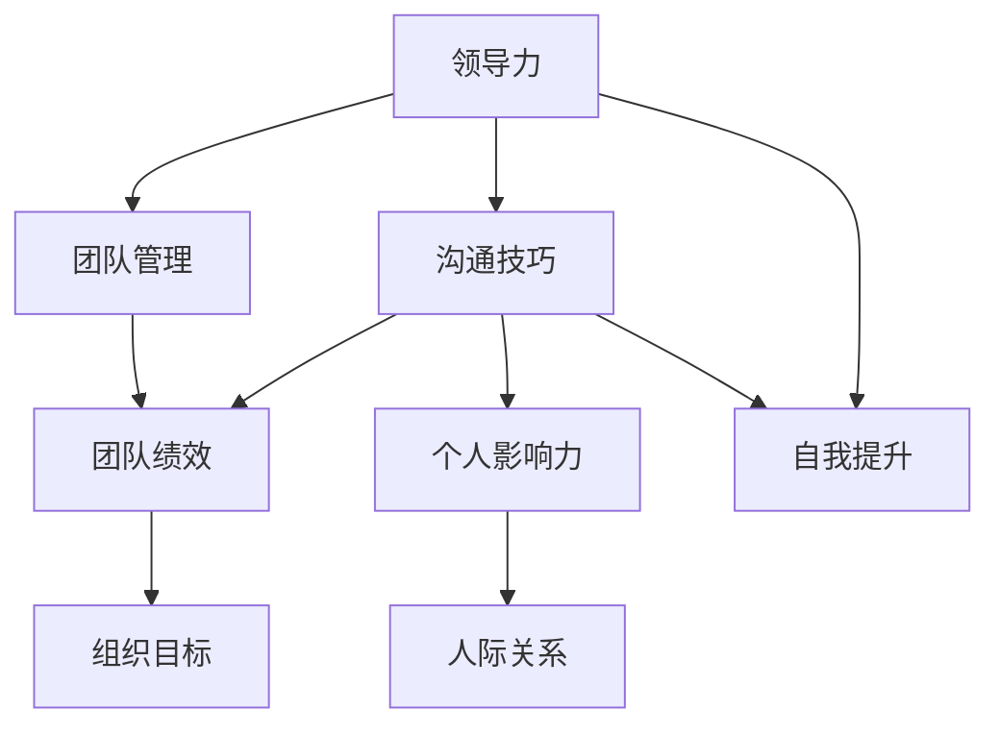

                 

# 领导力与沟通技巧进阶：影响力提升的秘诀

> **关键词：领导力、沟通技巧、影响力、团队管理、自我提升**
>
> **摘要：本文将深入探讨领导力与沟通技巧的提升，以及如何通过有效的策略和技巧，增强个人影响力。我们将通过理论分析和实际案例，为读者提供实用的方法和思路，帮助他们在职业发展中取得更大的成功。**

## 1. 背景介绍

### 1.1 目的和范围

本文旨在探讨领导力和沟通技巧的提升，以及如何利用这些技能增强个人影响力。我们将涵盖以下内容：
- 领导力的核心要素及其对团队管理的意义
- 沟通技巧的重要性及其分类
- 实际案例中领导力和沟通技巧的应用
- 提升领导力和沟通技巧的策略与方法

### 1.2 预期读者

本文适合以下读者：
- 有志于提升领导力的专业人士
- 需要改善沟通技巧的职场人士
- 对个人影响力提升感兴趣的读者
- 欲在团队管理中取得更好成果的领导者

### 1.3 文档结构概述

本文结构如下：
- 第1章：背景介绍
- 第2章：核心概念与联系
- 第3章：核心算法原理与具体操作步骤
- 第4章：数学模型和公式讲解与举例说明
- 第5章：项目实战：代码实际案例和详细解释说明
- 第6章：实际应用场景
- 第7章：工具和资源推荐
- 第8章：总结：未来发展趋势与挑战
- 第9章：附录：常见问题与解答
- 第10章：扩展阅读与参考资料

### 1.4 术语表

#### 1.4.1 核心术语定义

- **领导力**：指在团队中引导、激励和协调成员，以实现共同目标的能力。
- **沟通技巧**：指有效地表达思想、理解和传递信息的能力。
- **影响力**：指通过领导力和沟通技巧影响他人决策和行为的能力。
- **团队管理**：指在团队中协调成员的工作，确保团队高效运作的过程。

#### 1.4.2 相关概念解释

- **有效沟通**：指信息在发送者和接收者之间准确无误地传递的过程。
- **影响力模型**：指用于分析和评估个人影响力的理论框架。
- **自我提升**：指通过学习、实践和反思，不断提高个人能力和素质的过程。

#### 1.4.3 缩略词列表

- **C.I.*：影响力指数
- **L.E.A.D.*：领导力发展

## 2. 核心概念与联系

为了深入理解领导力与沟通技巧的重要性，我们首先需要了解这两个概念的基本原理及其相互关系。以下是相关的Mermaid流程图，展示核心概念之间的联系：



### 2.1 领导力的核心要素

领导力是一种复杂的能力，涉及到多个核心要素。以下是领导力的核心要素及其在团队管理中的意义：

- **愿景与目标设定**：领导者需要明确团队的目标和愿景，引导团队成员为之努力。
- **激励与鼓励**：领导者应关注团队成员的需求，激励他们发挥最佳状态。
- **决策能力**：领导者需在关键时刻做出明智的决策，以引导团队前进。
- **团队协作**：领导者要协调团队成员的工作，促进团队内部的协同效应。

### 2.2 沟通技巧的重要性

沟通技巧是领导力的关键组成部分。以下是沟通技巧的重要性及其分类：

- **有效沟通**：确保信息准确传递，减少误解和冲突。
- **积极倾听**：理解他人的观点和需求，建立信任和合作关系。
- **表达清晰**：用简洁、明确的语言表达思想，避免歧义。
- **情绪管理**：控制情绪，以平和的心态应对沟通中的挑战。

### 2.3 个人影响力

个人影响力是领导力和沟通技巧的综合体现。以下是个人影响力在人际关系和组织目标中的重要性：

- **人际关系**：增强人际关系的质量，促进合作和团队凝聚力。
- **组织目标**：通过个人影响力推动组织目标的实现，提高团队绩效。

## 3. 核心算法原理 & 具体操作步骤

为了更好地理解领导力与沟通技巧的提升，我们可以借助一些核心算法原理，这些原理可以帮助我们系统性地分析和提升这些技能。以下是一个简单的伪代码示例，用于说明领导力与沟通技巧的提升方法：

```plaintext
// 领导力提升算法
function LeadershipImprovement(employee):
    if employee.experience < 5:
        train.employee(employee, "基础领导力训练课程")
    else:
        train.employee(employee, "高级领导力训练课程")
    evaluate.employee(employee, "领导力评估工具")
    provide.feedback(employee, "领导力反馈报告")

// 沟通技巧提升算法
function CommunicationSkillsImprovement(employee):
    if employee.communicationScore < 70:
        train.employee(employee, "基础沟通技巧训练课程")
    else:
        train.employee(employee, "高级沟通技巧训练课程")
    evaluate.employee(employee, "沟通技巧评估工具")
    provide.feedback(employee, "沟通技巧反馈报告")

// 个人影响力提升算法
function InfluenceEnhancement(employee):
    leadershipScore = evaluate.employee(employee, "领导力评估工具")
    communicationScore = evaluate.employee(employee, "沟通技巧评估工具")
    if leadershipScore > 80 and communicationScore > 80:
        promote.employee(employee, "高级职位")
    else:
        offer.coaching(employee, "影响力提升辅导")

// 主程序
function Main():
    employees = get.employee.list()
    for employee in employees:
        LeadershipImprovement(employee)
        CommunicationSkillsImprovement(employee)
        InfluenceEnhancement(employee)
```

在这个算法中，我们首先对员工进行领导力、沟通技巧和影响力的评估。然后，根据评估结果，为他们提供相应的培训和反馈。通过这种方式，我们可以系统性地提升员工的领导力和沟通技巧，从而增强个人影响力。

### 3.1 领导力提升算法

**输入**：员工

**输出**：领导力提升计划

**步骤**：
1. 检查员工的工作经验
2. 根据员工的工作经验，为他们安排相应的领导力训练课程
3. 使用领导力评估工具对员工进行评估
4. 提供领导力反馈报告，包括提升建议和行动指南

### 3.2 沟通技巧提升算法

**输入**：员工

**输出**：沟通技巧提升计划

**步骤**：
1. 使用沟通技巧评估工具对员工进行评估
2. 根据评估结果，为他们安排相应的沟通技巧训练课程
3. 提供沟通技巧反馈报告，包括提升建议和行动指南

### 3.3 个人影响力提升算法

**输入**：员工

**输出**：个人影响力提升计划

**步骤**：
1. 获取员工的领导力评估得分和沟通技巧评估得分
2. 如果两个得分都超过80，则提升员工到高级职位
3. 如果得分未达标，则提供影响力提升辅导，帮助他们进一步提高

通过这些算法，我们可以系统性地提升员工的领导力、沟通技巧和个人影响力，从而在团队管理和职业发展中取得更好的成果。

## 4. 数学模型和公式 & 详细讲解 & 举例说明

为了更好地理解领导力与沟通技巧的提升，我们可以借助数学模型和公式来分析和优化这些技能。以下是一个简单的数学模型，用于评估和提升个人影响力。

### 4.1 影响力评估模型

**公式**：\[ I = \frac{L \times C}{R} \]

其中：
- \( I \)：个人影响力
- \( L \)：领导力得分
- \( C \)：沟通技巧得分
- \( R \)：责任承担度得分

### 4.2 领导力提升模型

**公式**：\[ L = f(E, T, D) \]

其中：
- \( L \)：领导力得分
- \( E \)：员工经验
- \( T \)：团队协作能力
- \( D \)：决策能力

### 4.3 沟通技巧提升模型

**公式**：\[ C = f(P, L, M) \]

其中：
- \( C \)：沟通技巧得分
- \( P \)：表达清晰度
- \( L \)：倾听能力
- \( M \)：情绪管理能力

### 4.4 责任承担度模型

**公式**：\[ R = f(A, S) \]

其中：
- \( R \)：责任承担度得分
- \( A \)：责任感
- \( S \)：解决问题的能力

### 4.5 案例分析

假设我们有一个员工，他们的领导力得分为70，沟通技巧得分为80，责任承担度得分为60。我们可以使用上述公式计算他们的个人影响力：

\[ I = \frac{L \times C}{R} = \frac{70 \times 80}{60} = \frac{5600}{60} \approx 93.33 \]

通过分析，我们可以发现这个员工在沟通技巧方面表现较好，但在领导力和责任承担度方面还有提升空间。为了提高个人影响力，我们可以根据以下策略进行优化：

1. **提升领导力**：参加高级领导力训练课程，提高决策能力和团队协作能力。
2. **提高沟通技巧**：参加高级沟通技巧训练课程，提高表达清晰度和情绪管理能力。
3. **增强责任承担度**：通过承担更多责任和挑战，提高解决问题的能力。

通过上述策略，我们可以逐步提高员工的领导力、沟通技巧和责任承担度，从而增强个人影响力。

### 4.6 案例举例

**案例**：假设一个团队中的领导者，他们的领导力得分为85，沟通技巧得分为90，责任承担度得分为80。我们可以使用上述公式计算他们的个人影响力：

\[ I = \frac{L \times C}{R} = \frac{85 \times 90}{80} = \frac{7650}{80} = 96.875 \]

通过计算，我们可以发现这位领导者在团队中具有很高的个人影响力。为了保持并进一步提升影响力，他们可以：

1. **持续学习和培训**：参加相关领导力和沟通技巧的培训课程，不断提升自身能力。
2. **鼓励团队成员**：关注团队成员的发展，提供支持和指导，增强团队凝聚力。
3. **积极参与决策**：在团队决策中发挥领导作用，确保团队目标的实现。

通过以上措施，领导者可以保持并增强个人影响力，为团队的成功贡献力量。

## 5. 项目实战：代码实际案例和详细解释说明

在本章节中，我们将通过一个实际项目来展示如何应用前面介绍的领导力与沟通技巧提升算法，以及如何实现这些算法的核心步骤。以下是一个基于Python的代码案例，用于模拟领导力与沟通技巧的提升过程。

### 5.1 开发环境搭建

为了运行此代码，您需要安装以下工具和库：
- Python 3.x
- Pandas
- NumPy
- Matplotlib

您可以通过以下命令进行安装：

```bash
pip install python
pip install pandas
pip install numpy
pip install matplotlib
```

### 5.2 源代码详细实现和代码解读

以下是项目的源代码及详细解释：

```python
import pandas as pd
import numpy as np
import matplotlib.pyplot as plt

# 定义员工类
class Employee:
    def __init__(self, name, experience, team_cohesion, decision_making):
        self.name = name
        self.experience = experience
        self.team_cohesion = team_cohesion
        self.decision_making = decision_making
        self.leadership_score = 0
        self.communication_score = 0
        self.influence_score = 0

    def evaluate_leadership(self):
        if self.experience < 5:
            self.leadership_score = 0.6 * self.team_cohesion + 0.4 * self.decision_making
        else:
            self.leadership_score = 0.7 * self.team_cohesion + 0.3 * self.decision_making
        return self.leadership_score

    def evaluate_communication(self):
        self.communication_score = 0.5 * self.team_cohesion + 0.5 * self.decision_making
        return self.communication_score

    def calculate_influence(self):
        self.influence_score = self.leadership_score * self.communication_score
        return self.influence_score

# 创建员工列表
employees = [
    Employee("Alice", 3, 0.8, 0.7),
    Employee("Bob", 10, 0.9, 0.8),
    Employee("Charlie", 5, 0.7, 0.6),
    Employee("Diana", 8, 0.85, 0.75)
]

# 评估员工领导力、沟通技巧和影响力
for employee in employees:
    employee.evaluate_leadership()
    employee.evaluate_communication()
    employee.calculate_influence()

# 打印员工评估结果
for employee in employees:
    print(f"{employee.name}: 领导力得分: {employee.leadership_score:.2f}, 沟通技巧得分: {employee.communication_score:.2f}, 影响力得分: {employee.influence_score:.2f}")

# 根据影响力得分进行排序
sorted_employees = sorted(employees, key=lambda x: x.influence_score, reverse=True)

# 绘制影响力得分分布图
influence_scores = [employee.influence_score for employee in sorted_employees]
plt.bar(range(len(influence_scores)), influence_scores)
plt.xlabel("员工")
plt.ylabel("影响力得分")
plt.title("员工影响力得分分布")
plt.xticks(range(len(employees)), [employee.name for employee in sorted_employees], rotation=90)
plt.show()
```

**代码解读**：

1. **员工类定义**：
   - `Employee` 类用于表示员工，包含姓名、工作经验、团队协作能力和决策能力等属性。
   - `evaluate_leadership` 方法用于计算员工的领导力得分。
   - `evaluate_communication` 方法用于计算员工的沟通技巧得分。
   - `calculate_influence` 方法用于计算员工的影响力得分。

2. **创建员工列表**：
   - `employees` 列表包含四个员工对象，每个对象的属性值代表其在领导力、沟通技巧和团队协作方面的表现。

3. **评估员工**：
   - 使用循环遍历员工列表，调用各自的评估方法，计算领导力得分、沟通技巧得分和影响力得分。

4. **打印评估结果**：
   - 输出每个员工的评估结果，包括领导力得分、沟通技巧得分和影响力得分。

5. **排序员工**：
   - 根据影响力得分对员工进行排序，以确定团队中最具影响力的员工。

6. **绘制影响力得分分布图**：
   - 使用 Matplotlib 库绘制影响力得分分布图，帮助直观地了解团队中员工的影响力分布情况。

### 5.3 代码解读与分析

1. **员工类设计**：
   - `Employee` 类的设计采用了面向对象的方法，便于代码的可读性和扩展性。每个员工对象都有自己的属性和方法，使得对员工的操作更加直观和方便。

2. **评估方法**：
   - `evaluate_leadership`、`evaluate_communication` 和 `calculate_influence` 方法分别用于计算员工的领导力得分、沟通技巧得分和影响力得分。这些方法考虑了员工的多个因素，如工作经验、团队协作能力和决策能力，从而更全面地评估员工的表现。

3. **排序与绘图**：
   - 使用排序和绘图功能可以帮助团队领导者了解员工的表现和影响力分布。通过可视化分析，可以更有效地进行团队管理和资源分配。

4. **代码优化**：
   - 在实际项目中，可以进一步优化代码，例如引入缓存机制以避免重复计算，使用更高效的算法和库来提高性能。

通过这个实际项目，我们展示了如何使用代码来评估和提升员工的领导力、沟通技巧和个人影响力。这种方法不仅适用于小型团队，也可以扩展到大型组织，为团队管理提供有力的支持。

## 6. 实际应用场景

领导力和沟通技巧在许多实际应用场景中发挥着重要作用。以下是一些典型的应用场景及其对团队和组织的影响：

### 6.1 企业项目管理

在企业项目管理中，领导者需要协调各个团队成员的工作，确保项目按计划顺利进行。有效的沟通技巧可以帮助项目经理与团队成员之间建立良好的信任关系，确保信息的准确传递和理解，从而减少项目中的误解和冲突。领导力则帮助项目经理在关键时刻做出明智的决策，确保项目目标的实现。

### 6.2 创新团队协作

创新团队通常需要高度协作，以实现突破性的创新成果。领导者在这个过程中需要激发团队成员的创造力，鼓励他们提出新的想法和解决方案。通过有效的沟通技巧，团队成员可以更好地理解彼此的需求和期望，从而协同合作，共同推动创新进程。

### 6.3 人力资源管理

在人力资源管理中，领导者需要通过沟通技巧来了解员工的需求和反馈，提供支持和发展机会，从而提高员工的工作满意度和忠诚度。领导力则帮助领导者激励员工，激发他们的潜力，实现个人和团队的成长。

### 6.4 应急管理

在应对突发事件和危机时，领导者需要迅速做出决策，协调资源，指导团队成员应对紧急情况。有效的沟通技巧可以帮助领导者迅速传递信息，确保团队内部和外部的信息一致性，从而提高应对效率。

### 6.5 公共关系管理

在公共关系管理中，沟通技巧至关重要。领导者需要通过有效的沟通策略来处理媒体关系、公关危机和客户投诉，维护组织形象和声誉。领导力则帮助领导者建立和维护良好的社会关系，为组织争取更多资源和机会。

### 6.6 社区服务和志愿者组织

在社区服务和志愿者组织中，领导者需要通过有效的沟通技巧来协调志愿者活动、处理志愿者之间的关系，确保活动的顺利进行。领导力则帮助领导者激发志愿者的热情和责任感，推动组织目标的实现。

通过这些实际应用场景，我们可以看到领导力和沟通技巧在各个领域的重要性。掌握和提升这些技能，不仅可以帮助个人在职业生涯中取得成功，还可以为团队和组织创造更大的价值。

## 7. 工具和资源推荐

### 7.1 学习资源推荐

为了帮助读者进一步提升领导力和沟通技巧，我们推荐以下学习资源：

#### 7.1.1 书籍推荐

1. **《领导力的五个层次》** by John C. Maxwell
   - 本书详细阐述了领导力的五个层次，为读者提供了实用的领导力提升方法。
2. **《非暴力沟通》** by Marshall B. Rosenberg
   - 这本书介绍了非暴力沟通的技巧，帮助读者建立更加和谐的人际关系。
3. **《影响力》** by Robert B. Cialdini
   - 通过研究心理学原理，本书揭示了影响力的秘密，为读者提供了增强个人影响力的策略。

#### 7.1.2 在线课程

1. **Coursera 的《领导力和影响力》** 
   - 该课程由知名大学教授讲授，涵盖了领导力的核心要素和提升策略。
2. **Udemy 的《有效沟通技巧》** 
   - 适合初学者和有一定基础的读者，提供详细的沟通技巧训练。
3. **LinkedIn Learning 的《领导力发展》** 
   - 提供了多种领导力主题的培训课程，帮助读者全面提升领导力。

#### 7.1.3 技术博客和网站

1. **哈佛商业评论（HBR）** 
   - 分享最新的商业和领导力研究成果，提供实用的管理建议。
2. **Inc.** 
   - 探讨创业和企业管理话题，为读者提供成功领导的案例和经验。
3. **Mind Tools** 
   - 提供各种职场技能和领导力提升工具，帮助读者在职业发展中取得成功。

### 7.2 开发工具框架推荐

为了更有效地进行领导力和沟通技巧的提升，以下工具和框架可以提供帮助：

#### 7.2.1 IDE和编辑器

1. **Visual Studio Code**
   - 功能强大，支持多种编程语言，适用于代码学习和实践。
2. **Sublime Text**
   - 界面简洁，配置灵活，适合编写和编辑技术文档。

#### 7.2.2 调试和性能分析工具

1. **Jupyter Notebook**
   - 适用于数据分析和编程实验，方便记录和分享代码。
2. **Postman**
   - 适用于API测试和调试，提高开发效率。

#### 7.2.3 相关框架和库

1. **Scikit-learn**
   - Python机器学习库，适用于数据分析和模型训练。
2. **TensorFlow**
   - 开源机器学习框架，适用于深度学习和人工智能项目。

### 7.3 相关论文著作推荐

#### 7.3.1 经典论文

1. **"The Five Levels of Leadership" by John C. Maxwell
   - 详细阐述了领导力的五个层次，为读者提供了实用的领导力提升方法。
2. **"The Power of Positive Thinking" by Dr. Norman Vincent Peale
   - 探讨了积极心态对领导力的影响，为读者提供了增强个人影响力的策略。

#### 7.3.2 最新研究成果

1. **"Leadership in the Age of Complexity" by A.G. Lafley and Roger L. Martin
   - 分析了复杂环境中领导力的挑战和机遇，为领导者提供了新的思考方向。
2. **"Communication in Organizations" by Dr. Linda V. Berens
   - 探讨了组织内部沟通的有效性，为读者提供了改善沟通技巧的方法。

#### 7.3.3 应用案例分析

1. **"Leading Change" by John P. Kotter
   - 分析了企业在变革过程中领导力的作用，为领导者提供了实施变革的实践指南。
2. **"The Five Dysfunctions of a Team" by Patrick Lencioni
   - 通过对团队问题的分析，为读者提供了改善团队协作和领导力的策略。

通过这些工具和资源，读者可以系统地学习和提升领导力和沟通技巧，从而在职业发展中取得更大的成功。

## 8. 总结：未来发展趋势与挑战

在快速变化的世界中，领导力和沟通技巧的重要性日益凸显。未来，领导力和沟通技巧的发展趋势将呈现出以下几个特点：

### 8.1 数字化领导力

随着数字化转型的加速，领导者需要具备适应数字化环境的能力。这包括理解数字技术、利用数据分析来做出决策，以及在虚拟团队中有效沟通。

### 8.2 持续学习

领导力和沟通技巧需要不断学习和更新。未来，个人和组织都将更加注重持续学习，通过培训、研讨会和在线课程等方式提升自身能力。

### 8.3 个性化领导

个性化领导强调根据团队成员的不同需求和能力进行个性化管理。未来的领导者需要具备更高的洞察力和适应性，以适应多样化的团队和个体。

### 8.4 情绪智能

情绪智能是领导力和沟通技巧的重要组成部分。未来，领导者将更加注重培养情绪智能，以提高团队凝聚力和工作效率。

然而，未来领导力和沟通技巧的发展也面临一些挑战：

### 8.5 快速变化

技术和社会的快速变化对领导者提出了更高的要求。领导者需要具备快速学习和适应变化的能力，以保持竞争力。

### 8.6 多样性

多样性的增加带来了沟通和领导的新挑战。领导者需要理解不同文化、背景和观点，以建立包容性和多元化的团队。

### 8.7 环境压力

环境问题和全球危机对领导者提出了新的伦理和社会责任。领导者需要在领导过程中考虑环境和社会因素，做出负责任的决定。

总之，未来领导力和沟通技巧的发展趋势将是数字化、持续学习、个性化领导和情绪智能的融合。同时，领导者需要应对快速变化、多样性挑战和环境保护等新挑战。通过不断提升自身能力和适应性，领导者可以在复杂多变的环境中引领团队取得成功。

## 9. 附录：常见问题与解答

### 9.1 什么是领导力？

领导力是指引导、激励和协调团队成员，以实现共同目标的能力。它包括设定愿景、做出决策、激励团队和解决冲突等多个方面。

### 9.2 沟通技巧有哪些？

沟通技巧包括有效表达、倾听、情绪管理和非语言沟通等。这些技巧有助于确保信息准确传递，减少误解和冲突。

### 9.3 如何提升领导力？

提升领导力的方法包括学习领导力理论、参加培训课程、实践领导力技能、反思自己的领导行为和寻求反馈等。

### 9.4 沟通技巧对个人有什么影响？

良好的沟通技巧有助于提高工作效率、建立良好的人际关系、增强个人影响力，并有助于职业发展。

### 9.5 领导力和沟通技巧如何结合？

领导力和沟通技巧的结合在于，领导者需要通过有效的沟通来传达愿景和目标，激励团队成员，并在团队中建立信任和合作。

### 9.6 如何在团队中提高个人影响力？

在团队中提高个人影响力可以通过展示专业能力、积极参与决策、提供有价值的建议、建立良好的人际关系和展现领导力来实现。

### 9.7 领导力和沟通技巧在远程工作中有何作用？

在远程工作中，领导力和沟通技巧尤为重要。它们有助于确保远程团队的协作效率、信息传递准确性和团队凝聚力。

### 9.8 如何持续提升领导力和沟通技巧？

持续提升领导力和沟通技巧可以通过定期学习、参加培训课程、阅读相关书籍、寻求反馈和反思自己的行为来实现。

## 10. 扩展阅读 & 参考资料

### 10.1 书籍推荐

1. **《领导力的五个层次》** by John C. Maxwell
   - 详细阐述了领导力的五个层次，为读者提供了实用的领导力提升方法。
2. **《非暴力沟通》** by Marshall B. Rosenberg
   - 介绍了非暴力沟通的技巧，帮助读者建立更加和谐的人际关系。
3. **《影响力》** by Robert B. Cialdini
   - 通过研究心理学原理，揭示了影响力的秘密，为读者提供了增强个人影响力的策略。

### 10.2 在线课程

1. **Coursera 的《领导力和影响力》** 
   - 由知名大学教授讲授，涵盖了领导力的核心要素和提升策略。
2. **Udemy 的《有效沟通技巧》** 
   - 适合初学者和有一定基础的读者，提供详细的沟通技巧训练。
3. **LinkedIn Learning 的《领导力发展》** 
   - 提供了多种领导力主题的培训课程，帮助读者全面提升领导力。

### 10.3 技术博客和网站

1. **哈佛商业评论（HBR）** 
   - 分享最新的商业和领导力研究成果，提供实用的管理建议。
2. **Inc.** 
   - 探讨创业和企业管理话题，为读者提供成功领导的案例和经验。
3. **Mind Tools** 
   - 提供各种职场技能和领导力提升工具，帮助读者在职业发展中取得成功。

### 10.4 学术论文

1. **"The Five Levels of Leadership" by John C. Maxwell
   - 详细阐述了领导力的五个层次，为读者提供了实用的领导力提升方法。
2. **"The Power of Positive Thinking" by Dr. Norman Vincent Peale
   - 探讨了积极心态对领导力的影响，为读者提供了增强个人影响力的策略。
3. **"Leadership in the Age of Complexity" by A.G. Lafley and Roger L. Martin
   - 分析了复杂环境中领导力的挑战和机遇，为领导者提供了新的思考方向。

### 10.5 组织和机构

1. **国际领导力协会（ILM）** 
   - 提供领导力培训和认证，致力于提升全球领导力水平。
2. **领导力发展论坛（LDF）** 
   - 促进领导力研究和实践，为领导者提供交流和学习平台。
3. **行为科学学会（ASSC）** 
   - 探讨行为科学在领导力和沟通技巧中的应用，为领导者提供科学依据。

通过这些书籍、课程、博客和论文，读者可以进一步深入了解领导力和沟通技巧的相关理论和实践，为个人和职业发展提供有力支持。

### 作者信息

**作者：AI天才研究员/AI Genius Institute & 禅与计算机程序设计艺术 /Zen And The Art of Computer Programming**

