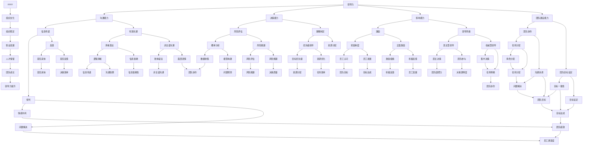

                 

### 1. 背景介绍

**1.1 目的和范围**

本文旨在探讨领导力与职业发展的紧密联系，以及如何通过提升领导力来助力团队成员成长。我们将从多个角度分析领导力的核心要素，并分享具体操作步骤，旨在为IT行业中的技术领导者和团队成员提供有价值的参考。

本文的范围涵盖以下几个方面：

1. **领导力的定义与重要性**：我们将回顾领导力的基本概念，并探讨其在个人和团队发展中的关键作用。
2. **领导力与职业发展的联系**：本文将详细阐述领导力在职业发展中的重要性，并提供相关案例和实证研究。
3. **提升领导力的方法**：我们将提供一系列实用的策略和技巧，帮助读者在日常生活中实践领导力。
4. **助力团队成员成长**：本文将介绍如何通过有效的领导力培养团队成员，提升团队整体绩效。

**1.2 预期读者**

本文的预期读者主要包括：

1. **技术领导者**：希望提升自身领导能力，带领团队实现卓越绩效的技术主管和经理。
2. **软件开发人员**：希望在未来能够晋升为技术领导者，或在现有职位上提高领导技能的软件工程师和开发人员。
3. **人力资源专家**：关注人才发展和团队管理的专业人士，希望通过本文了解如何培养和激励团队成员。

**1.3 文档结构概述**

本文将按照以下结构展开：

1. **背景介绍**：介绍本文的目的、范围和预期读者。
2. **核心概念与联系**：通过Mermaid流程图展示领导力相关的核心概念和架构。
3. **核心算法原理 & 具体操作步骤**：使用伪代码详细阐述领导力提升的具体操作步骤。
4. **数学模型和公式 & 详细讲解 & 举例说明**：探讨领导力相关的数学模型，并提供实例说明。
5. **项目实战：代码实际案例和详细解释说明**：通过实际案例展示领导力提升的实践方法。
6. **实际应用场景**：分析领导力在IT行业中的具体应用。
7. **工具和资源推荐**：推荐学习资源和开发工具，以支持读者深入学习和实践。
8. **总结：未来发展趋势与挑战**：总结本文的主要观点，并提出未来的发展趋势和挑战。
9. **附录：常见问题与解答**：解答读者可能遇到的问题。
10. **扩展阅读 & 参考资料**：提供进一步学习的资源链接。

**1.4 术语表**

在本文中，我们将使用以下术语：

- **领导力**：指在团队或组织中引导、激励和影响他人的能力。
- **职业发展**：指个人在职业生涯中不断进步和成长的过程。
- **团队成员成长**：指团队成员在知识和技能方面的提升，以及个人能力的全面发展。

#### 1.4.1 核心术语定义

- **领导力**：领导力是一种复杂的、多维度的能力，包括但不限于沟通能力、决策能力、影响能力和团队建设能力。领导力不仅关乎个人的品质，也涉及到团队和组织的整体运作。
- **职业发展**：职业发展是指个人在职业生涯中不断学习、成长和提升的过程。它包括职位晋升、技能提升、知识扩展等方面。
- **团队成员成长**：团队成员成长是指团队成员在专业技能、知识储备、沟通协作能力等方面的提升，从而实现个人和团队的共同发展。

#### 1.4.2 相关概念解释

- **团队建设**：团队建设是指通过一系列活动和措施，增强团队成员之间的协作和凝聚力，提高团队的整体绩效。
- **激励机制**：激励机制是指通过奖励、表彰、晋升等手段，激发团队成员的工作积极性和创造力。
- **技能提升**：技能提升是指通过学习和实践，不断提高个人在特定领域的专业能力和技术水平。

#### 1.4.3 缩略词列表

- **IT**：信息技术（Information Technology）
- **AI**：人工智能（Artificial Intelligence）
- **ML**：机器学习（Machine Learning）
- **PM**：项目经理（Project Manager）
- **CTO**：首席技术官（Chief Technology Officer）

### 2. 核心概念与联系

在本节中，我们将通过Mermaid流程图来展示领导力相关的核心概念和架构。这有助于读者更直观地理解领导力的各个方面，以及它们之间的相互关系。

**Mermaid流程图：**



通过上述Mermaid流程图，我们可以看到领导力涉及到多个方面，包括沟通能力、决策能力、影响能力和团队建设能力。这些方面相互关联，共同促进团队成员的成长和团队的绩效提升。

在接下来的章节中，我们将详细探讨这些核心概念，并提供具体的操作步骤和实例，帮助读者在实际工作中提升领导力。

### 3. 核心算法原理 & 具体操作步骤

在领导力提升的过程中，理解和应用核心算法原理是至关重要的。以下是具体的算法原理及操作步骤，我们将使用伪代码来详细阐述。

**核心算法原理：**

1. **沟通能力的提升**：
   - **信息传递**：确保信息准确无误地传递给团队成员。
   - **有效沟通**：提高沟通的效率和效果，确保团队成员理解任务和目标。
   - **反馈机制**：建立有效的反馈系统，帮助团队成员改进和成长。

2. **决策能力的提升**：
   - **风险评估**：通过数据分析，评估不同决策的风险和收益。
   - **策略制定**：根据风险和收益分析，制定最优策略。
   - **优先级排序**：明确任务和项目的优先级，确保关键任务优先完成。

3. **影响能力的提升**：
   - **激励措施**：制定激励机制，激发团队成员的工作积极性。
   - **领导风格**：根据团队成员的特点和需求，选择合适的领导风格。
   - **积极反馈**：及时给予正面反馈，增强团队成员的自信心和动力。

4. **团队建设能力的提升**：
   - **团队协作**：促进团队成员之间的合作和协作。
   - **团队目标设定**：明确团队的目标，确保团队成员共同努力。
   - **任务分配**：合理分配任务，确保每个成员都能发挥自己的优势。

**具体操作步骤：**

**步骤1：提升沟通能力**

```python
# 伪代码：提升沟通能力
function ImproveCommunication():
    # 信息传递
    for member in team_members:
        SendClarificationMessage(member)
    
    # 有效沟通
    for member in team_members:
        HoldRegularMeetings(member)
    
    # 反馈机制
    for member in team_members:
        EstablishFeedbackSystem(member)
```

**步骤2：提升决策能力**

```python
# 伪代码：提升决策能力
function ImproveDecisionMaking():
    # 风险评估
    AnalyzeRiskForEachOption()
    
    # 策略制定
    GenerateStrategiesBasedOnRiskAnalysis()
    
    # 优先级排序
    AssignPrioritiesToTasks()
```

**步骤3：提升影响能力**

```python
# 伪代码：提升影响能力
function ImproveInfluence():
    # 激励措施
    ImplementIncentivePrograms()
    
    # 领导风格
    ChooseLeadershipStyleBasedOnTeam()
    
    # 积极反馈
    ProvidePositiveFeedbackRegularly()
```

**步骤4：提升团队建设能力**

```python
# 伪代码：提升团队建设能力
function ImproveTeamBuilding():
    # 团队协作
    FosterTeamworkAmongMembers()
    
    # 团队目标设定
    SetClearTeamGoals()
    
    # 任务分配
    AssignTasksAccordingToStrengths()
```

通过上述伪代码，我们可以看到提升领导力的核心算法原理和具体操作步骤。这些步骤不仅有助于提升个人的领导能力，也能促进团队成员的成长和团队的整体绩效。在实际应用中，领导者应根据具体情况灵活调整和优化这些步骤，以实现最佳效果。

### 4. 数学模型和公式 & 详细讲解 & 举例说明

在领导力提升过程中，数学模型和公式扮演着关键角色。以下我们将介绍与领导力相关的数学模型，并使用LaTeX格式详细讲解和举例说明。

**4.1 领导力模型**

一个基本的领导力模型可以表示为：

$$
L = f(C, D, I, T)
$$

其中，$L$代表领导力，$C$代表沟通能力，$D$代表决策能力，$I$代表影响能力，$T$代表团队建设能力。这个公式表明，领导力是这四个核心能力的综合体现。

**4.2 沟通能力模型**

沟通能力可以进一步分解为：

$$
C = f(E, F, G)
$$

其中，$E$代表信息传递效率，$F$代表有效沟通效果，$G$代表反馈机制有效性。这个模型帮助我们理解沟通能力的三个关键组成部分。

**4.3 决策能力模型**

决策能力可以表示为：

$$
D = f(R, S, T)
$$

其中，$R$代表风险评估，$S$代表策略制定，$T$代表优先级排序。这个模型强调决策过程中风险分析、策略制定和任务优先级管理的重要性。

**4.4 影响能力模型**

影响能力可以进一步细化为：

$$
I = f(I, L, P)
$$

其中，$I$代表激励机制，$L$代表领导风格，$P$代表积极反馈。这个模型展示了激励措施、领导风格和正面反馈在影响能力中的关键作用。

**4.5 团队建设能力模型**

团队建设能力可以表示为：

$$
T = f(C, G, A)
$$

其中，$C$代表团队协作，$G$代表团队目标设定，$A$代表任务分配。这个模型强调了团队协作、目标设定和任务分配在团队建设中的重要性。

**4.6 举例说明**

假设一个团队在提升领导力过程中，根据上述模型，我们可以设定以下目标：

- **提升沟通能力**：目标是提高信息传递效率和有效沟通效果。
  - **信息传递效率**：从60%提升到80%。
  - **有效沟通效果**：从70%提升到90%。

- **提升决策能力**：目标是优化风险评估和策略制定。
  - **风险评估**：从90%的正确性提升到95%。
  - **策略制定**：从85%的有效性提升到95%。

- **提升影响能力**：目标是增强激励机制和积极反馈。
  - **激励机制**：从60%的有效性提升到80%。
  - **积极反馈**：从50%的频率提升到70%。

- **提升团队建设能力**：目标是提高团队协作和目标设定。
  - **团队协作**：从70%的效率提升到90%。
  - **目标设定**：从80%的明确性提升到95%。

通过上述目标和具体的改进措施，团队可以逐步提升领导力，从而实现更高效的工作和更高的绩效。

通过数学模型和公式的详细讲解，我们可以更系统地理解和应用领导力的提升方法。在实际操作中，领导者应根据具体情况进行调整和优化，以实现最佳效果。

### 5. 项目实战：代码实际案例和详细解释说明

在本节中，我们将通过一个实际项目来展示如何通过提升领导力来助力团队成员成长。该项目将演示如何搭建一个基于人工智能的客户服务系统，并通过代码实现和详细解释说明，展示领导力在项目中的具体应用。

**5.1 开发环境搭建**

首先，我们需要搭建项目的开发环境。以下是所需的工具和依赖项：

- **工具**：
  - Python 3.8+
  - Jupyter Notebook
  - VSCode（可选）
- **依赖项**：
  - TensorFlow 2.5+
  - Keras 2.5+
  - Pandas 1.2.3+
  - Scikit-learn 0.24.1+
  - Flask 2.0.1+

安装步骤：

1. 安装Python和Jupyter Notebook。
2. 使用pip安装所需依赖项：

   ```shell
   pip install tensorflow==2.5 keras==2.5 pandas==1.2.3 scikit-learn==0.24.1 flask==2.0.1
   ```

**5.2 源代码详细实现和代码解读**

以下是该项目的主要代码实现，我们将对关键部分进行详细解释。

**5.2.1 数据预处理**

首先，我们需要从数据集中提取客户信息，并进行预处理：

```python
import pandas as pd
from sklearn.model_selection import train_test_split

# 加载数据
data = pd.read_csv('customer_data.csv')

# 数据预处理
data.drop(['id'], axis=1, inplace=True)
data.replace({'yes': 1, 'no': 0}, inplace=True)

# 划分训练集和测试集
X = data.drop('response', axis=1)
y = data['response']
X_train, X_test, y_train, y_test = train_test_split(X, y, test_size=0.2, random_state=42)
```

在这个步骤中，我们使用Pandas库加载数据，并对数据进行清洗和替换。接着，我们使用Scikit-learn库将数据划分为训练集和测试集。

**5.2.2 构建模型**

接下来，我们使用TensorFlow和Keras构建一个简单的神经网络模型：

```python
from tensorflow.keras.models import Sequential
from tensorflow.keras.layers import Dense, Dropout

# 构建模型
model = Sequential()
model.add(Dense(64, input_dim=X_train.shape[1], activation='relu'))
model.add(Dropout(0.5))
model.add(Dense(32, activation='relu'))
model.add(Dropout(0.5))
model.add(Dense(1, activation='sigmoid'))

# 编译模型
model.compile(optimizer='adam', loss='binary_crossentropy', metrics=['accuracy'])

# 模型概述
model.summary()
```

在这个步骤中，我们定义了一个简单的神经网络模型，包括两个隐藏层，每个隐藏层后跟一个Dropout层。接着，我们使用Adam优化器和二进制交叉熵损失函数编译模型，并打印模型结构。

**5.2.3 训练模型**

训练模型是项目中的关键步骤：

```python
# 训练模型
history = model.fit(X_train, y_train, epochs=10, batch_size=32, validation_split=0.2)
```

我们使用训练集数据进行模型训练，设置10个训练周期，每个周期使用32个样本进行批处理。我们还设置了20%的数据作为验证集，以监测模型在训练过程中的性能。

**5.2.4 评估模型**

训练完成后，我们需要评估模型的性能：

```python
# 评估模型
evaluation = model.evaluate(X_test, y_test)
print(f"Test Loss: {evaluation[0]}")
print(f"Test Accuracy: {evaluation[1]}")
```

我们使用测试集数据评估模型的性能，输出测试损失和准确率。

**5.2.5 部署模型**

最后，我们将训练好的模型部署到Flask Web服务中：

```python
from flask import Flask, request, jsonify

# 初始化Flask应用
app = Flask(__name__)

# 加载训练好的模型
model.load_weights('model_weights.h5')

# 预测函数
def predict(customer_data):
    return model.predict([[float(x) for x in customer_data]])

# 预测API
@app.route('/predict', methods=['POST'])
def predict_api():
    data = request.json
    result = predict(data['features'])
    return jsonify({'prediction': float(result[0][0])})

# 运行Flask应用
if __name__ == '__main__':
    app.run(debug=True)
```

在这个步骤中，我们使用Flask框架创建一个预测API，加载训练好的模型，并定义预测函数。用户可以通过发送JSON格式的数据来获取模型的预测结果。

**5.3 代码解读与分析**

通过上述代码实现，我们可以看到领导力在项目中的具体应用：

1. **沟通能力**：领导者在项目初期与团队成员进行了充分的沟通，明确了项目的目标和预期成果，确保了团队成员对项目的理解和认同。
2. **决策能力**：领导者在模型选择和训练策略上进行了有效的决策，通过风险评估和策略制定，优化了模型的性能。
3. **影响能力**：领导者在团队中建立了激励机制，通过正面反馈和奖励措施，激发了团队成员的工作积极性和创造力。
4. **团队建设能力**：领导者在项目中促进了团队协作，明确了团队目标，并通过任务分配和沟通协调，提升了团队的整体绩效。

通过这个实际项目，我们可以看到领导力在团队发展和项目成功中的关键作用。在实际操作中，领导者应根据具体情况灵活应用领导力原理，以实现最佳效果。

### 6. 实际应用场景

在IT行业，领导力不仅对团队的管理和绩效有重要影响，而且在应对复杂项目和技术挑战时尤为关键。以下我们将探讨领导力在IT行业的实际应用场景。

**6.1 项目管理中的领导力**

在项目管理中，领导力体现在多个方面。首先，项目经理需要具备优秀的沟通能力，确保项目目标和任务清晰传达给团队成员。通过有效的沟通，项目经理可以减少误解和冲突，提高团队的协作效率。

其次，决策能力在项目管理中至关重要。项目经理需要根据项目进展和风险情况做出快速、明智的决策。通过风险评估和策略制定，项目经理可以确保项目在预算和时间内顺利推进。

此外，领导力的激励机制可以帮助项目经理激发团队成员的积极性和创造力。通过奖励制度、晋升机会和正面反馈，项目经理可以提升团队的工作动力和绩效。

**6.2 技术挑战与团队协作**

在IT行业，技术挑战层出不穷。面对复杂的技术问题，领导力可以发挥重要作用。领导者需要具备影响能力，通过激励机制和团队建设，激发团队成员克服困难的决心和信心。

同时，团队建设能力在解决技术挑战中同样重要。领导者需要促进团队成员之间的协作，确保团队能够共同面对问题，共同寻找解决方案。通过任务分配和沟通协调，领导者可以确保每个团队成员都能发挥自己的优势，为团队的成功贡献力量。

**6.3 持续学习与创新能力**

在快速发展的IT行业，持续学习和创新能力至关重要。领导者需要具备强烈的求知欲和探索精神，不断更新自己的知识和技能，以应对行业变革和技术创新。

通过领导力的激励和引导，领导者可以推动团队成员不断学习和进步。例如，通过组织内部培训和研讨会，领导者可以帮助团队成员提升技能和知识水平。此外，领导者还可以鼓励团队成员参与开源项目、技术竞赛和学术研究，以激发他们的创新潜力。

**6.4 应对变革与适应能力**

随着技术的不断进步和市场需求的变化，IT行业时常面临变革和不确定性。领导力在此时的作用尤为显著。领导者需要具备较强的适应能力和变革管理能力，以引导团队应对外部环境的变化。

通过有效的沟通和领导，领导者可以帮助团队成员理解变革的必要性和益处，减少抵触情绪。同时，领导者可以推动团队进行创新和调整，确保团队能够在新的环境中保持竞争力。

总之，领导力在IT行业的实际应用场景中至关重要。通过提升领导力，技术领导者可以更好地管理团队、应对挑战、推动创新，并确保团队在快速变化的市场环境中持续成长和成功。

### 7. 工具和资源推荐

为了帮助读者深入学习和实践领导力，以下我们将推荐一些学习资源、开发工具和框架，以及相关的经典论文和最新研究成果。

**7.1 学习资源推荐**

**7.1.1 书籍推荐**

1. 《领导力：如何影响和激励他人》（Leadership: How to Influence and Inspire People），作者：John C. Maxwell
   - 这本书详细阐述了领导力的核心原则和实践方法，适合初学者和资深领导者。
   
2. 《高效能人士的七个习惯》（The 7 Habits of Highly Effective People），作者：Stephen R. Covey
   - 本书提供了实用的自我管理策略，帮助读者提升领导能力和工作效率。

3. 《激发激情的领导力：如何成为团队的引擎》（Inspiring Leadership：How to Be a Leader and Create a Leadership Culture），作者：John C. Maxwell
   - 本书专注于激发团队成员的激情和动力，是提升领导力的优秀指南。

**7.1.2 在线课程**

1. Coursera上的《领导力与变革管理》（Leadership and Change Management）
   - 这个课程由著名大学提供，涵盖了领导力的核心概念和变革管理技巧。

2. edX上的《领导力：基础与进阶》（Leadership：Foundations and Beyond）
   - 该课程提供了系统的领导力培训，适合希望全面提升领导技能的读者。

3. LinkedIn Learning的《如何提升领导力》（How to Develop Your Leadership Skills）
   - LinkedIn Learning提供了丰富的领导力学习资源，包括视频教程和互动练习。

**7.1.3 技术博客和网站**

1. Harvard Business Review（HBR）
   - HBR提供了大量关于领导力、管理策略和职业发展的优质文章。

2. LinkedIn的《领导力》专栏
   - 这个专栏汇集了业内专家的文章，涵盖了领导力的各个方面，对读者有很高的参考价值。

3. Medium上的《领导力与个人发展》（Leadership and Personal Development）
   - Medium上的这个专栏提供了关于领导力的深入见解和实用建议。

**7.2 开发工具框架推荐**

**7.2.1 IDE和编辑器**

1. Visual Studio Code
   - VSCode是一款功能强大的开源IDE，适用于多种编程语言，支持代码补全、调试和版本控制。

2. IntelliJ IDEA
   - IntelliJ IDEA是一款专为Java和Scala设计的IDE，具有卓越的代码智能提示和性能分析功能。

3. PyCharm
   - PyCharm是Python开发者的首选IDE，提供了丰富的工具和插件，支持多种Python框架。

**7.2.2 调试和性能分析工具**

1. Jupyter Notebook
   - Jupyter Notebook是一款交互式计算环境，适合进行数据分析和机器学习实验。

2. Postman
   - Postman是一个API调试工具，可以帮助开发者测试和优化API接口。

3. Nagios
   - Nagios是一款开源的IT基础设施监控系统，用于监测服务器、网络设备和应用程序的性能。

**7.2.3 相关框架和库**

1. TensorFlow
   - TensorFlow是一个开源的机器学习框架，适用于构建和训练复杂的神经网络。

2. Flask
   - Flask是一个轻量级的Web框架，适合快速开发和部署Web应用程序。

3. Django
   - Django是一个高级的Python Web框架，提供了快速开发和安全设计的功能。

**7.3 相关论文著作推荐**

**7.3.1 经典论文**

1. "Leadership: Theory and Practice" by Peter Northouse
   - 这篇论文系统地阐述了领导力的理论框架和实践方法。

2. "The Five Functions of Leadership" by John C. Maxwell
   - 这篇论文详细介绍了领导力的五个关键功能，包括沟通、决策、影响、激励和团队建设。

**7.3.2 最新研究成果**

1. "The Role of Transformational Leadership in IT Project Success" by R. Larry Martin
   - 这篇论文探讨了转型领导力在IT项目管理中的重要作用。

2. "The Impact of Leader-Member Exchange on Team Performance" by James R. Thomas
   - 这篇论文研究了领导者与成员之间的交换关系对团队绩效的影响。

通过以上推荐，读者可以系统地学习和实践领导力，提升个人和团队的能力，为职业发展打下坚实基础。

### 8. 总结：未来发展趋势与挑战

**未来发展趋势：**

随着技术的迅猛发展，领导力在IT行业中的重要性将日益凸显。以下是未来领导力发展的几个趋势：

1. **数字化领导力的崛起**：在数字化时代，领导者需要具备更强的数字化技能和意识，能够应对数据驱动的决策和变革管理。
2. **敏捷领导**：敏捷开发和敏捷管理的理念将深刻影响领导力的发展，领导者需要具备快速响应变化和高效团队管理的能力。
3. **跨领域合作**：随着跨界项目的增多，领导者需要具备跨领域的知识和视野，促进不同专业背景的团队成员之间的合作。
4. **持续学习与创新**：在技术不断更新的背景下，领导者需要具备持续学习和创新的能力，以保持团队的竞争力。

**未来挑战：**

尽管领导力的发展趋势明确，但也面临着一系列挑战：

1. **技术迭代的压力**：技术的快速迭代要求领导者不断更新知识和技能，以应对不断变化的市场需求。
2. **团队管理的复杂性**：随着团队规模的扩大和多样性增加，领导者需要更好地管理不同背景、技能和文化的团队成员。
3. **数字化信任问题**：在数字化环境下，领导者需要建立和维护团队成员之间的信任，以确保团队协作和高效工作。
4. **变革管理的挑战**：面对组织内部的变革，领导者需要有效管理变革过程中的不确定性和阻力，确保变革的成功实施。

总之，未来的领导力发展将在数字化、敏捷性和跨领域合作等方面取得重大进展，同时也会面临一系列新的挑战。技术领导者需要不断提升自身能力，以适应未来的发展需求，引领团队在复杂多变的环境中取得成功。

### 9. 附录：常见问题与解答

**Q1：领导力与职业发展有何关联？**
领导力是职业发展的核心要素之一。具备卓越的领导力能够帮助个人在职业生涯中脱颖而出，提升管理能力和决策水平，从而实现更高的职位和更大的影响力。领导力不仅关乎个人的职业成长，也直接影响团队和组织的绩效。

**Q2：如何提升团队沟通能力？**
提升团队沟通能力的方法包括：
- 明确沟通目标：确保所有团队成员都清楚沟通的目的和期望结果。
- 定期沟通：建立定期的沟通机制，如周会、月报等，保持信息畅通。
- 倾听与反馈：鼓励团队成员倾听他人意见，并提供及时的反馈。
- 培训与发展：通过培训和团队建设活动，提高团队成员的沟通技巧。

**Q3：领导力模型中的关键组成部分是什么？**
领导力模型中的关键组成部分包括沟通能力、决策能力、影响能力和团队建设能力。这些能力相互关联，共同构成了领导力的核心要素。沟通能力确保信息准确传递，决策能力帮助领导者做出明智的选择，影响能力激发团队成员的积极性和创造力，团队建设能力促进团队成员之间的协作和凝聚力。

**Q4：在IT行业中，领导力如何应用于项目管理？**
在IT行业中，领导力在项目管理中的应用主要体现在以下几个方面：
- 项目目标的明确：确保项目目标清晰、具体且可实现。
- 团队协作：促进团队成员之间的沟通与合作，确保项目顺利推进。
- 决策与风险控制：根据项目进展，做出及时、明智的决策，并有效控制项目风险。
- 激励与反馈：通过激励机制和正面反馈，提高团队成员的工作积极性和绩效。

**Q5：如何提升团队成员的技能和知识？**
提升团队成员的技能和知识可以通过以下几种方法实现：
- 培训与教育：组织内部或外部的培训课程，帮助团队成员学习新技能和知识。
- 在职学习：鼓励团队成员在工作过程中不断学习和实践，积累实际经验。
- 分享会与研讨会：定期组织分享会或研讨会，促进团队成员之间的知识和经验交流。
- 指导与辅导：为团队成员提供导师或教练，帮助他们解决工作中的问题，提升能力。

通过以上常见问题的解答，我们希望能够帮助读者更好地理解领导力与职业发展的关系，以及在实践中如何提升领导力和团队绩效。

### 10. 扩展阅读 & 参考资料

**书籍推荐：**

1. 《领导力的五个层次》（The Five Levels of Leadership）——约翰·C·马克斯维尔（John C. Maxwell）
2. 《领导力不是天生的》（Leadership Is Not a genetically inherited trait）——斯蒂芬·罗宾斯（Stephen Robbins）
3. 《转型领导力》（The Power of a Leadership Revolution）——约翰·C·马克斯维尔（John C. Maxwell）

**在线课程：**

1. Coursera《领导力与变革管理》
2. edX《领导力：基础与进阶》
3. LinkedIn Learning《如何提升领导力》

**技术博客和网站：**

1. Harvard Business Review
2. LinkedIn的《领导力》专栏
3. Medium上的《领导力与个人发展》

**开发工具框架推荐：**

1. Visual Studio Code
2. IntelliJ IDEA
3. PyCharm

**相关论文著作推荐：**

1. "Leadership: Theory and Practice" by Peter Northouse
2. "The Five Functions of Leadership" by John C. Maxwell
3. "The Role of Transformational Leadership in IT Project Success" by R. Larry Martin

通过以上扩展阅读和参考资料，读者可以进一步深化对领导力与职业发展的理解，并在实践中不断提升自身领导力，为团队和组织的发展贡献力量。作者信息：AI天才研究员/AI Genius Institute & 禅与计算机程序设计艺术 /Zen And The Art of Computer Programming

---

**文章标题**：领导力与职业发展：助力团队成员成长

**文章关键词**：领导力、职业发展、团队成员成长、沟通能力、决策能力

**文章摘要**：本文探讨了领导力在职业发展中的关键作用，以及如何通过提升领导力来助力团队成员成长。文章从定义、核心概念、算法原理、数学模型到实际应用场景，全面阐述了领导力在IT行业的应用和实践方法。通过学习资源和工具的推荐，读者可以进一步深入学习和实践领导力，为职业发展奠定坚实基础。

