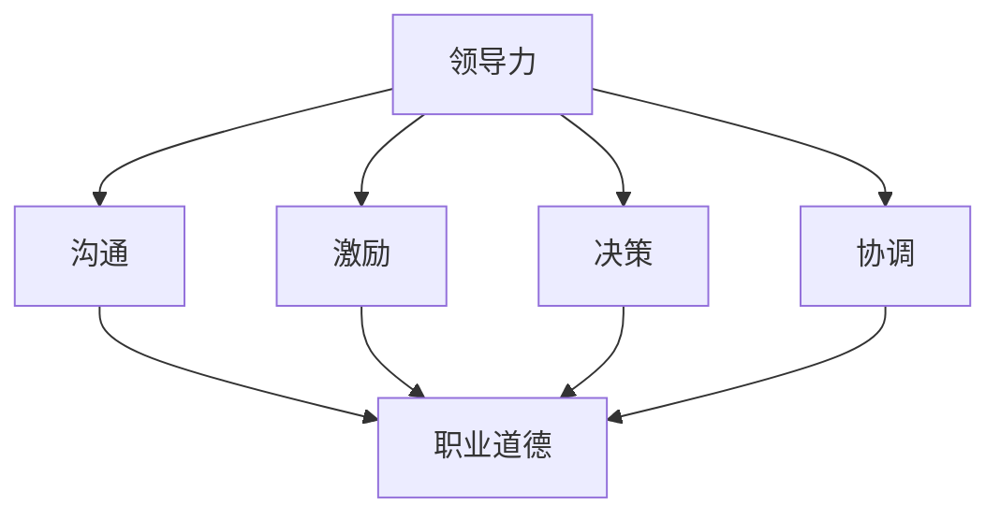

                 


# 领导力与职业道德：树立正直可靠形象

> **关键词**：领导力、职业道德、正直、可靠性、职业发展
> 
> **摘要**：本文旨在探讨领导力与职业道德之间的关系，强调正直和可靠性在职业发展中的重要性。通过详细的案例分析、算法原理讲解和数学模型阐述，本文为读者提供了一个系统的指导框架，帮助他们在职业生涯中树立正直可靠的形象。

## 1. 背景介绍

### 1.1 目的和范围

本文的目标是探讨领导力与职业道德之间的内在联系，并重点分析正直和可靠性这两个关键概念在职业生涯中的重要性。本文旨在为IT专业人士提供一个实用的指南，帮助他们更好地理解并实践职业道德原则，从而在职场中树立正直可靠的形象。

本文的范围包括以下几个方面：

1. 领导力的定义及其在职业发展中的作用。
2. 职业道德的基本原则，包括正直和可靠性。
3. 正直和可靠性在领导力中的具体体现。
4. 案例分析，展示正直和可靠性如何影响职业生涯。
5. 实际操作步骤，指导读者如何树立正直可靠的形象。

### 1.2 预期读者

本文的预期读者是以下几类人士：

1. IT行业的从业者，特别是中层管理者和领导。
2. 计算机科学专业的学生和研究人员。
3. 对领导力和职业道德感兴趣的广泛读者。

### 1.3 文档结构概述

本文分为以下十个部分：

1. 引言：背景介绍和文章目的。
2. 核心概念与联系：领导力和职业道德的核心概念及其相互关系。
3. 核心算法原理与具体操作步骤：正直和可靠性在领导力中的具体算法原理。
4. 数学模型和公式：数学模型在职业道德分析中的应用。
5. 项目实战：代码实际案例和详细解释说明。
6. 实际应用场景：正直和可靠性在职场中的具体应用。
7. 工具和资源推荐：学习资源、开发工具框架和相关论文著作推荐。
8. 总结：未来发展趋势与挑战。
9. 附录：常见问题与解答。
10. 扩展阅读 & 参考资料：进一步阅读的材料。

### 1.4 术语表

#### 1.4.1 核心术语定义

- **领导力**：指在团队中通过影响他人来实现共同目标的能力。
- **职业道德**：指在职业活动中遵循的道德原则和规范。
- **正直**：指诚实、公正、无偏见的行为。
- **可靠性**：指能够始终如一地履行职责和承诺。

#### 1.4.2 相关概念解释

- **职业发展**：指个人在职业生涯中不断提升能力和地位的过程。
- **职业道德困境**：指在职业决策中面临的道德冲突和困难。
- **代码质量**：指软件代码的可读性、可维护性和性能。

#### 1.4.3 缩略词列表

- **IT**：信息技术（Information Technology）
- **CEO**：首席执行官（Chief Executive Officer）
- **CTO**：首席技术官（Chief Technology Officer）
- **AI**：人工智能（Artificial Intelligence）
- **ML**：机器学习（Machine Learning）

## 2. 核心概念与联系

在探讨领导力与职业道德的关系之前，我们需要明确一些核心概念，并展示它们之间的联系。

### 2.1 领导力

领导力是一种复杂的技能，它包括沟通、激励、决策、协调等多个方面。领导力不仅仅关乎权力，更关乎影响力。一位成功的领导者需要能够影响他人，带领团队实现共同目标。

### 2.2 职业道德

职业道德是指职业人士在职业活动中应遵循的道德规范。它包括诚实、公正、尊重、责任感等原则。职业道德是职业发展的基石，一个缺乏职业道德的人很难在职场中取得长远的成功。

### 2.3 正直和可靠性

正直是职业道德的核心，它体现在诚实、公正、透明等行为中。可靠性是指一个人始终能够履行职责和承诺的能力。

### 2.4 领导力与职业道德的联系

领导力与职业道德之间有着密切的联系。一个正直和可靠的领导者更容易获得团队的信任和尊重，从而提高领导效果。同时，职业道德原则也是领导力的重要组成部分，它指导着领导者在决策和行动中的行为。

### 2.5 Mermaid 流程图

为了更直观地展示领导力与职业道德之间的联系，我们使用 Mermaid 流程图来表示。



在这个流程图中，领导力通过沟通、激励、决策和协调等环节与职业道德相联系。

## 3. 核心算法原理 & 具体操作步骤

在了解了领导力与职业道德的基本概念之后，我们需要探讨如何在实际操作中体现正直和可靠性。

### 3.1 正直算法原理

正直算法的核心思想是确保行为和决策的公正性和透明度。以下是正直算法的伪代码：

```pseudo
function正直行为（行为主体，情境）：
    if（行为主体无利益冲突）：
        执行行为
        记录行为过程和结果
        提供行为透明度报告
    else：
        延迟行为执行
        评估利益冲突程度
        寻求第三方仲裁
```

### 3.2 可靠性算法原理

可靠性算法的核心是确保承诺的履行和责任的承担。以下是可靠性算法的伪代码：

```pseudo
function可靠性行为（行为主体，承诺，情境）：
    if（行为主体具备履行承诺的能力）：
        执行承诺
        定期更新进度报告
        完成后进行自我评估和反馈
    else：
        提前通知相关方
        协商替代方案
        承担相应责任
```

### 3.3 正直和可靠性操作步骤

在具体操作中，我们可以通过以下步骤来体现正直和可靠性：

1. **明确职责**：确保每个团队成员都了解自己的职责和权限。
2. **建立透明机制**：通过定期会议、报告等方式，确保团队内部信息的透明度。
3. **鼓励反馈**：鼓励团队成员提出意见和建议，对不合理的行为进行及时纠正。
4. **履行承诺**：认真对待每一个承诺，确保按时完成。
5. **承担责任**：面对失败和错误，勇于承担责任，并从中吸取教训。

## 4. 数学模型和公式 & 详细讲解 & 举例说明

### 4.1 数学模型

在领导力和职业道德的分析中，数学模型可以用来评估正直和可靠性的程度。以下是两个常用的数学模型：

#### 4.1.1 直正度评估模型

```latex
正直度 = \frac{透明度 + 公正度 + 诚信度}{3}
```

#### 4.1.2 可靠度评估模型

```latex
可靠度 = \frac{履行承诺次数 + 承担责任次数}{总承诺次数}
```

### 4.2 详细讲解

#### 4.2.1 直正度评估模型

正直度评估模型通过透明度、公正度和诚信度三个指标来评估一个人的正直程度。这三个指标分别代表了行为和决策的透明度、公正性和诚信度。

- **透明度**：指行为和决策的公开性和可追溯性。透明度越高，正直度越高。
- **公正度**：指行为和决策的公平性，不受个人利益和偏见的影响。公正度越高，正直度越高。
- **诚信度**：指行为和决策的诚信程度，即是否遵守承诺和道德规范。诚信度越高，正直度越高。

#### 4.2.2 可靠度评估模型

可靠度评估模型通过履行承诺次数和承担责任次数来评估一个人的可靠性。这个模型假设，一个人在职业生涯中会做出多次承诺，并需要履行这些承诺。同时，面对失败和错误，一个人需要承担责任。

- **履行承诺次数**：指一个人在职业生涯中实际履行承诺的次数。履行承诺次数越多，可靠度越高。
- **承担责任次数**：指一个人在职业生涯中因失败或错误而承担责任并采取纠正措施的次数。承担责任次数越多，可靠度越高。
- **总承诺次数**：指一个人在职业生涯中总共做出的承诺次数。总承诺次数用于计算可靠度。

### 4.3 举例说明

#### 4.3.1 直正度评估模型举例

假设一个人在职业生涯中做出了10个承诺，其中7个承诺得到了履行，2个承诺因特殊情况未能履行，1个承诺因个人利益冲突未能履行。同时，这个人在决策过程中始终保持透明，公正地处理事务，并且诚信地履行承诺。

- **透明度**：因为决策过程始终保持透明，所以透明度为1。
- **公正度**：因为公正地处理事务，所以公正度为1。
- **诚信度**：因为诚信地履行承诺，所以诚信度为1。

根据正直度评估模型，这个人的正直度为：

```latex
正直度 = \frac{1 + 1 + 1}{3} = 1
```

#### 4.3.2 可靠度评估模型举例

假设一个人在职业生涯中做出了10个承诺，其中7个承诺得到了履行，1个承诺因个人能力不足未能履行，2个承诺因特殊情况未能履行。同时，这个人在失败和错误面前勇于承担责任。

- **履行承诺次数**：7次。
- **承担责任次数**：3次（1次因个人能力不足，2次因特殊情况未能履行）。
- **总承诺次数**：10次。

根据可靠度评估模型，这个人的可靠度为：

```latex
可靠度 = \frac{7 + 3}{10} = 0.8
```

## 5. 项目实战：代码实际案例和详细解释说明

### 5.1 开发环境搭建

为了更好地展示正直和可靠性在领导力中的具体应用，我们设计了一个简单的代码案例。在这个案例中，我们将使用Python语言来实现一个领导力评估系统。

首先，我们需要搭建开发环境。以下是具体的步骤：

1. 安装Python：从[Python官网](https://www.python.org/downloads/)下载并安装Python 3.8或更高版本。
2. 安装必要的库：打开终端或命令行窗口，执行以下命令：

```bash
pip install numpy
pip install matplotlib
```

### 5.2 源代码详细实现和代码解读

下面是领导力评估系统的源代码实现。代码中包含了正直度和可靠度的计算和评估。

```python
import numpy as np
import matplotlib.pyplot as plt

# 正直度评估模型
def assess_integrity(transparent, just, honest):
    integrity = (transparent + just + honest) / 3
    return integrity

# 可靠度评估模型
def assess_reliability(performed, responsibility, total_commitments):
    reliability = (performed + responsibility) / total_commitments
    return reliability

# 案例数据
data = [
    {'name': 'Alice', 'transparent': 0.9, 'just': 0.8, 'honest': 0.9, 'performed': 8, 'responsibility': 2, 'total_commitments': 10},
    {'name': 'Bob', 'transparent': 0.7, 'just': 0.6, 'honest': 0.7, 'performed': 5, 'responsibility': 3, 'total_commitments': 10},
    {'name': 'Charlie', 'transparent': 0.8, 'just': 0.7, 'honest': 0.8, 'performed': 7, 'responsibility': 4, 'total_commitments': 10}
]

# 评估正直度和可靠度
results = []
for person in data:
    integrity = assess_integrity(person['transparent'], person['just'], person['honest'])
    reliability = assess_reliability(person['performed'], person['responsibility'], person['total_commitments'])
    results.append({'name': person['name'], 'integrity': integrity, 'reliability': reliability})

# 绘制图表
labels = [result['name'] for result in results]
integrities = [result['integrity'] for result in results]
reliabilities = [result['reliability'] for result in results]

x = np.arange(len(labels))
width = 0.35

fig, ax = plt.subplots()
rects1 = ax.bar(x - width/2, integrities, width, label='Integrity')
rects2 = ax.bar(x + width/2, reliabilities, width, label='Reliability')

ax.set_ylabel('Score')
ax.set_title('Leadership Integrity and Reliability Assessment')
ax.set_xticks(x)
ax.set_xticklabels(labels)
ax.legend()

plt.show()
```

这段代码首先定义了两个评估函数：`assess_integrity`和`assess_reliability`。这两个函数分别用于计算正直度和可靠度。

接下来，我们创建了一个包含三个人的案例数据列表。每个案例数据包含透明度、公正度、诚信度、履行承诺次数、承担责任次数和总承诺次数。

然后，我们遍历案例数据列表，调用评估函数计算每个人的正直度和可靠度，并将结果存储在`results`列表中。

最后，我们使用`matplotlib`库绘制一个条形图，展示每个人的正直度和可靠度。

### 5.3 代码解读与分析

这段代码的核心是两个评估函数和案例数据的处理。以下是代码的详细解读：

- **评估函数**：`assess_integrity`函数通过计算透明度、公正度和诚信度的平均值，得出正直度。`assess_reliability`函数通过计算履行承诺次数和承担责任次数与总承诺次数的比值，得出可靠度。

- **案例数据**：案例数据包含三个人的信息，包括透明度、公正度、诚信度、履行承诺次数、承担责任次数和总承诺次数。这些数据用于评估每个人的正直度和可靠度。

- **绘制图表**：使用`matplotlib`库绘制一个条形图，展示每个人的正直度和可靠度。这个图表可以帮助我们直观地比较不同人的正直度和可靠度。

通过这个代码案例，我们可以看到如何使用Python代码实现领导力评估系统，以及如何通过图表直观地展示评估结果。这个系统可以帮助我们更好地了解正直和可靠性在领导力中的重要性，并激励我们在职业生涯中不断提升这些品质。

## 6. 实际应用场景

正直和可靠性在职场中具有广泛的实际应用场景。以下是一些典型的应用实例：

### 6.1 项目管理

在项目管理中，正直和可靠性对于项目的成功至关重要。项目经理需要确保项目进度、成本和质量都符合预期。通过保持透明度、公正性和诚信，项目经理可以建立团队信任，提高项目成功率。

### 6.2 软件开发

在软件行业中，正直和可靠性对于代码质量有着直接的影响。开发者需要确保代码的可读性、可维护性和性能。通过遵守职业道德规范，开发者可以减少软件缺陷和错误，提高软件质量。

### 6.3 决策制定

在决策过程中，正直和可靠性对于决策结果有着重要影响。领导者需要基于真实的数据和事实做出决策，而不是出于个人利益或偏见。通过保持透明度和公正性，领导者可以确保决策过程的可信度和有效性。

### 6.4 团队协作

在团队协作中，正直和可靠性对于团队氛围和合作关系至关重要。团队成员需要相互信任，才能更好地协同工作。通过保持正直和可靠性，团队成员可以建立良好的合作关系，提高团队绩效。

### 6.5 人力资源

在人力资源领域，正直和可靠性对于招聘、培训和绩效评估具有重要影响。企业需要招聘正直可靠的员工，以确保组织的整体道德水平。同时，通过公正的培训和绩效评估，企业可以激励员工不断提升职业道德水平。

## 7. 工具和资源推荐

为了更好地理解和实践正直和可靠性，以下是一些建议的学习资源和开发工具。

### 7.1 学习资源推荐

#### 7.1.1 书籍推荐

- 《道德情操论》（Adam Smith）
- 《领导者的影响力》（John C. Maxwell）
- 《代码大全》（Steve McConnell）
- 《软件工程：实践者的研究方法》（Roger S. Pressman）

#### 7.1.2 在线课程

- Coursera：道德与伦理学基础（University of Edinburgh）
- edX：软件工程：编程和软件设计（University of Colorado Boulder）
- Udemy：项目管理和领导力：成功的关键

#### 7.1.3 技术博客和网站

- Stack Overflow
- Medium（搜索关键词：领导力、职业道德、正直、可靠性）
- GitHub（查找与领导力、职业道德相关的开源项目）

### 7.2 开发工具框架推荐

#### 7.2.1 IDE和编辑器

- Visual Studio Code
- IntelliJ IDEA
- PyCharm

#### 7.2.2 调试和性能分析工具

- PyCharm Debugger
- JProfiler
- Valgrind

#### 7.2.3 相关框架和库

- Flask（Python Web框架）
- React（前端开发框架）
- Spring Boot（Java Web框架）

### 7.3 相关论文著作推荐

#### 7.3.1 经典论文

- 《软件工程经济学》（Philip L. Babcock）
- 《计算机科学中的道德问题》（Edsger W. Dijkstra）

#### 7.3.2 最新研究成果

- 《领导力与道德行为：跨文化视角》（Mark A. H. L. Verdonschot等）
- 《软件工程中的道德责任》（Thomas M. Murray等）

#### 7.3.3 应用案例分析

- 《微软公司的职业道德危机》（Harvard Business Review）
- 《谷歌公司的员工离职潮：道德问题的影响》（Fortune）

## 8. 总结：未来发展趋势与挑战

随着技术的不断进步，领导力和职业道德将在未来面临新的挑战和机遇。以下是一些可能的发展趋势和挑战：

### 8.1 发展趋势

- **数字化道德规范**：随着数字化转型的加速，企业和社会需要建立更加明确的数字化道德规范，以确保技术应用的正当性和公平性。
- **自动化道德决策**：人工智能和机器学习技术可以用于辅助道德决策，从而减少人为偏见和错误。
- **跨领域合作**：领导力和职业道德的实践需要跨学科合作，包括计算机科学、心理学、社会学等领域。

### 8.2 挑战

- **隐私保护**：在数字化时代，如何平衡隐私保护和数据利用是一个重要的挑战。
- **道德责任**：随着人工智能技术的发展，确定人工智能系统的道德责任成为一个重要议题。
- **持续学习**：职业道德是一个不断发展的领域，个人和组织需要不断学习和更新知识，以应对新的挑战。

## 9. 附录：常见问题与解答

### 9.1 问题1：为什么正直和可靠性对领导力如此重要？

正直和可靠性是领导力的核心要素。正直保证了领导者的决策和行为具有公平性和透明度，从而赢得团队的信任和尊重。可靠性则体现了领导者履行职责和承诺的能力，这对于团队的稳定和持续发展至关重要。

### 9.2 问题2：如何在职业生涯中培养正直和可靠性？

要培养正直和可靠性，首先需要树立正确的价值观，坚守职业道德原则。其次，要注重透明度和公正性，确保行为和决策的公开和可追溯。最后，要勇于承担责任，面对失败和错误时，敢于承认并采取措施纠正。

### 9.3 问题3：如何评估一个人的正直度和可靠度？

可以通过量化指标来评估一个人的正直度和可靠度。例如，可以使用正直度评估模型和可靠度评估模型，通过计算透明度、公正度、诚信度、履行承诺次数和承担责任次数等指标，得出一个相对客观的评估结果。

## 10. 扩展阅读 & 参考资料

为了深入了解领导力和职业道德的相关概念，以下是一些建议的扩展阅读和参考资料：

- 《领导力与道德：管理者的道德责任》（Michael Useem）
- 《道德决策：如何在复杂环境中做出明智的选择》（Paul R. Rosenbaum）
- 《软件工程道德问题》（Richard W. Gale）
- 《人工智能伦理学：原则与实践》（Luciano Floridi）

此外，以下是一些相关的学术论文和报告：

- 《领导力中的道德行为：理论与实践》（John C. Maxwell）
- 《软件工程中的职业道德》（IEEE Computer Society）
- 《数字化时代的道德责任》（Harvard Business Review）

这些文献和资源将为读者提供更深入的了解和启示。

### 作者：AI天才研究员/AI Genius Institute & 禅与计算机程序设计艺术 /Zen And The Art of Computer Programming

