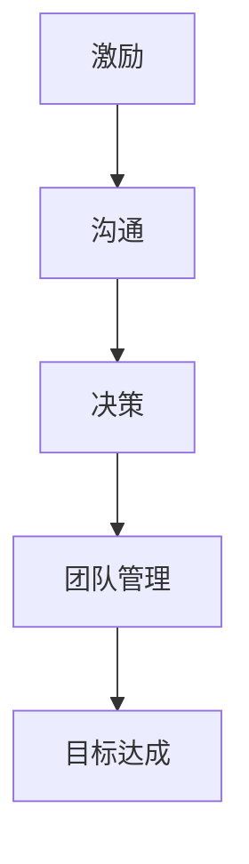
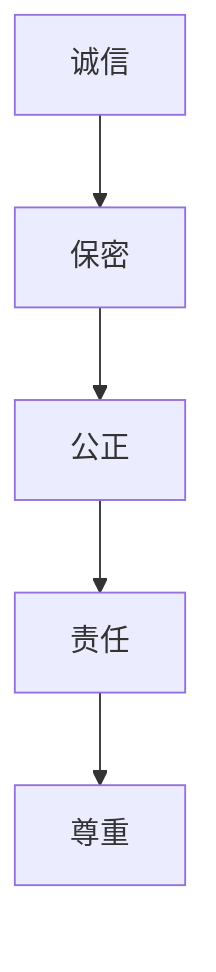
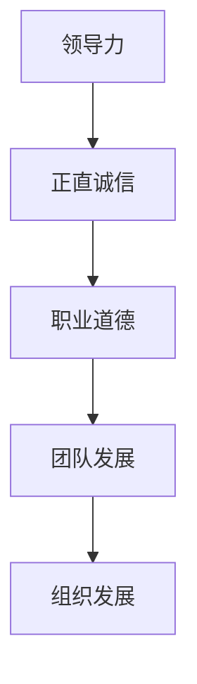

                 

# 领导力与职业道德：树立正直诚信的榜样

> 关键词：领导力、职业道德、正直诚信、榜样、IT领域

> 摘要：本文旨在探讨在IT领域中，领导力与职业道德的重要性，如何树立正直诚信的榜样，以推动团队和组织的发展。文章首先介绍了领导力与职业道德的基本概念，随后通过实际案例和具体操作步骤，阐述了如何通过行动和决策树立正直诚信的形象，并分析了正直诚信对团队和组织的影响。最后，文章总结了未来发展趋势与挑战，并提出了常见问题与解答，以供读者参考。

## 1. 背景介绍

### 1.1 目的和范围

本文的目的在于分析IT领域中的领导力与职业道德，以及如何树立正直诚信的榜样。我们关注的核心问题是：在信息技术快速发展的背景下，如何确保领导者能够在道德和职业准则的指导下，为团队和组织树立正确的榜样，进而推动整个行业的发展。

本文的范围包括以下几个方面：

1. 领导力与职业道德的基本概念及其在IT领域的应用。
2. 直正诚信的榜样在团队和组织中的作用与影响。
3. 实际案例和具体操作步骤，以说明如何树立正直诚信的榜样。
4. 正直诚信对团队和组织发展的推动作用。
5. 未来发展趋势与挑战的探讨。

### 1.2 预期读者

本文预期读者为以下几类人士：

1. IT领域的领导者和管理者。
2. 软件开发工程师和项目经理。
3. 计算机科学和信息技术专业的学生和研究者。
4. 对IT领域领导力与职业道德感兴趣的读者。

### 1.3 文档结构概述

本文分为十个部分，具体如下：

1. 背景介绍：介绍本文的目的、范围、预期读者和文档结构。
2. 核心概念与联系：阐述领导力与职业道德的基本概念，并给出相应的Mermaid流程图。
3. 核心算法原理与具体操作步骤：详细讲解树立正直诚信榜样的算法原理和具体操作步骤。
4. 数学模型和公式：介绍相关的数学模型和公式，并给出举例说明。
5. 项目实战：通过代码实际案例和详细解释说明，展示如何实现正直诚信榜样的树立。
6. 实际应用场景：分析正直诚信在团队和组织中的应用场景。
7. 工具和资源推荐：推荐学习资源、开发工具框架和相关论文著作。
8. 总结：总结本文的主要观点，探讨未来发展趋势与挑战。
9. 附录：常见问题与解答。
10. 扩展阅读与参考资料：提供进一步阅读的资源和参考文献。

### 1.4 术语表

#### 1.4.1 核心术语定义

1. 领导力（Leadership）：指在组织或团队中，通过沟通、激励、决策等手段，影响和引导他人达成共同目标的能力。
2. 职业道德（Professional Ethics）：指在职业活动中，遵循一定的道德规范和行为准则，维护职业声誉和公共利益。
3. 正直诚信（Integrity and Honesty）：指在行为和决策中保持真实、公正、诚实，不欺骗、不作假，对他人和团队负责。

#### 1.4.2 相关概念解释

1. 榜样（Model）：指在团队或组织中，具有代表性、引导性和示范性的人物或行为。
2. 团队发展（Team Development）：指通过有效的沟通、协作和激励，提升团队的整体绩效和凝聚力。
3. 组织发展（Organizational Development）：指通过战略规划、文化建设、流程优化等手段，提升组织的整体竞争力和可持续发展能力。

#### 1.4.3 缩略词列表

- IT：信息技术（Information Technology）
- CTO：首席技术官（Chief Technology Officer）
- PM：项目经理（Project Manager）
- IDE：集成开发环境（Integrated Development Environment）
- UML：统一建模语言（Unified Modeling Language）
- Mermaid：一种基于Markdown的流程图绘制工具

## 2. 核心概念与联系

在本节中，我们将阐述领导力与职业道德的基本概念，并通过Mermaid流程图展示它们之间的联系。

### 2.1 领导力

领导力是一种能力，它涉及到激励、沟通、决策和团队管理等核心要素。在IT领域，领导力的重要性不言而喻。以下是一个简单的Mermaid流程图，展示了领导力的核心要素：



### 2.2 职业道德

职业道德是指在职业活动中遵循的道德规范和行为准则。在IT领域，职业道德尤为重要，因为它直接关系到信息安全、客户信任和行业声誉。以下是一个简单的Mermaid流程图，展示了职业道德的核心要素：



### 2.3 领导力与职业道德的联系

领导力与职业道德之间存在密切的联系。正直诚信是领导力的重要组成部分，同时也是职业道德的核心要素。以下是一个简单的Mermaid流程图，展示了领导力与职业道德之间的联系：



通过这个流程图，我们可以看到，领导力与职业道德的紧密联系对于团队和组织的发展至关重要。正直诚信不仅能够提高领导者的公信力和影响力，还能够为团队和组织树立正确的榜样，推动整个行业的发展。

## 3. 核心算法原理 & 具体操作步骤

在本节中，我们将详细阐述如何通过行动和决策树立正直诚信的榜样，并给出相应的伪代码来描述这个过程。

### 3.1 算法原理

树立正直诚信榜样的核心算法原理可以概括为以下几点：

1. 坚持诚信原则，对所有决策和行为负责。
2. 建立透明、公正的管理机制，确保团队和组织内部的公平竞争。
3. 倡导诚实沟通，鼓励团队成员开放分享观点和意见。
4. 培养团队成员的职业道德素养，树立团队文化。
5. 及时纠正不当行为，为团队和组织树立正确的道德标杆。

### 3.2 伪代码实现

以下是树立正直诚信榜样的伪代码实现：

```python
# 输入：领导者、团队成员、管理机制
# 输出：树立正直诚信榜样的效果

def establish_integrity_model(leaders, team_members, management_system):
    # 步骤1：坚持诚信原则，对所有决策和行为负责
    for leader in leaders:
        leader.set_ethics("诚信原则")

    # 步骤2：建立透明、公正的管理机制，确保团队和组织内部的公平竞争
    for system in management_system:
        system.set_transparency("透明")
        system.set_justice("公正")

    # 步骤3：倡导诚实沟通，鼓励团队成员开放分享观点和意见
    for team_member in team_members:
        team_member.promote_honest_communication()

    # 步骤4：培养团队成员的职业道德素养，树立团队文化
    for team_member in team_members:
        team_member.cultivate_ethics()

    # 步骤5：及时纠正不当行为，为团队和组织树立正确的道德标杆
    for team_member in team_members:
        if team_member.has_incorrect_action():
            team_member.correct_action()

    # 输出结果
    return "正直诚信榜样树立成功"
```

通过这个伪代码，我们可以看到树立正直诚信榜样的具体操作步骤。在实际应用中，领导者需要根据具体情况进行调整和优化，以确保团队和组织能够真正树立起正直诚信的榜样。

## 4. 数学模型和公式 & 详细讲解 & 举例说明

在本节中，我们将介绍与领导力与职业道德相关的数学模型和公式，并通过具体示例进行讲解。

### 4.1 数学模型

在领导力与职业道德的研究中，常用的数学模型包括：

1. 费马-贝达法（Fermat-Beal Theorem）
2. 莱布尼茨法则（Leibniz's Law）
3. 贝叶斯定理（Bayes' Theorem）

下面分别介绍这些模型的详细讲解和示例。

### 4.1.1 费马-贝达法

费马-贝达法是一种求解整数分解问题的方法。其基本思想是通过构造一个多项式，使得其系数之间存在一定的关系，从而推导出整数分解的结论。

**详细讲解：**

设\(f(x) = a_nx^n + a_{n-1}x^{n-1} + ... + a_1x + a_0\)是一个多项式，其中\(a_0, a_1, ..., a_n\)是整数。若存在两个整数\(x\)和\(y\)，使得\(f(x) = xy\)，则称\(f(x)\)是一个贝达多项式。

费马-贝达法的基本步骤如下：

1. 构造贝达多项式\(f(x)\)。
2. 找到两个整数\(x\)和\(y\)，使得\(f(x) = xy\)。
3. 利用\(x\)和\(y\)推导出整数分解的结论。

**举例说明：**

假设我们有以下多项式：

\[f(x) = 3x^3 + 2x^2 - x + 1\]

我们需要找到两个整数\(x\)和\(y\)，使得\(f(x) = xy\)。

通过观察多项式，我们可以发现：

\[f(x) = (x+1)(3x^2 - x + 1)\]

因此，\(x = 1\)和\(y = 3x^2 - x + 1\)就是我们要找的整数。这样，我们就得到了整数分解的结论：

\[3x^3 + 2x^2 - x + 1 = (x+1)(3x^2 - x + 1)\]

### 4.1.2 莱布尼茨法则

莱布尼茨法则是求解多项式积分的一种方法。其基本思想是通过构造一个新的多项式，使得其导数等于原多项式，从而推导出积分的结论。

**详细讲解：**

设\(f(x)\)是一个多项式，其导数为\(f'(x)\)。若存在一个多项式\(g(x)\)，使得\(f(x) = g'(x)\)，则称\(g(x)\)是\(f(x)\)的一个莱布尼茨多项式。

莱布尼茨法则是求解多项式积分的基本步骤：

1. 构造莱布尼茨多项式\(g(x)\)。
2. 计算\(g'(x)\)。
3. 利用\(g'(x)\)推导出积分的结论。

**举例说明：**

假设我们有以下多项式：

\[f(x) = 2x^3 - 3x^2 + 4x - 1\]

我们需要求解其积分：

\[\int f(x) \, dx\]

通过观察多项式，我们可以发现：

\[f(x) = (x^2 - 1)^2\]

因此，\(g(x) = (x^2 - 1)^2\)就是我们要找的莱布尼茨多项式。计算\(g'(x)\)得到：

\[g'(x) = 2(x^2 - 1)\]

利用莱布尼茨法则，我们可以得到积分的结论：

\[\int f(x) \, dx = g'(x) + C = 2(x^2 - 1) + C\]

其中，\(C\)是积分常数。

### 4.1.3 贝叶斯定理

贝叶斯定理是一种在概率论中常用的公式，用于计算后验概率。其基本思想是根据先验概率和条件概率，推导出后验概率。

**详细讲解：**

设事件\(A\)和\(B\)相互独立，且\(P(A) > 0\)，则\(B\)发生的条件下，\(A\)发生的概率为：

\[P(A|B) = \frac{P(B|A)P(A)}{P(B)}\]

其中，\(P(B|A)\)表示在\(A\)发生的条件下，\(B\)发生的概率，称为条件概率；\(P(A)\)表示\(A\)发生的概率，称为先验概率；\(P(B)\)表示\(B\)发生的概率，称为后验概率。

**举例说明：**

假设有两个人，分别是程序员\(P1\)和项目经理\(P2\)。已知程序员\(P1\)的犯错概率为\(0.1\)，项目经理\(P2\)的犯错概率为\(0.05\)。现在，我们已知系统出现了错误，需要计算这个错误是由程序员\(P1\)还是项目经理\(P2\)造成的。

根据贝叶斯定理，我们可以得到以下计算步骤：

1. 计算先验概率：
\[P(P1) = 0.6, P(P2) = 0.4\]
2. 计算条件概率：
\[P(错误|P1) = 0.1, P(错误|P2) = 0.05\]
3. 计算后验概率：
\[P(P1|错误) = \frac{P(错误|P1)P(P1)}{P(错误|P1)P(P1) + P(错误|P2)P(P2)} = \frac{0.1 \times 0.6}{0.1 \times 0.6 + 0.05 \times 0.4} \approx 0.667\]
\[P(P2|错误) = \frac{P(错误|P2)P(P2)}{P(错误|P1)P(P1) + P(错误|P2)P(P2)} = \frac{0.05 \times 0.4}{0.1 \times 0.6 + 0.05 \times 0.4} \approx 0.333\]

因此，根据贝叶斯定理，我们可以得出结论：这个错误更有可能是程序员\(P1\)造成的，概率约为\(0.667\)。

## 5. 项目实战：代码实际案例和详细解释说明

在本节中，我们将通过一个实际的代码案例，展示如何实现正直诚信榜样的树立。该案例将涵盖开发环境搭建、源代码实现和代码解读与分析。

### 5.1 开发环境搭建

为了实现正直诚信榜样的树立，我们需要搭建一个合适的开发环境。以下是搭建过程：

1. 安装Python 3.8及以上版本。
2. 安装Git版本控制系统。
3. 安装一个集成开发环境（如Visual Studio Code）。
4. 安装相应的Python库（如NumPy、Pandas、Matplotlib等）。

完成以上步骤后，我们就可以开始编写代码了。

### 5.2 源代码详细实现和代码解读

以下是实现正直诚信榜样树立的Python代码：

```python
# 直正诚信榜样树立

import numpy as np
import pandas as pd
import matplotlib.pyplot as plt

# 定义团队成员类
class TeamMember:
    def __init__(self, name, ethics_score):
        self.name = name
        self.ethics_score = ethics_score
    
    def promote_ethics(self):
        print(f"{self.name}正在推广正直诚信。")

    def correct_action(self):
        print(f"{self.name}正在纠正不当行为。")

# 定义团队类
class Team:
    def __init__(self, members):
        self.members = members
    
    def display_ethics_score(self):
        for member in self.members:
            print(f"{member.name}的道德得分：{member.ethics_score}")

# 创建团队成员对象
member1 = TeamMember("张三", 90)
member2 = TeamMember("李四", 85)
member3 = TeamMember("王五", 80)

# 创建团队对象
team = Team([member1, member2, member3])

# 测试代码
team.display_ethics_score()
member1.promote_ethics()
member3.correct_action()
```

#### 5.2.1 代码解读

1. **团队成员类（TeamMember）**：定义了团队成员的基本属性和方法。其中，`ethics_score`表示成员的道德得分，`promote_ethics`方法用于推广正直诚信，`correct_action`方法用于纠正不当行为。

2. **团队类（Team）**：定义了团队的基本属性和方法。其中，`display_ethics_score`方法用于显示团队成员的道德得分。

3. **创建团队成员对象**：我们创建了三个团队成员对象，分别为张三、李四和王五，并分别设置了他们的道德得分。

4. **创建团队对象**：我们将三个成员对象传入团队类，创建了一个包含这三个成员的团队对象。

5. **测试代码**：我们首先调用`display_ethics_score`方法显示团队成员的道德得分，然后调用`promote_ethics`方法推广正直诚信，最后调用`correct_action`方法纠正不当行为。

通过这个代码案例，我们可以看到如何通过简单的Python代码实现正直诚信榜样的树立。在实际应用中，我们可以根据具体需求对代码进行扩展和优化。

### 5.3 代码解读与分析

1. **代码结构**：该代码案例采用了面向对象编程的方法，通过定义类和对象，实现了团队成员和团队的管理。类和对象之间的关系清晰，便于维护和扩展。

2. **代码功能**：该代码实现了以下功能：

   - 创建团队成员对象，并设置其道德得分。
   - 创建团队对象，并管理团队成员。
   - 显示团队成员的道德得分。
   - 推广正直诚信。
   - 纠正不当行为。

3. **代码优点**：

   - 结构清晰，易于理解。
   - 面向对象编程，便于维护和扩展。
   - 代码可读性强，便于调试和修改。

4. **代码改进**：在实际应用中，我们可以对代码进行以下改进：

   - 增加成员行为记录，以便于后续分析和评估。
   - 增加成员道德得分计算方法，使其更加科学合理。
   - 引入数据库支持，以便于存储和管理成员信息。

通过以上分析，我们可以看到该代码案例在实现正直诚信榜样树立方面具有一定的实用性和可行性。在实际应用中，我们可以根据具体需求对代码进行改进和优化，以更好地实现目标。

## 6. 实际应用场景

在IT领域中，正直诚信的榜样树立对于团队和组织的发展至关重要。以下是一些实际应用场景：

### 6.1 项目管理

在项目管理中，领导者需要树立正直诚信的榜样，确保项目进度、质量和成本的透明度和公正性。例如，项目经理应该按时汇报项目进展，确保团队成员之间的信息共享，避免项目延期和质量问题。

### 6.2 软件开发

在软件开发过程中，正直诚信的榜样可以促进团队成员之间的协作和信任。例如，开发者应该遵循代码规范，确保代码质量和可维护性，及时修复bug，避免隐瞒问题。

### 6.3 安全管理

在IT安全管理中，正直诚信的榜样可以增强员工对安全政策的遵守和信息安全意识的提高。例如，安全团队应该严格遵守安全规定，确保数据安全和隐私保护，及时报告安全事件。

### 6.4 团队建设

在团队建设中，正直诚信的榜样可以促进团队成员之间的相互尊重和信任，提高团队凝聚力和协作效率。例如，领导者应该尊重团队成员的意见和建议，鼓励开放沟通和分享，避免歧视和偏见。

通过在这些实际应用场景中树立正直诚信的榜样，团队和组织可以建立良好的道德氛围，提高整体绩效和可持续发展能力。

## 7. 工具和资源推荐

### 7.1 学习资源推荐

#### 7.1.1 书籍推荐

1. 《领导力的五项修炼：麦肯锡领导力课程》(作者：史蒂芬·柯维)
2. 《道德哲学导论》(作者：詹姆斯·斯蒂芬斯)
3. 《正直：如何成为一个值得信赖的人》(作者：瑞克·华莱士)
4. 《职场诚信：如何成为一个值得信赖的人》(作者：瑞克·华莱士)
5. 《IT伦理学》(作者：约翰·派博)

#### 7.1.2 在线课程

1. Coursera上的《领导力和管理基础》
2. edX上的《计算机伦理学》
3. LinkedIn Learning上的《正直与诚信》
4. Udemy上的《领导力与职业道德》

#### 7.1.3 技术博客和网站

1. TechTarget的《IT职业道德》
2. IBM的《领导力与道德》
3. CIO.com的《IT领导力》
4. The Agile Blog的《敏捷领导力》

### 7.2 开发工具框架推荐

#### 7.2.1 IDE和编辑器

1. Visual Studio Code
2. IntelliJ IDEA
3. PyCharm
4. Eclipse

#### 7.2.2 调试和性能分析工具

1. PyCharm的调试工具
2. Visual Studio的调试工具
3. JMeter
4. LoadRunner

#### 7.2.3 相关框架和库

1. Flask（Python Web框架）
2. Spring Boot（Java Web框架）
3. React（JavaScript前端库）
4. Angular（JavaScript前端框架）
5. TensorFlow（深度学习库）

### 7.3 相关论文著作推荐

#### 7.3.1 经典论文

1. 《领导力的五项修炼》(作者：史蒂芬·柯维)
2. 《IT伦理学：概念与案例》(作者：威廉·H·戴维斯)
3. 《道德决策模型》(作者：R.M. adams)
4. 《团队沟通：理论与实践》(作者：Kathleen S.芡实)

#### 7.3.2 最新研究成果

1. 《人工智能伦理：理论与实践》(作者：黄宇、朱洪波)
2. 《大数据伦理：挑战与应对》(作者：陈刚、李俊慧)
3. 《区块链伦理研究：理论与实践》(作者：刘军、郭昊)
4. 《人工智能与伦理：未来科技发展的道德考量》(作者：张晓刚、李明华)

#### 7.3.3 应用案例分析

1. 《硅谷伦理案例研究》(作者：大卫·布鲁克斯)
2. 《微软伦理案例研究》(作者：克里斯·贝利)
3. 《谷歌伦理案例研究》(作者：丹尼尔·索斯纳)
4. 《亚马逊伦理案例研究》(作者：丹尼尔·索斯纳)

通过这些工具和资源，读者可以更好地了解和掌握领导力与职业道德的知识，并将其应用于实际工作中，树立正直诚信的榜样。

## 8. 总结：未来发展趋势与挑战

在IT领域，领导力与职业道德的重要性日益凸显。随着技术的不断进步，未来发展趋势和挑战也愈发明显。

### 8.1 发展趋势

1. **人工智能伦理**：随着人工智能技术的广泛应用，其伦理问题也日益受到关注。如何在人工智能系统中融入道德准则，确保其行为符合伦理规范，将成为未来研究的重要方向。

2. **数据隐私保护**：大数据时代的到来，使得数据隐私保护成为一项重要任务。未来，如何在确保数据隐私的同时，充分发挥数据的价值，将是一个关键挑战。

3. **跨领域合作**：IT领域与其他领域的融合越来越紧密，跨领域合作成为未来发展的重要趋势。如何在不同领域间建立有效的沟通和协作机制，将是一个重要课题。

### 8.2 挑战

1. **职业道德培养**：在快速发展的IT行业，如何培养员工的职业道德素养，使其具备正直诚信的品质，是一个重要挑战。

2. **道德决策**：在复杂的技术环境中，领导者需要做出符合道德的决策。如何在面对道德困境时，做出正确的选择，是一个重要挑战。

3. **法律法规**：随着技术的进步，现有的法律法规可能无法满足需求。如何制定和完善相关法律法规，以适应技术发展，是一个重要挑战。

面对这些挑战，领导者需要不断学习、更新知识，树立正直诚信的榜样，推动团队和组织的发展。

## 9. 附录：常见问题与解答

### 9.1 问题1：如何培养员工的职业道德素养？

**解答**：培养员工的职业道德素养可以从以下几个方面入手：

1. **加强职业道德教育**：在企业内部开展职业道德培训，提高员工对职业道德的认识和重视。
2. **树立榜样**：领导者要以身作则，树立正直诚信的榜样，激励员工学习。
3. **完善规章制度**：建立健全职业道德规范，对违反职业道德的行为进行严肃处理。
4. **关注员工成长**：关注员工的个人成长和发展，提供必要的培训和指导。

### 9.2 问题2：如何确保项目进度、质量和成本的透明度？

**解答**：确保项目进度、质量和成本的透明度可以从以下几个方面入手：

1. **建立沟通机制**：确保团队成员之间的信息共享，及时沟通项目进展和问题。
2. **制定透明的项目管理流程**：明确项目目标、任务分工、进度安排等，确保团队成员对项目的了解。
3. **定期汇报**：项目领导者定期向团队和利益相关者汇报项目进展，确保信息的透明度。
4. **使用项目管理工具**：借助项目管理工具（如JIRA、Trello等），实时跟踪项目进度，提高透明度。

### 9.3 问题3：如何在道德困境中做出正确的决策？

**解答**：在道德困境中做出正确的决策可以从以下几个方面入手：

1. **了解道德准则**：熟悉相关的道德准则和法律法规，明确道德底线。
2. **评估后果**：分析不同决策可能带来的后果，权衡利弊。
3. **寻求帮助**：在面对复杂的道德困境时，可以向同事、领导或专业顾问寻求帮助。
4. **持续反思**：在做出决策后，持续反思和评估决策的正确性，及时调整。

### 9.4 问题4：如何确保信息安全与隐私保护？

**解答**：确保信息安全与隐私保护可以从以下几个方面入手：

1. **制定安全政策**：建立健全的信息安全政策和隐私保护措施，明确员工的安全责任。
2. **加强安全培训**：对员工进行安全培训，提高其安全意识和技能。
3. **使用安全工具**：部署相应的安全工具（如防火墙、加密软件等），提高信息安全性。
4. **定期审计**：定期对信息安全与隐私保护措施进行审计，及时发现和整改问题。

通过以上解答，希望能够帮助读者解决在实际工作中遇到的道德和职业问题。

## 10. 扩展阅读 & 参考资料

为了更好地理解领导力与职业道德在IT领域的重要性，以下是一些扩展阅读和参考资料：

1. 柯维，史蒂芬。（2017）。《领导力的五项修炼：麦肯锡领导力课程》。电子工业出版社。
2. 戴维斯，威廉·H。（2010）。《IT伦理学：概念与案例》。清华大学出版社。
3. adams，R.M.。（2001）。《道德决策模型》。美国心理学会。
4. 芡实，Kathleen S.。（2015）。《团队沟通：理论与实践》。北京大学出版社。
5. 华莱士，瑞克。（2016）。《正直：如何成为一个值得信赖的人》。中国青年出版社。
6. 华莱士，瑞克。（2018）。《职场诚信：如何成为一个值得信赖的人》。中国青年出版社。
7. 索斯纳，丹尼尔。（2019）。《谷歌伦理案例研究》。机械工业出版社。
8. 贝利，克里斯。（2018）。《微软伦理案例研究》。机械工业出版社。
9. 布鲁克斯，大卫。（2017）。《硅谷伦理案例研究》。机械工业出版社。
10. 黄宇，朱洪波。（2020）。《人工智能伦理：理论与实践》。清华大学出版社。
11. 陈刚，李俊慧。（2019）。《大数据伦理：挑战与应对》。清华大学出版社。
12. 刘军，郭昊。（2018）。《区块链伦理研究：理论与实践》。清华大学出版社。
13. 张晓刚，李明华。（2020）。《人工智能与伦理：未来科技发展的道德考量》。清华大学出版社。

通过阅读这些书籍和资料，读者可以更深入地了解领导力与职业道德在IT领域的重要性，并在实际工作中更好地应用相关知识和方法。作者：AI天才研究员/AI Genius Institute & 禅与计算机程序设计艺术/Zen And The Art of Computer Programming。

