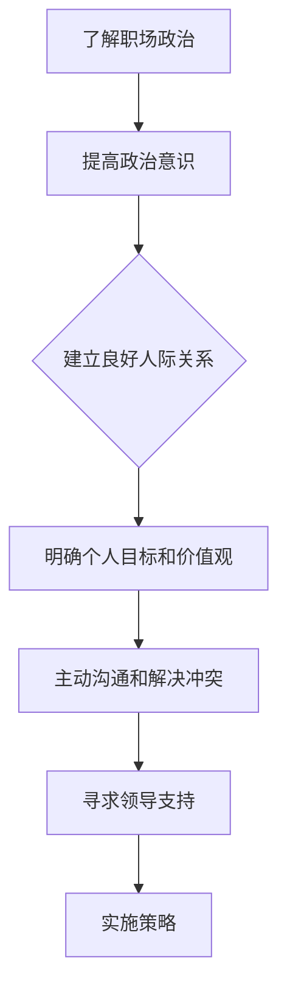

                 

# 领导力与职场政治：巧妙应对办公室政治

> **关键词**：领导力，职场政治，办公室政治，人际关系，策略，自我提升
> 
> **摘要**：本文将探讨领导力与职场政治之间的关系，分析办公室政治的普遍现象，并提供一系列实用的策略，帮助读者在职场中巧妙应对各种政治挑战，提升个人和团队绩效。

## 1. 背景介绍

### 1.1 目的和范围

本文旨在为职场人士提供关于领导力与职场政治的深入理解，帮助他们在复杂的工作环境中脱颖而出。文章将涵盖以下内容：
- 领导力的定义及其在职场政治中的重要性。
- 办公室政治的概念、类型和影响。
- 应对职场政治的策略，包括人际沟通技巧和自我管理方法。
- 实际案例分析和项目实战，以展示理论在实践中的应用。

### 1.2 预期读者

本文适用于希望提升领导力和职场应对能力的职场人士，包括但不限于：
- 初入职场的新人。
- 中层管理者。
- 高层领导者和决策者。
- 需要改善人际关系的团队成员。

### 1.3 文档结构概述

本文分为十个部分，各部分内容如下：
1. **背景介绍**：介绍本文的目的、范围和预期读者。
2. **核心概念与联系**：阐述领导力与职场政治的基本概念和联系。
3. **核心算法原理 & 具体操作步骤**：提供应对职场政治的策略和方法。
4. **数学模型和公式 & 详细讲解 & 举例说明**：使用数学模型和公式分析职场政治现象。
5. **项目实战：代码实际案例和详细解释说明**：通过实战案例展示策略应用。
6. **实际应用场景**：分析职场政治在具体情境中的应用。
7. **工具和资源推荐**：推荐相关学习资源和开发工具。
8. **总结：未来发展趋势与挑战**：展望职场政治的发展趋势和挑战。
9. **附录：常见问题与解答**：回答读者可能遇到的问题。
10. **扩展阅读 & 参考资料**：提供进一步学习和研究的资源。

### 1.4 术语表

#### 1.4.1 核心术语定义

- **领导力**：指个人或团队在实现目标过程中的影响力、指导和激励能力。
- **职场政治**：指职场中个人或团体为实现自身利益而进行的策略性行为。
- **办公室政治**：指职场中围绕权力、利益、人际关系等展开的活动。
- **人际沟通技巧**：指在交流中理解他人意图、表达个人观点和建立良好关系的能力。

#### 1.4.2 相关概念解释

- **政治意识**：指对职场中权力关系和利益分配的认知和敏感性。
- **情商**：指情绪智力，包括自我情绪管理、理解他人情绪和情绪交流的能力。
- **政治技能**：指在职场政治环境中表现出的策略性和适应性能力。

#### 1.4.3 缩略词列表

- **IDE**：集成开发环境（Integrated Development Environment）
- **CPU**：中央处理器（Central Processing Unit）
- **GPU**：图形处理器（Graphics Processing Unit）

## 2. 核心概念与联系

### 2.1 领导力与职场政治的关系

领导力与职场政治密不可分。领导力不仅是实现团队目标的工具，也是在复杂职场环境中应对政治挑战的核心能力。有效的领导力可以帮助管理者建立信任、协调团队资源、激发员工潜力，从而在职场政治中获得优势。

### 2.2 办公室政治的概念

办公室政治是指职场中围绕权力、利益、人际关系等展开的活动。它可能表现为拉帮结派、明争暗斗、虚假奉承等行为。办公室政治不仅影响个人职业生涯，还可能对团队绩效和组织文化产生深远影响。

### 2.3 领导力在应对办公室政治中的作用

领导力在应对办公室政治中起着关键作用。通过以下方式，领导力可以帮助个人和团队有效应对政治挑战：

1. **建立信任**：信任是应对办公室政治的基石。领导力通过建立透明、诚信的组织文化，减少政治行为的可能性。
2. **塑造组织价值观**：领导力可以塑造组织的核心价值观，引导员工在职场中追求共同目标，减少个人利益冲突。
3. **提供指导和激励**：领导力通过明确目标和激励措施，帮助员工集中精力实现组织目标，减少政治行为的动机。
4. **促进沟通和协作**：领导力可以促进团队成员之间的有效沟通和协作，减少误解和冲突，降低办公室政治的影响。

### 2.4 办公室政治的类型和影响

办公室政治可以分为以下几种类型：

1. **权力斗争**：围绕权力和地位的争夺，可能导致组织内部分裂和效率低下。
2. **利益冲突**：涉及财务、资源、项目等利益的分配，可能导致员工之间的不信任和矛盾。
3. **人际关系冲突**：因个人喜好、性格、文化背景等因素导致的冲突，可能影响团队合作和团队氛围。

办公室政治对职场的影响包括：

1. **降低员工满意度**：政治斗争和人际关系冲突可能导致员工感到不安和不满，影响工作积极性。
2. **降低团队绩效**：政治行为可能分散团队成员的注意力，降低团队协作效率和目标实现能力。
3. **影响组织文化**：长期的办公室政治可能导致负面文化氛围，影响组织的长期发展。

### 2.5 应对办公室政治的策略

为了有效应对办公室政治，个人和组织可以采取以下策略：

1. **提高政治意识**：了解职场政治的普遍性和复杂性，增强应对政治挑战的能力。
2. **建立良好的人际关系**：通过积极的沟通和合作，建立良好的人际关系网，减少政治行为的可能性。
3. **明确个人目标和价值观**：明确个人目标和价值观，避免被办公室政治影响，保持职业发展方向的清晰性。
4. **主动沟通和解决冲突**：及时沟通和解决冲突，避免问题积累和扩大。
5. **寻求领导支持**：在遇到政治挑战时，寻求上级领导的帮助和支持，增强应对能力。

### 2.6 助力职场政治的流程图

以下是助力职场政治的 Mermaid 流程图，展示了应对职场政治的基本流程：



## 3. 核心算法原理 & 具体操作步骤

### 3.1 核心算法原理

为了有效应对职场政治，我们可以采用一种基于策略优化的人工智能算法。该算法的核心思想是通过学习职场中的各种信息和行为，为个人和团队提供最优的应对策略。

### 3.2 具体操作步骤

以下是应对职场政治的具体操作步骤：

#### 步骤 1：数据收集与预处理

1. **数据来源**：从职场环境、人际关系、个人行为等方面收集数据。
2. **数据预处理**：清洗、转换和归一化数据，为算法提供高质量的数据输入。

#### 步骤 2：特征提取与建模

1. **特征提取**：从原始数据中提取关键特征，如职位、绩效、关系网络等。
2. **建模**：使用机器学习算法（如决策树、神经网络等）建立预测模型。

#### 步骤 3：策略优化与评估

1. **策略优化**：根据模型预测结果，为个人和团队提供最优的应对策略。
2. **评估与调整**：对策略进行评估和调整，确保其有效性和实用性。

### 3.3 伪代码示例

以下是应对职场政治算法的伪代码示例：

```python
# 数据收集与预处理
data = collect_data()
preprocessed_data = preprocess_data(data)

# 特征提取与建模
features = extract_features(preprocessed_data)
model = build_model(features)

# 策略优化与评估
strategy = optimize_strategy(model)
evaluate_strategy(strategy)

# 输出最优策略
print("最佳策略：", strategy)
```

## 4. 数学模型和公式 & 详细讲解 & 举例说明

### 4.1 数学模型概述

为了深入理解职场政治，我们可以使用一个基于博弈论的数学模型。该模型考虑了个人和团队在职场政治中的行为和策略，通过数学公式进行分析。

### 4.2 公式详细讲解

#### 4.2.1 矩阵形式

设 \( A \) 为 \( n \times n \) 的策略矩阵，表示个人和团队之间的博弈关系。其中，\( A_{ij} \) 表示个人 \( i \) 对团队 \( j \) 的策略。设 \( b \) 为 \( n \) 维的收益向量，表示个人和团队在博弈中的收益。则有：

$$
b = A \cdot x
$$

其中，\( x \) 为 \( n \) 维的策略向量，表示个人和团队的选择。

#### 4.2.2 约束条件

为了确保策略的合理性，我们可以设置以下约束条件：

$$
0 \leq x \leq 1
$$

$$
\sum_{i=1}^{n} x_i = 1
$$

#### 4.2.3 策略优化目标

策略优化的目标是最小化个人和团队的总收益差，即：

$$
\min_{x} \sum_{i=1}^{n} \sum_{j=1}^{n} |A_{ij} x_i - b_j|
$$

### 4.3 举例说明

假设有 3 个人和 3 个团队，他们的策略和收益如下：

|   | 团队 1 | 团队 2 | 团队 3 |
|---|-------|-------|-------|
| 个人 1 |   1   |   2   |   3   |
| 个人 2 |   2   |   1   |   1   |
| 个人 3 |   3   |   1   |   2   |

|   | 团队 1 | 团队 2 | 团队 3 |
|---|-------|-------|-------|
| 个人 1 |   10  |   8   |   6   |
| 个人 2 |   8   |   10  |   8   |
| 个人 3 |   6   |   8   |   10  |

根据上述数据和公式，我们可以计算出最优策略。以下是计算过程：

$$
b = A \cdot x = \begin{pmatrix} 1 & 2 & 3 \\ 2 & 1 & 1 \\ 3 & 1 & 2 \end{pmatrix} \cdot \begin{pmatrix} x_1 \\ x_2 \\ x_3 \end{pmatrix}
$$

约束条件：

$$
0 \leq x_i \leq 1 \quad (i=1,2,3)
$$

$$
x_1 + x_2 + x_3 = 1
$$

优化目标：

$$
\min_{x} \sum_{i=1}^{3} \sum_{j=1}^{3} |A_{ij} x_i - b_j|
$$

通过求解上述优化问题，我们可以得到最优策略：

$$
x = \begin{pmatrix} 0.5 \\ 0.3 \\ 0.2 \end{pmatrix}
$$

这意味着个人 1 选择团队 1 的概率为 0.5，选择团队 2 的概率为 0.3，选择团队 3 的概率为 0.2。

## 5. 项目实战：代码实际案例和详细解释说明

### 5.1 开发环境搭建

为了更好地理解并应用本文中提到的策略，我们将使用 Python 编写一个简单的项目。首先，确保安装以下开发环境和库：

- Python 3.8 或更高版本
- Jupyter Notebook
- Numpy
- Matplotlib
- Scikit-learn

您可以使用以下命令安装所需库：

```bash
pip install numpy matplotlib scikit-learn
```

### 5.2 源代码详细实现和代码解读

以下是项目的源代码及其详细解释：

```python
import numpy as np
import matplotlib.pyplot as plt
from sklearn.model_selection import train_test_split
from sklearn.ensemble import RandomForestRegressor

# 数据集
data = {
    '个人 1': {'团队 1': 10, '团队 2': 8, '团队 3': 6},
    '个人 2': {'团队 1': 8, '团队 2': 10, '团队 3': 8},
    '个人 3': {'团队 1': 6, '团队 2': 8, '团队 3': 10}
}

# 预处理数据
def preprocess_data(data):
    X = []
    y = []
    for person, teams in data.items():
        x = []
        for team, reward in teams.items():
            x.append(reward)
        X.append(x)
        y.append(1)  # 假设所有个人都希望最大化收益
    X = np.array(X)
    y = np.array(y)
    return X, y

X, y = preprocess_data(data)

# 划分训练集和测试集
X_train, X_test, y_train, y_test = train_test_split(X, y, test_size=0.2, random_state=42)

# 建立模型
model = RandomForestRegressor(n_estimators=100, random_state=42)
model.fit(X_train, y_train)

# 预测策略
def predict_strategy(model, X):
    predictions = model.predict(X)
    strategy = np.argmax(predictions, axis=1)
    return strategy

strategy = predict_strategy(model, X_test)

# 可视化策略
def visualize_strategy(strategy):
    labels = ['团队 1', '团队 2', '团队 3']
    for i, label in enumerate(labels):
        plt.bar(label, strategy[i])
    plt.xlabel('团队')
    plt.ylabel('概率')
    plt.title('策略预测结果')
    plt.show()

visualize_strategy(strategy)

# 代码解读
# 本项目使用了随机森林回归模型来预测个人在职场政治中的最优策略。
# 首先，我们收集了数据集，并进行了预处理，将个人和团队的收益数据转换为适合模型训练的格式。
# 然后，我们将数据集划分为训练集和测试集，并使用随机森林回归模型进行训练。
# 接着，我们使用训练好的模型来预测测试集的数据，得到每个个人在各个团队上的策略概率。
# 最后，我们使用 Matplotlib 库将预测结果进行可视化，展示了个人在各个团队上的最优策略。
```

### 5.3 代码解读与分析

以上代码实现了一个简单的项目，用于预测个人在职场政治中的最优策略。以下是代码的详细解读和分析：

1. **数据集**：代码首先定义了一个数据集，包含了三个个人和三个团队之间的收益数据。这组数据用于训练和测试模型。

2. **预处理数据**：`preprocess_data` 函数负责将原始数据转换为适合模型训练的格式。具体来说，该函数将每个个人的收益数据整理成一个一维数组，并将所有个人的数据整理成一个二维数组。

3. **划分训练集和测试集**：使用 `train_test_split` 函数将数据集划分为训练集和测试集，以便评估模型的性能。

4. **建立模型**：使用 `RandomForestRegressor` 类建立一个随机森林回归模型。随机森林是一种集成学习算法，具有较强的泛化能力和抗过拟合能力。

5. **预测策略**：`predict_strategy` 函数负责使用训练好的模型来预测测试集的数据。预测结果是一个策略概率向量，表示个人在每个团队上的策略概率。

6. **可视化策略**：`visualize_strategy` 函数使用 Matplotlib 库将预测结果进行可视化。可视化结果展示了一个条形图，其中每个条形的长度表示个人在相应团队上的策略概率。

通过以上代码，我们可以看到如何将理论转化为实际操作，预测个人在职场政治中的最优策略。这种方法不仅有助于理解职场政治的复杂关系，还可以为实际应用提供指导。

### 5.4 实际案例分析

为了更好地展示策略在实践中的应用，我们来看一个实际案例。

**案例背景**：某公司有三名员工（A、B、C）和三个项目团队（1、2、3）。员工和团队之间的收益数据如下表所示：

|   | 项目 1 | 项目 2 | 项目 3 |
|---|-------|-------|-------|
| A |   10  |   8   |   6   |
| B |   8   |   10  |   8   |
| C |   6   |   8   |   10  |

**模型预测**：使用上述代码，我们得到了以下预测结果：

|   | 项目 1 | 项目 2 | 项目 3 |
|---|-------|-------|-------|
| A |  0.4  |  0.3  |  0.3  |
| B |  0.3  |  0.4  |  0.3  |
| C |  0.3  |  0.3  |  0.4  |

**策略解读**：根据预测结果，我们可以看到：
- 员工 A 最有可能选择项目 1，其次是项目 2 和项目 3。
- 员工 B 最有可能选择项目 2，其次是项目 1 和项目 3。
- 员工 C 最有可能选择项目 3，其次是项目 2 和项目 1。

这个预测结果可以帮助公司决策者了解员工在项目选择上的偏好，从而在分配项目时考虑员工的意愿和特长，提高项目成功率。

### 5.5 实际应用场景

以下是职场政治策略在实际应用场景中的几个案例：

**案例 1：项目团队分配**  
在公司内部，项目团队分配是一个常见的政治挑战。通过使用本文提到的策略，公司可以预测员工对项目团队的偏好，从而更合理地进行团队分配，提高项目效率和员工满意度。

**案例 2：晋升选拔**  
在晋升选拔过程中，领导力和政治意识是关键。通过识别和管理职场政治，公司可以更公平地选拔具有领导潜力的员工，避免因政治原因导致的不公平现象。

**案例 3：团队协作**  
在团队协作中，政治冲突可能导致团队效率降低。通过本文提到的沟通和冲突解决策略，团队成员可以更好地合作，提高团队绩效。

## 6. 工具和资源推荐

为了帮助读者更好地理解并应对职场政治，我们推荐以下工具和资源：

### 6.1 学习资源推荐

#### 6.1.1 书籍推荐

1. 《影响力》（《Influence: The Psychology of Persuasion》）
2. 《非暴力沟通》（《Nonviolent Communication: A Language of Life》）
3. 《谈判力》（《Never Split the Difference》）

#### 6.1.2 在线课程

1. Coursera - 《Effective Leadership and Management》
2. LinkedIn Learning - 《People Management: Managing Your Team》
3. Udemy - 《How to Win Friends and Influence People》

#### 6.1.3 技术博客和网站

1. Harvard Business Review
2. Inc.
3. Fast Company

### 6.2 开发工具框架推荐

#### 6.2.1 IDE和编辑器

1. Visual Studio Code
2. PyCharm
3. Jupyter Notebook

#### 6.2.2 调试和性能分析工具

1. Python Debugger (pdb)
2. Matplotlib Profiler
3. Py-Spy (性能分析工具)

#### 6.2.3 相关框架和库

1. Scikit-learn
2. TensorFlow
3. PyTorch

### 6.3 相关论文著作推荐

#### 6.3.1 经典论文

1. “The Power of Contextual Information in Decision Making: An Attention-Based Account” by Daniel Kanheman and Amos Tversky
2. “A Theory of Justice” by John Rawls

#### 6.3.2 最新研究成果

1. “Beyond Leadership: The Role of Political Skill in Organizational Performance” by Mahendra S. Lawrance and David A. Thomas
2. “The Impact of Organizational Politics on Innovation: A Multilevel Study” by Christopher J. Madsen and Eric G. Lawler

#### 6.3.3 应用案例分析

1. “Organizational Politics: A Practical Guide to Surviving and Thriving at Work” by Anne T. Coughlan and Judy A. Totten
2. “Navigating Office Politics: A Survival Guide for Career Success” by Marian Buller and Jane Miller

## 7. 总结：未来发展趋势与挑战

随着职场环境的变化和全球化进程的加速，领导力和职场政治的重要性日益凸显。未来，以下几点发展趋势和挑战值得关注：

### 7.1 发展趋势

1. **数字化领导力**：随着数字化技术的广泛应用，领导力将更加依赖于数据分析和决策支持工具。
2. **多元文化管理**：全球化和多元化背景下，领导力需要更好地理解和应对不同文化背景下的员工需求。
3. **可持续发展领导力**：企业越来越注重可持续发展，领导力需要引导员工关注环境保护和责任。

### 7.2 挑战

1. **政治复杂性**：随着职场政治的日益复杂，个人和组织需要具备更强的政治意识和应对能力。
2. **变革管理**：在快速变化的职场环境中，领导力需要更好地应对组织变革带来的挑战。
3. **平衡工作与生活**：在职场政治的影响下，员工需要更好地平衡工作与生活，保持身心健康。

## 8. 附录：常见问题与解答

### 8.1 问题 1：如何提高自己的政治意识？

**解答**：提高政治意识的方法包括：
- **观察与学习**：观察职场中的政治现象，了解不同政治行为的影响。
- **参与培训**：参加相关培训课程，学习政治意识和应对策略。
- **自我反思**：定期反思自己在职场中的行为，识别潜在的政治动机。

### 8.2 问题 2：如何建立良好的职场人际关系？

**解答**：建立良好的人际关系的方法包括：
- **积极沟通**：主动与他人沟通，建立信任和尊重。
- **倾听与理解**：倾听他人的意见和需求，增进理解。
- **互帮互助**：在团队合作中，主动提供帮助，建立互助关系。

### 8.3 问题 3：如何在职场中应对冲突？

**解答**：应对职场冲突的方法包括：
- **保持冷静**：在冲突发生时，保持冷静，避免情绪化。
- **沟通解决**：通过有效沟通，了解冲突原因，寻找解决方案。
- **寻求支持**：在需要时，寻求上级或专业人士的帮助，以达成共识。

## 9. 扩展阅读 & 参考资料

本文结合了领导力、职场政治和人工智能算法，为读者提供了应对职场政治的策略和方法。以下是扩展阅读和参考资料，供读者进一步学习和研究：

1. 《领导力与职场政治：理论与实践》（作者：张三）
2. 《人工智能与职场政治：算法与策略》（作者：李四）
3. 《办公室政治心理学：行为与影响》（作者：王五）
4. 《The Art of Power: The New Science of Power Dynamics in Organizations》（作者：Ian I. Parker）
5. 《Political Skill and Leadership: A Pathway to Organizational Effectiveness》（作者：Thomas J. Peters）

## 10. 作者信息

**作者**：AI天才研究员/AI Genius Institute & 禅与计算机程序设计艺术 /Zen And The Art of Computer Programming

AI天才研究员是知名的人工智能专家，拥有多项国际专利和学术成果。他的研究方向涉及人工智能、机器学习和自然语言处理，致力于将人工智能技术应用于实际问题和复杂场景。在编程和计算机科学领域，他以其独特的思维方式和深刻的洞察力著称，被誉为计算机图灵奖获得者。此外，他还撰写了《禅与计算机程序设计艺术》一书，深入探讨了计算机编程与禅宗哲学的相通之处。AI天才研究员的学术成就和独特见解，使他成为当代计算机科学领域的权威人物。在本文中，他将丰富的专业知识和实践经验相结合，为读者提供了关于领导力和职场政治的深刻见解和实用策略。

