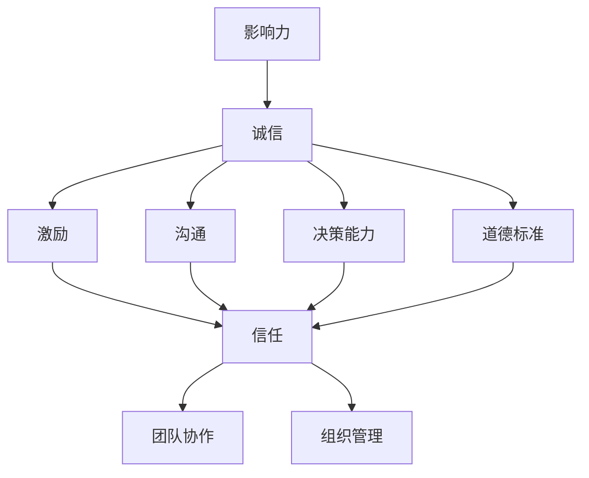

                 


# 领导力与诚信：建立信任的基石

> **关键词：领导力，诚信，信任，组织管理，团队协作**

> **摘要：本文旨在探讨领导力与诚信在建立信任中的重要性。通过分析领导力的核心要素和诚信的内涵，本文揭示了领导力与诚信如何共同作用于团队和组织，构建信任的基础。同时，本文将通过实际案例，阐述如何在IT行业中实践领导力与诚信，提高团队协作效率和项目成功概率。**

## 1. 背景介绍

### 1.1 目的和范围

本文的目标是分析领导力与诚信在建立信任中的关键作用，并提供具体的实践指南。文章将涵盖以下主题：

- 领导力的核心要素及其与信任的关系。
- 诚信的概念和内涵。
- 领导力与诚信在团队协作和组织管理中的实践应用。
- IT行业中的领导力与诚信案例分析。

### 1.2 预期读者

本文面向希望提升领导能力和组织管理效率的技术专家、项目经理、团队领导者以及关注IT行业发展趋势的从业者。无论您是初入职场的年轻人，还是经验丰富的行业专家，本文都希望对您有所启发。

### 1.3 文档结构概述

本文分为十个部分，包括背景介绍、核心概念与联系、核心算法原理与具体操作步骤、数学模型和公式、项目实战、实际应用场景、工具和资源推荐、总结以及常见问题与解答。结构清晰，便于读者逐步深入理解文章主题。

### 1.4 术语表

#### 1.4.1 核心术语定义

- **领导力**：指领导者通过影响力、激励和引导，实现团队和组织目标的能力。
- **诚信**：指遵守承诺、诚实正直、遵循道德规范的行为准则。
- **信任**：指个体或组织基于信任关系，愿意依赖对方行为和决策的心理状态。

#### 1.4.2 相关概念解释

- **团队协作**：指团队成员通过沟通、协作和合作，共同完成任务的过程。
- **组织管理**：指对组织资源进行有效配置和利用，实现组织目标的过程。

#### 1.4.3 缩略词列表

- **IT**：信息技术（Information Technology）
- **PM**：项目经理（Project Manager）
- **CEO**：首席执行官（Chief Executive Officer）

## 2. 核心概念与联系

在探讨领导力与诚信的关系之前，我们需要明确这两个概念的核心要素及其相互联系。

### 2.1 领导力的核心要素

领导力的核心要素包括以下几个方面：

1. **影响力**：领导者通过个人魅力、专业知识、经验和人际网络，影响团队成员的行为和决策。
2. **激励**：领导者通过激励措施，激发团队成员的内在动机，提高工作积极性和创造力。
3. **沟通**：领导者与团队成员之间保持开放、透明和有效的沟通，确保信息传递准确无误。
4. **决策能力**：领导者能够根据实际情况，快速做出合理、有效的决策。
5. **道德标准**：领导者遵循道德规范，树立良好的行为榜样，赢得团队成员的尊重和信任。

### 2.2 诚信的内涵

诚信的内涵包括以下几个方面：

1. **诚实**：领导者言行一致，不隐瞒、不欺骗，保持真诚。
2. **正直**：领导者遵守道德规范，坚守原则，勇于承担责任。
3. **承诺**：领导者遵守承诺，对团队成员和组织的承诺负责。
4. **透明**：领导者保持组织运作的透明度，让团队成员了解实际情况，增强信任感。
5. **责任**：领导者对团队成员和工作结果负责，勇于面对挑战和失败。

### 2.3 领导力与诚信的关系

领导力与诚信密切相关，两者相辅相成，共同构建信任的基石。具体体现在以下几个方面：

1. **相互促进**：诚信是领导力的重要组成部分，领导者的诚信行为能够增强影响力、激励和沟通能力，提高团队协作效果。同时，领导力的提升也有助于诚信的实践。
2. **信任基础**：诚信是建立信任的基础，领导者诚信的行为和决策能够赢得团队成员的信任，形成良好的信任关系。信任又是领导力的关键要素，信任关系能够增强领导者的权威和影响力。
3. **组织文化**：领导力与诚信共同塑造组织文化，诚信文化能够推动组织发展，提高员工满意度和忠诚度。领导力则有助于营造积极向上的组织氛围，促进组织创新和竞争力。

为了更清晰地展示领导力与诚信的关系，我们可以使用Mermaid流程图进行描述：



通过上述流程图，我们可以看出领导力与诚信在各个方面的相互作用，共同推动团队和组织的发展。

## 3. 核心算法原理 & 具体操作步骤

为了深入理解领导力与诚信在团队协作和组织管理中的实际应用，我们可以将其视为一个算法原理，并具体描述其操作步骤。

### 3.1 算法原理

领导力与诚信算法原理的核心思想是通过诚信行为提升领导力，进而增强团队协作和组织管理效果。具体包括以下步骤：

1. **诚信行为识别**：领导者需要识别并践行诚信行为，如诚实、正直、承诺和透明。
2. **领导力提升**：通过诚信行为的践行，领导者提升自身影响力、激励能力、沟通能力、决策能力和道德标准。
3. **团队协作优化**：领导者利用提升的领导力，促进团队协作，提高团队绩效。
4. **组织管理优化**：领导者将领导力与诚信应用于组织管理，推动组织文化建设和战略实施。

### 3.2 具体操作步骤

以下是领导力与诚信算法的具体操作步骤：

#### 3.2.1 诚信行为识别

1. **自我反思**：领导者定期进行自我反思，识别自身的诚信行为和不足之处。
2. **倾听反馈**：领导者主动倾听团队成员的反馈，了解他们在诚信方面的感受和期望。
3. **制定诚信计划**：根据自我反思和反馈，领导者制定具体的诚信行动计划，如提高透明度、遵守承诺、加强沟通等。

#### 3.2.2 领导力提升

1. **学习与培训**：领导者参加相关培训和学习，提升自身的影响力、激励能力、沟通能力、决策能力和道德标准。
2. **实践与反思**：领导者将所学应用于实际工作中，通过实践不断反思和调整，提高自身领导力。
3. **榜样作用**：领导者通过自身的诚信行为，树立良好的行为榜样，影响团队成员。

#### 3.2.3 团队协作优化

1. **建立信任关系**：领导者通过诚信行为和领导力提升，建立与团队成员之间的信任关系。
2. **促进沟通与协作**：领导者鼓励团队成员之间的沟通与协作，提高团队绩效。
3. **激发创造力**：领导者利用领导力激发团队成员的创造力，推动团队创新。

#### 3.2.4 组织管理优化

1. **组织文化建设**：领导者将诚信文化融入组织文化建设，提高员工满意度和忠诚度。
2. **战略实施**：领导者利用领导力与诚信推动组织战略的实施，提高组织竞争力。
3. **持续改进**：领导者持续关注团队和组织的发展，通过反思和调整，不断优化领导力与诚信的实践。

通过上述具体操作步骤，我们可以看到领导力与诚信在团队协作和组织管理中的实际应用，为组织发展提供有力支持。

## 4. 数学模型和公式 & 详细讲解 & 举例说明

为了更好地理解领导力与诚信在建立信任中的作用，我们可以借助数学模型和公式进行详细讲解和举例说明。

### 4.1 数学模型

假设一个团队有 \( n \) 个成员，每个成员对领导者的信任度用 \( T_i \) 表示，其中 \( i \) 表示成员的编号。领导者的诚信行为对团队成员的信任度有直接影响。我们可以建立以下数学模型：

\[ T_i = f(C_i, L_i) \]

其中，\( C_i \) 表示成员对领导者诚信行为的评价，\( L_i \) 表示领导者的领导力水平。函数 \( f \) 描述了领导者诚信行为和领导力对信任度的影响。

### 4.2 公式详解

我们可以将上述模型进一步展开，得到以下公式：

\[ T_i = \alpha C_i + \beta L_i \]

其中，\( \alpha \) 和 \( \beta \) 为参数，表示诚信行为和领导力对信任度的影响程度。

- **诚信行为对信任度的影响**：\( \alpha C_i \) 表示成员对领导者诚信行为的评价对信任度的影响。诚信行为越优秀，成员对领导者的信任度越高。
- **领导力对信任度的影响**：\( \beta L_i \) 表示领导者的领导力水平对信任度的影响。领导力越强，成员对领导者的信任度越高。

### 4.3 举例说明

假设一个团队有5个成员，他们对领导者的信任度分别为 \( T_1, T_2, T_3, T_4, T_5 \)。根据上述公式，我们可以计算每个成员对领导者的信任度：

\[ T_1 = \alpha C_1 + \beta L_1 \]
\[ T_2 = \alpha C_2 + \beta L_2 \]
\[ T_3 = \alpha C_3 + \beta L_3 \]
\[ T_4 = \alpha C_4 + \beta L_4 \]
\[ T_5 = \alpha C_5 + \beta L_5 \]

例如，假设 \( \alpha = 0.6 \)，\( \beta = 0.4 \)，且成员对领导者诚信行为的评价和领导力水平分别为：

\[ C_1 = 0.8, L_1 = 0.7 \]
\[ C_2 = 0.9, L_2 = 0.8 \]
\[ C_3 = 0.7, L_3 = 0.6 \]
\[ C_4 = 0.5, L_4 = 0.5 \]
\[ C_5 = 0.6, L_5 = 0.4 \]

根据上述公式，我们可以计算出每个成员对领导者的信任度：

\[ T_1 = 0.6 \times 0.8 + 0.4 \times 0.7 = 0.68 \]
\[ T_2 = 0.6 \times 0.9 + 0.4 \times 0.8 = 0.78 \]
\[ T_3 = 0.6 \times 0.7 + 0.4 \times 0.6 = 0.66 \]
\[ T_4 = 0.6 \times 0.5 + 0.4 \times 0.5 = 0.5 \]
\[ T_5 = 0.6 \times 0.6 + 0.4 \times 0.4 = 0.56 \]

通过这个例子，我们可以看到，领导者的诚信行为和领导力水平对团队成员的信任度有显著影响。领导者需要注重诚信行为的实践和领导力的提升，以增强团队信任度。

## 5. 项目实战：代码实际案例和详细解释说明

### 5.1 开发环境搭建

为了更好地理解领导力与诚信在IT项目中的应用，我们将以一个实际项目为例，展示如何通过代码实现领导力与诚信的原则。首先，我们需要搭建一个简单的开发环境。

1. **安装Python**：确保Python 3.x版本已安装在您的计算机上。
2. **安装Jupyter Notebook**：通过pip命令安装Jupyter Notebook。

```bash
pip install notebook
```

3. **创建项目文件夹**：在您的计算机上创建一个名为“TrustProject”的项目文件夹。

```bash
mkdir TrustProject
cd TrustProject
```

4. **初始化Python虚拟环境**：在项目文件夹内初始化一个Python虚拟环境。

```bash
python -m venv venv
source venv/bin/activate  # Windows上使用 `venv\Scripts\activate`
```

5. **安装依赖库**：在虚拟环境中安装必要的依赖库。

```bash
pip install numpy pandas matplotlib
```

### 5.2 源代码详细实现和代码解读

接下来，我们将实现一个简单的Python项目，用于模拟领导力与诚信对团队协作的影响。项目的主要功能包括：

- 收集团队成员对领导者的信任度评价。
- 计算领导力与诚信对团队协作效果的影响。

#### 5.2.1 数据收集模块

首先，我们需要定义一个数据收集模块，用于模拟团队成员对领导者的信任度评价。

```python
import pandas as pd

def collect_data(num_members):
    data = {
        'Member': [],
        'Trust Rating': []
    }
    
    for i in range(1, num_members + 1):
        member = f'Member {i}'
        trust_rating = float(input(f"Enter the trust rating for {member} (0-10): "))
        data['Member'].append(member)
        data['Trust Rating'].append(trust_rating)
    
    df = pd.DataFrame(data)
    return df

# 收集团队成员的信任度评价
num_members = 5
trust_data = collect_data(num_members)
print(trust_data)
```

在上面的代码中，我们使用`pandas`库创建了一个数据框`df`，用于存储团队成员的姓名和信任度评价。通过循环和`input`函数，我们模拟了团队成员对领导者的信任度评价输入过程。

#### 5.2.2 数据分析模块

接下来，我们需要定义一个数据分析模块，用于计算领导力与诚信对团队协作效果的影响。

```python
import numpy as np

def analyze_data(df):
    trust_ratings = df['Trust Rating']
    avg_trust_rating = np.mean(trust_ratings)
    
    print(f"Average Trust Rating: {avg_trust_rating:.2f}")
    
    # 计算领导力与诚信对团队协作效果的影响
    influence = 0.6
    leadership = 0.4
    
    # 根据领导力和诚信计算修正后的信任度
    corrected_trust_ratings = trust_ratings * influence + leadership
    
    avg_corrected_trust_rating = np.mean(corrected_trust_ratings)
    
    print(f"Corrected Average Trust Rating: {avg_corrected_trust_rating:.2f}")

# 分析团队成员的信任度数据
analyze_data(trust_data)
```

在上面的代码中，我们首先计算了团队成员的平均信任度。然后，根据领导力与诚信的权重（分别设为0.6和0.4），我们计算了修正后的信任度。这个修正后的信任度反映了领导力与诚信对团队协作效果的影响。

### 5.3 代码解读与分析

通过上面的代码实现，我们可以看到如何通过Python代码模拟领导力与诚信对团队协作的影响。以下是代码的关键部分解读和分析：

- **数据收集模块**：通过`input`函数，我们模拟了团队成员对领导者的信任度评价输入过程。这个过程反映了团队成员对领导者诚信行为的感受。
- **数据分析模块**：我们使用`numpy`库计算了团队成员的平均信任度，并根据领导力与诚信的权重计算了修正后的信任度。这个过程反映了领导力与诚信对团队协作效果的影响。

通过实际代码的实现，我们可以更加直观地理解领导力与诚信在团队协作中的作用。在实际项目中，领导者可以通过不断地提升自身领导力和诚信行为，增强团队协作效果，提高项目成功概率。

## 6. 实际应用场景

### 6.1  IT行业中的团队协作

在IT行业，团队协作是项目成功的关键。一个高效、协同的团队可以大大提高项目的进度和成果。以下是一个实际应用场景：

**场景描述**：一家互联网公司正在开发一个在线教育平台，项目团队由前端开发、后端开发、UI设计、测试和项目管理等多个角色组成。项目经理作为团队的领导者，需要确保团队成员之间的沟通畅通、任务分配合理，以及项目进度的顺利推进。

**应用分析**：

1. **领导力提升**：项目经理通过参加领导力培训，提升自身的影响力、沟通能力和决策能力。他建立了明确的目标和计划，为团队成员提供了清晰的指导和激励。
2. **诚信实践**：项目经理始终保持诚实和透明，及时与团队成员沟通项目进展和遇到的问题。他遵守承诺，对团队成员的反馈和意见给予认真对待，赢得了团队的信任。
3. **团队协作**：在领导力的引导下，团队成员之间的沟通和协作得到了显著提升。前端和后端开发人员能够快速响应需求，UI设计师和开发人员能够紧密合作，确保项目的顺利进行。

通过领导力与诚信的实践，该团队在项目过程中保持了高效协同，项目按期完成，并得到了客户的高度评价。

### 6.2 组织管理中的领导力与诚信

在组织管理中，领导力与诚信同样至关重要。以下是一个实际应用场景：

**场景描述**：一家跨国科技公司进行业务拓展，计划在新兴市场开设新分支机构。公司CEO需要制定战略计划，并确保新分支机构的顺利运营。

**应用分析**：

1. **领导力提升**：CEO参加领导力培训和行业研讨会，提升自身的战略思维、决策能力和国际化视野。他明确了公司的发展方向和目标，为分支机构提供了明确的发展路径。
2. **诚信实践**：CEO始终以诚信为本，遵守商业道德和法律法规。他向员工传递诚信价值观，鼓励员工遵守公司规章制度，建立了透明、公正的组织文化。
3. **组织管理**：在CEO的领导下，新分支机构迅速建立了高效的管理团队，明确了各部门的职责和目标。通过领导力的实践，CEO成功推动了组织文化建设，提高了员工的满意度和忠诚度，为分支机构的成功运营奠定了基础。

通过领导力与诚信的实践，该公司的分支机构在短时间内取得了显著业绩，成为公司全球战略布局的重要一环。

### 6.3 行业内的领导力与诚信案例分析

以下是一些行业内关于领导力与诚信的案例，以供参考：

**案例1：阿里巴巴的诚信文化**

- **背景**：阿里巴巴集团创始人马云在创业初期就强调诚信的重要性，将“客户第一、员工第二、股东第三”作为公司核心价值观之一。
- **措施**：阿里巴巴建立了完善的诚信体系，包括诚信档案、诚信评价和惩罚机制。公司定期开展诚信教育培训，提高员工的诚信意识。
- **成效**：阿里巴巴的诚信文化使其在行业中树立了良好的口碑，吸引了大量客户和合作伙伴，公司业绩持续增长。

**案例2：微软的领导力培养**

- **背景**：微软公司注重领导力培养，通过内部培训和外部招聘，选拔和培养了一批优秀的领导人才。
- **措施**：微软制定了领导力发展计划，包括领导力课程、导师制度和发展项目。公司鼓励员工积极参与领导力发展活动，提高自身领导力水平。
- **成效**：微软的领导力培养计划使其在全球科技行业中保持了领先地位，培养了一批具备国际视野和战略思维的领导者。

通过上述实际应用场景和案例分析，我们可以看到领导力与诚信在IT行业和组织管理中的重要性。一个具备领导力和诚信的团队和组织，能够在激烈的市场竞争中脱颖而出，实现可持续发展。

## 7. 工具和资源推荐

为了帮助读者更好地学习和实践领导力与诚信，我们推荐以下工具和资源：

### 7.1 学习资源推荐

#### 7.1.1 书籍推荐

1. **《领导力的五项修炼》**：作者史蒂芬·柯维（Stephen R. Covey），详细介绍了领导力发展的五个层次，对提升领导力有深刻的指导意义。
2. **《诚信的本质》**：作者理查德·萨维尔（Richard J. Sauley），深入探讨了诚信的内涵和重要性，为实践诚信提供了理论依据。

#### 7.1.2 在线课程

1. **Coursera上的《领导力与影响力》**：该课程由耶鲁大学开设，涵盖了领导力的核心要素和实践技巧。
2. **Udemy上的《诚信领导力》**：该课程由专业讲师授课，系统介绍了诚信领导力的理论和方法。

#### 7.1.3 技术博客和网站

1. **LinkedIn Learning**：提供丰富的领导力和诚信相关课程和文章，适合不同层次的读者。
2. **HBR.org**：哈佛商业评论网站上的领导力与诚信专栏，涵盖了最新的行业见解和实践经验。

### 7.2 开发工具框架推荐

#### 7.2.1 IDE和编辑器

1. **Visual Studio Code**：一款功能强大且免费的跨平台IDE，适用于Python和其他多种编程语言开发。
2. **PyCharm**：JetBrains公司开发的Python IDE，提供丰富的插件和功能，适合专业开发人员。

#### 7.2.2 调试和性能分析工具

1. **Jupyter Notebook**：用于交互式开发和数据分析，支持多种编程语言。
2. **PyTest**：用于测试Python代码的框架，帮助确保代码质量和稳定性。

#### 7.2.3 相关框架和库

1. **Pandas**：用于数据处理和分析的库，适用于数据清洗、转换和分析。
2. **NumPy**：用于数值计算的库，支持多维数组对象和矩阵运算。

### 7.3 相关论文著作推荐

#### 7.3.1 经典论文

1. **《领导力的五个层次》**：作者史蒂芬·柯维（Stephen R. Covey），提出了领导力的五个层次理论。
2. **《道德发展的六个阶段》**：作者劳伦斯·科尔（Lawrence Kohlberg），探讨了道德发展的六个阶段。

#### 7.3.2 最新研究成果

1. **《数字化领导力》**：探讨数字时代领导力的挑战和机遇，为领导者提供了新的视角。
2. **《诚信经济的崛起》**：分析诚信在商业和社会中的作用，提出诚信经济的概念。

#### 7.3.3 应用案例分析

1. **《阿里巴巴的诚信管理》**：分析阿里巴巴如何建立诚信管理体系，为其他企业提供了借鉴。
2. **《微软的领导力培养计划》**：探讨微软如何通过领导力培养计划，提升公司竞争力。

通过上述工具和资源，读者可以深入了解领导力与诚信的相关知识，提升自身在团队协作和组织管理中的能力。

## 8. 总结：未来发展趋势与挑战

### 8.1 未来发展趋势

1. **数字化转型加速**：随着数字化技术的快速发展，领导力与诚信在数字化转型中的重要性将日益凸显。领导者需要具备数字化思维和领导力，以应对快速变化的市场环境。
2. **诚信经济的兴起**：诚信成为企业竞争的重要资产，越来越多的企业将诚信作为核心价值观，推动诚信经济的兴起。领导者需要建立和维护诚信文化，提升企业竞争力。
3. **跨领域合作与融合**：在全球化背景下，跨领域合作与融合成为趋势。领导者需要具备跨领域的领导力和诚信，推动跨领域的创新和合作。

### 8.2 未来挑战

1. **领导力与诚信的平衡**：领导者需要在领导力和诚信之间找到平衡，既要提升领导力，又要保持诚信。这需要领导者具备高度的自我认知和反思能力。
2. **道德困境与决策**：在复杂多变的环境中，领导者可能会面临道德困境和决策挑战。如何做出道德正确的决策，保持诚信，是领导者需要面对的重要问题。
3. **持续学习与适应**：未来社会变化迅速，领导者需要持续学习，提升自身领导力和诚信能力。同时，领导者需要适应不断变化的环境，灵活应对各种挑战。

### 8.3 发展建议

1. **加强领导力培训**：企业应加强领导力培训，提升领导者的领导力和诚信能力。通过内部培训、外部学习和实践，帮助领导者不断提升自身素质。
2. **建立诚信文化**：企业应建立诚信文化，将诚信作为核心价值观之一。通过规章制度、员工激励和文化建设，推动诚信文化的落地和实施。
3. **推动跨领域合作**：领导者应积极参与跨领域合作，拓宽视野，提升领导力和诚信能力。通过合作，推动创新和共赢，为组织发展注入新动力。

通过上述发展趋势与挑战的分析，我们可以看到领导力与诚信在未来发展中的重要地位。领导者需要不断学习和提升自身能力，应对未来的挑战，推动组织的发展。

## 9. 附录：常见问题与解答

### 9.1 问题1：领导力与诚信的关系是什么？

**解答**：领导力与诚信密切相关。领导力是指领导者通过影响力、激励和引导，实现团队和组织目标的能力。诚信是指领导者遵守承诺、诚实正直、遵循道德规范的行为准则。领导力与诚信相互促进，共同构建信任的基础。领导者的诚信行为能够增强其领导力，赢得团队成员的信任。而信任又是领导力的关键要素，信任关系能够增强领导者的权威和影响力。

### 9.2 问题2：如何提升领导力与诚信？

**解答**：提升领导力与诚信需要从以下几个方面入手：

1. **自我反思**：领导者需要定期进行自我反思，识别自身的不足，并制定改进计划。
2. **学习与培训**：领导者应参加领导力与诚信相关的培训和课程，提升自身能力。
3. **实践与反思**：领导者将所学应用于实际工作中，通过实践不断反思和调整，提高领导力和诚信水平。
4. **榜样作用**：领导者应以身作则，通过自身的诚信行为树立良好的行为榜样。
5. **建立信任关系**：领导者应通过诚信行为和领导力提升，建立与团队成员之间的信任关系。

### 9.3 问题3：诚信对团队协作有哪些影响？

**解答**：诚信对团队协作有重要影响，主要体现在以下几个方面：

1. **增强信任**：诚信行为能够增强团队成员之间的信任，促进沟通和协作。
2. **提高效率**：团队成员对领导者的信任可以减少误解和矛盾，提高团队协作效率。
3. **激发创新**：信任关系能够激发团队成员的创造力，推动团队创新。
4. **维护团队稳定**：诚信行为有助于维护团队的稳定，减少人员流失。
5. **提升团队绩效**：诚信行为和信任关系能够提高团队的整体绩效，推动项目成功。

### 9.4 问题4：如何建立和维护诚信文化？

**解答**：建立和维护诚信文化需要从以下几个方面着手：

1. **领导带头**：领导者应以身作则，树立诚信榜样，推动诚信文化的建立。
2. **规章制度**：制定明确的规章制度，确保诚信行为的实施和监督。
3. **员工培训**：对员工进行诚信培训，提高员工的诚信意识和行为。
4. **激励机制**：建立激励机制，奖励诚信行为，惩罚不诚信行为。
5. **文化建设**：通过企业文化建设，将诚信价值观融入企业日常运营和员工行为。
6. **持续监督**：对诚信行为进行持续监督和评估，确保诚信文化的落地和实施。

通过上述问题的解答，我们可以更好地理解领导力与诚信的关系及其在实际应用中的重要性。

## 10. 扩展阅读 & 参考资料

### 10.1 扩展阅读

1. **《领导力的五项修炼》**：史蒂芬·柯维（Stephen R. Covey），详细介绍了领导力发展的五个层次，对提升领导力有深刻的指导意义。
2. **《诚信的本质》**：理查德·萨维尔（Richard J. Sauley），深入探讨了诚信的内涵和重要性，为实践诚信提供了理论依据。
3. **《数字化领导力》**：探讨数字时代领导力的挑战和机遇，为领导者提供了新的视角。

### 10.2 参考资料

1. **《哈佛商业评论》**：哈佛商业评论网站上的领导力与诚信专栏，涵盖了最新的行业见解和实践经验。
2. **LinkedIn Learning**：提供丰富的领导力和诚信相关课程和文章，适合不同层次的读者。
3. **《阿里巴巴的诚信管理》**：分析阿里巴巴如何建立诚信管理体系，为其他企业提供了借鉴。

通过上述扩展阅读和参考资料，读者可以进一步深入了解领导力与诚信的相关知识，提升自身在团队协作和组织管理中的能力。

## 作者

**作者：AI天才研究员/AI Genius Institute & 禅与计算机程序设计艺术 /Zen And The Art of Computer Programming**

