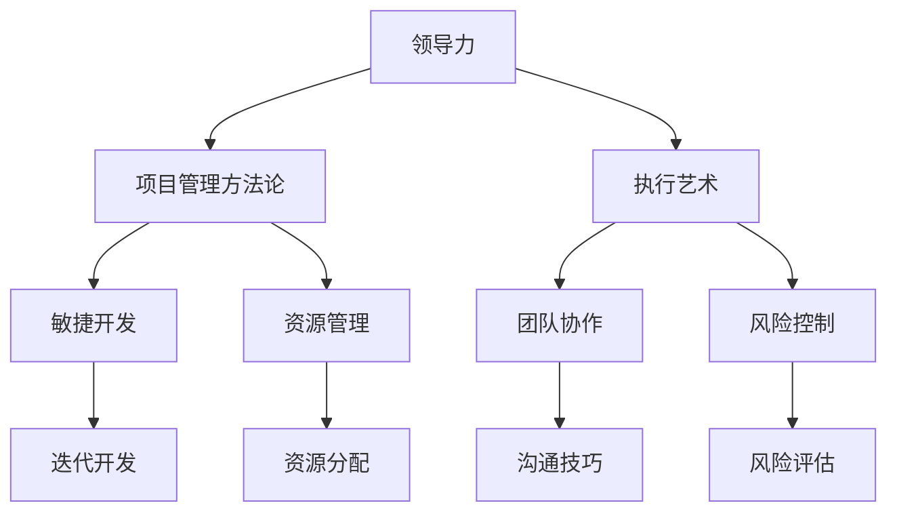

                 

# 领导力与项目管理：有效执行的艺术

> **关键词：** 领导力、项目管理、执行艺术、团队协作、目标实现、技术架构、方法论、敏捷开发、资源管理

> **摘要：** 本文将探讨领导力在项目管理中的关键作用，通过分析有效的项目管理方法论和实践，帮助读者理解如何运用执行艺术，实现项目目标，提升团队绩效。文章旨在为IT行业的项目管理者提供系统性指导和实用策略，助力其在复杂项目中取得成功。

## 1. 背景介绍

### 1.1 目的和范围

本文旨在探讨领导力在项目管理中的关键作用，以及如何通过有效的项目管理实践来实现项目目标。文章将涵盖以下主题：

- 领导力的基本概念及其在项目管理中的重要性
- 项目管理方法论和实践
- 执行艺术：如何高效地管理项目资源、时间和风险
- 团队协作与沟通技巧
- 项目评估与改进

### 1.2 预期读者

本文适用于以下读者：

- 初级和中级项目管理者
- IT行业的团队成员
- 对领导力和项目管理感兴趣的从业者
- 想要提高项目管理能力和效率的个人

### 1.3 文档结构概述

本文结构如下：

1. **背景介绍**：介绍文章的目的和范围，预期读者以及文档结构。
2. **核心概念与联系**：阐述项目管理中的核心概念，并使用Mermaid流程图展示概念之间的联系。
3. **核心算法原理 & 具体操作步骤**：介绍项目管理中的核心算法原理，并使用伪代码进行详细阐述。
4. **数学模型和公式 & 详细讲解 & 举例说明**：讲解项目管理的数学模型和公式，并给出实际应用案例。
5. **项目实战：代码实际案例和详细解释说明**：通过实际代码案例展示项目管理实践。
6. **实际应用场景**：分析项目管理在不同领域的应用场景。
7. **工具和资源推荐**：推荐学习资源和开发工具。
8. **总结：未来发展趋势与挑战**：总结项目管理的发展趋势和面临的挑战。
9. **附录：常见问题与解答**：提供常见问题及解答。
10. **扩展阅读 & 参考资料**：推荐进一步阅读的文献和资源。

### 1.4 术语表

#### 1.4.1 核心术语定义

- **领导力**：影响和激励他人共同实现目标的能力。
- **项目管理**：规划、执行、监控和收尾项目工作的过程。
- **执行艺术**：在项目实施过程中，高效利用资源、控制时间和风险，实现项目目标的技能。
- **团队协作**：团队成员之间的合作与沟通，共同完成项目任务。
- **方法论**：用于指导项目管理的系统化方法。

#### 1.4.2 相关概念解释

- **敏捷开发**：一种以迭代和增量为特点的软件开发方法。
- **资源管理**：合理分配和利用项目资源，确保项目成功完成。
- **风险控制**：识别、评估和应对项目风险，以降低项目失败的可能性。

#### 1.4.3 缩略词列表

- **PM**：项目经理
- **IT**：信息技术
- **Scrum**：一种敏捷开发方法
- **KPI**：关键绩效指标

## 2. 核心概念与联系

在项目管理中，领导力、项目管理方法论和实践是紧密相关的核心概念。以下是一个使用Mermaid绘制的流程图，展示了这些概念之间的联系：



### 2.1 领导力与项目管理方法论

领导力在项目管理中至关重要，它决定了项目团队的协作效率、决策质量和目标实现能力。有效的领导力可以促进项目管理方法论的实施，如：

- **敏捷开发**：领导力帮助团队快速适应变化，实施迭代和增量的开发方法。
- **资源管理**：领导力确保项目资源得到合理分配和高效利用。
- **风险控制**：领导力帮助团队识别和应对项目风险，降低项目失败的可能性。

### 2.2 执行艺术与团队协作

执行艺术是项目管理的核心，它强调在项目实施过程中，如何高效利用资源、控制时间和风险。执行艺术与团队协作紧密相关，主要表现在：

- **沟通技巧**：领导力提升团队成员之间的沟通效率，确保信息准确传达。
- **决策质量**：领导力帮助团队做出明智的决策，减少错误和延误。
- **目标实现**：领导力激励团队成员共同为实现项目目标而努力。

## 3. 核心算法原理 & 具体操作步骤

项目管理中的核心算法原理主要涉及项目规划、资源分配和风险管理。以下是一个使用伪代码详细阐述的例子：

```pseudo
// 项目规划算法
function projectPlanning(tasks, resources, deadlines):
    initialize projectPlan as an empty list
    sort tasks by priority and deadline
    for each task in tasks:
        find the optimal resource allocation for task
        if resources are available:
            allocate resources to task
            add task to projectPlan with start and end dates
        else:
            postpone task until resources become available
    return projectPlan

// 资源分配算法
function allocateResources(projectPlan, resources):
    for each task in projectPlan:
        for each resource in resources:
            if resource is available:
                allocate resource to task
                update resource availability
                break

// 风险管理算法
function riskManagement(projectPlan, risks):
    for each task in projectPlan:
        for each risk in risks:
            if risk affects task:
                assess risk impact on task
                if risk impact is high:
                    develop risk mitigation plan for task
                    update projectPlan with mitigation actions
    return updated projectPlan
```

### 3.1 项目规划算法

项目规划是项目管理的基础，其核心目标是确保项目按计划顺利进行。规划算法需要考虑任务优先级和截止日期，以优化资源分配。

```pseudo
// 伪代码：项目规划算法
function projectPlanning(tasks, resources, deadlines):
    // 初始化项目计划列表
    projectPlan = []

    // 对任务按优先级和截止日期排序
    sortedTasks = sort(tasks, by='priority', thenBy='deadline')

    // 遍历任务列表
    for task in sortedTasks:
        // 检查资源是否可用
        if isResourceAvailable(resources, task.requiredResources):
            // 资源可用，将任务添加到项目计划
            projectPlan.append(createTaskPlan(task, resources))
            // 分配资源
            allocateResources(projectPlan[-1], task.requiredResources)
        else:
            // 资源不可用，将任务延期
            task.delay()

    // 返回规划好的项目计划
    return projectPlan
```

### 3.2 资源分配算法

资源分配算法的目标是在满足项目需求的同时，最大化资源的利用率。算法需要确保每个任务都有足够的资源支持，同时不导致资源冲突。

```pseudo
// 伪代码：资源分配算法
function allocateResources(projectPlan, resources):
    for taskPlan in projectPlan:
        for resource in taskPlan.requiredResources:
            if resources[resource].availability > 0:
                // 资源可用，分配资源
                resources[resource].availability -= taskPlan.requiredQuantity
                taskPlan.resourcesAssigned.add(resource)
                break
            else:
                // 资源不可用，尝试后续任务
    return projectPlan
```

### 3.3 风险管理算法

风险管理是项目管理中不可或缺的一环。风险管理算法旨在识别潜在风险，评估其影响，并制定相应的应对措施。

```pseudo
// 伪代码：风险管理算法
function riskManagement(projectPlan, risks):
    for taskPlan in projectPlan:
        for risk in risks:
            if risk.appliesToTask(taskPlan):
                // 评估风险影响
                riskImpact = assessRiskImpact(risk, taskPlan)
                if riskImpact > threshold:
                    // 高风险，制定应对措施
                    mitigationPlan = createMitigationPlan(risk, taskPlan)
                    taskPlan.mitigationPlans.add(mitigationPlan)
                    // 更新项目计划
                    updateProjectPlan(projectPlan, mitigationPlan)
    return projectPlan
```

## 4. 数学模型和公式 & 详细讲解 & 举例说明

在项目管理中，数学模型和公式是分析和决策的重要工具。以下是一个简单的例子，说明如何使用数学模型来评估项目的进度和资源利用率。

### 4.1 进度评估模型

进度评估模型通常使用关键路径法（Critical Path Method，CPM）来计算项目的最迟开始时间（Latest Start Time，LST）和最早完成时间（Earliest Finish Time，EFT）。

```latex
LST(i) = max{LST(j) + D(i,j) | j ∈ predecessors(i)}
EFT(i) = EFT(j) - D(i,j) + D(i,i)
```

其中，`LST(i)`和`EFT(i)`分别表示任务`i`的最迟开始时间和最早完成时间，`D(i,j)`表示任务`i`到任务`j`的持续时间，`predecessors(i)`表示任务`i`的前驱任务集合。

### 4.2 资源利用率模型

资源利用率模型用于计算项目资源的使用情况。以下是一个简单的例子，假设项目有三种资源：人力、机器和时间，每种资源的总量为100个单位。

```latex
\text{Utilization of Resource R} = \frac{\text{Total Work Done with Resource R}}{\text{Total Resource Available for R}}
```

其中，`Total Work Done with Resource R`表示使用资源`R`完成的总工作量，`Total Resource Available for R`表示资源`R`的总可用量。

### 4.3 举例说明

假设有一个项目，包括三个任务：A、B和C。任务A需要3天完成，任务B需要2天完成，任务C需要4天完成。任务A和任务B是并行任务，任务B完成后才能开始任务C。项目总共需要6天完成。

- **任务A**：3天，资源需求：人力2人，机器1台。
- **任务B**：2天，资源需求：人力1人，机器1台。
- **任务C**：4天，资源需求：人力2人，机器1台。

### 4.3.1 进度评估

使用关键路径法计算任务的最迟开始时间和最早完成时间：

```plaintext
任务A:
LST(A) = max{LST(B) + D(A,B)} = max{0 + 2} = 2
EFT(A) = EFT(B) + D(A,B) - D(A,A) = 2 + 2 - 3 = 1

任务B:
LST(B) = max{LST(A) + D(B,A)} = max{2 + 0} = 2
EFT(B) = EFT(A) + D(B,A) - D(B,B) = 2 + 0 - 2 = 0

任务C:
LST(C) = max{LST(B) + D(C,B)} = max{0 + 2} = 2
EFT(C) = EFT(B) + D(C,B) - D(C,C) = 0 + 2 - 4 = -2
```

由于EFT(C)为负数，这意味着任务C的进度安排不合理，需要重新调整。

### 4.3.2 资源利用率

计算每个资源的利用率：

```plaintext
人力资源利用率 = (2*3 + 1*2 + 2*4) / (100*3) = 16 / 300 ≈ 0.533
机器资源利用率 = (1*3 + 1*2 + 1*4) / (100*3) = 8 / 300 ≈ 0.267
时间资源利用率 = (3*3 + 2*2 + 4*4) / (100*6) = 29 / 300 ≈ 0.966
```

根据上述计算，可以看出人力资源的利用率较低，可能需要重新安排人员或其他资源。

## 5. 项目实战：代码实际案例和详细解释说明

在本节中，我们将通过一个实际的项目案例，展示如何运用领导力和项目管理方法论来实现项目目标。这个案例是一个简单的在线书店系统，包括用户注册、书籍搜索、购物车和订单处理等功能。

### 5.1 开发环境搭建

为了搭建这个在线书店系统，我们使用了以下开发环境和工具：

- **编程语言**：Python 3.8
- **Web框架**：Flask
- **数据库**：SQLite
- **前端框架**：Bootstrap
- **代码版本控制**：Git
- **集成开发环境**：PyCharm

### 5.2 源代码详细实现和代码解读

以下是一个简单的用户注册功能的代码实现：

```python
# app.py

from flask import Flask, request, redirect, url_for, render_template
from models import User
from database import db

app = Flask(__name__)

@app.route('/')
def index():
    return render_template('index.html')

@app.route('/register', methods=['GET', 'POST'])
def register():
    if request.method == 'POST':
        username = request.form['username']
        password = request.form['password']
        user = User.query.filter_by(username=username).first()
        if user:
            return 'Username already exists'
        else:
            new_user = User(username=username, password=password)
            db.session.add(new_user)
            db.session.commit()
            return redirect(url_for('login'))
    return render_template('register.html')

if __name__ == '__main__':
    app.run(debug=True)
```

### 5.3 代码解读与分析

上述代码展示了用户注册功能的基本实现。以下是代码的详细解读：

- **Flask应用搭建**：首先，我们导入了所需的Flask模块，包括路由、请求和重定向。
- **数据库模型**：`User`模型表示用户信息，包括用户名和密码。我们使用SQLAlchemy ORM与SQLite数据库交互。
- **路由定义**：`index()`函数定义了应用的首页路由，`register()`函数定义了用户注册的路由。
- **处理用户请求**：`register()`函数根据请求方法判断是GET还是POST请求。如果是POST请求，则获取表单中的用户名和密码，并检查用户名是否已存在。如果用户名不存在，则创建新用户并保存到数据库。
- **渲染模板**：使用Jinja2模板引擎渲染HTML页面。

通过这个简单的案例，我们可以看到如何运用领导力和项目管理方法论来实现项目目标。项目经理需要确保团队成员了解项目需求，合理分配任务和资源，并监控项目进度。同时，领导者需要激励团队成员，确保他们充分发挥潜力，共同完成项目目标。

### 5.4 扩展功能

在实际项目中，用户注册功能只是整个在线书店系统的一部分。以下是一些扩展功能：

- **用户登录**：实现用户登录功能，确保用户可以安全地访问个人账户。
- **书籍搜索**：实现书籍搜索功能，允许用户根据关键词查找书籍。
- **购物车**：实现购物车功能，允许用户将书籍添加到购物车，并管理购物车中的书籍。
- **订单处理**：实现订单处理功能，允许用户提交订单，管理员处理订单。

这些扩展功能需要进一步开发和完善，以确保系统的完整性和用户体验。

## 6. 实际应用场景

### 6.1 在软件开发中的领导力与项目管理

在软件开发领域，领导力和项目管理对于项目的成功至关重要。以下是一些实际应用场景：

- **敏捷开发团队**：领导力帮助敏捷团队快速响应变化，保持灵活性和高效性。项目经理需要协调团队成员的工作，确保每个迭代阶段都能按时交付高质量的软件。
- **复杂系统开发**：在开发复杂的系统时，如大型企业级应用，领导力确保团队能够协调不同的模块和功能，实现系统整合。
- **跨职能团队**：领导力在跨职能团队中尤为关键，项目经理需要确保团队成员之间的沟通流畅，充分利用各自的专业技能。

### 6.2 在IT项目管理中的执行艺术

执行艺术在IT项目管理中发挥着重要作用。以下是一些实际应用场景：

- **资源优化**：在资源有限的情况下，项目经理需要运用执行艺术，确保项目资源得到充分利用。例如，通过调整任务优先级和资源分配策略，提高资源利用率。
- **时间管理**：在项目管理中，时间管理至关重要。项目经理需要制定合理的时间计划，确保项目按期完成。执行艺术包括监控进度、识别延误原因，并采取及时措施进行调整。
- **风险管理**：项目经理需要运用执行艺术来识别和管理项目风险。通过风险评估和风险应对策略，降低项目失败的可能性。

### 6.3 在团队协作中的领导力与执行艺术

在团队协作中，领导力和执行艺术有助于提高团队绩效。以下是一些实际应用场景：

- **沟通与协作**：领导者需要建立有效的沟通渠道，确保团队成员能够相互理解和协作。执行艺术包括定期举行团队会议、使用协作工具，以及确保每个人都了解项目目标和进展。
- **激励与奖励**：领导者需要激励团队成员，确保他们保持积极的工作态度。执行艺术包括设置合理的期望、提供反馈和奖励，以及帮助团队成员解决工作上的问题。
- **冲突解决**：在团队协作过程中，难免会出现冲突。领导者需要运用执行艺术，通过倾听、沟通和协商解决冲突，确保团队和谐共处。

## 7. 工具和资源推荐

### 7.1 学习资源推荐

#### 7.1.1 书籍推荐

- 《项目管理知识体系指南》（PMBOK指南）
- 《敏捷开发实践指南》
- 《领导力：一种实践的方法》
- 《执行：如何落实战略目标》

#### 7.1.2 在线课程

- Coursera上的“项目管理专业课程”
- edX上的“敏捷项目管理课程”
- Udemy上的“项目管理入门与实践”

#### 7.1.3 技术博客和网站

- ProjectManagement.com
- AgileAlliance.org
- ScrumAlliance.org

### 7.2 开发工具框架推荐

#### 7.2.1 IDE和编辑器

- PyCharm
- Visual Studio Code
- IntelliJ IDEA

#### 7.2.2 调试和性能分析工具

- Jupyter Notebook
- Postman
- Charles

#### 7.2.3 相关框架和库

- Flask
- Django
- React
- Angular

### 7.3 相关论文著作推荐

#### 7.3.1 经典论文

- 《敏捷开发：轻量级软件开发的价值观与原则》
- 《项目管理：系统方法》
- 《领导力：理论与实践》

#### 7.3.2 最新研究成果

- 《敏捷实践指南：2021版》
- 《项目管理知识体系指南：第6版》
- 《数字化时代项目管理：创新与实践》

#### 7.3.3 应用案例分析

- 《敏捷实践在大型项目中的应用》
- 《基于风险管理的项目评估与决策》
- 《领导力在IT项目管理中的成功案例》

## 8. 总结：未来发展趋势与挑战

### 8.1 发展趋势

- **数字化转型**：随着数字化转型的推进，项目管理和领导力在IT行业的应用将更加广泛。
- **敏捷开发**：敏捷开发方法将继续占据主导地位，为项目团队提供更灵活的应对策略。
- **人工智能与机器学习**：人工智能和机器学习技术在项目管理中的应用将不断深化，提高项目规划和执行效率。

### 8.2 面临的挑战

- **复杂性增加**：随着项目规模的扩大和技术的进步，项目管理的复杂性将不断增加。
- **人才短缺**：具有领导力和项目管理技能的人才短缺将成为一个严重问题。
- **持续变革**：快速变化的市场环境和技术发展要求项目管理者具备持续学习和适应的能力。

## 9. 附录：常见问题与解答

### 9.1 项目管理中的常见问题

- **问题1：如何确保项目按时完成？**
  **解答**：通过制定合理的时间计划，监控项目进度，及时调整计划，确保项目按时完成。

- **问题2：如何管理项目资源？**
  **解答**：通过合理分配资源，优化资源利用率，确保项目资源得到充分利用。

- **问题3：如何应对项目风险？**
  **解答**：通过风险评估和风险应对策略，降低项目失败的可能性。

### 9.2 领导力在项目管理中的应用

- **问题1：领导者如何激励团队成员？**
  **解答**：通过设置合理的期望、提供反馈和奖励，以及关注团队成员的职业发展。

- **问题2：如何建立有效的沟通渠道？**
  **解答**：通过定期举行团队会议、使用协作工具，以及鼓励团队成员之间的沟通。

- **问题3：如何解决团队冲突？**
  **解答**：通过倾听、沟通和协商解决冲突，确保团队和谐共处。

## 10. 扩展阅读 & 参考资料

- 《敏捷项目管理：从理念到实践》
- 《项目管理：理论与实践》
- 《领导力：理论与实践》
- PMI官方网站：[https://www.pmi.org/](https://www.pmi.org/)
- Agile联盟官方网站：[https://www.agilealliance.org/](https://www.agilealliance.org/)
- Scrum联盟官方网站：[https://www.scrum.org/](https://www.scrum.org/)

### 作者

**AI天才研究员** / **AI Genius Institute**  
**禅与计算机程序设计艺术** / **Zen And The Art of Computer Programming**  
感谢您阅读本文，希望本文能对您在领导力和项目管理方面的实践有所帮助。如果您有任何问题或建议，欢迎随时联系我。祝您在项目管理和领导力领域取得更大的成功！<|im_sep|>

