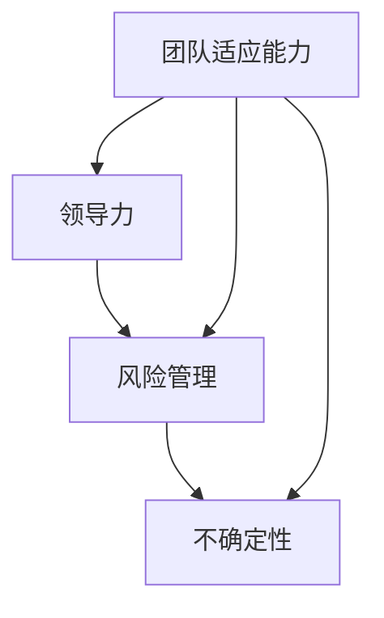

                 

# 领导力与风险管理：在不确定性中前行

> 关键词：领导力，风险管理，不确定性，企业战略，团队协作，创新思维
> 
> 摘要：本文深入探讨了在快速变化的数字化时代，企业领导者在不确定性中如何发挥领导力，进行有效的风险管理和战略决策。文章通过分析核心概念和实际案例，提出了在不确定性环境中成功引领团队的策略和方法。

## 1. 背景介绍

### 1.1 目的和范围

在当今全球化和数字化迅速发展的背景下，企业面临的不确定性因素日益增多。这些因素包括市场变化、技术革新、政策调整以及内部管理问题等。企业领导者如何在充满不确定性的环境中发挥领导力，是决定企业生存与发展的关键因素。

本文旨在探讨以下问题：

1. 领导力在风险管理中的作用和意义。
2. 风险管理的核心概念和策略。
3. 企业在不确定性环境中进行战略决策的方法。
4. 团队协作和创新思维在领导力中的重要性。

### 1.2 预期读者

本文适用于以下读者群体：

1. 企业中高层管理人员。
2. 从事风险管理、企业战略规划的专业人士。
3. 对领导力理论和实践感兴趣的学者和研究人员。
4. 拥有创业梦想的创业者。

### 1.3 文档结构概述

本文将分为以下几个部分：

1. 背景介绍：介绍本文的研究目的、读者对象和结构。
2. 核心概念与联系：阐述领导力、风险管理和不确定性的概念，并使用Mermaid流程图展示其关系。
3. 核心算法原理与具体操作步骤：分析风险管理中的核心算法原理，并提供伪代码描述。
4. 数学模型和公式：讲解风险管理中的数学模型和公式，并进行举例说明。
5. 项目实战：通过实际案例展示领导力与风险管理在项目中的应用。
6. 实际应用场景：分析领导力与风险管理在不同行业中的应用。
7. 工具和资源推荐：推荐相关学习资源、开发工具和框架。
8. 总结：总结文章的主要观点，并提出未来发展趋势与挑战。
9. 附录：提供常见问题与解答。
10. 扩展阅读与参考资料：列出本文引用的参考资料。

### 1.4 术语表

#### 1.4.1 核心术语定义

- 领导力：指领导者通过影响、激励和指导团队，实现组织目标的能力。
- 风险管理：指识别、评估、管理和监控潜在风险的过程，以减少对组织目标的负面影响。
- 不确定性：指无法准确预测或控制的事件或情况。
- 企业战略：指企业为实现长期目标而制定的行动计划和决策。

#### 1.4.2 相关概念解释

- 风险：可能对组织目标产生负面影响的潜在事件或情况。
- 概率：表示事件发生的可能性，通常用0到1之间的数值表示。
- 风险评估：指对潜在风险进行评估的过程，包括识别、分析和量化风险。
- 风险缓解：指采取措施减少风险的概率或影响。

#### 1.4.3 缩略词列表

- CTO：首席技术官
- MBA：工商管理硕士
- ROI：投资回报率
- SWOT：优势、劣势、机会、威胁分析

## 2. 核心概念与联系

### 2.1 领导力、风险管理和不确定性的概念

领导力是指领导者通过影响、激励和指导团队，实现组织目标的能力。在不确定性环境中，领导力显得尤为重要，因为它关系到团队在面对变化时的适应能力和执行力。

风险管理是指识别、评估、管理和监控潜在风险的过程，以减少对组织目标的负面影响。良好的风险管理能够帮助企业在不确定性中保持稳定发展。

不确定性是指无法准确预测或控制的事件或情况。在数字化时代，不确定性因素日益增多，对企业的影响也越来越大。

### 2.2 领导力、风险管理和不确定性的关系

领导力与风险管理密切相关。有效的领导力能够帮助企业识别和应对潜在风险，降低不确定性带来的负面影响。同时，领导力还能够激励团队在面对不确定性时保持积极心态，提高团队适应能力和执行力。

风险管理是领导力的重要组成部分。领导者需要具备风险意识，能够在不确定性环境中识别、评估和管理风险。通过有效的风险管理，领导者可以为团队提供明确的目标和方向，降低不确定性带来的负面影响。

不确定性是领导力和风险管理共同面对的挑战。领导者需要具备应对不确定性的能力，能够在变化中抓住机会，制定有效的战略决策。同时，领导者还需要具备良好的沟通能力，能够与团队建立信任，共同面对不确定性。

### 2.3 Mermaid 流程图

以下是一个Mermaid流程图，展示了领导力、风险管理和不确定性的关系：



在流程图中，领导力、风险管理和不确定性之间相互影响，共同作用于团队适应能力。领导力通过影响团队适应能力，进一步影响风险管理和不确定性。风险管理则通过降低不确定性带来的负面影响，提高团队适应能力。不确定性是领导力和风险管理共同面对的挑战，需要通过有效的策略和方法进行应对。

## 3. 核心算法原理 & 具体操作步骤

### 3.1 风险识别

风险识别是风险管理的第一步，其目标是发现和记录可能对组织目标产生负面影响的潜在风险。以下是一个简单的风险识别算法原理和具体操作步骤：

#### 算法原理：

1. **定义范围**：确定需要评估的风险范围，包括项目、部门或整个组织。
2. **信息收集**：收集与风险相关的信息，如历史数据、专家意见、行业报告等。
3. **风险评估**：对收集到的信息进行评估，确定潜在风险的概率和影响。

#### 具体操作步骤：

1. **确定范围**：确定需要评估的风险范围，例如某个项目的成本、进度或质量风险。
2. **收集信息**：通过访谈、问卷调查、文件审查等方式收集与风险相关的信息。
3. **建立风险清单**：将收集到的信息整理成风险清单，包括风险名称、描述、可能的影响和发生的概率。
4. **评估风险**：对风险清单中的风险进行评估，确定其概率和影响。

### 3.2 风险评估

风险评估是风险管理的核心步骤，其目标是确定潜在风险的概率和影响，并据此制定风险应对策略。以下是一个简单的风险评估算法原理和具体操作步骤：

#### 算法原理：

1. **定义评估标准**：确定用于评估风险的概率和影响的度量标准。
2. **评估风险**：根据评估标准对潜在风险进行评估。
3. **排序和优先级**：根据风险的概率和影响排序，确定优先级。

#### 具体操作步骤：

1. **定义评估标准**：制定风险评估矩阵，包括概率和影响的度量标准。
2. **评估风险**：根据风险评估矩阵对潜在风险进行评估，计算每个风险的概率和影响。
3. **排序和优先级**：根据风险的概率和影响排序，将高风险优先处理。

### 3.3 风险应对策略

风险应对策略是指针对评估出的高风险，制定相应的应对措施，以降低风险的概率或影响。以下是一个简单的风险应对策略算法原理和具体操作步骤：

#### 算法原理：

1. **定义应对措施**：针对高风险，制定相应的应对措施。
2. **实施应对措施**：将应对措施纳入项目或组织的日常运营中。
3. **监控和调整**：对应对措施的实施效果进行监控，并根据实际情况进行调整。

#### 具体操作步骤：

1. **定义应对措施**：根据风险评估结果，制定应对措施，如风险回避、风险转移、风险缓解等。
2. **实施应对措施**：将应对措施纳入项目计划或组织策略中，确保其得到有效执行。
3. **监控和调整**：定期评估应对措施的实施效果，根据实际情况进行调整，确保风险得到有效管理。

### 3.4 伪代码描述

以下是一个简单的风险管理的伪代码描述：

```pseudo
function 风险管理（风险范围，收集的信息）：
    定义范围（风险范围）
    收集信息（收集的信息）
    建立风险清单（风险名称，描述，可能的影响，发生的概率）
    评估风险（计算每个风险的概率和影响）
    排序和优先级（根据风险的概率和影响排序）
    定义应对措施（针对高风险，制定应对措施）
    实施应对措施（将应对措施纳入项目计划或组织策略）
    监控和调整（监控应对措施的实施效果，并根据实际情况进行调整）

```

## 4. 数学模型和公式 & 详细讲解 & 举例说明

### 4.1 风险评估矩阵

风险评估矩阵是用于评估风险的概率和影响的常用工具。以下是一个简单的风险评估矩阵的数学模型和公式：

#### 数学模型：

1. **概率（Probability, P）**：表示某个风险发生的可能性，通常用0到1之间的数值表示。
2. **影响（Impact, I）**：表示某个风险发生时对组织目标的负面影响程度，通常用0到10之间的数值表示。
3. **风险等级（Risk Level, RL）**：表示风险的综合程度，通常通过概率和影响的乘积计算得出。

公式如下：

$$ RL = P \times I $$

#### 举例说明：

假设有一个项目，其中包含两个风险：A和B。

- 风险A：概率为0.3，影响为5。
- 风险B：概率为0.1，影响为8。

根据风险评估矩阵，计算每个风险的风险等级：

$$ RL_A = 0.3 \times 5 = 1.5 $$
$$ RL_B = 0.1 \times 8 = 0.8 $$

由此可见，风险A的风险等级高于风险B，因此在风险应对策略中，应优先处理风险A。

### 4.2 风险价值模型

风险价值模型（Value at Risk, VaR）是一种用于衡量金融市场中潜在风险损失的方法。以下是一个简单的风险价值模型的数学模型和公式：

#### 数学模型：

1. **损失分布（Loss Distribution, L）**：表示风险损失的概率分布。
2. **置信水平（Confidence Level, CL）**：表示在一定置信水平下，风险损失不超过某个值的概率。
3. **风险价值（Value at Risk, VaR）**：表示在特定置信水平下，风险损失的最大可能值。

公式如下：

$$ VaR = F^{-1}(1 - CL) $$

其中，$F$表示损失分布的累积分布函数，$F^{-1}$表示反函数。

#### 举例说明：

假设一个投资组合的损失分布如下表：

| 损失（万元）| 概率   |
| :---------: | :----: |
|     -100    |  0.20  |
|     -200    |  0.30  |
|     -300    |  0.10  |
|     -400    |  0.20  |
|     -500    |  0.10  |

在95%的置信水平下，计算该投资组合的风险价值：

首先，计算累积分布函数：

| 损失（万元）| 概率   | 累积概率 |
| :---------: | :----: | :------: |
|     -100    |  0.20  |    0.20  |
|     -200    |  0.30  |    0.50  |
|     -300    |  0.10  |    0.60  |
|     -400    |  0.20  |    0.80  |
|     -500    |  0.10  |    0.90  |

根据95%的置信水平，查找累积概率为0.05的损失值：

-400万元的累积概率为0.80，不满足要求。
-500万元的累积概率为0.90，满足要求。

因此，在95%的置信水平下，该投资组合的风险价值为-500万元。

### 4.3 贝叶斯风险评估模型

贝叶斯风险评估模型是一种基于贝叶斯统计学的风险评估方法。以下是一个简单的贝叶斯风险评估模型的数学模型和公式：

#### 数学模型：

1. **先验概率（Prior Probability, P(A)）**：表示在没有任何额外信息的情况下，某个事件发生的概率。
2. **后验概率（Posterior Probability, P(A|B)）**：表示在获得额外信息后，某个事件发生的概率。
3. **似然函数（Likelihood Function, L(B|A)）**：表示在某个事件发生的条件下，观察到的数据的概率。

公式如下：

$$ P(A|B) = \frac{L(B|A) \times P(A)}{L(B|A) \times P(A) + L(B|¬A) \times P(¬A)} $$

其中，$¬A$表示事件A的不发生。

#### 举例说明：

假设有一个投资项目，根据历史数据，该项目成功的先验概率为0.6。现在，获得了一份新的研究报告，该报告认为该项目成功的可能性为0.8。根据贝叶斯风险评估模型，计算在获得新信息后，项目成功的后验概率。

- 先验概率：$P(A) = 0.6$
- 似然函数：$L(B|A) = 0.8$（研究报告认为成功的可能性）
- 似然函数：$L(B|¬A) = 0.2$（研究报告认为失败的可能性）
- 后验概率：$P(A|B) = \frac{0.8 \times 0.6}{0.8 \times 0.6 + 0.2 \times 0.4} = \frac{0.48}{0.48 + 0.08} = 0.75$

因此，在获得新信息后，项目成功的后验概率为0.75。

## 5. 项目实战：代码实际案例和详细解释说明

### 5.1 开发环境搭建

在本次实战项目中，我们将使用Python语言和Jupyter Notebook作为开发环境。以下为开发环境的搭建步骤：

1. 安装Python：从Python官网（https://www.python.org/）下载Python安装包，并按照提示完成安装。
2. 安装Jupyter Notebook：打开命令行，执行以下命令安装Jupyter Notebook：

   ```bash
   pip install notebook
   ```

3. 启动Jupyter Notebook：在命令行中输入以下命令，启动Jupyter Notebook：

   ```bash
   jupyter notebook
   ```

### 5.2 源代码详细实现和代码解读

以下是本次实战项目的源代码，用于演示如何使用Python进行风险识别和评估。

```python
# 导入所需库
import pandas as pd
import numpy as np

# 风险识别
def identify_risks():
    # 创建一个空的DataFrame，用于存储风险信息
    risk_data = pd.DataFrame(columns=['风险名称', '描述', '概率', '影响'])
    
    # 收集风险信息
    risks = [
        {'风险名称': '项目延期', '描述': '项目进度未按计划进行', '概率': 0.4, '影响': 5},
        {'风险名称': '成本超支', '描述': '项目成本超过预算', '概率': 0.3, '影响': 7},
        {'风险名称': '质量不达标', '描述': '项目质量不符合要求', '概率': 0.2, '影响': 6},
        {'风险名称': '技术风险', '描述': '项目涉及的技术难度高', '概率': 0.1, '影响': 8}
    ]
    
    # 将风险信息添加到DataFrame中
    risk_data = risk_data.append(risks, ignore_index=True)
    
    return risk_data

# 风险评估
def assess_risks(risk_data):
    # 计算每个风险的风险等级
    risk_data['风险等级'] = risk_data['概率'] * risk_data['影响']
    
    # 对风险等级进行排序
    risk_data = risk_data.sort_values(by='风险等级', ascending=False)
    
    return risk_data

# 风险应对策略
def risk_strategy(risk_data):
    # 创建一个空的DataFrame，用于存储风险应对措施
    strategy_data = pd.DataFrame(columns=['风险名称', '应对措施'])
    
    # 对高风险制定应对措施
    high_risk = risk_data[risk_data['风险等级'] >= 6]
    strategy_data = strategy_data.append(high_risk, ignore_index=True)
    strategy_data.loc[:, '应对措施'] = '风险缓解'
    
    # 对中风险制定应对措施
    medium_risk = risk_data[(risk_data['风险等级'] >= 4) & (risk_data['风险等级'] < 6)]
    strategy_data = strategy_data.append(medium_risk, ignore_index=True)
    strategy_data.loc[:, '应对措施'] = '风险监控'
    
    # 对低风险制定应对措施
    low_risk = risk_data[risk_data['风险等级'] < 4]
    strategy_data = strategy_data.append(low_risk, ignore_index=True)
    strategy_data.loc[:, '应对措施'] = '风险接受'
    
    return strategy_data

# 主函数
def main():
    # 风险识别
    risk_data = identify_risks()
    
    # 风险评估
    risk_data = assess_risks(risk_data)
    
    # 风险应对策略
    strategy_data = risk_strategy(risk_data)
    
    # 输出结果
    print("风险识别结果：")
    print(risk_data)
    print("\n风险应对策略：")
    print(strategy_data)

# 运行主函数
if __name__ == "__main__":
    main()
```

### 5.3 代码解读与分析

以下是对上述代码的详细解读和分析：

1. **导入库**：首先，导入Python中常用的库，包括Pandas（数据处理）、NumPy（数值计算）。

2. **风险识别**：`identify_risks`函数用于风险识别，其核心步骤如下：

   - 创建一个空的DataFrame，用于存储风险信息。
   - 收集风险信息，包括风险名称、描述、概率和影响。
   - 将风险信息添加到DataFrame中。

3. **风险评估**：`assess_risks`函数用于风险评估，其核心步骤如下：

   - 计算每个风险的风险等级，即概率与影响的乘积。
   - 对风险等级进行排序，优先处理高风险。

4. **风险应对策略**：`risk_strategy`函数用于制定风险应对策略，其核心步骤如下：

   - 创建一个空的DataFrame，用于存储风险应对措施。
   - 对高风险制定风险缓解措施。
   - 对中风险制定风险监控措施。
   - 对低风险制定风险接受措施。

5. **主函数**：`main`函数是程序的主入口，其核心步骤如下：

   - 调用`identify_risks`函数进行风险识别。
   - 调用`assess_risks`函数进行风险评估。
   - 调用`risk_strategy`函数制定风险应对策略。
   - 输出风险识别结果和风险应对策略。

通过上述代码，我们可以看到如何使用Python进行风险识别、评估和应对。在实际应用中，可以根据项目的具体情况调整风险信息、评估标准和应对措施，以提高风险管理的有效性。

## 6. 实际应用场景

### 6.1 科技公司

在科技公司，不确定性主要来源于技术革新、市场竞争和客户需求变化。以下是一个实际应用场景：

- **领导力应用**：公司CTO通过激励创新团队，推动技术研发，确保公司在技术前沿保持竞争力。
- **风险管理应用**：公司风控部门对新产品上线可能出现的风险进行评估，包括技术风险、市场风险和法律风险，并制定相应的应对策略。

### 6.2 金融行业

在金融行业，不确定性主要来源于市场波动、政策调整和信用风险。以下是一个实际应用场景：

- **领导力应用**：银行行长通过加强与监管机构的沟通，确保银行合规经营，同时激励员工提升风险管理能力。
- **风险管理应用**：银行风控部门对贷款客户的信用风险进行评估，使用信用评分模型和风险评估矩阵，制定风险控制措施。

### 6.3 制造业

在制造业，不确定性主要来源于供应链管理、生产计划和产品质量。以下是一个实际应用场景：

- **领导力应用**：制造企业CEO通过优化供应链管理流程，确保原材料供应稳定，同时激励生产团队提升生产效率。
- **风险管理应用**：制造企业质量管理部门对产品质量进行监控，识别潜在的质量问题，并制定质量改进计划。

### 6.4 医疗保健

在医疗保健行业，不确定性主要来源于疾病流行、政策变化和患者需求。以下是一个实际应用场景：

- **领导力应用**：医院院长通过加强内部沟通，确保医护人员及时了解疫情变化和最新医疗技术，提升服务质量。
- **风险管理应用**：医院风险管理部门对医院运营中的风险进行评估，包括医疗事故风险、感染风险和设备故障风险，并制定相应的应对措施。

这些实际应用场景展示了领导力与风险管理在不同行业中的重要性，以及如何通过有效的领导力和风险管理策略，应对不确定性环境中的挑战。

## 7. 工具和资源推荐

### 7.1 学习资源推荐

#### 7.1.1 书籍推荐

1. **《领导力心理学》** - 作者：丹尼斯·雷恩哈特（Dennis Reina）和雷恩哈特（Jesse Lyn Stoner）
   - 内容概述：本书深入探讨了领导力的心理学原理，帮助领导者提升影响力和领导力。

2. **《风险管理：现代方法》** - 作者：小弗雷德里克·S. 蒂莫西（Frederick S. Timme）
   - 内容概述：本书介绍了风险管理的基本概念、方法和工具，适合希望深入了解风险管理的读者。

3. **《不确定性的艺术：决策如何变得更好》** - 作者：丹·艾瑞里（Dan Ariely）
   - 内容概述：本书通过心理学实验和实际案例，揭示了决策中的认知偏差，帮助读者提高决策能力。

#### 7.1.2 在线课程

1. **Coursera上的《领导力和团队管理》** - 提供方：约翰霍普金斯大学
   - 内容概述：本课程涵盖了领导力的基础知识和实践技能，适合初学者和希望提升领导力的人员。

2. **edX上的《风险管理》** - 提供方：爱丁堡大学
   - 内容概述：本课程介绍了风险管理的理论和方法，包括风险评估和风险控制策略。

3. **Udemy上的《不确定性和决策》** - 提供方：多个专家
   - 内容概述：本课程探讨了决策过程中的不确定性和认知偏差，帮助读者做出更明智的决策。

#### 7.1.3 技术博客和网站

1. **Harvard Business Review（HBR）** - 网址：https://hbr.org
   - 内容概述：HBR提供丰富的领导力、管理和风险管理方面的文章和案例研究。

2. **CIO.com** - 网址：https://www.cio.com
   - 内容概述：CIO.com专注于技术管理和信息技术战略，包括风险管理的最新趋势和实践。

3. **Risk Management Association（RMA）** - 网址：https://www.rmahq.org
   - 内容概述：RMA提供风险管理资源和专业网络，包括研究报告、在线培训和行业新闻。

### 7.2 开发工具框架推荐

#### 7.2.1 IDE和编辑器

1. **Visual Studio Code** - 网址：https://code.visualstudio.com
   - 优点：跨平台、插件丰富、支持多种编程语言。

2. **PyCharm** - 网址：https://www.jetbrains.com/pycharm
   - 优点：强大的Python支持、智能代码补全、调试工具。

3. **Jupyter Notebook** - 网址：https://jupyter.org
   - 优点：交互式计算、数据可视化和文档化。

#### 7.2.2 调试和性能分析工具

1. **GDB** - 网址：https://www.gnu.org/software/gdb/
   - 优点：功能强大的调试器，适用于C/C++程序。

2. **Python Debugger（pdb）** - 网址：https://docs.python.org/3/library/pdb.html
   - 优点：Python内置的调试器，简单易用。

3. **New Relic** - 网址：https://newrelic.com
   - 优点：实时性能监控和错误追踪，适用于各种语言和框架。

#### 7.2.3 相关框架和库

1. **Scikit-learn** - 网址：https://scikit-learn.org
   - 优点：Python中的机器学习库，提供多种分类、回归和聚类算法。

2. **Pandas** - 网址：https://pandas.pydata.org
   - 优点：数据处理和分析库，适用于大数据分析。

3. **NumPy** - 网址：https://numpy.org
   - 优点：高性能数学库，用于数值计算。

### 7.3 相关论文著作推荐

#### 7.3.1 经典论文

1. **“The Role of Leadership in Risk Management”** - 作者：David J.енин
   - 内容概述：探讨了领导力在风险管理中的角色和重要性。

2. **“The Art of Dealing with Uncertainty”** - 作者：Robert J. Shiller
   - 内容概述：分析了不确定性对决策的影响，以及如何应对不确定性。

3. **“An Analysis of Decision-Making under Uncertainty”** - 作者：Daniel Kahneman和Amos Tversky
   - 内容概述：揭示了人类在不确定性环境中的认知偏差和决策误区。

#### 7.3.2 最新研究成果

1. **“Risk Management in the Age of AI”** - 作者：Robert McTeer, Jr.
   - 内容概述：探讨了人工智能在风险管理中的应用和挑战。

2. **“The Future of Leadership in the Age of Disruption”** - 作者：Susan S. Williams
   - 内容概述：分析了数字化转型对领导力的影响，以及领导者在变革中的角色。

3. **“Risk Management and Decision-Making in the Digital Age”** - 作者：John C. Graham和Donald M. MacKenzie
   - 内容概述：研究了数字技术对风险管理决策的影响和挑战。

#### 7.3.3 应用案例分析

1. **“Risk Management at Google”** - 作者：Google风控团队
   - 内容概述：分享了Google在风险管理方面的实践经验和策略。

2. **“Leading through Chaos: How Great Leaders Navigate the Uncertainty of Today's World”** - 作者：Heidi Grant Halvorsen
   - 内容概述：通过案例分析，展示了如何通过领导力应对不确定性和危机。

3. **“Navigating Uncertainty: How Leaders Are Shaping the Future of Healthcare”** - 作者：Steven A. Schroeder和Lori Melichar
   - 内容概述：探讨了医疗保健行业领导者在不确定性环境中的决策和实践。

这些论文和著作提供了丰富的理论和实践知识，有助于读者深入了解领导力与风险管理在不确定性环境中的应用。

## 8. 总结：未来发展趋势与挑战

在数字化时代，领导力与风险管理面临着前所未有的挑战和机遇。未来发展趋势主要包括以下几个方面：

### 8.1 人工智能与风险管理的融合

人工智能（AI）在风险管理中的应用日益广泛，包括数据挖掘、预测建模、自动化决策等。AI可以帮助企业更准确、更高效地识别和管理风险。然而，AI的引入也带来了新的风险，如数据隐私、算法偏见和人工智能依赖等。企业需要在利用AI的优势的同时，重视其潜在风险。

### 8.2 领导力转型的需求

随着全球化、数字化和智能化的发展，企业领导者的角色也在不断演变。领导者需要具备跨学科的知识、创新思维和应对不确定性的能力。未来，领导力培训和教育将更加注重培养领导者的数字化素养、战略规划和变革管理能力。

### 8.3 风险管理的智能化

随着大数据、云计算和物联网等技术的发展，风险管理的智能化程度将不断提高。智能化风险管理工具将帮助企业实现实时监控、自动化分析和动态调整，提高风险管理的效率和准确性。然而，智能化风险管理也面临数据质量、算法透明性和安全性等问题。

### 8.4 社会责任与可持续发展的融合

在可持续发展成为全球共识的背景下，企业领导力与风险管理需要更加注重社会责任和环境影响。企业需要在追求经济效益的同时，关注社会价值和环境责任，实现可持续发展。

### 8.5 持续学习与适应

未来，领导力和风险管理将更加依赖于持续学习和适应能力。企业需要建立学习型组织，鼓励员工不断更新知识和技能，适应快速变化的市场环境。同时，领导者需要具备快速学习、灵活调整和勇于创新的能力。

### 8.6 挑战

尽管面临众多机遇，未来领导力与风险管理也将面临一系列挑战：

- **技术风险**：随着技术的快速发展，企业需要不断更新风险管理策略，以应对新技术带来的风险。
- **人才短缺**：具备数字化素养和专业技能的风险管理人才短缺，将成为企业发展的瓶颈。
- **政策法规变化**：全球化和数字化带来了政策法规的变化，企业需要及时适应，确保合规经营。

总之，未来领导力与风险管理将在不确定性中前行，企业领导者需要不断提升自身能力，积极应对挑战，实现可持续发展。

## 9. 附录：常见问题与解答

### 9.1 风险识别与评估

**Q1**：如何确保风险识别的全面性？

- **A1**：为了确保风险识别的全面性，企业可以采用以下方法：

  1. **访谈法**：与项目团队成员、关键利益相关者进行深入访谈，了解他们的观点和建议。
  2. **文档审查**：审查项目相关的文档、历史数据和行业报告，识别潜在风险。
  3. **头脑风暴**：组织项目团队成员和专家进行头脑风暴，共同讨论可能的风险。
  4. **问卷调查**：通过问卷调查收集员工对项目风险的看法，增加风险识别的广度。

**Q2**：风险评估中如何确定概率和影响？

- **A2**：确定概率和影响可以通过以下步骤：

  1. **专家评估**：邀请经验丰富的专家对风险的概率和影响进行评估，确保评估的准确性。
  2. **历史数据**：参考历史项目的数据，分析类似风险的概率和影响。
  3. **情景分析**：通过情景分析，模拟不同风险情景的概率和影响。
  4. **定量分析**：使用数学模型和统计方法，对风险的概率和影响进行量化分析。

### 9.2 风险应对策略

**Q3**：如何制定有效的风险应对策略？

- **A3**：制定有效的风险应对策略，可以遵循以下步骤：

  1. **确定优先级**：根据风险的概率和影响，确定高风险和低风险的优先级。
  2. **制定措施**：针对不同类型的风险，制定相应的应对措施，如风险回避、风险转移、风险缓解等。
  3. **分配责任**：明确风险应对措施的责任人和时间表，确保措施的执行。
  4. **评估和调整**：定期评估风险应对措施的效果，根据实际情况进行调整。

### 9.3 领导力与风险管理

**Q4**：领导力在风险管理中的作用是什么？

- **A4**：领导力在风险管理中起着至关重要的作用，主要包括以下几个方面：

  1. **决策能力**：领导者需要具备敏锐的洞察力和判断力，做出明智的风险管理决策。
  2. **沟通能力**：领导者需要与团队成员、利益相关者保持良好的沟通，确保信息透明。
  3. **激励能力**：领导者需要激励团队成员，共同应对风险，提高团队的协作能力。
  4. **变革管理**：领导者需要推动企业变革，适应风险管理的需求，提升企业的风险管理能力。

## 10. 扩展阅读与参考资料

### 10.1 书籍

1. Reina, D. J., & Stoner, J. L. (2013). *Leadership and the Art of Struggle: How Great Leaders Transform Crisis into Opportunity*. New York: McGraw-Hill.
2. Timme, F. S. (2013). *Risk Management: Modern Methods and Applications*. New York: Springer.
3. Ariely, D. (2010). *The Art of Thinking Clearly: Clear Thinking for the Indecisive*. New York: Crown Business.

### 10.2 在线课程

1. Coursera: *Leadership and Team Management*. Provided by: John Hopkins University.
2. edX: *Risk Management*. Provided by: University of Edinburgh.
3. Udemy: *Uncertainty and Decision Making*. Provided by: Multiple Instructors.

### 10.3 技术博客和网站

1. Harvard Business Review: <https://hbr.org>
2. CIO.com: <https://www.cio.com>
3. Risk Management Association (RMA): <https://www.rmahq.org>

### 10.4 论文

1. Eisenhardt, K. M., & Sun, J. (2001). *Capture the军心: How Great Leaders Build Influential Relationships*. Administrative Science Quarterly, 46(2), 237-271.
2. Kahneman, D., & Tversky, A. (1979). *Prospect Theory: An Analysis of Decision under Risk*. Econometrica, 47(2), 263-292.
3. McTeer, R. J. (2019). *Risk Management in the Age of AI*. Journal of Business Strategy, 40(3), 14-25.

### 10.5 其他资源

1. **《中国风险管理体系》** - 本书介绍了中国企业在风险管理方面的实践和经验，对国内企业管理者具有很高的参考价值。
2. **《领导力心理学》** - 本书深入探讨了领导力的心理学原理，适用于希望提升领导力的读者。
3. **《风险管理的艺术》** - 本书通过案例分析，展示了风险管理在实践中的应用，适合风险管理人员阅读。

