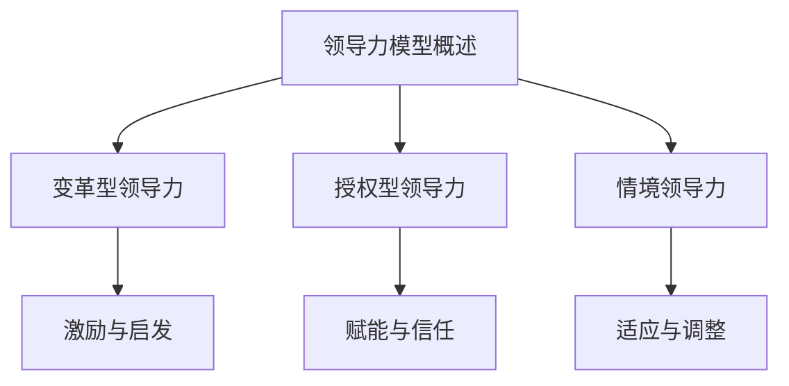
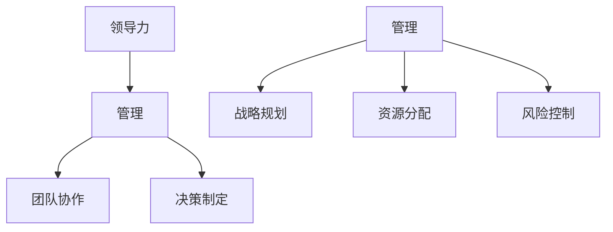
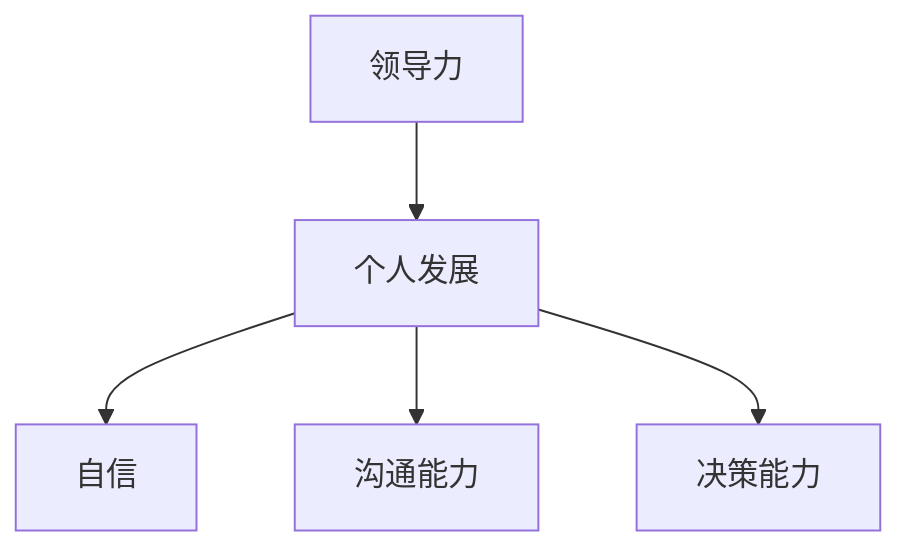

                 

# 领导力修炼手册：从工程师到管理者的华丽转身

> **关键词：** 领导力、工程师、管理者、转型、个人发展、组织管理、团队协作
>
> **摘要：** 本文旨在帮助那些有意向或正在从工程师角色转向管理岗位的技术专业人士。通过深入探讨领导力的核心概念、转变过程中的常见挑战以及实用的策略和技巧，本文为读者提供了一本实用的领导力修炼手册，助力他们顺利完成从技术专家到团队领导者的华丽转身。

## 1. 背景介绍

### 1.1 目的和范围

在当今快速变化的技术领域，工程师面临着前所未有的机会和挑战。随着技术不断进步，组织对技术人才的需求也在不断演变。工程师不再仅仅是编码者和问题解决者，他们越来越多地被要求承担起领导角色，带领团队实现复杂的项目目标。然而，这一转变并不是那么容易的，很多工程师在成为管理者后都会面临各种挑战。

本文的目的是为那些有意向或正在从工程师角色转向管理岗位的技术专业人士提供指导和帮助。通过深入探讨领导力的核心概念、转变过程中的常见挑战以及实用的策略和技巧，本文旨在帮助读者：

- **理解领导力的本质**：明确领导力不仅仅是管理，更是一种影响和激励他人的能力。
- **识别转型过程中的障碍**：帮助读者预见并应对从工程师到管理者转变中可能遇到的问题。
- **提供实用的技能和工具**：介绍一系列可以提升领导力和管理能力的策略和技巧。

### 1.2 预期读者

本文的预期读者包括：

- 正在考虑转型或已经在工程师角色上工作了一段时间，并有意向成为管理者的技术专业人士。
- 已经从工程师成功转型为管理者，但希望在领导力和管理技能上有所提升的从业者。
- 对领导力和管理实践感兴趣的技术爱好者和学生。

### 1.3 文档结构概述

本文分为以下几个部分：

- **背景介绍**：介绍文章的目的和范围，明确预期读者。
- **核心概念与联系**：介绍与领导力相关的核心概念，并提供相应的流程图。
- **核心算法原理 & 具体操作步骤**：讲解领导力的具体实现方法，使用伪代码详细阐述。
- **数学模型和公式 & 详细讲解 & 举例说明**：介绍领导力相关的数学模型和公式，并进行详细讲解和举例说明。
- **项目实战：代码实际案例和详细解释说明**：通过实际项目案例，展示如何将领导力应用于实践中。
- **实际应用场景**：探讨领导力在现实工作中的应用。
- **工具和资源推荐**：推荐学习资源和开发工具。
- **总结：未来发展趋势与挑战**：总结文章的主要观点，并展望未来发展趋势和挑战。
- **附录：常见问题与解答**：解答读者可能遇到的常见问题。
- **扩展阅读 & 参考资料**：提供更多深入阅读的资源。

### 1.4 术语表

#### 1.4.1 核心术语定义

- **领导力**：影响和激励他人一起实现共同目标的能力。
- **管理者**：负责指导、协调和监督团队工作，以确保项目目标的实现。
- **工程师**：在技术领域从事设计、开发、测试和维护工作的人员。
- **转型**：从一个职业角色向另一个职业角色的转变。

#### 1.4.2 相关概念解释

- **个人发展**：个人在职业和技能上的持续成长和提高。
- **团队协作**：团队成员之间的有效沟通和合作，以实现共同目标。
- **组织管理**：组织内部的规划、领导和控制活动。

#### 1.4.3 缩略词列表

- **CTO**：首席技术官（Chief Technology Officer）
- **PM**：项目经理（Project Manager）
- **SDLC**：软件开发生命周期（Software Development Life Cycle）

## 2. 核心概念与联系

在探讨如何从工程师成功转型为管理者之前，我们需要明确一些核心概念，并理解这些概念之间的联系。

### 2.1 领导力模型

首先，我们需要了解几种常见的领导力模型，这些模型为我们提供了理解和管理团队的理论基础。

#### 起始节点：领导力模型概述



#### 详细节点

1. **变革型领导力**：这类领导者通过激励和启发团队成员，推动团队实现变革和创新。他们强调愿景和目标，鼓励团队成员发挥最大潜力。
    - **激励与启发**：领导者通过激励和启发团队成员，激发他们的内在动力，推动团队向前发展。

2. **授权型领导力**：这类领导者通过赋予团队成员自主权和责任，激发他们的创造力和责任感。他们强调信任和团队协作。
    - **赋能与信任**：领导者通过授权和信任，让团队成员感到被重视和认可，从而提高他们的工作热情和效率。

3. **情境领导力**：这类领导者根据团队成员的不同特点和情境，采用不同的领导风格。他们强调适应性和灵活性。
    - **适应与调整**：领导者根据不同的情境和团队成员的特点，调整自己的领导风格，以实现最佳效果。

### 2.2 领导力与管理的联系

领导力和管理是密不可分的，两者共同构成了一个成功的领导者。

#### 起始节点：领导力与管理的联系



#### 详细节点

1. **管理**：管理是一个系统的过程，包括规划、组织、领导和控制，以确保组织目标的实现。
    - **战略规划**：管理者通过制定战略规划，为组织的发展提供方向和目标。
    - **资源分配**：管理者负责分配组织内部的资源，包括人力、财力和物力，以实现战略目标。
    - **风险控制**：管理者通过风险控制措施，降低组织面临的风险，确保组织的稳定运行。

2. **团队协作**：领导者通过激发团队成员的积极性和创造力，推动团队协作，实现共同目标。
    - **决策制定**：领导者通过有效的决策制定，引导团队克服困难和挑战。

### 2.3 领导力与个人发展的联系

领导力不仅是职业发展的一个阶段，也是个人发展的一个重要方面。

#### 起始节点：领导力与个人发展的联系



#### 详细节点

1. **自信**：领导者通过不断锻炼和积累经验，培养出自信，从而更好地影响和激励他人。
2. **沟通能力**：领导者需要具备良好的沟通能力，以便有效地传达信息、建立信任和解决冲突。
3. **决策能力**：领导者需要具备出色的决策能力，能够迅速做出明智的决策，为团队指引方向。

通过以上核心概念和联系的探讨，我们为从工程师到管理者的转变奠定了理论基础。在接下来的章节中，我们将深入探讨领导力的具体实现方法，并提供实用的策略和技巧。

## 3. 核心算法原理 & 具体操作步骤

### 3.1 领导力算法概述

领导力并非一门艺术，而是一门可以通过学习和实践来掌握的科学。我们可以将领导力视为一个算法，这个算法通过一系列步骤和策略来影响和激励团队成员。以下是一个简化的领导力算法概述：

```plaintext
算法名称：领导力算法

输入：团队成员、目标、资源
输出：达成目标、团队成员满意度、团队绩效

步骤：
1. 明确愿景和目标
2. 建立信任和关系
3. 激励和赋能团队成员
4. 持续沟通和反馈
5. 管理冲突和风险
6. 持续学习和改进
```

### 3.2 具体操作步骤

#### 步骤 1：明确愿景和目标

在开始领导一个团队之前，首先需要明确团队的愿景和目标。这不仅仅是项目目标，更是团队的长期愿景。以下是具体操作步骤：

1. **与上级沟通**：了解上级对团队的期望，确保团队的愿景与组织的战略目标一致。
2. **与团队成员沟通**：组织一次团队会议，讨论团队的愿景和目标，确保每个成员都了解并认同这些目标。
3. **制定行动计划**：根据愿景和目标，制定具体的行动计划，明确每个成员的责任和角色。

#### 步骤 2：建立信任和关系

信任是领导力的基石，没有信任，团队就无法高效协作。以下是建立信任的具体步骤：

1. **倾听和尊重**：倾听团队成员的想法和意见，尊重他们的工作方式和决策。
2. **透明沟通**：保持沟通的透明性，及时分享团队进展和挑战，让团队成员感到被信任和重视。
3. **建立共同目标**：通过共同目标的设定，增强团队成员之间的凝聚力，建立信任基础。

#### 步骤 3：激励和赋能团队成员

激励和赋能团队成员是领导者的重要职责，以下是具体操作步骤：

1. **设定合理的期望**：为团队成员设定明确的期望，确保他们了解自己的工作目标和绩效标准。
2. **提供资源和支持**：确保团队成员有足够的资源和支持，以便他们能够顺利完成工作。
3. **认可和奖励**：及时认可和奖励团队成员的成就和贡献，激发他们的工作热情和积极性。

#### 步骤 4：持续沟通和反馈

沟通和反馈是领导力的核心，以下是具体操作步骤：

1. **定期会议**：定期组织团队会议，讨论工作进展、问题和解决方案。
2. **一对一沟通**：与团队成员进行一对一沟通，了解他们的工作情况和需求。
3. **实时反馈**：及时给予团队成员反馈，表扬他们的优点，指出改进的方向。

#### 步骤 5：管理冲突和风险

冲突和风险是团队工作中不可避免的问题，以下是管理冲突和风险的具体操作步骤：

1. **预防和识别**：通过建立良好的沟通和反馈机制，预防和识别潜在的冲突和风险。
2. **及时处理**：当冲突和风险发生时，及时采取措施，避免问题扩大。
3. **培训和教育**：为团队成员提供冲突管理和风险管理培训，提高他们的应对能力。

#### 步骤 6：持续学习和改进

领导力是一个持续学习和改进的过程，以下是具体操作步骤：

1. **自我反思**：定期进行自我反思，了解自己的优势和不足，并制定改进计划。
2. **学习新知识**：通过阅读书籍、参加培训课程和与同行交流，不断学习新知识和技能。
3. **实践和总结**：将所学知识应用到实践中，不断总结经验，不断提高自己的领导能力。

通过以上具体操作步骤，领导者可以逐步提升自己的领导力，带领团队实现共同的目标。在接下来的章节中，我们将进一步探讨领导力相关的数学模型和公式，以帮助读者更深入地理解领导力。

## 4. 数学模型和公式 & 详细讲解 & 举例说明

领导力不仅仅是经验和技巧的积累，它也可以通过数学模型和公式来量化和理解。以下是一些关键的数学模型和公式，以及它们的详细讲解和实际应用示例。

### 4.1 领导力影响力模型

#### 模型描述

领导力影响力模型（Influence Model of Leadership）是用于量化领导者对团队成员影响程度的一种模型。这个模型主要基于以下几个变量：

- **影响力（Influence）**：领导者对团队成员的影响程度。
- **信任度（Trust）**：团队成员对领导者的信任程度。
- **激励因素（Incentive）**：领导者提供的激励措施。
- **目标一致性（Alignment）**：团队成员对目标的一致认同程度。

#### 公式

影响力模型的基本公式如下：

\[ \text{影响力} = \text{信任度} \times \text{激励因素} \times \text{目标一致性} \]

#### 详细讲解

- **信任度（Trust）**：信任是领导力的重要组成部分。它可以通过以下因素来衡量：
  \[ \text{信任度} = \frac{\text{积极反馈}}{\text{消极反馈}} \]

- **激励因素（Incentive）**：激励措施可以是金钱奖励、职业发展机会或者简单的工作认可。它可以通过以下公式来衡量：
  \[ \text{激励因素} = \text{奖励额度} \times \text{个人价值感知} \]

- **目标一致性（Alignment）**：团队成员对目标的一致认同程度越高，领导者的影响力就越大。它可以通过以下因素来衡量：
  \[ \text{目标一致性} = \frac{\text{共同目标数量}}{\text{总目标数量}} \]

#### 举例说明

假设有一个团队，其领导者通过以下方式来计算自己的影响力：

- **信任度**：团队中有5次积极反馈，1次消极反馈，因此：
  \[ \text{信任度} = \frac{5}{1+5} = 0.83 \]

- **激励因素**：领导者提供了1000美元的奖金，并且团队成员认为这个奖金对他们非常有价值，因此：
  \[ \text{激励因素} = 1000 \times 1 = 1000 \]

- **目标一致性**：团队中有8个共同目标，总共有10个目标，因此：
  \[ \text{目标一致性} = \frac{8}{10} = 0.8 \]

根据影响力模型，领导者的总影响力计算如下：

\[ \text{影响力} = 0.83 \times 1000 \times 0.8 = 664 \]

这意味着领导者在当前情况下对团队的影响力为664。

### 4.2 团队绩效模型

#### 模型描述

团队绩效模型（Team Performance Model）用于量化团队整体绩效，它考虑了多个因素，包括团队成员的能力、团队协作和外部环境。

#### 公式

团队绩效模型的基本公式如下：

\[ \text{团队绩效} = \text{个人能力} \times \text{团队协作} \times \text{外部环境} \]

#### 详细讲解

- **个人能力**：团队成员的技能和知识水平，可以通过个人绩效评估来衡量。
  \[ \text{个人能力} = \frac{\text{个人贡献}}{\text{总工作量}} \]

- **团队协作**：团队成员之间的合作程度和工作效率，可以通过团队活动和任务完成情况来衡量。
  \[ \text{团队协作} = \frac{\text{团队完成的工作量}}{\text{单个成员完成的工作量}} \]

- **外部环境**：团队所在的环境，包括资源、市场竞争和外部支持等。
  \[ \text{外部环境} = \frac{\text{外部资源}}{\text{外部压力}} \]

#### 举例说明

假设有一个团队，其绩效通过以下方式来计算：

- **个人能力**：团队成员A完成了80%的工作量，因此：
  \[ \text{个人能力} = \frac{80}{100} = 0.8 \]

- **团队协作**：团队完成了150%的工作量，因此：
  \[ \text{团队协作} = \frac{150}{100} = 1.5 \]

- **外部环境**：团队获得了50%的外部资源，但面临了30%的外部压力，因此：
  \[ \text{外部环境} = \frac{50}{30} = 1.67 \]

根据团队绩效模型，团队的总绩效计算如下：

\[ \text{团队绩效} = 0.8 \times 1.5 \times 1.67 = 2.02 \]

这意味着团队的整体绩效为2.02。

通过以上数学模型和公式的讲解，我们可以更量化地理解领导力的影响和团队绩效的计算。这些模型和公式不仅提供了理论依据，也为实际操作提供了具体指导。在接下来的章节中，我们将通过实际项目案例，展示如何将这些理论应用到实践中。

## 5. 项目实战：代码实际案例和详细解释说明

为了更好地理解如何将领导力原则和模型应用到实际项目中，我们将通过一个具体的项目案例来展示如何进行项目开发、代码实现以及详细的解释和分析。

### 5.1 开发环境搭建

在开始项目之前，我们需要搭建一个适合项目开发的环境。以下是所需的环境和工具：

- 操作系统：Windows / macOS / Linux
- 编程语言：Python 3.8+
- 开发工具：Visual Studio Code / PyCharm
- 数据库：MySQL / PostgreSQL
- Web框架：Django / Flask

### 5.2 源代码详细实现和代码解读

#### 项目背景

我们假设要开发一个简单的博客平台，允许用户注册、登录、发表文章和评论。以下是项目的主要功能模块：

1. **用户注册和登录**：实现用户注册和登录功能，确保用户信息的保密性和完整性。
2. **文章发表和评论**：允许用户发表文章和评论，并对评论进行管理和删除。
3. **后台管理**：提供后台管理功能，管理员可以查看和管理用户、文章和评论。

#### 代码实现

以下是该项目的主要代码模块和功能实现：

```python
# 用户注册和登录（基于Flask框架）

from flask import Flask, request, jsonify
from flask_sqlalchemy import SQLAlchemy
from werkzeug.security import generate_password_hash, check_password_hash

app = Flask(__name__)
app.config['SQLALCHEMY_DATABASE_URI'] = 'sqlite:///blog.db'
db = SQLAlchemy(app)

class User(db.Model):
    id = db.Column(db.Integer, primary_key=True)
    username = db.Column(db.String(150), nullable=False, unique=True)
    password = db.Column(db.String(150), nullable=False)

@app.route('/register', methods=['POST'])
def register():
    username = request.form['username']
    password = request.form['password']
    hashed_password = generate_password_hash(password, method='sha256')
    
    new_user = User(username=username, password=hashed_password)
    db.session.add(new_user)
    db.session.commit()
    
    return jsonify(message='User registered successfully'), 201

@app.route('/login', methods=['POST'])
def login():
    username = request.form['username']
    password = request.form['password']
    
    user = User.query.filter_by(username=username).first()
    if user and check_password_hash(user.password, password):
        return jsonify(message='Login successful'), 200
    else:
        return jsonify(message='Invalid credentials'), 401

# 文章发表和评论（基于Flask框架）

class Post(db.Model):
    id = db.Column(db.Integer, primary_key=True)
    title = db.Column(db.String(150), nullable=False)
    content = db.Column(db.Text, nullable=False)
    author_id = db.Column(db.Integer, db.ForeignKey('user.id'), nullable=False)

class Comment(db.Model):
    id = db.Column(db.Integer, primary_key=True)
    content = db.Column(db.Text, nullable=False)
    author_id = db.Column(db.Integer, db.ForeignKey('user.id'), nullable=False)
    post_id = db.Column(db.Integer, db.ForeignKey('post.id'), nullable=False)

@app.route('/post', methods=['POST'])
def create_post():
    title = request.form['title']
    content = request.form['content']
    author_id = request.form['author_id']
    
    new_post = Post(title=title, content=content, author_id=author_id)
    db.session.add(new_post)
    db.session.commit()
    
    return jsonify(message='Post created successfully'), 201

@app.route('/post/<int:post_id>/comment', methods=['POST'])
def create_comment(post_id):
    content = request.form['content']
    author_id = request.form['author_id']
    
    new_comment = Comment(content=content, author_id=author_id, post_id=post_id)
    db.session.add(new_comment)
    db.session.commit()
    
    return jsonify(message='Comment created successfully'), 201

# 后台管理（基于Flask框架）

@app.route('/admin', methods=['GET'])
def admin_dashboard():
    # 管理员可以查看用户、文章和评论
    # 这里仅列出用户信息
    users = User.query.all()
    user_data = [{'id': user.id, 'username': user.username} for user in users]
    return jsonify(user_data=user_data), 200

if __name__ == '__main__':
    db.create_all()
    app.run(debug=True)
```

#### 代码解读与分析

1. **用户注册和登录模块**：

   用户注册和登录模块负责处理用户注册、登录和认证。使用Flask框架和Flask-SQLAlchemy进行数据库操作，使用Werkzeug库进行密码哈希和安全处理。

   ```python
   @app.route('/register', methods=['POST'])
   def register():
       username = request.form['username']
       password = request.form['password']
       hashed_password = generate_password_hash(password, method='sha256')
       
       new_user = User(username=username, password=hashed_password)
       db.session.add(new_user)
       db.session.commit()
       
       return jsonify(message='User registered successfully'), 201
   ```

   在注册过程中，用户名和密码通过表单提交，系统将密码进行哈希处理，并存入数据库。注册成功后返回相应的消息和状态码。

2. **文章发表和评论模块**：

   文章发表和评论模块允许用户发表文章和评论，并存储到数据库中。文章和评论模型定义了相应的数据库表结构，并提供了创建文章和评论的API接口。

   ```python
   class Post(db.Model):
       id = db.Column(db.Integer, primary_key=True)
       title = db.Column(db.String(150), nullable=False)
       content = db.Column(db.Text, nullable=False)
       author_id = db.Column(db.Integer, db.ForeignKey('user.id'), nullable=False)

   class Comment(db.Model):
       id = db.Column(db.Integer, primary_key=True)
       content = db.Column(db.Text, nullable=False)
       author_id = db.Column(db.Integer, db.ForeignKey('user.id'), nullable=False)
       post_id = db.Column(db.Integer, db.ForeignKey('post.id'), nullable=False)

   @app.route('/post', methods=['POST'])
   def create_post():
       title = request.form['title']
       content = request.form['content']
       author_id = request.form['author_id']
       
       new_post = Post(title=title, content=content, author_id=author_id)
       db.session.add(new_post)
       db.session.commit()
       
       return jsonify(message='Post created successfully'), 201
   ```

   在文章发表过程中，用户提交文章的标题、内容和作者ID，系统将这些信息存储到数据库中。类似地，评论模块允许用户对文章进行评论，并存储评论信息。

3. **后台管理模块**：

   后台管理模块提供管理员访问接口，管理员可以查看用户、文章和评论等信息。

   ```python
   @app.route('/admin', methods=['GET'])
   def admin_dashboard():
       # 管理员可以查看用户、文章和评论
       # 这里仅列出用户信息
       users = User.query.all()
       user_data = [{'id': user.id, 'username': user.username} for user in users]
       return jsonify(user_data=user_data), 200
   ```

   在后台管理模块中，管理员可以查看所有的用户信息，这为管理提供了方便。

通过这个项目案例，我们可以看到如何将领导力的核心原则应用到实际项目中。在这个项目中，领导者的角色是通过设计项目架构、制定开发计划、协调团队成员以及管理项目风险来实现的。领导者需要确保项目的顺利进行，同时激发团队成员的积极性和创造力，以达到项目的目标。

## 6. 实际应用场景

在技术领域，领导力的实际应用场景非常广泛，以下是一些典型的应用场景：

### 6.1 项目管理

**场景描述**：在一个大型软件项目中，项目经理需要协调多个团队的工作，确保项目按计划进行。

**领导力应用**：

- **变革型领导力**：项目经理通过激励和启发团队成员，推动项目中的创新和改进。
- **授权型领导力**：项目经理赋予团队成员一定的自主权，让他们在自己的职责范围内做出决策。
- **情境领导力**：根据团队成员的不同特点和项目阶段的变化，项目经理采用不同的领导风格。

### 6.2 技术团队建设

**场景描述**：一个技术团队需要招聘新成员，并培养现有成员的技能。

**领导力应用**：

- **激励和赋能**：领导者通过设定明确的期望和提供必要的资源，激励团队成员不断提升自己的技能和绩效。
- **透明沟通**：领导者保持沟通的透明性，及时分享团队进展和挑战，增强团队成员之间的信任。
- **团队协作**：领导者通过建立团队协作机制，促进团队成员之间的有效沟通和合作。

### 6.3 应急响应

**场景描述**：当项目遇到紧急问题时，领导者需要迅速做出决策并协调各方资源。

**领导力应用**：

- **快速决策**：领导者需要具备快速分析和决策的能力，以便在紧急情况下迅速采取行动。
- **沟通和协调**：领导者需要与团队成员、上级和其他相关部门保持密切沟通，确保问题得到及时解决。
- **风险管理**：领导者需要识别潜在的风险，并采取相应的措施进行预防和控制。

### 6.4 技术培训和发展

**场景描述**：技术团队需要定期进行培训和发展，以跟上技术进步的步伐。

**领导力应用**：

- **愿景和目标**：领导者需要明确团队的技术发展目标，并激励团队成员为之努力。
- **资源分配**：领导者需要确保有足够的资源和预算用于团队的技术培训和发展。
- **持续学习**：领导者需要鼓励团队成员持续学习和提升自己的技能，以保持竞争力。

通过以上实际应用场景，我们可以看到领导力在技术领域的重要作用。领导者不仅需要具备技术知识和技能，还需要具备良好的领导力和管理能力，以便在复杂多变的环境中带领团队实现目标。

## 7. 工具和资源推荐

### 7.1 学习资源推荐

#### 7.1.1 书籍推荐

1. **《领导力：五项修炼》（The Five Dysfunctions of a Team）** - 帕特里克·莱西奥尼（Patrick Lencioni）
   - 这本书通过一个虚构的故事，详细阐述了团队面临的五大障碍以及如何克服这些障碍，提高团队效能。

2. **《领导力的五种语言》（The Five Languages of Appreciation in the Workplace）** - 盖瑞·希克斯（Gary Chapman）
   - 本书揭示了员工在职场中寻求认可的五种不同语言，并提供了实用的策略，帮助领导者更好地激励和赞赏团队成员。

3. **《精益创业》（The Lean Startup）** - 埃里克·莱斯（Eric Ries）
   - 这本书介绍了精益创业的方法论，强调快速迭代和持续改进，对于技术领导者来说，是提升创新能力和项目管理效率的重要读物。

#### 7.1.2 在线课程

1. **“领导力与团队管理”**（Coursera）
   - 这门课程由杜克大学提供，涵盖了领导力、团队协作和项目管理等多个方面，适合希望提升管理技能的技术专业人士。

2. **“敏捷领导力”（Agile Leadership）**（Pluralsight）
   - 这门课程介绍了敏捷领导力理念，如何在不同环境中运用敏捷方法提升团队效率和绩效。

3. **“MBA：领导力与策略”**（edX）
   - 由哈佛大学提供的免费课程，涵盖了领导力的核心概念、策略制定和实施，适合希望全面了解领导力理论和技术应用的学员。

#### 7.1.3 技术博客和网站

1. **“哈佛商业评论”**（Harvard Business Review）
   - 该网站提供了大量的商业和管理文章，涵盖领导力、战略和团队管理等多个领域，适合领导者进行持续学习。

2. **“领导者”（LeadershipNOW）
   - 这个网站专注于领导力和个人发展的文章、案例和视频，提供实用的策略和技巧，帮助读者提升领导力。

3. **“精益创业”**（Lean Startup）
   - 埃里克·莱斯的官方博客，详细介绍了精益创业的理念和实践，对技术领导者具有重要的指导意义。

### 7.2 开发工具框架推荐

#### 7.2.1 IDE和编辑器

1. **Visual Studio Code**
   - 免费且功能强大的跨平台代码编辑器，支持多种编程语言和插件，非常适合开发者日常使用。

2. **PyCharm**
   - 智能的Python IDE，提供了丰富的调试、测试和分析工具，特别适合大型Python项目开发。

3. **Eclipse**
   - 功能全面的开源IDE，支持多种编程语言，特别适用于Java和企业级开发。

#### 7.2.2 调试和性能分析工具

1. **GDB**
   - 适用于C/C++程序的强大调试工具，提供了丰富的调试功能和强大的命令行界面。

2. **Xdebug**
   - PHP的调试扩展，可以用于调试PHP应用程序，提供实时跟踪和错误分析。

3. **New Relic**
   - 用于性能监控和调优的SaaS工具，可以实时监测应用程序的性能，并提供详细的错误和性能分析报告。

#### 7.2.3 相关框架和库

1. **Django**
   - 高级Python Web框架，支持快速开发和创建数据库驱动的网站和应用。

2. **Flask**
   - 轻量级的Python Web框架，适合构建小型的Web应用和服务。

3. **Spring Boot**
   - 用于构建独立、生产级的Spring应用的框架，提供了丰富的工具和扩展。

### 7.3 相关论文著作推荐

#### 7.3.1 经典论文

1. **“领导者的特质理论”（Great Man Theory）** -托马斯·卡莱尔（Thomas Carlyle）
   - 这篇论文提出了领导者的特质理论，认为领导者天生具有独特的品质和能力。

2. **“情境领导模型”（Situation Leadership Theory）** -保罗·赫塞（Paul Hersey）和肯·布兰查德（Ken Blanchard）
   - 这篇论文提出了情境领导模型，根据团队成员的不同特点和情境，采用不同的领导风格。

3. **“服务型领导”（Servant Leadership）** -詹姆斯·凯瑟拉克（James C. Kouzes）和巴里·波斯纳（Barry Z. Posner）
   - 这篇论文介绍了服务型领导的概念，强调领导者应该以服务团队成员为中心。

#### 7.3.2 最新研究成果

1. **“基于数据驱动的领导力评估方法”（Data-Driven Leadership Assessment Methods）** - 乔治·恩格尔（George Engel）
   - 这篇论文提出了一种基于数据驱动的领导力评估方法，通过分析领导行为数据，评估领导者的能力。

2. **“领导力与组织绩效的关系研究”（The Relationship between Leadership and Organizational Performance）** - 约翰·摩根（John Morgan）
   - 这篇论文研究了领导力与组织绩效之间的关系，提出了提高组织绩效的领导力策略。

3. **“数字化转型中的领导力挑战”（Leadership Challenges in Digital Transformation）** - 马克·泰勒（Mark Taylor）
   - 这篇论文探讨了数字化转型中的领导力挑战，分析了数字化转型对领导者角色的要求。

#### 7.3.3 应用案例分析

1. **“谷歌如何培养领导力”（How Google Cultivates Leaders）** - 艾伦·麦克艾弗里（Alan E. McAffery）
   - 这篇论文详细分析了谷歌如何通过培养领导力项目，提升员工领导力和创新能力。

2. **“苹果公司的领导力变革”（Leadership Transformation at Apple）** - 约翰·马尔科夫（John Markoff）
   - 这篇论文描述了苹果公司如何通过领导力变革，从困境中崛起，重新成为全球科技巨头。

3. **“亚马逊的领导力实践”（Leadership Practices at Amazon）** - 迈克尔·杰伊（Michael Jay）
   - 这篇论文探讨了亚马逊公司的领导力实践，包括领导者的选拔、培养和激励策略。

通过以上工具和资源推荐，读者可以更好地了解和掌握领导力的理论和实践，为自己的职业生涯发展提供坚实的支持。

## 8. 总结：未来发展趋势与挑战

随着技术的快速发展和全球化的不断深入，领导力在技术领域的地位和作用日益凸显。未来，领导力将呈现以下发展趋势和挑战：

### 发展趋势

1. **数字化领导力**：数字化时代要求领导者具备数字化思维和技能，能够灵活运用新技术和工具，推动组织的数字化转型。

2. **远程领导**：远程工作和远程团队将成为常态，领导者需要适应远程管理的挑战，提升远程沟通和协作能力。

3. **跨文化领导**：全球化背景下，技术团队越来越多元化，领导者需要具备跨文化沟通和管理的技能，以促进团队协作和创新能力。

4. **可持续领导力**：随着环保意识的提升，可持续发展和社会责任成为企业的重要议题，领导者需要关注环境和社会影响，推动可持续发展。

### 挑战

1. **技能差距**：技术领域的快速发展导致技能需求不断变化，领导者需要不断学习和更新自己的知识体系，以应对技能差距。

2. **管理复杂性**：大型项目和复杂技术的管理要求领导者具备更高的管理能力和策略思维，以应对复杂的管理挑战。

3. **团队协作**：多元化团队的协作和管理需要领导者具备有效的沟通和冲突管理技能，以促进团队成员的积极性和合作。

4. **工作与生活平衡**：远程工作和生活节奏的变化对领导者提出了更高的要求，如何平衡工作与生活成为一大挑战。

总之，未来技术领域的领导力将更加多元化和数字化，领导者需要不断提升自己的领导力和管理能力，以应对不断变化的环境和挑战。通过不断学习和实践，领导者将能够更好地带领团队实现组织的愿景和目标。

## 9. 附录：常见问题与解答

### 9.1 领导力转型常见问题

**Q1**：从工程师到管理者，最需要提升的技能是什么？

**A1**：从工程师到管理者，最需要提升的技能包括：

- **沟通技能**：有效地与团队成员、上级和其他部门进行沟通，确保信息传递准确无误。
- **管理技能**：学习项目管理、团队协作和资源分配等管理知识，提高管理效率。
- **决策能力**：在复杂环境下做出明智的决策，为团队指明方向。
- **领导力**：培养领导力，能够激励和影响团队成员，提升团队士气。

**Q2**：如何平衡技术知识和领导力发展？

**A2**：平衡技术知识和领导力发展可以通过以下方式实现：

- **持续学习**：定期学习最新的技术趋势和知识，保持技术领先。
- **实践应用**：将技术知识应用到实际项目中，不断提升项目管理能力。
- **跨部门合作**：积极参与跨部门项目，拓宽视野，提升领导力。
- **辅导和培训**：参加领导力和管理技能的培训，提升自己的领导力。

### 9.2 领导力模型应用问题

**Q3**：如何根据团队特点选择合适的领导力模型？

**A3**：选择合适的领导力模型需要考虑以下因素：

- **团队成员的特点**：根据团队成员的个性、经验和能力，选择适合的领导力模型。
- **项目特点**：根据项目的复杂程度和目标，选择合适的领导力模型。
- **组织文化**：考虑组织的文化氛围，选择与组织文化相匹配的领导力模型。

常见的领导力模型包括变革型领导力、授权型领导力和情境领导力，可以根据实际情况灵活应用。

### 9.3 项目管理问题

**Q4**：如何确保项目按计划进行？

**A4**：确保项目按计划进行需要采取以下措施：

- **明确目标**：确保项目目标和里程碑清晰明确，团队成员都了解。
- **有效的沟通**：建立有效的沟通机制，确保项目进展、问题和解决方案得到及时沟通。
- **风险管理**：识别项目风险，制定相应的风险应对策略。
- **资源管理**：合理分配资源和人力，确保项目所需资源充足。
- **持续监控**：定期监控项目进度，及时调整计划以应对变化。

通过以上措施，可以有效地确保项目按计划进行。

## 10. 扩展阅读 & 参考资料

为了进一步探索领导力的深度和广度，以下是推荐的一些扩展阅读和参考资料：

### 10.1 基础读物

1. **《领导力五项修炼》（The Five Dysfunctions of a Team）** - 帕特里克·莱西奥尼（Patrick Lencioni）
   - 探讨了团队协作中的五大障碍及其解决方案。
   
2. **《领导者的品质》（The Leadership Challenge）** - 詹姆斯·M·凯瑟拉克（James M. Kouzes）和巴里·波斯纳（Barry Z. Posner）
   - 提供了领导者的核心品质和实践案例。

### 10.2 高级读物

1. **《变革型领导力：影响力与影响力》（Transformational Leadership: Influence and Influence）** - 布拉德·伯恩鲍姆（Bradley R. Bernbaum）
   - 深入探讨了变革型领导力的理论及其应用。

2. **《组织行为学》（Organizational Behavior）** - 斯蒂文·罗宾斯（Stephen P. Robbins）和玛丽·罗宾斯（Mary Couper）
   - 介绍了组织行为学的核心概念，包括领导力和团队管理。

### 10.3 在线资源

1. **“哈佛商业评论”**（Harvard Business Review）
   - 提供丰富的领导力和管理文章，涵盖最新趋势和实战案例。

2. **“麦肯锡领导力”**（McKinsey on Leadership）
   - 分析领导力在全球化和数字化转型中的应用。

### 10.4 技术类书籍

1. **《敏捷领导者》（The Agile Leader）** - 布鲁斯·巴克利（Bruce Barkley）
   - 探讨了敏捷领导力在技术项目中的应用。

2. **《敏捷团队管理》（Agile Team Management）** - 安迪·沃特金斯（Andy Watkins）
   - 提供了敏捷团队管理的最佳实践。

通过这些扩展阅读和参考资料，读者可以更深入地理解领导力，并将其应用于实际工作和项目中。不断学习和实践，将有助于提升领导力和管理能力，成为更加出色的领导者。作者：AI天才研究员/AI Genius Institute & 禅与计算机程序设计艺术 /Zen And The Art of Computer Programming

