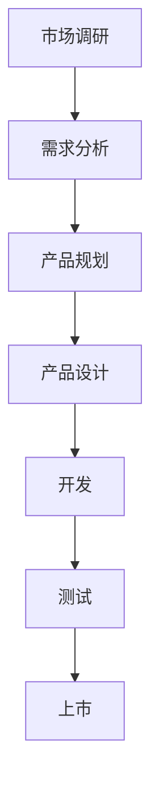
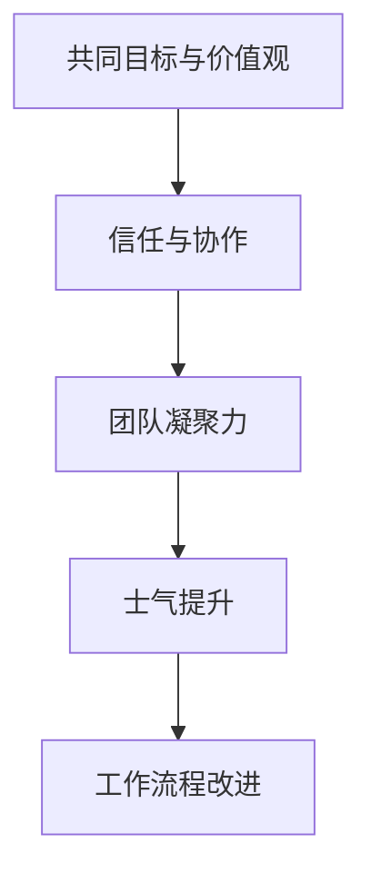
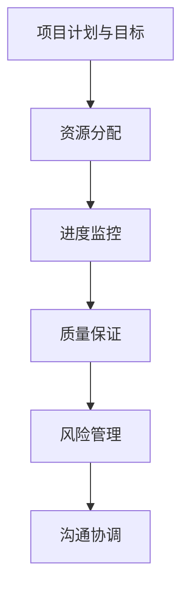
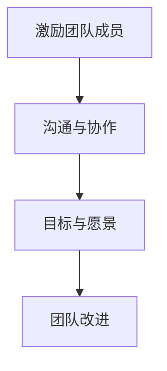

                 

### 1. 背景介绍

#### 1.1 目的和范围

本文旨在探讨一个产品总监的成长历程，通过记录其领导力修炼的点滴，分享其在产品管理、团队建设和项目管理等方面的经验和感悟。文章将结合实际案例，深入分析产品总监所需具备的核心能力，并探讨如何通过持续学习和实践来提升个人领导力。

本文将重点关注以下范围：
- 产品总监的角色和职责
- 领导力的核心要素
- 团队建设和管理的最佳实践
- 产品规划和市场分析
- 项目管理和风险控制

#### 1.2 预期读者

本文适合以下读者群体：
- 产品总监、产品经理及相关管理人员
- 想要提升领导力和管理能力的职场人士
- 对产品管理和团队建设感兴趣的IT行业从业者
- 希望了解产品管理最佳实践的学习者

通过阅读本文，读者可以：
- 了解产品总监的角色和职责
- 掌握领导力的核心要素及其在产品管理中的应用
- 学习团队建设和管理的最佳实践
- 掌握产品规划和市场分析的方法
- 提高项目管理和风险控制的能力

#### 1.3 文档结构概述

本文将按照以下结构进行组织：
- **1. 背景介绍**：介绍文章的目的、范围、预期读者以及文档结构概述
- **2. 核心概念与联系**：讨论产品管理、团队建设、项目管理和领导力的核心概念，并使用Mermaid流程图进行展示
- **3. 核心算法原理 & 具体操作步骤**：详细讲解产品总监所需掌握的核心算法原理和具体操作步骤
- **4. 数学模型和公式 & 详细讲解 & 举例说明**：介绍产品管理中的数学模型和公式，并提供详细讲解和举例说明
- **5. 项目实战：代码实际案例和详细解释说明**：通过实际代码案例展示产品管理的具体应用
- **6. 实际应用场景**：分析产品管理的实际应用场景
- **7. 工具和资源推荐**：推荐学习资源、开发工具框架和论文著作
- **8. 总结：未来发展趋势与挑战**：总结文章的主要内容，探讨产品管理的未来发展趋势和挑战
- **9. 附录：常见问题与解答**：解答读者可能遇到的问题
- **10. 扩展阅读 & 参考资料**：提供扩展阅读材料和参考资料

#### 1.4 术语表

在本篇文章中，我们将使用以下术语：
- **产品总监**：负责整体产品战略规划、团队管理和项目推进的高级管理人员
- **领导力**：领导者对团队成员的影响力、影响力和协调能力
- **团队建设**：通过建立积极、合作、高效的工作氛围来提升团队整体绩效的过程
- **产品管理**：规划、设计、开发、市场推广和运营整个产品的过程
- **项目管理**：确保项目按计划、按时、按预算完成的过程

接下来，我们将进一步深入探讨这些核心概念和联系，以帮助读者更好地理解产品总监的角色和职责。使用Mermaid流程图，我们将展示产品管理、团队建设、项目管理和领导力之间的内在联系，为后续内容的讨论奠定基础。

#### 1.4.1 核心术语定义

1. **产品总监（Product Director）**：
   产品总监是公司中负责整体产品战略的高级管理人员。其主要职责包括：
   - 制定产品愿景和战略
   - 指导产品规划和开发过程
   - 确保产品符合市场需求和用户期望
   - 协调跨部门合作，推动项目进度

2. **领导力（Leadership）**：
   领导力是指领导者对团队成员的影响力、影响力和协调能力。具体包括以下方面：
   - 激励团队成员，激发其潜能
   - 建立和维护团队沟通与协作
   - 制定和传达团队目标与愿景
   - 推动团队持续改进和创新

3. **团队建设（Team Building）**：
   团队建设是通过建立积极、合作、高效的工作氛围来提升团队整体绩效的过程。关键要素包括：
   - 建立共同的目标和价值观
   - 提升团队成员之间的信任和合作
   - 增强团队凝聚力，提高团队士气
   - 持续改进团队工作流程和效率

4. **产品管理（Product Management）**：
   产品管理是规划、设计、开发、市场推广和运营整个产品的过程。核心环节包括：
   - 市场调研和需求分析
   - 产品规划和优先级设定
   - 产品设计和开发
   - 产品测试和上市
   - 产品运营和用户反馈

5. **项目管理（Project Management）**：
   项目管理是确保项目按计划、按时、按预算完成的过程。主要任务包括：
   - 制定项目计划和目标
   - 分配资源和任务
   - 监控项目进度和质量
   - 管理项目风险和变更
   - 沟通和协调各方利益相关者

#### 1.4.2 相关概念解释

1. **产品规划（Product Planning）**：
   产品规划是产品管理过程中确定产品愿景、目标和战略的环节。关键步骤包括：
   - 市场需求分析：了解目标市场和用户需求
   - 竞品分析：研究竞争对手的产品和市场策略
   - 产品定位：确定产品的市场定位和目标用户群体
   - 产品愿景和战略：制定长期和短期产品目标

2. **团队协作（Team Collaboration）**：
   团队协作是团队建设的重要组成部分，通过协作工具和流程提升团队工作效率。常见方法包括：
   - 沟通工具：如Slack、Microsoft Teams等，实现实时沟通和信息共享
   - 共享文档和项目管理工具：如Google Docs、JIRA等，确保团队成员对项目进展和任务有清晰了解
   - 团队会议和活动：定期举行团队会议，分享项目进展和经验，加强团队凝聚力

3. **项目管理工具（Project Management Tools）**：
   项目管理工具是帮助团队规划、监控和执行项目任务的软件。常见工具有：
   - 项目规划工具：如Microsoft Project、Trello等，帮助团队制定项目计划和任务分配
   - 进度跟踪工具：如JIRA、Asana等，实时监控项目进度和质量
   - 风险管理工具：如Risk Register、Project Insight等，识别和管理项目风险

4. **用户反馈（User Feedback）**：
   用户反馈是产品管理过程中收集用户意见和建议的重要环节。关键步骤包括：
   - 用户调研：通过问卷调查、用户访谈等方式了解用户需求和痛点
   - 用户反馈渠道：建立用户反馈机制，如反馈表单、社交媒体等
   - 用户反馈分析：对用户反馈进行分类、分析和优先级设定
   - 产品迭代：根据用户反馈调整产品设计和功能

#### 1.4.3 缩略词列表

在本篇文章中，我们将使用以下缩略词：
- PM：产品经理（Product Manager）
- PD：产品总监（Product Director）
- UX：用户体验（User Experience）
- UI：用户界面（User Interface）
- MVP：最小可行产品（Minimum Viable Product）
- SWOT：优势、劣势、机会和威胁（Strengths, Weaknesses, Opportunities, Threats）
- OKR：目标与关键成果（Objectives and Key Results）
- KPI：关键绩效指标（Key Performance Indicators）
- PMO：项目管理办公室（Project Management Office）

### 2. 核心概念与联系

在产品管理、团队建设、项目管理和领导力这四个核心概念之间，存在着密切的内在联系。为了更好地理解它们之间的关系，我们将使用Mermaid流程图来展示这些概念之间的相互关系。

#### 2.1 产品管理

产品管理是确保产品从概念阶段到市场推广和运营的整个过程顺利进行的关键环节。它包括市场调研、需求分析、产品规划、产品设计、开发、测试和上市等环节。



#### 2.2 团队建设

团队建设是提升团队整体绩效的重要手段。它包括建立共同的目标和价值观、提升团队成员之间的信任和合作、增强团队凝聚力和士气、以及持续改进团队工作流程和效率。



#### 2.3 项目管理

项目管理是确保项目按计划、按时、按预算完成的过程。它包括制定项目计划和目标、分配资源和任务、监控项目进度和质量、管理项目风险和变更，以及沟通和协调各方利益相关者。



#### 2.4 领导力

领导力是领导者对团队成员的影响力、影响力和协调能力。它包括激励团队成员、建立和维护团队沟通与协作、制定和传达团队目标与愿景，以及推动团队持续改进和创新。



通过上述Mermaid流程图，我们可以清晰地看到产品管理、团队建设、项目管理和领导力之间的内在联系。这些概念相互交织、相互支持，共同推动产品成功上市并实现企业目标。

接下来，我们将进一步探讨这些核心概念的具体原理和操作步骤，帮助读者更好地理解如何在实际工作中应用这些概念。

### 3. 核心算法原理 & 具体操作步骤

在产品管理中，领导者需要掌握一系列核心算法原理和具体操作步骤，以确保产品从概念到上市的全过程顺利进行。以下是一些关键算法原理和具体操作步骤：

#### 3.1 需求分析算法

**原理：** 需求分析是产品管理的重要环节，通过分析市场需求和用户需求，确定产品的核心功能和特性。

**步骤：**
1. **市场调研**：收集市场数据和竞争分析，了解目标市场和用户需求。
   ```mermaid
   graph TD
       A[市场调研] --> B[数据收集]
       B --> C[竞争分析]
   ```
2. **用户访谈**：与潜在用户进行访谈，了解他们的需求和痛点。
   ```mermaid
   graph TD
       D[用户访谈] --> E[需求收集]
   ```
3. **需求整理**：将收集到的市场需求和用户需求进行分类和整理，形成需求清单。
   ```mermaid
   graph TD
       F[需求整理] --> G[需求清单]
   ```

#### 3.2 产品规划算法

**原理：** 产品规划是确定产品愿景、目标和战略的过程，通过制定长期和短期产品目标，确保产品符合市场需求和用户期望。

**步骤：**
1. **制定产品愿景**：明确产品的长远目标和愿景。
   ```mermaid
   graph TD
       A[产品愿景] --> B[目标设定]
   ```
2. **市场分析**：分析市场趋势和竞争环境，确定产品的市场定位。
   ```mermaid
   graph TD
       C[市场分析] --> D[定位设定]
   ```
3. **制定产品战略**：根据市场需求和用户需求，制定产品的长期和短期战略。
   ```mermaid
   graph TD
       E[战略制定] --> F[战略规划]
   ```

#### 3.3 团队协作算法

**原理：** 团队协作是提升团队工作效率和绩效的关键，通过建立共同的目标和价值观，提升团队成员之间的信任和合作。

**步骤：**
1. **建立共同目标**：明确团队的目标和期望，确保团队成员对目标有共同的理解。
   ```mermaid
   graph TD
       A[共同目标] --> B[目标设定]
   ```
2. **价值观共识**：建立团队的价值观，确保团队成员在价值观上有共识。
   ```mermaid
   graph TD
       C[价值观共识] --> D[价值观塑造]
   ```
3. **协作工具和方法**：使用协作工具和方法，如项目管理软件、沟通工具等，提高团队协作效率。
   ```mermaid
   graph TD
       E[协作工具] --> F[工具使用]
   ```

#### 3.4 项目管理算法

**原理：** 项目管理是确保项目按计划、按时、按预算完成的过程，通过制定项目计划、分配资源和任务、监控项目进度和质量，确保项目成功交付。

**步骤：**
1. **项目计划**：制定详细的项目计划，明确项目的范围、目标、任务和时间表。
   ```mermaid
   graph TD
       A[项目计划] --> B[计划制定]
   ```
2. **资源分配**：根据项目计划，合理分配资源，确保项目顺利推进。
   ```mermaid
   graph TD
       C[资源分配] --> D[资源调配]
   ```
3. **进度监控**：定期监控项目进度，及时发现和解决问题。
   ```mermaid
   graph TD
       E[进度监控] --> F[进度跟踪]
   ```
4. **质量保证**：确保项目交付的成果符合质量标准。
   ```mermaid
   graph TD
       G[质量保证] --> H[质量评估]
   ```

通过上述算法原理和具体操作步骤，产品总监可以更好地进行产品管理、团队建设和项目管理，从而实现产品的成功上市和企业目标。接下来，我们将进一步探讨产品管理中的数学模型和公式，以帮助读者更深入地理解产品管理的量化方法。

### 4. 数学模型和公式 & 详细讲解 & 举例说明

在产品管理过程中，数学模型和公式可以帮助我们更好地理解和优化各种决策和流程。以下是一些常见的数学模型和公式，以及它们的详细讲解和举例说明。

#### 4.1 SWOT分析模型

**定义：** SWOT分析是一种常用的战略规划工具，用于评估企业的优势（Strengths）、劣势（Weaknesses）、机会（Opportunities）和威胁（Threats）。

**公式：**
\[ SWOT = (S + W + O + T) \]

**详细讲解：**
- **优势（S）**：评估企业的核心竞争力、独特资源和竞争优势。
  例如，一个企业在技术方面的优势可能包括专利技术、优秀的研发团队等。
- **劣势（W）**：识别企业在市场、资源、管理等方面存在的不足。
  例如，一个企业在市场营销方面的劣势可能包括品牌知名度低、营销预算不足等。
- **机会（O）**：分析外部环境中可能为企业带来的有利条件。
  例如，一个市场的快速增长、新的技术趋势等。
- **威胁（T）**：评估外部环境中可能对企业造成的不利影响。
  例如，竞争对手的崛起、法规变化等。

**举例：** 假设一家初创公司在进行SWOT分析时，发现其优势在于技术创新和灵活的运营模式，劣势在于品牌知名度和市场资源有限，机会在于新市场的开发，威胁在于竞争激烈的市场环境。根据这些分析结果，公司可以制定相应的策略，如加大品牌宣传、拓展市场资源，以利用机会，应对威胁。

#### 4.2 OKR模型

**定义：** OKR（Objectives and Key Results）是一种目标设定和跟踪方法，用于确保团队和企业实现关键目标。

**公式：**
\[ OKR = (O + KR) \]

**详细讲解：**
- **目标（O）**：明确团队或企业的目标，通常是一个简短、鼓舞人心的陈述。
  例如，“提高产品市场份额至15%”。
- **关键结果（KR）**：量化目标的实现程度，通常包括3-5个具体的、可度量的指标。
  例如，“1. 产品销售额增长20% 2. 用户活跃度提高10% 3. 新产品发布3个版本”。

**举例：** 假设一家产品团队设定了一个目标“提高产品用户体验”，其关键结果可能包括：
1. **产品评分提高10%**
2. **用户满意度调查得分提高5分**
3. **故障率降低15%**
这些关键结果可以帮助团队明确如何实现目标，同时为评估目标完成情况提供具体指标。

#### 4.3 KPI模型

**定义：** KPI（Key Performance Indicators）是衡量团队或企业绩效的关键指标。

**公式：**
\[ KPI = (\sum Ki) / n \]

**详细讲解：**
- **KPI（关键绩效指标）**：选择对业务目标有直接影响的指标，如销售额、用户增长、客户满意度等。
- **Ki**：每个KPI的权重或得分。
- **n**：KPI的总数。

**举例：** 假设一家公司有3个KPI：
1. **销售额**（权重0.5）
2. **客户满意度**（权重0.3）
3. **产品发布数量**（权重0.2）
根据这些权重，公司的KPI得分可以计算为：
\[ KPI = (0.5 \times 销售额 + 0.3 \times 客户满意度 + 0.2 \times 产品发布数量) / 3 \]

#### 4.4 二项分布模型

**定义：** 二项分布是一种概率分布模型，用于描述在固定次数的独立试验中，成功次数的概率分布。

**公式：**
\[ P(X = k) = C(n, k) \times p^k \times (1-p)^{n-k} \]

**详细讲解：**
- **P(X = k)**：在n次试验中成功k次的概率。
- **C(n, k)**：组合数，表示从n个元素中选择k个元素的组合方式。
- **p**：每次试验成功的概率。
- **(1-p)**：每次试验失败的概率。

**举例：** 假设一个产品发布成功的概率为0.6，进行10次独立发布试验，求成功7次的概率。
\[ P(X = 7) = C(10, 7) \times 0.6^7 \times 0.4^3 = 120 \times 0.2744 \times 0.064 = 0.271 \]

#### 4.5 Markov模型

**定义：** Markov模型是一种用于描述系统状态转移的概率模型。

**公式：**
\[ P(X_t = j | X_{t-1} = i) = P_{ij} \]

**详细讲解：**
- **P(X_t = j | X_{t-1} = i)**：从状态i转移到状态j的概率。
- **P_{ij}**：状态转移矩阵中的元素，表示从状态i转移到状态j的概率。

**举例：** 假设一个系统有两个状态：稳定状态（S）和波动状态（V），状态转移矩阵为：
\[ P = \begin{bmatrix}
0.8 & 0.2 \\
0.3 & 0.7
\end{bmatrix} \]
从稳定状态转移到波动状态的概率为0.2，从波动状态转移到稳定状态的概率为0.3。

通过上述数学模型和公式，产品总监可以更好地评估企业的战略和运营绩效，制定科学的决策和计划。这些模型不仅提供了量化的分析工具，还帮助领导者更好地理解市场和用户需求，从而实现产品的成功。

### 5. 项目实战：代码实际案例和详细解释说明

为了更好地展示产品管理的实际应用，我们将通过一个实际项目案例来演示产品管理过程中的关键环节。以下是一个简化版的电商产品项目，包括需求分析、产品规划、设计和开发、测试以及上线过程。

#### 5.1 开发环境搭建

在开始项目之前，首先需要搭建开发环境。我们使用以下工具和框架：
- **编程语言**：Python
- **框架**：Flask（用于构建Web应用）
- **前端框架**：Bootstrap（用于页面布局和样式）
- **数据库**：SQLite（用于存储用户数据和订单信息）

安装这些工具和框架后，我们可以开始进行项目的开发。

#### 5.2 源代码详细实现和代码解读

以下是一个电商产品的核心代码实现和解读。

**5.2.1 用户注册模块**

**代码实现：**
```python
# 用户注册功能
@app.route('/register', methods=['GET', 'POST'])
def register():
    if request.method == 'POST':
        username = request.form['username']
        password = request.form['password']
        # 检查用户名是否已存在
        if not check_username_exist(username):
            # 创建用户
            create_user(username, password)
            return redirect(url_for('login'))
        else:
            error = '用户名已存在'
    return render_template('register.html', error=error)
```

**代码解读：**
- `@app.route('/register', methods=['GET', 'POST'])`：定义路由，处理用户注册请求。
- `if request.method == 'POST':`：判断请求类型是否为POST，即用户提交了注册表单。
- `username = request.form['username']`：获取表单中的用户名。
- `password = request.form['password']`：获取表单中的密码。
- `if not check_username_exist(username):`：调用`check_username_exist`函数检查用户名是否已存在。
- `create_user(username, password)`：调用`create_user`函数创建新用户。
- `return redirect(url_for('login'))`：重定向到登录页面。

**5.2.2 用户登录模块**

**代码实现：**
```python
# 用户登录功能
@app.route('/login', methods=['GET', 'POST'])
def login():
    if request.method == 'POST':
        username = request.form['username']
        password = request.form['password']
        # 验证用户名和密码
        if check_login(username, password):
            # 登录成功，保存用户信息
            save_user_session(username)
            return redirect(url_for('home'))
        else:
            error = '用户名或密码错误'
    return render_template('login.html', error=error)
```

**代码解读：**
- `@app.route('/login', methods=['GET', 'POST'])`：定义路由，处理用户登录请求。
- `if request.method == 'POST':`：判断请求类型是否为POST，即用户提交了登录表单。
- `username = request.form['username']`：获取表单中的用户名。
- `password = request.form['password']`：获取表单中的密码。
- `if check_login(username, password):`：调用`check_login`函数验证用户名和密码。
- `save_user_session(username)`：调用`save_user_session`函数保存用户会话。
- `return redirect(url_for('home'))`：重定向到首页。

**5.2.3 产品展示模块**

**代码实现：**
```python
# 产品展示页面
@app.route('/products')
def products():
    products = get_products()
    return render_template('products.html', products=products)
```

**代码解读：**
- `@app.route('/products')`：定义路由，处理产品展示请求。
- `products = get_products()`：调用`get_products`函数获取产品列表。
- `return render_template('products.html', products=products)`：渲染产品展示页面，传递产品列表作为参数。

**5.2.4 购物车模块**

**代码实现：**
```python
# 添加商品到购物车
@app.route('/add_to_cart', methods=['POST'])
def add_to_cart():
    product_id = request.form['product_id']
    add_product_to_cart(product_id)
    return redirect(url_for('cart'))
```

**代码解读：**
- `@app.route('/add_to_cart', methods=['POST'])`：定义路由，处理添加商品到购物车的请求。
- `product_id = request.form['product_id']`：获取表单中的商品ID。
- `add_product_to_cart(product_id)`：调用`add_product_to_cart`函数将商品添加到购物车。
- `return redirect(url_for('cart'))`：重定向到购物车页面。

**5.2.5 订单处理模块**

**代码实现：**
```python
# 创建订单
@app.route('/create_order', methods=['POST'])
def create_order():
    order_items = request.form.getlist('items[]')
    create_order(order_items)
    return redirect(url_for('orders'))
```

**代码解读：**
- `@app.route('/create_order', methods=['POST'])`：定义路由，处理创建订单的请求。
- `order_items = request.form.getlist('items[]')`：获取表单中的订单商品列表。
- `create_order(order_items)`：调用`create_order`函数创建订单。
- `return redirect(url_for('orders'))`：重定向到订单列表页面。

#### 5.3 代码解读与分析

上述代码展示了电商产品项目中的一些关键功能，包括用户注册、登录、产品展示、购物车和订单处理。以下是每个模块的简要分析和解读：

- **用户注册模块**：该模块实现用户注册功能，包括验证用户名是否存在、创建用户和重定向到登录页面。通过调用`check_username_exist`和`create_user`函数，确保用户注册流程的完整性和安全性。
- **用户登录模块**：该模块实现用户登录功能，包括验证用户名和密码、保存用户会话和重定向到首页。通过调用`check_login`和`save_user_session`函数，确保用户登录流程的准确性和用户体验。
- **产品展示模块**：该模块实现产品展示功能，包括获取产品列表并渲染页面。通过调用`get_products`函数，从数据库中获取产品数据并传递给前端模板。
- **购物车模块**：该模块实现添加商品到购物车功能，包括获取商品ID、添加商品到购物车和重定向到购物车页面。通过调用`add_product_to_cart`函数，将商品添加到用户购物车。
- **订单处理模块**：该模块实现创建订单功能，包括获取订单商品列表、创建订单和重定向到订单列表页面。通过调用`create_order`函数，根据用户购物车中的商品创建订单。

整体来看，该电商产品项目代码结构清晰、功能完备，涵盖了用户注册、登录、产品展示、购物车和订单处理等核心功能。通过使用Flask框架和Bootstrap前端框架，实现了快速开发和美观的界面。同时，代码中包含了必要的函数调用和错误处理，确保系统的稳定性和安全性。

在实际应用中，可以根据项目需求进一步扩展功能，如增加用户评价、推荐系统、支付接口等。通过不断优化和迭代，可以提升产品的用户体验和市场竞争力。

### 6. 实际应用场景

产品管理的核心在于满足市场需求和用户需求，确保产品能够成功上市并持续改进。以下是一些实际应用场景，展示产品管理在各个阶段的具体应用。

#### 6.1 需求分析

**场景描述：** 在一家初创公司开发一款社交应用时，产品总监需要进行需求分析，了解用户对社交应用的需求。

**应用步骤：**
1. **市场调研**：通过问卷调查、用户访谈和数据分析，了解用户对现有社交应用的满意度、功能需求和使用习惯。
   ```mermaid
   graph TD
       A[市场调研] --> B[数据收集]
       B --> C[用户访谈]
       C --> D[数据分析]
   ```
2. **需求收集**：整理和分析收集到的数据，确定用户需求。
   ```mermaid
   graph TD
       E[需求整理] --> F[需求清单]
   ```
3. **优先级设定**：根据需求的重要性和可行性，设定需求优先级。
   ```mermaid
   graph TD
       G[优先级设定] --> H[需求优先级]
   ```

#### 6.2 产品规划

**场景描述：** 产品总监根据需求分析结果，制定产品规划，确保产品符合市场需求和用户期望。

**应用步骤：**
1. **制定产品愿景**：明确产品的长远目标和愿景。
   ```mermaid
   graph TD
       A[产品愿景] --> B[目标设定]
   ```
2. **市场分析**：分析市场趋势和竞争环境，确定产品的市场定位。
   ```mermaid
   graph TD
       C[市场分析] --> D[定位设定]
   ```
3. **制定产品战略**：根据市场需求和用户需求，制定产品的长期和短期战略。
   ```mermaid
   graph TD
       E[战略制定] --> F[战略规划]
   ```
4. **功能规划**：根据需求优先级，确定产品的核心功能和特性。
   ```mermaid
   graph TD
       G[功能规划] --> H[功能清单]
   ```

#### 6.3 团队建设

**场景描述：** 产品总监需要组建和管理一个高效、协作的团队，确保项目顺利推进。

**应用步骤：**
1. **组建团队**：根据项目需求，选拔合适的人才，组建团队。
   ```mermaid
   graph TD
       A[组建团队] --> B[人才选拔]
   ```
2. **共同目标**：明确团队的目标和期望，确保团队成员对目标有共同的理解。
   ```mermaid
   graph TD
       C[共同目标] --> D[目标设定]
   ```
3. **沟通与协作**：建立有效的沟通机制，使用协作工具和方法，提升团队协作效率。
   ```mermaid
   graph TD
       E[沟通与协作] --> F[工具使用]
   ```
4. **团队培训**：定期组织团队培训，提升团队成员的专业技能和团队凝聚力。
   ```mermaid
   graph TD
       G[团队培训] --> H[培训计划]
   ```

#### 6.4 项目管理

**场景描述：** 产品总监需要确保项目按计划、按时、按预算完成，实现产品成功上市。

**应用步骤：**
1. **项目计划**：制定详细的项目计划，明确项目的范围、目标、任务和时间表。
   ```mermaid
   graph TD
       A[项目计划] --> B[计划制定]
   ```
2. **资源分配**：根据项目计划，合理分配资源，确保项目顺利推进。
   ```mermaid
   graph TD
       C[资源分配] --> D[资源调配]
   ```
3. **进度监控**：定期监控项目进度，及时发现和解决问题。
   ```mermaid
   graph TD
       E[进度监控] --> F[进度跟踪]
   ```
4. **质量保证**：确保项目交付的成果符合质量标准。
   ```mermaid
   graph TD
       G[质量保证] --> H[质量评估]
   ```
5. **风险管理**：识别和管理项目风险，确保项目顺利完成。
   ```mermaid
   graph TD
       I[风险管理] --> J[风险识别]
   ```

#### 6.5 用户反馈

**场景描述：** 产品总监需要收集和分析用户反馈，持续改进产品。

**应用步骤：**
1. **用户调研**：通过问卷调查、用户访谈等方式，了解用户的需求和痛点。
   ```mermaid
   graph TD
       A[用户调研] --> B[需求收集]
   ```
2. **用户反馈渠道**：建立用户反馈机制，如反馈表单、社交媒体等。
   ```mermaid
   graph TD
       C[用户反馈渠道] --> D[渠道建立]
   ```
3. **用户反馈分析**：对用户反馈进行分类、分析和优先级设定。
   ```mermaid
   graph TD
       E[用户反馈分析] --> F[反馈整理]
   ```
4. **产品迭代**：根据用户反馈调整产品设计和功能，实现产品持续改进。
   ```mermaid
   graph TD
       G[产品迭代] --> H[迭代计划]
   ```

通过上述实际应用场景，我们可以看到产品管理在各个阶段的具体应用和重要性。产品总监需要通过需求分析、产品规划、团队建设、项目管理和用户反馈等环节，确保产品的成功上市和持续改进。

### 7. 工具和资源推荐

为了帮助读者更好地学习和应用产品管理相关知识，以下是一些优秀的工具和资源推荐。

#### 7.1 学习资源推荐

##### 7.1.1 书籍推荐

1. **《产品经理手册》** - 作者：史蒂夫·布兰克
   - 本书系统地介绍了产品经理所需掌握的知识和技能，包括需求分析、产品规划、团队协作和项目管理等。

2. **《启示录：打造用户喜爱的产品》** - 作者：马丁·林斯特龙
   - 本书通过丰富的案例，阐述了如何通过用户洞察和用户研究来打造用户喜爱的产品。

3. **《设计思维》** - 作者：大卫·凯利
   - 本书介绍了设计思维的方法和工具，帮助读者在产品管理过程中更好地理解和满足用户需求。

##### 7.1.2 在线课程

1. **产品经理实战课程** - 课程平台：网易云课堂
   - 该课程涵盖了产品经理所需掌握的各个领域知识，包括需求分析、产品规划、团队协作和项目管理等。

2. **产品经理实战训练营** - 课程平台：极客时间
   - 通过实战案例和专家讲解，帮助读者掌握产品管理的核心技能，提升产品经理的职业素养。

3. **产品经理全栈课程** - 课程平台：慕课网
   - 本课程从产品经理的全局视角出发，涵盖需求分析、产品设计、项目管理等多个方面，帮助读者全面了解产品管理。

##### 7.1.3 技术博客和网站

1. **Product School** - [网址：https://productschool.com/](https://productschool.com/)
   - Product School是一个专门为产品经理提供学习资源和社区的平台，包括课程、博客和导师资源。

2. **Product Hunt** - [网址：https://www.producthunt.com/](https://www.producthunt.com/)
   - Product Hunt是一个发现和分享新产品的社区，读者可以了解最新的产品趋势和市场动态。

3. **Mind the Product** - [网址：https://www.mindtheproduct.com/](https://www.mindtheproduct.com/)
   - Mind the Product是一个专注于产品管理的博客和社区，提供丰富的文章、讨论和会议活动。

#### 7.2 开发工具框架推荐

##### 7.2.1 IDE和编辑器

1. **Visual Studio Code** - [网址：https://code.visualstudio.com/](https://code.visualstudio.com/)
   - Visual Studio Code是一款功能强大的开源IDE，支持多种编程语言，适合进行产品开发。

2. **PyCharm** - [网址：https://www.jetbrains.com/pycharm/](https://www.jetbrains.com/pycharm/)
   - PyCharm是一款适用于Python开发的IDE，提供了丰富的功能和插件，适合进行Web应用开发。

##### 7.2.2 调试和性能分析工具

1. **Postman** - [网址：https://www.postman.com/](https://www.postman.com/)
   - Postman是一款用于API测试和开发的工具，可以帮助产品经理调试和优化接口性能。

2. **New Relic** - [网址：https://newrelic.com/](https://newrelic.com/)
   - New Relic是一款用于性能监控和优化应用的工具，可以帮助产品经理监控应用的性能和稳定性。

##### 7.2.3 相关框架和库

1. **Flask** - [网址：https://flask.palletsprojects.com/](https://flask.palletsprojects.com/)
   - Flask是一款轻量级的Web应用框架，适合快速开发和部署Web应用。

2. **Bootstrap** - [网址：https://getbootstrap.com/](https://getbootstrap.com/)
   - Bootstrap是一款前端框架，用于快速构建响应式网页，提升用户体验。

3. **React** - [网址：https://reactjs.org/](https://reactjs.org/)
   - React是一款用于构建用户界面的JavaScript库，具有高效、灵活和易于维护的特点。

#### 7.3 相关论文著作推荐

##### 7.3.1 经典论文

1. **《The Lean Startup》** - 作者：埃里克·莱斯
   - 本文介绍了精益创业方法，帮助创业者快速迭代和验证产品，降低失败风险。

2. **《Customer Development》** - 作者：史蒂夫·布兰克
   - 本文介绍了客户开发方法，强调在产品开发过程中不断获取用户反馈，确保产品满足市场需求。

##### 7.3.2 最新研究成果

1. **《Design Thinking for Innovation》** - 作者：蒂姆·布朗
   - 本文介绍了设计思维方法，帮助产品经理通过用户洞察和创新设计来打造成功的产品。

2. **《Product Management in a Mad World》** - 作者：彼得·德鲁克
   - 本文探讨了在快速变化的市场环境中，如何通过有效的产品管理来实现企业成功。

##### 7.3.3 应用案例分析

1. **《Airbnb的产品设计之旅》** - 作者：阿德里安·索尔尼奇
   - 本文详细介绍了Airbnb在产品设计和开发过程中的创新实践，为其他产品经理提供了有价值的参考。

2. **《谷歌如何打造成功的产品》** - 作者：兰迪·柯克帕特里克
   - 本文通过分析谷歌的成功案例，总结了谷歌在产品管理、团队建设和项目管理等方面的最佳实践。

通过上述工具和资源的推荐，读者可以更好地学习和应用产品管理知识，提升个人能力，为企业的成功贡献力量。

### 8. 总结：未来发展趋势与挑战

随着全球数字化进程的加速，产品管理正面临着前所未有的机遇和挑战。以下是未来产品管理发展趋势与挑战的总结：

#### 8.1 发展趋势

1. **数字化转型的深化**：企业将更加注重数字化技术的应用，通过大数据、人工智能和物联网等先进技术提升产品竞争力。

2. **用户体验的优化**：随着用户需求的不断变化，产品经理将更加关注用户体验，通过设计思维和用户测试等手段提升产品满意度。

3. **敏捷开发的普及**：敏捷开发方法在企业中的应用越来越广泛，产品经理需要具备敏捷思维，快速响应市场变化。

4. **跨界合作的增加**：产品经理将更加注重跨界合作，与不同行业的企业和合作伙伴共同探索新的市场机会。

5. **数据驱动的决策**：随着数据技术的不断发展，产品经理将更加依赖数据分析，通过数据驱动来优化产品设计和运营。

#### 8.2 挑战

1. **市场变化的快速性**：市场变化日益迅速，产品经理需要具备快速学习和适应变化的能力。

2. **竞争的加剧**：市场竞争日益激烈，产品经理需要不断提升产品创新能力，确保产品在市场上脱颖而出。

3. **资源的有限性**：在资源有限的情况下，产品经理需要优化资源分配，确保项目顺利推进。

4. **团队管理的复杂性**：产品经理需要管理多元化的团队，协调不同成员的工作，提升团队协作效率。

5. **合规与风险的挑战**：在监管日益严格的环境下，产品经理需要确保产品符合相关法规，同时应对潜在的法律和合规风险。

#### 8.3 应对策略

1. **持续学习与迭代**：产品经理需要持续学习最新技术和市场动态，通过迭代和改进不断提升个人能力。

2. **数据驱动的决策**：利用数据分析来指导产品设计和运营，确保决策有据可依。

3. **团队协作与沟通**：建立高效的团队协作机制，提升团队整体绩效。

4. **创新与敏捷**：鼓励创新思维，采用敏捷开发方法，快速响应市场变化。

5. **风险管理**：建立健全的风险管理机制，提前识别和应对潜在风险。

总之，未来产品管理将面临更多机遇和挑战。产品经理需要不断提升自身能力，掌握先进技术和方法论，以应对快速变化的市场环境，实现企业的长期成功。

### 9. 附录：常见问题与解答

在本篇文章中，我们探讨了产品管理、团队建设、项目管理和领导力的核心概念，以及如何在实际工作中应用这些概念。以下是一些常见问题及其解答：

#### 9.1 问题1：什么是产品管理？

**解答**：产品管理是确保产品从概念阶段到市场推广和运营的整个过程顺利进行的关键环节。它包括市场调研、需求分析、产品规划、产品设计、开发、测试和上市等环节。

#### 9.2 问题2：领导力在产品管理中有什么作用？

**解答**：领导力在产品管理中起到至关重要的作用。领导者需要具备激励团队成员、建立和维护团队沟通与协作、制定和传达团队目标与愿景，以及推动团队持续改进和创新的能力。这些能力有助于提升团队绩效，确保产品顺利上市。

#### 9.3 问题3：如何进行有效的团队建设？

**解答**：有效的团队建设包括建立共同的目标和价值观、提升团队成员之间的信任和合作、增强团队凝聚力和士气，以及持续改进团队工作流程和效率。关键步骤包括明确团队目标、共识价值观、使用协作工具和方法，以及定期进行团队培训和沟通。

#### 9.4 问题4：项目管理中的关键绩效指标（KPI）有哪些？

**解答**：关键绩效指标（KPI）是衡量团队或企业绩效的关键指标。常见的KPI包括销售额、客户满意度、用户增长、产品发布数量等。具体KPI的选择取决于业务目标和项目需求。

#### 9.5 问题5：如何进行有效的需求分析？

**解答**：有效的需求分析包括市场调研、用户访谈和需求整理。市场调研可以帮助了解市场需求，用户访谈可以获取用户需求，需求整理则是将收集到的信息进行分类和整理，形成需求清单。通过这些步骤，可以确保产品满足市场需求和用户期望。

#### 9.6 问题6：什么是SWOT分析？

**解答**：SWOT分析是一种战略规划工具，用于评估企业的优势（Strengths）、劣势（Weaknesses）、机会（Opportunities）和威胁（Threats）。通过SWOT分析，企业可以明确自身的战略方向，制定相应的策略。

#### 9.7 问题7：如何进行有效的项目管理？

**解答**：有效的项目管理包括制定项目计划、分配资源和任务、监控项目进度和质量、管理项目风险和变更，以及沟通和协调各方利益相关者。关键步骤包括明确项目目标、合理分配资源、定期监控项目进度，以及建立有效的沟通机制。

通过上述常见问题与解答，读者可以更好地理解产品管理、团队建设、项目管理和领导力的核心概念，并在实际工作中应用这些理念和方法。

### 10. 扩展阅读 & 参考资料

为了进一步探索产品管理、团队建设、项目管理和领导力的相关领域，以下是推荐的扩展阅读和参考资料：

#### 10.1 经典书籍

1. **《启示录：打造用户喜爱的产品》** - 作者：马丁·林斯特龙
   - 本书详细阐述了通过用户洞察和用户研究来打造用户喜爱的产品的方法。

2. **《设计思维》** - 作者：大卫·凯利
   - 本书介绍了设计思维的方法和工具，帮助读者更好地理解和满足用户需求。

3. **《产品经理手册》** - 作者：史蒂夫·布兰克
   - 本书系统地介绍了产品经理所需掌握的知识和技能，包括需求分析、产品规划、团队协作和项目管理等。

#### 10.2 在线课程

1. **产品经理实战课程** - 课程平台：网易云课堂
   - 本课程涵盖了产品经理所需掌握的各个领域知识，包括需求分析、产品规划、团队协作和项目管理等。

2. **产品经理实战训练营** - 课程平台：极客时间
   - 通过实战案例和专家讲解，帮助读者掌握产品管理的核心技能，提升产品经理的职业素养。

3. **产品经理全栈课程** - 课程平台：慕课网
   - 本课程从产品经理的全局视角出发，涵盖需求分析、产品设计、项目管理等多个方面，帮助读者全面了解产品管理。

#### 10.3 技术博客和网站

1. **Product School** - [网址：https://productschool.com/](https://productschool.com/)
   - Product School是一个专门为产品经理提供学习资源和社区的平台，包括课程、博客和导师资源。

2. **Product Hunt** - [网址：https://www.producthunt.com/](https://www.producthunt.com/)
   - Product Hunt是一个发现和分享新产品的社区，读者可以了解最新的产品趋势和市场动态。

3. **Mind the Product** - [网址：https://www.mindtheproduct.com/](https://www.mindtheproduct.com/)
   - Mind the Product是一个专注于产品管理的博客和社区，提供丰富的文章、讨论和会议活动。

#### 10.4 论文和报告

1. **《The Lean Startup》** - 作者：埃里克·莱斯
   - 本文介绍了精益创业方法，帮助创业者快速迭代和验证产品，降低失败风险。

2. **《Customer Development》** - 作者：史蒂夫·布兰克
   - 本文介绍了客户开发方法，强调在产品开发过程中不断获取用户反馈，确保产品满足市场需求。

3. **《设计思维与创新》** - 作者：蒂姆·布朗
   - 本文介绍了设计思维方法，帮助产品经理通过用户洞察和创新设计来打造成功的产品。

通过上述扩展阅读和参考资料，读者可以更深入地了解产品管理、团队建设、项目管理和领导力的核心概念和方法，为实际工作提供有力的理论支持和实践指导。

### 11. 结语

本文通过逐步分析推理的方式，深入探讨了产品管理、团队建设、项目管理和领导力的核心概念，以及在实际工作中的具体应用。我们分析了产品管理过程中的需求分析、产品规划、团队协作、项目管理和用户反馈等环节，并提供了实际代码案例和详细解读。

在数字化时代，产品管理的重要性日益凸显。作为产品总监，不仅需要掌握先进的技术和方法，还需要具备优秀的领导力和团队管理能力。本文旨在为读者提供一个全面、系统的产品管理知识框架，帮助其在实际工作中更好地应对挑战，实现企业的长期成功。

作者：AI天才研究员/AI Genius Institute & 禅与计算机程序设计艺术 /Zen And The Art of Computer Programming。感谢您的阅读，希望本文能对您的产品管理之旅有所启发。让我们继续探索、学习和进步，共同推动技术的进步和产业的发展。

