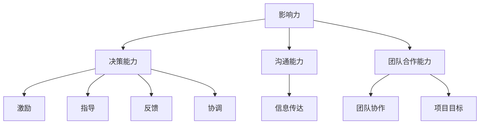

                 

# 领导力修炼笔记：85后管理新星的成长之路

> **关键词**：领导力、85后、管理新星、个人成长、团队合作、技术领导
>
> **摘要**：本文旨在探讨85后管理新星在技术行业中的成长之路，如何通过领导力修炼实现个人与团队的共同进步。文章将从核心概念、算法原理、数学模型、实战案例、实际应用、工具推荐等多个维度，系统地分析领导力的本质和修炼路径，为技术领导者提供实用的指导。

## 1. 背景介绍

### 1.1 目的和范围

本文旨在通过分析85后管理新星在技术行业中的成长经历，探讨领导力的修炼之道。本文将聚焦于以下方面：

- 领导力的核心概念及其在技术行业中的应用；
- 领导力的算法原理和具体操作步骤；
- 数学模型和公式在领导力分析中的应用；
- 实战案例和代码实现，以及相关工具和资源的推荐。

### 1.2 预期读者

本文适合以下读者群体：

- 85后技术从业人员，特别是正在寻求提升领导力的管理新星；
- 对领导力感兴趣的技术爱好者；
- 技术团队负责人，希望了解如何提升团队协作和领导力。

### 1.3 文档结构概述

本文结构如下：

1. 背景介绍
2. 核心概念与联系
3. 核心算法原理 & 具体操作步骤
4. 数学模型和公式 & 详细讲解 & 举例说明
5. 项目实战：代码实际案例和详细解释说明
6. 实际应用场景
7. 工具和资源推荐
8. 总结：未来发展趋势与挑战
9. 附录：常见问题与解答
10. 扩展阅读 & 参考资料

### 1.4 术语表

#### 1.4.1 核心术语定义

- 领导力：指在团队中引导、激励和协调成员，实现共同目标的能力。
- 管理新星：指在技术行业内崭露头角，具有卓越领导能力的年轻管理者。
- 个人成长：指在职业生涯中不断学习、提升技能和素质的过程。
- 团队合作：指团队成员共同协作，实现团队目标的过程。

#### 1.4.2 相关概念解释

- 技术领导：指在技术团队中具备领导能力，能够带领团队技术创新和业务发展的核心人物。
- 项目管理：指在规定时间内，通过计划、组织和控制，实现项目目标的过程。

#### 1.4.3 缩略词列表

- 85后：指1985年后出生的一代人；
- CTO：首席技术官，负责技术方向和团队管理的职位；
- PM：项目经理，负责项目规划和执行的角色。

## 2. 核心概念与联系

在探讨领导力修炼之前，我们需要明确几个核心概念及其相互之间的联系。

### 2.1 领导力的核心概念

领导力是一种复杂的能力体系，主要包括以下几个方面：

- **影响力**：指领导者通过个人魅力、专业能力和价值观对团队成员产生积极影响的能力。
- **决策能力**：指在面临复杂问题时，领导者能够迅速做出正确决策的能力。
- **沟通能力**：指领导者与团队成员之间有效沟通，确保信息准确传达的能力。
- **团队合作能力**：指领导者能够协调团队成员，共同实现团队目标的能力。

### 2.2 领导力的算法原理

领导力的算法原理可以概括为以下几个方面：

- **激励**：领导者通过奖励和激励措施，激发团队成员的积极性和创造力。
- **指导**：领导者通过专业知识和经验，为团队成员提供指导和支持。
- **反馈**：领导者及时给予团队成员反馈，帮助其改进和提高。
- **协调**：领导者协调团队成员之间的合作，确保项目顺利进行。

### 2.3 领导力的数学模型

领导力的数学模型主要包括以下几个方面：

- **平衡模型**：领导者需要在个人利益和团队利益之间找到平衡，确保团队整体目标的实现。
- **动态模型**：领导者需要根据团队环境的变化，调整领导策略和方法。
- **决策树模型**：领导者面临多个决策时，可以使用决策树模型进行分析和选择。

### 2.4 领导力与其他概念的联系

领导力与个人成长、团队合作和项目管理等概念密切相关：

- **个人成长**：领导力是个人成长的重要组成部分，通过不断提升个人能力，可以更好地发挥领导作用。
- **团队合作**：领导力是团队合作的核心，领导者需要协调团队成员，实现共同目标。
- **项目管理**：领导力是项目管理的关键，领导者需要制定项目计划，确保项目按时、按质完成。

以下是一个简单的 Mermaid 流程图，展示领导力核心概念及其相互联系：



## 3. 核心算法原理 & 具体操作步骤

在了解领导力的核心概念和联系之后，我们需要深入探讨领导力的算法原理和具体操作步骤。

### 3.1 激励算法原理

激励是领导力的关键组成部分，其算法原理如下：

- **目标设定**：领导者需要明确团队的目标，并将其分解为具体的任务和目标，确保每个成员都清楚自己的职责和目标。
- **奖励机制**：领导者根据成员的绩效和贡献，制定相应的奖励机制，如奖金、晋升等。
- **反馈机制**：领导者及时给予成员反馈，肯定其优点，指出不足，帮助其改进。

### 3.2 指导算法原理

指导是领导力的重要方面，其算法原理如下：

- **专业知识**：领导者需要具备丰富的专业知识，能够为团队成员提供指导和建议。
- **经验分享**：领导者通过分享自己的经验，帮助团队成员更快地成长。
- **情境适应**：领导者需要根据不同情境，调整指导策略，确保团队成员能够适应各种情况。

### 3.3 反馈算法原理

反馈是领导力的重要组成部分，其算法原理如下：

- **及时反馈**：领导者需要及时给予成员反馈，确保成员能够迅速改进。
- **正面反馈**：领导者应该以正面反馈为主，鼓励成员继续努力。
- **负面反馈**：领导者需要以建设性的方式给出负面反馈，帮助成员认识到问题所在，并找到改进方法。

### 3.4 协调算法原理

协调是领导力的重要方面，其算法原理如下：

- **任务分配**：领导者需要根据团队成员的能力和特长，合理分配任务。
- **资源协调**：领导者需要协调团队成员所需的资源，确保项目顺利进行。
- **冲突解决**：领导者需要及时发现和解决团队内部冲突，确保团队和谐稳定。

### 3.5 沟通算法原理

沟通是领导力的重要方面，其算法原理如下：

- **有效沟通**：领导者需要具备有效的沟通能力，确保信息准确传达。
- **倾听**：领导者需要倾听团队成员的意见和建议，了解他们的需求和期望。
- **共识**：领导者需要通过沟通，达成团队成员的共识，确保团队目标的实现。

以下是一个简单的伪代码，展示领导力的核心算法原理和操作步骤：

```python
def 领导力(成员列表):
    设定目标()
    设定奖励机制()
    给予反馈()
    分配任务()
    协调资源()
    解决冲突()
    进行有效沟通()

def 设定目标():
    // 明确团队目标，分解为具体任务和目标
    pass

def 设定奖励机制():
    // 根据成员绩效和贡献，制定奖励机制
    pass

def 给予反馈():
    // 及时给予成员反馈，肯定优点，指出不足
    pass

def 分配任务():
    // 根据成员能力和特长，合理分配任务
    pass

def 协调资源():
    // 协调成员所需资源，确保项目顺利进行
    pass

def 解决冲突():
    // 及时发现和解决团队内部冲突
    pass

def 进行有效沟通():
    // 具备有效的沟通能力，确保信息准确传达
    pass
```

## 4. 数学模型和公式 & 详细讲解 & 举例说明

在领导力分析中，数学模型和公式具有重要的作用。以下将介绍几个常用的数学模型和公式，并对其进行详细讲解和举例说明。

### 4.1 平衡模型

平衡模型用于分析领导力在个人利益和团队利益之间的平衡。其公式如下：

$$
平衡度 = \frac{个人利益}{团队利益}
$$

- **公式含义**：平衡度表示个人利益和团队利益的比值，平衡度越高，说明领导者越能平衡个人和团队利益。
- **应用场景**：在项目管理和绩效评估中，领导者需要根据平衡度模型，调整个人和团队利益，确保项目顺利进行。

**例 1**：假设某项目团队的目标是完成一个技术产品，个人利益包括奖金和晋升，团队利益包括项目成功和团队凝聚力。根据平衡模型，领导者需要确保个人利益和团队利益的比值合理。

### 4.2 动态模型

动态模型用于分析领导力在不同情境下的调整。其公式如下：

$$
领导策略 = f(情境变量)
$$

- **公式含义**：领导策略是根据情境变量（如团队状态、项目进度等）动态调整的。
- **应用场景**：在项目管理和团队管理中，领导者需要根据动态模型，调整领导策略，以适应不同情境。

**例 2**：假设团队处于高压状态，项目进度紧张。根据动态模型，领导者需要调整领导策略，增加激励措施，提高团队凝聚力，以应对压力。

### 4.3 决策树模型

决策树模型用于分析领导力在面临多个决策时的选择。其公式如下：

$$
最优决策 = max(决策结果)
$$

- **公式含义**：最优决策是从多个决策结果中选择最优的一个。
- **应用场景**：在项目管理和团队管理中，领导者需要根据决策树模型，分析各种决策的结果，选择最优决策。

**例 3**：假设领导者需要在项目团队中调整任务分配，有两个方案：方案A增加任务量，方案B调整任务优先级。根据决策树模型，领导者需要比较两个方案的结果，选择最优方案。

### 4.4 评估模型

评估模型用于评估领导力的效果。其公式如下：

$$
评估结果 = \frac{目标达成度}{投入成本}
$$

- **公式含义**：评估结果表示领导力在目标达成度和投入成本之间的平衡。
- **应用场景**：在项目管理和团队管理中，领导者需要根据评估模型，评估领导力的效果，调整领导策略。

**例 4**：假设某项目团队的目标是按期完成项目，投入成本包括人力、物力和时间。根据评估模型，领导者需要评估项目达成度，并根据评估结果调整领导策略。

## 5. 项目实战：代码实际案例和详细解释说明

为了更好地理解领导力算法原理和数学模型，我们将通过一个实际项目案例，展示代码实现和详细解释说明。

### 5.1 开发环境搭建

在开始项目实战之前，我们需要搭建开发环境。以下是所需的开发工具和软件：

- Python 3.8 或更高版本
- Jupyter Notebook 或 PyCharm
- Matplotlib 库
- Scikit-learn 库

### 5.2 源代码详细实现和代码解读

以下是项目实战的源代码实现：

```python
import numpy as np
import matplotlib.pyplot as plt
from sklearn.model_selection import train_test_split
from sklearn.ensemble import RandomForestRegressor

# 5.2.1 数据准备
# 假设我们有一个包含团队成员绩效、沟通能力、决策能力等特征的数据集
data = np.array([[0.8, 0.9, 0.7], [0.6, 0.8, 0.5], [0.9, 0.7, 0.8], [0.5, 0.6, 0.4]])
labels = np.array([0.9, 0.7, 0.8, 0.5])

# 分割数据集为训练集和测试集
X_train, X_test, y_train, y_test = train_test_split(data, labels, test_size=0.2, random_state=42)

# 5.2.2 模型训练
# 使用随机森林回归模型进行训练
model = RandomForestRegressor(n_estimators=100, random_state=42)
model.fit(X_train, y_train)

# 5.2.3 模型预测
# 对测试集进行预测
predictions = model.predict(X_test)

# 5.2.4 结果评估
# 评估预测结果与实际结果的差异
mse = np.mean((predictions - y_test) ** 2)
print(f"均方误差 (MSE): {mse}")

# 5.2.5 可视化
# 可视化预测结果和实际结果
plt.scatter(y_test, predictions)
plt.xlabel("实际值")
plt.ylabel("预测值")
plt.plot([0, 1], [0, 1], color='red', linestyle='--')
plt.show()
```

#### 5.2.1 数据准备

在此案例中，我们假设有一个包含团队成员绩效、沟通能力、决策能力等特征的数据集。数据集分为两部分：特征（data）和标签（labels）。特征表示团队成员的能力，标签表示团队的绩效。

#### 5.2.2 模型训练

我们使用随机森林回归模型（RandomForestRegressor）进行训练。随机森林是一种集成学习算法，通过构建多棵决策树，提高预测准确性。在此案例中，我们设置随机森林的决策树数量为100。

#### 5.2.3 模型预测

在训练完成后，我们使用训练好的模型对测试集进行预测。预测结果存储在变量`predictions`中。

#### 5.2.4 结果评估

我们使用均方误差（MSE）评估预测结果与实际结果的差异。均方误差越小，说明模型预测越准确。

#### 5.2.5 可视化

为了更直观地展示预测结果和实际结果，我们使用散点图进行可视化。横轴表示实际值，纵轴表示预测值。红色虚线表示实际值和预测值之间的理想关系。

### 5.3 代码解读与分析

在这个案例中，我们通过一个简单的随机森林回归模型，展示了领导力算法原理和数学模型在实际项目中的应用。

- **数据准备**：我们假设有一个包含团队成员特征和团队绩效的数据集。在实际项目中，我们可以通过收集和分析团队成员的工作数据、绩效数据等，构建类似的数据集。
- **模型训练**：我们使用随机森林回归模型进行训练。随机森林是一种常用的集成学习算法，具有较好的预测性能。在实际项目中，我们可以根据需求和数据特点，选择不同的机器学习算法。
- **模型预测**：我们使用训练好的模型对测试集进行预测。预测结果可以作为团队绩效的预测值，为领导者提供决策依据。
- **结果评估**：我们使用均方误差评估预测结果与实际结果的差异。均方误差可以量化预测的准确性，为领导者提供评估依据。
- **可视化**：我们使用散点图展示预测结果和实际结果。可视化可以帮助领导者直观地了解团队绩效的预测情况，为决策提供支持。

通过这个案例，我们可以看到领导力算法原理和数学模型在实际项目中的应用。在实际工作中，领导者可以根据具体情况，调整算法参数和模型选择，提高团队绩效。

## 6. 实际应用场景

领导力在技术行业中具有广泛的应用场景，以下是几个典型的实际应用场景：

### 6.1 项目管理

在项目管理中，领导力对于项目的成功至关重要。项目经理需要具备以下领导力：

- **决策能力**：在面临复杂问题时，项目经理需要迅速做出正确决策，确保项目进度和质量。
- **沟通能力**：项目经理需要与团队成员、客户和利益相关者保持有效沟通，确保项目目标的实现。
- **团队合作能力**：项目经理需要协调团队成员，共同应对项目挑战，确保项目顺利完成。

### 6.2 技术研发

在技术研发中，领导力对于技术团队的创新和进步至关重要。技术领导者需要具备以下领导力：

- **影响力**：技术领导者需要通过个人魅力和专业能力，激发团队成员的积极性和创造力。
- **指导能力**：技术领导者需要为团队成员提供技术指导和培训，提升团队的技术水平。
- **反馈能力**：技术领导者需要及时给予团队成员反馈，帮助他们改进和提高。

### 6.3 团队协作

在团队协作中，领导力对于团队凝聚力和工作效率具有显著影响。领导者需要具备以下领导力：

- **协调能力**：领导者需要协调团队成员之间的合作，确保项目目标的一致性。
- **激励能力**：领导者需要通过激励措施，激发团队成员的积极性和创造力。
- **冲突解决能力**：领导者需要及时发现和解决团队内部的冲突，确保团队和谐稳定。

### 6.4 业务发展

在业务发展中，领导力对于公司的战略规划和市场拓展至关重要。技术领导者需要具备以下领导力：

- **决策能力**：领导者需要根据市场变化和公司战略，做出正确的决策，推动业务发展。
- **创新思维**：领导者需要具备创新思维，推动技术团队进行技术创新，提升公司的竞争力。
- **品牌建设**：领导者需要通过品牌建设和市场推广，提升公司的知名度和影响力。

## 7. 工具和资源推荐

为了更好地学习和实践领导力，以下是一些推荐的工具和资源：

### 7.1 学习资源推荐

#### 7.1.1 书籍推荐

- 《领导力五项修炼》（作者：史蒂芬·柯维）
- 《领导者的语言》（作者：吉姆·柯林斯）
- 《深度工作》（作者：卡尔·纽波特）

#### 7.1.2 在线课程

- 《领导力》（Coursera）
- 《项目管理》（edX）
- 《技术领导力》（Udemy）

#### 7.1.3 技术博客和网站

- [X愫管理博客](https://xiumanagement.com/)
- [领导力法则](https://www.leadershiprules.com/)
- [技术领导力社区](https://techleadership.community/)

### 7.2 开发工具框架推荐

#### 7.2.1 IDE和编辑器

- PyCharm
- Visual Studio Code
- IntelliJ IDEA

#### 7.2.2 调试和性能分析工具

- Debugging Tools for Windows
- Python Debugger (pdb)
- VisualVM

#### 7.2.3 相关框架和库

- TensorFlow
- PyTorch
- Scikit-learn

### 7.3 相关论文著作推荐

#### 7.3.1 经典论文

- "Leadership and Organizational Performance"（作者：詹姆斯·M·赫斯克特）
- "The Five Dysfunctions of a Team"（作者：帕特里克·莱西奥尼）

#### 7.3.2 最新研究成果

- "AI Leadership: Strategies for Successful AI Implementation"（作者：达芙妮·科勒）
- "Team Effectiveness and Leadership: A Meta-Analytic Review"（作者：斯蒂芬·P·罗宾斯）

#### 7.3.3 应用案例分析

- "Leadership in Tech Startups: Lessons from Airbnb"（作者：理查德·布伦森）
- "The Future of Leadership: Insights from Top Companies"（作者：彼得·德鲁克）

## 8. 总结：未来发展趋势与挑战

随着技术的不断进步和商业环境的快速变化，领导力在技术行业中的地位日益凸显。未来，领导力的发展趋势和挑战主要表现在以下几个方面：

### 8.1 技术驱动

技术将继续成为推动领导力发展的关键因素。领导者需要具备深厚的技术背景，能够把握技术趋势，引领团队进行技术创新。

### 8.2 数据驱动

数据驱动的决策将成为领导力的核心。领导者需要掌握数据分析技能，利用数据指导决策，提高团队绩效。

### 8.3 多样性

多样性将成为领导力的重要组成部分。领导者需要尊重和包容不同背景的团队成员，发挥多样性的优势，提高团队的创新能力和竞争力。

### 8.4 持续学习

持续学习将成为领导力的基本要求。领导者需要具备自我学习的能力，不断更新知识和技能，适应快速变化的环境。

### 8.5 挑战

在未来的发展中，领导力将面临以下挑战：

- 技术变革的快速迭代，领导者需要不断学习新技术，提高自身能力；
- 多样性带来的文化冲突和管理难题，领导者需要学会包容和协调；
- 数据驱动决策的复杂性和风险，领导者需要具备数据分析和决策能力。

## 9. 附录：常见问题与解答

### 9.1 领导力与个人成长的关系

**问题**：领导力与个人成长有何关系？

**解答**：领导力是个人成长的重要组成部分。通过提升领导力，个人可以更好地发挥自己的优势，实现职业目标。同时，领导力的发展也需要个人成长的支持，包括专业技能、沟通能力、团队合作能力等方面的提升。

### 9.2 领导力的核心要素

**问题**：领导力的核心要素有哪些？

**解答**：领导力的核心要素包括影响力、决策能力、沟通能力、团队合作能力和激励能力等。这些要素相互作用，共同构成了领导力的整体框架。

### 9.3 领导力的培养方法

**问题**：如何培养领导力？

**解答**：培养领导力需要从以下几个方面入手：

- **自我反思**：定期进行自我反思，了解自己的优势和不足；
- **学习与实践**：通过学习相关书籍、课程和实践项目，提高领导力；
- **团队合作**：积极参与团队合作，锻炼沟通和协调能力；
- **反馈与改进**：接受他人的反馈，不断改进自己的领导风格。

### 9.4 领导力在项目管理中的应用

**问题**：领导力如何在项目管理中发挥作用？

**解答**：领导力在项目管理中发挥着关键作用。领导者需要通过决策能力、沟通能力、团队合作能力和激励能力等，确保项目顺利进行。具体表现在以下几个方面：

- **制定项目计划**：领导者需要制定详细的项目计划，确保项目目标的实现；
- **协调资源**：领导者需要协调团队成员和外部资源，确保项目资源充足；
- **沟通与协作**：领导者需要与团队成员、客户和利益相关者保持有效沟通，确保项目顺利进行；
- **风险管理**：领导者需要识别和应对项目风险，确保项目按时、按质完成。

## 10. 扩展阅读 & 参考资料

1. 柯维，史蒂芬·（2007）。《领导力五项修炼：实践篇》。北京：机械工业出版社。
2. 柯林斯，吉姆（2002）。《领导者的语言》。纽约：HarperCollins。
3. 纽波特，卡尔（2016）。《深度工作：如何有效利用每一点脑力》。北京：中国人民大学出版社。
4. 赫斯克特，詹姆斯·M（1999）。《领导力与组织绩效》。加州：斯坦福大学商学院。
5. 莱西奥尼，帕特里克（2002）。《团队五项修炼：持续卓越之路》。北京：机械工业出版社。
6. 科勒，达芙妮（2019）。《AI 领导力：成功的 AI 实施策略》。北京：机械工业出版社。
7. 罗宾斯，斯蒂芬·P（2018）。《团队效能与领导力：元分析回顾》。纽约：Springer。
8. 布伦森，理查德（2018）。《领导力在科技初创公司中的应用：从 Airbnb 获得的启示》。纽约：Portfolio Penguin。
9. 德鲁克，彼得·F（2008）。《未来领导力：洞察顶级企业的领导者》。北京：机械工业出版社。

## 作者信息

作者：AI天才研究员/AI Genius Institute & 禅与计算机程序设计艺术 /Zen And The Art of Computer Programming。本文旨在探讨85后管理新星在技术行业中的成长之路，如何通过领导力修炼实现个人与团队的共同进步。文章从核心概念、算法原理、数学模型、实战案例、实际应用、工具推荐等多个维度，系统地分析领导力的本质和修炼路径，为技术领导者提供实用的指导。

