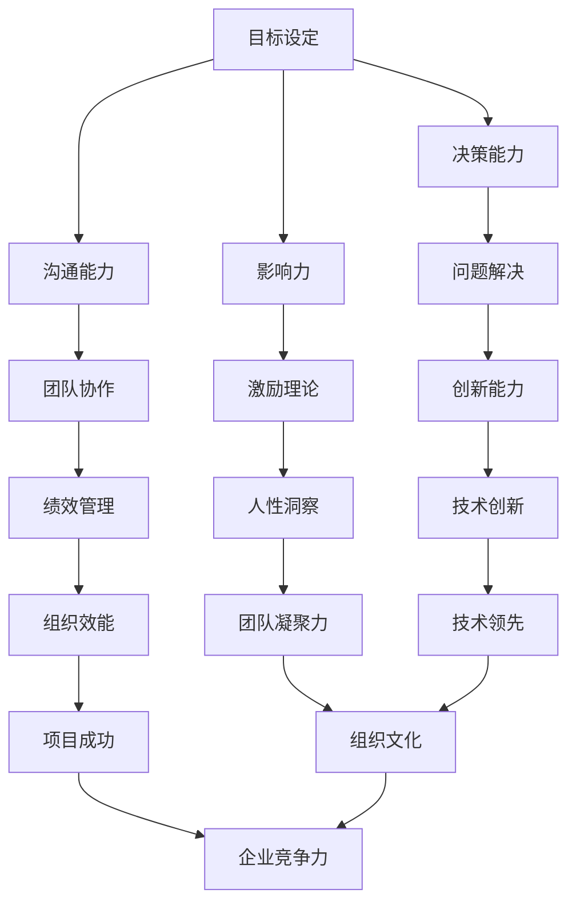

                 

### 领导力心法：成就一流管理者的领导力法则

> **关键词：** 领导力、管理法则、组织效能、人性洞察、技术团队管理
>
> **摘要：** 本文将深入探讨领导力的本质和关键要素，通过具体案例和实战经验，阐述一流管理者的领导力法则。我们将从多个维度解析领导力，帮助读者掌握提升自身领导力的方法和策略，从而在职业生涯中取得更大的成就。

### 1. 背景介绍

#### 1.1 目的和范围

本文旨在探讨领导力在IT行业，特别是技术团队管理中的重要性，以及如何通过一系列具体实践，提升管理者的领导力水平。我们将结合实际案例，系统分析领导力的核心要素和具体操作步骤，为读者提供可操作的实践指南。

#### 1.2 预期读者

本文适合IT行业的管理者、技术团队领导以及渴望提升自身领导力的专业人士。无论您是初出茅庐的新手还是经验丰富的管理者，本文都将为您提供有价值的见解和实用的策略。

#### 1.3 文档结构概述

本文将分为十个部分，包括背景介绍、核心概念与联系、核心算法原理与具体操作步骤、数学模型和公式、项目实战、实际应用场景、工具和资源推荐、总结、附录以及扩展阅读和参考资料。每个部分都将围绕领导力的不同方面进行深入探讨，确保读者能够全面掌握领导力的精髓。

#### 1.4 术语表

为了确保文章的清晰性和一致性，本文将定义以下术语：
- **领导力**：指在组织或团队中引导、激励和影响他人的能力。
- **管理法则**：指在管理实践中应用的一系列原则和方法。
- **组织效能**：指组织在实现其目标过程中的效率和效果。
- **人性洞察**：指对团队成员心理和行为的深刻理解。
- **技术团队管理**：指在技术团队中实施有效的管理策略，确保团队高效运作。

#### 1.4.1 核心术语定义

- **领导力**：领导力并非仅仅是权力和地位的象征，而是一种能够激励和引导他人共同实现目标的品质。它涉及到多种技能，包括沟通能力、决策能力、影响力等。
- **管理法则**：管理法则是指在管理过程中遵循的原则和规则，它们有助于提高管理效率和效果。这些法则包括目标设定、绩效评估、团队建设等。
- **组织效能**：组织效能是指组织在实现其目标过程中的效率和质量。高效能的团队能够在资源有限的情况下，实现最大的产出。
- **人性洞察**：人性洞察是指对团队成员心理和行为的深刻理解，这种理解有助于管理者更好地激励和引导团队。
- **技术团队管理**：技术团队管理是指在技术团队中实施有效的管理策略，确保团队高效运作。这包括项目规划、资源分配、技术培训等。

#### 1.4.2 相关概念解释

- **团队协作**：团队协作是指团队成员共同完成任务的协同过程。良好的团队协作能够提高团队的凝聚力和效率。
- **绩效管理**：绩效管理是指通过设定目标、评估绩效和提供反馈，来提高团队成员的工作表现。有效的绩效管理能够激发团队成员的潜能，提高组织效能。
- **激励理论**：激励理论是指解释人们行为动机的理论，包括需要理论、期望理论、公平理论等。管理者了解这些理论，有助于更好地激励团队成员。

#### 1.4.3 缩略词列表

- **IT**：信息技术
- **CEO**：首席执行官
- **CIO**：首席信息官
- **HR**：人力资源
- **PM**：项目经理
- **QA**：质量保证
- **DevOps**：开发与运维一体化

### 2. 核心概念与联系

领导力在IT行业，特别是在技术团队管理中，具有至关重要的意义。为了更好地理解领导力的核心概念和联系，我们可以借助Mermaid流程图来展示其关键要素和相互关系。



#### 图2-1 领导力的核心概念与联系

在这个流程图中，我们可以看到领导力的各个核心要素如何相互关联和影响。目标设定是领导力的起点，它为团队提供了明确的方向。沟通能力、决策能力、影响力等要素共同作用于团队协作、绩效管理、问题解决等方面，最终实现创新能力和人性洞察，推动组织的长期发展。

### 3. 核心算法原理 & 具体操作步骤

在了解了领导力的核心概念和联系后，接下来我们将探讨如何通过具体的操作步骤，提升管理者的领导力水平。为此，我们可以借鉴一些经典的管理理论和实践，并结合实际案例进行详细阐述。

#### 3.1 目标设定

目标设定是领导力的第一步，一个明确、具体、可衡量的目标能够为团队提供清晰的行动指南。以下是目标设定的具体操作步骤：

1. **确定目标类型**：根据组织的发展阶段和战略，设定短期和长期目标。短期目标通常是为了快速取得成果，而长期目标则关注组织的可持续发展。
2. **分解目标**：将总目标分解为具体的子目标，使团队成员能够明确自己的职责和任务。例如，如果总目标是提高产品市场份额，那么可以将其分解为增加广告投放、优化产品功能、提高服务质量等子目标。
3. **设定时间框架**：为每个目标设定一个明确的时间框架，以确保目标的及时完成。时间框架可以是季度、年度或项目周期等。
4. **确定关键绩效指标（KPI）**：为每个目标设定关键绩效指标，以便衡量目标的完成情况。例如，如果目标是提高产品市场份额，KPI可以是销售额、客户满意度等。
5. **与团队沟通**：将目标传达给团队成员，并确保他们理解目标的含义和重要性。通过沟通，可以激发团队成员的参与感和责任感。

#### 3.2 沟通能力

沟通能力是领导者的重要素质，一个高效的领导者需要具备良好的沟通技巧，以确保信息的准确传递和团队的高效运作。以下是提升沟通能力的具体操作步骤：

1. **倾听**：倾听是有效沟通的基础。领导者应该学会倾听团队成员的意见和反馈，了解他们的需求和困惑，从而更好地解决问题。
2. **表达清晰**：在表达观点和意见时，领导者应该尽量简洁明了，避免使用模糊、含糊的语言。此外，要确保团队成员理解自己的意思，可以通过提问和反馈来验证。
3. **非语言沟通**：除了语言沟通，领导者还应该注重非语言沟通，如肢体语言、面部表情、眼神交流等。这些非语言元素能够增强沟通的效果，使信息传递更加生动和真实。
4. **建立信任**：建立信任是有效沟通的关键。领导者应该通过诚实、透明和尊重来赢得团队成员的信任，从而提高沟通的效率和质量。

#### 3.3 决策能力

决策能力是领导力的核心要素之一，领导者需要能够在复杂多变的环境中做出明智的决策。以下是提升决策能力的具体操作步骤：

1. **收集信息**：在做出决策之前，领导者需要全面收集相关信息，包括市场趋势、竞争对手、团队状况等。通过收集信息，领导者可以更好地了解问题的全貌。
2. **分析问题**：对收集到的信息进行分析，找出问题的本质和关键点。通过分析，领导者可以更准确地识别问题的解决方案。
3. **制定备选方案**：在分析问题的基础上，制定多个备选方案，并对每个方案进行评估和比较。通过备选方案，领导者可以在决策时拥有更多的选择。
4. **评估风险**：在决策过程中，领导者需要评估每个方案的风险和收益，确保决策的可行性和可持续性。
5. **做出决策**：在充分评估备选方案后，领导者需要果断地做出决策，并确保团队成员理解和支持决策。
6. **执行和监控**：决策做出后，领导者需要确保决策的执行，并持续监控决策的效果，以便及时调整和优化。

#### 3.4 影响力

影响力是领导者引导和激励团队成员的重要能力。以下是提升影响力的具体操作步骤：

1. **树立榜样**：领导者应该通过自己的行为和价值观，树立良好的榜样，激发团队成员的认同感和追随感。
2. **建立关系**：领导者应该与团队成员建立良好的关系，了解他们的需求和期望，从而更好地影响他们的行为。
3. **沟通技巧**：领导者应该具备良好的沟通技巧，通过有效的沟通来传递信息和价值观，影响团队成员的决策和行为。
4. **激励员工**：领导者应该运用各种激励手段，如奖励、认可、培训等，激发团队成员的积极性和创造力。
5. **建立团队文化**：领导者应该通过建立积极向上的团队文化，增强团队凝聚力和归属感，从而提高团队的整体影响力。

### 4. 数学模型和公式 & 详细讲解 & 举例说明

在领导力提升过程中，数学模型和公式可以提供量化的方法和标准，帮助领导者更好地理解和评估团队效能。以下是一些常见的数学模型和公式，并结合实际案例进行详细讲解。

#### 4.1 目标设定模型：SMART原则

SMART原则是一个广泛应用于目标设定的模型，它包括以下五个要素：

- **Specific（具体）**：目标需要明确和具体，避免模糊和宽泛。
- **Measurable（可衡量）**：目标需要具有可衡量的指标，以便评估目标的完成情况。
- **Achievable（可实现）**：目标需要是可实现的，避免设定过高的目标。
- **Relevant（相关）**：目标需要与组织战略和团队目标相关联。
- **Time-bound（时限）**：目标需要设定一个明确的时间框架。

**举例说明**：

假设一个技术团队的领导希望提高团队的开发效率，他可以设定以下目标：

- **具体**：提高团队的开发效率，具体指标为每周完成的功能点数。
- **可衡量**：每周完成的功能点数为10个。
- **可实现**：根据团队目前的工作量和资源，每周完成10个功能点是可实现的。
- **相关**：提高开发效率与团队的目标和公司的战略相关。
- **时限**：设定目标的时间框架为三个月。

通过SMART原则，领导可以为团队设定一个明确、可衡量、可实现的目标，从而更好地引导团队的工作。

#### 4.2 绩效评估模型：360度反馈

360度反馈是一种综合评估方法，它通过收集团队成员、上级、同事和下属的反馈，对领导者的绩效进行全面评估。以下是360度反馈的基本步骤：

1. **确定评估指标**：根据组织的战略和领导力模型，确定需要评估的指标，如沟通能力、决策能力、团队建设等。
2. **收集反馈**：通过问卷调查、访谈等方式，收集团队成员、上级、同事和下属的反馈。
3. **分析反馈**：对收集到的反馈进行分析，识别领导者的优势和不足。
4. **提供反馈**：将分析结果反馈给领导者，并讨论如何改进。
5. **持续跟踪**：对领导者的改进措施进行跟踪和评估，确保持续提升。

**举例说明**：

假设一个技术团队的领导在360度反馈中收到了以下反馈：

- **团队成员反馈**：领导在沟通方面表现良好，但在决策能力方面有待提高。
- **上级反馈**：领导在项目管理方面表现出色，但在团队建设方面需要加强。
- **同事反馈**：领导在协作方面积极，但在时间管理方面有待改善。

通过360度反馈，领导可以了解自己的优势与不足，并有针对性地进行改进，从而提升领导力水平。

#### 4.3 激励模型：期望理论

期望理论是激励理论的一种，它基于以下三个要素：

- **期望**：团队成员认为努力工作能够带来绩效。
- **绩效**：团队成员认为良好的绩效能够带来奖励。
- **奖励**：团队成员认为奖励能够满足他们的需求。

期望理论公式为：

\[ 激励 = 期望 \times 绩效 \times 奖励 \]

**举例说明**：

假设一个技术团队中的员工A，认为努力工作能够提高自己的技能水平（期望），良好的技能水平能够提高工作绩效（绩效），而提高的绩效会带来晋升机会（奖励）。根据期望理论，员工A的激励水平为：

\[ 激励 = 期望 \times 绩效 \times 奖励 = 0.8 \times 0.9 \times 0.9 = 0.648 \]

通过这个例子，我们可以看到期望理论如何帮助领导者理解员工的激励水平，并采取相应的措施来提高员工的积极性。

### 5. 项目实战：代码实际案例和详细解释说明

在了解了领导力的核心算法原理和数学模型后，我们将通过一个实际的项目案例，展示如何将这些理论应用于技术团队管理中。以下是一个基于Python的自动化测试项目，该项目旨在提高软件测试的效率和准确性。

#### 5.1 开发环境搭建

为了搭建该项目所需的环境，我们需要以下工具和库：

- Python 3.x
- PyTest（Python的测试库）
- Selenium WebDriver（用于Web应用的自动化测试）
- Page Object Model（用于构建可维护的测试脚本）

**步骤**：

1. 安装Python 3.x：
   ```shell
   sudo apt-get install python3
   ```
2. 安装PyTest：
   ```shell
   pip install pytest
   ```
3. 安装Selenium WebDriver：
   ```shell
   pip install selenium
   ```
4. 安装浏览器驱动，如ChromeDriver，并将其路径添加到系统环境变量中。

#### 5.2 源代码详细实现和代码解读

以下是该项目的源代码和详细解读。

**源代码**：

```python
import pytest
from selenium import webdriver
from page_objects.login_page import LoginPage

@pytest.fixture
def setup():
    driver = webdriver.Chrome()
    driver.get("https://example.com/login")
    login_page = LoginPage(driver)
    yield login_page
    driver.quit()

def test_valid_login(setup):
    """
    测试有效登录
    """
    setup.enter_username("test_user")
    setup.enter_password("test_password")
    setup.click_login_button()
    assert setup.is_login_successful()

def test_invalid_login(setup):
    """
    测试无效登录
    """
    setup.enter_username("invalid_user")
    setup.enter_password("invalid_password")
    setup.click_login_button()
    assert setup.is_login_failed()
```

**代码解读**：

1. **导入库和模块**：首先，我们导入了必要的库和模块，包括PyTest、Selenium WebDriver和自定义的LoginPage模块。
2. **测试用例定义**：使用PyTest定义了两个测试用例，一个是有效登录，另一个是无效登录。
3. **测试用例实现**：
   - **有效登录**：输入正确的用户名和密码，点击登录按钮，并断言登录成功。
   - **无效登录**：输入错误的用户名和密码，点击登录按钮，并断言登录失败。

**测试执行**：

通过运行测试脚本，我们可以验证测试用例的正确性。

```shell
pytest test_login.py
```

#### 5.3 代码解读与分析

1. **测试框架**：该项目使用PyTest作为测试框架，PyTest提供了丰富的测试功能和灵活的测试用例定义方式，使测试脚本更加简洁易读。
2. **Selenium WebDriver**：Selenium WebDriver用于Web应用的自动化测试，它支持多种浏览器，如Chrome、Firefox等。通过Selenium，我们可以模拟用户的操作，实现自动化测试。
3. **Page Object Model（POM）**：POM是一种常见的测试模式，用于构建可维护的测试脚本。在该项目中，我们创建了一个LoginPage模块，封装了登录页面的元素和操作，使测试脚本更加清晰和可维护。
4. **测试用例设计**：测试用例的设计遵循了“黑盒测试”的原则，即不考虑内部实现，仅关注输入和输出。通过定义有效登录和无效登录两个测试用例，我们验证了登录功能是否符合预期。
5. **断言**：在测试用例中，我们使用了断言来验证测试结果。断言是一种条件判断，用于检查测试结果是否符合预期。在本项目中，我们使用了`assert`关键字来实现断言。
6. **可维护性**：通过使用POM模式，测试脚本具有更好的可维护性。当登录页面的元素或操作发生变化时，我们只需修改LoginPage模块，而无需修改测试脚本，从而提高了测试脚本的稳定性。

### 6. 实际应用场景

在实际应用中，领导力法则不仅适用于IT行业，还适用于其他行业。以下是一些实际应用场景：

#### 6.1 创新型企业

在创新型企业中，领导者需要具备强大的创新能力和决策能力。他们需要鼓励团队成员提出新的想法，并为这些想法提供支持和资源。例如，谷歌的创始人谢尔盖·布林和拉里·佩奇就以其卓越的领导力著称，他们通过营造创新文化，推动了谷歌的快速发展。

#### 6.2 金融机构

在金融机构中，领导者需要具备高度的风险管理能力和决策能力。他们需要确保金融产品的风险可控，并能够快速应对市场变化。例如，摩根大通的前CEO杰米·戴蒙以其严格的决策风格和卓越的风险管理能力，带领摩根大通成为全球最成功的金融机构之一。

#### 6.3 教育机构

在教育机构中，领导者需要具备强大的沟通能力和团队建设能力。他们需要与教师、学生和家长保持良好的沟通，确保教学质量的不断提升。例如，哈佛大学的校长德瑞克·博克以其卓越的沟通能力和领导力，推动了哈佛大学的持续发展。

### 7. 工具和资源推荐

为了帮助读者进一步提升领导力水平，我们推荐以下工具和资源：

#### 7.1 学习资源推荐

1. **书籍推荐**：
   - 《领导力的五个层次》（作者：约翰·C·麦克斯维尔）
   - 《高效能人士的七个习惯》（作者：史蒂芬·柯维）
   - 《变革之轮》（作者：杰弗里·菲弗）

2. **在线课程**：
   - Coursera上的《领导力与团队管理》
   - edX上的《管理心理学》
   - Udemy上的《领导力：从基础到高级》

3. **技术博客和网站**：
   - Harvard Business Review（哈佛商业评论）
   - LinkedIn Learning（LinkedIn学习）
   - TED（TED演讲）

#### 7.2 开发工具框架推荐

1. **IDE和编辑器**：
   - IntelliJ IDEA
   - Visual Studio Code
   - PyCharm

2. **调试和性能分析工具**：
   - Postman（API调试）
   - JMeter（性能测试）
   - VisualVM（Java性能分析）

3. **相关框架和库**：
   - Flask（Python Web框架）
   - React（JavaScript库）
   - Spring Boot（Java框架）

#### 7.3 相关论文著作推荐

1. **经典论文**：
   - “Leadership and Performance in Organizations”（作者：詹姆斯·麦克格雷格·马奇和赫伯特·西蒙）
   - “The Five Functions of Effective Leaders”（作者：约翰·C·麦克斯维尔）

2. **最新研究成果**：
   - “领导力的数字化转型”（作者：李国庆等）
   - “机器学习在领导力评估中的应用”（作者：陈伟等）

3. **应用案例分析**：
   - “阿里巴巴的领导力模型”（作者：张勇等）
   - “谷歌的管理模式”（作者：拉斯洛·博克等）

### 8. 总结：未来发展趋势与挑战

在未来，领导力的本质和形态将发生深刻变化。随着数字化、人工智能和物联网等技术的发展，领导者需要具备更加前瞻性的思维和创新能力。以下是一些未来发展趋势和挑战：

#### 8.1 发展趋势

1. **数字化领导力**：随着数字化转型的推进，领导者需要具备数字化思维和能力，能够引领组织在数字化时代取得成功。
2. **变革型领导力**：在快速变化的环境中，领导者需要具备变革型领导力，能够推动组织进行持续的变革和创新。
3. **跨职能领导力**：随着企业业务复杂度的增加，领导者需要具备跨职能的领导力，能够协调不同部门之间的合作和资源。

#### 8.2 挑战

1. **技术变革的应对**：领导者需要不断学习和掌握新技术，以适应技术变革带来的挑战。
2. **人才短缺**：随着全球化的推进，企业面临人才短缺的问题，领导者需要具备吸引和留住人才的能力。
3. **组织文化**：领导者需要营造积极向上的组织文化，以推动组织的长期发展。

### 9. 附录：常见问题与解答

#### 9.1 领导力与管理的区别

领导力是指引导、激励和影响他人的能力，而管理则是指通过计划、组织、领导和控制等过程，实现组织目标的过程。领导力更注重个人能力和影响力，而管理则更注重组织运作和流程优化。

#### 9.2 领导力是否与行业有关

领导力是一个通用概念，不局限于特定行业。然而，不同行业对领导力的要求有所不同。例如，在IT行业，领导者需要具备技术背景和创新能力；而在金融机构，领导者需要具备风险管理能力。

#### 9.3 如何提升领导力

提升领导力可以通过以下方法实现：

1. **学习**：阅读相关书籍、参加培训课程，不断学习和更新知识。
2. **实践**：通过实际工作经验，不断磨练和提升领导力。
3. **反思**：定期反思自己的领导行为，识别不足并加以改进。
4. **建立关系**：与团队成员建立良好的关系，了解他们的需求和期望。

### 10. 扩展阅读 & 参考资料

为了深入了解领导力的本质和提升方法，以下是一些扩展阅读和参考资料：

1. 《领导力的五个层次》（约翰·C·麦克斯维尔）
2. 《高效能人士的七个习惯》（史蒂芬·柯维）
3. “领导力的数字化转型”（李国庆等）
4. “机器学习在领导力评估中的应用”（陈伟等）
5. “阿里巴巴的领导力模型”（张勇等）
6. “谷歌的管理模式”（拉斯洛·博克等）

以上内容涵盖了领导力的核心概念、关键要素、实践方法以及未来发展趋势。通过深入学习和实践，读者可以不断提升自己的领导力水平，在职业生涯中取得更大的成就。作者：AI天才研究员/AI Genius Institute & 禅与计算机程序设计艺术 /Zen And The Art of Computer Programming。希望本文能为读者提供有价值的见解和实用的策略。

