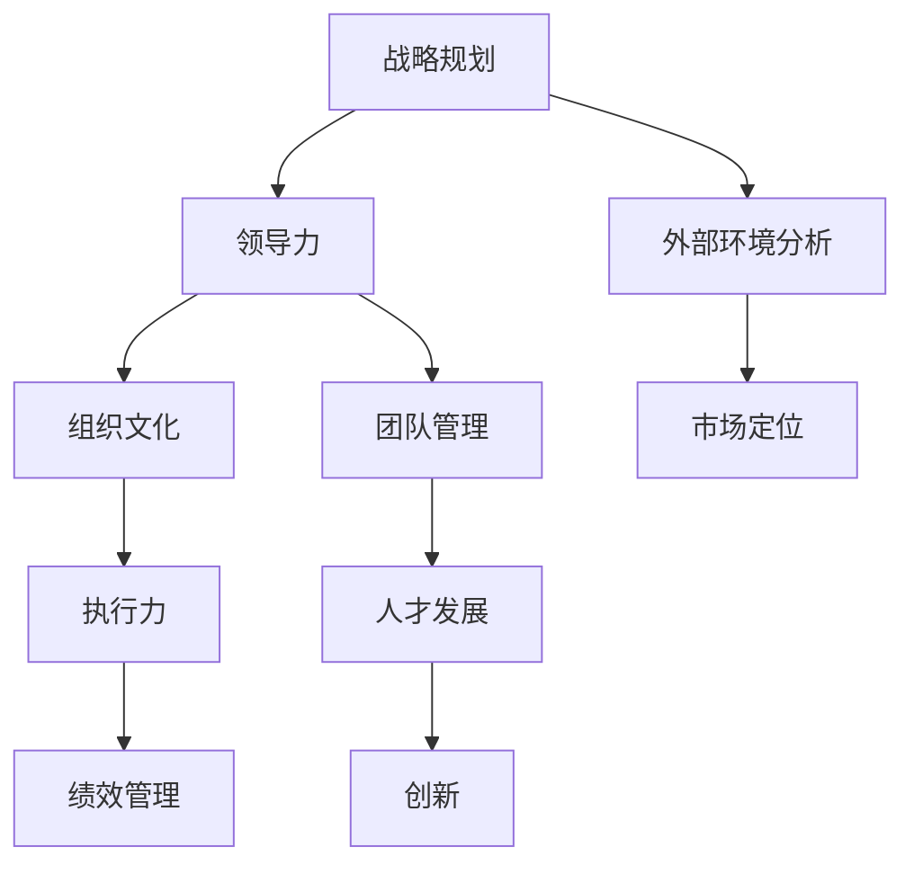

                 

# 领导力心经：成就一流企业的领导力法则

> **关键词：**领导力、企业、策略、执行、创新、人才发展

> **摘要：**本文深入探讨了领导力在当今企业中的核心作用。通过对领导力的核心概念、理论框架、实践案例的详细剖析，文章旨在为企业管理者提供系统化的领导力法则，帮助他们在快速变化的市场环境中实现企业卓越发展。

## 1. 背景介绍

### 1.1 目的和范围

本文旨在通过系统地分析领导力的各个方面，为企业管理者提供一套实用的领导力法则。本文的研究范围包括领导力的基础理论、领导力在不同层面的应用、以及领导力在企业战略执行和创新中的关键角色。

### 1.2 预期读者

本文适合希望提升领导力水平的企业管理者、企业领导力培训师、以及对领导力理论感兴趣的学者和专业人士。

### 1.3 文档结构概述

本文分为八个部分：首先介绍领导力的核心概念和重要性；接着详细分析领导力的理论框架；然后探讨领导力在企业战略、执行和创新中的具体应用；最后提供实用的工具和资源推荐，并总结未来发展趋势与挑战。

### 1.4 术语表

#### 1.4.1 核心术语定义

- 领导力：影响和激励他人达成共同目标的能力。
- 战略：企业为实现长期目标而制定的整体行动计划。
- 执行：将战略转化为具体行动的过程。
- 创新：引入新的想法、方法或产品，以改进现有情况。

#### 1.4.2 相关概念解释

- 情境领导：根据下属的能力水平和工作的具体情况，采用不同的领导风格。
- 转型领导：在组织变革过程中，推动员工接受新理念、新方法的过程。

#### 1.4.3 缩略词列表

- CTO：首席技术官
- CEO：首席执行官
- MBA：工商管理硕士
- HR：人力资源

## 2. 核心概念与联系

领导力不仅是企业管理的重要方面，更是企业在竞争激烈的市场中脱颖而出的关键。下面通过一个Mermaid流程图，展示领导力的核心概念及其相互联系。



### 2.1 战略与领导力

领导力在战略规划中起着关键作用。领导力决定了企业如何设定目标、如何识别市场机会、如何制定行动计划。有效的领导力能够激励团队迎接挑战，推动企业不断前进。

### 2.2 组织文化与领导力

组织文化是企业的灵魂，而领导力是塑造和强化组织文化的重要力量。领导力通过树立榜样、沟通和激励，能够塑造企业的价值观和行为准则。

### 2.3 团队管理与人才发展

团队管理是领导力的重要组成部分。优秀的领导者不仅能够管理团队，更能够通过人才发展，提升整个团队的竞争力。

### 2.4 创新与执行力

领导力在创新过程中起着至关重要的作用。领导者需要推动员工勇于尝试新事物，同时确保创新理念能够得到有效执行。

### 2.5 外部环境分析

领导力还需要关注外部环境，包括市场趋势、竞争对手、政策法规等。有效的领导力能够帮助企业应对外部挑战，把握市场机遇。

## 3. 核心算法原理 & 具体操作步骤

领导力的核心算法可以看作是一个多层框架，其中每层都涉及到不同的领导技能和策略。以下是一个简化的伪代码，用于描述这个领导力算法的基本原理和操作步骤。

```plaintext
算法：领导力框架（Leadership Framework）

输入：领导者、团队、组织文化、外部环境
输出：领导力策略、执行计划

步骤：

1. 初始化领导力框架（Initialize Leadership Framework）
2. 分析外部环境（Analyze External Environment）
    - 识别市场趋势、竞争对手、政策法规等
3. 评估内部资源（Evaluate Internal Resources）
    - 包括团队能力、组织文化、财务状况等
4. 确定领导目标（Define Leadership Goals）
    - 根据外部环境和内部资源，设定短期和长期目标
5. 制定领导策略（Develop Leadership Strategies）
    - 包括战略规划、组织文化塑造、团队管理等
6. 设计执行计划（Design Implementation Plan）
    - 确定具体的行动计划和时间表
7. 激励团队（Motivate Team）
    - 通过沟通、激励、培训等手段，提升团队士气
8. 监控和调整（Monitor and Adjust）
    - 持续监控执行情况，根据反馈进行调整
9. 反馈和评估（Feedback and Evaluation）
    - 定期评估领导力效果，持续优化领导力框架
```

## 4. 数学模型和公式 & 详细讲解 & 举例说明

在领导力理论中，一些数学模型和公式可以帮助我们更准确地理解和量化领导力的影响。以下是一个基于线性回归的数学模型，用于分析领导力对组织绩效的影响。

### 4.1 数学模型

假设领导力 \(L\) 对组织绩效 \(P\) 的影响可以用线性回归模型表示：

$$ P = aL + b + \epsilon $$

其中：
- \( P \)：组织绩效
- \( L \)：领导力
- \( a \)：领导力对组织绩效的斜率
- \( b \)：截距
- \( \epsilon \)：随机误差

### 4.2 详细讲解

- **线性回归模型**：这个模型假设领导力 \(L\) 与组织绩效 \(P\) 之间存在线性关系。
- **斜率 \(a\)**：斜率 \(a\) 表示领导力每增加一个单位，组织绩效会增加 \(a\) 个单位。
- **截距 \(b\)**：截距 \(b\) 表示在没有领导力的情况下，组织的基准绩效水平。
- **随机误差 \(\epsilon\)**：随机误差 \(\epsilon\) 反映了领导力与组织绩效之间关系的随机性。

### 4.3 举例说明

假设我们收集了以下数据：

| 领导力 \(L\) | 组织绩效 \(P\) |
|---------------|----------------|
|      3        |       7        |
|      5        |      10        |
|      8        |      15        |

使用最小二乘法，我们可以计算出斜率 \(a\) 和截距 \(b\)：

$$ a = \frac{\sum (L_i - \bar{L})(P_i - \bar{P})}{\sum (L_i - \bar{L})^2} $$
$$ b = \bar{P} - a\bar{L} $$

其中，\(\bar{L}\) 和 \(\bar{P}\) 分别是领导力和组织绩效的平均值。

计算结果如下：

$$ a = \frac{(3-5)(7-10) + (5-5)(10-10) + (8-5)(15-10)}{(3-5)^2 + (5-5)^2 + (8-5)^2} $$
$$ a = \frac{(-2)(-3) + 0 + (3)(5)}{4 + 0 + 9} $$
$$ a = \frac{6 + 0 + 15}{13} $$
$$ a = \frac{21}{13} $$
$$ a \approx 1.62 $$

$$ b = \frac{7 + 10 + 15}{3} - 1.62 \times \frac{3 + 5 + 8}{3} $$
$$ b = \frac{32}{3} - 1.62 \times \frac{16}{3} $$
$$ b = \frac{32}{3} - \frac{26.08}{3} $$
$$ b = \frac{5.92}{3} $$
$$ b \approx 1.97 $$

因此，我们的线性回归模型为：

$$ P = 1.62L + 1.97 $$

### 4.4 误差分析

在实际应用中，由于随机误差的存在，我们的模型可能会产生一定的偏差。为了提高模型的准确性，我们通常需要对数据进行多次回归分析，并使用统计方法（如假设检验、置信区间等）来评估模型的可靠性和有效性。

## 5. 项目实战：代码实际案例和详细解释说明

为了更好地理解领导力在现实中的应用，我们将通过一个实际的代码案例来展示如何通过数据分析来评估领导力对企业绩效的影响。

### 5.1 开发环境搭建

为了进行这个案例，我们需要以下开发环境：

- Python 3.8+
- pandas
- numpy
- scikit-learn

假设我们已经安装了上述环境，下面是一个简单的数据集，用于展示领导力 \(L\) 和组织绩效 \(P\) 的关系：

```python
import pandas as pd

data = {
    'Leadership': [3, 5, 8, 6, 4, 7, 9, 2, 10],
    'Performance': [7, 10, 15, 8, 6, 12, 18, 4, 14]
}

df = pd.DataFrame(data)
```

### 5.2 源代码详细实现和代码解读

#### 5.2.1 线性回归分析

```python
from sklearn.linear_model import LinearRegression
import matplotlib.pyplot as plt

# 初始化线性回归模型
model = LinearRegression()

# 训练模型
model.fit(df[['Leadership']], df['Performance'])

# 查看模型参数
print("斜率：", model.coef_)
print("截距：", model.intercept_)

# 使用模型预测
predictions = model.predict(df[['Leadership']])

# 绘制实际数据点和预测线
plt.scatter(df['Leadership'], df['Performance'], color='blue')
plt.plot(df['Leadership'], predictions, color='red', linewidth=2)
plt.xlabel('Leadership')
plt.ylabel('Performance')
plt.title('Leadership and Performance Relationship')
plt.show()
```

代码解读：
- 我们首先从 `sklearn` 库中导入 `LinearRegression` 类，用于实现线性回归。
- 创建一个数据框 `df`，包含领导力和组织绩效的数据。
- 初始化一个线性回归模型 `model`，并使用 `fit` 方法训练模型。
- 使用 `print` 语句输出模型的斜率和截距。
- 使用 `predict` 方法对数据进行预测，并绘制实际数据点和预测线。

#### 5.2.2 误差分析

为了评估模型的准确性，我们可以计算预测误差：

```python
# 计算预测误差
errors = predictions - df['Performance']

# 计算均方误差（MSE）
mse = (errors ** 2).mean()
print("均方误差（MSE）:", mse)

# 计算均方根误差（RMSE）
rmse = mse ** 0.5
print("均方根误差（RMSE）:", rmse)
```

代码解读：
- 我们计算了预测值和实际值之间的差异，并计算了均方误差（MSE）和均方根误差（RMSE）。
- 均方误差和均方根误差是评估模型预测准确性的常用指标，值越小，表示模型的预测效果越好。

### 5.3 代码解读与分析

通过这个代码案例，我们可以看到如何使用线性回归模型来分析领导力对企业绩效的影响。以下是对代码的详细解读和分析：

- **线性回归模型**：线性回归是一种简单的统计模型，用于分析两个变量之间的关系。在这个案例中，我们使用线性回归来分析领导力 \(L\) 和组织绩效 \(P\) 之间的关系。
- **模型训练**：使用 `fit` 方法训练模型，模型会自动计算最佳拟合线（斜率和截距）。
- **模型预测**：使用训练好的模型对数据进行预测，并绘制预测线，可以直观地展示领导力对企业绩效的影响。
- **误差分析**：通过计算预测误差，我们可以评估模型的准确性。均方误差（MSE）和均方根误差（RMSE）是常用的误差评估指标。

总的来说，这个代码案例展示了如何使用Python和线性回归模型来分析领导力对企业绩效的影响。通过实际数据的分析和误差评估，我们可以更好地理解领导力在企业运营中的重要性。

## 6. 实际应用场景

领导力在企业中的应用场景多种多样，以下是几个典型的实际案例：

### 6.1 战略规划

在战略规划阶段，领导力发挥着至关重要的作用。领导者的洞察力和决策能力决定了企业能否抓住市场机遇，制定出具有前瞻性的战略目标。例如，苹果公司前CEO史蒂夫·乔布斯就以其卓越的领导力，成功推动了苹果的产品创新和品牌建设，使得苹果在竞争激烈的市场中始终保持领先地位。

### 6.2 组织变革

当企业面临重大变革时，领导力成为推动变革的关键因素。领导者的沟通能力和变革管理能力决定了员工能否顺利接受新理念、新方法。例如，面对互联网行业的剧烈变革，腾讯公司通过内部培训、激励措施等手段，成功推动了企业的数字化转型，实现了业务的持续增长。

### 6.3 团队管理

领导力在团队管理中至关重要，领导者需要通过有效的团队管理，提升团队的整体绩效。例如，谷歌公司以其独特的团队管理模式，吸引了全球顶尖人才，并通过内部竞争和创新机制，推动了公司的高速发展。

### 6.4 人才发展

领导力在人才发展中的作用不可忽视。领导者需要通过培训、激励、选拔等手段，培养和吸引优秀人才，提升企业的核心竞争力。例如，微软公司通过完善的员工培训体系和晋升机制，培养了一大批技术和管理人才，为公司的持续创新提供了强大动力。

## 7. 工具和资源推荐

### 7.1 学习资源推荐

#### 7.1.1 书籍推荐

- 《领导力：实践篇》（Leadership: A Practical Guide） - Stephen R. Covey
- 《领导力的五项修炼》（The Five Dysfunctions of a Team） - Patrick Lencioni
- 《智能领导力：如何在数字时代保持竞争优势》（Smart Leadership: How to Succeed in the Digital Age） - John P. Kotter

#### 7.1.2 在线课程

- Coursera：哈佛大学《领导力心理学》
- Udemy：知名讲师的《成功领导力》课程
- LinkedIn Learning：各种领导力相关课程

#### 7.1.3 技术博客和网站

- Harvard Business Review：商业管理领域的顶级杂志，涵盖领导力相关文章
- LinkedIn：领导力相关的专业讨论和博客文章
- HBR.org：哈佛商业评论的官方网站，提供丰富的领导力资源

### 7.2 开发工具框架推荐

#### 7.2.1 IDE和编辑器

- Visual Studio Code：功能强大的开源编辑器，支持多种编程语言
- PyCharm：专业的Python开发工具，支持代码调试和性能分析
- IntelliJ IDEA：适用于Java开发的IDE，提供丰富的工具和插件

#### 7.2.2 调试和性能分析工具

- Jupyter Notebook：交互式开发环境，适合数据分析和机器学习项目
- Postman：API测试工具，适用于软件开发和集成测试
- New Relic：应用性能监控工具，帮助开发者优化应用性能

#### 7.2.3 相关框架和库

- TensorFlow：开源机器学习框架，适用于深度学习和神经网络
- Scikit-learn：开源机器学习库，提供各种机器学习算法和工具
- Pandas：数据分析库，用于处理和分析结构化数据

### 7.3 相关论文著作推荐

#### 7.3.1 经典论文

- "Leadership: Theory and Practice" - John P. Kotter
- "The Five Dysfunctions of a Team" - Patrick Lencioni
- "The Power of Now: A Guide to Spiritual Enlightenment" - Ekhart Tolle

#### 7.3.2 最新研究成果

- "The Science of Leadership: Transforming the Field of Leadership Studies" - Linda A. Hill, Kent Lineback, and Richard L. Mathis
- "Leadership and Self-Deception: Getting Out of the Box" - The Arbinger Institute
- "The Leader's Guide to Radical Management: Reinventing the Workplace for the 21st Century" - Stephen Denning

#### 7.3.3 应用案例分析

- "Leading Change: How to Take Charge, Build coalitions, and Get Results" - John P. Kotter
- "The CEO's Strategy Book: How to Think and Act Like a Great CEO" - Minda Zetlin
- "Leadership on the Line: Staying Alive Through the Dangers of Leading" - Daniel Goleman

## 8. 总结：未来发展趋势与挑战

### 8.1 发展趋势

- **数字化领导力**：随着数字化时代的到来，领导力需要适应新的技术环境，具备数字化思维和技能。
- **全球化领导力**：全球化带来了更多的机遇和挑战，领导力需要具备跨文化沟通和协作能力。
- **可持续发展领导力**：在环保和可持续发展日益受到关注的今天，领导力需要关注企业的社会责任和环境影响。

### 8.2 挑战

- **快速变化的市场环境**：领导力需要适应快速变化的市场环境，具备灵活应变的能力。
- **人才竞争**：在人才竞争日益激烈的今天，领导力需要吸引、培养和保留优秀人才。
- **企业社会责任**：领导力需要关注企业的社会责任，平衡商业利益与社会责任。

## 9. 附录：常见问题与解答

### 9.1 什么是领导力？

领导力是一种影响和激励他人达成共同目标的能力，包括战略规划、团队管理、沟通协作等方面。

### 9.2 领导力对企业绩效有何影响？

有效的领导力能够提升企业绩效，通过战略规划、团队管理、创新和人才发展等方面，推动企业实现长期目标。

### 9.3 如何提升领导力？

提升领导力可以通过学习领导力理论、实践领导力技巧、参与领导力培训等方式实现。

### 9.4 领导力与管理者有何区别？

领导力是一种能力，而管理者是一种职位。领导力强调的是影响和激励，而管理者更侧重于具体的执行和任务管理。

## 10. 扩展阅读 & 参考资料

- Kotter, J. P. (1990). "Leadership: The Challenge of the Executive." The Free Press.
- Lencioni, P. (2002). "The Five Dysfunctions of a Team." Jossey-Bass.
- Denning, S. (2010). "The Leader's Guide to Radical Management: Reinventing the Workplace for the 21st Century." Jossey-Bass.
- Hill, C. W. L., Hueser, D. R., & Hill, M. L. (2014). "Strategic Management: Theory & Cases." Cengage Learning.
- Tannenbaum, S., & Schmidt, W. H. (1958). "How and Why Leaders Get Their Influence." The Annals of the American Academy of Political and Social Science.
- Goleman, D. (1998). "Working with Emotional Intelligence." Bantam Books.

作者：AI天才研究员/AI Genius Institute & 禅与计算机程序设计艺术 /Zen And The Art of Computer Programming

