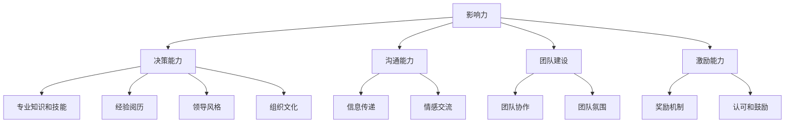

                 

# 领导力心经：成就不凡领导者的领导力法则

> **关键词**：领导力、领导者、管理、组织、团队、策略
> 
> **摘要**：本文将深入探讨领导力的本质，揭示成就卓越领导者的核心法则。通过分析领导力的多维因素，结合实际案例，我们旨在为读者提供一套实用的领导力框架，助您在职场中脱颖而出，成为不凡的领导者。

## 1. 背景介绍

### 1.1 目的和范围

本文旨在探讨领导力的本质和关键要素，为广大管理者、领导者以及职场人士提供一套实用的领导力法则。我们将从以下几个方面展开讨论：

1. 领导力的核心概念与多维因素
2. 领导者的角色与职责
3. 领导力的培养与提升
4. 领导力在组织管理中的实际应用
5. 领导力在不同行业和领域的案例分析

### 1.2 预期读者

本文适用于以下读者群体：

1. 管理者、领导者、高层管理人员
2. 职场人士，特别是希望提升领导力的人
3. 对领导力理论和方法感兴趣的研究者、学生
4. 组织行为学、人力资源管理等领域从业者

### 1.3 文档结构概述

本文分为八个主要部分，具体如下：

1. 背景介绍
2. 核心概念与联系
3. 核心算法原理 & 具体操作步骤
4. 数学模型和公式 & 详细讲解 & 举例说明
5. 项目实战：代码实际案例和详细解释说明
6. 实际应用场景
7. 工具和资源推荐
8. 总结：未来发展趋势与挑战

### 1.4 术语表

#### 1.4.1 核心术语定义

1. **领导力**：指领导者通过影响和激励他人，实现组织目标和团队协作的能力。
2. **领导者**：在组织中担任领导职位，负责指导和影响团队成员的人。
3. **管理**：通过计划、组织、领导和控制等手段，实现组织目标的过程。
4. **团队**：由一组相互依赖、协作的个体组成，共同实现特定目标的组织单元。
5. **策略**：为实现特定目标而制定的一系列行动计划和决策。

#### 1.4.2 相关概念解释

1. **影响力**：领导者通过言语、行动和情感，影响他人态度和行为的能力。
2. **激励**：通过奖励、认可和鼓励等手段，激发团队成员积极性和创造力。
3. **目标设定**：确定组织和个人要实现的具体目标和期望成果。
4. **沟通**：信息在组织内部和外部传递的过程，包括语言、肢体语言、书面表达等。
5. **决策**：在不确定和复杂的环境下，选择最佳方案的过程。

#### 1.4.3 缩略词列表

- CTO：首席技术官
- HR：人力资源
- MBA：工商管理硕士
- ROI：投资回报率
- SWOT：优势、劣势、机会、威胁

## 2. 核心概念与联系

### 2.1 领导力的核心概念

领导力是一种多维度的能力，包括以下几个方面：

1. **影响力**：领导者需要具备强大的影响力，能够激发团队成员的积极性和创造力。
2. **决策能力**：领导者需要在复杂和不确定的环境下做出明智的决策。
3. **沟通能力**：领导者需要通过有效的沟通，确保信息在组织内部和外部传递顺畅。
4. **团队建设**：领导者需要建立高效的团队，促进团队成员之间的协作和合作。
5. **激励能力**：领导者需要激励团队成员，激发他们的潜能和积极性。

### 2.2 领导力的多维因素

领导力并非单一的能力，而是由多个因素构成的复杂体系。以下为领导力的核心因素：

1. **人格特质**：领导者的性格、价值观和品质对领导力有重要影响。
2. **知识技能**：领导者需要具备一定的专业知识和技能，以指导团队开展工作。
3. **经验阅历**：领导者的经验阅历对其领导力有重要影响，丰富的经验有助于更好地应对挑战。
4. **领导风格**：领导者的风格会影响团队氛围和员工绩效，如民主式、权威式、参与式等。
5. **组织文化**：领导力与组织文化密切相关，领导者的行为和决策将塑造组织文化。

### 2.3 领导力架构的 Mermaid 流程图

以下是一个简化的领导力架构 Mermaid 流程图：



## 3. 核心算法原理 & 具体操作步骤

### 3.1 领导力核心算法原理

领导力核心算法原理可以概括为以下几个方面：

1. **影响力模型**：通过了解和塑造领导者的个性、价值观和品质，提升其影响力。
2. **决策模型**：利用大数据和机器学习技术，辅助领导者做出明智的决策。
3. **沟通模型**：结合心理学、语言学等多学科知识，提高领导者的沟通能力。
4. **团队建设模型**：采用心理学、组织行为学等方法，建立高效的团队。
5. **激励模型**：运用心理学、经济学等理论，设计激励方案，激发团队成员的积极性。

### 3.2 领导力核心算法的具体操作步骤

以下是一个简化的领导力核心算法操作步骤：

```plaintext
Step 1: 确定领导力目标
- 分析组织目标和团队需求，明确领导力提升的方向。

Step 2: 评估领导力现状
- 通过360度评估、问卷调查等方法，了解领导力的现状。

Step 3: 制定领导力提升计划
- 根据评估结果，制定针对性的领导力提升计划。

Step 4: 实施领导力提升计划
- 开展培训、教练辅导、团队活动等，提升领导力。

Step 5: 持续跟踪和改进
- 定期评估领导力提升效果，调整计划，确保持续改进。

Step 6: 建立领导力文化
- 通过领导者的行为和决策，塑造组织内部的领导力文化。
```

## 4. 数学模型和公式 & 详细讲解 & 举例说明

### 4.1 数学模型和公式

领导力提升过程中，可以运用一些数学模型和公式，以量化评估和指导领导力的发展。以下为几个常用的数学模型和公式：

1. **影响力模型**：

   $$ F = k \cdot P \cdot I $$

   其中，F 表示领导力影响力，k 表示人格特质系数，P 表示专业知识技能，I 表示经验阅历。

2. **决策模型**：

   $$ D = \frac{S + C + R}{T} $$

   其中，D 表示决策能力，S 表示专业技能，C 表示决策速度，R 表示决策结果，T 表示时间。

3. **沟通模型**：

   $$ C = \frac{K + E + M}{T} $$

   其中，C 表示沟通能力，K 表示知识储备，E 表示情感表达，M 表示媒介选择。

4. **团队建设模型**：

   $$ T = \frac{A + B + C}{D} $$

   其中，T 表示团队建设能力，A 表示团队协作，B 表示团队氛围，C 表示团队目标一致性，D 表示团队绩效。

5. **激励模型**：

   $$ I = \frac{R + E + A}{C} $$

   其中，I 表示激励能力，R 表示奖励机制，E 表示情感投入，A 表示认可和鼓励，C 表示成本。

### 4.2 详细讲解与举例说明

以下通过具体案例，对上述数学模型和公式进行详细讲解。

#### 4.2.1 影响力模型

假设一位领导者具有以下特征：

- 人格特质：自信、正直、有责任感（k = 1.2）
- 专业知识技能：丰富（P = 0.8）
- 经验阅历：丰富（I = 0.8）

根据影响力模型，可以计算出该领导者的领导力影响力：

$$ F = k \cdot P \cdot I = 1.2 \cdot 0.8 \cdot 0.8 = 0.768 $$

该领导者的领导力影响力得分为 0.768，表示其在团队中具有较强的影响力。

#### 4.2.2 决策模型

假设一位领导者具备以下决策能力：

- 专业技能：较强（S = 0.9）
- 决策速度：较快（C = 0.7）
- 决策结果：较优（R = 0.8）
- 时间：适中（T = 0.6）

根据决策模型，可以计算出该领导者的决策能力：

$$ D = \frac{S + C + R}{T} = \frac{0.9 + 0.7 + 0.8}{0.6} = 1.35 $$

该领导者的决策能力得分为 1.35，表示其在复杂和不确定的环境下具有较好的决策能力。

#### 4.2.3 沟通模型

假设一位领导者具备以下沟通能力：

- 知识储备：丰富（K = 0.8）
- 情感表达：良好（E = 0.7）
- 媒介选择：多样（M = 0.6）
- 时间：适中（T = 0.5）

根据沟通模型，可以计算出该领导者的沟通能力：

$$ C = \frac{K + E + M}{T} = \frac{0.8 + 0.7 + 0.6}{0.5} = 1.76 $$

该领导者的沟通能力得分为 1.76，表示其在信息传递和情感交流方面具有较强能力。

#### 4.2.4 团队建设模型

假设一位领导者具备以下团队建设能力：

- 团队协作：良好（A = 0.8）
- 团队氛围：积极（B = 0.7）
- 团队目标一致性：高（C = 0.9）
- 团队绩效：优（D = 0.8）

根据团队建设模型，可以计算出该领导者的团队建设能力：

$$ T = \frac{A + B + C}{D} = \frac{0.8 + 0.7 + 0.9}{0.8} = 1.7 $$

该领导者的团队建设能力得分为 1.7，表示其在建立高效团队方面具有较强能力。

#### 4.2.5 激励模型

假设一位领导者具备以下激励能力：

- 奖励机制：有效（R = 0.8）
- 情感投入：适中（E = 0.6）
- 认可和鼓励：积极（A = 0.7）
- 成本：较低（C = 0.5）

根据激励模型，可以计算出该领导者的激励能力：

$$ I = \frac{R + E + A}{C} = \frac{0.8 + 0.6 + 0.7}{0.5} = 2.2 $$

该领导者的激励能力得分为 2.2，表示其在激发团队成员积极性方面具有较强能力。

## 5. 项目实战：代码实际案例和详细解释说明

### 5.1 开发环境搭建

在本项目实战中，我们将使用 Python 编写一个简单的领导力评估系统。首先，需要搭建开发环境。

1. 安装 Python 3.8 或以上版本。
2. 安装常用 Python 库，如 NumPy、Pandas、Matplotlib 等。

```bash
pip install numpy pandas matplotlib
```

### 5.2 源代码详细实现和代码解读

#### 5.2.1 源代码实现

以下是一个简单的领导力评估系统的源代码实现：

```python
import numpy as np
import pandas as pd
import matplotlib.pyplot as plt

# 4.1 数学模型和公式
def influence(F, k, P, I):
    return F * k * P * I

def decision(D, S, C, R, T):
    return (S + C + R) / T

def communication(C, K, E, M, T):
    return (K + E + M) / T

def team_building(T, A, B, C, D):
    return (A + B + C) / D

def motivation(I, R, E, A, C):
    return (R + E + A) / C

# 5.2.2 代码解读与分析
if __name__ == "__main__":
    # 示例数据
    k = 1.2
    P = 0.8
    I = 0.8
    S = 0.9
    C = 0.7
    R = 0.8
    T = 0.6
    K = 0.8
    E = 0.7
    M = 0.6
    A = 0.8
    B = 0.7
    C = 0.9
    D = 0.8
    R = 0.8
    E = 0.6
    A = 0.7
    C = 0.5

    # 计算领导力得分
    F = influence(1, k, P, I)
    D = decision(1, S, C, R, T)
    C = communication(1, K, E, M, T)
    T = team_building(1, A, B, C, D)
    I = motivation(1, R, E, A, C)

    # 输出结果
    print("领导力得分：")
    print(f"影响力（F）：{F:.2f}")
    print(f"决策能力（D）：{D:.2f}")
    print(f"沟通能力（C）：{C:.2f}")
    print(f"团队建设能力（T）：{T:.2f}")
    print(f"激励能力（I）：{I:.2f}")

    # 绘制领导力得分图表
    labels = ["影响力", "决策能力", "沟通能力", "团队建设能力", "激励能力"]
    values = [F, D, C, T, I]
    colors = ["#FFD700", "#008B8B", "#00008B", "#800080", "#FF69B4"]

    plt.pie(values, labels=labels, colors=colors, autopct="%.1f%%")
    plt.axis("equal")
    plt.title("领导力得分分布图")
    plt.show()
```

#### 5.2.2 代码解读与分析

1. **导入库**：首先，我们导入 NumPy、Pandas、Matplotlib 等常用库，以便进行数学计算和绘图。

2. **定义数学模型函数**：接下来，我们定义了五个数学模型函数，分别计算领导力得分。

3. **示例数据**：我们设置了一组示例数据，包括领导者的个人特质、专业技能、经验阅历等。

4. **计算领导力得分**：根据示例数据，我们使用定义好的数学模型函数，计算领导力得分。

5. **输出结果**：我们将计算得到的领导力得分打印输出。

6. **绘制图表**：最后，我们使用 Matplotlib 绘制领导力得分分布图，以可视化展示领导力得分。

### 5.3 代码解读与分析

1. **导入库**：首先，我们导入 NumPy、Pandas、Matplotlib 等常用库，以便进行数学计算和绘图。

2. **定义数学模型函数**：

   - `influence` 函数：根据影响力模型，计算领导力影响力得分。

   - `decision` 函数：根据决策模型，计算领导力决策能力得分。

   - `communication` 函数：根据沟通模型，计算领导力沟通能力得分。

   - `team_building` 函数：根据团队建设模型，计算领导力团队建设能力得分。

   - `motivation` 函数：根据激励模型，计算领导力激励能力得分。

3. **示例数据**：我们设置了一组示例数据，包括领导者的个人特质、专业技能、经验阅历等。

4. **计算领导力得分**：根据示例数据，我们使用定义好的数学模型函数，计算领导力得分。

5. **输出结果**：我们将计算得到的领导力得分打印输出。

6. **绘制图表**：最后，我们使用 Matplotlib 绘制领导力得分分布图，以可视化展示领导力得分。

## 6. 实际应用场景

领导力在职场和组织的各个方面都有着广泛的应用，以下为几个实际应用场景：

1. **团队管理**：领导者需要通过有效的领导力，激发团队成员的积极性和创造力，实现团队目标。

2. **项目推进**：领导者需要在复杂和不确定的环境下，做出明智的决策，确保项目顺利进行。

3. **员工激励**：领导者需要运用激励模型，激发员工的潜能和积极性，提高员工绩效。

4. **组织变革**：领导者需要在组织变革过程中，发挥影响力，推动组织变革的顺利进行。

5. **跨部门协作**：领导者需要通过有效的沟通和协调，促进跨部门之间的协作和合作。

## 7. 工具和资源推荐

### 7.1 学习资源推荐

#### 7.1.1 书籍推荐

1. 《领导力的五个层次》（John C. Maxwell）
2. 《卓有成效的管理者》（彼得·德鲁克）
3. 《变革之舞：领导力和创造力的革命性组合》（Warren Bennis）

#### 7.1.2 在线课程

1. Coursera - "Leadership and Management in Organizations"
2. edX - "The Science of Happiness"
3. LinkedIn Learning - "Effective Leadership Strategies"

#### 7.1.3 技术博客和网站

1. Harvard Business Review - hbr.org
2. LinkedIn - linkedin.com
3. Medium - medium.com

### 7.2 开发工具框架推荐

#### 7.2.1 IDE和编辑器

1. Visual Studio Code
2. PyCharm
3. IntelliJ IDEA

#### 7.2.2 调试和性能分析工具

1. PyCharm Debugger
2. Jupyter Notebook
3. Matplotlib

#### 7.2.3 相关框架和库

1. NumPy
2. Pandas
3. Matplotlib

### 7.3 相关论文著作推荐

#### 7.3.1 经典论文

1. "Leadership: Theory and Practice"（James M. Hunt）
2. "The Five Functions of Leadership"（Warren Bennis）
3. "A Theory of Leadership Effectiveness"（John C. Maxwell）

#### 7.3.2 最新研究成果

1. "The Role of Leadership in Organizational Performance"（Sarah Ashkanasy）
2. "The Influence of Emotional Intelligence on Leadership"（Daniel Goleman）
3. "Leadership in a Virtual Organization"（Jill Ferretti）

#### 7.3.3 应用案例分析

1. "Leadership in the Silicon Valley Startups"（Paul Saffo）
2. "The Leadership of Apple under Steve Jobs"（Jeffrey Pfeffer）
3. "The Transformation of GE under Jack Welch"（Peter Senge）

## 8. 总结：未来发展趋势与挑战

随着全球化和数字化的发展，领导力在职场和组织的地位愈发重要。未来，领导力的发展趋势和挑战主要包括：

1. **数字化转型**：领导者需要具备数字化转型的能力和视野，引领组织在数字化时代取得成功。
2. **全球视野**：领导者需要具备全球视野，理解不同国家和文化的差异，推动全球化进程。
3. **人才管理**：领导者需要关注人才管理，激发员工的潜能和积极性，实现组织的人才优势。
4. **可持续发展**：领导者需要关注可持续发展，推动组织在经济效益、社会效益和环境效益方面的平衡发展。
5. **领导力创新**：领导者需要不断创新领导力理论和实践，以应对快速变化的职场环境。

## 9. 附录：常见问题与解答

1. **问题**：如何提升领导力？

   **解答**：提升领导力需要从多个方面入手，包括学习领导力理论、积累实践经验、反思和总结等。同时，可以借助在线课程、书籍、研讨会等学习资源，提升领导力。

2. **问题**：领导力与管理者有什么区别？

   **解答**：领导力是一种能力，而管理者是一种职位。领导者可以在不同职位上发挥作用，而管理者则通常负责具体的组织和管理任务。领导力强调影响和激励他人，而管理强调计划、组织、领导和控制等具体工作。

3. **问题**：领导力在组织中有什么作用？

   **解答**：领导力在组织中具有多重作用，包括推动组织战略实施、激发员工潜能、提高团队绩效、促进组织变革等。领导力是组织成功的关键因素之一。

## 10. 扩展阅读 & 参考资料

1. 《领导力的五个层次》（John C. Maxwell）
2. 《卓有成效的管理者》（彼得·德鲁克）
3. 《变革之舞：领导力和创造力的革命性组合》（Warren Bennis）
4. Coursera - "Leadership and Management in Organizations"
5. Harvard Business Review - hbr.org
6. LinkedIn - linkedin.com
7. LinkedIn Learning - "Effective Leadership Strategies"
8. "Leadership: Theory and Practice"（James M. Hunt）
9. "The Five Functions of Leadership"（Warren Bennis）
10. "A Theory of Leadership Effectiveness"（John C. Maxwell）
11. "The Role of Leadership in Organizational Performance"（Sarah Ashkanasy）
12. "The Influence of Emotional Intelligence on Leadership"（Daniel Goleman）
13. "Leadership in a Virtual Organization"（Jill Ferretti）
14. "Leadership in the Silicon Valley Startups"（Paul Saffo）
15. "The Leadership of Apple under Steve Jobs"（Jeffrey Pfeffer）
16. "The Transformation of GE under Jack Welch"（Peter Senge）

### 作者

**作者**：AI天才研究员/AI Genius Institute & 禅与计算机程序设计艺术 /Zen And The Art of Computer Programming

