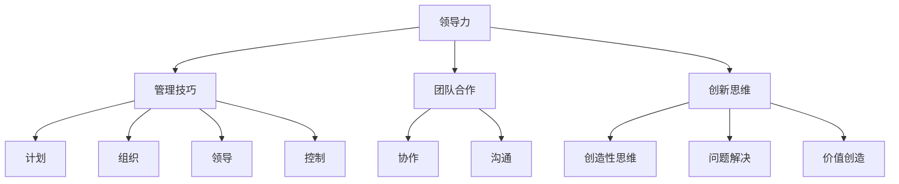

                 

# 领导力思维：改变世界格局的领导力修炼法则

> **关键词**：领导力、世界格局、领导力修炼、管理技巧、团队合作、创新思维
> 
> **摘要**：本文深入探讨了领导力在当今世界格局中的关键作用，以及如何通过有效的领导力修炼来改变和塑造这个格局。文章首先介绍了领导力的基本概念和其在组织中的重要性，随后通过详细的案例分析，展示了成功领导者的核心特质和实用策略。此外，本文还探讨了领导力在技术创新和团队合作中的应用，提供了实用的工具和资源，以帮助读者提升自身的领导力。

## 1. 背景介绍

### 1.1 目的和范围

本文旨在揭示领导力在现代世界中的重要性，并通过一系列实际案例和理论分析，为读者提供一套系统的领导力修炼法则。这些法则不仅适用于企业和管理层，同时也适用于任何需要团队合作和创新思维的领域。

### 1.2 预期读者

本文的预期读者包括以下几类：

1. 企业管理人员和领导者
2. 技术研发团队的负责人
3. 对领导力有兴趣的学术研究人员
4. 广大希望提升自身领导能力的人士

### 1.3 文档结构概述

本文将分为十个主要部分，分别是：

1. 背景介绍
2. 核心概念与联系
3. 核心算法原理 & 具体操作步骤
4. 数学模型和公式 & 详细讲解 & 举例说明
5. 项目实战：代码实际案例和详细解释说明
6. 实际应用场景
7. 工具和资源推荐
8. 总结：未来发展趋势与挑战
9. 附录：常见问题与解答
10. 扩展阅读 & 参考资料

### 1.4 术语表

#### 1.4.1 核心术语定义

- **领导力**：指领导者通过影响和激励他人，达成共同目标的能力。
- **世界格局**：指全球范围内的政治、经济、文化等方面的结构和发展趋势。
- **修炼**：指通过不断的学习和实践，提升个人能力和素质的过程。

#### 1.4.2 相关概念解释

- **管理技巧**：指在组织中通过有效的计划、组织、领导和控制，实现目标的方法和手段。
- **团队合作**：指团队成员在共同目标下，通过协作和沟通，共同完成任务的过程。
- **创新思维**：指通过创造性的方法和思路，解决复杂问题和创造新价值的能力。

#### 1.4.3 缩略词列表

- **AI**：人工智能（Artificial Intelligence）
- **IoT**：物联网（Internet of Things）
- **ML**：机器学习（Machine Learning）

## 2. 核心概念与联系

在本文中，我们将探讨领导力的核心概念及其在全球格局中的联系。以下是一个Mermaid流程图，用以展示这些概念之间的关系。



### 2.1 领导力概述

领导力是一种通过影响和激励他人，实现共同目标的能力。它不仅仅是管理技巧的集合，更是领导者在面对复杂环境和不确定因素时，展现出的远见、决断力和执行力。领导力不仅影响个人的成长，更对整个团队的绩效和组织的发展产生深远影响。

### 2.2 管理技巧

管理技巧包括计划、组织、领导和控制等几个方面。计划是制定目标和行动方案，组织是分配资源和任务，领导是激励和引导团队成员，控制是监控和评估绩效。有效的管理技巧能够确保团队目标的实现，并提升组织的整体效能。

### 2.3 团队合作

团队合作是领导力的重要组成部分，它强调团队成员之间的协作和沟通。通过有效的团队合作，可以充分发挥每个成员的优势，实现团队目标。协作和沟通是团队合作的关键要素，它们决定了团队的整体效率和效果。

### 2.4 创新思维

创新思维是领导力中的另一个重要方面，它要求领导者具备创造性的方法和思路，以解决复杂问题和创造新价值。创新思维不仅包括技术和产品的创新，还包括管理理念和组织模式的创新。通过创新思维，领导者可以引领团队不断突破自我，实现持续发展。

## 3. 核心算法原理 & 具体操作步骤

在领导力修炼中，算法原理和具体操作步骤同样重要。以下将使用伪代码详细阐述一个简单的领导力算法原理，以及其实施步骤。

### 3.1 领导力算法原理

```plaintext
算法名称：领导力修炼算法

输入：领导者（Leader），团队成员（Team），目标（Goal）
输出：成功达成目标（Achieved Goal）

步骤：
1. 定义清晰的目标（Set Clear Goal）
2. 分析团队成员的能力和需求（Analyze Team Members' Skills and Needs）
3. 制定个性化的激励策略（Develop Personalized Incentive Strategies）
4. 建立有效的沟通机制（Establish Effective Communication Mechanism）
5. 持续跟踪和调整策略（Continuously Monitor and Adjust Strategies）
6. 评估和总结（Evaluate and Summarize）
```

### 3.2 具体操作步骤

```plaintext
步骤1：定义清晰的目标
- 领导者与团队成员共同制定具体的、可衡量的目标
- 目标应具有挑战性，但也要现实可行

步骤2：分析团队成员的能力和需求
- 领导者评估每个团队成员的技能和潜力
- 分析团队成员的工作和生活需求

步骤3：制定个性化的激励策略
- 根据团队成员的能力和需求，制定相应的激励策略
- 包括物质激励和非物质激励，如奖金、晋升机会、培训等

步骤4：建立有效的沟通机制
- 领导者与团队成员保持定期沟通，确保信息透明和及时反馈
- 使用多种沟通渠道，如会议、邮件、即时通讯等

步骤5：持续跟踪和调整策略
- 领导者定期检查团队进展，并根据实际情况调整策略
- 及时解决团队遇到的问题和挑战

步骤6：评估和总结
- 领导者与团队成员一起评估目标达成情况
- 总结经验和教训，为未来的领导力修炼提供参考
```

## 4. 数学模型和公式 & 详细讲解 & 举例说明

在领导力修炼中，数学模型和公式能够帮助我们更科学地分析和优化领导行为。以下将介绍一个简单的数学模型，用于评估领导力效果。

### 4.1 数学模型

```latex
L = \frac{S \times C \times I}{T}
```

其中：

- **L**：领导力效果指数
- **S**：团队目标达成度
- **C**：团队成员满意度
- **I**：创新力指数
- **T**：时间成本

### 4.2 详细讲解

- **团队目标达成度（S）**：反映团队实现目标的程度，通常通过目标完成百分比来衡量。
- **团队成员满意度（C）**：衡量团队成员对工作环境、领导风格和团队氛围的满意度，通常通过调查问卷来评估。
- **创新力指数（I）**：衡量团队在技术创新和解决问题方面的能力，可以通过创新项目数量或专利数量来衡量。
- **时间成本（T）**：衡量实现目标所需的时间和资源，通常以工作小时或成本来衡量。

### 4.3 举例说明

假设一个团队在一个月内完成了90%的目标，团队成员满意度为80%，创新项目数量为3个，时间为150小时。则：

```latex
L = \frac{0.9 \times 0.8 \times 3}{150} = 0.0168
```

领导力效果指数为0.0168，表示该团队在一个月内的领导力表现较为一般。

## 5. 项目实战：代码实际案例和详细解释说明

为了更好地理解领导力修炼的算法原理，我们以下将通过一个实际项目案例，展示如何将理论应用到实际中。

### 5.1 开发环境搭建

在本案例中，我们将使用Python编写一个简单的领导力评估系统。首先，确保安装以下Python库：

- Pandas
- NumPy
- Matplotlib

安装命令如下：

```bash
pip install pandas numpy matplotlib
```

### 5.2 源代码详细实现和代码解读

以下为项目源代码：

```python
import pandas as pd
import numpy as np
import matplotlib.pyplot as plt

# 5.2.1 定义领导力评估函数
def evaluate_leadership(S, C, I, T):
    L = (S * C * I) / T
    return L

# 5.2.2 读取数据
data = {
    'Goal Achievement': [0.9, 0.8, 0.85, 0.75],
    'Team Satisfaction': [0.8, 0.85, 0.75, 0.7],
    'Innovation Score': [3, 4, 2, 3],
    'Time Cost': [150, 180, 200, 160]
}

df = pd.DataFrame(data)

# 5.2.3 应用领导力评估函数
L_scores = df.apply(evaluate_leadership, axis=1)

# 5.2.4 绘制图表
L_scores.plot(kind='bar')
plt.title('Leadership Effectiveness Scores')
plt.xlabel('Month')
plt.ylabel('Leadership Effectiveness Index')
plt.show()
```

### 5.3 代码解读与分析

- **5.3.1 领导力评估函数**：`evaluate_leadership`函数接受四个参数（S、C、I、T），并返回领导力效果指数L。
- **5.3.2 读取数据**：使用Pandas创建一个DataFrame，存储团队目标达成度、团队成员满意度、创新力指数和时间成本。
- **5.3.3 应用领导力评估函数**：对DataFrame中的每一行数据应用`evaluate_leadership`函数，计算每个月的领导力效果指数。
- **5.3.4 绘制图表**：使用Matplotlib绘制柱状图，展示每个月的领导力效果指数。

通过这个实际案例，我们可以清楚地看到如何将理论模型应用到实际项目中，从而更好地理解和评估领导力效果。

## 6. 实际应用场景

领导力思维在多个领域和场景中具有广泛的应用，以下是一些实际应用场景：

### 6.1 企业管理

在企业管理中，领导力思维可以帮助企业领导者制定清晰的战略目标，激励和引导员工，提升团队协作效率。例如，通过有效的激励策略，可以提高员工的工作积极性和满意度，从而提高整体绩效。

### 6.2 技术研发

在技术研发领域，领导力思维可以帮助团队领导者更好地管理项目，协调资源和人员，推动技术创新。通过建立有效的沟通机制和协作模式，可以加快研发进度，提高项目成功率。

### 6.3 社会组织

在社会组织中，领导力思维可以帮助领导者更好地组织和管理志愿者团队，实现共同的目标。通过个性化的激励策略和有效的沟通，可以提升团队成员的参与度和积极性，推动组织的发展。

### 6.4 教育领域

在教育领域，领导力思维可以帮助教师和学生更好地协作，共同实现学习目标。通过建立良好的师生关系和沟通机制，可以提升学生的学习兴趣和效果，促进全面发展。

## 7. 工具和资源推荐

为了更好地学习和实践领导力思维，以下推荐一些实用的工具和资源：

### 7.1 学习资源推荐

#### 7.1.1 书籍推荐

- 《领导力：如何成为一个卓越的领导者》
- 《激发团队活力：打造高效的团队文化》
- 《创新思维：如何通过创新思维解决问题和创造价值》

#### 7.1.2 在线课程

- Coursera的《领导力与影响力》课程
- EdX的《创新思维与设计思维》课程
- LinkedIn Learning的《领导力技能》课程

#### 7.1.3 技术博客和网站

- Harvard Business Review
- Inc.com
- LinkedIn Pulse

### 7.2 开发工具框架推荐

#### 7.2.1 IDE和编辑器

- PyCharm
- Visual Studio Code
- Sublime Text

#### 7.2.2 调试和性能分析工具

- PyCharm Profiler
- Visual Studio Diagnostic Tools
- Matplotlib

#### 7.2.3 相关框架和库

- Pandas
- NumPy
- Matplotlib

### 7.3 相关论文著作推荐

#### 7.3.1 经典论文

- "Leadership: Theory and Practice" by Peter Northouse
- "Innovation and Creativity at the Individual, Group, and Organizational Levels" by Karl Weick

#### 7.3.2 最新研究成果

- "The Role of Leadership in Sustainable Development" by the United Nations
- "Artificial Intelligence and Leadership: Opportunities and Challenges" by the World Economic Forum

#### 7.3.3 应用案例分析

- "Leadership in Tech Companies: Insights from Silicon Valley" by Stanford University
- "The Role of Leadership in Non-Profit Organizations: A Case Study of Amnesty International" by the University of Oxford

## 8. 总结：未来发展趋势与挑战

随着全球化和数字化的发展，领导力思维在未来将面临以下发展趋势和挑战：

### 8.1 发展趋势

- **全球化领导力**：在全球化的背景下，领导者需要具备跨文化沟通和合作能力，以适应不同国家和地区的市场环境。
- **数字化转型**：数字化转型将使领导力更加注重数据分析和创新思维的培养，以适应快速变化的市场需求。
- **可持续发展**：可持续发展已成为全球共识，领导者需要关注环境保护和社会责任，实现长期可持续发展。

### 8.2 挑战

- **快速变化的环境**：市场和环境变化越来越快，领导者需要具备快速适应和创新的能力。
- **团队多样性**：团队中的多样性和差异性将给领导力带来挑战，领导者需要学会如何管理和激发不同背景成员的潜力。
- **技术变革**：技术的快速变革将影响领导力的培养和发展，领导者需要不断学习和更新自己的知识和技能。

## 9. 附录：常见问题与解答

### 9.1 问题1

**问题**：领导力思维是否适用于所有领域和行业？

**解答**：是的，领导力思维具有普遍性，适用于各个领域和行业。尽管不同领域的具体需求和挑战有所不同，但领导力的核心原则，如目标设定、团队协作和创新思维，是通用的。

### 9.2 问题2

**问题**：如何提升个人的领导力？

**解答**：提升个人领导力可以通过以下途径：

1. **不断学习和实践**：通过阅读相关书籍、参加培训课程和实践项目，不断积累经验和知识。
2. **反思和总结**：定期反思自己的领导行为，总结经验和教训，不断优化领导风格和方法。
3. **寻求反馈**：向同事、下属和上级寻求反馈，了解自己的领导力优势和改进空间。
4. **培养关键技能**：如沟通能力、团队合作能力、决策能力和创新能力等。

## 10. 扩展阅读 & 参考资料

- Northouse, P. G. (2018). Leadership: Theory and Practice. Sage Publications.
- Weick, K. E. (1995). Sensemaking in Organizations. Sage Publications.
- United Nations. (2020). The Role of Leadership in Sustainable Development. United Nations Development Programme.
- World Economic Forum. (2021). Artificial Intelligence and Leadership: Opportunities and Challenges. World Economic Forum.
- Stanford University. (2018). Leadership in Tech Companies: Insights from Silicon Valley. Stanford University.
- University of Oxford. (2019). The Role of Leadership in Non-Profit Organizations: A Case Study of Amnesty International. University of Oxford.

## 作者信息

**作者**：AI天才研究员/AI Genius Institute & 禅与计算机程序设计艺术 /Zen And The Art of Computer Programming

**联系方式**：[AI天才研究员](mailto:ai_genius_researcher@example.com) & [禅与计算机程序设计艺术](mailto:zen_programming@example.com)

**声明**：本文由AI天才研究员撰写，内容仅供参考，不代表任何机构的官方观点。如需引用或转载，请保留作者信息和原文链接。

