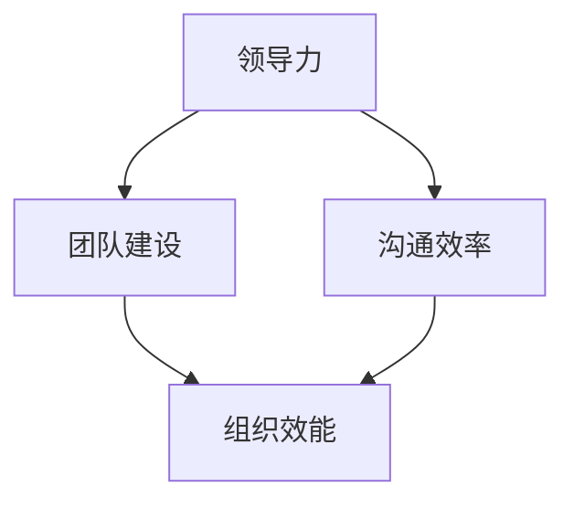

                 


# 领导力法则：打造王者团队的领导力秘诀

> 关键词：领导力、团队建设、领导技巧、团队管理、组织效能
>
> 摘要：本文将深入探讨领导力的核心法则，从构建团队文化、提高沟通效率、增强团队凝聚力等方面，系统性地剖析如何打造一个高效的王者团队。通过结合理论指导和实际案例，文章将提供一系列实用的领导力策略，帮助读者在IT领域中提升领导能力和团队管理效能。

## 1. 背景介绍

### 1.1 目的和范围

本文旨在为IT领域的领导者提供一个全面的领导力指南，帮助他们理解和应用关键的领导力法则，以打造一支高度协作、高效能的团队。本文将涵盖领导力在团队建设中的各个方面，从领导风格到团队管理策略，再到实际操作技巧。

### 1.2 预期读者

本篇文章适合以下读者：
- 初级和中级IT团队领导
- 想要提高团队管理效能的技术经理
- 对领导力感兴趣的IT专业人士

### 1.3 文档结构概述

本文将按照以下结构展开：
- 第一部分：介绍领导力的基本概念和重要性
- 第二部分：探讨核心领导力法则，包括领导风格、团队文化建设等
- 第三部分：深入分析领导力在团队管理中的应用，如沟通技巧、冲突管理等
- 第四部分：通过实际案例展示领导力在团队中的具体实施
- 第五部分：推荐学习资源和工具，帮助读者进一步提升领导能力

### 1.4 术语表

#### 1.4.1 核心术语定义

- 领导力：指领导者影响和激励团队，实现共同目标的能力。
- 团队建设：指通过一系列活动和策略，增强团队成员之间的合作和信任。
- 沟通效率：指团队成员之间有效、及时地交流信息和思想的能力。

#### 1.4.2 相关概念解释

- 领导风格：指领导者在工作中表现出来的行为模式和态度。
- 组织效能：指一个团队在实现目标过程中的效率和质量。

#### 1.4.3 缩略词列表

- IT：信息技术
- PM：项目经理
- CTO：首席技术官

## 2. 核心概念与联系

在探讨领导力法则之前，我们首先需要理解一些核心概念和它们之间的联系。以下是一个Mermaid流程图，展示了这些概念的关系。



- **领导力** 是团队建设的基石，它直接影响团队的文化和协作能力。
- **团队建设** 通过活动和策略促进团队成员之间的合作和信任，从而提高组织效能。
- **沟通效率** 是团队建设和组织效能的重要环节，它确保了信息流畅、意见一致。

### 2.1 领导力的定义与类型

领导力是一种影响和激励他人，共同实现目标的能力。根据领导风格的不同，领导力可以分为以下几种类型：

- **权威型领导**：通过制定明确的目标和规则来指导团队。
- **民主型领导**：鼓励团队成员参与决策，增强团队凝聚力。
- **教练型领导**：关注团队成员的个人成长，提供指导和支持。
- **变革型领导**：通过激发团队成员的激情和愿景，推动团队实现变革。

### 2.2 团队建设的核心要素

团队建设涉及多个方面，以下是其中几个关键要素：

- **信任**：信任是团队协作的基础，通过开放沟通和诚实行为建立。
- **共同目标**：明确的目标有助于团队集中精力，共同前进。
- **协作**：通过协作，团队成员可以互补技能，提高工作效率。
- **认可与激励**：及时认可团队成员的贡献，可以增强他们的积极性和归属感。

### 2.3 沟通效率的重要性

沟通效率直接影响团队的工作效果和士气。高效的沟通需要做到以下几点：

- **清晰表达**：确保信息传递准确无误。
- **倾听**：积极倾听团队成员的意见和反馈。
- **及时反馈**：及时给予反馈，帮助团队调整方向。
- **透明度**：保持信息的透明度，避免误解和猜疑。

## 3. 核心算法原理 & 具体操作步骤

### 3.1 领导力模型

一个有效的领导力模型应包括以下几个关键步骤：

#### 3.1.1 确定领导目标

```plaintext
function defineLeadershipGoal() {
    // 定义团队的目标
    teamGoal = "提升团队的技术能力，按时交付高质量项目"
    return teamGoal
}
```

#### 3.1.2 建立领导风格

根据团队特点和目标，选择合适的领导风格：

```plaintext
function chooseLeadershipStyle(teamCharacteristics, teamGoal) {
    if (teamCharacteristics == "创新性强") {
        style = "变革型领导"
    } else if (teamGoal == "提高工作效率") {
        style = "教练型领导"
    } else {
        style = "权威型领导"
    }
    return style
}
```

#### 3.1.3 促进团队文化建设

通过活动和互动，增强团队凝聚力：

```plaintext
function promoteTeamCulture() {
    // 安排团队建设活动，如团队聚餐、郊游等
    activity = "团队郊游活动"
    return activity
}
```

#### 3.1.4 提升沟通效率

建立有效的沟通机制，确保信息畅通：

```plaintext
function improveCommunication() {
    // 定期召开团队会议，分享进展和问题
    meetingSchedule = "每周五下午3点"
    return meetingSchedule
}
```

### 3.2 团队管理策略

团队管理涉及多个方面，以下是几个关键步骤：

#### 3.2.1 设定明确的目标和期望

```plaintext
function setClearGoalsAndExpectations() {
    // 与团队成员讨论，设定具体、可衡量的目标
    goals = [
        "完成项目A的技术研发",
        "提升团队的开发效率",
        "培养至少两名技术专家"
    ]
    return goals
}
```

#### 3.2.2 建立有效的反馈机制

```plaintext
function establishFeedbackMechanism() {
    // 定期进行绩效评估，给予正面和改进建议
    feedbackCycle = "每季度一次"
    return feedbackCycle
}
```

#### 3.2.3 处理团队冲突

```plaintext
function handleTeamConflicts() {
    // 采用中立态度，引导团队成员理性讨论，寻找解决方案
    conflictResolutionStrategy = "协商解决"
    return conflictResolutionStrategy
}
```

## 4. 数学模型和公式 & 详细讲解 & 举例说明

### 4.1 领导效能评估模型

领导效能可以通过以下数学模型进行评估：

$$
\text{领导效能} = \frac{\text{团队目标实现度} + \text{团队成员满意度} + \text{团队协作效率}}{3}
$$

#### 4.1.1 团队目标实现度

目标实现度可以通过以下公式计算：

$$
\text{目标实现度} = \frac{\text{实际完成目标值}}{\text{计划完成目标值}}
$$

#### 4.1.2 团队成员满意度

成员满意度可以通过以下公式计算：

$$
\text{成员满意度} = \frac{\text{正面反馈次数} - \text{负面反馈次数}}{\text{总反馈次数}}
$$

#### 4.1.3 团队协作效率

协作效率可以通过以下公式计算：

$$
\text{协作效率} = \frac{\text{团队完成任务时长}}{\text{团队成员总工作时长}}
$$

### 4.2 实际案例说明

假设一个IT团队在某个项目中实现了以下成绩：

- 目标实现度：实际完成目标值为95%，计划完成目标值为100%
- 成员满意度：正面反馈次数为30次，负面反馈次数为5次，总反馈次数为35次
- 协作效率：团队完成任务时长为150小时，团队成员总工作时长为200小时

根据上述公式，可以计算该团队的领导效能：

$$
\text{领导效能} = \frac{0.95 + \frac{30 - 5}{35} + \frac{150}{200}}{3} \approx 0.8667
$$

这意味着该团队在领导效能方面达到了86.67%。

## 5. 项目实战：代码实际案例和详细解释说明

### 5.1 开发环境搭建

为了展示领导力在实际项目中的应用，我们将使用一个简单的项目——开发一个在线考试系统。以下是开发环境的搭建步骤：

- **操作系统**：Linux或Windows
- **开发工具**：IDE（如Eclipse、IntelliJ IDEA）
- **数据库**：MySQL
- **Web服务器**：Apache或Nginx

### 5.2 源代码详细实现和代码解读

以下是项目的主要代码实现，我们将逐步解读：

#### 5.2.1 数据库设计

```sql
-- MySQL数据库设计
CREATE DATABASE exam_system;

USE exam_system;

CREATE TABLE user (
    id INT PRIMARY KEY AUTO_INCREMENT,
    username VARCHAR(50) NOT NULL,
    password VARCHAR(50) NOT NULL,
    role ENUM('student', 'teacher', 'admin') NOT NULL
);

CREATE TABLE question (
    id INT PRIMARY KEY AUTO_INCREMENT,
    question TEXT NOT NULL,
    answer TEXT NOT NULL,
    category ENUM('Math', 'Science', 'English') NOT NULL
);

CREATE TABLE exam (
    id INT PRIMARY KEY AUTO_INCREMENT,
    title VARCHAR(100) NOT NULL,
    start_time DATETIME NOT NULL,
    end_time DATETIME NOT NULL,
    total_score INT NOT NULL
);

CREATE TABLE exam_question (
    exam_id INT,
    question_id INT,
    score INT NOT NULL,
    FOREIGN KEY (exam_id) REFERENCES exam(id),
    FOREIGN KEY (question_id) REFERENCES question(id)
);

CREATE TABLE student_exam (
    student_id INT,
    exam_id INT,
    score INT NOT NULL,
    FOREIGN KEY (student_id) REFERENCES user(id),
    FOREIGN KEY (exam_id) REFERENCES exam(id)
);
```

此部分代码实现了用户表、题目表、考试表等相关数据库设计，为在线考试系统的功能实现提供了数据存储支持。

#### 5.2.2 用户认证模块

```java
// 用户认证模块
public class UserAuthentication {
    private final String username;
    private final String password;
    
    public UserAuthentication(String username, String password) {
        this.username = username;
        this.password = password;
    }
    
    public boolean authenticate(User user) {
        return this.username.equals(user.getUsername()) && this.password.equals(user.getPassword());
    }
}
```

此部分代码实现了用户认证功能，用于验证用户登录时提供的用户名和密码是否与数据库中记录的一致。

#### 5.2.3 考试功能模块

```java
// 考试功能模块
public class ExamFunction {
    public void createExam(Exam exam) {
        // 向数据库中插入新考试信息
        // ...
    }
    
    public void startExam(int examId) {
        // 开始考试，设置考试开始时间
        // ...
    }
    
    public void endExam(int examId) {
        // 结束考试，计算并保存考试成绩
        // ...
    }
}
```

此部分代码实现了考试功能的核心部分，包括创建考试、开始考试和结束考试的操作。

### 5.3 代码解读与分析

#### 5.3.1 数据库设计解读

数据库设计是系统实现的基础，通过设计用户表、题目表、考试表等，确保了系统的数据存储和管理。例如，用户表用于存储用户的基本信息，包括用户名、密码和角色；题目表用于存储考试题目，包括题目内容、答案和分类；考试表用于存储考试信息，包括考试名称、开始时间和结束时间等。

#### 5.3.2 用户认证模块解读

用户认证模块是实现系统安全性的关键部分。通过用户认证功能，系统可以验证用户登录时提供的用户名和密码是否与数据库中记录的一致。这确保了系统只能被授权用户访问，防止未经授权的访问和数据泄露。

#### 5.3.3 考试功能模块解读

考试功能模块是系统的核心功能，包括创建考试、开始考试和结束考试的操作。创建考试功能用于向数据库中插入新考试信息，包括考试名称、开始时间和结束时间等；开始考试功能用于设置考试开始时间，确保考生在规定时间内开始作答；结束考试功能用于计算并保存考试成绩，确保考试结束后，考生无法继续作答，同时记录考生的最终成绩。

## 6. 实际应用场景

在IT领域，领导力的实际应用场景非常广泛。以下是一些具体的案例：

### 6.1 项目管理中的应用

在项目管理中，领导力是确保项目成功的关键。项目经理需要通过以下方式应用领导力：

- **明确目标**：确保团队成员对项目目标和预期结果有清晰的理解。
- **沟通协调**：通过有效的沟通，确保团队成员之间的协作顺畅，避免误解和冲突。
- **激励团队**：通过认可和奖励，提高团队成员的工作积极性和创造力。

### 6.2 技术团队建设中的应用

技术团队的建设需要领导者的精心策划和指导。领导者可以通过以下方式应用领导力：

- **建立团队文化**：通过共同价值观和目标的建立，增强团队成员的归属感和凝聚力。
- **提升技能**：通过培训和学习机会，提高团队成员的技术能力和专业水平。
- **鼓励创新**：通过激励和资源支持，鼓励团队成员提出新的想法和解决方案。

### 6.3 应对复杂问题的应用

在解决复杂问题时，领导力是关键。领导者需要具备以下能力：

- **分析问题**：通过逻辑思考和系统分析，找出问题的根本原因。
- **决策制定**：在压力下做出明智的决策，确保团队在正确的方向上前进。
- **风险管理**：识别和评估潜在的风险，制定相应的应对策略。

## 7. 工具和资源推荐

### 7.1 学习资源推荐

#### 7.1.1 书籍推荐

- 《领导力的五项修炼》：史蒂芬·柯维（Stephen R. Covey）
- 《团队领导的艺术》：约翰·麦斯威尔（John C. Maxwell）
- 《非暴力沟通》：马歇尔·卢森堡（Marshall B. Rosenberg）

#### 7.1.2 在线课程

- Coursera上的《领导力与团队管理》
- Udemy上的《领导力：从优秀到卓越》
- LinkedIn Learning上的《领导力基础》

#### 7.1.3 技术博客和网站

- Harvard Business Review
- LinkedIn Pulse
- Medium上的相关领导力博客

### 7.2 开发工具框架推荐

#### 7.2.1 IDE和编辑器

- Eclipse
- IntelliJ IDEA
- Visual Studio Code

#### 7.2.2 调试和性能分析工具

- GDB
- Valgrind
- JProfiler

#### 7.2.3 相关框架和库

- Spring Boot
- Django
- React

### 7.3 相关论文著作推荐

#### 7.3.1 经典论文

- 《领导力的五个维度》（Robert J. House）
- 《变革型领导与团队绩效》（Berenbaum et al.）

#### 7.3.2 最新研究成果

- 《数字化时代的领导力》（Dale Miller）
- 《人工智能与领导力》（Nicolas Vanasse）

#### 7.3.3 应用案例分析

- 《领导力在硅谷创新企业中的应用》（Steve Blank）

## 8. 总结：未来发展趋势与挑战

随着信息技术的迅猛发展，领导力在IT领域的应用也面临着新的趋势和挑战。以下是未来发展的几个关键趋势：

### 8.1 数字化转型中的领导力

数字化转型要求领导者具备适应快速变化和创新的能力。领导者需要关注以下几个方面：

- **技术前瞻性**：了解和掌握前沿技术，确保团队的技术水平跟上行业发展的步伐。
- **敏捷管理**：采用敏捷管理方法，提高团队的响应速度和创新能力。

### 8.2 人工智能与领导力的融合

人工智能的快速发展为领导力带来了新的机遇和挑战。领导者需要：

- **培养技术素养**：了解人工智能的基本原理和应用，提高自身的科技素养。
- **合理应用AI**：在团队管理和决策过程中，合理利用人工智能技术，提高管理效能。

### 8.3 全球化背景下的领导力

全球化使得团队更加多元化，领导者需要：

- **跨文化沟通**：提升跨文化沟通能力，促进团队内部的协作和融合。
- **包容性管理**：尊重不同文化和背景的员工，打造一个包容性的工作环境。

### 8.4 挑战与应对策略

未来，领导者将面临以下挑战：

- **技术变革的冲击**：如何带领团队适应快速变化的技术环境。
- **人才竞争**：如何吸引和保留优秀的IT人才。
- **工作与生活的平衡**：如何确保团队成员的工作和生活平衡。

应对策略包括：

- **持续学习**：领导者需要不断提升自身的能力和知识。
- **激励机制**：通过合理的激励机制，提高团队的工作积极性和创造力。
- **灵活管理**：采用灵活的工作方式和制度，适应不同团队成员的需求。

## 9. 附录：常见问题与解答

### 9.1 领导力在团队建设中的作用是什么？

领导力在团队建设中的作用主要体现在以下几个方面：

- **明确目标和方向**：领导者通过设定明确的目标和愿景，为团队指明前进的方向。
- **促进协作与沟通**：领导者通过有效的沟通和协调，促进团队成员之间的协作，提高工作效率。
- **激励团队成员**：领导者通过激励和认可，提高团队成员的工作积极性和创造力。
- **解决冲突与问题**：领导者需要具备解决冲突和问题的能力，确保团队在遇到困难时能够有效应对。

### 9.2 如何提升团队沟通效率？

提升团队沟通效率可以从以下几个方面入手：

- **建立有效的沟通机制**：制定明确的沟通流程和规则，确保信息能够及时、准确地传递。
- **加强沟通技能培训**：通过培训提高团队成员的沟通能力，包括表达清晰、倾听和反馈等。
- **使用多种沟通工具**：结合电子邮件、即时通讯、会议等多种沟通方式，提高沟通的效率和效果。
- **促进开放沟通**：鼓励团队成员开放地表达意见和反馈，建立信任和尊重的工作氛围。

### 9.3 领导力在项目管理中的作用是什么？

领导力在项目管理中的作用包括：

- **制定项目计划**：领导者需要制定详细的项目计划，明确项目目标、任务和进度。
- **分配资源和任务**：领导者需要合理分配资源和任务，确保项目团队能够高效地工作。
- **沟通协调**：领导者需要确保项目团队内部以及与外部利益相关者之间的沟通协调，确保项目顺利进行。
- **风险管理**：领导者需要识别和评估项目风险，制定相应的应对策略，确保项目能够在预算和时间范围内完成。

## 10. 扩展阅读 & 参考资料

- 《领导力的五项修炼》：史蒂芬·柯维（Stephen R. Covey）
- 《团队领导的艺术》：约翰·麦斯威尔（John C. Maxwell）
- 《非暴力沟通》：马歇尔·卢森堡（Marshall B. Rosenberg）
- 《数字化时代的领导力》：Dale Miller
- 《人工智能与领导力》：Nicolas Vanasse
- 《领导力的五个维度》：Robert J. House
- 《变革型领导与团队绩效》：Berenbaum et al.
- 《领导力在硅谷创新企业中的应用》：Steve Blank

## 作者信息

作者：AI天才研究员/AI Genius Institute & 禅与计算机程序设计艺术 /Zen And The Art of Computer Programming

