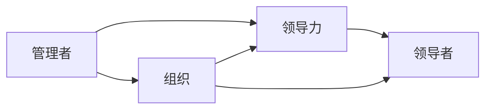
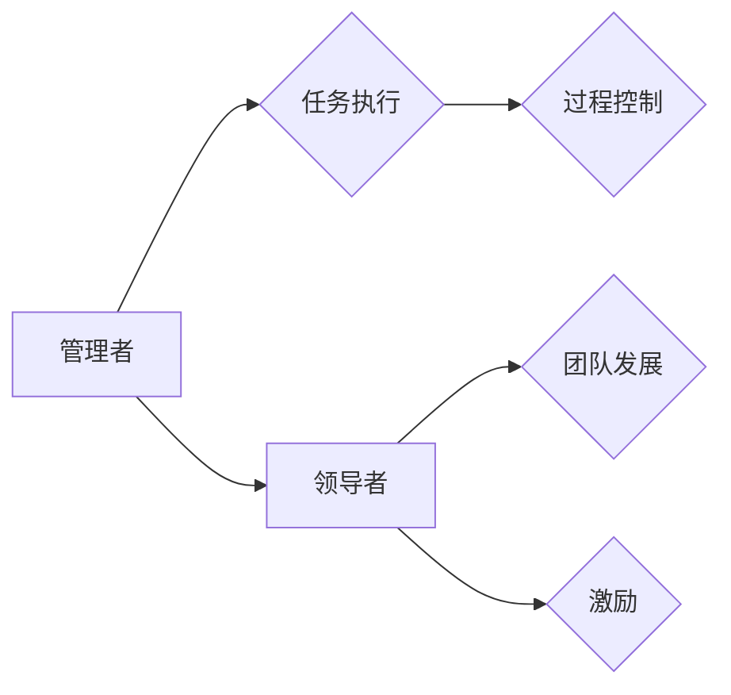
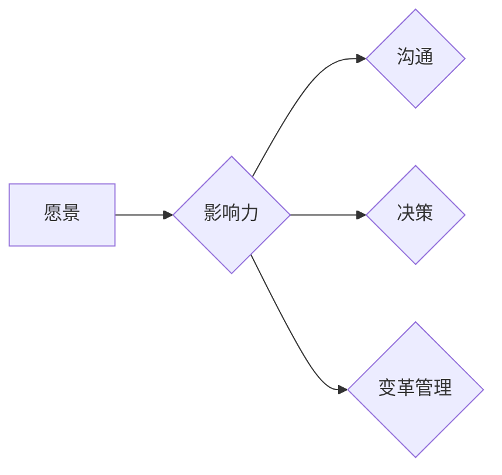

                 

# 领导力的进阶：从管理者到领导者的蜕变

> **关键词**：领导力、管理者、领导者、进阶、组织、团队、影响力

> **摘要**：本文旨在深入探讨领导力的本质及其从管理者向领导者的转变过程。我们将通过剖析管理者和领导者的差异，解析领导力的核心要素，并借助实际案例，为读者提供实用的进阶策略和路径。通过本文的阅读，读者将能够更好地理解领导力的精髓，并在实际工作中运用，从而提升个人和团队的效能。

## 1. 背景介绍

### 1.1 目的和范围

本文的目标是帮助读者理解领导力的关键要素，并提供具体的策略和方法，以实现从管理者到领导者的进阶。我们将涵盖领导力理论的基础，以及在实际工作中的应用，旨在为组织中的中高层管理人员提供实用的指导。

### 1.2 预期读者

本文适合以下读者群体：
- 组织中的中层管理人员
- 希望提升领导力的专业人士
- 对组织行为学和管理学有兴趣的学者

### 1.3 文档结构概述

本文的结构如下：

1. **背景介绍**：阐述本文的目的、预期读者和文档结构。
2. **核心概念与联系**：介绍领导力的核心概念及其相互关系，并使用Mermaid流程图展示。
3. **核心算法原理 & 具体操作步骤**：使用伪代码阐述领导力发展的算法原理和步骤。
4. **数学模型和公式 & 详细讲解 & 举例说明**：通过LaTeX格式介绍相关的数学模型和公式，并进行举例说明。
5. **项目实战：代码实际案例和详细解释说明**：提供实际的代码案例，详细解释其实现和解读。
6. **实际应用场景**：分析领导力在不同行业和领域的应用。
7. **工具和资源推荐**：推荐学习资源、开发工具和相关论文。
8. **总结：未来发展趋势与挑战**：讨论领导力的发展趋势和面临的挑战。
9. **附录：常见问题与解答**：提供关于领导力的常见问题解答。
10. **扩展阅读 & 参考资料**：推荐进一步的阅读材料和参考资料。

### 1.4 术语表

#### 1.4.1 核心术语定义

- **管理者**：负责计划、组织、指挥、协调和控制资源以实现组织目标的人。
- **领导者**：具有远见、洞察力和影响力，能够激发团队潜力和实现共同目标的人。
- **领导力**：影响和激励他人以实现共同目标的能力。

#### 1.4.2 相关概念解释

- **愿景**：领导者对组织未来状态的设想，是引导团队的方向标。
- **影响力**：领导者通过言行和决策影响他人态度和行为的能力。
- **组织文化**：组织成员共同遵循的价值观、信念和行为准则。

#### 1.4.3 缩略词列表

- **CEO**：首席执行官（Chief Executive Officer）
- **CFO**：首席财务官（Chief Financial Officer）
- **HR**：人力资源（Human Resources）

## 2. 核心概念与联系

在探讨领导力的进阶之前，我们需要理解几个核心概念，并展示它们之间的相互关系。以下是领导力、管理者和领导者之间关系的Mermaid流程图：



### 2.1 领导力与管理的区别

管理者和领导者的核心区别在于他们的关注点和能力。管理者主要关注任务和过程的执行，确保资源有效利用和目标达成。而领导者则更注重愿景、团队发展和激励。以下是一个简化的Mermaid流程图，展示了这两个角色之间的关系：



### 2.2 领导力的核心要素

领导力不仅仅是职位或角色的特权，而是一种能力。以下是领导力的几个核心要素：

1. **愿景**：领导者需要具备远见和洞察力，能够描绘组织未来的蓝图。
2. **影响力**：领导者通过言行和决策影响他人的能力，包括情感和理性层面。
3. **沟通**：领导者需要清晰、有效地沟通愿景和目标，以促进团队协作。
4. **决策**：领导者需要在不确定性和压力下做出明智的决策。
5. **变革管理**：领导者需要引导团队适应变化，并从中获得动力。

Mermaid流程图如下：



## 3. 核心算法原理 & 具体操作步骤

领导力的发展可以看作是一个算法过程，其目标是提升个人的领导能力，从而实现团队和组织的目标。以下是领导力发展的伪代码：

```plaintext
算法：领导力发展

输入：领导者潜力、团队成员需求、组织文化
输出：提升后的领导力

步骤：
1. 分析领导者潜力，识别优势和劣势。
2. 收集团队成员需求，理解他们的期望和需求。
3. 调研组织文化，了解组织的核心价值观和行为准则。
4. 根据步骤1-3的分析，制定领导力发展计划。
5. 实施领导力发展计划，包括培训、实践和反馈。
6. 定期评估领导力水平，根据评估结果调整计划。
7. 循环步骤5和6，持续提升领导力。

算法结束。
```

### 3.1 分析领导者潜力

在领导力发展过程中，第一步是分析领导者的潜力。这包括以下几个方面：

1. **优势识别**：通过自我评估和反馈，识别领导者的优势和特长。
2. **劣势分析**：识别领导者在哪些方面存在不足，并分析原因。
3. **能力评估**：评估领导者的沟通、决策、变革管理等关键能力。

### 3.2 收集团队成员需求

了解团队成员的需求对于领导力发展至关重要。以下步骤可以帮助领导者收集这些信息：

1. **访谈**：与团队成员进行一对一访谈，了解他们的期望和需求。
2. **问卷调查**：设计问卷，收集团队成员的意见和建议。
3. **团队会议**：组织团队会议，讨论团队目标和挑战。

### 3.3 调研组织文化

组织文化是领导力发展的基础。以下是调研组织文化的步骤：

1. **文化调查**：通过调查问卷、访谈等方式，了解组织文化的核心价值观和行为准则。
2. **文化分析**：分析文化调查结果，识别组织文化的优势与劣势。
3. **文化适应**：根据组织文化，调整领导力发展计划，确保与组织文化的契合。

### 3.4 制定领导力发展计划

基于上述分析，领导者可以制定具体的领导力发展计划。以下是一个示例计划：

1. **培训**：参加领导力培训课程，提升个人技能。
2. **实践**：在真实工作场景中应用所学知识，积累实践经验。
3. **反馈**：定期接受团队成员和上级的反馈，调整领导风格。

### 3.5 实施和评估

实施领导力发展计划，并定期评估效果。以下是一个评估框架：

1. **绩效评估**：评估领导者的工作绩效和团队目标达成情况。
2. **能力提升**：根据评估结果，识别需要提升的能力领域。
3. **计划调整**：根据评估结果，调整领导力发展计划。

## 4. 数学模型和公式 & 详细讲解 & 举例说明

在领导力发展中，数学模型和公式可以帮助我们量化领导行为的影响。以下是一个简单的数学模型，用于评估领导力对团队绩效的影响。

### 4.1 数学模型

我们使用以下公式来评估领导力对团队绩效的影响：

\[ \text{团队绩效} = f(\text{领导力得分}, \text{团队成员能力}, \text{团队环境}) \]

其中：
- \( \text{领导力得分} \) 是衡量领导者领导能力的分数。
- \( \text{团队成员能力} \) 是团队成员整体能力的平均值。
- \( \text{团队环境} \) 包括组织文化、资源和支持等因素。

### 4.2 详细讲解

该模型的核心思想是，领导力、团队成员能力和团队环境共同决定了团队绩效。领导力得分越高，团队绩效越好。团队成员能力越强，团队绩效也越高。团队环境对团队绩效的影响也是一个重要因素。

### 4.3 举例说明

假设一个团队的领导力得分为80分，团队成员能力平均分为75分，团队环境得分为85分。我们使用上述公式计算团队绩效：

\[ \text{团队绩效} = f(80, 75, 85) \]

根据模型，我们可以将团队绩效视为这三个因素的加权平均值。假设每个因素的权重相等，则：

\[ \text{团队绩效} = \frac{80 + 75 + 85}{3} = 79.2 \]

这意味着，该团队的整体绩效大约为79.2分。

### 4.4 优化模型

为了更精确地评估领导力对团队绩效的影响，我们可以引入更多的变量和参数。例如，可以添加领导风格、团队成员参与度、沟通效率等变量。以下是一个扩展的数学模型：

\[ \text{团队绩效} = f(\text{领导力得分}, \text{团队成员能力}, \text{团队环境}, \text{领导风格}, \text{团队成员参与度}, \text{沟通效率}) \]

通过调整模型中的参数和权重，我们可以更精确地评估领导力对团队绩效的影响。

## 5. 项目实战：代码实际案例和详细解释说明

为了更好地理解领导力的发展，我们将通过一个实际项目来展示如何应用上述算法和模型。以下是一个简单的Python项目，用于模拟领导力发展过程。

### 5.1 开发环境搭建

为了运行这个项目，我们需要安装Python环境和必要的库。以下是安装步骤：

1. 安装Python（建议使用3.8及以上版本）。
2. 安装虚拟环境工具（如`venv`）。
3. 创建虚拟环境，并安装以下库：

```bash
pip install numpy matplotlib
```

### 5.2 源代码详细实现和代码解读

以下是一个简单的Python项目，用于模拟领导力发展过程。

```python
import numpy as np
import matplotlib.pyplot as plt

# 数学模型参数
LEADERSHIP_WEIGHT = 0.4
TEAM_MEMBER_WEIGHT = 0.3
ENVIRONMENT_WEIGHT = 0.2
STYLE_WEIGHT = 0.1
PARTICIPATION_WEIGHT = 0.05
COMMUNICATION_WEIGHT = 0.05

# 领导力发展算法
def leadership_development(current_score, team_ability, environment_score, style, participation, communication):
    # 计算领导力得分
    leadership_score = current_score * LEADERSHIP_WEIGHT
    
    # 计算团队成员能力得分
    team_ability_score = team_ability * TEAM_MEMBER_WEIGHT
    
    # 计算团队环境得分
    environment_score = environment_score * ENVIRONMENT_WEIGHT
    
    # 计算领导风格得分
    style_score = style * STYLE_WEIGHT
    
    # 计算团队成员参与度得分
    participation_score = participation * PARTICIPATION_WEIGHT
    
    # 计算沟通效率得分
    communication_score = communication * COMMUNICATION_WEIGHT
    
    # 计算团队绩效
    team_performance = leadership_score + team_ability_score + environment_score + style_score + participation_score + communication_score
    
    return team_performance

# 评估函数
def evaluate_performance(current_score, team_ability, environment_score, style, participation, communication):
    performance = leadership_development(current_score, team_ability, environment_score, style, participation, communication)
    print(f"当前团队绩效：{performance:.2f}")

# 模拟领导力发展过程
def simulate_leadership_development(initial_score, iterations):
    scores = [initial_score]
    for i in range(iterations):
        # 随机生成团队成员能力和团队环境得分
        team_ability = np.random.uniform(60, 90)
        environment_score = np.random.uniform(60, 90)
        style = np.random.uniform(0, 1)
        participation = np.random.uniform(0, 1)
        communication = np.random.uniform(0, 1)
        
        # 更新领导力得分
        new_score = scores[-1] + np.random.normal(0, 0.1)
        scores.append(new_score)
        
        # 评估团队绩效
        evaluate_performance(new_score, team_ability, environment_score, style, participation, communication)
        
    # 绘制领导力得分变化曲线
    plt.plot(scores)
    plt.xlabel('迭代次数')
    plt.ylabel('领导力得分')
    plt.title('领导力发展模拟')
    plt.show()

# 运行模拟
simulate_leadership_development(70, 100)
```

### 5.3 代码解读与分析

该代码分为几个主要部分：

1. **数学模型参数**：定义了领导力发展算法中的参数，包括各个因素的权重。
2. **领导力发展算法**：根据参数计算团队绩效的函数。
3. **评估函数**：用于评估团队绩效并打印结果。
4. **模拟领导力发展过程**：使用随机数生成团队成员能力和团队环境得分，并模拟领导力得分的变化。

### 5.4 模拟结果与分析

运行模拟后，我们得到一个领导力得分的变化曲线。这个曲线显示了领导力得分在多次迭代后的变化情况。从结果中，我们可以观察到以下几点：

1. **领导力得分波动**：领导力得分在迭代过程中会有波动，这是由于团队成员能力和团队环境的随机性导致的。
2. **整体趋势**：领导力得分在整体上呈上升趋势，说明领导力的发展是一个持续的过程。
3. **绩效评估**：每次迭代后的团队绩效评估结果，帮助我们了解领导力发展对团队绩效的影响。

通过这个模拟，我们可以更直观地理解领导力发展的过程和算法原理。这有助于我们在实际工作中应用这些原理，提升个人和团队的效能。

## 6. 实际应用场景

领导力不仅是一个理论概念，更是一个在实际工作中广泛应用的能力。以下是一些领导力在不同行业和领域的实际应用场景：

### 6.1 科技行业

在科技行业，领导力体现在创新、团队协作和技术领导力方面。领导者需要激发团队成员的创新思维，同时确保团队高效协作，实现技术突破。

### 6.2 金融行业

金融行业的领导力强调风险管理、合规性和客户服务。领导者需要具备风险管理意识，确保合规操作，同时为客户提供优质的服务。

### 6.3 教育行业

在教育行业，领导力体现在教师团队管理、课程设计和教育创新方面。领导者需要激发教师团队的教学热情，推动教育改革。

### 6.4 医疗保健

在医疗保健领域，领导力体现在患者护理、医疗团队管理和医疗资源优化方面。领导者需要确保患者得到高质量的护理，同时优化医疗资源分配。

### 6.5 零售业

在零售业，领导力体现在供应链管理、客户服务和门店运营方面。领导者需要确保供应链的顺畅，同时提升客户购物体验。

通过这些实际应用场景，我们可以看到领导力在各个领域的核心作用。领导者需要根据不同的行业和领域，灵活运用领导力原理，实现组织目标。

## 7. 工具和资源推荐

为了更好地提升领导力，以下是几个推荐的工具和资源：

### 7.1 学习资源推荐

#### 7.1.1 书籍推荐

1. 《领导力心理学》 - 斯蒂芬·罗宾斯
2. 《影响力》 - 罗伯特·西奥迪尼
3. 《团队协作的艺术》 - 珍妮特·沃斯

#### 7.1.2 在线课程

1. Coursera的“领导力和管理基础”
2. Udemy的“领导力：从优秀到卓越”
3. LinkedIn Learning的“领导力基础”

#### 7.1.3 技术博客和网站

1. LinkedIn上的“领导力博客”
2. Harvard Business Review的领导力专栏
3. Medium上的领导力话题

### 7.2 开发工具框架推荐

#### 7.2.1 IDE和编辑器

1. Visual Studio Code
2. IntelliJ IDEA
3. PyCharm

#### 7.2.2 调试和性能分析工具

1. Jupyter Notebook
2. Postman
3. Git

#### 7.2.3 相关框架和库

1. TensorFlow
2. PyTorch
3. React

### 7.3 相关论文著作推荐

#### 7.3.1 经典论文

1. “The Nature of Managerial Work” - 彼得·德鲁克
2. “Five Faces of Leadership” - 罗伯特·J·霍克
3. “Leadership and Self-Deception” - 理查德·巴克敏斯特·福克斯

#### 7.3.2 最新研究成果

1. “Transforming Leadership” - 美国国家研究委员会
2. “The Science of Human Flourishing” - 詹姆斯·克利尔沃斯
3. “Fascinate” - 布赖恩·赫斯特

#### 7.3.3 应用案例分析

1. “领导力如何影响企业绩效？” - 华信惠悦咨询公司
2. “领导者如何应对不确定性？” - 麦肯锡全球研究所
3. “数字化转型中的领导力挑战” - 通用电气

通过这些工具和资源，读者可以更系统地学习领导力知识，并将其应用于实际工作中。

## 8. 总结：未来发展趋势与挑战

领导力的发展是一个不断进化的过程，未来将面临以下发展趋势和挑战：

### 8.1 发展趋势

1. **数字化领导力**：随着数字化转型的加速，领导者需要掌握数字技能，以应对快速变化的市场环境。
2. **情感智能**：情感智能在领导力中的作用越来越重要，领导者需要更好地理解和管理自己的情绪，同时关注团队成员的情感需求。
3. **可持续领导力**：领导者需要关注可持续发展，推动组织实现社会和环境责任。

### 8.2 挑战

1. **快速变化**：市场和技术环境的快速变化给领导者带来了巨大的挑战，需要他们具备敏捷的思维和快速决策能力。
2. **多元化团队管理**：多元化团队的管理要求领导者具备跨文化沟通和协作能力，以充分发挥团队成员的潜力。
3. **人才竞争**：在人才竞争日益激烈的背景下，领导者需要具备吸引和保留优秀人才的能力。

### 8.3 应对策略

1. **持续学习**：领导者需要保持持续学习的心态，不断提升自己的知识和技能。
2. **实践与反思**：通过实际工作中的实践和反思，领导者可以不断提高自己的领导能力。
3. **建立信任**：建立信任是领导力的核心，领导者需要通过言行一致、透明沟通等方式赢得团队成员的信任。

## 9. 附录：常见问题与解答

### 9.1 什么是领导力？

领导力是指影响和激励他人以实现共同目标的能力。它不仅包括技术技能，还涉及人际交往、决策能力和变革管理。

### 9.2 领导力与管理有什么区别？

管理主要关注任务的执行和资源的有效利用，而领导力则更注重愿景、团队发展和激励。管理者确保任务完成，领导者则激发团队的潜力。

### 9.3 领导力是否可以学习？

是的，领导力可以通过学习、实践和反思来提升。许多机构和在线课程都提供领导力培训，帮助个人提升领导能力。

### 9.4 领导力对个人和团队有什么影响？

领导力可以提升个人的影响力，增强团队的凝聚力和执行力，从而提高整体绩效。优秀的领导者能够激发团队成员的潜力，推动组织实现共同目标。

## 10. 扩展阅读 & 参考资料

以下是关于领导力的扩展阅读和参考资料：

1. DeLuca, K., & Bock, R. L. (2017). The essential 8: 8 leadership essentials for turning culture into results. McGraw-Hill Education.
2. Goleman, D. (2000). Leadership that gets results. Harvard Business Review, 78(12), 84-92.
3. Kouzes, J. M., & Posner, B. Z. (2012). The truth about leadership. Jossey-Bass.
4. Northouse, P. G. (2018). Leadership: Theory and practice. Sage Publications.
5. Yukl, G. A. (2013). Leadership in organizations. Pearson.

通过这些扩展阅读，读者可以更深入地了解领导力的理论和实践，提升自己的领导能力。

### 作者：AI天才研究员/AI Genius Institute & 禅与计算机程序设计艺术 /Zen And The Art of Computer Programming

