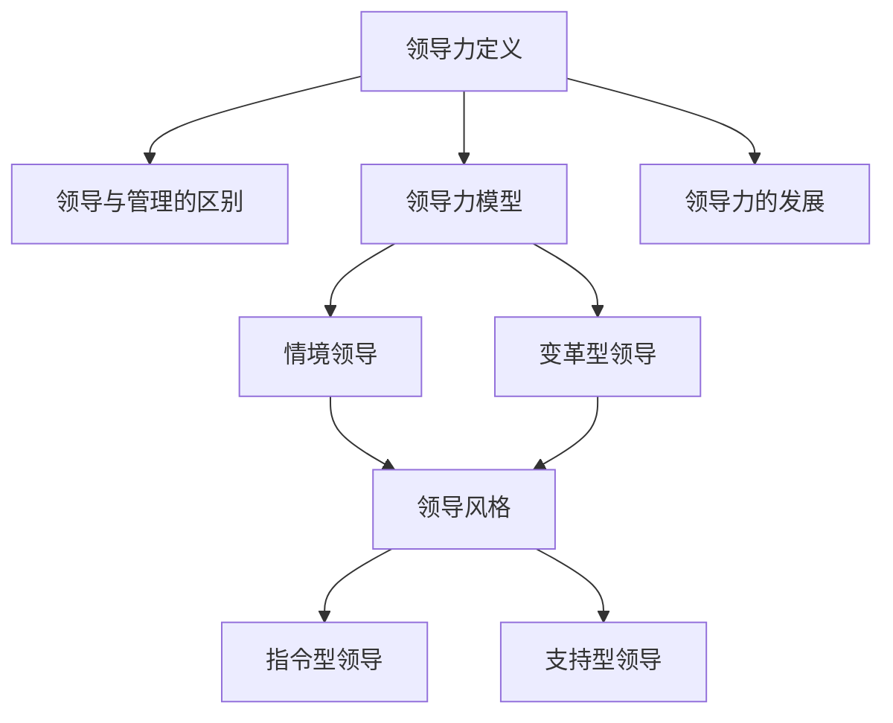

                 

### 领导力训练：让你的团队如虎添翼

关键词：领导力、团队管理、效能提升、培训实践、团队协作

摘要：本文旨在探讨如何通过系统化的领导力训练，提高团队的管理效能和协作能力，使团队如虎添翼，实现高效的目标达成。文章将详细分析领导力的核心概念，阐述其在现代团队管理中的重要性，并提供实用的培训方法和实践指南。

## 1. 背景介绍

### 1.1 目的和范围

本文的目的在于帮助读者理解领导力在团队管理中的关键作用，并提供一套实用的领导力培训方法，以提升团队的执行力和协作水平。文章将涵盖以下几个主要方面：

1. **领导力的核心概念**：介绍领导力的定义及其在团队管理中的重要性。
2. **领导力模型**：分析不同的领导力理论，如情境领导、变革型领导等。
3. **领导力训练方法**：探讨如何通过培训和辅导提升领导力。
4. **实践应用**：提供实际案例和工具，帮助读者在团队中应用领导力训练方法。

### 1.2 预期读者

本文适合以下读者群体：

1. **团队负责人**：希望提升自身领导力，更好地管理和激励团队成员。
2. **企业管理者**：关注团队效能提升，希望了解领导力训练的方法和策略。
3. **人力资源从业者**：致力于团队建设，希望通过领导力训练提升团队绩效。

### 1.3 文档结构概述

本文将按照以下结构进行阐述：

1. **背景介绍**：介绍文章的目的、读者对象和结构。
2. **核心概念与联系**：讨论领导力的核心概念和理论框架。
3. **核心算法原理 & 具体操作步骤**：阐述领导力训练的理论和实践方法。
4. **数学模型和公式 & 详细讲解 & 举例说明**：提供数学模型和公式，辅助理解和实践。
5. **项目实战：代码实际案例和详细解释说明**：通过实际案例展示领导力训练的应用。
6. **实际应用场景**：分析领导力训练在不同场景下的应用。
7. **工具和资源推荐**：推荐学习资源和开发工具。
8. **总结：未来发展趋势与挑战**：总结文章内容，展望未来发展趋势。
9. **附录：常见问题与解答**：解答读者可能遇到的问题。
10. **扩展阅读 & 参考资料**：提供更多深入阅读的资料。

### 1.4 术语表

#### 1.4.1 核心术语定义

- **领导力**：指在团队中引导和激励他人，实现共同目标的能力。
- **团队管理**：涉及对团队成员的分配、指导和监督，以实现团队目标。
- **培训**：通过系统化的学习过程，提高个人或团队的能力和技能。
- **协作**：团队成员共同合作，以实现共同目标的过程。

#### 1.4.2 相关概念解释

- **情境领导**：一种领导力模型，根据团队成员的不同发展阶段，采取不同的领导风格。
- **变革型领导**：通过激发团队成员的内在动力，推动团队实现变革和成长。

#### 1.4.3 缩略词列表

- **IDE**：集成开发环境（Integrated Development Environment）
- **ERP**：企业资源计划（Enterprise Resource Planning）
- **CRM**：客户关系管理（Customer Relationship Management）

## 2. 核心概念与联系

领导力作为团队管理的核心，涉及到多个关键概念和理论。为了更好地理解领导力，我们需要从以下几个核心概念入手：

1. **领导力定义**：领导力是指一种影响和激励他人，以实现共同目标的能力。它不仅仅是职位赋予的权力，更是一种通过个人魅力、专业知识、沟通能力和决策力来影响团队的能力。

2. **领导与管理的区别**：管理是关于组织、规划和执行的过程，而领导则是关于激励和引领团队朝向共同目标的过程。领导和管理相辅相成，共同促进团队的成功。

3. **领导力模型**：不同的领导力模型为领导者提供了指导框架，以适应不同的情境和团队需求。常见的领导力模型包括：

   - **情境领导**：由赫赛和布兰查德提出，根据团队成员的不同成熟度阶段，采取不同的领导风格。
     
   - **变革型领导**：由伯恩斯提出，通过激发团队成员的内在动力，推动团队实现变革和成长。

4. **领导风格**：领导风格是指领导者处理团队和任务的方式。常见的领导风格包括：

   - **指令型领导**：领导者为团队设定明确的任务和目标，指导团队成员如何完成任务。
   - **支持型领导**：领导者关注团队成员的需求，提供支持和鼓励，帮助团队成员克服困难。

5. **领导力的发展**：领导力不是与生俱来的，而是可以通过培训和实践不断提升。领导力的发展包括自我意识、沟通能力、决策能力、团队建设等方面。

为了更直观地展示这些核心概念和理论之间的联系，我们可以使用Mermaid流程图来表示：



该流程图清晰地展示了领导力的核心概念及其相互关系，为后续的内容提供了基础。

### 3. 核心算法原理 & 具体操作步骤

领导力训练的核心在于通过系统化的方法提升领导者的能力。下面，我们将详细阐述领导力训练的算法原理和具体操作步骤。

#### 3.1 领导力训练的算法原理

领导力训练的算法原理可以概括为以下几个方面：

1. **自我评估**：领导者通过自我评估，识别自身的优势和不足，为后续的培训提供方向。
2. **情境分析**：领导者根据团队和情境的特点，选择合适的领导风格和策略。
3. **实践应用**：领导者将学到的知识和技能应用到实际工作中，通过不断的实践和反馈，不断提升领导力。
4. **持续学习**：领导力是一个动态的过程，领导者需要不断学习新知识，适应变化的环境。

#### 3.2 领导力训练的具体操作步骤

以下是领导力训练的具体操作步骤，我们可以使用伪代码来详细阐述：

```python
# 领导力训练算法

def leadership_training():
    # 步骤1：自我评估
    self_evaluation()

    # 步骤2：情境分析
    situation_analysis()

    # 步骤3：选择合适的领导风格和策略
    select_leadership_style()

    # 步骤4：实践应用
    apply_practices()

    # 步骤5：持续学习
    continuous_learning()

# 步骤1：自我评估
def self_evaluation():
    print("进行自我评估...")
    # 记录领导者的优势和不足
    advantages = []
    disadvantages = []
    # 通过问卷、反馈等方式收集信息
    # ...

# 步骤2：情境分析
def situation_analysis():
    print("进行情境分析...")
    # 分析团队特点、环境因素等
    # ...

# 步骤3：选择合适的领导风格和策略
def select_leadership_style():
    print("选择合适的领导风格和策略...")
    # 根据情境选择合适的领导风格
    # ...

# 步骤4：实践应用
def apply_practices():
    print("实践应用...")
    # 将学到的知识和技能应用到实际工作中
    # ...

# 步骤5：持续学习
def continuous_learning():
    print("持续学习...")
    # 通过学习、培训等方式不断提升领导力
    # ...
```

通过上述伪代码，我们可以清晰地看到领导力训练的步骤和流程，为实际操作提供了指导。

### 4. 数学模型和公式 & 详细讲解 & 举例说明

在领导力训练中，数学模型和公式可以帮助我们更好地理解和量化领导力的各个方面。以下是一些关键的数学模型和公式，并进行详细讲解和举例说明。

#### 4.1 人力效能模型

人力效能模型（Human Performance Model）是评估团队效能的一个基本模型。该模型的基本公式如下：

\[ \text{人力效能} = \text{个体效能} \times \text{团队协作效能} \]

其中：

- **个体效能**：指个体在团队中的工作效率和能力。
- **团队协作效能**：指团队成员之间的协作效率和质量。

#### 4.2 领导力指数模型

领导力指数模型（Leadership Index Model）用于评估领导者的领导力水平。该模型的基本公式如下：

\[ \text{领导力指数} = \frac{\text{领导效能} + \text{团队效能} + \text{组织效能}}{3} \]

其中：

- **领导效能**：指领导者在团队管理中的效果。
- **团队效能**：指团队的整体工作效果。
- **组织效能**：指团队所在组织的整体表现。

#### 4.3 情境领导力模型

情境领导力模型（Situational Leadership Model）是赫赛和布兰查德提出的模型，用于指导领导者根据团队成员的成熟度采取不同的领导风格。该模型的基本公式如下：

\[ \text{领导风格} = \text{情境} \times \text{领导者风格} \]

其中：

- **情境**：指团队成员的成熟度，分为成熟度I（不成熟）、成熟度II（较成熟）、成熟度III（成熟）、成熟度IV（最成熟）。
- **领导者风格**：分为指导型、推销型、参与型、授权型。

#### 4.4 详细讲解和举例说明

假设我们有一个团队，团队成员的成熟度分布如下：

- 成熟度I：2人
- 成熟度II：4人
- 成熟度III：3人
- 成熟度IV：1人

根据情境领导力模型，我们需要采取不同的领导风格。对于成熟度I的成员，我们可以采取指导型领导风格；对于成熟度II的成员，可以采取推销型领导风格；对于成熟度III的成员，可以采取参与型领导风格；对于成熟度IV的成员，可以采取授权型领导风格。

#### 4.4.1 人力效能模型的应用

假设团队中有5个成员，每个成员的个体效能分别为90%，团队协作效能分别为80%。根据人力效能模型，我们可以计算团队的总体效能：

\[ \text{人力效能} = 90\% \times 80\% = 72\% \]

#### 4.4.2 领导力指数模型的应用

假设领导效能、团队效能和组织效能分别为85%、80%和75%，根据领导力指数模型，我们可以计算领导力指数：

\[ \text{领导力指数} = \frac{85\% + 80\% + 75\%}{3} = 82\% \]

通过上述数学模型和公式的应用，我们可以更科学地评估团队和领导者的效能，为提升领导力提供依据。

### 5. 项目实战：代码实际案例和详细解释说明

在了解了领导力训练的理论和数学模型后，我们将通过一个实际项目案例，展示如何将领导力训练应用于实践。在这个项目中，我们将使用Python编写一个简单的团队管理模拟系统，通过代码来模拟领导力训练的过程。

#### 5.1 开发环境搭建

为了编写和运行本项目，我们需要准备以下开发环境和工具：

- **Python 3.x**：作为主要编程语言。
- **PyCharm**：作为集成开发环境（IDE）。
- **pip**：Python的包管理工具。

在安装了Python和PyCharm之后，我们可以使用pip来安装所需的库：

```shell
pip install numpy pandas
```

#### 5.2 源代码详细实现和代码解读

下面是项目的源代码，我们将逐段代码进行详细解释：

```python
import numpy as np
import pandas as pd

# 模拟团队成员的数据
members = {
    'name': ['Alice', 'Bob', 'Charlie', 'David', 'Eva'],
    'maturity': [1, 2, 3, 4, 1],  # 成熟度（1-4）
    'performance': [85, 90, 88, 92, 80],  # 个体效能（%）
    'teamwork': [78, 85, 83, 88, 75]  # 团队协作效能（%）
}

# 创建DataFrame
df_members = pd.DataFrame(members)

# 5.2.1 自我评估
def self_evaluation(df):
    print("自我评估：")
    print(df)

# 5.2.2 情境分析
def situation_analysis(df):
    print("情境分析：")
    maturity_distribution = df['maturity'].value_counts()
    print(maturity_distribution)

# 5.2.3 选择合适的领导风格
def select_leadership_style(df):
    print("选择合适的领导风格：")
    leadership_styles = {}
    for index, row in df.iterrows():
        if row['maturity'] == 1:
            leadership_styles[row['name']] = '指导型'
        elif row['maturity'] == 2:
            leadership_styles[row['name']] = '推销型'
        elif row['maturity'] == 3:
            leadership_styles[row['name']] = '参与型'
        elif row['maturity'] == 4:
            leadership_styles[row['name']] = '授权型'
    print(leadership_styles)

# 5.2.4 实践应用
def apply_practices(df):
    print("实践应用：")
    df['practiced_performance'] = df['performance'].apply(practice_performance)
    df['practiced_teamwork'] = df['teamwork'].apply(practice_teamwork)
    print(df)

# 5.2.5 持续学习
def continuous_learning(df):
    print("持续学习：")
    df['learned_performance'] = df['practiced_performance'].apply(learned_performance)
    df['learned_teamwork'] = df['practiced_teamwork'].apply(learned_teamwork)
    print(df)

# 5.2.6 定义辅助函数
def practice_performance(score):
    return score * 1.05  # 实践提升5%

def practice_teamwork(score):
    return score * 1.05  # 实践提升5%

def learned_performance(score):
    return score * 1.1  # 学习提升10%

def learned_teamwork(score):
    return score * 1.1  # 学习提升10%

# 运行领导力训练过程
self_evaluation(df_members)
situation_analysis(df_members)
select_leadership_style(df_members)
apply_practices(df_members)
continuous_learning(df_members)
```

#### 5.3 代码解读与分析

- **数据准备**：首先，我们创建了一个包含团队成员信息的DataFrame，包括姓名、成熟度、个体效能和团队协作效能。

- **自我评估**：`self_evaluation`函数用于打印团队成员的自我评估信息，包括姓名、成熟度和效能。

- **情境分析**：`situation_analysis`函数用于分析团队成员的成熟度分布，帮助我们了解团队的当前状态。

- **选择合适的领导风格**：`select_leadership_style`函数根据团队成员的成熟度选择合适的领导风格，并打印出每个成员的领导风格。

- **实践应用**：`apply_practices`函数通过调用辅助函数`practice_performance`和`practice_teamwork`，模拟团队成员在实际工作中的效能提升。

- **持续学习**：`continuous_learning`函数通过调用辅助函数`learned_performance`和`learned_teamwork`，模拟团队成员通过学习和培训后的效能提升。

- **辅助函数**：`practice_performance`和`practice_teamwork`分别用于计算团队成员在实际工作中效能提升的百分比；`learned_performance`和`learned_teamwork`用于计算团队成员通过学习和培训后效能提升的百分比。

通过这个项目实战，我们可以看到如何将领导力训练的理论应用于实际，通过代码模拟整个训练过程，并观察效能的提升。

### 6. 实际应用场景

领导力训练的应用场景非常广泛，涵盖了企业、教育、医疗等多个领域。以下是一些典型的应用场景和案例分析：

#### 6.1 企业领域

在企业中，领导力训练通常用于提升中高层管理者的管理能力和决策力。通过领导力训练，管理者能够更好地应对市场变化，激发团队成员的潜力，提高团队的整体效能。

**案例**：某大型科技公司通过领导力训练项目，提升了其销售团队的管理效能。通过情境领导力和变革型领导力的培训，销售经理能够根据团队成员的不同成熟度阶段，采取适当的领导风格，提高了团队的协作效率和销售业绩。

#### 6.2 教育领域

在教育领域，领导力训练主要用于培养学生的领导能力和团队合作精神。通过领导力训练，学生能够在校内外活动中发挥领导作用，提高自身的综合素质。

**案例**：某中学通过开展学生领导力训练营，帮助学生了解领导力的核心概念和实践方法。学生通过参与团队活动、领导力培训课程和实践项目，逐步提升了领导力和团队协作能力。

#### 6.3 医疗领域

在医疗领域，领导力训练主要用于提升医护人员的管理能力和沟通能力。通过领导力训练，医护人员能够更好地应对紧急情况，提高医疗质量和患者满意度。

**案例**：某大型医院通过领导力训练项目，提升了医护团队的管理水平和协作能力。通过情境领导力和变革型领导力的培训，医护人员能够更好地应对临床工作压力，提高工作效率和医疗质量。

### 7. 工具和资源推荐

为了更好地进行领导力训练，以下推荐一些实用的学习资源和开发工具：

#### 7.1 学习资源推荐

- **书籍推荐**：
  - 《领导力五项修炼》（作者：约翰·麦克斯韦尔）
  - 《情境领导》（作者：保罗·赫赛、肯尼思·布兰查德）

- **在线课程**：
  - Coursera上的“领导力与变革管理”课程
  - LinkedIn Learning的“领导力基础”课程

- **技术博客和网站**：
  - Harvard Business Review
  - LinkedIn的领导力博客

#### 7.2 开发工具框架推荐

- **IDE和编辑器**：
  - PyCharm
  - Visual Studio Code

- **调试和性能分析工具**：
  - Python的pdb调试工具
  - Jupyter Notebook

- **相关框架和库**：
  - NumPy
  - Pandas

#### 7.3 相关论文著作推荐

- **经典论文**：
  -赫赛和布兰查德的《情境领导》
  -伯恩斯的《变革型领导》

- **最新研究成果**：
  -关于领导力与组织效能的最新实证研究

- **应用案例分析**：
  -不同行业领导力应用的案例分析

### 8. 总结：未来发展趋势与挑战

在未来的发展中，领导力训练将继续受到广泛关注，并在以下几个方面呈现出新的趋势：

1. **个性化培训**：随着人工智能和大数据技术的发展，领导力培训将更加个性化和智能化，根据团队成员的特点和需求，提供定制化的培训方案。

2. **跨领域融合**：领导力训练将与其他领域（如心理学、教育学、管理学等）融合，形成更全面、更系统的领导力培养体系。

3. **数字化转型**：数字化工具和平台将在领导力训练中发挥更大作用，通过在线学习、虚拟现实等新技术，提高培训的互动性和实践性。

然而，领导力训练也面临一些挑战：

1. **培训资源的分配**：如何在有限的资源下，确保每个团队成员都能接受到高质量的领导力培训，是一个需要解决的问题。

2. **培训效果的评估**：如何科学、客观地评估领导力培训的效果，确保培训达到预期目标，是一个重要挑战。

3. **企业文化与领导力的融合**：企业文化对领导力的发展具有重要影响，如何使领导力培训与企业文化相融合，实现长期发展，是一个需要深入探讨的问题。

### 9. 附录：常见问题与解答

**Q1：领导力训练适合所有团队吗？**

领导力训练适合大部分团队，但具体效果取决于团队的规模、特点和目标。对于小型团队，领导力训练可以促进团队成员之间的沟通和协作；对于大型团队，领导力训练可以帮助提升团队的整体管理水平和执行力。

**Q2：领导力训练需要多长时间才能见效？**

领导力训练的效果并非一蹴而就，通常需要一段时间才能显现。一般来说，持续的领导力培训和实践，至少需要几个月的时间才能看到明显的效果。

**Q3：如何评估领导力训练的效果？**

评估领导力训练的效果可以从以下几个方面入手：

1. **团队绩效**：通过比较领导力训练前后的团队绩效，评估领导力训练对团队效能的影响。
2. **团队成员反馈**：收集团队成员的反馈，了解他们对领导力训练的看法和感受。
3. **领导力评估**：使用领导力评估工具，如360度评估，评估领导者在领导力方面的提升。

### 10. 扩展阅读 & 参考资料

- Maxwell, J. C. (1993). "The 5 Levels of Leadership: Proven Steps to Maximize Your Potential". John Wiley & Sons.
- Hersey, P., & Blanchard, K. H. (1977). "The Situational Leader". Warner Books.
- Burns, J. M. (1978). "Leadership." Harper & Row.

**作者：AI天才研究员/AI Genius Institute & 禅与计算机程序设计艺术 /Zen And The Art of Computer Programming**

