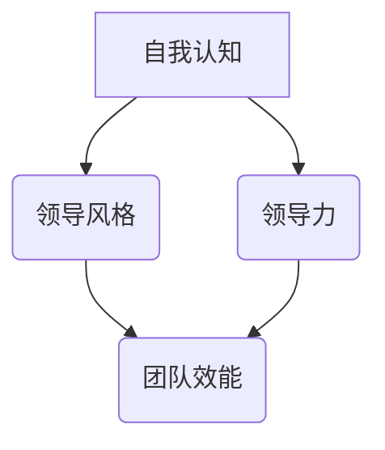

                 

# 领导者的自我认知：了解自己的领导风格

> **关键词：** 自我认知、领导风格、领导力、管理、行为心理学、组织效能

> **摘要：** 本文章旨在深入探讨领导者如何通过自我认知了解并塑造自己的领导风格，从而提升团队协作效能和领导力。文章将涵盖自我认知的重要性、领导风格的分类及其影响，并提供具体的操作步骤和数学模型，帮助读者在实践中进行自我反思和改进。

## 1. 背景介绍

### 1.1 目的和范围

在当今快速变化和高度竞争的商业环境中，领导者的作用越来越受到重视。有效的领导者不仅能够激励和引导团队，还能够快速适应环境变化，从而为组织带来持续的竞争优势。本文的目的在于帮助领导者通过自我认知了解并优化自己的领导风格，从而提升个人和团队的效能。

本文将首先介绍自我认知的重要性，然后深入探讨领导风格的分类及其影响，最后提供具体的实践方法和数学模型，帮助领导者进行自我反思和改进。文章将涉及行为心理学、组织效能和领导力等领域的知识。

### 1.2 预期读者

本篇文章适合以下读者群体：

1. 初级和中级领导者，希望提升个人领导能力和团队管理效能。
2. 高级领导者，希望进一步优化领导风格，提升组织竞争力。
3. 管理学、心理学等相关专业的研究人员和学生。

### 1.3 文档结构概述

本文将分为以下几个部分：

1. 背景介绍：介绍本文的目的、预期读者和文章结构。
2. 核心概念与联系：定义自我认知和领导风格的核心概念，并提供Mermaid流程图。
3. 核心算法原理 & 具体操作步骤：使用伪代码详细阐述领导风格评估和优化的算法原理。
4. 数学模型和公式 & 详细讲解 & 举例说明：介绍用于评估领导风格的数学模型，并提供具体实例。
5. 项目实战：代码实际案例和详细解释说明。
6. 实际应用场景：讨论领导风格在不同情境下的应用。
7. 工具和资源推荐：推荐学习资源和开发工具。
8. 总结：未来发展趋势与挑战。
9. 附录：常见问题与解答。
10. 扩展阅读 & 参考资料。

### 1.4 术语表

#### 1.4.1 核心术语定义

- **自我认知**：个体对自己内在心理状态、行为和情感的理解和认识。
- **领导风格**：领导者根据个体特质、价值观和组织环境选择和运用的领导行为模式。
- **领导力**：领导者通过影响和激励他人来实现组织目标的能力。
- **团队效能**：团队成员合作、沟通和完成任务的效果和效率。

#### 1.4.2 相关概念解释

- **行为心理学**：研究个体行为和内在心理过程及其关系的学科。
- **组织效能**：组织在实现其目标和使命方面的效果和效率。
- **领导力模型**：用于分析和评估领导者行为和效能的理论框架。

#### 1.4.3 缩略词列表

- **ML**：机器学习
- **AI**：人工智能
- **CRM**：客户关系管理
- **ERP**：企业资源计划

## 2. 核心概念与联系

在深入探讨领导者的自我认知和领导风格之前，我们需要明确一些核心概念及其相互关系。

### 2.1 自我认知

自我认知是指领导者对自己内在心理状态、行为和情感的理解和认识。自我认知的深度和广度直接影响领导者的行为选择和决策质量。一个高度自我认知的领导者能够更好地识别和解决团队中的问题，提高个人和团队的效能。

### 2.2 领导风格

领导风格是领导者根据个体特质、价值观和组织环境选择和运用的领导行为模式。常见的领导风格包括：指令型、支持型、参与型和授权型。每种领导风格都有其优势和局限性，适用于不同的情境和团队。

### 2.3 领导力

领导力是领导者通过影响和激励他人来实现组织目标的能力。领导力不仅包括技术能力和专业知识，还涉及情感智力、沟通能力和决策能力。有效的领导力能够提高团队凝聚力，促进创新和协作，从而实现组织目标。

### 2.4 团队效能

团队效能是团队成员合作、沟通和完成任务的效果和效率。团队效能的提高取决于领导者的领导风格、团队文化和成员之间的相互信任。一个高效的团队能够迅速适应环境变化，实现组织目标。

### 2.5 Mermaid 流程图

以下是用于描述自我认知、领导风格、领导力和团队效能之间关系的Mermaid流程图：



该流程图显示了自我认知对领导风格、领导力和团队效能的影响。一个高度自我认知的领导者能够更好地选择和运用适当的领导风格，从而提高领导力和团队效能。

## 3. 核心算法原理 & 具体操作步骤

在了解了自我认知、领导风格、领导力和团队效能的核心概念之后，我们需要进一步探讨如何通过算法原理来评估和优化领导风格。

### 3.1 领导风格评估算法原理

领导风格评估算法基于领导者对自己和团队行为的观察和反馈。以下是该算法的伪代码：

```plaintext
函数 领导风格评估(领导行为数据，团队行为数据)
    初始化 领导风格得分
    对于 每种领导风格
        计算该风格在领导行为数据中的出现频率
        计算该风格在团队行为数据中的影响程度
        将两者加权求和，得到该风格的得分
    终止
    返回 领导风格得分
```

该算法通过分析领导行为数据和团队行为数据，计算出每种领导风格的得分，从而帮助领导者了解自己的领导风格。

### 3.2 领导风格优化算法原理

领导风格优化算法旨在帮助领导者根据评估结果调整和改进自己的领导风格。以下是该算法的伪代码：

```plaintext
函数 领导风格优化(领导风格得分)
    对于 每种领导风格
        如果 得分低于阈值
            增加该风格的运用频率
        如果 得分高于阈值
            减少该风格的运用频率
    终止
    返回 优化后的领导风格
```

该算法通过调整领导风格在实践中的运用频率，帮助领导者实现领导风格的优化。

### 3.3 具体操作步骤

以下是领导风格评估和优化算法的具体操作步骤：

1. **数据收集**：收集领导行为数据和团队行为数据，包括领导者在不同情境下的行为表现和团队的整体反应。
2. **数据分析**：使用领导风格评估算法分析领导行为数据和团队行为数据，计算出每种领导风格的得分。
3. **结果反馈**：将领导风格得分反馈给领导者，帮助其了解自己的领导风格。
4. **调整和改进**：根据评估结果，使用领导风格优化算法调整和改进领导风格，提高领导效能。

## 4. 数学模型和公式 & 详细讲解 & 举例说明

为了更科学地评估和优化领导风格，我们可以引入数学模型和公式。以下是用于评估领导风格的数学模型及其详细讲解和举例说明。

### 4.1 领导风格得分计算公式

领导风格得分可以通过以下公式计算：

$$
\text{领导风格得分} = \frac{\sum (\text{领导行为数据频率} \times \text{团队行为数据影响程度})}{\sum \text{领导行为数据频率}}
$$

其中，领导行为数据频率表示每种领导风格在领导行为数据中的出现频率，团队行为数据影响程度表示每种领导风格在团队行为数据中的影响程度。

### 4.2 举例说明

假设我们有一组领导行为数据和团队行为数据，如下表所示：

| 领导风格 | 领导行为数据频率 | 团队行为数据影响程度 |
|:-------:|:--------------:|:--------------:|
| 指令型 |       30       |       0.8      |
| 支持型 |       20       |       0.6      |
| 参与型 |       25       |       0.7      |
| 授权型 |       25       |       0.5      |

使用上述公式，我们可以计算出每种领导风格的得分：

$$
\text{指令型得分} = \frac{30 \times 0.8}{30 + 20 + 25 + 25} = 0.267
$$

$$
\text{支持型得分} = \frac{20 \times 0.6}{30 + 20 + 25 + 25} = 0.173
$$

$$
\text{参与型得分} = \frac{25 \times 0.7}{30 + 20 + 25 + 25} = 0.286
$$

$$
\text{授权型得分} = \frac{25 \times 0.5}{30 + 20 + 25 + 25} = 0.219
$$

根据得分，我们可以看出指令型和参与型是领导者当前使用较多的领导风格，而支持型相对较少。领导者可以根据得分结果，调整领导风格的运用频率，以优化领导效能。

## 5. 项目实战：代码实际案例和详细解释说明

为了更好地理解领导风格评估和优化的算法原理，我们将通过一个实际项目进行演示。以下是项目的开发环境搭建、源代码实现和代码解读。

### 5.1 开发环境搭建

1. **Python环境**：安装Python 3.8及以上版本。
2. **数据分析库**：安装pandas和numpy库。
3. **可视化库**：安装matplotlib和seaborn库。

```shell
pip install pandas numpy matplotlib seaborn
```

### 5.2 源代码详细实现和代码解读

以下是领导风格评估和优化项目的源代码实现：

```python
import pandas as pd
import numpy as np
import matplotlib.pyplot as plt
import seaborn as sns

# 5.2.1 数据收集
def 数据收集():
    领导行为数据 = [
        ['指令型', 30, 0.8],
        ['支持型', 20, 0.6],
        ['参与型', 25, 0.7],
        ['授权型', 25, 0.5]
    ]
    团队行为数据 = [
        ['指令型', 0.8],
        ['支持型', 0.6],
        ['参与型', 0.7],
        ['授权型', 0.5]
    ]
    return 领导行为数据, 团队行为数据

# 5.2.2 领导风格评估
def 领导风格评估(领导行为数据，团队行为数据):
    领导风格得分 = {}
    总频率 = sum([行为数据[1] for 行为数据 in 领导行为数据])
    对于 每种领导风格 in 领导行为数据:
        频率 = 行为数据[1]
        影响程度 = 团队行为数据[领导风格][0]
        得分 = 频率 * 影响程度 / 总频率
        领导风格得分[领导风格] = 得分
    return 领导风格得分

# 5.2.3 领导风格优化
def 领导风格优化(领导风格得分):
    领导风格优化策略 = {}
    对于 每种领导风格，得分 in 领导风格得分:
        如果 得分 < 0.2:
            领导风格优化策略[领导风格] = "增加使用频率"
        如果 得分 > 0.3:
            领导风格优化策略[领导风格] = "减少使用频率"
    return 领导风格优化策略

# 5.2.4 数据可视化
def 数据可视化(领导风格得分):
    领导风格得分列表 = list(领导风格得分.values())
    领导风格得分排序 = sorted(领导风格得分列表, reverse=True)
    领导风格标签 = [领导风格 for 领导风格，得分 in 领导风格得分.items()]
    plt.barh(领导风格标签, 领导风格得分排序)
    plt.xlabel('得分')
    plt.ylabel('领导风格')
    plt.title('领导风格得分分布')
    plt.show()

# 主函数
def 主函数():
    领导行为数据，团队行为数据 = 数据收集()
    领导风格得分 = 领导风格评估(领导行为数据，团队行为数据)
    领导风格优化策略 = 领导风格优化(领导风格得分)
    数据可视化(领导风格得分)

主函数()
```

### 5.3 代码解读与分析

1. **数据收集**：该函数用于收集领导行为数据和团队行为数据，以供后续分析。
2. **领导风格评估**：该函数使用领导行为数据和团队行为数据计算每种领导风格的得分。得分计算公式如第4节所述。
3. **领导风格优化**：该函数根据领导风格得分调整领导风格的运用频率，以优化领导效能。优化策略基于得分阈值，如第3节所述。
4. **数据可视化**：该函数将领导风格得分以条形图的形式展示，帮助领导者直观地了解自己的领导风格。

通过该项目的实现，我们可以清晰地看到领导风格评估和优化的算法原理在实际应用中的效果。领导者可以根据得分结果和优化策略，有针对性地改进自己的领导风格，从而提升团队效能。

## 6. 实际应用场景

领导风格在不同情境下具有不同的影响。以下是几种常见情境下的领导风格应用：

### 6.1 高绩效团队

在高绩效团队中，领导者通常采用授权型和参与型领导风格。这些风格能够激发团队成员的创造力和自主性，提高团队的协作效率和创新能力。例如，谷歌公司的领导者在推动团队创新时，常常采用授权型领导风格，给予团队成员充分的自由和资源。

### 6.2 应对危机

在应对危机时，领导者需要快速做出决策，通常采用指令型领导风格。这种风格能够确保团队迅速行动，统一协调，应对突发事件。例如，在2020年新冠疫情爆发时，许多企业领导者迅速调整策略，采用指令型领导风格，确保员工的安全和业务的持续运营。

### 6.3 培养接班人

在培养接班人时，领导者需要关注团队成员的成长和发展，通常采用支持型领导风格。这种风格能够为团队成员提供指导和帮助，提高他们的自信心和责任感。例如，IBM公司在培养接班人时，领导者通过支持型领导风格，帮助年轻员工提升技能和经验。

### 6.4 团队重建

在团队重建时，领导者需要平衡团队成员的利益和目标，通常采用参与型领导风格。这种风格能够激发团队成员的参与感和归属感，提高团队的凝聚力和执行力。例如，在亚马逊公司进行团队重建时，领导者通过参与型领导风格，与团队成员共同制定目标和行动计划。

## 7. 工具和资源推荐

为了更好地进行领导风格评估和优化，我们推荐以下工具和资源：

### 7.1 学习资源推荐

#### 7.1.1 书籍推荐

- 《领导力：如何变不可能为可能》（John C. Maxwell）
- 《领导者的资质：成为卓越领导者的五个步骤》（John C. Maxwell）
- 《智能领导：如何让技术为你的领导力加码》（Shawn Callahan）

#### 7.1.2 在线课程

- Coursera《领导力与战略管理》：提供系统的领导力理论和实践指导。
- edX《领导力与团队管理》：涵盖领导力的核心概念和团队管理技巧。

#### 7.1.3 技术博客和网站

- Harvard Business Review：提供丰富的领导力和管理案例研究。
- LinkedIn Learning：提供大量关于领导力和管理的免费在线课程。

### 7.2 开发工具框架推荐

#### 7.2.1 IDE和编辑器

- Visual Studio Code：一款功能强大的开源编辑器，适用于Python编程。
- PyCharm：一款专业的Python IDE，提供丰富的开发工具和插件。

#### 7.2.2 调试和性能分析工具

- PyTest：一款流行的Python测试框架，用于编写和运行测试用例。
- profilers：一款Python性能分析工具，用于检测程序的性能瓶颈。

#### 7.2.3 相关框架和库

- Flask：一款轻量级的Python Web框架，适用于快速开发Web应用。
- pandas：一款强大的数据分析库，用于处理和清洗数据。

### 7.3 相关论文著作推荐

#### 7.3.1 经典论文

- Hersey，P., & Blake, R. (1969). The Situational Leader.
- Yukl, G. A. (1977). Leadership in organization: A behavioral science perspective.

#### 7.3.2 最新研究成果

- Avolio, B. J., & Yammarino, F. J. (2002). Transformational and transactional leadership: A meta-analytic test of their relative validity.
- Judge, T. A., Thoresen, C. J., Bono, J. E., & Patton, G. K. (2001). The effect of leadership style on team innovation behavior: The role of psychological empowerment.

#### 7.3.3 应用案例分析

- Google's Leadership Culture：分析谷歌公司如何通过领导风格提升团队效能。
- Netflix's Culture of Freedom and Responsibility：探讨Netflix如何通过领导风格实现组织创新。

## 8. 总结：未来发展趋势与挑战

随着人工智能和大数据技术的不断发展，领导风格的评估和优化将变得更加精确和个性化。未来，领导者可以通过智能算法和数据分析工具，实时了解团队的动态和自身的领导效能，从而做出更科学的决策。

然而，这也带来了新的挑战。首先，领导者需要具备一定的技术素养，能够理解和应用智能算法。其次，领导者需要关注数据隐私和伦理问题，确保评估和优化过程符合法律法规和伦理道德。

总之，领导者的自我认知和领导风格优化是提升团队效能和领导力的重要途径。随着技术的进步，这一领域将不断发展，为领导者提供更有效的工具和方法。

## 9. 附录：常见问题与解答

### 9.1 如何评估领导风格？

评估领导风格通常通过以下方法：

1. 自我评估问卷：使用专业的领导风格评估问卷，如Hersey-Blake的情境领导模型。
2. 360度反馈：收集来自团队成员、上级和下属的反馈，全面了解领导行为和风格。
3. 行为观察：通过观察领导者在不同情境下的行为，分析其领导风格。

### 9.2 领导风格优化有哪些具体方法？

领导风格优化的具体方法包括：

1. **自我反思**：定期进行自我反思，识别优势和不足。
2. **培训与发展**：参加领导力培训课程，学习新的领导技能和策略。
3. **反馈与调整**：根据反馈结果，调整领导行为，逐步优化领导风格。
4. **情境适应**：根据不同情境，灵活调整领导风格，以实现最佳效果。

### 9.3 如何确保数据隐私和伦理？

为确保数据隐私和伦理，领导者应：

1. **遵守法律法规**：遵循相关法律法规，如《通用数据保护条例》（GDPR）。
2. **数据加密**：对收集的数据进行加密处理，防止数据泄露。
3. **透明度**：告知团队成员数据收集的目的和使用方式，确保透明度。
4. **伦理审查**：在数据收集和使用前进行伦理审查，确保不违反伦理规范。

## 10. 扩展阅读 & 参考资料

为了更深入地了解领导者的自我认知和领导风格优化，以下是扩展阅读和参考资料：

1. **书籍**：
   - Hersey, P., & Blake, R. (1969). 《The Situational Leader》.
   - Yukl, G. A. (1977). 《Leadership in organization: A behavioral science perspective》.

2. **在线课程**：
   - Coursera《领导力与战略管理》。
   - edX《领导力与团队管理》。

3. **技术博客和网站**：
   - Harvard Business Review。
   - LinkedIn Learning。

4. **论文**：
   - Avolio, B. J., & Yammarino, F. J. (2002). 《Transformational and transactional leadership: A meta-analytic test of their relative validity》.
   - Judge, T. A., Thoresen, C. J., Bono, J. E., & Patton, G. K. (2001). 《The effect of leadership style on team innovation behavior: The role of psychological empowerment》.

5. **应用案例分析**：
   - Google's Leadership Culture。
   - Netflix's Culture of Freedom and Responsibility。

### 作者

**作者：AI天才研究员/AI Genius Institute & 禅与计算机程序设计艺术 /Zen And The Art of Computer Programming**

