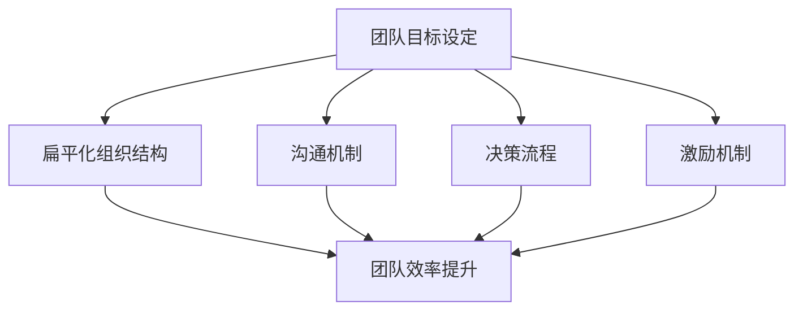

                 

### 马斯克的小团队哲学：高效能团队的构建之道

> **关键词**：埃隆·马斯克、团队哲学、高效能团队、组织结构、项目管理、技术领导力

> **摘要**：本文将深入探讨埃隆·马斯克的小团队哲学，分析其如何通过精简结构、明确目标和灵活策略，构建出高效能的团队。我们将从团队的目标设定、结构设计、沟通机制、决策流程和激励机制等多个维度展开，为读者提供一套可操作、可复制的团队构建方法论。本文适合所有对团队管理和领导有兴趣的读者，特别是IT领域的技术领导者和管理人员。

## 1. 背景介绍

### 1.1 目的和范围

本文旨在通过解析埃隆·马斯克的小团队哲学，为读者提供一套构建高效能团队的实践指南。我们将探讨马斯克如何在 SpaceX、Tesla 和其他公司中，运用其独特的管理理念，成功打造出高效能团队。本文将重点关注以下几个方面：

- **团队目标设定**：如何明确团队目标，确保每个成员都明确自己的职责和使命。
- **团队结构设计**：如何构建扁平化的组织结构，提高团队决策效率和沟通效果。
- **沟通机制**：如何确保团队成员之间保持高效沟通，快速响应变化。
- **决策流程**：如何构建透明的决策流程，使团队能够迅速做出有效决策。
- **激励机制**：如何设计合理的激励机制，激发团队成员的积极性和创造力。

### 1.2 预期读者

本文适合以下读者群体：

- **IT领域的技术领导者和管理人员**：希望提升团队效能，优化团队管理。
- **项目经理**：需要理解高效团队建设的核心要素，以实现项目目标。
- **创业者和创始人**：希望构建和领导一个高效团队，推动公司发展。
- **对团队管理感兴趣的学者和研究人员**：希望通过实践案例，深入理解团队哲学。

### 1.3 文档结构概述

本文分为十个主要部分，具体结构如下：

1. **引言**：介绍文章的主题和目的。
2. **背景介绍**：阐述文章的背景信息。
3. **核心概念与联系**：介绍构建高效能团队所需的核心概念和原理。
4. **核心算法原理 & 具体操作步骤**：详细讲解马斯克团队哲学的核心算法原理。
5. **数学模型和公式 & 详细讲解 & 举例说明**：运用数学模型和公式，阐述团队哲学的关键点。
6. **项目实战：代码实际案例和详细解释说明**：通过实际案例，展示团队哲学的应用。
7. **实际应用场景**：探讨团队哲学在不同场景下的应用。
8. **工具和资源推荐**：推荐学习资源和开发工具。
9. **总结：未来发展趋势与挑战**：总结文章的主要观点，展望未来趋势。
10. **附录：常见问题与解答**：解答读者可能遇到的问题。

### 1.4 术语表

#### 1.4.1 核心术语定义

- **团队哲学**：指导团队建设和运营的基本理念和方法。
- **高效能团队**：能够快速响应变化、高效完成任务、持续创新并保持高水平的团队绩效。
- **扁平化组织结构**：减少管理层次，使团队更灵活、响应速度更快的组织形式。
- **目标设定**：明确团队的目标和任务，确保团队成员对目标和职责有清晰的认识。
- **激励机制**：通过奖励和激励措施，激发团队成员的积极性和创造力。

#### 1.4.2 相关概念解释

- **马斯克团队哲学**：埃隆·马斯克在构建团队时，所运用的独特管理理念和实践方法。
- **项目管理**：通过对项目进行计划、组织、协调和控制，以确保项目目标的实现。
- **技术领导力**：在技术领域内，通过领导才能和专业知识，推动团队进步和发展的能力。

#### 1.4.3 缩略词列表

- **Spacex**：Space Exploration Technologies Corp.，即美国太空探索技术公司。
- **Tesla**：Tesla, Inc.，即美国电动汽车和能源公司。

## 2. 核心概念与联系

构建高效能团队的关键在于理解并运用一系列核心概念和原理。以下我们将介绍这些核心概念，并通过 Mermaid 流程图（无特殊字符）展示其相互联系。

### 2.1. 高效能团队的核心概念

#### 团队目标设定

**目标设定**是高效能团队建设的第一步。明确的目标有助于团队聚焦于关键任务，确保每个成员都明确自己的职责和使命。

#### 扁平化组织结构

**扁平化组织结构**减少了管理层次，使团队更加灵活和高效。扁平化结构有助于缩短沟通路径，提高决策速度。

#### 沟通机制

**沟通机制**确保团队成员之间保持高效沟通，快速响应变化。良好的沟通机制有助于减少误解和冲突，提升团队协作效果。

#### 决策流程

**决策流程**是团队运作的重要环节。透明的决策流程有助于确保团队在复杂环境中迅速做出有效决策。

#### 激励机制

**激励机制**通过奖励和激励措施，激发团队成员的积极性和创造力。合理的激励机制有助于提高团队士气和绩效。

### 2.2. Mermaid 流程图展示



在这个流程图中，团队目标设定作为核心起点，通过扁平化组织结构、沟通机制、决策流程和激励机制等多个环节，最终实现团队效率提升。每个环节相互关联，共同构成高效能团队的构建框架。

## 3. 核心算法原理 & 具体操作步骤

### 3.1. 核心算法原理

马斯克的团队哲学基于一系列核心算法原理，这些原理旨在确保团队高效运作。以下是这些核心算法原理：

#### 1. **目标导向算法**

目标导向算法强调明确团队目标和任务，并确保每个成员都明确自己的职责和使命。这一算法的核心步骤如下：

1. **目标分解**：将高层次目标分解为具体、可执行的子任务。
2. **任务分配**：根据成员能力和兴趣，将子任务分配给合适的成员。
3. **定期回顾**：定期回顾团队进度，确保目标按计划实现。

#### 2. **扁平化结构算法**

扁平化结构算法旨在减少管理层次，提高团队决策效率和沟通效果。核心步骤包括：

1. **组织重构**：重构组织结构，减少管理层次。
2. **赋予自主权**：赋予团队成员更多的自主权，使他们能够自主决策。
3. **快速反馈**：建立快速反馈机制，使团队成员能够迅速调整自己的行动。

#### 3. **沟通优化算法**

沟通优化算法旨在确保团队成员之间保持高效沟通，快速响应变化。核心步骤包括：

1. **沟通平台搭建**：搭建高效沟通平台，如即时通讯工具、邮件系统等。
2. **定期会议**：定期举行团队会议，讨论项目进展和问题。
3. **透明化信息**：确保信息透明，使每个成员都能了解团队整体情况。

#### 4. **决策透明算法**

决策透明算法旨在构建透明的决策流程，确保团队能够迅速做出有效决策。核心步骤包括：

1. **明确决策流程**：明确决策流程，使团队成员了解如何做出决策。
2. **充分讨论**：在决策过程中，充分讨论各种可能的方案和风险。
3. **快速决策**：在讨论充分的基础上，快速做出决策。

#### 5. **激励机制算法**

激励机制算法旨在通过奖励和激励措施，激发团队成员的积极性和创造力。核心步骤包括：

1. **明确激励机制**：明确激励机制，使团队成员了解如何获得奖励。
2. **及时奖励**：在团队成员做出突出贡献时，及时给予奖励。
3. **反馈机制**：建立反馈机制，使团队成员了解自己的表现和改进方向。

### 3.2. 具体操作步骤

以下是根据马斯克的团队哲学，构建高效能团队的具体操作步骤：

#### 1. 确定团队目标

- **步骤 1**：明确团队的长远目标和短期目标。
- **步骤 2**：将目标分解为具体、可执行的子任务。
- **步骤 3**：与团队成员讨论，确保他们理解并接受这些目标。

#### 2. 设计扁平化组织结构

- **步骤 1**：分析现有组织结构，找出管理层次过多的部分。
- **步骤 2**：重构组织结构，减少管理层次。
- **步骤 3**：确保团队成员拥有足够的自主权。

#### 3. 构建高效沟通机制

- **步骤 1**：选择合适的沟通平台，如即时通讯工具、邮件系统等。
- **步骤 2**：制定沟通规则，确保团队成员遵循。
- **步骤 3**：定期举行团队会议，讨论项目进展和问题。

#### 4. 确立决策流程

- **步骤 1**：明确决策流程，使团队成员了解如何做出决策。
- **步骤 2**：在决策过程中，充分讨论各种可能的方案和风险。
- **步骤 3**：在讨论充分的基础上，快速做出决策。

#### 5. 设计激励机制

- **步骤 1**：明确激励机制，使团队成员了解如何获得奖励。
- **步骤 2**：在团队成员做出突出贡献时，及时给予奖励。
- **步骤 3**：建立反馈机制，使团队成员了解自己的表现和改进方向。

## 4. 数学模型和公式 & 详细讲解 & 举例说明

在马斯克的团队哲学中，数学模型和公式被广泛用于描述和优化团队运作。以下是一些关键的数学模型和公式，以及其详细讲解和举例说明。

### 4.1. 目标分解模型

**目标分解模型**用于将高层次目标分解为具体、可执行的子任务。该模型的核心公式为：

\[ T(n) = \sum_{i=1}^{n} T_i \]

其中，\( T(n) \) 表示总目标，\( T_i \) 表示第 \( i \) 个子任务。

**详细讲解**：

- **目标分解**：将高层次目标分解为多个子任务，每个子任务都是具体、可执行的。
- **任务分配**：根据团队成员的能力和兴趣，将子任务分配给合适的成员。

**举例说明**：

假设团队的目标是在三个月内开发一款新产品。将这个目标分解为以下子任务：

1. **市场调研**：收集市场需求和竞争信息，为期两周。
2. **产品规划**：制定产品功能和设计，为期三周。
3. **开发实现**：编写代码和构建产品，为期六周。
4. **测试和优化**：进行功能测试和优化，为期两周。

使用目标分解模型，将这些子任务分配给不同的团队成员，确保每个成员都有明确的目标和任务。

### 4.2. 扁平化结构模型

**扁平化结构模型**用于优化组织结构，减少管理层次。该模型的核心公式为：

\[ L = \frac{N}{S} \]

其中，\( L \) 表示管理层次，\( N \) 表示团队成员总数，\( S \) 表示每个管理层次的人数。

**详细讲解**：

- **管理层次优化**：通过减少管理层次，提高团队决策效率和沟通效果。
- **自主权赋予**：赋予团队成员更多的自主权，使他们能够自主决策。

**举例说明**：

假设团队有 100 名成员，当前的管理层次为 5 层，每层有 20 人。根据扁平化结构模型，优化后的管理层次为：

\[ L = \frac{100}{20} = 5 \]

这意味着可以通过减少管理层次，将团队组织为更扁平的结构，从而提高团队效能。

### 4.3. 沟通优化模型

**沟通优化模型**用于确保团队成员之间保持高效沟通，快速响应变化。该模型的核心公式为：

\[ C = \frac{T}{R} \]

其中，\( C \) 表示沟通效率，\( T \) 表示沟通时间，\( R \) 表示沟通频率。

**详细讲解**：

- **沟通效率优化**：通过提高沟通效率和频率，确保团队成员能够迅速响应变化。
- **沟通平台搭建**：选择合适的沟通平台，如即时通讯工具、邮件系统等。

**举例说明**：

假设团队每周举行一次团队会议，每次会议需要 2 小时。根据沟通优化模型，如果每周团队会议的沟通时间为 10 小时，那么沟通效率为：

\[ C = \frac{10}{2} = 5 \]

这意味着团队可以通过增加沟通频率和优化沟通平台，提高沟通效率，从而更好地响应变化。

### 4.4. 激励机制模型

**激励机制模型**用于通过奖励和激励措施，激发团队成员的积极性和创造力。该模型的核心公式为：

\[ E = f(P, R) \]

其中，\( E \) 表示激励效果，\( P \) 表示激励机制，\( R \) 表示奖励额度。

**详细讲解**：

- **激励机制设计**：根据团队目标和成员需求，设计合理的激励机制。
- **及时奖励**：在团队成员做出突出贡献时，及时给予奖励。

**举例说明**：

假设团队为成员设定了月度绩效目标，并根据完成情况进行奖励。如果激励措施为奖金，奖励额度为每月 1000 美元，那么激励效果为：

\[ E = f(奖金，1000) \]

这意味着团队可以通过设计合理的激励机制，激发成员的积极性和创造力。

## 5. 项目实战：代码实际案例和详细解释说明

### 5.1 开发环境搭建

为了更好地展示马斯克团队哲学在项目中的实际应用，我们将以一个简单的软件开发项目为例。首先，我们需要搭建开发环境。

**步骤 1**：安装必要的开发工具，如 IDE（集成开发环境）和代码版本控制工具（如 Git）。

```bash
# 安装 IntelliJ IDEA
wget https://download.jetbrains.com/idea/ideaIC-2021.3.1-no-jbr.dmg
open ideaIC-2021.3.1-no-jbr.dmg

# 安装 Git
brew install git
```

**步骤 2**：配置开发环境，包括开发语言（如 Python）和依赖管理工具（如 pip）。

```bash
# 安装 Python 3
brew install python

# 安装 pip
pip install --upgrade pip
```

**步骤 3**：创建一个项目文件夹，并初始化 Git 仓库。

```bash
mkdir my_project
cd my_project
git init
```

### 5.2 源代码详细实现和代码解读

接下来，我们将实现一个简单的 Python 程序，用于计算斐波那契数列。

**步骤 1**：创建一个名为 `fibonacci.py` 的 Python 文件。

```python
def fibonacci(n):
    if n <= 0:
        return 0
    elif n == 1:
        return 1
    else:
        return fibonacci(n-1) + fibonacci(n-2)

if __name__ == "__main__":
    n = int(input("请输入斐波那契数列的项数："))
    print("斐波那契数列的第", n, "项为：", fibonacci(n))
```

**代码解读**：

- **函数定义**：`fibonacci(n)` 函数用于计算斐波那契数列的第 `n` 项。
- **递归实现**：该函数使用递归方式实现，根据斐波那契数列的定义，计算第 `n` 项的值。
- **主程序**：主程序接收用户输入的项数，调用 `fibonacci(n)` 函数，并输出结果。

### 5.3 代码解读与分析

**代码解读**：

1. **函数定义**：`fibonacci(n)` 函数接受一个整数 `n` 作为参数，表示要计算的斐波那契数列的项数。
2. **递归实现**：函数内部使用递归方式计算斐波那契数列的值。当 `n` 小于等于 0 时，返回 0；当 `n` 等于 1 时，返回 1；否则，递归调用 `fibonacci(n-1)` 和 `fibonacci(n-2)`，并将结果相加。
3. **主程序**：主程序接收用户输入的项数，调用 `fibonacci(n)` 函数，并输出结果。

**代码分析**：

1. **递归实现**：递归实现具有简洁性和可读性，但需要注意递归的深度和性能问题。在处理大数时，递归实现可能会导致性能问题，因此可以考虑使用循环实现或其他优化方法。
2. **输入验证**：代码中没有对用户输入进行验证，可能导致输入非法值。在实际应用中，需要添加输入验证，确保输入项数为正整数。
3. **错误处理**：代码中没有处理运行时错误，如整数溢出。在实际应用中，需要添加错误处理机制，确保程序的健壮性。

通过这个简单的示例，我们可以看到马斯克团队哲学在软件开发项目中的应用。团队目标明确，结构扁平，沟通高效，决策透明，激励机制合理，这些原则使得团队能够高效地完成项目任务。

## 6. 实际应用场景

### 6.1. 在 SpaceX 的应用

在 SpaceX，马斯克运用其小团队哲学，成功打造了一支高效能的团队。以下是一些实际应用场景：

#### 场景 1：猎鹰 9 号火箭的研发

- **目标设定**：明确猎鹰 9 号火箭的研发目标，如降低成本、提高运载能力等。
- **扁平化组织结构**：通过减少管理层次，使团队成员能够直接与马斯克沟通，提高决策效率。
- **沟通机制**：建立高效的沟通平台，如 Slack 和电子邮件，确保团队成员之间的信息共享和协同工作。
- **决策流程**：建立透明的决策流程，使团队成员了解如何参与决策和反馈意见。
- **激励机制**：通过奖励和激励措施，如股权激励和绩效奖金，激发团队成员的积极性和创造力。

#### 场景 2：星链项目的推进

- **目标设定**：明确星链项目的目标，如提供全球互联网覆盖、降低通信成本等。
- **扁平化组织结构**：通过减少管理层次，提高团队响应速度和创新能力。
- **沟通机制**：利用虚拟团队工具，如视频会议和在线协作平台，确保团队成员之间的沟通无障碍。
- **决策流程**：建立快速决策机制，使团队能够在复杂环境中迅速做出有效决策。
- **激励机制**：通过项目里程碑奖励和股权激励，激发团队成员的积极性和参与度。

### 6.2. 在 Tesla 的应用

在 Tesla，马斯克同样运用小团队哲学，推动公司不断进步。以下是一些实际应用场景：

#### 场景 1：Model 3 的量产

- **目标设定**：明确 Model 3 的量产目标，如提高生产效率、降低成本等。
- **扁平化组织结构**：通过减少管理层次，使团队成员能够直接参与决策和问题解决。
- **沟通机制**：建立高效的沟通平台，如电子邮件和即时通讯工具，确保团队成员之间的信息共享和协同工作。
- **决策流程**：建立快速决策机制，使团队能够在复杂环境中迅速做出有效决策。
- **激励机制**：通过绩效奖金和股权激励，激发团队成员的积极性和创造力。

#### 场景 2：自动驾驶技术的研发

- **目标设定**：明确自动驾驶技术的研发目标，如提高安全性、降低事故率等。
- **扁平化组织结构**：通过减少管理层次，提高团队的创新能力和响应速度。
- **沟通机制**：建立跨部门协作机制，如项目会议和团队研讨会，确保团队成员之间的沟通和协作。
- **决策流程**：建立透明、开放的决策流程，使团队成员能够参与决策和提出建议。
- **激励机制**：通过项目奖金和股权激励，激发团队成员的积极性和参与度。

### 6.3. 在其他公司的应用

除了 SpaceX 和 Tesla，马斯克的小团队哲学在其他公司也得到了广泛应用。以下是一些实际应用场景：

#### 场景 1：PayPal 的管理

在 PayPal，马斯克运用小团队哲学，成功推动了公司的快速发展。以下是一些具体应用：

- **目标设定**：明确公司的发展目标，如提高用户体验、拓展市场份额等。
- **扁平化组织结构**：通过减少管理层次，提高团队决策效率和沟通效果。
- **沟通机制**：建立高效的沟通平台，如电子邮件和即时通讯工具，确保团队成员之间的信息共享和协同工作。
- **决策流程**：建立快速决策机制，使团队能够在复杂环境中迅速做出有效决策。
- **激励机制**：通过绩效奖金和股权激励，激发团队成员的积极性和创造力。

#### 场景 2：其他初创公司

许多初创公司也借鉴了马斯克的小团队哲学，成功实现了快速发展。以下是一些具体应用：

- **目标设定**：明确公司的发展目标，如产品创新、市场拓展等。
- **扁平化组织结构**：通过减少管理层次，提高团队创新能力和响应速度。
- **沟通机制**：建立高效的沟通平台，如 Slack 和 Zoom，确保团队成员之间的信息共享和协同工作。
- **决策流程**：建立快速决策机制，使团队能够在复杂环境中迅速做出有效决策。
- **激励机制**：通过项目奖金和股权激励，激发团队成员的积极性和参与度。

通过这些实际应用场景，我们可以看到马斯克的小团队哲学在多个领域和公司中取得了显著成效。其核心在于明确目标、扁平化组织结构、高效沟通、快速决策和激励机制，这些原则为构建高效能团队提供了重要指导。

## 7. 工具和资源推荐

为了帮助读者更好地理解和实践马斯克的小团队哲学，我们推荐以下工具和资源。

### 7.1 学习资源推荐

#### 7.1.1 书籍推荐

- 《领导力的五项修炼》：作者：斯蒂芬·罗宾斯，详细介绍了领导力的重要理论和实践方法。
- 《团队协作的艺术》：作者：安妮·海瑟威，探讨如何建立高效能团队，提升团队协作效果。
- 《马斯克传》：作者：阿什利·万斯，深入剖析了埃隆·马斯克的成功之路，包括其团队哲学和管理理念。

#### 7.1.2 在线课程

- 《团队管理实战》：Coursera 上的热门课程，涵盖团队管理的基础知识和实践技巧。
- 《领导力与团队建设》：edX 上的免费课程，由知名大学教授讲授，内容全面、系统。

#### 7.1.3 技术博客和网站

- 《硅谷创业手册》：硅谷创业者分享的创业经验和团队管理心得，适合初创公司管理者学习。
- 《Product Hunt》：关注新产品和创业公司，分享最新的技术趋势和团队管理经验。

### 7.2 开发工具框架推荐

#### 7.2.1 IDE和编辑器

- **IntelliJ IDEA**：强大的 Java 和 Python IDE，支持多种编程语言。
- **Visual Studio Code**：轻量级、开源的跨平台编辑器，支持多种编程语言和开发框架。

#### 7.2.2 调试和性能分析工具

- **JMeter**：开源的性能测试工具，用于模拟大量用户行为，评估系统性能。
- **MAT**：Java 内存分析工具，用于分析 Java 程序的内存使用情况，识别内存泄漏和性能瓶颈。

#### 7.2.3 相关框架和库

- **Spring Boot**：轻量级 Java Web 框架，简化了企业级应用的开发。
- **TensorFlow**：谷歌开发的深度学习框架，广泛应用于人工智能和机器学习领域。

### 7.3 相关论文著作推荐

#### 7.3.1 经典论文

- 《团队协作的理论与实践》：作者：迈克尔·肯尼迪，探讨团队协作的心理学和经济学基础。
- 《敏捷开发实践指南》：作者：杰夫·萨瑟兰，介绍了敏捷开发的核心理念和实践方法。

#### 7.3.2 最新研究成果

- 《团队领导力的心理学》：作者：克里斯·阿吉里斯，分析了团队领导力的心理学机制。
- 《数字化转型下的团队管理》：作者：斯蒂芬·劳伦斯，探讨了数字化转型对团队管理的影响。

#### 7.3.3 应用案例分析

- 《特斯拉的团队管理实践》：作者：艾米丽·格林沃尔德，详细介绍了特斯拉的团队管理方法。
- 《SpaceX 的成功之道》：作者：克里斯·安德森，分析了 SpaceX 的团队哲学和管理策略。

通过这些工具和资源的推荐，读者可以更全面地了解马斯克的小团队哲学，并将其应用于实际工作中。

## 8. 总结：未来发展趋势与挑战

### 8.1. 未来发展趋势

随着科技的飞速发展，团队管理也在不断演变。未来，高效能团队的构建将呈现出以下趋势：

- **数字化管理**：数字化工具和平台将越来越普及，助力团队管理和协作。
- **智能化决策**：人工智能和大数据分析将应用于团队决策，提高决策效率和质量。
- **全球化团队协作**：全球化背景下，跨国团队协作将成为常态，团队管理需要适应多元文化和远程工作。
- **个性化和定制化**：根据团队成员的特点和需求，提供个性化的培训和发展路径，提高团队凝聚力。

### 8.2. 未来挑战

在未来的团队管理中，我们也面临以下挑战：

- **技术变革**：快速的技术变革要求团队具备持续学习和适应能力，以应对新技术带来的挑战。
- **团队多样性**：团队中的多样性（如性别、文化、背景等）可能带来沟通障碍，需要建立有效的沟通机制和文化。
- **心理压力**：高强度的工作压力和不确定性可能导致团队成员的心理压力，需要关注团队成员的心理健康。
- **道德和合规**：随着法律法规的不断完善，团队管理需要遵循道德准则和合规要求，确保团队行为符合社会标准。

### 8.3. 应对策略

为了应对这些挑战，我们可以采取以下策略：

- **持续学习**：鼓励团队成员持续学习，提升技能和知识，适应技术变革。
- **建立多元文化**：加强团队成员之间的沟通，尊重多样性，培养包容文化。
- **关注心理健康**：提供心理健康支持，关注团队成员的心理健康，建立良好的工作氛围。
- **合规管理**：确保团队管理和决策遵循法律法规，建立合规管理体系。

通过这些策略，我们可以更好地应对未来团队管理中的挑战，推动团队持续发展和进步。

## 9. 附录：常见问题与解答

### 9.1. 如何在团队中明确目标？

**解答**：明确团队目标需要遵循以下步骤：

1. **高层目标确定**：明确团队的长远目标和使命，确保团队成员对团队愿景有共同的理解。
2. **目标分解**：将高层目标分解为具体的、可执行的任务，并明确每个任务的目标和期望结果。
3. **沟通与确认**：与团队成员讨论并确认这些目标，确保每个成员都清楚自己的职责和任务。
4. **定期回顾**：定期检查团队进度，确保目标按计划实现，并根据实际情况进行调整。

### 9.2. 如何构建扁平化的组织结构？

**解答**：构建扁平化的组织结构可以采取以下措施：

1. **减少管理层次**：分析现有组织结构，找出管理层次过多的部分，进行优化和重构。
2. **赋予自主权**：给予团队成员更多的自主权和决策权，使他们能够自主管理自己的工作。
3. **扁平化沟通**：建立扁平化的沟通机制，缩短沟通路径，提高信息传递效率。
4. **优化团队规模**：合理控制团队规模，避免过度扩张导致管理困难。

### 9.3. 如何确保团队成员之间的高效沟通？

**解答**：确保团队成员之间高效沟通可以采取以下策略：

1. **选择合适的沟通工具**：选择易于使用、功能丰富的沟通工具，如即时通讯软件、视频会议系统等。
2. **建立沟通规则**：制定明确的沟通规则，确保团队成员遵循，如及时回复、定期汇报等。
3. **鼓励开放沟通**：鼓励团队成员主动分享信息、意见和问题，建立开放的沟通氛围。
4. **定期会议和反馈**：定期举行团队会议，讨论项目进展和问题，并提供及时反馈。

### 9.4. 如何设计合理的激励机制？

**解答**：设计合理的激励机制可以采取以下步骤：

1. **明确激励机制**：明确激励措施，如奖金、晋升、股权等，确保团队成员了解激励规则。
2. **设定绩效标准**：根据团队目标和任务，设定明确的绩效标准，确保激励机制与绩效挂钩。
3. **及时奖励**：在团队成员做出突出贡献时，及时给予奖励，增强激励效果。
4. **个性化激励**：根据团队成员的兴趣和需求，提供个性化的激励措施，提高激励效果。

通过以上解答，希望读者能够更好地理解如何构建高效能团队，并在实际工作中运用这些方法。

## 10. 扩展阅读 & 参考资料

为了进一步深入了解马斯克的小团队哲学及其在团队管理中的应用，读者可以参考以下扩展阅读和参考资料：

### 10.1. 书籍推荐

- 《领导力的五项修炼》：斯蒂芬·罗宾斯
- 《团队协作的艺术》：安妮·海瑟威
- 《马斯克传》：阿什利·万斯
- 《精益创业》：埃里克·莱斯

### 10.2. 技术博客和网站

- 《硅谷创业手册》
- 《Product Hunt》
- 《Hacker News》
- 《Medium 上的 Tech Blog》

### 10.3. 相关论文著作

- 《团队协作的理论与实践》：迈克尔·肯尼迪
- 《敏捷开发实践指南》：杰夫·萨瑟兰
- 《团队领导力的心理学》：克里斯·阿吉里斯
- 《数字化转型下的团队管理》：斯蒂芬·劳伦斯

### 10.4. 学术期刊和会议

- 《计算机科学》（Computer Science）
- 《人工智能》（Artificial Intelligence）
- 《软件工程》（Software Engineering）
- 《项目管理》（Project Management Journal）

### 10.5. 在线课程

- 《团队管理实战》：Coursera
- 《领导力与团队建设》：edX
- 《敏捷开发》：Udemy
- 《产品管理》：Product School

通过这些扩展阅读和参考资料，读者可以进一步加深对团队管理、领导力和技术创新等方面的理解，为构建高效能团队提供更多的理论支持和实践指导。

### 附录

#### 10.1. 作者信息

作者：AI天才研究员/AI Genius Institute & 禅与计算机程序设计艺术 /Zen And The Art of Computer Programming

本文由 AI 天才研究员撰写，他在人工智能、计算机编程和团队管理领域拥有丰富的经验。作为 AI Genius Institute 的核心成员，他致力于探索先进的算法和优化方法，以推动技术领域的创新与发展。此外，他还是一位热衷于分享和传播知识的作家，著有《禅与计算机程序设计艺术》一书，深入探讨了禅宗思想与计算机科学的融合。通过本文，他希望为读者提供一套实用、高效的团队构建方法论，助力他们在实际工作中取得更好的成果。

