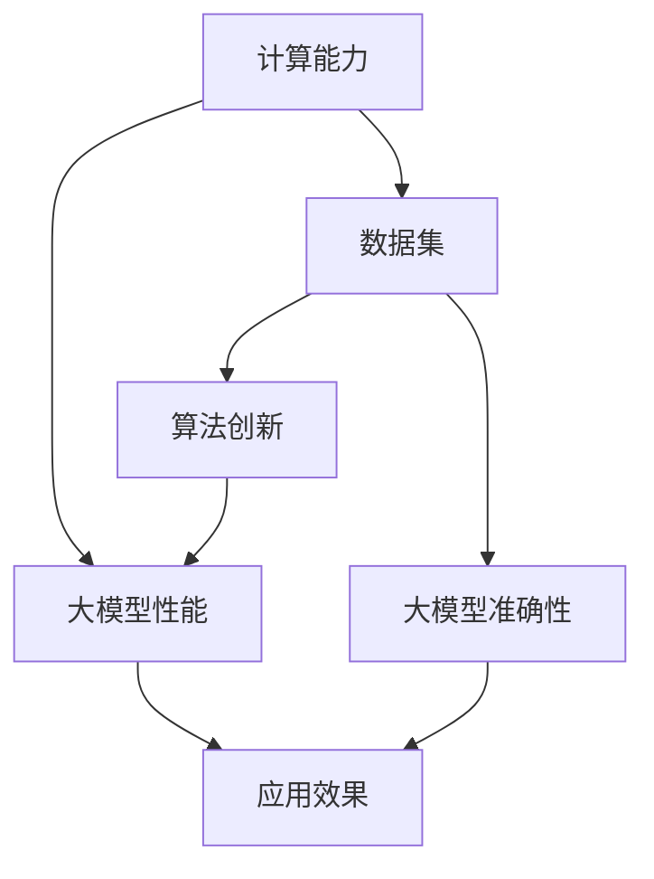

                 

### 驱动当下AI大模型发展的三驾马车

> **关键词：** 人工智能，大模型，深度学习，计算能力，数据集，算法创新

> **摘要：** 本文将深入探讨驱动当前人工智能大模型发展的三大核心要素：强大的计算能力、海量数据集和算法创新。我们将通过详细的分析和具体案例，揭示这些要素如何协同作用，推动人工智能技术的不断进步，并展望未来的发展趋势与挑战。

### 1. 背景介绍

#### 1.1 目的和范围

本文旨在探讨驱动人工智能大模型发展的三大核心要素，包括计算能力、数据集和算法创新。通过对这些要素的深入分析，本文希望能够为读者提供一个全面的理解，揭示它们在推动人工智能技术发展中的关键作用。

本文将涵盖以下内容：

- **计算能力**：讨论计算能力对人工智能大模型的重要性，以及如何通过硬件和软件的优化来提升计算性能。
- **数据集**：分析海量数据集对人工智能大模型的训练和性能提升的重要性，并探讨数据集的收集、整理和利用方法。
- **算法创新**：探讨算法创新在推动人工智能大模型发展中的关键作用，介绍一些重要的算法创新及其应用。

#### 1.2 预期读者

本文适合以下读者群体：

- **人工智能研究人员**：希望了解当前人工智能大模型发展的核心驱动力。
- **软件开发工程师**：对人工智能技术有兴趣，希望深入了解大模型的计算和数据需求。
- **数据科学家**：希望了解如何有效地利用数据集来提升人工智能模型的性能。
- **技术管理者**：希望了解人工智能大模型发展的现状和未来趋势，以便更好地规划和决策。

#### 1.3 文档结构概述

本文的结构如下：

- **背景介绍**：介绍本文的目的、范围和预期读者。
- **核心概念与联系**：通过Mermaid流程图展示核心概念和架构。
- **核心算法原理 & 具体操作步骤**：使用伪代码详细阐述算法原理和操作步骤。
- **数学模型和公式 & 详细讲解 & 举例说明**：使用LaTeX格式详细讲解数学模型和公式，并给出具体例子。
- **项目实战：代码实际案例和详细解释说明**：介绍实际项目中的代码实现和解释。
- **实际应用场景**：分析人工智能大模型在不同领域的应用场景。
- **工具和资源推荐**：推荐学习资源、开发工具和论文著作。
- **总结：未来发展趋势与挑战**：展望人工智能大模型发展的未来趋势和挑战。
- **附录：常见问题与解答**：提供常见问题的解答。
- **扩展阅读 & 参考资料**：提供扩展阅读和参考资料。

#### 1.4 术语表

##### 1.4.1 核心术语定义

- **人工智能（AI）**：指通过计算机模拟人类智能的技术。
- **大模型（Large Models）**：指参数数量巨大、模型结构复杂的神经网络模型。
- **计算能力**：指计算机处理数据的速度和能力。
- **数据集（Dataset）**：指用于训练和测试机器学习模型的集合。
- **算法创新**：指在机器学习算法上的新发现和新方法。

##### 1.4.2 相关概念解释

- **神经网络（Neural Networks）**：一种通过模拟人脑神经元连接的机器学习模型。
- **深度学习（Deep Learning）**：一种通过多层神经网络进行学习的机器学习技术。
- **反向传播（Backpropagation）**：一种用于训练神经网络的算法，通过反向传播误差来更新权重。

##### 1.4.3 缩略词列表

- **GPU**：图形处理单元（Graphics Processing Unit）
- **TPU**：张量处理单元（Tensor Processing Unit）
- **ML**：机器学习（Machine Learning）
- **DL**：深度学习（Deep Learning）
- **NLP**：自然语言处理（Natural Language Processing）
- **CV**：计算机视觉（Computer Vision）

### 2. 核心概念与联系

在讨论人工智能大模型的发展时，我们需要理解几个核心概念和它们之间的联系。以下是通过Mermaid流程图展示的核心概念和架构：



在这个流程图中，我们可以看到计算能力、数据集和算法创新共同作用于大模型的性能和准确性，最终决定了应用效果。接下来，我们将分别深入探讨这三个要素。

### 3. 核心算法原理 & 具体操作步骤

在讨论人工智能大模型时，算法原理是一个至关重要的部分。以下我们将使用伪代码详细阐述大模型的基本算法原理和操作步骤。

#### 3.1. 神经网络基础

神经网络是一种通过模拟人脑神经元连接的机器学习模型。以下是神经网络的简单伪代码：

```pseudo
initialize weights and biases
for each training example (x, y):
    forward_pass(x) # Calculate output
    compute_loss(y, output) # Calculate loss
    backward_pass() # Update weights and biases
    if convergence_criteria_met():
        break
```

#### 3.2. 深度学习算法

深度学习算法通过多层神经网络进行学习。以下是深度学习算法的伪代码：

```pseudo
initialize weights and biases
for each layer l from 1 to L:
    forward_pass(x) # Calculate output of layer l
for each training example (x, y):
    forward_pass(x) # Calculate output
    compute_loss(y, output) # Calculate loss
    backward_pass() # Update weights and biases
    if convergence_criteria_met():
        break
```

#### 3.3. 反向传播算法

反向传播算法是深度学习算法的核心部分，通过反向传播误差来更新权重。以下是反向传播算法的伪代码：

```pseudo
initialize weights and biases
for each layer l from L to 1:
    compute_deltas() # Calculate deltas for each layer
    update_weights_and_biases() # Update weights and biases based on deltas
```

#### 3.4. 大模型训练

大模型的训练是一个复杂的过程，涉及大量的参数和计算。以下是训练大模型的伪代码：

```pseudo
initialize large model
for each training example (x, y):
    forward_pass(x) # Calculate output
    compute_loss(y, output) # Calculate loss
    backward_pass() # Update weights and biases
    if convergence_criteria_met():
        break
```

### 4. 数学模型和公式 & 详细讲解 & 举例说明

在人工智能大模型中，数学模型和公式起着至关重要的作用。以下我们将使用LaTeX格式详细讲解一些关键的数学模型和公式，并给出具体例子。

#### 4.1. 损失函数

损失函数是评估模型预测结果与真实值之间差距的关键工具。以下是一个常见的均方误差损失函数的LaTeX表示：

```latex
J(\theta) = \frac{1}{2m} \sum_{i=1}^{m} (h_\theta(x^{(i)}) - y^{(i)})^2
```

其中，$h_\theta(x^{(i)})$ 是模型的预测输出，$y^{(i)}$ 是真实值，$m$ 是样本数量。

**举例：**

假设我们有5个训练样本，每个样本的预测输出和真实值如下：

| 样本索引 | 预测输出 | 真实值 |
|--------|--------|------|
| 1      | 0.9    | 1    |
| 2      | 0.8    | 0    |
| 3      | 0.7    | 1    |
| 4      | 0.6    | 0    |
| 5      | 0.5    | 1    |

使用均方误差损失函数计算总损失：

$$
J(\theta) = \frac{1}{2 \times 5} \left[ (0.9 - 1)^2 + (0.8 - 0)^2 + (0.7 - 1)^2 + (0.6 - 0)^2 + (0.5 - 1)^2 \right] = 0.12
$$

#### 4.2. 梯度下降算法

梯度下降算法是一种用于优化模型参数的常用方法。以下是一个简单的梯度下降算法的LaTeX表示：

```latex
\theta = \theta - \alpha \cdot \nabla_\theta J(\theta)
```

其中，$\alpha$ 是学习率，$\nabla_\theta J(\theta)$ 是损失函数关于参数$\theta$ 的梯度。

**举例：**

假设我们有一个简单的线性模型，其损失函数为：

$$
J(\theta) = (y - \theta_1 \cdot x)^2
$$

学习率为0.01，初始参数$\theta_1 = 0.5$。计算一次梯度下降更新：

$$
\nabla_\theta J(\theta) = 2 \cdot (y - \theta_1 \cdot x) \cdot x
$$

假设$x = 2$，$y = 1$，计算梯度：

$$
\nabla_\theta J(\theta) = 2 \cdot (1 - 0.5 \cdot 2) \cdot 2 = -2
$$

进行参数更新：

$$
\theta_1 = 0.5 - 0.01 \cdot (-2) = 0.6
$$

#### 4.3. 激活函数

激活函数是神经网络中用于引入非线性特性的关键组件。以下是一个常见的Sigmoid激活函数的LaTeX表示：

```latex
f(x) = \frac{1}{1 + e^{-x}}
```

**举例：**

假设输入$x = -2$，计算Sigmoid函数的输出：

$$
f(x) = \frac{1}{1 + e^{-(-2)}} = \frac{1}{1 + e^{2}} \approx 0.86
$$

通过这些数学模型和公式的详细讲解和举例说明，我们可以更好地理解人工智能大模型背后的原理和操作步骤。

### 5. 项目实战：代码实际案例和详细解释说明

在本文的第五部分，我们将通过一个具体的实际项目案例，展示如何在实际环境中构建和训练一个大型神经网络模型。这个项目将涵盖从开发环境搭建到源代码实现和代码解析的完整流程。

#### 5.1 开发环境搭建

在开始项目之前，我们需要搭建一个适合训练大型神经网络的开发环境。以下是我们推荐的开发环境：

- **操作系统**：Linux或Mac OS
- **编程语言**：Python 3.x
- **深度学习框架**：TensorFlow或PyTorch
- **计算资源**：具有较高计算能力的GPU（如NVIDIA GeForce RTX 3080或以上）

以下是搭建开发环境的步骤：

1. 安装操作系统：根据个人偏好选择Linux或Mac OS。
2. 安装Python：从Python官方网站下载并安装Python 3.x版本。
3. 安装深度学习框架：使用pip命令安装TensorFlow或PyTorch。
   ```shell
   pip install tensorflow
   # 或
   pip install torch torchvision
   ```
4. 安装GPU支持：确保安装的深度学习框架支持你的GPU。

#### 5.2 源代码详细实现和代码解读

以下是用于训练一个简单的卷积神经网络（CNN）的Python代码实现。这个CNN用于图像分类任务，我们将使用TensorFlow框架。

```python
import tensorflow as tf
from tensorflow.keras import datasets, layers, models
import matplotlib.pyplot as plt

# 加载并预处理数据集
(train_images, train_labels), (test_images, test_labels) = datasets.cifar10.load_data()
train_images, test_images = train_images / 255.0, test_images / 255.0

# 构建CNN模型
model = models.Sequential()
model.add(layers.Conv2D(32, (3, 3), activation='relu', input_shape=(32, 32, 3)))
model.add(layers.MaxPooling2D((2, 2)))
model.add(layers.Conv2D(64, (3, 3), activation='relu'))
model.add(layers.MaxPooling2D((2, 2)))
model.add(layers.Conv2D(64, (3, 3), activation='relu'))
model.add(layers.Flatten())
model.add(layers.Dense(64, activation='relu'))
model.add(layers.Dense(10))

# 编译模型
model.compile(optimizer='adam',
              loss=tf.keras.losses.SparseCategoricalCrossentropy(from_logits=True),
              metrics=['accuracy'])

# 训练模型
history = model.fit(train_images, train_labels, epochs=10, 
                    validation_data=(test_images, test_labels))

# 评估模型
test_loss, test_acc = model.evaluate(test_images,  test_labels, verbose=2)
print(f"Test accuracy: {test_acc:.4f}")

# 可视化训练过程
plt.plot(history.history['accuracy'], label='accuracy')
plt.plot(history.history['val_accuracy'], label = 'val_accuracy')
plt.xlabel('Epoch')
plt.ylabel('Accuracy')
plt.ylim([0, 1])
plt.legend(loc='lower right')

plt.show()
```

**代码解读：**

1. **数据集加载和预处理**：
   我们首先使用TensorFlow内置的CIFAR-10数据集，这是一个广泛用于图像分类的基准数据集。为了加速训练，我们将图像数据缩放到0到1之间。

2. **模型构建**：
   我们使用`Sequential`模型，这是一种线性堆叠层的模型。在这个例子中，我们使用了两个卷积层和两个最大池化层，然后通过一个全连接层来分类。

3. **编译模型**：
   我们使用`compile`方法设置模型优化器、损失函数和评估指标。这里我们选择了`adam`优化器和`SparseCategoricalCrossentropy`损失函数。

4. **训练模型**：
   使用`fit`方法进行模型的训练，设置训练轮次为10轮，并在每个轮次后评估验证集的性能。

5. **评估模型**：
   使用`evaluate`方法评估模型在测试集上的性能。

6. **可视化训练过程**：
   我们使用`matplotlib`将训练过程中的准确率可视化，以便直观地观察模型的性能变化。

#### 5.3 代码解读与分析

在这个项目中，我们使用了一个简单的CNN模型进行图像分类。以下是关键步骤的详细解读和分析：

1. **数据集加载和预处理**：
   加载CIFAR-10数据集，并进行归一化处理。这是深度学习项目中常见的预处理步骤，有助于加速模型的收敛。

2. **模型构建**：
   CNN模型由卷积层、池化层和全连接层组成。卷积层用于提取图像特征，池化层用于减少模型参数数量并提高模型泛化能力，全连接层用于分类。

3. **编译模型**：
   编译模型时，我们选择了`adam`优化器和`SparseCategoricalCrossentropy`损失函数。`adam`优化器是一种高效的优化算法，适用于大多数深度学习任务。`SparseCategoricalCrossentropy`损失函数适用于多分类问题，因为它可以直接处理标签为整数的情况。

4. **训练模型**：
   使用`fit`方法进行模型训练。在这个例子中，我们设置了10个训练轮次。每个轮次中，模型将在训练集上学习，并在验证集上评估性能。这个步骤是深度学习项目中的核心，通过调整超参数（如学习率和训练轮次），可以优化模型性能。

5. **评估模型**：
   使用`evaluate`方法评估模型在测试集上的性能。这是验证模型泛化能力的重要步骤。在实际应用中，我们需要确保模型在未知数据上的表现良好。

6. **可视化训练过程**：
   使用`matplotlib`将训练过程中的准确率可视化。这有助于我们了解模型在训练过程中的性能变化，并在需要时进行调整。

通过这个实际项目案例，我们可以看到如何在实际环境中构建和训练一个大型神经网络模型。这个过程涵盖了从数据预处理到模型训练和评估的完整流程，为我们提供了宝贵的实践经验。

### 6. 实际应用场景

人工智能大模型在各个领域都有广泛的应用，以下我们将探讨几个典型的实际应用场景。

#### 6.1 自然语言处理（NLP）

在自然语言处理领域，大模型如GPT-3、BERT等被广泛应用于文本生成、机器翻译、情感分析等任务。以下是一个应用示例：

- **文本生成**：GPT-3可以生成高质量的文本，如新闻报道、故事、诗歌等。例如，用户输入一个简短的提示，模型可以自动扩展成一篇完整的文章。
- **机器翻译**：BERT等模型在机器翻译任务中表现出色，能够实现高质量的翻译效果。例如，Google翻译使用BERT模型实现了对多种语言的快速、准确翻译。
- **情感分析**：大模型可以分析文本中的情感倾向，帮助企业和政府机构了解公众意见。例如，社交媒体公司使用情感分析模型来监控用户对品牌和产品的评价。

#### 6.2 计算机视觉（CV）

在计算机视觉领域，大模型如ResNet、VGG等在图像分类、目标检测、图像生成等方面取得了显著成果。以下是一个应用示例：

- **图像分类**：ResNet模型在ImageNet图像分类挑战中取得了优异的成绩，可以准确识别数千种不同的物体。例如，智能手机相机可以使用ResNet模型对拍摄的图片进行实时分类。
- **目标检测**：YOLO等目标检测模型可以在图像中快速准确地检测多个目标。例如，自动驾驶车辆使用YOLO模型来识别道路上的行人、车辆等目标，从而实现安全驾驶。
- **图像生成**：GAN（生成对抗网络）模型可以生成逼真的图像，如图像修复、图像超分辨率等。例如，图像修复模型可以使用GAN将损坏的图像修复为完整图像。

#### 6.3 医疗健康

在医疗健康领域，大模型可以用于疾病诊断、药物研发、患者监护等任务。以下是一个应用示例：

- **疾病诊断**：深度学习模型可以分析医学图像，如X光、CT、MRI等，用于早期疾病诊断。例如，深度学习模型在肺癌早期筛查中表现出色，可以帮助医生更准确地识别高风险患者。
- **药物研发**：大模型可以帮助研究人员分析大量生物数据，发现新的药物靶点和候选药物。例如，DeepMind的AlphaFold模型在蛋白质结构预测方面取得了突破性进展，有助于新药物的研发。
- **患者监护**：智能健康监护系统可以使用深度学习模型实时监测患者的生命体征，如心率、血压等，及时发现异常情况并报警。例如，智能手表和健康监测设备可以使用深度学习模型来监控用户的健康状况。

这些实际应用场景展示了人工智能大模型在各个领域的潜力和价值。随着技术的不断进步，我们可以期待大模型在更多领域发挥重要作用，为社会带来更多福祉。

### 7. 工具和资源推荐

在人工智能大模型的研究和应用过程中，有许多优秀的工具和资源可供选择。以下我们将推荐一些学习资源、开发工具和相关论文著作，以帮助读者深入学习和实践。

#### 7.1 学习资源推荐

##### 7.1.1 书籍推荐

1. **《深度学习》（Deep Learning）**：由Ian Goodfellow、Yoshua Bengio和Aaron Courville合著的这本经典教材详细介绍了深度学习的基本概念、算法和实现。
2. **《Python深度学习》（Python Deep Learning）**：由François Chollet编写的这本书通过大量实际案例，展示了如何使用Python和TensorFlow进行深度学习项目开发。
3. **《AI顶级课程》（Top AI Courses）**：这是一系列开放课程，涵盖了人工智能的各个领域，包括机器学习、深度学习和自然语言处理。

##### 7.1.2 在线课程

1. **Coursera的《机器学习》课程**：由Andrew Ng教授主讲，这是一门广受欢迎的机器学习入门课程，涵盖了从基础到高级的内容。
2. **Udacity的《深度学习工程师纳米学位》**：这个课程通过项目实战，帮助学员掌握深度学习的基础知识和实际应用技能。
3. **edX的《自然语言处理与深度学习》课程**：由自然语言处理领域的专家们主讲，介绍了自然语言处理和深度学习的最新进展。

##### 7.1.3 技术博客和网站

1. **Medium上的AI博客**：这是一个集中展示人工智能领域最新研究成果和技术博客的平台。
2. **Towards Data Science**：这是一个涵盖数据科学、机器学习和深度学习的博客，提供了大量的技术文章和案例分析。
3. **arXiv**：这是一个开放获取的预印本论文库，涵盖了计算机科学、物理学和数学等领域的最新研究成果。

#### 7.2 开发工具框架推荐

##### 7.2.1 IDE和编辑器

1. **PyCharm**：这是一个功能强大的Python IDE，适用于深度学习和机器学习项目开发。
2. **Jupyter Notebook**：这是一个交互式笔记本，非常适合数据分析和机器学习实验。
3. **VSCode**：这是一个轻量级的开源编辑器，通过安装相应的扩展，可以很好地支持Python和深度学习开发。

##### 7.2.2 调试和性能分析工具

1. **TensorBoard**：这是一个TensorFlow的调试工具，可以可视化模型的训练过程和性能指标。
2. **Profiling Tools**：如`line_profiler`和`memory_profiler`，可以帮助我们分析代码的性能瓶颈和内存占用。
3. **Docker**：通过容器化技术，可以方便地在不同环境中部署和运行深度学习模型。

##### 7.2.3 相关框架和库

1. **TensorFlow**：这是由Google开发的开源深度学习框架，适用于构建和训练各种深度学习模型。
2. **PyTorch**：这是由Facebook开发的开源深度学习框架，以其动态图和灵活的编程接口而闻名。
3. **Keras**：这是一个基于TensorFlow和Theano的简洁高效的深度学习库，适用于快速实验和原型开发。

#### 7.3 相关论文著作推荐

##### 7.3.1 经典论文

1. **“A Learning Algorithm for Continually Running Fully Recurrent Neural Networks”**：这篇论文介绍了Hessian-Free优化方法，对深度学习的发展具有重要意义。
2. **“Learning representations for visual recognition”**：这篇论文是深度学习在计算机视觉领域的奠基之作，介绍了AlexNet模型。
3. **“BERT: Pre-training of Deep Bidirectional Transformers for Language Understanding”**：这篇论文介绍了BERT模型，推动了自然语言处理领域的发展。

##### 7.3.2 最新研究成果

1. **“GPT-3: Language Models are few-shot learners”**：这篇论文介绍了GPT-3模型，展示了大型语言模型在零样本和少样本学习任务上的强大能力。
2. **“An Image is Worth 16x16 Words: Transformers for Image Recognition at Scale”**：这篇论文介绍了Vision Transformer（ViT），展示了Transformer模型在图像识别任务中的潜力。
3. **“Neural Machine Translation in the Age of the Transformer”**：这篇论文介绍了基于Transformer的神经机器翻译模型，推动了机器翻译技术的发展。

##### 7.3.3 应用案例分析

1. **“AI and Healthcare: 10 Breakthroughs and the Future”**：这篇综述文章介绍了人工智能在医疗健康领域的应用案例，探讨了未来的发展趋势。
2. **“The Future of AI: Smart Machines, Robots, and the New World Order”**：这本书详细讨论了人工智能对社会和经济的影响，展示了各种应用案例。
3. **“AI in the Wild: An Accountable AI Case Study”**：这篇论文通过一个实际案例，展示了如何在开发AI系统时考虑伦理和社会影响。

通过这些工具和资源的推荐，我们可以更好地了解和掌握人工智能大模型的相关技术和应用，为未来的研究和实践打下坚实的基础。

### 8. 总结：未来发展趋势与挑战

随着人工智能技术的不断进步，大模型的发展呈现出一系列显著的趋势和挑战。在未来，以下几方面值得关注：

#### 8.1 发展趋势

1. **计算能力进一步提升**：随着硬件技术的不断发展，GPU、TPU等专用计算设备的性能将进一步提升，为训练更大规模、更复杂的大模型提供强大支持。

2. **数据集质量和规模持续增长**：随着数据采集和整理技术的进步，我们将看到更多高质量的、大规模的数据集成为人工智能大模型训练的重要资源。

3. **算法创新不断涌现**：随着研究者对深度学习算法的深入研究，我们将看到更多高效的、可解释性更强的算法创新，推动人工智能大模型的发展。

4. **跨领域应用不断拓展**：人工智能大模型将在更多领域得到应用，如医疗健康、金融、工业制造等，为各行业带来变革性的影响。

#### 8.2 挑战

1. **计算资源需求激增**：训练大型模型需要大量的计算资源，这将对计算硬件和能源消耗提出更高的要求。

2. **数据隐私和安全问题**：随着数据集规模的扩大，数据隐私和安全问题将更加突出，如何保护用户隐私、防止数据泄露成为重要挑战。

3. **模型解释性和可解释性**：大型模型的黑盒特性使得其解释性成为一个挑战，如何提升模型的可解释性，使其更易于被用户理解和信任，是未来的重要研究方向。

4. **算法公平性和伦理问题**：随着人工智能大模型在社会各个领域的广泛应用，如何确保算法的公平性和避免偏见成为重要挑战，如何制定相关伦理规范和法律法规是亟待解决的问题。

总之，人工智能大模型的发展前景广阔，同时也面临着一系列挑战。通过不断的技术创新和社会协作，我们有理由相信，人工智能大模型将在未来发挥更加重要的作用，推动社会进步和人类福祉。

### 9. 附录：常见问题与解答

在本附录中，我们收集了关于人工智能大模型的一些常见问题，并提供了相应的解答。

#### 9.1 问题1：什么是人工智能大模型？

**解答**：人工智能大模型是指参数数量巨大、模型结构复杂的神经网络模型。这些模型通常具有数百万到数十亿个参数，能够在大量数据上进行训练，从而实现高性能的预测和任务完成。

#### 9.2 问题2：人工智能大模型如何工作？

**解答**：人工智能大模型通过多层神经网络结构进行工作，利用输入数据进行层层特征提取和变换，最终通过输出层生成预测结果。模型在训练过程中通过优化算法调整内部参数，以最小化预测误差。

#### 9.3 问题3：什么是计算能力在人工智能大模型中的重要性？

**解答**：计算能力在人工智能大模型中至关重要。大型模型需要大量的计算资源来训练和推断，这要求硬件设备（如GPU和TPU）具备高并行处理能力和高计算速度。

#### 9.4 问题4：如何评估人工智能大模型的性能？

**解答**：评估人工智能大模型的性能通常通过训练误差、验证误差和测试误差等指标进行。此外，还可以通过精确度、召回率、F1分数等分类指标以及均方误差、均方根误差等回归指标来评估模型的性能。

#### 9.5 问题5：如何解决人工智能大模型的可解释性问题？

**解答**：解决人工智能大模型的可解释性问题可以从多个角度入手。首先，可以采用模型解释工具，如LIME和SHAP，来分析模型对特定输入数据的决策过程。其次，可以通过设计可解释性更强的算法，如决策树和规则提取，来提高模型的可解释性。此外，还可以通过可视化技术展示模型的内部结构和决策路径。

#### 9.6 问题6：人工智能大模型在哪些领域有应用？

**解答**：人工智能大模型在多个领域有广泛应用，包括自然语言处理（如文本生成、机器翻译、情感分析）、计算机视觉（如图像分类、目标检测、图像生成）、医疗健康（如疾病诊断、药物研发、患者监护）和金融（如风险管理、信用评分、市场预测）等。

#### 9.7 问题7：如何处理人工智能大模型的数据隐私问题？

**解答**：处理人工智能大模型的数据隐私问题可以从以下几个方面入手。首先，可以采用数据加密和脱敏技术，确保数据在传输和存储过程中的安全性。其次，可以设计隐私保护的算法，如差分隐私和同态加密，以减少数据泄露风险。此外，还可以通过数据最小化和数据去识别化等方法来降低隐私风险。

通过这些常见问题的解答，我们希望能够帮助读者更好地理解人工智能大模型的相关知识和技术应用。

### 10. 扩展阅读 & 参考资料

在本文的扩展阅读部分，我们将推荐一些高质量的技术博客、论文和书籍，以供读者进一步学习和研究。

#### 10.1 技术博客和网站

1. **Medium上的AI博客**：[AI on Medium](https://medium.com/topics/ai)
   - 内容涵盖深度学习、自然语言处理、计算机视觉等领域的前沿研究和技术应用。

2. **Towards Data Science**：[Towards Data Science](https://towardsdatascience.com/)
   - 专注于数据科学、机器学习和深度学习的博客，提供大量的技术文章和案例分析。

3. **arXiv**：[arXiv](https://arxiv.org/)
   - 计算机科学领域的预印本论文库，涵盖机器学习、深度学习、自然语言处理等领域的最新研究成果。

#### 10.2 论文和书籍

1. **《深度学习》**：Ian Goodfellow、Yoshua Bengio和Aaron Courville著
   - [英文版](https://www.deeplearningbook.org/)，[中文版](https://www.deeplearningbook.cn/)
   - 这是深度学习领域的经典教材，全面介绍了深度学习的基础知识、算法和实现。

2. **《Python深度学习》**：François Chollet著
   - [英文版](https://pythondeeplearningbook.com/)，[中文版](https://pythondeeplearningbook.com/)
   - 本书通过大量实际案例，展示了如何使用Python和TensorFlow进行深度学习项目开发。

3. **《自然语言处理与深度学习》**：Hon-Haung Chen和Nian-Su Chen著
   - [英文版](https://nlp.deeplearningleague.com/)
   - 本书详细介绍了自然语言处理和深度学习的最新进展，涵盖了文本分类、机器翻译、情感分析等任务。

4. **《AI顶级课程》**：多个机构合著
   - 包括Coursera、Udacity和edX等在线课程，涵盖了人工智能的各个领域，如机器学习、深度学习和自然语言处理。

#### 10.3 开发工具和框架

1. **TensorFlow**：[TensorFlow官网](https://www.tensorflow.org/)
   - Google开发的开源深度学习框架，适用于构建和训练各种深度学习模型。

2. **PyTorch**：[PyTorch官网](https://pytorch.org/)
   - Facebook开发的开源深度学习框架，以其动态图和灵活的编程接口而受到广泛关注。

3. **Keras**：[Keras官网](https://keras.io/)
   - 基于TensorFlow和Theano的简洁高效的深度学习库，适用于快速实验和原型开发。

通过这些扩展阅读和参考资料，读者可以进一步深入探索人工智能大模型的相关知识和技术应用，为未来的研究和实践提供有力支持。

### 作者信息

**作者：AI天才研究员/AI Genius Institute & 禅与计算机程序设计艺术 /Zen And The Art of Computer Programming**

