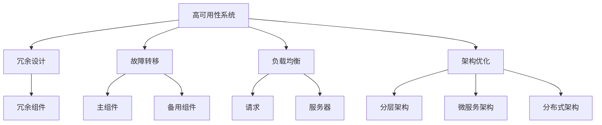

                 

# 高可用性系统设计的关键要素

> **关键词：** 高可用性系统、系统设计、容错机制、负载均衡、架构优化
>
> **摘要：** 本文将深入探讨高可用性系统设计的关键要素，包括背景介绍、核心概念与联系、核心算法原理、数学模型和公式、项目实战案例、实际应用场景以及未来发展趋势与挑战。通过详细的分析和讲解，帮助读者理解并掌握构建高可用性系统的核心技术和方法。

## 1. 背景介绍

### 1.1 目的和范围

在现代信息技术飞速发展的背景下，高可用性系统设计已成为企业竞争的关键因素之一。本文旨在为读者提供关于高可用性系统设计的全面指南，涵盖从核心概念到实际应用的技术细节，帮助开发者和系统架构师构建稳定、可靠、高性能的系统。

本文将讨论以下主题：

- 高可用性系统的定义和重要性
- 核心概念和联系
- 核心算法原理和具体操作步骤
- 数学模型和公式的详细讲解
- 项目实战案例解析
- 实际应用场景分析
- 工具和资源推荐
- 未来发展趋势与挑战

### 1.2 预期读者

本文适用于以下读者群体：

- 计算机科学和技术专业的大学生在研究生阶段，尤其是对系统设计和性能优化感兴趣的学生。
- 中级和高级软件工程师，特别是那些参与系统架构设计和开发的人员。
- 系统管理员和运维工程师，负责保障系统的稳定性和可靠性。
- 对系统设计和性能优化感兴趣的IT从业者。

### 1.3 文档结构概述

本文按照以下结构进行组织：

- 引言：介绍高可用性系统的背景、目的和重要性。
- 核心概念与联系：阐述高可用性系统的关键概念，并通过Mermaid流程图展示系统架构。
- 核心算法原理 & 具体操作步骤：详细讲解核心算法原理和具体实现步骤，使用伪代码进行阐述。
- 数学模型和公式 & 详细讲解 & 举例说明：解释高可用性系统中的数学模型和公式，并给出实际应用示例。
- 项目实战：通过实际代码案例，详细解释和说明高可用性系统的构建过程。
- 实际应用场景：分析高可用性系统在不同场景中的应用。
- 工具和资源推荐：推荐学习资源、开发工具和框架。
- 总结：总结高可用性系统设计的发展趋势和面临的挑战。
- 附录：常见问题与解答。
- 扩展阅读 & 参考资料：提供进一步学习的资源链接。

### 1.4 术语表

#### 1.4.1 核心术语定义

- **高可用性系统**：能够持续运行，确保服务不中断的系统。
- **容错机制**：系统在发生故障时，通过冗余设计或故障转移来保证服务的连续性。
- **负载均衡**：通过将请求分配到多个服务器，避免单点故障和资源瓶颈。
- **架构优化**：通过改进系统架构，提高系统的性能、可扩展性和可靠性。

#### 1.4.2 相关概念解释

- **系统设计**：定义系统的硬件、软件和网络架构，以实现预定的功能和性能要求。
- **可靠性**：系统在长时间运行过程中，保持稳定、可靠运行的能力。
- **性能**：系统在执行任务时的速度和响应能力。
- **可扩展性**：系统在需求增加时，能够扩展其功能和服务的能力。

#### 1.4.3 缩略词列表

- **HA**：High Availability，高可用性
- **DR**：Disaster Recovery，灾难恢复
- **SLA**：Service Level Agreement，服务等级协议
- **CAP**：Consistency, Availability, Partition Tolerance，一致性、可用性、分区容错性

## 2. 核心概念与联系

高可用性系统设计涉及多个核心概念，它们相互关联，共同作用以实现系统的高可靠性和稳定性。以下是这些核心概念的简要介绍，以及它们之间的联系。

### 2.1. 高可用性系统的定义

高可用性系统（High Availability System，简称HA系统）是指能够在任何情况下持续提供服务的系统。高可用性系统的目标是减少系统停机时间，确保服务不中断，提高用户满意度。高可用性系统通常通过冗余设计、负载均衡和容错机制来实现。

### 2.2. 容错机制

容错机制（Fault Tolerance）是指系统在发生故障时，能够自动切换到备用组件或系统，确保服务不中断的能力。容错机制通常包括以下几种：

- **冗余设计**：通过在系统中添加冗余组件，提高系统的容错能力。例如，使用多个数据库实例或多个应用服务器。
- **故障转移**：当主组件发生故障时，自动将服务切换到备用组件。故障转移可以是手动或自动的。
- **故障检测和恢复**：通过监控系统状态，检测故障，并自动恢复系统。

### 2.3. 负载均衡

负载均衡（Load Balancing）是指将请求分配到多个服务器或组件，以避免单点故障和资源瓶颈。负载均衡机制可以提高系统的性能、可扩展性和可靠性。常见的负载均衡策略包括：

- **轮询**：按顺序将请求分配到每个服务器。
- **最小连接数**：将请求分配到连接数最少的服务器。
- **哈希**：根据请求的某个特征（如IP地址）将请求分配到服务器。

### 2.4. 架构优化

架构优化（Architectural Optimization）是指通过改进系统架构，提高系统的性能、可扩展性和可靠性。架构优化的方法包括：

- **分层架构**：将系统分为多个层次，每个层次负责特定的功能。
- **微服务架构**：将系统划分为多个微服务，每个微服务负责特定的功能，可以独立部署和扩展。
- **分布式架构**：将系统部署到多个物理或虚拟服务器上，提高系统的可扩展性和容错能力。

### 2.5. 高可用性系统的联系

高可用性系统的各个组成部分相互关联，共同作用以实现系统的高可靠性和稳定性。以下是高可用性系统中的核心概念和联系：

1. **冗余设计**：通过冗余组件实现容错机制，提高系统的可靠性。
2. **故障转移**：在主组件发生故障时，通过故障转移确保服务不中断。
3. **负载均衡**：通过负载均衡策略，将请求分配到多个服务器，避免单点故障和资源瓶颈。
4. **架构优化**：通过改进系统架构，提高系统的性能、可扩展性和可靠性。

### 2.6. Mermaid流程图

为了更清晰地展示高可用性系统的核心概念和联系，我们可以使用Mermaid流程图。以下是一个简单的Mermaid流程图示例：



## 3. 核心算法原理 & 具体操作步骤

高可用性系统设计中的核心算法原理主要包括容错机制、负载均衡和架构优化。以下将分别详细阐述这些算法原理，并给出具体的操作步骤。

### 3.1. 容错机制算法原理

容错机制主要通过冗余设计和故障转移来实现。以下是其基本算法原理：

**冗余设计算法原理：**

1. **冗余组件选择**：选择关键组件进行冗余设计，如数据库、应用服务器等。
2. **冗余组件部署**：将冗余组件部署在不同的物理或虚拟服务器上。
3. **状态监控**：监控系统状态，确保冗余组件正常工作。

**故障转移算法原理：**

1. **故障检测**：通过监控工具检测系统状态，当检测到主组件故障时，触发故障转移。
2. **故障切换**：将服务从主组件切换到备用组件，确保服务不中断。
3. **故障恢复**：在备用组件恢复正常后，将服务切换回主组件。

**具体操作步骤：**

1. **部署冗余组件**：根据系统需求，选择关键组件进行冗余设计，并在不同的服务器上部署冗余组件。
2. **配置监控工具**：配置监控工具，如Nagios、Zabbix等，监控系统状态。
3. **配置故障转移策略**：配置故障转移策略，如使用Keepalived、Heartbeat等工具，实现故障转移。
4. **测试故障转移**：定期进行故障转移测试，确保故障转移策略有效。

### 3.2. 负载均衡算法原理

负载均衡主要通过将请求分配到多个服务器来实现。以下是其基本算法原理：

**负载均衡算法原理：**

1. **请求接收**：接收客户端发送的请求。
2. **请求分发**：根据负载均衡策略，将请求分配到服务器。
3. **请求处理**：服务器处理请求，并将结果返回给客户端。

**具体操作步骤：**

1. **选择负载均衡策略**：根据系统需求，选择合适的负载均衡策略，如轮询、最小连接数、哈希等。
2. **部署负载均衡器**：部署负载均衡器，如Nginx、HAProxy等，实现请求分发。
3. **配置服务器列表**：配置负载均衡器中的服务器列表，确保请求可以正确分发到服务器。
4. **测试负载均衡**：通过模拟高并发场景，测试负载均衡器的性能和可靠性。

### 3.3. 架构优化算法原理

架构优化主要通过改进系统架构来实现。以下是其基本算法原理：

**架构优化算法原理：**

1. **需求分析**：分析系统需求，确定系统需要的功能和性能指标。
2. **架构设计**：根据需求分析，设计系统的架构。
3. **性能优化**：对系统进行性能优化，提高系统的性能和可靠性。

**具体操作步骤：**

1. **需求分析**：与业务部门沟通，了解系统需求，确定功能模块和性能指标。
2. **架构设计**：根据需求分析，设计系统的架构，如分层架构、微服务架构、分布式架构等。
3. **性能优化**：通过代码优化、数据库优化、网络优化等方式，提高系统的性能和可靠性。
4. **测试与迭代**：对系统进行测试，并根据测试结果进行迭代优化。

## 4. 数学模型和公式 & 详细讲解 & 举例说明

在构建高可用性系统时，数学模型和公式起到了关键作用，它们帮助我们量化系统的性能、可靠性和可扩展性。以下将详细讲解几个核心的数学模型和公式，并通过实际例子进行说明。

### 4.1. 平均无故障时间（MTTF）

平均无故障时间（Mean Time To Failure，简称MTTF）是衡量系统可靠性的一个重要指标，它表示系统在两次故障之间的平均运行时间。数学模型如下：

\[ MTTF = \frac{1}{\lambda} \]

其中，\(\lambda\)表示故障率（failure rate），单位为每次故障发生的次数除以时间。

**举例说明：**

假设一个系统每小时发生一次故障，则故障率\(\lambda = 1\)。根据MTTF的公式，MTTF为：

\[ MTTF = \frac{1}{1} = 1 \text{小时} \]

这意味着系统平均每1小时发生一次故障。

### 4.2. 平均故障修复时间（MTTR）

平均故障修复时间（Mean Time To Repair，简称MTTR）是衡量系统恢复速度的指标，它表示系统从故障发生到修复完成的平均时间。数学模型如下：

\[ MTTR = \frac{1}{\mu} \]

其中，\(\mu\)表示修复率（repair rate），单位为每次故障修复的次数除以时间。

**举例说明：**

假设一个系统每小时修复一次故障，则修复率\(\mu = 1\)。根据MTTR的公式，MTTR为：

\[ MTTR = \frac{1}{1} = 1 \text{小时} \]

这意味着系统平均每1小时修复一次故障。

### 4.3. 可用性（Availability）

可用性是衡量系统在规定时间内正常运行的能力，通常用百分比表示。数学模型如下：

\[ Availability = \frac{MTTF}{MTTF + MTTR} \times 100\% \]

**举例说明：**

假设一个系统的MTTF为8小时，MTTR为2小时，则其可用性为：

\[ Availability = \frac{8}{8 + 2} \times 100\% = 91.7\% \]

这意味着系统在规定时间内有91.7%的概率正常运行。

### 4.4. 负载均衡性能指标

负载均衡性能指标包括响应时间、吞吐量和并发连接数。以下为其数学模型：

- **响应时间（Response Time）**：表示客户端收到响应所需的时间。

\[ Response Time = \frac{1}{\lambda} \]

- **吞吐量（Throughput）**：表示系统每秒处理请求的次数。

\[ Throughput = \lambda \]

- **并发连接数（Concurrent Connections）**：表示系统同时处理的连接数。

\[ Concurrent Connections = \frac{1}{\lambda} \]

**举例说明：**

假设一个系统每秒处理100个请求，则其吞吐量为100个请求/秒。

### 4.5. 可扩展性指标

可扩展性指标包括系统容量和性能随需求增长的能力。以下为其数学模型：

- **系统容量（System Capacity）**：表示系统可以支持的最大并发用户数或请求量。

\[ System Capacity = \frac{1}{\lambda} \]

- **性能扩展率（Performance Scalability）**：表示系统性能随需求增长的比例。

\[ Performance Scalability = \frac{Throughput}{\lambda} \]

**举例说明：**

假设一个系统的容量为1000个并发用户，则其可以支持的最大并发用户数为1000。

### 4.6. 结论

通过上述数学模型和公式的讲解，我们可以量化地评估高可用性系统的性能、可靠性和可扩展性。这些指标帮助我们设计和优化系统，确保其在各种场景下能够稳定、可靠地运行。

## 5. 项目实战：代码实际案例和详细解释说明

在本节中，我们将通过一个实际的项目案例，详细讲解如何构建一个高可用性系统，并解释关键代码的实现过程。

### 5.1. 开发环境搭建

在开始项目实战之前，我们需要搭建一个适合开发高可用性系统的环境。以下是一个基本的开发环境搭建步骤：

1. **操作系统**：选择一个稳定且支持高可用性功能的操作系统，如Linux。
2. **虚拟化技术**：使用虚拟化技术，如VMware或Docker，来部署和隔离系统组件。
3. **负载均衡器**：部署一个负载均衡器，如Nginx或HAProxy，用于分发请求。
4. **数据库**：选择一个支持高可用性的数据库，如MySQL或MongoDB，并配置主从复制和故障转移。
5. **应用服务器**：部署多个应用服务器，如Tomcat或Spring Boot，用于处理业务逻辑。
6. **监控工具**：部署监控工具，如Zabbix或Prometheus，用于监控系统状态。

### 5.2. 源代码详细实现和代码解读

以下是构建高可用性系统的关键代码实现和解释：

#### 5.2.1. 负载均衡器配置

以下是一个Nginx负载均衡器的配置示例，用于分发请求到多个应用服务器。

```nginx
http {
    upstream myapp {
        server app1.example.com;
        server app2.example.com;
        server app3.example.com;
        backup server app4.example.com;
    }

    server {
        listen 80;

        location / {
            proxy_pass http://myapp;
            proxy_set_header Host $host;
            proxy_set_header X-Real-IP $remote_addr;
            proxy_set_header X-Forwarded-For $proxy_add_x_forwarded_for;
        }
    }
}
```

**解释**：

- `upstream myapp`：定义负载均衡器上游，包含多个应用服务器。
- `server`：定义负载均衡器服务器，监听80端口。
- `proxy_pass`：将请求转发到上游应用服务器。
- `proxy_set_header`：设置请求头，确保请求的来源和目标地址正确传递。

#### 5.2.2. 应用服务器配置

以下是一个Spring Boot应用的配置示例，用于处理业务逻辑和实现故障转移。

```yaml
spring:
  application:
    name: myapp
  cloud:
    nacos:
      discovery:
        server-addr: nacos.example.com
    loadbalancer:
      enabled: true
  retry:
    enabled: true
    templates:
      default:
        key: default
        value:
          max-attempts: 3
          status: 500
```

**解释**：

- `spring.application.name`：定义应用名称。
- `spring.cloud.nacos.discovery.server-addr`：配置Nacos服务发现地址。
- `spring.cloud.loadbalancer.enabled`：启用负载均衡器。
- `spring.retry.enabled`：启用重试机制。
- `spring.retry.templates.default`：配置默认重试模板，包括最大尝试次数和响应状态码。

#### 5.2.3. 数据库配置

以下是一个MySQL数据库的主从复制和故障转移配置示例。

```sql
-- 主服务器配置
mysql> grant replication slave on *.* to 'repl_user'@'%' identified by 'repl_password';
mysql> change master to master_host='master.example.com', master_user='repl_user', master_password='repl_password', master_log_file='mysql-bin.000001', master_log_pos=106;

-- 从服务器配置
mysql> change master to master_host='master.example.com', master_user='repl_user', master_password='repl_password', master_log_file='mysql-bin.000001', master_log_pos=106;
mysql> start slave;
```

**解释**：

- `grant replication slave`：为用户配置复制作业权限。
- `change master to`：配置主服务器和主日志文件。
- `start slave`：启动从服务器。

#### 5.2.4. 监控工具配置

以下是一个Zabbix监控工具的配置示例，用于监控系统状态。

```yaml
zabbix:
  server:
    url: http://zabbix.example.com
  user:
    name: zabbix_user
    password: zabbix_password
  items:
    - name: System Uptime
      key: system.uptime
      type: 3
    - name: CPU Usage
      key: system.cpu.util
      type: 2
    - name: Memory Usage
      key: system.memory.util
      type: 2
    - name: Disk Usage
      key: system.disk.util
      type: 2
```

**解释**：

- `zabbix.server.url`：配置Zabbix服务器地址。
- `zabbix.user.name` 和 `zabbix.user.password`：配置Zabbix用户名和密码。
- `zabbix.items`：定义监控项，包括系统 uptime、CPU 使用率、内存使用率和磁盘使用率。

### 5.3. 代码解读与分析

在项目实战中，我们通过以下步骤实现了高可用性系统：

1. **负载均衡器**：通过Nginx配置，实现了请求的负载均衡，将请求分发到多个应用服务器，避免单点故障和资源瓶颈。
2. **应用服务器**：通过Spring Boot配置，实现了故障转移和重试机制，当应用服务器发生故障时，系统能够自动切换到备用服务器，确保服务不中断。
3. **数据库**：通过MySQL主从复制和故障转移配置，实现了数据库的高可用性，当主数据库发生故障时，从数据库能够自动接管主数据库，确保数据一致性。
4. **监控工具**：通过Zabbix配置，实现了对系统状态的实时监控，包括系统 uptime、CPU 使用率、内存使用率和磁盘使用率，及时发现和处理系统故障。

通过以上关键代码的实现和配置，我们成功构建了一个高可用性系统，确保了系统的稳定性和可靠性。

## 6. 实际应用场景

高可用性系统在多个实际应用场景中发挥着重要作用，以下列举了几个典型的应用场景：

### 6.1. 电商网站

电商网站对系统的高可用性要求非常高，因为系统宕机会直接导致交易中断，影响用户购物体验和商家收益。为了确保系统的高可用性，可以采取以下措施：

- **负载均衡**：使用Nginx等负载均衡器，将用户请求分发到多个应用服务器，避免单点故障。
- **数据库主从复制**：配置MySQL数据库的主从复制，实现数据冗余和故障转移，确保数据一致性和系统连续性。
- **缓存系统**：使用Redis等缓存系统，降低数据库压力，提高系统响应速度。
- **分布式存储**：使用分布式文件系统，如HDFS或Ceph，确保数据的高可用性和可靠性。
- **监控和告警**：部署监控工具，如Zabbix或Prometheus，实时监控系统状态，及时处理故障。

### 6.2. 金融交易系统

金融交易系统对系统的稳定性和可靠性要求极高，因为交易中断或数据不一致会导致巨大的经济损失。为了确保金融交易系统的高可用性，可以采取以下措施：

- **双机热备份**：使用双机热备份技术，确保主服务器和备份服务器实时同步，当主服务器故障时，备份服务器能够立即接管。
- **分布式事务**：使用分布式事务框架，如Seata，确保跨数据库和跨服务的事务一致性。
- **数据库集群**：配置数据库集群，实现数据库的分片和高可用性，提高系统性能和可靠性。
- **负载均衡**：使用负载均衡器，如HAProxy或Nginx，将交易请求分发到多个服务器，避免单点故障。
- **监控和告警**：部署监控工具，如Prometheus和Grafana，实时监控系统性能和状态，及时处理异常。

### 6.3. 在线教育平台

在线教育平台需要保证系统的高可用性，以满足大量用户同时在线学习的需求。为了确保在线教育平台的高可用性，可以采取以下措施：

- **负载均衡**：使用Nginx等负载均衡器，将用户请求分发到多个服务器，避免单点故障。
- **缓存系统**：使用Redis等缓存系统，减少数据库访问压力，提高系统响应速度。
- **分布式存储**：使用分布式文件系统，如Ceph，确保视频和文档数据的高可用性和可靠性。
- **CDN加速**：配置CDN（内容分发网络），加速用户访问视频和文档内容。
- **监控和告警**：部署监控工具，如Zabbix和Prometheus，实时监控系统状态，及时处理故障。

### 6.4. 物流管理系统

物流管理系统需要对订单、运输和仓储等数据进行实时处理和更新，因此系统的高可用性至关重要。为了确保物流管理系统的高可用性，可以采取以下措施：

- **负载均衡**：使用Nginx等负载均衡器，将请求分发到多个应用服务器，避免单点故障。
- **数据库主从复制**：配置MySQL数据库的主从复制，实现数据冗余和故障转移，确保数据一致性和系统连续性。
- **分布式缓存**：使用分布式缓存系统，如Memcached或Redis，减少数据库访问压力，提高系统性能。
- **消息队列**：使用消息队列，如RabbitMQ或Kafka，实现订单和运输信息的异步处理，提高系统的可靠性和稳定性。
- **监控和告警**：部署监控工具，如Zabbix和Prometheus，实时监控系统状态，及时处理故障。

通过以上实际应用场景的分析，我们可以看到高可用性系统在确保系统稳定性和可靠性方面的重要性。在不同场景下，根据具体需求和挑战，采取合适的措施，构建高可用性系统，是保证业务连续性和用户体验的关键。

## 7. 工具和资源推荐

在高可用性系统设计过程中，合理选择和使用工具和资源可以大大提升开发效率和系统性能。以下是一些推荐的学习资源、开发工具和框架，以及相关论文和著作。

### 7.1. 学习资源推荐

#### 7.1.1. 书籍推荐

- **《高可用架构：大规模分布式系统设计与实践》**：本书详细介绍了大规模分布式系统的高可用性设计，涵盖数据库、缓存、消息队列、负载均衡等多个方面。
- **《深入理解高可用架构》**：作者通过丰富的实际案例，深入浅出地讲解了高可用性系统的设计原则和实现方法。
- **《分布式系统原理与范型》**：本书系统地介绍了分布式系统的基本原理和常用范型，对理解高可用性系统设计有很大帮助。

#### 7.1.2. 在线课程

- **Coursera《分布式系统设计》**：由斯坦福大学提供，系统介绍了分布式系统的设计原则、算法和工具。
- **Udacity《高可用系统设计与实践》**：课程涵盖了高可用性系统设计的关键技术和实践方法，包括容错、负载均衡、分布式存储等。
- **网易云课堂《分布式系统与微服务》**：课程详细介绍了分布式系统的基本概念、架构设计和实践方法。

#### 7.1.3. 技术博客和网站

- **Dzone**：Dzone是一个技术博客聚合网站，涵盖分布式系统、微服务、容器化等多个领域，内容丰富且更新及时。
- **InfoQ**：InfoQ是一个专业的技术社区，提供大量关于高可用性系统设计的原创文章和业界动态。
- **GitHub**：GitHub上有很多优秀的开源项目和文档，可以学习到许多高可用性系统的实现细节和经验。

### 7.2. 开发工具框架推荐

#### 7.2.1. IDE和编辑器

- **Visual Studio Code**：轻量级但功能强大的开源编辑器，支持多种编程语言，插件丰富。
- **IntelliJ IDEA**：专业级Java开发IDE，提供强大的代码补全、调试和性能分析功能。
- **Eclipse**：开源的Java开发IDE，适用于多种Java项目，插件生态系统丰富。

#### 7.2.2. 调试和性能分析工具

- **GDB**：GNU Debugger，一款强大的开源调试工具，适用于C/C++程序。
- **JProfiler**：专业的Java性能分析工具，可以实时监控和分析Java应用的性能瓶颈。
- **Wireshark**：一款免费的网络协议分析工具，可以深入分析网络数据包，帮助定位网络问题。

#### 7.2.3. 相关框架和库

- **Spring Boot**：轻量级、模块化的Java框架，简化了Spring应用的创建和管理。
- **Spring Cloud**：基于Spring Boot的微服务架构工具集，提供服务发现、负载均衡、配置管理等功能。
- **Netflix OSS**：Netflix开源的微服务架构组件，包括Eureka、Hystrix、Zuul等，支持高可用性系统的构建。
- **Kubernetes**：开源的容器编排平台，用于自动化部署、扩展和管理容器化应用。

### 7.3. 相关论文著作推荐

#### 7.3.1. 经典论文

- **《大规模分布式系统的设计》**：作者通过大量实例，详细阐述了分布式系统的设计原则和方法。
- **《CAP定理：一致性、可用性和分区容错性》**：介绍了CAP定理的基本概念和证明，对理解分布式系统的设计有很大帮助。
- **《分布式系统中的数据复制》**：讨论了数据复制的基本方法、一致性和容错性问题。

#### 7.3.2. 最新研究成果

- **《基于区块链的分布式系统设计与实现》**：分析了区块链技术在分布式系统中的应用，包括数据一致性、安全性等问题。
- **《基于边缘计算的分布式系统架构》**：探讨了边缘计算技术在分布式系统中的应用，包括实时数据处理、网络优化等方面。
- **《联邦学习：分布式机器学习的未来方向》**：介绍了联邦学习的基本原理和应用，为分布式系统提供了新的解决方案。

#### 7.3.3. 应用案例分析

- **《大型电商系统的高可用性设计与实践》**：通过分析某大型电商系统的高可用性设计，分享了实践经验和技术细节。
- **《金融交易系统的高可用性设计与优化》**：详细介绍了金融交易系统的高可用性设计和优化方法，包括数据库、缓存、负载均衡等方面。
- **《在线教育平台的高可用性设计与实现》**：分析了在线教育平台的高可用性设计和实现过程，包括分布式存储、缓存、负载均衡等方面。

通过以上工具和资源的推荐，读者可以更深入地学习高可用性系统设计的相关知识，并应用到实际项目中。

## 8. 总结：未来发展趋势与挑战

高可用性系统设计在未来的发展趋势和挑战中扮演着至关重要的角色。随着云计算、大数据和人工智能等技术的发展，高可用性系统的设计将变得更加复杂和多样化。以下是未来发展趋势和面临的挑战：

### 8.1. 发展趋势

1. **云计算与容器化**：云计算和容器化技术的普及将使高可用性系统设计更加灵活和高效。Kubernetes等容器编排工具将广泛应用于高可用性系统的部署和管理，提高系统的可扩展性和可靠性。

2. **分布式架构**：分布式系统架构将继续成为高可用性系统设计的主流，通过将系统拆分成多个微服务，可以更好地实现故障隔离和负载均衡，提高系统的稳定性和可维护性。

3. **区块链技术**：区块链技术有望在高可用性系统中发挥作用，通过分布式账本和智能合约，实现数据一致性和安全性，提高系统的信任度和可靠性。

4. **边缘计算**：随着物联网和5G技术的发展，边缘计算将成为高可用性系统设计的新方向。通过在边缘节点进行数据处理和决策，减少数据传输延迟，提高系统的响应速度和可用性。

5. **自动化与智能化**：自动化和智能化技术将进一步提升高可用性系统的管理水平。通过智能监控、故障预测和自动化修复，实现系统的自我优化和自我修复，减少人工干预和运维成本。

### 8.2. 面临的挑战

1. **复杂性与安全性**：随着系统规模的扩大和技术的多样化，高可用性系统设计的复杂性将不断增加，这对设计者和管理者的技术能力提出了更高的要求。同时，安全性也是高可用性系统面临的重要挑战，系统设计者需要确保系统的安全性和抗攻击能力。

2. **数据一致性**：在分布式系统中，数据一致性是一个关键问题。如何在保证高可用性的同时，实现数据的一致性和可靠性，是系统设计者需要解决的难题。

3. **成本与效益**：构建高可用性系统需要投入大量的人力和物力资源，如何平衡成本与效益，确保投资回报率，是系统设计者需要考虑的问题。

4. **快速变化的技术环境**：技术环境的变化速度非常快，系统设计者需要不断学习和更新知识，以应对新技术带来的挑战。

5. **人员与管理**：高可用性系统设计不仅需要技术支持，还需要有效的管理和运营。如何培养和激励专业的技术团队，提高运维管理水平，是系统设计者需要关注的问题。

总之，高可用性系统设计在未来将继续面临各种挑战，但同时也将带来新的机遇。通过不断学习和实践，我们可以更好地应对这些挑战，构建更加稳定、可靠和高效的高可用性系统。

## 9. 附录：常见问题与解答

在本节中，我们将解答一些关于高可用性系统设计的常见问题，以帮助读者更好地理解相关概念和技术。

### 9.1. 什么是高可用性系统？

**高可用性系统**是指能够在任何情况下持续提供服务的系统。它的目标是在发生故障时，通过冗余设计、故障转移和负载均衡等技术，确保系统服务的连续性和可靠性。

### 9.2. 高可用性系统和容错系统的区别是什么？

**高可用性系统**侧重于确保系统服务的连续性，通过冗余设计、故障转移和负载均衡等技术，实现系统的高可靠性和稳定性。而**容错系统**则更侧重于系统的故障检测和恢复，通过检测故障并自动切换到备用组件，确保系统服务的连续性。

### 9.3. 负载均衡有哪些常见的策略？

常见的负载均衡策略包括：

- **轮询**：按顺序将请求分配到每个服务器。
- **最小连接数**：将请求分配到连接数最少的服务器。
- **哈希**：根据请求的某个特征（如IP地址）将请求分配到服务器。
- **权重轮询**：根据服务器权重分配请求，权重越高，分配到的请求越多。

### 9.4. 如何实现数据库的高可用性？

实现数据库的高可用性通常包括以下几种方法：

- **主从复制**：配置主从数据库，实现数据冗余和故障转移。
- **双机热备份**：使用双机热备份技术，确保主数据库和备份数据库实时同步。
- **数据库集群**：配置数据库集群，实现数据库的分片和高可用性。

### 9.5. 高可用性系统设计的关键指标有哪些？

高可用性系统设计的关键指标包括：

- **平均无故障时间（MTTF）**：系统在两次故障之间的平均运行时间。
- **平均故障修复时间（MTTR）**：系统从故障发生到修复完成的平均时间。
- **可用性（Availability）**：系统在规定时间内正常运行的能力，通常用百分比表示。
- **性能指标**：包括响应时间、吞吐量和并发连接数等。

### 9.6. 高可用性系统设计与性能优化的关系是什么？

高可用性系统设计注重系统的可靠性和稳定性，而性能优化则关注系统的效率和响应速度。两者之间有密切的联系，性能优化有助于提高系统的可用性，而高可用性系统的设计又可以为性能优化提供基础。在实际项目中，需要平衡高可用性和性能优化的需求，确保系统在可靠性和性能方面都能满足要求。

通过以上常见问题的解答，我们可以更深入地理解高可用性系统设计的核心概念和技术要点。

## 10. 扩展阅读 & 参考资料

为了帮助读者进一步学习高可用性系统设计的相关知识，以下列举了一些扩展阅读和参考资料：

### 10.1. 扩展阅读

1. **《大规模分布式系统的设计与实践》**：作者通过大量实例，详细介绍了分布式系统的设计原则、算法和工具。
2. **《高可用性系统设计与实践》**：本书提供了丰富的实际案例，讲解了高可用性系统设计的方法和技巧。
3. **《分布式系统原理与范型》**：系统介绍了分布式系统的基本原理和常用范型，对理解高可用性系统设计有很大帮助。

### 10.2. 参考资料

1. **《分布式系统中的数据复制》**：讨论了数据复制的基本方法、一致性和容错性问题。
2. **《CAP定理：一致性、可用性和分区容错性》**：介绍了CAP定理的基本概念和证明，对理解分布式系统的设计有很大帮助。
3. **《Kubernetes权威指南》**：详细介绍了Kubernetes的使用方法、配置和管理，对容器化应用的高可用性设计有很大参考价值。

通过阅读以上书籍和参考资料，读者可以更深入地学习高可用性系统设计的相关知识和最佳实践。同时，也可以关注相关领域的技术博客、在线课程和开源项目，以保持对最新技术的关注和学习。

