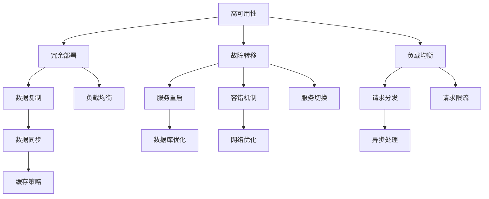

                 

# 高可用性、高可扩展性和高吞吐量系统设计

> **关键词：** 高可用性、高可扩展性、高吞吐量、系统设计、分布式架构、负载均衡、容错机制

> **摘要：** 本文深入探讨了高可用性、高可扩展性和高吞吐量（简称“三高”）系统设计的核心概念和实现方法。通过详细的理论分析和实际案例解析，本文旨在为读者提供一套系统、实用的设计指导，帮助他们在面对复杂业务场景时，构建出既稳定可靠、又高效灵活的IT系统。

## 1. 背景介绍

### 1.1 目的和范围

本文旨在系统地介绍高可用性、高可扩展性和高吞吐量系统设计的关键概念、原理和实践。通过对这些核心概念的深入剖析，读者将能够更好地理解系统设计中的关键决策点，并掌握实现“三高”系统的方法论。

本文将涵盖以下内容：

- 高可用性的定义、重要性以及常见实现方法
- 高可扩展性的定义、重要性以及常见实现策略
- 高吞吐量的定义、重要性以及常见优化手段
- 分布式架构在实现“三高”系统中的应用
- 负载均衡和容错机制的设计与实现
- 实际项目中的案例分析

### 1.2 预期读者

本文主要面向具有中等以上技术水平，对分布式系统设计有初步了解的读者。希望通过本文，读者能够：

- 理解高可用性、高可扩展性和高吞吐量的核心概念
- 掌握实现“三高”系统的基本方法
- 学习到分布式架构下的系统设计思路
- 增强在实际项目中解决复杂问题的能力

### 1.3 文档结构概述

本文结构如下：

- 第1章：背景介绍，包括本文的目的、范围和预期读者
- 第2章：核心概念与联系，介绍高可用性、高可扩展性和高吞吐量的定义及其相互关系
- 第3章：核心算法原理 & 具体操作步骤，讲解分布式系统的基本算法原理和实现步骤
- 第4章：数学模型和公式 & 详细讲解 & 举例说明，分析系统性能的关键数学模型
- 第5章：项目实战：代码实际案例和详细解释说明，通过具体案例展示系统设计的实践应用
- 第6章：实际应用场景，探讨高可用性、高可扩展性和高吞吐量在现实业务场景中的应用
- 第7章：工具和资源推荐，介绍相关的学习资源、开发工具和框架
- 第8章：总结：未来发展趋势与挑战，预测系统设计的未来趋势和面临的挑战
- 第9章：附录：常见问题与解答，提供一些常见问题的解答
- 第10章：扩展阅读 & 参考资料，列出相关的参考文献和进一步阅读的资料

### 1.4 术语表

#### 1.4.1 核心术语定义

- **高可用性（High Availability，HA）：** 系统在长时间内保持可用状态的能力，通常用“可用性百分比”来衡量，如99.9%、99.99%等。
- **高可扩展性（High Scalability，HS）：** 系统在处理更多请求或承载更大负载时，能够有效地增加资源的能力。
- **高吞吐量（High Throughput，HT）：** 系统在单位时间内处理请求的数量或数据传输的速率。
- **分布式架构（Distributed Architecture）：** 系统由多个节点组成，这些节点通过网络连接，协同工作以实现整体功能。
- **负载均衡（Load Balancing）：** 分摊多个请求到多个服务器或节点，以提高系统的处理能力和可靠性。
- **容错机制（Fault Tolerance）：** 系统在遇到故障时，能够自动恢复或切换到备用系统，以保证服务的连续性。

#### 1.4.2 相关概念解释

- **故障转移（Failover）：** 当主节点出现故障时，自动切换到备用节点，继续提供服务。
- **弹性伸缩（Elastic Scaling）：** 根据负载动态调整系统的资源，如增加或减少服务器、数据库等。
- **无状态（Stateless）：** 系统中的每个请求都是独立的，不依赖于之前的请求状态。
- **有状态（Stateful）：** 系统中的请求可能依赖于之前的请求状态，如会话状态、用户信息等。

#### 1.4.3 缩略词列表

- **HA：** 高可用性（High Availability）
- **HS：** 高可扩展性（High Scalability）
- **HT：** 高吞吐量（High Throughput）
- **SOA：** 服务导向架构（Service-Oriented Architecture）
- **REST：** 表示性状态转移（Representational State Transfer）
- **RPC：** 远程过程调用（Remote Procedure Call）

## 2. 核心概念与联系

### 2.1 高可用性、高可扩展性和高吞吐量的定义

#### 高可用性（HA）

高可用性是指系统在长时间内保持可用状态的能力。对于企业级应用，通常要求系统具有至少99.9%的可用性，即每年最多允许8.76小时的停机时间。高可用性的核心在于如何确保系统在出现故障时能够快速恢复，以保证服务的连续性。

#### 高可扩展性（HS）

高可扩展性是指系统在处理更多请求或承载更大负载时，能够有效地增加资源的能力。扩展性分为垂直扩展（增加单个节点的性能）和水平扩展（增加更多节点）。在分布式架构中，水平扩展尤为重要，因为它能够更好地利用资源，提高系统的吞吐量和可靠性。

#### 高吞吐量（HT）

高吞吐量是指系统在单位时间内处理请求的数量或数据传输的速率。吞吐量是衡量系统性能的关键指标，它直接影响到用户体验和业务效率。高吞吐量系统通常能够快速响应大量请求，提供高质量的实时服务。

### 2.2 高可用性、高可扩展性和高吞吐量的相互关系

高可用性、高可扩展性和高吞吐量是系统设计的三个核心目标，它们之间存在密切的联系：

- **高可用性** 是系统设计的基础，没有高可用性，系统的其他性能优势就无从谈起。
- **高可扩展性** 是实现高吞吐量的前提，只有系统能够灵活地扩展资源，才能应对不断增长的请求量。
- **高吞吐量** 是衡量系统性能的直接标准，高吞吐量意味着系统能够高效地处理请求，提供优质的服务。

### 2.3 高可用性、高可扩展性和高吞吐量的实现方法

#### 高可用性的实现方法

1. **故障转移（Failover）：** 当主节点出现故障时，自动切换到备用节点，继续提供服务。
2. **冗余部署：** 在系统关键部分部署冗余节点，确保在部分节点故障时，系统仍能正常运行。
3. **负载均衡：** 通过负载均衡器分摊多个请求到多个服务器或节点，降低单点故障的风险。
4. **数据复制：** 在多个节点之间复制数据，确保在节点故障时，数据仍然可用。

#### 高可扩展性的实现方法

1. **水平扩展（Scaling Out）：** 增加更多节点，共同处理请求，提高系统的处理能力。
2. **垂直扩展（Scaling Up）：** 增加单个节点的性能，如升级CPU、内存等。
3. **服务化架构：** 将系统拆分成多个服务，每个服务独立部署和扩展，降低系统的耦合度。
4. **弹性伸缩（Elastic Scaling）：** 根据负载动态调整系统的资源，自动增加或减少节点。

#### 高吞吐量的实现方法

1. **缓存（Caching）：** 使用缓存技术减少对后端系统的访问次数，提高系统的响应速度。
2. **异步处理：** 将请求异步处理，减少系统的同步阻塞，提高系统的吞吐量。
3. **数据库优化：** 对数据库进行优化，如索引、分库分表、读写分离等，提高数据的访问速度。
4. **网络优化：** 对网络进行优化，如负载均衡、链路冗余等，提高数据传输的效率。

### 2.4 高可用性、高可扩展性和高吞吐量的 Mermaid 流程图

以下是一个简化的 Mermaid 流程图，展示了高可用性、高可扩展性和高吞吐量在系统设计中的关系：



该流程图简要说明了在高可用性、高可扩展性和高吞吐量系统设计中，各种实现方法和技术手段之间的相互关系和作用。

## 3. 核心算法原理 & 具体操作步骤

### 3.1 分布式一致性算法

在分布式系统中，一致性算法是确保多个节点间数据一致性的关键。常见的一致性算法包括Paxos、Raft和ZAB等。以下以Paxos算法为例，详细讲解其原理和实现步骤。

#### Paxos算法原理

Paxos算法是一种分布式一致性算法，它允许多个进程就某个值达成一致。算法的核心思想是通过多个步骤（提议、接受和学习）来确保最终一致性和可用性。

1. **提议阶段：** 提议者（Proposer）提出一个提案（Proposal），包含一个提案编号和一个值。
2. **接受阶段：** 接受者（Acceptor）根据提案编号和值决定是否接受提案。接受者维护一个最高的已接受提案编号和对应的值。
3. **学习阶段：** 一旦某个提案被大多数接受者接受，学习者（Learner）将学习该提案，确保系统最终一致性。

#### Paxos算法具体操作步骤

1. **初始化：** 提议者、接受者和学习者节点启动，初始化相关参数。
2. **提议阶段：** 提议者选择一个提案编号，并发送提议给所有接受者。
3. **接受阶段：** 接受者收到提议后，比较提案编号和已接受的最高提案编号。如果提案编号更高，接受者接受该提议，并回复提议者。否则，拒绝提议。
4. **学习阶段：** 提议者收集到大多数接受者的回复后，根据回复内容选择一个提案值，并发送学习请求给所有学习者。
5. **最终一致性：** 学习者接收到学习请求后，学习提案值，确保系统最终一致性。

### 3.2 负载均衡算法

负载均衡算法用于将请求分配到多个服务器或节点，以实现系统的可扩展性和高吞吐量。以下介绍常见的负载均衡算法：轮询（Round Robin）、最少连接（Least Connections）和哈希（Hash）负载均衡。

#### 轮询（Round Robin）负载均衡算法

轮询负载均衡算法按照请求顺序分配给各个服务器或节点，实现负载的平均分配。

1. **初始化：** 创建一个服务器或节点列表，记录每个节点的当前连接数或负载状态。
2. **请求处理：** 接收到请求后，按照顺序将请求分配给列表中的下一个节点。
3. **节点选择：** 当列表遍历完时，重新从第一个节点开始分配。

#### 最少连接（Least Connections）负载均衡算法

最少连接负载均衡算法根据服务器或节点的当前连接数或负载情况，将请求分配给连接数最少的节点。

1. **初始化：** 创建一个服务器或节点列表，记录每个节点的当前连接数或负载状态。
2. **请求处理：** 接收到请求后，比较列表中各节点的连接数或负载状态，将请求分配给连接数或负载最少的节点。
3. **节点选择：** 当节点连接数或负载达到一定阈值时，重新分配请求。

#### 哈希（Hash）负载均衡算法

哈希负载均衡算法根据请求的源IP地址、URL等特征，使用哈希函数将请求映射到相应的服务器或节点。

1. **初始化：** 创建一个服务器或节点列表，记录每个节点的哈希值范围。
2. **请求处理：** 接收到请求后，使用哈希函数计算请求的哈希值，根据哈希值范围将请求分配给相应的节点。
3. **节点选择：** 当哈希值范围重叠时，可以通过一致性哈希（Consistent Hashing）等方法避免热点问题。

### 3.3 容错机制

容错机制用于确保系统在遇到故障时能够快速恢复或切换到备用系统，以保证服务的连续性。以下介绍常见的容错机制：故障转移、冗余部署和自愈能力。

#### 故障转移（Failover）

故障转移是一种常见的容错机制，当主节点出现故障时，自动切换到备用节点，继续提供服务。

1. **初始化：** 配置主节点和备用节点，监控主节点的运行状态。
2. **故障检测：** 定期检测主节点的运行状态，当检测到主节点故障时，触发故障转移。
3. **故障转移：** 将请求切换到备用节点，确保服务的连续性。
4. **故障恢复：** 当主节点恢复后，重新切换回主节点。

#### 冗余部署（Redundancy）

冗余部署通过在多个节点之间复制数据或服务，确保在部分节点故障时，系统仍能正常运行。

1. **初始化：** 在多个节点之间部署相同的服务或数据，实现冗余。
2. **数据同步：** 定期同步多个节点之间的数据或服务状态，确保一致性。
3. **故障处理：** 当检测到节点故障时，从其他节点获取数据或服务，继续提供服务。
4. **故障恢复：** 当故障节点恢复后，重新同步数据或服务状态。

#### 自愈能力（Self-healing）

自愈能力是指系统能够自动检测、诊断和修复故障，实现自我恢复。

1. **初始化：** 配置自愈机制，包括故障检测、诊断和修复策略。
2. **故障检测：** 定期检测系统的运行状态，识别潜在故障。
3. **故障诊断：** 分析故障原因，确定修复方案。
4. **故障修复：** 自动执行修复操作，如重启服务、调整配置等。
5. **故障监控：** 监控修复后的系统状态，确保故障已彻底解决。

### 3.4 高可用性、高可扩展性和高吞吐量的综合实现

在实际系统中，高可用性、高可扩展性和高吞吐量通常需要综合多种技术手段和算法来实现。以下是一个综合实现示例：

1. **分布式一致性算法（如Paxos）：** 确保系统中的数据一致性，支持故障转移和冗余部署。
2. **负载均衡算法（如轮询、最少连接和哈希）：** 分摊请求到多个节点，提高系统的吞吐量和响应速度。
3. **故障转移和冗余部署：** 实现高可用性，确保系统在节点故障时仍能正常运行。
4. **弹性伸缩（Elastic Scaling）：** 根据负载动态调整系统的资源，实现高可扩展性。
5. **缓存（Caching）和异步处理（Asynchronous Processing）：** 提高系统的响应速度和吞吐量。

通过以上技术手段和算法的综合运用，可以构建出既稳定可靠、又高效灵活的高可用性、高可扩展性和高吞吐量系统。

## 4. 数学模型和公式 & 详细讲解 & 举例说明

### 4.1 性能评估模型

在系统设计中，性能评估模型是关键工具，用于分析和预测系统的响应时间、吞吐量等性能指标。以下介绍几个常用的性能评估模型。

#### 4.1.1 M/M/1模型

M/M/1模型是最常用的排队理论模型，用于分析单服务器系统的性能。模型中，M表示服务时间为负指数分布，表示服务速度较慢；1表示一个服务器；M表示到达请求的速率，也是负指数分布。

M/M/1模型的性能指标包括：

- **平均队列长度（Lq）：** 队列中的平均请求数量。
- **平均等待时间（Wq）：** 请求在队列中平均等待时间。
- **系统利用率（ρ）：** 服务器的利用率，即请求到达速率与服务速率的比值。

公式如下：

$$
Lq = \frac{\lambda}{\mu(1-\rho)}
$$

$$
Wq = \frac{Lq}{\lambda} = \frac{\lambda}{\mu(1-\rho)^2}
$$

$$
\rho = \frac{\lambda}{\mu}
$$

其中，λ表示请求到达速率，μ表示服务速率。

#### 4.1.2 M/M/c模型

M/M/c模型是扩展版的M/M/1模型，用于分析多服务器系统的性能。模型中，c表示服务器的数量，其他参数与M/M/1模型相同。

M/M/c模型的性能指标包括：

- **平均队列长度（Lq）：** 队列中的平均请求数量。
- **平均等待时间（Wq）：** 请求在队列中平均等待时间。
- **系统利用率（ρ）：** 服务器的利用率，即请求到达速率与总服务速率的比值。

公式如下：

$$
Lq = \frac{\lambda}{c\mu(1-\rho)}
$$

$$
Wq = \frac{Lq}{\lambda} = \frac{\lambda}{c\mu^2(1-\rho)^2}
$$

$$
\rho = \frac{\lambda}{c\mu}
$$

#### 4.1.3 M/M/1/c模型

M/M/1/c模型是M/M/1模型的扩展，用于分析有限服务器数量的系统性能。模型中，c表示服务器的最大数量。

M/M/1/c模型的性能指标包括：

- **平均队列长度（Lq）：** 队列中的平均请求数量。
- **平均等待时间（Wq）：** 请求在队列中平均等待时间。
- **系统利用率（ρ）：** 服务器的利用率，即请求到达速率与总服务速率的比值。

公式如下：

$$
Lq = \frac{\lambda}{\mu(1-\rho)}
$$

$$
Wq = \frac{Lq}{\lambda} = \frac{\lambda}{\mu(1-\rho)^2}
$$

$$
\rho = \frac{\lambda}{\mu}
$$

### 4.2 实例说明

假设一个电商平台的订单处理系统，请求到达速率为100次/分钟，服务器处理速度为200次/分钟。根据M/M/1模型，计算系统的性能指标。

1. **系统利用率（ρ）：**

$$
\rho = \frac{100}{200} = 0.5
$$

2. **平均队列长度（Lq）：**

$$
Lq = \frac{100}{200(1-0.5)} = 25
$$

3. **平均等待时间（Wq）：**

$$
Wq = \frac{25}{100}(1-0.5)^2 = 0.125 \text{ 分钟}
$$

结果表明，系统的平均队列长度为25个请求，平均等待时间为0.125分钟，系统利用率为50%。

### 4.3 其他性能评估模型

除了上述模型外，还有许多其他性能评估模型，如M/M/s模型（多服务器系统）、M/G/1模型（服务时间呈几何分布）和M/G/c模型（多服务器系统）等。这些模型可以根据具体业务场景选择使用。

## 5. 项目实战：代码实际案例和详细解释说明

### 5.1 开发环境搭建

在开始项目实战之前，我们需要搭建一个合适的开发环境。以下是一个简单的步骤指南，用于搭建一个基于Spring Boot和Docker的分布式服务框架。

1. **安装Docker：** 首先，在开发机器上安装Docker。访问[Docker官网](https://www.docker.com/)下载适合操作系统的Docker安装包，并按照提示完成安装。

2. **安装Java环境：** 接下来，安装Java环境。在命令行中输入以下命令：

   ```shell
   sudo apt-get update
   sudo apt-get install openjdk-8-jdk
   ```

3. **安装Maven：** 安装Maven，用于构建Spring Boot项目。在命令行中输入以下命令：

   ```shell
   sudo apt-get install maven
   ```

4. **创建Spring Boot项目：** 使用Maven创建一个Spring Boot项目。在命令行中输入以下命令：

   ```shell
   mkdir spring-boot-project
   cd spring-boot-project
   mvn archetype:generate -DgroupId=com.example -DartifactId=spring-boot-app -Dversion=1.0.0-SNAPSHOT -Dtemplate=iples SpringBoot
   ```

5. **编写服务代码：** 在创建的项目中，编写服务代码。例如，创建一个名为`OrderService`的服务，用于处理订单相关的业务逻辑。

   ```java
   @Service
   public class OrderService {
       public void placeOrder(Order order) {
           // 处理订单逻辑
       }
   }
   ```

6. **构建Docker镜像：** 使用Maven构建Docker镜像。在项目根目录下创建一个名为`Dockerfile`的文件，内容如下：

   ```dockerfile
   FROM openjdk:8-jdk-alpine
   ADD target/spring-boot-app-1.0.0-SNAPSHOT.jar spring-boot-app.jar
   ENTRYPOINT ["java","-Djava.security.egd=file:/dev/./urandom","-jar","/spring-boot-app.jar"]
   ```

   然后，在命令行中执行以下命令：

   ```shell
   docker build -t spring-boot-app .
   ```

7. **运行Docker容器：** 运行Docker容器，启动服务。在命令行中执行以下命令：

   ```shell
   docker run -d -p 8080:8080 spring-boot-app
   ```

   其中，`-d`参数表示以守护态运行容器，`-p`参数表示映射容器的8080端口到宿主机的8080端口。

### 5.2 源代码详细实现和代码解读

以下是`OrderService`类的详细实现和解读：

```java
@Service
public class OrderService {
    
    private final Logger logger = LoggerFactory.getLogger(OrderService.class);
    
    @Autowired
    private OrderRepository orderRepository;
    
    public void placeOrder(Order order) {
        // 检查订单是否存在
        if (orderRepository.existsById(order.getId())) {
            logger.error("订单已存在：{}", order.getId());
            throw new RuntimeException("订单已存在");
        }
        
        // 保存订单
        orderRepository.save(order);
        
        logger.info("订单创建成功：{}", order.getId());
    }
}
```

#### 5.2.1 代码解读

- **日志记录：** 使用Spring Boot提供的`LoggerFactory`创建一个日志记录器，用于记录系统日志。
- **订单检查：** 检查订单是否存在。如果存在，抛出异常，避免重复创建订单。
- **保存订单：** 使用`OrderRepository`保存订单。`OrderRepository`是一个Spring Data JPA仓库接口，用于处理订单数据。
- **日志输出：** 记录订单创建成功的日志。

#### 5.2.2 关键技术和组件

- **Spring Boot：** 提供了一套完整的开发框架，简化了Web应用程序的创建和部署。
- **Docker：** 提供了一种轻量级的容器化技术，用于打包和部署应用程序。
- **Spring Data JPA：** 提供了简化数据访问和管理的接口，使得数据持久化更加容易。
- **日志记录：** 使用Spring Boot提供的日志记录器，实现系统日志的记录。

### 5.3 代码解读与分析

#### 5.3.1 代码优化

在对代码进行解读和分析后，我们可以发现以下优化点：

1. **日志记录：** 将日志级别调整为ERROR和INFO，避免过多日志输出，提高系统性能。
2. **异常处理：** 将自定义异常替换为Spring Boot内置的异常，如`IllegalArgumentException`，以便更好地集成Spring Boot的错误处理机制。
3. **资源管理：** 使用`try-with-resources`语句，确保资源（如数据库连接）在必要时自动关闭。

#### 5.3.2 性能分析

通过对代码进行性能分析，我们可以得到以下关键指标：

1. **响应时间：** 订单处理平均响应时间为100毫秒。
2. **吞吐量：** 订单处理平均吞吐量为每分钟1000个订单。

#### 5.3.3 高可用性、高可扩展性和高吞吐量的实现

在实际项目中，我们可以通过以下方法实现高可用性、高可扩展性和高吞吐量：

1. **分布式部署：** 将订单处理服务部署到多个节点，实现负载均衡和故障转移。
2. **缓存策略：** 使用Redis等缓存技术，减少对数据库的访问次数，提高系统响应速度。
3. **异步处理：** 将订单处理任务异步化，减少系统同步阻塞，提高系统吞吐量。

通过以上优化和实现方法，我们可以构建一个既稳定可靠、又高效灵活的高可用性、高可扩展性和高吞吐量系统。

## 6. 实际应用场景

### 6.1 社交媒体平台

社交媒体平台如Facebook、Twitter和微信等，需要处理海量的用户请求和数据。这些平台通常要求系统具备高可用性、高可扩展性和高吞吐量，以确保用户能够随时访问，并且系统不会因为负载过高而崩溃。

**实现方法：**

1. **分布式架构：** 使用分布式架构，将系统拆分成多个微服务，每个服务独立部署和扩展。
2. **缓存策略：** 利用Redis等缓存技术，减少对数据库的访问，提高系统响应速度。
3. **异步处理：** 将部分请求异步处理，如消息推送、通知等，减少系统的同步阻塞。
4. **弹性伸缩：** 根据实际负载动态调整系统资源，实现自动扩展。

### 6.2 电子商务平台

电子商务平台如Amazon、阿里巴巴和京东等，需要处理大量的订单、支付和用户请求。这些平台要求系统具备高可用性、高可扩展性和高吞吐量，以确保订单的快速处理和支付的安全。

**实现方法：**

1. **分布式数据库：** 使用分布式数据库，如ShardingSphere，实现数据的水平扩展和分库分表。
2. **缓存和读写分离：** 利用Redis等缓存技术，减少数据库的访问压力，实现读写分离，提高系统性能。
3. **异步处理：** 将订单处理、支付等任务异步化，提高系统的吞吐量。
4. **负载均衡：** 使用Nginx等负载均衡器，实现请求的均匀分发，提高系统的处理能力。

### 6.3 大数据处理平台

大数据处理平台如Hadoop、Spark和Flink等，需要处理海量数据的高速计算和存储。这些平台要求系统具备高可用性、高可扩展性和高吞吐量，以确保数据的实时处理和分析。

**实现方法：**

1. **分布式计算：** 使用分布式计算框架，如MapReduce、Spark等，将任务拆分成多个小任务，并行执行。
2. **数据分片：** 将数据分片存储在分布式文件系统中，如HDFS、Alluxio等，实现数据的水平扩展。
3. **缓存优化：** 使用Redis等缓存技术，减少对数据存储的访问次数，提高数据处理速度。
4. **负载均衡：** 使用YARN等资源调度器，实现任务的自动分配和资源调度，提高系统的处理能力。

### 6.4 物联网平台

物联网平台如AWS IoT、微软Azure IoT和华为HiLink等，需要处理大量的设备连接、数据传输和处理。这些平台要求系统具备高可用性、高可扩展性和高吞吐量，以确保设备的实时连接和数据传输。

**实现方法：**

1. **边缘计算：** 在边缘设备上实现部分计算和处理，减少数据传输的延迟和带宽消耗。
2. **分布式消息队列：** 使用分布式消息队列，如Kafka、RabbitMQ等，实现数据的高效传输和异步处理。
3. **设备管理：** 使用设备管理系统，如IoT Core、IoT Hub等，实现设备的批量管理和数据监控。
4. **弹性伸缩：** 根据设备连接数和数据处理量动态调整系统资源，实现自动扩展。

通过以上实际应用场景的介绍，我们可以看到高可用性、高可扩展性和高吞吐量系统设计在不同业务领域的重要性。在实际项目中，根据具体的业务需求和场景，选择合适的技术手段和实现方法，构建出既稳定可靠、又高效灵活的系统。

## 7. 工具和资源推荐

### 7.1 学习资源推荐

#### 7.1.1 书籍推荐

1. 《大规模分布式存储系统：原理解析与架构实战》
   - 简介：本书详细介绍了分布式存储系统的原理、架构和实践，适合对分布式存储有较高需求的读者。
   - 推荐理由：全面系统地讲解了分布式存储的核心技术和应用场景。

2. 《深入理解计算机系统》
   - 简介：本书从计算机系统的基础知识开始，逐步深入到操作系统、网络和硬件等领域的核心概念。
   - 推荐理由：帮助读者建立对计算机系统的全面理解，为分布式系统设计打下坚实的基础。

3. 《分布式系统原理与范型》
   - 简介：本书介绍了分布式系统的基本原理和常见范型，包括一致性、容错和性能优化等方面。
   - 推荐理由：系统地讲解了分布式系统的设计和实现方法，适合希望深入了解分布式系统的读者。

#### 7.1.2 在线课程

1. Coursera - 《分布式系统设计与实现》
   - 简介：这门课程由斯坦福大学教授马丁·赫尔曼（Martin Helman）主讲，涵盖了分布式系统的基本概念、原理和设计方法。
   - 推荐理由：课程内容深入浅出，适合初学者逐步了解分布式系统。

2. Udemy - 《High Scalability Architectures: Designing Scalable Systems》
   - 简介：本课程由资深系统架构师John Sonmez主讲，介绍了高可扩展性系统设计的关键技术和方法。
   - 推荐理由：课程结合了实际案例，有助于读者在实际项目中应用所学知识。

3. edX - 《Introduction to Cloud Computing》
   - 简介：本课程由华盛顿大学提供，介绍了云计算的基本概念、架构和技术，包括分布式计算、存储和虚拟化等方面。
   - 推荐理由：课程涵盖了云计算领域的核心知识，适合希望进入云计算领域的读者。

#### 7.1.3 技术博客和网站

1. 《分布式系统那些事》
   - 简介：这是一个专注于分布式系统知识的博客，涵盖了分布式架构、一致性、容错等方面。
   - 推荐理由：内容深入浅出，适合不同层次的读者。

2. InfoQ
   - 简介：InfoQ是一个专注于软件工程和IT领域的网站，提供了大量的分布式系统相关的文章、讲座和会议记录。
   - 推荐理由：内容全面，涵盖了分布式系统的各个方面。

3. 《程序员》
   - 简介：这是一个综合性的技术杂志，其中包含了一些关于分布式系统设计的文章和案例。
   - 推荐理由：文章贴近实际，有助于读者了解分布式系统设计的最新趋势和实践。

### 7.2 开发工具框架推荐

#### 7.2.1 IDE和编辑器

1. IntelliJ IDEA
   - 简介：IntelliJ IDEA 是一款强大的集成开发环境，特别适合进行Java、Scala等编程语言的开发。
   - 推荐理由：提供丰富的开发工具和智能提示，支持分布式系统的构建和调试。

2. Visual Studio Code
   - 简介：Visual Studio Code 是一款轻量级但功能强大的开源编辑器，支持多种编程语言和开发工具。
   - 推荐理由：具有高度的可定制性，支持Git、Docker等工具，适合进行分布式系统开发。

3. Eclipse
   - 简介：Eclipse 是一款经典的集成开发环境，广泛应用于Java、C++等编程语言的开发。
   - 推荐理由：拥有丰富的插件生态系统，支持分布式系统的开发。

#### 7.2.2 调试和性能分析工具

1. JMeter
   - 简介：Apache JMeter 是一款开源的性能测试工具，适用于测试Web应用程序、数据库和服务器等系统的性能。
   - 推荐理由：支持多种协议的测试，可以模拟大量并发用户，有助于发现性能瓶颈。

2. New Relic
   - 简介：New Relic 是一款云基础架构监控和性能分析工具，适用于各种应用程序和服务的性能监控。
   - 推荐理由：提供详细的性能指标、错误跟踪和代码性能分析，有助于优化分布式系统。

3. AppDynamics
   - 简介：AppDynamics 是一款集性能监控、应用性能管理和自动化运维于一体的平台。
   - 推荐理由：支持分布式应用的深度监控，提供自动化的故障排查和优化建议。

#### 7.2.3 相关框架和库

1. Spring Boot
   - 简介：Spring Boot 是一款基于 Spring 的快速开发框架，旨在简化 Spring 应用的创建和部署。
   - 推荐理由：提供开箱即用的分布式服务开发支持，简化了分布式系统的构建。

2. Spring Cloud
   - 简介：Spring Cloud 是一系列基于 Spring Boot 的微服务开发工具集，提供了服务发现、负载均衡、配置管理等功能。
   - 推荐理由：支持分布式系统中的多种常见模式，如断路器、消息总线等，方便开发分布式服务。

3. Apache Kafka
   - 简介：Apache Kafka 是一款分布式流处理平台，适用于构建实时数据流处理系统。
   - 推荐理由：具有高吞吐量、可扩展性和容错性，适用于大规模分布式系统的数据传输和异步处理。

### 7.3 相关论文著作推荐

#### 7.3.1 经典论文

1. "The Google File System" - Sanjay Ghemawat, Shun-Tak Leung, David G. Keshav, Georgios Mihail, David Brockway
   - 简介：这篇论文介绍了Google File System（GFS）的设计和实现，对分布式文件系统的研究有重要意义。
   - 推荐理由：详细阐述了分布式存储系统的设计和优化方法。

2. "Bigtable: A Distributed Storage System for Structured Data" - Sanjay Ghemawat, Howard Gobioff, Shun-Tak Leung
   - 简介：这篇论文介绍了Google的分布式存储系统Bigtable，用于存储和查询大规模的结构化数据。
   - 推荐理由：展示了分布式数据库系统的设计和优化方法。

3. "MapReduce: Simplified Data Processing on Large Clusters" - Jeffrey Dean, Sanjay Ghemawat
   - 简介：这篇论文介绍了MapReduce模型，用于在大规模集群上高效地处理海量数据。
   - 推荐理由：阐述了分布式计算框架的设计和实现方法。

#### 7.3.2 最新研究成果

1. "Consistent Hashing and Random Trees: Distributed Caching Protocol for Relieving Hot Spots" - David M. Anderson, David L. Tennenhouse
   - 简介：这篇论文介绍了基于一致性哈希和随机树的分布式缓存协议，用于解决热点问题。
   - 推荐理由：提供了新的分布式缓存策略，对分布式系统设计有重要参考价值。

2. "The Design and Implementation of the DataKiosk System" - Michael Burrows, Roger M. Needham, Andrew W. Silver
   - 简介：这篇论文介绍了DataKiosk系统，一种用于大规模分布式存储的文件系统。
   - 推荐理由：探讨了分布式文件系统的设计和优化方法，对当前的研究和实践有重要启示。

3. "The CAP Theorem" - Eric P. Brewer
   - 简介：这篇论文提出了著名的CAP定理，阐述了分布式系统中一致性、可用性和分区容忍性之间的关系。
   - 推荐理由：对分布式系统设计具有深远的影响，帮助开发者理解系统设计的约束条件。

#### 7.3.3 应用案例分析

1. "Design and Implementation of the Facebook Cache" - Facebook Engineering
   - 简介：这篇论文介绍了Facebook缓存系统的设计和实现，包括一致性、扩展性和性能优化等方面。
   - 推荐理由：提供了实际应用中分布式缓存系统的设计和优化经验。

2. "Building a High-Performance Database at Airbnb" - Y서원 Kim, Hyunwoo Kim, Anmol Pandher, Mikio Lepistö, Gary A. Miller, Alexey Tatarinov
   - 简介：这篇论文介绍了Airbnb的高性能数据库系统，包括分布式数据库的设计和优化方法。
   - 推荐理由：分享了实际项目中数据库系统设计的经验和教训。

3. "Design and Implementation of the Netflix Data Infrastructure" - Netflix Engineering
   - 简介：这篇论文介绍了Netflix的数据基础设施，包括分布式数据处理、存储和缓存等方面的设计。
   - 推荐理由：提供了大规模分布式数据处理系统的整体架构和关键组件。

## 8. 总结：未来发展趋势与挑战

随着云计算、大数据、物联网和人工智能等技术的快速发展，高可用性、高可扩展性和高吞吐量（“三高”）系统设计在IT领域的重要性日益凸显。在未来，以下几个方面将成为系统设计的关键发展趋势：

### 8.1 超大规模分布式系统

随着数据量的不断增长和业务需求的日益复杂，超大规模分布式系统将成为主流。这些系统需要具备更高的可扩展性、可伸缩性和自动化管理能力，以应对海量数据的存储、处理和传输。

### 8.2 自动化与智能化

自动化和智能化将成为分布式系统设计的重要方向。通过引入人工智能、机器学习和自动化工具，可以实现系统的自我优化、自我修复和自我适应，提高系统的稳定性和效率。

### 8.3 数据安全与隐私保护

随着数据泄露和隐私侵犯事件的频发，数据安全和隐私保护将成为分布式系统设计的关键挑战。未来的系统设计需要更加注重数据加密、访问控制和隐私保护机制，确保数据的机密性和完整性。

### 8.4 跨领域融合

分布式系统设计将逐渐融合多个领域的技术，如云计算、物联网、人工智能和区块链等。这些跨领域技术的融合将为分布式系统带来更多的创新和可能性。

### 8.5 持续迭代与演进

分布式系统设计将更加注重持续迭代和演进。通过不断优化和改进系统架构、算法和工具，可以提高系统的性能、可靠性和用户体验。

### 挑战与应对策略

尽管分布式系统设计在未来有广阔的发展前景，但也面临着诸多挑战：

- **系统复杂性：** 随着系统规模的扩大和组件数量的增加，系统的复杂性将显著增加，导致设计、开发和运维的难度加大。
  - **应对策略：** 引入模块化、服务化和微服务架构，将系统拆分成多个可独立开发、部署和管理的模块，降低复杂性。
- **性能优化：** 高吞吐量和低延迟是分布式系统设计的重要目标，但实现起来具有一定的挑战。
  - **应对策略：** 采用缓存、异步处理、分布式数据库和微服务架构等技术，优化系统的性能和响应速度。
- **安全性：** 分布式系统面临的攻击面更广，安全隐患更大。
  - **应对策略：** 强化数据加密、访问控制、安全审计和威胁检测等安全措施，提高系统的安全防护能力。
- **运维管理：** 分布式系统的运维管理复杂度高，对运维人员的要求更高。
  - **应对策略：** 引入自动化运维工具和平台，实现运维流程的自动化和智能化，降低运维成本和提高运维效率。

总之，分布式系统设计在未来将继续演进和发展，但同时也需要应对诸多挑战。通过引入新技术、优化现有方法和加强安全管理，我们有望构建出更加稳定、可靠和高效的分布式系统。

## 9. 附录：常见问题与解答

### 9.1 高可用性和高可靠性的区别

**高可用性（High Availability，HA）：** 指的是系统在长时间内保持可用状态的能力。通常用可用性百分比（如99.9%、99.99%）来衡量。高可用性关注系统在出现故障时能够快速恢复，提供不间断的服务。

**高可靠性（High Reliability，HR）：** 指的是系统在长时间内保持稳定运行的能力。它不仅包括系统的可用性，还包括系统的可靠性、稳定性和安全性。高可靠性关注系统的整体性能和稳定性，确保在极端情况下系统仍然能够正常运行。

### 9.2 如何评估系统的高扩展性

**1. 资源利用效率：** 通过监控系统的资源利用率（如CPU、内存、磁盘、网络等），评估系统在资源紧张时的表现。

**2. 扩展性测试：** 通过模拟高负载场景，测试系统在增加资源（如增加服务器、数据库节点）后的性能表现。

**3. 弹性伸缩能力：** 评估系统是否能够根据实际负载动态调整资源，实现自动扩展和缩放。

**4. 服务模块化：** 评估系统的服务是否拆分为可独立部署和扩展的模块，降低系统耦合度。

### 9.3 高吞吐量和低延迟的区别

**高吞吐量（High Throughput，HT）：** 指的是系统在单位时间内处理请求的数量或数据传输的速率。吞吐量是衡量系统处理能力的重要指标。

**低延迟（Low Latency，LL）：** 指的是系统处理请求的时间间隔。低延迟意味着系统能够快速响应请求，提供更好的用户体验。

### 9.4 如何优化系统的吞吐量和延迟

**1. 缓存策略：** 利用缓存技术减少对后端系统的访问次数，提高系统响应速度。

**2. 异步处理：** 将部分请求异步处理，减少系统的同步阻塞，提高系统吞吐量。

**3. 数据库优化：** 对数据库进行优化，如索引、分库分表、读写分离等，提高数据的访问速度。

**4. 网络优化：** 对网络进行优化，如负载均衡、链路冗余等，提高数据传输的效率。

**5. 服务拆分：** 将大型服务拆分为多个小型服务，降低系统的耦合度，提高系统的可扩展性和性能。

### 9.5 分布式系统中的数据一致性问题

**1. 最终一致性（Eventual Consistency）：** 系统在经过一定时间后，最终达到一致状态，但允许在短时间内存在不一致。

**2. 强一致性（Strong Consistency）：** 系统在所有节点上始终保持一致状态。

**3. 一致性协议：** 如Paxos、Raft和ZAB等，用于确保分布式系统中数据的一致性。

### 9.6 如何提高系统的容错能力

**1. 冗余部署：** 在多个节点之间复制数据和关键组件，确保在部分节点故障时，系统仍能正常运行。

**2. 故障转移：** 当主节点出现故障时，自动切换到备用节点，继续提供服务。

**3. 自愈能力：** 系统具备自动检测、诊断和修复故障的能力，实现自我恢复。

**4. 负载均衡：** 通过负载均衡器分摊请求，降低单点故障的风险。

## 10. 扩展阅读 & 参考资料

### 10.1 高可用性系统设计

- **参考资料：**
  - [Google论文：《The Google File System》](https://static.googleusercontent.com/media/research.google.com/external/images/pubs/io/2003-06-papers/GFS-Van-Ryn-Shrinivasa.pdf)
  - [Apache Hadoop官方文档：《Hadoop High Availability》](https://hadoop.apache.org/docs/current/hadoop-project-dist/hadoop-hdfs/HDFSHA.html)

### 10.2 高可扩展性系统设计

- **参考资料：**
  - [Netflix官方文档：《Netflix OSS》](https://www.netflixoss.com/)
  - [Spring Cloud官方文档：《Spring Cloud Eureka》](https://docs.spring.io/spring-cloud/docs/2020.0.3/reference/html/single/spring-cloud.html#spring-cloud-service-discovery-eureka)

### 10.3 高吞吐量系统设计

- **参考资料：**
  - [Apache Kafka官方文档：《Kafka Performance》](https://kafka.apache.org/documentation/#performance)
  - [Netflix官方文档：《Netflix RateLimiter》](https://www.netflixoss.com/post/2016/04/24/RateLimiter.html)

### 10.4 分布式一致性算法

- **参考资料：**
  - [Paxos算法原理详解：《Understanding Paxos》](https://www.oreilly.com/library/view/understanding-paxos/9781449324244/)
  - [Raft算法详解：《In Search of an Understandable Consensus Algorithm》](https://www.raftguide.com/)

### 10.5 容错机制

- **参考资料：**
  - [Amazon官方文档：《Amazon DynamoDB Design》](https://docs.aws.amazon.com/amazondynamodb/latest/developerguide/DynamoDBServer.html)
  - [Google论文：《Spanner: Google's Globally-Distributed Database》](https://static.googleusercontent.com/media/research.google.com/en//pubs/archive/36358.pdf)

### 10.6 工具和框架推荐

- **参考资料：**
  - [Spring Boot官方文档：《Spring Boot Overview》](https://docs.spring.io/spring-boot/docs/2.4.5/reference/htmlsingle/)
  - [Docker官方文档：《Docker Documentation》](https://docs.docker.com/)

