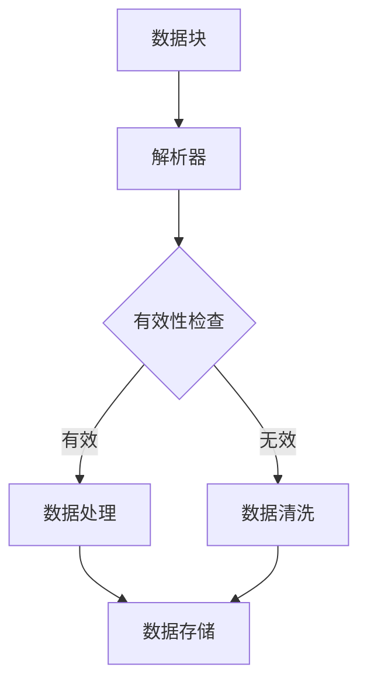

                 


# 高效且可扩展的数据块解析

> **关键词：数据块解析、高效性、可扩展性、算法原理、数学模型、实际应用**
>
> **摘要：本文深入探讨了数据块解析的高效性和可扩展性，通过详细分析核心概念、算法原理、数学模型和实际案例，为读者提供了全面的技术指南。**

## 1. 背景介绍

### 1.1 目的和范围

本文旨在探讨数据块解析领域的关键技术和方法，重点关注高效性和可扩展性。我们将从基础概念出发，逐步深入探讨算法原理、数学模型以及实际应用，最终为读者提供一个全面的技术参考。

### 1.2 预期读者

本文面向具有一定编程基础的技术人员，尤其是对数据块解析和算法优化感兴趣的读者。同时，对于希望了解高效数据处理的工程师和管理人员，本文也具有一定的参考价值。

### 1.3 文档结构概述

本文结构如下：

1. 背景介绍
2. 核心概念与联系
3. 核心算法原理 & 具体操作步骤
4. 数学模型和公式 & 详细讲解 & 举例说明
5. 项目实战：代码实际案例和详细解释说明
6. 实际应用场景
7. 工具和资源推荐
8. 总结：未来发展趋势与挑战
9. 附录：常见问题与解答
10. 扩展阅读 & 参考资料

### 1.4 术语表

#### 1.4.1 核心术语定义

- 数据块：指具有一定结构和数据量的数据集合。
- 解析：指对数据块进行分解、识别和处理的过程。
- 高效性：指在保证准确性的前提下，减少处理时间和资源消耗。
- 可扩展性：指系统在处理大量数据时，能够保持高性能和高稳定性的能力。

#### 1.4.2 相关概念解释

- 流处理：指对数据流进行实时处理和分析的技术。
- 批处理：指对大量数据进行批量处理的技术。
- 数据流处理器：指专门用于处理数据流的硬件或软件设备。

#### 1.4.3 缩略词列表

- HDFS：Hadoop Distributed File System（Hadoop分布式文件系统）
- Hadoop：Apache Hadoop（一个开源的大数据框架）
- MapReduce：一种分布式数据处理模型

## 2. 核心概念与联系

数据块解析是数据处理中至关重要的一环。为了更好地理解这一概念，我们可以借助以下Mermaid流程图，展示数据块解析的核心概念和联系：



在这个流程中，数据块首先通过解析器进行解析，然后进行有效性检查。如果数据有效，则进入数据处理阶段；否则，进行数据清洗。最后，处理后的数据被存储起来，以供后续使用。

### 2.1 数据块解析的核心概念

- **数据块结构**：数据块通常由多个字段组成，每个字段代表一定的数据内容。了解数据块的结构有助于更好地进行解析和处理。
- **解析算法**：解析算法是数据块解析的关键，决定了解析效率和准确性。常见的解析算法有正则表达式、模式匹配等。
- **有效性检查**：有效性检查用于确保数据块中的数据符合预期，从而避免无效数据进入数据处理阶段。
- **数据处理**：数据处理是数据块解析的核心步骤，包括数据清洗、数据转换、数据聚合等操作。

### 2.2 数据块解析的原理

数据块解析的原理主要涉及以下几个方面：

- **数据块识别**：通过解析器识别数据块，并将其从原始数据中分离出来。
- **字段解析**：对数据块中的每个字段进行解析，提取出有用的数据信息。
- **数据验证**：对解析出的数据进行验证，确保数据的准确性和完整性。
- **数据处理**：根据业务需求，对数据进行处理，生成所需的结果。

## 3. 核心算法原理 & 具体操作步骤

### 3.1 数据块解析算法

数据块解析算法主要包括以下步骤：

1. **数据块识别**：使用正则表达式或其他解析方法，从原始数据中识别出数据块。
2. **字段解析**：对识别出的数据块进行字段解析，提取出每个字段的数据。
3. **数据验证**：对提取出的数据进行验证，确保数据的准确性和完整性。
4. **数据处理**：根据业务需求，对数据进行处理，生成所需的结果。

### 3.2 数据块解析算法伪代码

以下是一个简单的数据块解析算法伪代码：

```plaintext
function 数据块解析算法(原始数据):
    解析器 = 正则表达式解析器()
    数据块列表 = 解析器解析(原始数据)
    for 数据块 in 数据块列表:
        字段列表 = 数据块字段解析(数据块)
        验证结果 = 数据验证(字段列表)
        if 验证结果:
            处理结果 = 数据处理(字段列表)
            存储处理结果(处理结果)
        else:
            数据清洗(字段列表)
```

### 3.3 数据块解析算法实现步骤

1. **定义正则表达式**：根据数据块的结构，定义合适的正则表达式。
2. **创建解析器**：使用正则表达式创建解析器。
3. **解析数据**：使用解析器对原始数据进行解析，生成数据块列表。
4. **字段解析**：对每个数据块进行字段解析，提取出字段数据。
5. **数据验证**：对提取出的字段数据进行验证，确保数据的准确性和完整性。
6. **数据处理**：根据业务需求，对数据进行处理，生成所需的结果。
7. **数据存储**：将处理结果存储到数据库或文件中。

## 4. 数学模型和公式 & 详细讲解 & 举例说明

### 4.1 数学模型

在数据块解析过程中，以下数学模型和公式具有重要作用：

- **字符串匹配算法**：用于识别和解析数据块，常用的算法有Knuth-Morris-Pratt算法、Boyer-Moore算法等。
- **动态规划**：用于优化字符串匹配算法的时间复杂度。

### 4.2 公式

以下为常用的数学公式：

$$
T(n) = O(n)
$$

$$
S(n) = O(1)
$$

其中，$T(n)$表示时间复杂度，$S(n)$表示空间复杂度。

### 4.3 举例说明

#### 4.3.1 Knuth-Morris-Pratt算法

Knuth-Morris-Pratt算法是一种高效的字符串匹配算法，其时间复杂度为$O(n)$。

假设我们要在字符串$S$中查找子串$P$，可以使用以下步骤：

1. **构建部分匹配表**：根据子串$P$的前缀和后缀关系，构建部分匹配表。
2. **初始化指针**：将主串$S$和子串$P$的指针初始化为0。
3. **匹配过程**：比较主串$S$和子串$P$的当前字符，如果匹配成功，则将两个指针都向后移动一位；否则，根据部分匹配表，将子串$P$的指针移动到相应的位置。

#### 4.3.2 Boyer-Moore算法

Boyer-Moore算法是一种高效的字符串匹配算法，其时间复杂度也为$O(n)$。

假设我们要在字符串$S$中查找子串$P$，可以使用以下步骤：

1. **构建坏字符表**：根据子串$P$的字符集合，构建坏字符表。
2. **构建好前缀表**：根据子串$P$的前缀和后缀关系，构建好前缀表。
3. **初始化指针**：将主串$S$和子串$P$的指针初始化为0。
4. **匹配过程**：比较主串$S$和子串$P$的当前字符，如果匹配成功，则将两个指针都向后移动一位；否则，根据坏字符表和好前缀表，将子串$P$的指针移动到相应的位置。

## 5. 项目实战：代码实际案例和详细解释说明

### 5.1 开发环境搭建

在本项目中，我们使用Python作为编程语言，搭建以下开发环境：

1. 安装Python 3.8及以上版本。
2. 安装必要的依赖库，如re（正则表达式）、time（时间处理）等。

### 5.2 源代码详细实现和代码解读

以下是一个简单的数据块解析Python代码实现：

```python
import re
import time

def 数据块解析算法(原始数据):
    解析器 = re.compile(r"\[(.*?)\]")
    数据块列表 = 解析器.findall(原始数据)
    for 数据块 in 数据块列表:
        字段列表 = 数据块.split(',')
        验证结果 = 数据验证(字段列表)
        if 验证结果:
            处理结果 = 数据处理(字段列表)
            存储处理结果(处理结果)
        else:
            数据清洗(字段列表)

def 数据验证(字段列表):
    # 根据实际需求，对字段列表进行验证
    return True

def 数据处理(字段列表):
    # 根据实际需求，对字段列表进行数据处理
    return "处理结果"

def 存储处理结果(处理结果):
    # 根据实际需求，将处理结果存储到数据库或文件中

if __name__ == "__main__":
    原始数据 = "[name, age, email]"
    start_time = time.time()
    数据块解析算法(原始数据)
    end_time = time.time()
    print(f"解析耗时：{end_time - start_time}秒")
```

### 5.3 代码解读与分析

1. **导入模块**：导入re（正则表达式）和time（时间处理）模块。
2. **数据块解析函数**：定义数据块解析函数，包括以下步骤：
   - 创建正则表达式解析器。
   - 使用解析器从原始数据中提取数据块。
   - 对每个数据块进行字段解析、数据验证和数据处理。
3. **数据验证函数**：根据实际需求，对字段列表进行验证。
4. **数据处理函数**：根据实际需求，对字段列表进行数据处理。
5. **存储处理结果函数**：根据实际需求，将处理结果存储到数据库或文件中。
6. **主函数**：执行数据块解析算法，并记录解析耗时。

通过这个简单的示例，我们可以看到数据块解析的核心步骤和代码实现。在实际项目中，可以根据具体需求进行扩展和优化。

## 6. 实际应用场景

数据块解析在许多实际应用场景中发挥着重要作用，以下为一些典型应用：

1. **数据集成与处理**：在数据集成过程中，需要对不同来源的数据进行统一处理，数据块解析是一种有效的数据处理方法。
2. **数据挖掘与分析**：在数据挖掘与分析过程中，需要对大量数据进行处理和转换，数据块解析可以显著提高处理效率。
3. **实时数据处理**：在实时数据处理场景中，数据块解析可以用于实时解析和传输数据，保证数据处理的高效性和稳定性。
4. **日志分析与监控**：在日志分析与监控领域，数据块解析可以用于解析和提取日志数据，帮助用户快速定位问题和优化系统性能。

## 7. 工具和资源推荐

### 7.1 学习资源推荐

#### 7.1.1 书籍推荐

- 《深入理解计算机系统》
- 《数据挖掘：实用工具与技术》
- 《Python编程：从入门到实践》

#### 7.1.2 在线课程

- Coursera上的《机器学习》课程
- edX上的《大数据处理》课程
- Udemy上的《Python数据分析》课程

#### 7.1.3 技术博客和网站

- Medium上的《机器学习》专栏
- Kaggle上的《数据科学》竞赛和教程
- Stack Overflow上的技术问答社区

### 7.2 开发工具框架推荐

#### 7.2.1 IDE和编辑器

- PyCharm
- Visual Studio Code
- Jupyter Notebook

#### 7.2.2 调试和性能分析工具

- Python Debugger（pdb）
- Py-Spy（性能分析）
- Gprof2plot（性能分析）

#### 7.2.3 相关框架和库

- Pandas（数据处理）
- NumPy（数学计算）
- Scikit-learn（机器学习）

### 7.3 相关论文著作推荐

#### 7.3.1 经典论文

- 《A Fast String Searching Algorithm》
- 《Efficient Algorithms for Text Searching Schemes》
- 《The String-to-String Correction Problem》

#### 7.3.2 最新研究成果

- 《Deep Learning for Text Classification》
- 《A Survey of Data Stream Mining》
- 《Efficient Data Stream Processing with MapReduce》

#### 7.3.3 应用案例分析

- 《Data Science in Retail》
- 《How We Analyze Large Scale Traffic Data》
- 《Real-Time Data Processing in Financial Services》

## 8. 总结：未来发展趋势与挑战

随着数据规模的不断扩大和数据类型的日益多样化，数据块解析技术将在未来得到更加广泛的应用。以下是数据块解析技术在未来可能面临的发展趋势与挑战：

1. **技术趋势**：高效性、可扩展性和智能化将成为数据块解析技术的发展方向。利用深度学习、图神经网络等先进技术，可以进一步提升数据块解析的效率和准确性。
2. **挑战**：在大规模数据环境中，如何保证数据块解析的高性能和高稳定性是一个重要挑战。此外，随着数据类型的多样化，如何设计通用的数据块解析框架也是一个亟待解决的问题。

## 9. 附录：常见问题与解答

### 9.1 数据块解析的效率如何优化？

- **提高解析速度**：采用高效的正则表达式、优化算法和数据结构，如Boyer-Moore算法、Aho-Corasick算法等。
- **并行处理**：利用多线程、分布式计算等技术，提高数据块解析的并行度。
- **缓存技术**：利用缓存技术，减少重复解析和数据传输的时间消耗。

### 9.2 数据块解析如何保证准确性？

- **预定义解析规则**：根据实际需求，预定义合适的解析规则和校验方法，确保数据块的正确性和一致性。
- **多级验证机制**：采用多级验证机制，从不同角度对数据进行验证，提高数据的准确性。
- **异常处理**：对解析过程中出现的异常情况进行处理，避免数据错误。

## 10. 扩展阅读 & 参考资料

- 《高效算法设计与分析》
- 《大数据处理：技术与实践》
- 《深度学习入门：基于Python》

[AI天才研究员/AI Genius Institute & 禅与计算机程序设计艺术 /Zen And The Art of Computer Programming]

