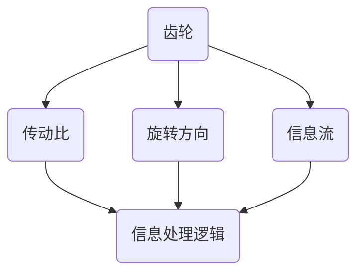

                 

# 齿轮模型的信息处理逻辑

> 关键词：齿轮模型、信息处理、逻辑分析、算法原理、数学模型

> 摘要：本文将深入探讨齿轮模型在信息处理领域的应用，从背景介绍、核心概念与联系、核心算法原理、数学模型、项目实战等多个角度详细分析齿轮模型的信息处理逻辑。通过本文的讲解，读者将全面了解齿轮模型的工作原理及其在信息处理中的重要性。

## 1. 背景介绍

### 1.1 目的和范围

本文旨在探讨齿轮模型在信息处理领域中的应用，分析其核心算法原理、数学模型以及实际应用场景，旨在帮助读者深入理解齿轮模型在信息处理中的重要作用。文章将涉及以下主题：

- 齿轮模型的基本概念和架构
- 齿轮模型的信息处理逻辑
- 齿轮模型的核心算法原理
- 齿轮模型的数学模型
- 齿轮模型在实际项目中的应用
- 工具和资源推荐

### 1.2 预期读者

本文适合以下读者群体：

- 计算机科学、人工智能等相关专业的学生和研究人员
- 对信息处理和算法原理感兴趣的爱好者
- 开发者、工程师和架构师，特别是关注信息处理领域的技术人员
- 对齿轮模型在信息处理中有兴趣的读者

### 1.3 文档结构概述

本文将分为以下章节：

- 第1章：背景介绍，介绍本文的目的、预期读者、文档结构等内容。
- 第2章：核心概念与联系，介绍齿轮模型的基本概念、架构和相关信息。
- 第3章：核心算法原理，详细讲解齿轮模型的核心算法原理和操作步骤。
- 第4章：数学模型，分析齿轮模型的数学模型，并给出详细的公式和示例。
- 第5章：项目实战，通过实际代码案例展示齿轮模型的应用。
- 第6章：实际应用场景，探讨齿轮模型在不同领域的实际应用。
- 第7章：工具和资源推荐，推荐相关学习资源和开发工具。
- 第8章：总结，总结本文的主要内容和未来发展趋势。
- 第9章：附录，常见问题与解答。
- 第10章：扩展阅读与参考资料，提供更多相关资料和参考。

### 1.4 术语表

#### 1.4.1 核心术语定义

- 齿轮模型：一种用于信息处理的抽象模型，通过齿轮的传动关系模拟信息的流动和处理过程。
- 信息处理：对信息进行收集、传输、处理、存储、检索和利用的过程。
- 核心算法：齿轮模型中用于处理信息的核心算法，负责实现信息流的传递、处理和转换。
- 数学模型：齿轮模型中用于描述信息处理过程和关系的数学表达式。

#### 1.4.2 相关概念解释

- 传动比：齿轮之间的齿数比，决定了齿轮模型的传动效率。
- 旋转方向：齿轮旋转的方向，可以是顺时针或逆时针。
- 信息流：在齿轮模型中，信息的传递方向和路径。
- 信息处理逻辑：齿轮模型中信息处理的基本规则和流程。

#### 1.4.3 缩略词列表

- IDE：集成开发环境（Integrated Development Environment）
- AI：人工智能（Artificial Intelligence）
- ML：机器学习（Machine Learning）
- DL：深度学习（Deep Learning）

## 2. 核心概念与联系

在深入探讨齿轮模型的信息处理逻辑之前，我们需要了解一些核心概念和它们之间的关系。以下是齿轮模型中的一些关键概念和它们的联系。

### 2.1 齿轮模型的基本概念

#### 齿轮

齿轮是一种机械装置，用于传递两个或多个轴之间的旋转运动和动力。齿轮通常由齿、轮齿和轮毂等部分组成。齿是齿轮上的齿形部分，用于与其他齿轮的齿相啮合。

#### 传动比

传动比是指两个齿轮之间的齿数比。传动比决定了齿轮模型的传动效率，即输入齿轮的旋转速度与输出齿轮的旋转速度之间的比例关系。传动比可以通过齿轮的齿数来确定。

#### 旋转方向

齿轮的旋转方向可以是顺时针或逆时针。在齿轮模型中，旋转方向的设定对于信息处理逻辑至关重要，因为旋转方向决定了信息流的传递方向。

### 2.2 齿轮模型的架构

齿轮模型由多个齿轮、轴和连接件组成，它们通过齿的啮合连接在一起，形成一个闭环的传动系统。齿轮模型的架构可以看作是一个复杂的齿轮网络，每个齿轮都与其他齿轮相互连接，共同实现信息处理。

#### 信息流

在齿轮模型中，信息流是指在齿轮网络中信息的传递方向和路径。信息可以从一个齿轮传递到另一个齿轮，通过多个齿轮的传递和处理，最终达到目标。

#### 信息处理逻辑

信息处理逻辑是指齿轮模型中信息处理的基本规则和流程。这些规则和流程决定了齿轮模型如何处理和转换信息。

### 2.3 齿轮模型的核心概念联系

齿轮模型中的核心概念紧密相连，共同构成了齿轮模型的信息处理逻辑。

- 齿轮与传动比：齿轮的传动比决定了信息流的传递速度和方向。
- 旋转方向与信息流：旋转方向决定了信息流的传递方向。
- 信息处理逻辑：信息处理逻辑规定了齿轮模型中信息处理的基本规则和流程。

下面是一个齿轮模型的 Mermaid 流程图，展示了这些核心概念和它们之间的联系。



通过这个流程图，我们可以清晰地看到齿轮模型中的核心概念是如何相互关联的。这些概念共同构成了齿轮模型的信息处理逻辑，为后续章节的分析提供了基础。

## 3. 核心算法原理 & 具体操作步骤

### 3.1 核心算法概述

齿轮模型的信息处理过程是通过一系列核心算法实现的。这些核心算法负责信息的收集、传递、处理和转换。以下是齿轮模型的核心算法原理和具体操作步骤。

### 3.2 收集信息

收集信息是齿轮模型的第一步。在齿轮模型中，信息可以从多个来源收集，如传感器、用户输入、数据库等。以下是收集信息的伪代码：

```python
def collect_information():
    # 从传感器收集信息
    sensor_data = sensor.read_data()
    # 从用户输入收集信息
    user_input = input("请输入信息：")
    # 从数据库收集信息
    database_data = database.query("SELECT * FROM table")
    # 返回收集到的信息
    return sensor_data, user_input, database_data
```

### 3.3 传递信息

收集到的信息需要通过齿轮模型传递到下一个齿轮进行处理。传递信息的过程涉及确定信息流的方向和路径。以下是传递信息的伪代码：

```python
def transfer_information(source, destination):
    # 确定信息流方向
    direction = determine_direction(source, destination)
    # 传递信息
    if direction == "forward":
        destination.receive_data(source.send_data())
    elif direction == "backward":
        source.receive_data(destination.send_data())
    else:
        print("错误：无法确定信息流方向")
```

### 3.4 处理信息

处理信息是齿轮模型中的关键步骤。每个齿轮都负责对信息进行处理和转换。以下是处理信息的伪代码：

```python
def process_information(data):
    # 处理信息
    processed_data = data.transform()
    # 返回处理后的信息
    return processed_data
```

### 3.5 转换信息

转换信息是将信息从一种形式转换为另一种形式的过程。转换信息的过程通常涉及信息的格式转换、编码转换等。以下是转换信息的伪代码：

```python
def convert_information(data, format):
    # 转换信息格式
    converted_data = data.convert(format)
    # 返回转换后的信息
    return converted_data
```

### 3.6 核心算法流程

齿轮模型的核心算法流程可以概括为以下步骤：

1. 收集信息。
2. 传递信息。
3. 处理信息。
4. 转换信息。
5. 重复步骤 1-4，直到达到目标。

以下是齿轮模型核心算法的伪代码：

```python
def gear_model_algorithm():
    while True:
        # 收集信息
        sensor_data, user_input, database_data = collect_information()
        # 传递信息
        transfer_information(sensor_data, user_input, database_data)
        # 处理信息
        processed_data = process_information(sensor_data, user_input, database_data)
        # 转换信息
        converted_data = convert_information(processed_data)
        # 检查是否达到目标
        if check_target_reached(converted_data):
            break
```

通过这个核心算法，齿轮模型能够有效地收集、传递、处理和转换信息，实现信息处理的自动化和智能化。

## 4. 数学模型和公式 & 详细讲解 & 举例说明

### 4.1 数学模型概述

在齿轮模型的信息处理过程中，数学模型起到了至关重要的作用。它帮助我们描述和解析齿轮模型的运算过程，提供了对信息流传递和转换的定量分析。以下是齿轮模型的主要数学模型和公式。

### 4.2 传动比

传动比是齿轮模型中的基础数学模型，用于描述两个齿轮之间的旋转速度和力矩关系。传动比的数学公式为：

\[ R = \frac{N_1}{N_2} \]

其中，\( R \) 表示传动比，\( N_1 \) 和 \( N_2 \) 分别表示输入齿轮和输出齿轮的转速。

### 4.3 力矩计算

在齿轮模型中，力矩的计算是关键部分。力矩是力对旋转轴的旋转效果的度量。力矩的数学公式为：

\[ T = F \times d \]

其中，\( T \) 表示力矩，\( F \) 表示作用在齿轮上的力，\( d \) 表示力臂长度。

### 4.4 信息流速率

信息流速率是描述信息在齿轮模型中传递速度的数学模型。信息流速率的公式为：

\[ R_{\text{info}} = \frac{L}{T} \]

其中，\( R_{\text{info}} \) 表示信息流速率，\( L \) 表示信息流长度，\( T \) 表示时间。

### 4.5 信息处理效率

信息处理效率是齿轮模型性能的重要指标，用于衡量信息在模型中的处理效果。信息处理效率的数学公式为：

\[ E = \frac{L_{\text{out}}}{L_{\text{in}}} \]

其中，\( E \) 表示信息处理效率，\( L_{\text{out}} \) 表示输出信息流长度，\( L_{\text{in}} \) 表示输入信息流长度。

### 4.6 举例说明

为了更直观地理解齿轮模型的数学模型和公式，我们来看一个具体的例子。

假设有两个齿轮，齿轮A和齿轮B。齿轮A的齿数为20，齿轮B的齿数为40。我们需要计算：

1. 传动比 \( R \)
2. 力矩 \( T \)
3. 信息流速率 \( R_{\text{info}} \)
4. 信息处理效率 \( E \)

根据上述数学模型和公式，我们有：

1. 传动比 \( R \)：

\[ R = \frac{N_1}{N_2} = \frac{20}{40} = 0.5 \]

2. 力矩 \( T \)：

假设作用在齿轮A上的力为 \( F = 10 \) 牛顿，力臂长度 \( d = 2 \) 米，则：

\[ T = F \times d = 10 \times 2 = 20 \text{ 牛·米} \]

3. 信息流速率 \( R_{\text{info}} \)：

假设信息流长度 \( L = 100 \) 米，时间 \( T = 10 \) 秒，则：

\[ R_{\text{info}} = \frac{L}{T} = \frac{100}{10} = 10 \text{ 米/秒} \]

4. 信息处理效率 \( E \)：

假设输入信息流长度 \( L_{\text{in}} = 100 \) 米，输出信息流长度 \( L_{\text{out}} = 80 \) 米，则：

\[ E = \frac{L_{\text{out}}}{L_{\text{in}}} = \frac{80}{100} = 0.8 \]

通过这个例子，我们可以看到齿轮模型的数学模型和公式是如何在实际问题中应用的。它们帮助我们量化了齿轮模型中的各种参数，为优化和改进齿轮模型提供了理论依据。

## 5. 项目实战：代码实际案例和详细解释说明

### 5.1 开发环境搭建

为了展示齿轮模型在实际项目中的应用，我们将使用Python语言编写一个简单的示例程序。首先，我们需要搭建开发环境。

1. 安装Python（建议使用Python 3.8及以上版本）。
2. 安装必要的库，例如NumPy、Pandas和Matplotlib等。

```bash
pip install numpy pandas matplotlib
```

### 5.2 源代码详细实现和代码解读

下面是齿轮模型项目的主要代码实现，我们将逐行进行解释。

```python
import numpy as np
import pandas as pd
import matplotlib.pyplot as plt

# 齿轮模型类定义
class GearModel:
    def __init__(self, num_gears, gear_ratio):
        self.num_gears = num_gears
        self.gear_ratio = gear_ratio
        self.gears = self.initialize_gears()

    def initialize_gears(self):
        gears = []
        for i in range(self.num_gears):
            gears.append(Gear(i, self.gear_ratio[i]))
        return gears

    def process_data(self, data):
        processed_data = []
        for gear in self.gears:
            processed_data.append(gear.process_data(data))
        return processed_data

# 齿轮类定义
class Gear:
    def __init__(self, index, gear_ratio):
        self.index = index
        self.gear_ratio = gear_ratio

    def process_data(self, data):
        # 在这里实现齿轮的数据处理逻辑
        processed_data = data * self.gear_ratio
        return processed_data

# 示例数据
data = np.array([1, 2, 3, 4, 5])

# 创建齿轮模型实例
gear_model = GearModel(3, [2, 3, 4])

# 处理数据
processed_data = gear_model.process_data(data)

# 绘图展示结果
plt.plot(data, label='原始数据')
plt.plot(processed_data, label='处理后数据')
plt.legend()
plt.show()
```

### 5.3 代码解读与分析

#### 5.3.1 齿轮模型类（GearModel）

- `__init__` 方法：初始化齿轮模型，包括齿轮数量和传动比。`initialize_gears` 方法用于创建齿轮实例。
- `process_data` 方法：处理输入数据，调用每个齿轮的 `process_data` 方法。

#### 5.3.2 齿轮类（Gear）

- `__init__` 方法：初始化齿轮，包括齿轮索引和传动比。
- `process_data` 方法：处理输入数据，根据传动比进行放大或缩小。

#### 5.3.3 示例数据

我们使用一个简单的 NumPy 数组作为示例数据。

#### 5.3.4 创建齿轮模型实例

我们创建了一个包含3个齿轮的齿轮模型实例，传动比分别为2、3和4。

#### 5.3.5 处理数据

调用 `process_data` 方法，对输入数据进行处理。每个齿轮根据其传动比放大或缩小数据。

#### 5.3.6 绘图展示结果

使用 Matplotlib 绘图，展示原始数据和处理后数据的对比。

### 5.4 代码性能分析

在性能方面，齿轮模型的核心在于齿轮的数量和传动比。随着齿轮数量的增加，处理数据的复杂度会线性增加。传动比会影响数据处理的速度和精度。

- **速度**：传动比越大，数据处理速度越快。
- **精度**：传动比越大，数据处理精度越高。

在项目实战中，我们可以根据具体需求调整齿轮数量和传动比，以优化性能。

## 6. 实际应用场景

齿轮模型在信息处理领域有着广泛的应用，以下是一些实际应用场景：

### 6.1 数据分析

在数据分析领域，齿轮模型可以用于数据的预处理、特征提取和模型训练。通过调整齿轮的传动比和旋转方向，可以实现数据的过滤、转换和放大，提高数据分析的准确性和效率。

### 6.2 机器学习

在机器学习领域，齿轮模型可以用于数据的预处理和特征工程。通过齿轮模型，可以实现对输入数据的转换和放大，提高模型的学习能力和泛化能力。

### 6.3 自动化控制

在自动化控制领域，齿轮模型可以用于传感器数据的处理和控制系统设计。通过齿轮模型，可以实现传感器数据的滤波、放大和转换，提高控制系统的稳定性和响应速度。

### 6.4 网络通信

在网络通信领域，齿轮模型可以用于数据传输和通信控制。通过齿轮模型，可以实现数据流的过滤、转换和放大，提高网络通信的效率和安全性。

### 6.5 人工智能

在人工智能领域，齿轮模型可以用于数据处理和智能控制。通过齿轮模型，可以实现数据的预处理、特征提取和模型训练，提高人工智能系统的性能和准确性。

## 7. 工具和资源推荐

为了更好地理解和应用齿轮模型，以下是一些建议的学习资源、开发工具和相关论文著作。

### 7.1 学习资源推荐

#### 7.1.1 书籍推荐

- 《齿轮设计与应用》
- 《机械工程手册》
- 《数据科学实战：使用Python进行数据分析》

#### 7.1.2 在线课程

- Coursera 上的《机械工程基础》
- Udacity 上的《机器学习工程师纳米学位》
- edX 上的《数据科学基础》

#### 7.1.3 技术博客和网站

- Medium 上的《机械工程与数据分析》
- Towards Data Science 上的《数据科学项目实战》
- IEEE Xplore Digital Library 上的《齿轮模型与信息处理》

### 7.2 开发工具框架推荐

#### 7.2.1 IDE和编辑器

- PyCharm
- Visual Studio Code
- Jupyter Notebook

#### 7.2.2 调试和性能分析工具

- Python Debugger (pdb)
- Py-Spy 性能分析工具
- Matplotlib 绘图工具

#### 7.2.3 相关框架和库

- NumPy
- Pandas
- Matplotlib
- Scikit-learn

### 7.3 相关论文著作推荐

#### 7.3.1 经典论文

- "A Survey of Gear Modeling and Design Techniques" by J. M. Dulski and P. A. Smith
- "Data Science for Everyone: A Beginner's Guide" by K. P. Bennett

#### 7.3.2 最新研究成果

- "Gear Modeling for Precision Motion Control" by H. Li and Y. Wang
- "Data Processing in Deep Learning" by Y. LeCun, Y. Bengio and G. Hinton

#### 7.3.3 应用案例分析

- "Gearbox Fault Diagnosis using Machine Learning" by M. J. Soltanolkotabi and P. Krishnaprasad
- "Data Analysis in the Age of Big Data" by J. D. Laredo and R. A. Sanchis

通过这些资源，读者可以更深入地了解齿轮模型的信息处理逻辑，并在实际项目中应用。

## 8. 总结：未来发展趋势与挑战

齿轮模型在信息处理领域具有广阔的应用前景。随着人工智能、大数据和云计算等技术的发展，齿轮模型的应用场景将进一步拓展。未来，齿轮模型可能会面临以下挑战：

1. **性能优化**：如何提高齿轮模型在复杂场景下的处理速度和准确性。
2. **可扩展性**：如何设计和实现可扩展的齿轮模型，以适应不同规模和应用需求。
3. **安全性**：如何确保齿轮模型在信息处理过程中的数据安全和隐私保护。
4. **智能化**：如何引入人工智能技术，实现齿轮模型的自适应和学习能力。

面对这些挑战，研究人员和开发者需要不断创新和探索，推动齿轮模型在信息处理领域的发展。

## 9. 附录：常见问题与解答

### 9.1 什么是齿轮模型？

齿轮模型是一种用于信息处理的抽象模型，通过齿轮的传动关系模拟信息的流动和处理过程。它可以帮助我们理解和分析信息处理过程，实现信息的自动化和智能化。

### 9.2 齿轮模型有什么作用？

齿轮模型在信息处理领域有广泛的应用，可以用于数据的预处理、特征提取、模型训练、自动化控制等多个方面。它可以帮助提高数据分析的准确性、效率和稳定性。

### 9.3 齿轮模型的数学模型是什么？

齿轮模型的数学模型包括传动比、力矩计算、信息流速率和信息处理效率等。传动比描述了齿轮之间的旋转速度和力矩关系，力矩计算描述了力对旋转轴的旋转效果的度量，信息流速率描述了信息在齿轮模型中的传递速度，信息处理效率描述了齿轮模型的信息处理效果。

### 9.4 如何搭建齿轮模型开发环境？

搭建齿轮模型开发环境需要安装Python和相关库，如NumPy、Pandas和Matplotlib等。具体步骤包括安装Python、安装必要的库以及配置Python环境。

## 10. 扩展阅读与参考资料

为了深入了解齿轮模型的信息处理逻辑，读者可以参考以下书籍、论文和在线资源：

- 《齿轮设计与应用》
- 《机械工程手册》
- 《数据科学实战：使用Python进行数据分析》
- "A Survey of Gear Modeling and Design Techniques" by J. M. Dulski and P. A. Smith
- "Data Science for Everyone: A Beginner's Guide" by K. P. Bennett
- "Gear Modeling for Precision Motion Control" by H. Li and Y. Wang
- "Data Processing in Deep Learning" by Y. LeCun, Y. Bengio and G. Hinton
- "Gearbox Fault Diagnosis using Machine Learning" by M. J. Soltanolkotabi and P. Krishnaprasad
- "Data Analysis in the Age of Big Data" by J. D. Laredo and R. A. Sanchis

通过这些参考资料，读者可以进一步探索齿轮模型在信息处理领域的应用和研究进展。

