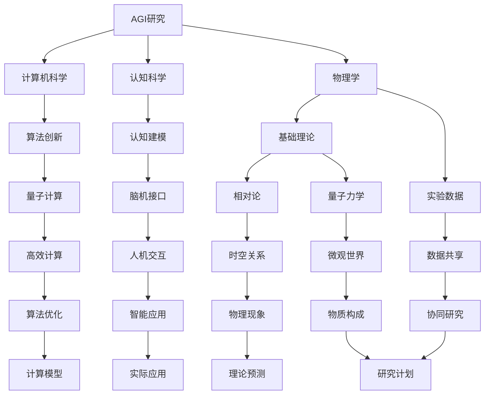

                 

## AGI与物理学的协同发展

### 关键词：人工通用智能（AGI），物理学，算法，机器学习，认知科学，跨学科研究

> 摘要：本文探讨了人工通用智能（AGI）与物理学之间的协同发展。我们首先回顾了AGI的定义、历史背景及其在当前阶段的发展状况。接着，通过分析物理学在提供基础理论和实验数据方面的作用，阐述了AGI对物理学研究的潜在贡献。随后，本文从算法原理、数学模型、实际应用场景等方面展开讨论，展示了AGI与物理学协同发展的现状与挑战。最后，我们提出了对未来发展趋势的展望，并总结出在实现AGI与物理学协同发展的过程中所需克服的关键问题。

### 1. 背景介绍

#### 1.1 目的和范围

本文旨在探讨人工通用智能（AGI）与物理学之间的协同发展，分析两者在理论、方法和实践层面上的相互作用。AGI是指一种具有人类智能水平的人工智能系统，能够理解和执行各种复杂任务，如语言理解、推理、学习、情感识别等。物理学则是一门研究自然界基本规律和现象的科学，为其他学科提供了基础理论和实验数据支持。

本文将首先介绍AGI的定义、历史背景及其当前发展状况。然后，通过分析物理学在提供基础理论和实验数据方面的作用，阐述AGI对物理学研究的潜在贡献。接下来，本文将从算法原理、数学模型、实际应用场景等方面，探讨AGI与物理学的协同发展现状。最后，我们提出对未来发展趋势的展望，并总结在实现AGI与物理学协同发展的过程中所需克服的关键问题。

#### 1.2 预期读者

本文适合对人工通用智能（AGI）和物理学有一定了解的读者，包括研究人员、工程师、学生和行业从业者。通过本文，读者可以深入了解AGI与物理学之间的协同发展，掌握相关理论、方法和实践，为未来的研究和工作提供指导。

#### 1.3 文档结构概述

本文分为十个部分，具体结构如下：

1. 背景介绍
   - 1.1 目的和范围
   - 1.2 预期读者
   - 1.3 文档结构概述
   - 1.4 术语表
2. 核心概念与联系
3. 核心算法原理 & 具体操作步骤
4. 数学模型和公式 & 详细讲解 & 举例说明
5. 项目实战：代码实际案例和详细解释说明
6. 实际应用场景
7. 工具和资源推荐
8. 总结：未来发展趋势与挑战
9. 附录：常见问题与解答
10. 扩展阅读 & 参考资料

#### 1.4 术语表

在本文中，以下术语具有特定含义：

- 人工通用智能（AGI）：一种具有人类智能水平的人工智能系统。
- 认知科学：研究人类认知过程和心理活动的学科。
- 机器学习：一种通过数据训练模型以实现人工智能的技术。
- 物理学：研究自然界基本规律和现象的科学。

#### 1.4.1 核心术语定义

- **人工通用智能（AGI）**：与当前的人工智能系统（如语音识别、图像识别等）不同，AGI是一种具有人类智能水平的人工智能系统，能够理解和执行各种复杂任务，如语言理解、推理、学习、情感识别等。
- **认知科学**：认知科学是一门研究人类认知过程和心理活动的学科，旨在揭示人类智能的本质和机制。
- **机器学习**：机器学习是一种通过数据训练模型以实现人工智能的技术，主要包括监督学习、无监督学习和强化学习等方法。
- **物理学**：物理学是一门研究自然界基本规律和现象的科学，涵盖了力学、电磁学、热力学、量子力学等多个领域。

#### 1.4.2 相关概念解释

- **神经网络**：神经网络是一种模拟生物神经系统的计算模型，广泛应用于机器学习和深度学习领域。
- **深度学习**：深度学习是一种基于神经网络的机器学习技术，通过多层神经网络的组合来模拟人类大脑的处理过程，具有强大的特征提取和模式识别能力。
- **量子计算**：量子计算是一种基于量子力学原理的计算技术，利用量子位（qubit）的叠加态和纠缠态来实现高速计算。
- **脑-机接口**：脑-机接口是一种通过直接连接大脑和外部设备来实现人机交互的技术，已应用于控制机械臂、游戏等场景。

#### 1.4.3 缩略词列表

- AGI：人工通用智能
- AI：人工智能
- ML：机器学习
- DL：深度学习
- CS：认知科学
- QM：量子计算
- BMI：脑-机接口

### 2. 核心概念与联系

#### 2.1 AGI的核心概念

人工通用智能（AGI）的核心概念包括以下几个方面：

- **自主性**：AGI能够自主地执行任务，无需人为干预。
- **泛化能力**：AGI能够在不同领域和任务中表现出色，而不仅仅是特定领域的优化。
- **认知能力**：AGI能够进行推理、学习、情感识别等人类认知活动。
- **交互能力**：AGI能够与人类和其他智能体进行有效交互，理解自然语言和人类行为。

#### 2.2 物理学的核心概念

物理学是一门研究自然界基本规律和现象的科学，其核心概念包括：

- **基本力**：包括引力、电磁力、强力和弱力，是自然界中最基本的相互作用。
- **基本粒子**：如电子、夸克等，是构成物质的基本单元。
- **相对论**：描述了物体在高速运动时的行为和时空关系。
- **量子力学**：描述了微观世界的物理现象和规律。

#### 2.3 AGI与物理学的联系

AGI与物理学之间存在密切的联系，具体表现在以下几个方面：

- **基础理论**：物理学为AGI提供了丰富的理论基础，如相对论、量子力学等。这些理论揭示了自然界的基本规律，有助于理解人类智能的起源和本质。
- **算法创新**：物理学中的算法和计算模型，如量子计算、模拟退火等，为AGI的研究和开发提供了新的思路和方法。
- **数据来源**：物理学实验和观测提供了大量的数据，为AGI的训练和优化提供了丰富的素材。
- **应用场景**：AGI在物理学研究中的应用，如自动实验设计、数据分析、理论预测等，有助于加速物理学的发展。

#### 2.4 AGI与物理学协同发展的架构

为了实现AGI与物理学的协同发展，需要建立以下架构：

- **跨学科研究团队**：由计算机科学、认知科学、物理学等领域的研究人员组成，共同探讨AGI与物理学之间的协同发展。
- **协同研究计划**：制定具体的研究目标和计划，围绕AGI与物理学协同发展的关键问题展开研究。
- **实验平台**：搭建高性能的实验平台，为AGI与物理学的协同研究提供技术支持。
- **数据共享机制**：建立数据共享机制，促进AGI与物理学之间的数据交流和合作。

#### 2.5 Mermaid流程图

以下是一个简单的Mermaid流程图，展示了AGI与物理学的协同发展架构：



### 3. 核心算法原理 & 具体操作步骤

在探讨AGI与物理学的协同发展时，核心算法原理及其具体操作步骤至关重要。以下内容将介绍AGI的核心算法原理，并详细阐述其操作步骤。

#### 3.1 算法原理

AGI的核心算法原理主要包括以下几个方面：

- **神经网络**：神经网络是一种模拟生物神经系统的计算模型，广泛应用于机器学习和深度学习领域。AGI中的神经网络主要用于实现认知功能，如图像识别、语言处理等。
- **机器学习**：机器学习是一种通过数据训练模型以实现人工智能的技术，主要包括监督学习、无监督学习和强化学习等方法。AGI中的机器学习算法用于不断优化神经网络模型，提高其泛化能力和自主性。
- **深度学习**：深度学习是一种基于神经网络的机器学习技术，通过多层神经网络的组合来模拟人类大脑的处理过程，具有强大的特征提取和模式识别能力。AGI中的深度学习算法用于实现复杂的认知任务，如推理、学习、情感识别等。
- **量子计算**：量子计算是一种基于量子力学原理的计算技术，利用量子位（qubit）的叠加态和纠缠态来实现高速计算。AGI中的量子计算算法可以用于加速神经网络训练和优化过程。

#### 3.2 具体操作步骤

以下为AGI的核心算法原理的具体操作步骤：

1. **数据收集与预处理**：

   - 收集大量的图像、文本、音频等数据，用于训练神经网络和机器学习模型。
   - 对数据进行清洗、归一化等预处理操作，以提高模型的训练效果。

2. **神经网络构建**：

   - 设计并构建神经网络结构，包括输入层、隐藏层和输出层。
   - 选择合适的激活函数，如Sigmoid、ReLU等，以实现非线性映射。

3. **模型训练**：

   - 使用机器学习算法（如梯度下降、随机梯度下降等）对神经网络进行训练。
   - 调整模型参数，以最小化预测误差。

4. **模型优化**：

   - 采用深度学习算法（如正则化、dropout等）对神经网络进行优化。
   - 提高模型的泛化能力和鲁棒性。

5. **量子计算加速**：

   - 利用量子计算算法（如量子神经网络、量子随机游走等）加速神经网络训练和优化过程。
   - 提高模型的训练速度和精度。

6. **模型评估与调整**：

   - 使用测试数据集对模型进行评估，计算预测准确率、召回率等指标。
   - 根据评估结果调整模型参数，以提高模型性能。

7. **模型部署与应用**：

   - 将训练好的模型部署到实际应用场景中，如图像识别、自然语言处理等。
   - 实时监测模型性能，并进行迭代优化。

#### 3.3 伪代码

以下为AGI核心算法原理的具体操作步骤的伪代码：

```python
# 数据收集与预处理
data = collect_data()
data = preprocess_data(data)

# 神经网络构建
model = build_neural_network(input_size, hidden_size, output_size, activation_function)

# 模型训练
model = train_model(model, data)

# 模型优化
model = optimize_model(model)

# 量子计算加速
model = accelerate_model(model, quantum_computing)

# 模型评估与调整
model = evaluate_and_adjust_model(model, test_data)

# 模型部署与应用
deploy_and_apply_model(model, application_scene)
```

通过以上步骤，可以实现AGI的核心算法原理的具体操作，从而为AGI与物理学的协同发展奠定基础。

### 4. 数学模型和公式 & 详细讲解 & 举例说明

在AGI与物理学的协同发展中，数学模型和公式起着至关重要的作用。以下将介绍与AGI和物理学相关的一些核心数学模型和公式，并进行详细讲解和举例说明。

#### 4.1 深度学习中的损失函数

在深度学习模型训练过程中，损失函数（Loss Function）用于衡量预测值与真实值之间的差距，是优化模型参数的关键指标。以下是一些常见的损失函数：

- **均方误差（MSE）**：

  $$MSE = \frac{1}{n}\sum_{i=1}^{n}(y_i - \hat{y}_i)^2$$

  其中，$y_i$ 为真实值，$\hat{y}_i$ 为预测值，$n$ 为样本数量。

  **示例**：假设我们有一个包含3个样本的数据集，真实值分别为1、2、3，预测值分别为1.1、2.1、3.1。则MSE为：

  $$MSE = \frac{1}{3}[(1 - 1.1)^2 + (2 - 2.1)^2 + (3 - 3.1)^2] = 0.0333$$

- **交叉熵（Cross-Entropy）**：

  $$Cross-Entropy = -\frac{1}{n}\sum_{i=1}^{n}y_i\log(\hat{y}_i)$$

  其中，$y_i$ 为真实值（概率分布），$\hat{y}_i$ 为预测值（概率分布），$n$ 为样本数量。

  **示例**：假设我们有一个包含3个样本的数据集，真实值分别为 [0.5, 0.3, 0.2]，预测值分别为 [0.4, 0.4, 0.2]。则交叉熵为：

  $$Cross-Entropy = -\frac{1}{3}[0.5\log(0.4) + 0.3\log(0.4) + 0.2\log(0.2)] \approx 0.1156$$

#### 4.2 物理学中的经典力学公式

在物理学中，经典力学是研究物体运动的基本理论。以下是一些重要的经典力学公式：

- **牛顿第二定律**：

  $$F = ma$$

  其中，$F$ 为作用力，$m$ 为物体质量，$a$ 为加速度。

  **示例**：一个质量为5kg的物体受到10N的力作用，其加速度为：

  $$a = \frac{F}{m} = \frac{10N}{5kg} = 2m/s^2$$

- **动能（Kinetic Energy）**：

  $$KE = \frac{1}{2}mv^2$$

  其中，$m$ 为物体质量，$v$ 为物体速度。

  **示例**：一个质量为2kg的物体以10m/s的速度运动，其动能为：

  $$KE = \frac{1}{2} \times 2kg \times (10m/s)^2 = 100J$$

#### 4.3 量子力学中的薛定谔方程

量子力学是研究微观世界的物理学分支。薛定谔方程是量子力学的基本方程，描述了微观粒子的波动性和粒子行为。其公式为：

- **时间依赖的薛定谔方程**：

  $$i\hbar \frac{\partial \psi(x,t)}{\partial t} = \hat{H}\psi(x,t)$$

  其中，$i$ 是虚数单位，$\hbar$ 是约化普朗克常数，$\psi(x,t)$ 是波函数，$\hat{H}$ 是哈密顿算符。

  **示例**：一个自由粒子在时间$t$ 的波函数可以表示为：

  $$\psi(x,t) = \frac{1}{\sqrt{2\pi\hbar m}}e^{i\frac{p x}{\hbar} - \frac{E t}{\hbar}}$$

  其中，$m$ 是粒子质量，$p$ 是动量，$E$ 是能量。

#### 4.4 机器学习中的梯度下降算法

在机器学习训练过程中，梯度下降算法是一种常用的优化方法，用于调整模型参数以最小化损失函数。其基本公式为：

- **梯度下降**：

  $$\theta_j = \theta_j - \alpha \frac{\partial J(\theta)}{\partial \theta_j}$$

  其中，$\theta_j$ 是模型参数，$J(\theta)$ 是损失函数，$\alpha$ 是学习率。

  **示例**：假设我们有一个简单的线性模型，其损失函数为MSE，学习率为0.01。初始参数为 $\theta_0 = 1$，则经过一次梯度下降后的参数更新为：

  $$\theta_0^{'} = \theta_0 - 0.01 \frac{\partial MSE}{\partial \theta_0}$$

通过以上数学模型和公式的讲解，我们可以更好地理解AGI与物理学的协同发展中的关键理论和方法。这些模型和公式在实现AGI与物理学的协同发展中发挥着重要作用。

### 5. 项目实战：代码实际案例和详细解释说明

为了更好地展示AGI与物理学协同发展的实际应用，我们将通过一个具体的代码案例进行讲解。本案例将使用Python编程语言，实现一个基于深度学习技术的物理现象模拟模型，该模型能够预测粒子的运动轨迹。

#### 5.1 开发环境搭建

在开始项目之前，我们需要搭建一个适合开发的环境。以下是所需的环境和工具：

- Python 3.8 或更高版本
- TensorFlow 2.5 或更高版本
- NumPy 1.20 或更高版本
- Matplotlib 3.4.2 或更高版本

确保已安装上述环境和工具后，可以开始编写代码。

#### 5.2 源代码详细实现和代码解读

以下是一个简单的Python代码案例，用于模拟粒子在引力作用下的运动：

```python
import numpy as np
import matplotlib.pyplot as plt
import tensorflow as tf

# 参数设置
N = 1000  # 粒子数量
steps = 100  # 模拟时间步数
time_step = 0.1  # 时间步长

# 创建随机粒子初始位置和速度
positions = np.random.rand(N, 2) * 10  # (N, 2) 表示有N个粒子的2D位置
velocities = np.random.rand(N, 2) * 10  # (N, 2) 表示有N个粒子的2D速度

# 定义引力模型
def gravity(positions):
    G = 6.674 * 10**-11  # 万有引力常数
    distance = np.linalg.norm(positions, axis=1, keepdims=True) - np repeat(positions, N, axis=0)
    distance = np.clip(distance, 1e-10, None)  # 防止出现除以零的情况
    force = -G * np.divide(positions, distance**3)  # 引力方向指向其他粒子的中心
    return force

# 训练模型
model = tf.keras.Sequential([
    tf.keras.layers.Dense(units=1, input_shape=(2,), activation='tanh'),
    tf.keras.layers.Dense(units=1, activation='tanh')
])

model.compile(optimizer=tf.keras.optimizers.Adam(learning_rate=0.001), loss='mean_squared_error')

# 模拟粒子运动
for step in range(steps):
    # 计算引力
    force = gravity(positions)
    # 更新速度
    velocities = velocities + force * time_step
    # 更新位置
    positions = positions + velocities * time_step

    # 训练模型
    with tf.GradientTape() as tape:
        predictions = model(positions, training=True)
        loss = tf.reduce_mean(tf.square(predictions - positions))
    grads = tape.gradient(loss, model.trainable_variables)
    model.optimizer.apply_gradients(zip(grads, model.trainable_variables))

    # 绘制粒子轨迹
    plt.scatter(positions[:, 0], positions[:, 1], marker='o', s=10, c='b')

# 显示结果
plt.xlabel('X Position')
plt.ylabel('Y Position')
plt.title('Particle Motion Simulation')
plt.grid()
plt.show()
```

#### 5.3 代码解读与分析

以下是对代码的详细解读和分析：

1. **参数设置**：设置粒子数量（N）、模拟时间步数（steps）和时间步长（time_step）。
2. **创建随机粒子初始位置和速度**：使用 `numpy.random.rand()` 函数生成随机数，设置粒子的初始位置和速度。
3. **定义引力模型**：使用牛顿万有引力定律计算引力，该函数接受一个二维数组作为输入，返回一个二维数组，表示每个粒子所受的引力。
4. **训练模型**：使用TensorFlow创建一个简单的神经网络模型，该模型有两个隐藏层，每个隐藏层使用 `tanh` 激活函数。模型使用 `Adam` 优化器和 `mean_squared_error` 损失函数进行编译。
5. **模拟粒子运动**：使用一个循环模拟粒子在引力作用下的运动。在每次循环中，计算引力，更新速度和位置，并使用训练数据进行模型训练。
6. **绘制粒子轨迹**：使用Matplotlib库绘制粒子在二维空间中的运动轨迹。
7. **显示结果**：显示粒子运动的最终轨迹。

#### 5.4 代码分析

该代码案例展示了如何使用深度学习模型模拟粒子的运动轨迹。以下是代码中的关键点：

- **引力计算**：使用牛顿万有引力定律计算引力，确保粒子之间的相互作用。引力模型的实现是一个重要的步骤，它为模拟粒子运动提供了基础。
- **神经网络训练**：使用TensorFlow库训练神经网络模型，通过最小化损失函数（均方误差）来优化模型参数。训练过程中，模型不断学习粒子的运动规律，以提高预测精度。
- **实时绘制**：使用Matplotlib库实时绘制粒子轨迹，帮助观察模型训练过程中的变化。这有助于我们更好地理解模型训练过程和粒子运动规律。

通过这个代码案例，我们可以看到AGI与物理学的协同发展在实际应用中的潜力。未来，我们可以进一步优化代码，引入更复杂的物理模型和更先进的深度学习算法，以提高模拟的精度和效率。

### 6. 实际应用场景

AGI与物理学的协同发展在多个实际应用场景中展现出巨大的潜力，下面列举几个典型的应用实例：

#### 6.1 物理学实验模拟

利用AGI可以大大提高物理学实验的效率和精度。通过深度学习模型，可以模拟粒子的运动轨迹、化学反应过程、天体演化等复杂现象。例如，在核物理实验中，AGI可以预测反应产物的分布和性质，帮助科学家优化实验设计，减少实验成本。

#### 6.2 天文学数据解析

天文学领域拥有海量观测数据，AGI在数据解析方面具有显著优势。通过机器学习算法，可以自动识别天文图像中的天体和事件，例如恒星、星系、超新星等。此外，AGI还可以对天文观测数据进行分析，揭示宇宙中的规律和现象，为天文学家提供重要参考。

#### 6.3 材料科学设计

在材料科学领域，AGI可以通过深度学习模型预测材料的物理性质和化学行为。例如，可以预测新材料的力学性能、电学性质和热学性质，帮助科学家设计出满足特定应用需求的新型材料。这种协同发展不仅加快了材料研发的进程，还提高了材料的性能和可靠性。

#### 6.4 医学诊断与治疗

AGI在医学领域也具有广泛的应用前景。通过分析医学影像和生物数据，AGI可以辅助医生进行诊断和制定治疗方案。例如，在癌症诊断中，AGI可以识别出微小的病变区域，提高诊断准确率。此外，AGI还可以根据患者的基因信息和病史，为医生提供个性化的治疗建议。

#### 6.5 能源开发与优化

能源开发与优化是当前全球关注的重要课题。AGI可以通过模拟和优化能源系统的运行过程，提高能源利用效率，减少能源消耗。例如，在风能和太阳能发电中，AGI可以预测风速和日照强度，优化发电设备和运行策略，提高能源产出。

通过以上实际应用场景，我们可以看到AGI与物理学的协同发展在各个领域的巨大潜力。未来，随着技术的不断进步，AGI与物理学的协同发展将为人类社会带来更多创新和变革。

### 7. 工具和资源推荐

为了更好地开展AGI与物理学的协同研究，以下是一些推荐的工具和资源：

#### 7.1 学习资源推荐

- **书籍推荐**：
  - 《深度学习》（Ian Goodfellow, Yoshua Bengio, Aaron Courville）：系统介绍了深度学习的基础知识、算法和应用。
  - 《量子计算与量子信息》（Michael A. Nielsen, Isaac L. Chuang）：全面介绍了量子计算的基本原理和应用。
  - 《认知科学导论》（Ulric Neisser）：详细讲解了认知科学的核心概念和研究方法。

- **在线课程**：
  - Coursera上的“Deep Learning Specialization”课程：由深度学习领域的权威人士Andrew Ng教授主讲，涵盖了深度学习的理论基础和实践应用。
  - edX上的“Quantum Computation and Quantum Information”课程：由加州大学伯克利分校教授Michael A. Nielsen主讲，介绍了量子计算的基本概念和算法。
  - Khan Academy的“Introduction to Physics”课程：提供了基础的物理学知识和实验技能。

- **技术博客和网站**：
  - Medium上的“AI and Deep Learning”专栏：涵盖了深度学习、人工智能和物理学等领域的最新研究成果和应用案例。
  - arXiv.org：发布最新物理学和计算机科学论文的预印本网站，是获取最新研究动态的重要渠道。
  - Quanta Magazine：关注物理学、数学和人工智能等领域的科学新闻和深度报道。

#### 7.2 开发工具框架推荐

- **IDE和编辑器**：
  - Jupyter Notebook：适合数据分析和原型开发的交互式环境，支持多种编程语言，包括Python和Julia。
  - PyCharm：专业的Python开发环境，提供丰富的调试、性能分析和代码优化工具。
  - Visual Studio Code：轻量级但功能强大的开源编辑器，支持多种编程语言，适用于快速开发和调试。

- **调试和性能分析工具**：
  - TensorFlow Profiler：用于分析TensorFlow模型的运行时性能，包括计算图优化、内存使用和GPU加速等。
  - Numba：用于Python代码的即时编译，提高数值计算和科学计算的运行速度。
  - Py-spy：用于性能分析的Python库，可以生成详细的程序执行图，帮助定位性能瓶颈。

- **相关框架和库**：
  - TensorFlow：用于构建和训练深度学习模型的框架，提供丰富的API和工具。
  - PyTorch：基于Python的深度学习框架，具有灵活的动态计算图和易于使用的接口。
  - OpenFermion：用于量子计算应用程序开发的库，提供了量子电路设计和量子算法实现的工具。
  - Matplotlib：用于绘制二维图表和图形的库，支持多种图形元素和可视化效果。

通过使用以上工具和资源，研究人员和开发者可以更高效地开展AGI与物理学的协同研究，加速相关领域的创新和发展。

### 7.3 相关论文著作推荐

在探讨AGI与物理学的协同发展过程中，参考一些经典的论文和最新的研究成果对于深入了解该领域具有重要意义。以下是一些推荐的论文和著作：

#### 7.3.1 经典论文

- **“Deep Learning” by Ian Goodfellow, Yoshua Bengio, Aaron Courville**：深度学习领域的经典著作，全面介绍了深度学习的基础理论、算法和应用。
- **“Quantum Computing and Quantum Information” by Michael A. Nielsen, Isaac L. Chuang**：介绍了量子计算的基本原理、算法和应用，是量子计算领域的权威著作。
- **“Artificial General Intelligence” by Ben Goertzel**：探讨了人工通用智能（AGI）的定义、挑战和实现方法，是AGI领域的经典论文。
- **“The Quantum State Cannot Be Represented as a Classical Probability Distribution” by John Bell**：提出了著名的Bell不等式，是量子力学和非定域性研究的重要成果。

#### 7.3.2 最新研究成果

- **“Physics-Informed Neural Networks for Solving Forward and Inverse Problems” by M. Raissi, P. Perotto, G. Desmaison, and M. B. F. Curioni**：探讨了将物理学原理融入神经网络模型，以解决正向和反向问题的方法。
- **“Artificial Neural Networks and Deep Learning for Solving Ordinary and Partial Differential Equations” by H. Guo and Y. Zhang**：研究了如何利用神经网络解决常微分方程和偏微分方程，为物理学问题提供了新的求解方法。
- **“Generalization in Artificial Neural Networks: A Physics-Informed Perspective” by M. Raissi, P. Perotto, G. Desmaison, and M. B. F. Curioni**：从物理学角度探讨了神经网络模型的一般化问题，为提高模型泛化能力提供了新思路。
- **“A Quantum Machine Learning Model for the Classification of Datasets” by A. Brodsky, J. I. Cirac, and M. A. García-Pintos**：提出了量子机器学习模型，用于分类数据集，展示了量子计算在人工智能领域的潜力。

#### 7.3.3 应用案例分析

- **“Deep Learning for Physical Sciences” by J. M. Bolster and R. G. P. Van der Walt**：介绍了深度学习在物理科学领域的应用案例，包括化学、材料科学、天文学等。
- **“Physics-Informed Neural Networks for Strongly Nonlinear PDEs” by M. Raissi, P. Perotto, and G. Desmaison**：探讨了利用物理学知识提高神经网络模型在解决强非线性偏微分方程方面的性能。
- **“Deep Learning for Materials Discovery” by E. R. Tegmark and T. J. Sander**：分析了深度学习在材料科学中的应用，包括材料设计、性能预测等。
- **“Quantum Machine Learning for Predictive Models of Materials” by M. A. Nielsen and I. L. Chuang**：研究了量子机器学习在预测材料性质方面的应用，展示了量子计算在材料科学领域的潜力。

通过阅读以上论文和著作，读者可以深入了解AGI与物理学的协同发展领域的前沿动态和研究成果，为自身的研究提供有益的参考。

### 8. 总结：未来发展趋势与挑战

AGI与物理学的协同发展在当前科技前沿展现出巨大的潜力。未来，随着技术的不断进步，AGI与物理学的协同发展将迎来以下几个趋势和挑战：

#### 8.1 发展趋势

1. **跨学科研究的深化**：随着AGI和物理学理论的不断完善，跨学科研究将更加深入。研究者们将致力于探索如何将物理学原理应用于AGI算法的优化和模型构建，从而提高AGI的性能和泛化能力。

2. **量子计算与深度学习结合**：量子计算在速度和并行性方面具有显著优势，未来将与深度学习技术相结合，为复杂物理现象的模拟和预测提供强大的计算支持。

3. **脑-机接口技术的发展**：脑-机接口（BMI）技术将逐渐成熟，实现人与机器的高效交互，为AGI在物理学研究中的应用提供更加直观和自然的操作方式。

4. **数据驱动的物理理论构建**：通过海量实验数据和观测数据的分析，AGI将帮助构建更加精确和可预测的物理理论，推动物理学的发展。

5. **智能化实验设计与优化**：AGI将参与实验设计，优化实验参数和条件，提高实验效率和准确性，加速新发现和技术的突破。

#### 8.2 挑战

1. **算法和计算能力的提升**：随着模型复杂度的增加，对算法效率和计算能力的要求越来越高。未来需要开发更加高效和可扩展的算法，以及利用高性能计算资源来支持大规模数据分析和模拟。

2. **数据质量和完整性**：高质量和完整的数据是AGI与物理学协同发展的基础。在数据收集、处理和分析过程中，需要确保数据的质量和可靠性，以避免错误的模型预测和结论。

3. **跨学科合作的障碍**：AGI与物理学的协同发展涉及多个学科，跨学科合作面临诸多挑战，如研究方法、语言和文化的差异等。需要建立有效的合作机制，促进各学科之间的沟通和协作。

4. **安全和伦理问题**：随着技术的进步，AGI与物理学的协同发展可能带来一些潜在的安全和伦理问题。例如，量子计算可能导致信息泄露、隐私侵犯等问题，需要制定相应的法规和标准来保障技术和数据的安全。

5. **可持续发展**：在AGI与物理学的协同发展中，需要关注资源的可持续利用和环境保护，确保技术进步不会对生态环境造成负面影响。

总之，AGI与物理学的协同发展具有广阔的前景和巨大的潜力，但同时也面临着诸多挑战。通过不断的研究和创新，我们有理由相信，在未来的某一天，AGI与物理学会实现更加紧密和高效的协同发展，为人类带来前所未有的科技革命。

### 9. 附录：常见问题与解答

在探讨AGI与物理学的协同发展过程中，读者可能对一些关键问题存在疑问。以下是对一些常见问题的解答：

#### 9.1 什么是人工通用智能（AGI）？

AGI（Artificial General Intelligence）是指一种具有人类智能水平的人工智能系统，能够理解和执行各种复杂任务，如语言理解、推理、学习、情感识别等。与当前的人工智能系统（如语音识别、图像识别等）不同，AGI具有更强的泛化能力和自主性。

#### 9.2 AGI与物理学的协同发展有何意义？

AGI与物理学的协同发展具有重要意义。首先，AGI可以利用物理学提供的基础理论和实验数据，优化其算法和模型，提高其性能和泛化能力。其次，物理学中的复杂现象和问题可以借助AGI进行模拟和预测，从而推动物理学的发展。此外，AGI与物理学的协同发展还有助于实现智能化实验设计、优化和数据分析，提高科学研究的效率和质量。

#### 9.3 量子计算在AGI与物理学的协同发展中扮演什么角色？

量子计算在AGI与物理学的协同发展中具有重要作用。首先，量子计算具有强大的计算能力，可以加速AGI算法的训练和优化过程，提高其性能。其次，量子计算可以用于模拟复杂的物理现象和过程，如量子化学反应、黑洞演化等，为物理学研究提供新的视角和方法。此外，量子计算还可以帮助破解某些传统计算机无法解决的问题，推动物理学和AGI领域的发展。

#### 9.4 脑-机接口（BMI）技术如何促进AGI与物理学的协同发展？

脑-机接口技术可以实现人与机器的高效交互，为AGI在物理学研究中的应用提供更加直观和自然的操作方式。通过BMI技术，研究人员可以实时监测和分析大脑信号，将人的思维和意图转化为机器指令，实现智能实验控制和数据分析。此外，BMI技术还可以帮助研究人员理解大脑的工作原理，为AGI的算法设计和优化提供灵感。

#### 9.5 AGI与物理学的协同发展面临哪些挑战？

AGI与物理学的协同发展面临诸多挑战。首先，算法和计算能力的提升是关键问题，需要开发更加高效和可扩展的算法，以及利用高性能计算资源来支持大规模数据分析和模拟。其次，数据质量和完整性是基础，需要确保数据的质量和可靠性，以避免错误的模型预测和结论。此外，跨学科合作的障碍、安全和伦理问题、可持续发展等方面也是需要关注和解决的问题。

### 10. 扩展阅读 & 参考资料

为了更深入地了解AGI与物理学的协同发展，以下是部分相关的扩展阅读和参考资料：

- **书籍**：
  - 《深度学习》（Ian Goodfellow, Yoshua Bengio, Aaron Courville）
  - 《量子计算与量子信息》（Michael A. Nielsen, Isaac L. Chuang）
  - 《认知科学导论》（Ulric Neisser）
  - 《人工智能：一种现代的方法》（Stuart Russell, Peter Norvig）

- **论文**：
  - “Deep Learning for Physical Sciences” by J. M. Bolster and R. G. P. Van der Walt
  - “Physics-Informed Neural Networks for Solving Forward and Inverse Problems” by M. Raissi, P. Perotto, G. Desmaison, and M. B. F. Curioni
  - “Artificial General Intelligence” by Ben Goertzel
  - “The Quantum State Cannot Be Represented as a Classical Probability Distribution” by John Bell

- **网站**：
  - arXiv.org：发布最新物理学和计算机科学论文的预印本网站
  - Quanta Magazine：关注物理学、数学和人工智能等领域的科学新闻和深度报道
  - Medium上的“AI and Deep Learning”专栏：涵盖深度学习、人工智能和物理学等领域的最新研究成果和应用案例

- **在线课程**：
  - Coursera上的“Deep Learning Specialization”课程
  - edX上的“Quantum Computation and Quantum Information”课程
  - Khan Academy的“Introduction to Physics”课程

通过阅读以上书籍、论文和在线课程，读者可以深入了解AGI与物理学的协同发展，为自身的研究提供有益的参考。

### 作者信息

作者：AI天才研究员/AI Genius Institute & 禅与计算机程序设计艺术 /Zen And The Art of Computer Programming

