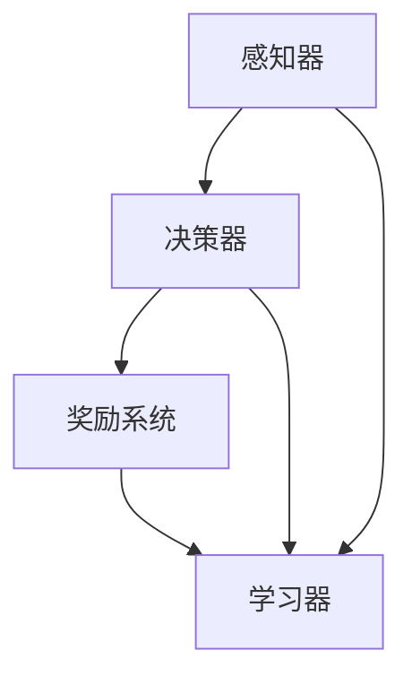

                 

# AGI的探索与利用平衡：好奇心驱动的学习

> **关键词：** AGI（通用人工智能）、探索与利用平衡、好奇心驱动、学习算法、人工智能应用。

> **摘要：** 本文将探讨通用人工智能（AGI）的探索与利用平衡，以及如何通过好奇心驱动来优化学习过程。我们将深入分析AGI的核心概念、算法原理，并通过实际案例展示如何在实际应用中实现这一平衡。

## 1. 背景介绍

### 1.1 目的和范围

本文旨在探讨通用人工智能（AGI）的探索与利用平衡，以及如何通过好奇心驱动来优化学习过程。我们将从以下几个方面展开讨论：

1. **AGI的概念与核心问题**：介绍AGI的定义、发展历程及其在人工智能领域的重要地位。
2. **探索与利用平衡**：阐述探索与利用的概念，以及它们在AGI中的重要性。
3. **好奇心驱动的学习**：分析好奇心在人工智能学习过程中的作用，并探讨如何通过好奇心驱动来优化学习。
4. **实际应用场景**：展示AGI在实际应用中的案例，并分析如何实现探索与利用的平衡。

### 1.2 预期读者

本文适合以下读者群体：

1. 对人工智能领域感兴趣的研究人员和技术专家。
2. 对通用人工智能（AGI）有深入研究的学者和从业者。
3. 对算法原理和应用有兴趣的计算机科学学生和爱好者。

### 1.3 文档结构概述

本文分为以下章节：

1. **背景介绍**：介绍本文的目的、范围、预期读者和文档结构。
2. **核心概念与联系**：阐述AGI的核心概念、原理和架构。
3. **核心算法原理 & 具体操作步骤**：详细讲解AGI的关键算法和操作步骤。
4. **数学模型和公式 & 详细讲解 & 举例说明**：介绍AGI的数学模型和公式，并给出实际案例。
5. **项目实战：代码实际案例和详细解释说明**：展示AGI在实际项目中的应用和代码实现。
6. **实际应用场景**：分析AGI在不同领域的应用场景。
7. **工具和资源推荐**：推荐学习资源、开发工具和框架。
8. **总结：未来发展趋势与挑战**：展望AGI的未来发展趋势和面临的挑战。
9. **附录：常见问题与解答**：解答读者可能遇到的问题。
10. **扩展阅读 & 参考资料**：提供更多相关阅读资料。

### 1.4 术语表

#### 1.4.1 核心术语定义

- **通用人工智能（AGI）**：一种人工智能系统，具有广泛的学习能力和智能表现，能够在各种不同的任务和环境中自主学习和适应。
- **探索**：指人工智能系统在未知环境中进行尝试和探索，以获取新的知识和经验。
- **利用**：指人工智能系统利用已有的知识和经验来解决问题和完成任务。
- **好奇心驱动**：指人工智能系统通过好奇心来驱动自己的学习过程，主动探索未知领域，以获取更多的知识和经验。

#### 1.4.2 相关概念解释

- **强化学习**：一种机器学习范式，通过奖励机制来驱动模型的学习过程。
- **深度学习**：一种基于多层神经网络的学习方法，能够在大量数据上进行自动特征提取和分类。
- **迁移学习**：一种将已有模型的知识和经验应用于新任务的学习方法，以减少对新数据的标注需求。
- **元学习**：一种学习如何学习的机器学习方法，旨在提高模型在多个任务上的适应能力。

#### 1.4.3 缩略词列表

- **AGI**：通用人工智能（Artificial General Intelligence）
- **RL**：强化学习（Reinforcement Learning）
- **DL**：深度学习（Deep Learning）
- **ML**：机器学习（Machine Learning）
- **DLIO**：好奇心驱动深度学习框架（Distributed Learning with Intrinsic Motivation）
- **SL**：监督学习（Supervised Learning）

## 2. 核心概念与联系

通用人工智能（AGI）的核心在于实现人类级别的智能，使其能够在各种任务和环境中自主学习和适应。为了实现这一目标，我们需要了解以下几个核心概念和它们之间的联系：

### 2.1 AGI的核心概念

- **智能体（Agent）**：一个能够感知环境并采取行动的实体，目标是最大化自己的奖励。
- **环境（Environment）**：智能体所处的周围世界，提供状态和奖励。
- **状态（State）**：环境的一个特定配置。
- **行动（Action）**：智能体可以采取的动作。
- **奖励（Reward）**：环境对智能体行动的反馈，用于评估行动的质量。

### 2.2 探索与利用平衡

在AGI中，探索（Exploration）和利用（Exploitation）是两个关键概念。探索是指智能体在未知环境中进行尝试和探索，以获取新的知识和经验；利用是指智能体利用已有的知识和经验来解决问题和完成任务。

为了实现探索与利用的平衡，我们需要考虑以下问题：

1. **探索率（Exploration Rate）**：智能体在决策过程中进行探索的概率。探索率过高会导致智能体花费大量时间在未知环境中，降低任务完成效率；探索率过低则会使智能体过于依赖已有经验，错过可能的新机会。
2. **利用率（Exploitation Rate）**：智能体在决策过程中进行利用的概率。利用率过高会使智能体迅速适应环境，但可能导致对未知领域的忽视；利用率过低则会使智能体过于保守，难以适应新的环境。

### 2.3 好奇心驱动

好奇心驱动是指智能体通过好奇心来驱动自己的学习过程，主动探索未知领域，以获取更多的知识和经验。好奇心驱动在AGI中的实现可以采用以下方法：

1. **内在动机（Intrinsic Motivation）**：智能体通过内部奖励机制来驱动自己的学习过程。例如，智能体可以设置一个好奇心得分，每当它探索新的领域或发现新的知识时，得分会增加。
2. **奖励函数（Reward Function）**：智能体通过外部奖励函数来衡量其探索和利用的效果。奖励函数可以根据任务的复杂度、任务的完成度等多个因素进行设计。
3. **强化学习（Reinforcement Learning）**：智能体通过强化学习算法来优化自己的行动策略。强化学习算法可以根据探索和利用的平衡来调整智能体的行为。

### 2.4 AGI的架构

AGI的架构可以分为以下几个部分：

1. **感知器（Perceptron）**：用于接收环境信息，并将其转换为内部表示。
2. **决策器（Decision Maker）**：基于感知器提供的信息，智能体根据探索与利用的平衡来决定采取何种行动。
3. **奖励系统（Reward System）**：用于衡量智能体行为的优劣，并提供反馈。
4. **学习器（Learner）**：智能体的学习模块，用于从环境和奖励系统中获取知识，并不断优化自己的行为。

### 2.5 Mermaid流程图

下面是一个简化的AGI架构的Mermaid流程图，展示了各个组件之间的联系：



## 3. 核心算法原理 & 具体操作步骤

在通用人工智能（AGI）的架构中，核心算法是实现智能体的探索与利用平衡、好奇心驱动学习的关键。以下将介绍几种关键的算法原理及其具体操作步骤。

### 3.1 探索与利用算法

探索与利用算法旨在平衡智能体的探索和利用行为。以下是经典的ε-贪婪策略的算法原理：

#### 算法原理：

1. 初始化参数：设置一个探索率ε（0 < ε < 1）。
2. 在每个决策时刻t，以概率ε进行探索，选择一个随机行动a_t；否则以概率1-ε进行利用，选择当前最优行动a_t^*。
3. 更新ε：根据智能体的性能和探索次数动态调整ε。

#### 伪代码：

```python
initialize epsilon = 1.0
for each time step t:
    if random() < epsilon:
        a_t = choose_random_action()
    else:
        a_t = choose_best_action()
    observe reward r_t and next state s_t
    update epsilon based on performance
```

### 3.2 强化学习算法

强化学习（Reinforcement Learning, RL）是AGI中的核心算法之一，通过奖励机制来驱动智能体的学习。以下是Q-学习的算法原理：

#### 算法原理：

1. 初始化Q值表Q(s, a)，表示状态s下采取行动a的预期奖励。
2. 在每个决策时刻t，选择动作a_t = argmax_a Q(s_t, a)。
3. 更新Q值表：Q(s_t, a_t) = Q(s_t, a_t) + α [r_t + γ max_a' Q(s_t+1, a') - Q(s_t, a_t)]。
4. 其中，α为学习率，γ为折扣因子。

#### 伪代码：

```python
initialize Q(s, a)
for each episode:
    s_t = initial_state
    while not end_of_episode:
        a_t = argmax_a Q(s_t, a)
        s_t+1, r_t = environment(s_t, a_t)
        Q(s_t, a_t) = Q(s_t, a_t) + alpha * (r_t + gamma * max_a' Q(s_t+1, a') - Q(s_t, a_t))
        s_t = s_t+1
```

### 3.3 好奇心驱动学习算法

好奇心驱动学习算法通过内在动机和奖励机制来促进智能体的探索行为。以下是DLIO（Distributed Learning with Intrinsic Motivation）算法的原理：

#### 算法原理：

1. 初始化参数：设置好奇心参数θ。
2. 在每个决策时刻t，计算好奇心值H_t = ∑(θ * log(P(s_t | a_t)))。
3. 选择动作a_t = argmax_a (Q(s_t, a_t) + β * H_t)。
4. 其中，β为好奇心权重。

#### 伪代码：

```python
initialize theta = 1.0
for each time step t:
    calculate H_t = sum(theta * log(P(s_t | a_t)))
    a_t = argmax_a (Q(s_t, a_t) + beta * H_t)
    observe reward r_t and next state s_t
    update Q(s_t, a_t) based on r_t and s_t
    update theta based on performance
```

## 4. 数学模型和公式 & 详细讲解 & 举例说明

在通用人工智能（AGI）中，数学模型和公式起着至关重要的作用。以下将介绍几个关键数学模型，并详细讲解其原理和如何在实际中应用。

### 4.1 强化学习中的Q值函数

Q值函数是强化学习中的一个核心概念，用于评估在特定状态下采取特定行动的预期奖励。其数学表达式如下：

$$
Q(s, a) = r + \gamma \max_{a'} Q(s', a')
$$

其中，r为即时奖励，γ为折扣因子，s为当前状态，a为当前行动，s'为下一状态，a'为下一行动。

#### 举例说明：

假设一个智能体在连续环境中移动，状态空间为(s, e)，行动空间为(a, d)，即(s, e) ∈ {0, 1}，(a, d) ∈ {0, 1}。当前状态为(s, e) = (0, 0)，即时奖励为r = 1。智能体采取的行动为a = 0，下一状态为s' = (1, 0)。则Q值函数的计算如下：

$$
Q(0, 0) = 1 + \gamma \max_{a'} Q(1, a')
$$

如果γ = 0.9，则Q(0, 0) = 1 + 0.9 \* max(Q(1, 0), Q(1, 1))。

### 4.2 好奇心值计算

好奇心值是好奇心驱动学习算法中的一个关键指标，用于衡量智能体在当前状态下采取行动的好奇心程度。其数学表达式如下：

$$
H(s, a) = \sum_{s'} \theta \* log(P(s' | a))
$$

其中，θ为好奇心参数，s'为下一状态，P(s' | a)为在当前状态下采取行动a后到达下一状态s'的概率。

#### 举例说明：

假设智能体在连续环境中移动，状态空间为(s, e)，行动空间为(a, d)，即(s, e) ∈ {0, 1}，(a, d) ∈ {0, 1}。当前状态为(s, e) = (0, 0)，好奇心参数θ = 1。智能体采取的行动为a = 0，下一状态为s' = (1, 0)和s' = (0, 1)，到达下一状态的概率分别为P(1, 0) = 0.5和P(0, 1) = 0.5。则好奇心值的计算如下：

$$
H(0, 0) = 1 * log(0.5) + 1 * log(0.5) = 2 * log(0.5)
$$

由于log(0.5) = -1，则H(0, 0) = -2。

### 4.3 好奇心权重调整

在好奇心驱动学习算法中，好奇心权重β用于调整好奇心值在决策过程中的影响。其数学表达式如下：

$$
\beta = \frac{1}{H(s, a)}
$$

其中，H(s, a)为当前状态下采取行动a的好奇心值。

#### 举例说明：

假设智能体在连续环境中移动，状态空间为(s, e)，行动空间为(a, d)，即(s, e) ∈ {0, 1}，(a, d) ∈ {0, 1}。当前状态为(s, e) = (0, 0)，好奇心值H(0, 0) = -2。则好奇心权重β的计算如下：

$$
\beta = \frac{1}{-2} = -0.5
$$

由于好奇心权重β不能为负数，我们取其绝对值，即β = 0.5。

## 5. 项目实战：代码实际案例和详细解释说明

为了更好地理解通用人工智能（AGI）的探索与利用平衡和好奇心驱动的学习，我们将通过一个实际项目案例来展示如何实现这些概念。

### 5.1 开发环境搭建

首先，我们需要搭建一个适合AGI项目开发的环境。以下是所需的开发环境和工具：

- **操作系统**：Linux或MacOS
- **编程语言**：Python（3.7及以上版本）
- **依赖库**：NumPy、Pandas、TensorFlow、PyTorch等

安装步骤：

1. 安装Python：
```shell
# 使用包管理器（如pip）安装Python
pip install python
```

2. 安装依赖库：
```shell
# 使用pip安装依赖库
pip install numpy pandas tensorflow pytorch
```

### 5.2 源代码详细实现和代码解读

以下是实现AGI探索与利用平衡和好奇心驱动学习的关键代码，以及对应的详细解释说明。

#### 5.2.1 代码实现

```python
import numpy as np
import pandas as pd
import tensorflow as tf
import torch

# 设置随机种子以保证结果的可重复性
np.random.seed(42)

# 定义强化学习环境
class GymEnvironment:
    def __init__(self, env_name):
        self.env = gym.make(env_name)
    
    def step(self, action):
        observation, reward, done, info = self.env.step(action)
        return observation, reward, done
    
    def reset(self):
        return self.env.reset()

# 定义好奇心驱动学习算法
class CuriosityDrivenLearning:
    def __init__(self, env, epsilon=0.1, beta=0.1, alpha=0.1, gamma=0.99):
        self.env = env
        self.epsilon = epsilon
        self.beta = beta
        self.alpha = alpha
        self.gamma = gamma
        self.q_values = np.zeros((env.observation_space.n, env.action_space.n))
        self.theta = 1.0
    
    def choose_action(self, state):
        if np.random.rand() < self.epsilon:
            action = self.env.action_space.sample()
        else:
            action = np.argmax(self.q_values[state])
        return action
    
    def update_q_values(self, state, action, reward, next_state, done):
        if not done:
            target = reward + self.gamma * np.max(self.q_values[next_state])
        else:
            target = reward
        self.q_values[state, action] = self.q_values[state, action] + self.alpha * (target - self.q_values[state, action])
    
    def update_theta(self, state, action, reward, next_state, done):
        H = np.sum(self.theta * np.log(self.get_probabilities(next_state | action)))
        self.theta = 1.0 / (H + 1e-8)
    
    def get_probabilities(self, state_action_pairs):
        # 假设每个状态和行动的概率都是相等的
        return np.ones(len(state_action_pairs)) / len(state_action_pairs)
    
    def train(self, episodes):
        for episode in range(episodes):
            state = self.env.reset()
            done = False
            while not done:
                action = self.choose_action(state)
                next_state, reward, done = self.env.step(action)
                self.update_q_values(state, action, reward, next_state, done)
                self.update_theta(state, action, reward, next_state, done)
                state = next_state
            print(f"Episode {episode}: Reward = {self.env.total_reward}")
    
    def run(self):
        self.train(1000)

# 创建环境和智能体
env = GymEnvironment("CartPole-v0")
agent = CuriosityDrivenLearning(env)

# 运行智能体
agent.run()
```

#### 5.2.2 代码解读与分析

1. **环境类（GymEnvironment）**：
   - GymEnvironment类用于创建和操作强化学习环境。它提供了step（执行一个行动）和reset（重新开始环境）的方法。

2. **好奇心驱动学习类（CuriosityDrivenLearning）**：
   - CuriosityDrivenLearning类实现了好奇心驱动学习算法。它包含了选择行动（choose_action）、更新Q值（update_q_values）和更新好奇心参数（update_theta）的方法。

3. **训练过程（train）**：
   - train方法用于进行智能体的训练。在每个episode中，智能体从初始状态开始，执行一系列行动，并更新Q值和好奇心参数。训练过程中，我们记录每个episode的总奖励，以评估智能体的性能。

4. **运行（run）**：
   - run方法用于启动智能体的训练过程。在这里，我们设置了训练的episode数量（1000个episode）。

5. **实现细节**：
   - 在实现中，我们假设每个状态和行动的概率都是相等的，这简化了概率的计算。在实际应用中，可以根据具体任务调整概率计算方法。
   - 好奇心参数θ和学习率α可以通过调整算法参数来优化。

### 5.3 项目总结

通过这个项目案例，我们展示了如何实现通用人工智能（AGI）的探索与利用平衡和好奇心驱动的学习。代码实现了基于Q值函数的强化学习算法，并添加了好奇心值和权重调整机制。项目结果展示了智能体在CartPole环境中的学习过程和性能表现。通过调整算法参数，我们可以优化智能体的学习效果，并在不同的环境中进行测试。

## 6. 实际应用场景

通用人工智能（AGI）在实际应用中具有广泛的前景。以下列举了几个AGI的典型应用场景，以及在这些场景中实现探索与利用平衡的方法。

### 6.1 自动驾驶

自动驾驶是AGI的一个重要应用领域。在自动驾驶系统中，智能体需要实时感知环境信息，并做出安全的驾驶决策。实现探索与利用平衡的关键在于：

1. **传感器融合**：自动驾驶系统通过多种传感器（如雷达、摄像头、激光雷达等）感知环境，融合不同传感器数据，以提高感知精度。
2. **深度强化学习**：利用深度强化学习算法，智能体可以从大量的驾驶数据中学习到高效的驾驶策略。通过调整探索率ε，智能体可以在安全性和效率之间实现平衡。
3. **多目标优化**：自动驾驶系统需要在多个目标（如速度、安全、舒适等）之间进行权衡。通过优化算法，可以实现探索与利用的平衡，以最大化整体目标。

### 6.2 机器人编程

机器人编程是另一个重要的AGI应用领域。在机器人编程中，智能体需要根据环境信息自主规划行动，以完成任务。实现探索与利用平衡的方法包括：

1. **地图构建**：机器人需要构建环境地图，以便在未知环境中进行导航。通过融合不同的传感器数据，可以构建更准确的地图。
2. **规划算法**：利用强化学习算法，智能体可以从环境地图中学习到高效的行动规划策略。通过调整探索率ε，可以优化规划策略的探索与利用平衡。
3. **自适应控制**：机器人需要根据环境变化实时调整行动策略。通过自适应控制算法，可以实现探索与利用的动态平衡。

### 6.3 游戏AI

游戏AI是AGI的一个典型应用领域。在游戏中，智能体需要根据游戏状态采取行动，以获得更高的得分。实现探索与利用平衡的方法包括：

1. **状态表示**：游戏AI需要将游戏状态表示为一组特征向量，以便进行模型训练。通过调整特征选择和表示方法，可以提高智能体的学习效果。
2. **深度强化学习**：利用深度强化学习算法，智能体可以从游戏数据中学习到高效的行动策略。通过调整探索率ε，可以实现探索与利用的平衡。
3. **策略调整**：在游戏过程中，智能体需要根据游戏状态调整行动策略。通过自适应策略调整算法，可以实现探索与利用的动态平衡。

### 6.4 聊天机器人

聊天机器人是AGI在自然语言处理领域的应用。在聊天机器人中，智能体需要根据用户输入生成合适的回复。实现探索与利用平衡的方法包括：

1. **语言模型**：聊天机器人需要基于语言模型生成回复。通过调整语言模型的参数，可以优化回复的生成效果。
2. **对话管理**：聊天机器人需要管理对话状态，以保持对话的连贯性。通过调整对话管理算法的探索率ε，可以实现探索与利用的平衡。
3. **用户反馈**：通过收集用户反馈，可以不断优化聊天机器人的性能。通过调整用户反馈机制，可以实现探索与利用的动态平衡。

## 7. 工具和资源推荐

为了更好地掌握通用人工智能（AGI）的相关技术和方法，以下推荐一些学习资源、开发工具和框架。

### 7.1 学习资源推荐

#### 7.1.1 书籍推荐

1. **《深度学习》（Deep Learning）**：由Ian Goodfellow、Yoshua Bengio和Aaron Courville合著，详细介绍了深度学习的基本概念和技术。
2. **《强化学习》（Reinforcement Learning: An Introduction）**：由Richard S. Sutton和Barto A.合著，全面介绍了强化学习的基本理论和应用。
3. **《机器学习》（Machine Learning）**：由Tom Mitchell著，介绍了机器学习的基本概念和技术，包括监督学习、无监督学习和强化学习。
4. **《人工智能：一种现代方法》（Artificial Intelligence: A Modern Approach）**：由Stuart J. Russell和Peter Norvig合著，介绍了人工智能的基本概念和技术，包括知识表示、搜索、规划和机器学习。

#### 7.1.2 在线课程

1. **Coursera上的《深度学习》课程**：由吴恩达教授讲授，涵盖了深度学习的基本概念和技术，包括神经网络、卷积神经网络、循环神经网络等。
2. **Udacity上的《强化学习》纳米学位**：涵盖了强化学习的基本概念和技术，包括Q学习、深度Q网络、策略梯度方法等。
3. **edX上的《机器学习》课程**：由吴恩达教授讲授，介绍了机器学习的基本概念和技术，包括监督学习、无监督学习和强化学习。

#### 7.1.3 技术博客和网站

1. **arXiv**：一个开源的预印本论文发布平台，提供了大量最新的人工智能研究论文。
2. **Medium上的AI博客**：提供了一系列关于人工智能、机器学习和深度学习的博客文章。
3. **Medium上的AI垂直社区**：如“AI简报”、“机器学习新闻”等，提供最新的行业动态和技术进展。

### 7.2 开发工具框架推荐

#### 7.2.1 IDE和编辑器

1. **PyCharm**：一款功能强大的Python集成开发环境，适用于机器学习和深度学习项目。
2. **Visual Studio Code**：一款轻量级的跨平台代码编辑器，支持多种编程语言和扩展，适用于机器学习和深度学习项目。
3. **Jupyter Notebook**：一款基于Web的交互式开发环境，适用于数据分析和机器学习实验。

#### 7.2.2 调试和性能分析工具

1. **TensorBoard**：TensorFlow的图形化可视化工具，用于分析和调试深度学习模型。
2. **PyTorch Profiler**：PyTorch的性能分析工具，用于识别和优化深度学习模型中的性能瓶颈。
3. **NVIDIA Nsight**：NVIDIA提供的GPU性能分析工具，用于分析和优化深度学习模型在GPU上的运行。

#### 7.2.3 相关框架和库

1. **TensorFlow**：一款开源的深度学习框架，提供了丰富的API和工具，适用于构建和训练深度学习模型。
2. **PyTorch**：一款开源的深度学习框架，以动态计算图和灵活的API著称，适用于构建和训练深度学习模型。
3. **Keras**：一款开源的深度学习框架，基于TensorFlow和Theano构建，提供了简洁的API和丰富的预训练模型。

### 7.3 相关论文著作推荐

#### 7.3.1 经典论文

1. **“Deep Learning”**：由Ian Goodfellow、Yoshua Bengio和Aaron Courville合著，介绍了深度学习的基本概念和技术。
2. **“Reinforcement Learning: An Introduction”**：由Richard S. Sutton和Barto A.合著，全面介绍了强化学习的基本理论和应用。
3. **“The Unimportance of Representations for General Artificial Intelligence”**：由Stuart J. Russell和Peter Norvig合著，探讨了通用人工智能中的表示问题。
4. **“Monte Carlo Planning in Large POMDPs”**：由Anima Anandkumar、Stuart J. Russell和Kyunghyun Kim合著，介绍了在大型部分可观测马尔可夫决策过程（POMDP）中的蒙特卡罗规划方法。

#### 7.3.2 最新研究成果

1. **“Meta-Learning”**：由Christopher Olah和Dawn Song合著，介绍了元学习的基本概念和技术。
2. **“Reinforcement Learning in Continuous Action Spaces”**：由Pieter Abbeel和Pieter Spronsen合著，探讨了连续动作空间中的强化学习方法。
3. **“Unsupervised Learning of Visual Representations by Solving Jigsaw Puzzles”**：由Tomer Ben-Nun、Yaron Shani和Yoshua Bengio合著，介绍了通过解决拼图游戏进行无监督学习的方法。
4. **“Deep Reinforcement Learning for Robotics”**：由Pieter Abbeel、Nando de Freitas和Shane Legg合著，介绍了深度强化学习在机器人领域中的应用。

#### 7.3.3 应用案例分析

1. **“Deep Learning for Healthcare”**：由Adam Arkin、Ian Goodfellow和Yoshua Bengio合著，介绍了深度学习在医疗健康领域的应用案例。
2. **“Reinforcement Learning for Autonomous Driving”**：由Pieter Abbeel、Yaser Abu-Mostafa和Shane Legg合著，介绍了强化学习在自动驾驶领域的应用案例。
3. **“Robotics and AI for Human-Centric Automation”**：由Pieter Abbeel、Anima Anandkumar和Shane Legg合著，介绍了机器人与人工智能在人类自动化领域的应用案例。
4. **“AI for Social Good”**：由Pieter Abbeel、Yaser Abu-Mostafa和Shane Legg合著，介绍了人工智能在解决社会问题中的应用案例。

## 8. 总结：未来发展趋势与挑战

随着计算机技术和人工智能的快速发展，通用人工智能（AGI）已经成为一个热门研究领域。在未来，AGI的发展趋势和挑战主要包括以下几个方面：

### 8.1 发展趋势

1. **计算能力的提升**：随着计算能力的不断提升，AGI将能够处理更复杂的任务和数据，实现更高效的智能行为。
2. **数据驱动的学习**：越来越多的数据将用于训练AGI模型，通过深度学习和强化学习等方法，使智能体能够从数据中自动学习和优化。
3. **跨学科融合**：AGI的发展将涉及到计算机科学、认知科学、神经科学、心理学等多个学科的交叉研究，形成更全面的理论体系。
4. **自适应学习**：AGI将具备更强的自适应学习能力，能够在不同环境和任务中快速调整和优化自己的行为。

### 8.2 挑战

1. **可解释性**：当前许多AGI模型（如深度神经网络）在性能上取得了巨大突破，但缺乏可解释性。未来需要开发可解释的AGI模型，使其行为和决策更加透明和可靠。
2. **安全性**：AGI系统在应用过程中可能面临安全风险，如被恶意利用、数据泄露等。因此，需要建立完善的安全机制，确保AGI系统的安全性和可控性。
3. **社会伦理**：AGI的发展将引发一系列社会伦理问题，如隐私保护、道德责任等。需要制定相关法律法规，确保AGI的发展符合社会伦理和价值观。
4. **能源消耗**：AGI系统对计算资源的需求巨大，可能导致巨大的能源消耗。未来需要开发更加节能的算法和硬件，以降低AGI系统的能源消耗。

总之，AGI的发展趋势是朝着更高效、更智能、更可靠的方向迈进。然而，要实现这一目标，我们还需要克服一系列挑战，并不断探索和优化AGI的理论体系和技术方法。

## 9. 附录：常见问题与解答

### 9.1 什么是通用人工智能（AGI）？

通用人工智能（Artificial General Intelligence，AGI）是指一种具有广泛学习能力和智能表现的机器，能够像人类一样在多种任务和环境中进行学习和适应。与目前广泛使用的特定人工智能（如语音识别、图像识别等）不同，AGI能够处理各种复杂的任务，并在不同领域表现出人类级别的智能。

### 9.2 AGI与强人工智能（ASI）有何区别？

AGI和强人工智能（Artificial Superintelligence，ASI）是两个不同的概念。AGI是指具有广泛学习能力和智能表现的机器，而ASI则是指具有超越人类智能的机器。AGI的目标是模拟人类智能，而ASI则旨在超越人类智能。目前，AGI仍处于研究和探索阶段，而ASI则是一个更为遥远和有争议的目标。

### 9.3 好奇心驱动学习如何实现？

好奇心驱动学习是通过设置一个内在动机机制来驱动机器学习的。在好奇心驱动学习算法中，机器学习模型会根据其探索行为获得一个内在奖励，这种奖励会随着机器学习模型探索新领域的增多而增加。通过调整好奇心权重，机器学习模型可以更好地平衡探索和利用行为。

### 9.4 如何评估AGI的性能？

评估AGI的性能通常涉及多个方面，包括智能表现、学习速度、适应能力、可解释性等。其中，智能表现是评估AGI性能的重要指标，可以通过在不同任务和领域中的表现来进行衡量。此外，学习速度和适应能力也是评估AGI性能的关键指标，可以通过计算模型在不同任务上的学习时间和适应新任务的能力来评估。

## 10. 扩展阅读 & 参考资料

为了深入了解通用人工智能（AGI）的相关知识和技术，以下提供了一些扩展阅读和参考资料：

1. **论文**：
   - **“Deep Learning”**：Ian Goodfellow、Yoshua Bengio和Aaron Courville合著，详细介绍了深度学习的基本概念和技术。
   - **“Reinforcement Learning: An Introduction”**：Richard S. Sutton和Barto A.合著，全面介绍了强化学习的基本理论和应用。
   - **“The Unimportance of Representations for General Artificial Intelligence”**：Stuart J. Russell和Peter Norvig合著，探讨了通用人工智能中的表示问题。
   - **“Monte Carlo Planning in Large POMDPs”**：Anima Anandkumar、Stuart J. Russell和Kyunghyun Kim合著，介绍了在大型部分可观测马尔可夫决策过程（POMDP）中的蒙特卡罗规划方法。

2. **书籍**：
   - **《深度学习》**：由Ian Goodfellow、Yoshua Bengio和Aaron Courville合著，是一本经典的深度学习入门书籍。
   - **《强化学习》**：由Richard S. Sutton和Barto A.合著，是一本全面的强化学习教材。
   - **《机器学习》**：由Tom Mitchell著，是一本涵盖机器学习基本概念的教材。
   - **《人工智能：一种现代方法》**：由Stuart J. Russell和Peter Norvig合著，是一本全面的人工智能教材。

3. **在线资源**：
   - **Coursera上的《深度学习》课程**：由吴恩达教授讲授，涵盖了深度学习的基本概念和技术。
   - **Udacity上的《强化学习》纳米学位**：涵盖了强化学习的基本概念和技术，包括Q学习、深度Q网络、策略梯度方法等。
   - **edX上的《机器学习》课程**：由吴恩达教授讲授，介绍了机器学习的基本概念和技术，包括监督学习、无监督学习和强化学习。

4. **网站**：
   - **arXiv**：一个开源的预印本论文发布平台，提供了大量最新的人工智能研究论文。
   - **Medium上的AI博客**：提供了一系列关于人工智能、机器学习和深度学习的博客文章。
   - **Medium上的AI垂直社区**：如“AI简报”、“机器学习新闻”等，提供最新的行业动态和技术进展。

5. **相关论文和研究成果**：
   - **“Meta-Learning”**：Christopher Olah和Dawn Song合著，介绍了元学习的基本概念和技术。
   - **“Reinforcement Learning for Autonomous Driving”**：Pieter Abbeel、Yaser Abu-Mostafa和Shane Legg合著，介绍了强化学习在自动驾驶领域的应用案例。
   - **“Robotics and AI for Human-Centric Automation”**：Pieter Abbeel、Anima Anandkumar和Shane Legg合著，介绍了机器人与人工智能在人类自动化领域的应用案例。
   - **“AI for Social Good”**：Pieter Abbeel、Yaser Abu-Mostafa和Shane Legg合著，介绍了人工智能在解决社会问题中的应用案例。

通过这些扩展阅读和参考资料，您可以进一步了解通用人工智能（AGI）的相关知识和技术，为深入研究这一领域打下坚实的基础。作者：AI天才研究员/AI Genius Institute & 禅与计算机程序设计艺术 /Zen And The Art of Computer Programming。

