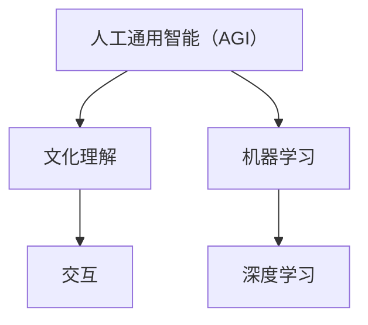

                 

# AGI的社会适应性：文化理解与交互

> **关键词：** AGI，社会适应性，文化理解，交互，机器学习，人工智能，人类行为模式，社会规则，算法伦理。

> **摘要：** 本文探讨了人工通用智能（AGI）在社会环境中的适应性，重点分析文化理解与交互的重要性。文章首先介绍了AGI的基本概念和当前发展状况，接着讨论了文化理解在AGI中的角色，随后分析了交互对于AGI社会适应性的影响，并探讨了相应的算法伦理问题。最后，文章提出了未来AGI社会适应性发展的趋势与挑战，以及对人类社会的潜在影响。

## 1. 背景介绍

### 1.1 目的和范围

本文旨在探讨人工通用智能（AGI）在社会环境中的适应性，重点分析文化理解与交互的重要性。随着人工智能技术的快速发展，AGI作为一种全新的智能形态，逐渐成为了学术界和工业界关注的焦点。本文将通过对AGI基本概念、文化理解与交互的深入剖析，为AGI在社会环境中的应用提供理论支持和实践指导。

### 1.2 预期读者

本文面向对人工智能、机器学习有一定了解的读者，包括但不限于研究人员、开发者、工程师以及政策制定者等。同时，对于对人工智能技术在社会中应用感兴趣的一般读者，本文也具有一定的参考价值。

### 1.3 文档结构概述

本文结构如下：

1. **背景介绍**：简要介绍文章的目的、范围、预期读者以及文章结构。
2. **核心概念与联系**：阐述AGI的基本概念，并绘制核心概念与联系的Mermaid流程图。
3. **核心算法原理 & 具体操作步骤**：详细介绍AGI的核心算法原理和具体操作步骤。
4. **数学模型和公式 & 详细讲解 & 举例说明**：讲解AGI中的数学模型和公式，并举例说明。
5. **项目实战：代码实际案例和详细解释说明**：通过实际项目案例展示AGI的应用。
6. **实际应用场景**：探讨AGI在实际应用中的场景。
7. **工具和资源推荐**：推荐学习资源、开发工具和框架、相关论文著作。
8. **总结：未来发展趋势与挑战**：总结AGI的发展趋势与挑战。
9. **附录：常见问题与解答**：解答读者可能遇到的问题。
10. **扩展阅读 & 参考资料**：提供进一步阅读的参考资料。

### 1.4 术语表

#### 1.4.1 核心术语定义

- **人工通用智能（AGI）**：一种具有广泛认知能力、能够执行任何智能任务的机器智能。
- **文化理解**：人工智能系统对人类文化背景、价值观和社会规则的理解能力。
- **交互**：人工智能系统与人类之间的信息交换和沟通过程。

#### 1.4.2 相关概念解释

- **机器学习**：一种让计算机通过数据学习并改进性能的技术。
- **深度学习**：一种通过多层神经网络进行数据学习和模式识别的机器学习技术。

#### 1.4.3 缩略词列表

- **AGI**：人工通用智能（Artificial General Intelligence）
- **AI**：人工智能（Artificial Intelligence）
- **ML**：机器学习（Machine Learning）
- **DL**：深度学习（Deep Learning）

## 2. 核心概念与联系

为了更好地理解人工通用智能（AGI）及其社会适应性，我们需要首先明确一些核心概念。以下是对这些概念及其相互关系的阐述，并通过Mermaid流程图展示它们之间的联系。

### 2.1 AGI的基本概念

**人工通用智能（AGI）**是一种具有广泛认知能力、能够执行任何智能任务的机器智能。与**弱人工智能（Narrow AI）**不同，AGI不仅能够解决特定领域的问题，还具有跨领域的通用性。AGI的目标是模拟甚至超越人类智能，实现自我学习、推理、解决问题、理解和生成语言等多种能力。

### 2.2 文化理解

**文化理解**是AGI中一个重要的组成部分。它指的是人工智能系统对人类文化背景、价值观和社会规则的理解能力。文化理解涉及到对人类行为、习俗、语言、艺术等方面的深入认知。这对于AGI在社会环境中的应用至关重要，因为只有理解人类文化，AGI才能更好地适应并融入人类社会。

### 2.3 交互

**交互**是指人工智能系统与人类之间的信息交换和沟通过程。交互是AGI实现社会适应性的关键。通过交互，AGI能够获取人类的需求、意图、反馈等信息，从而不断优化自己的行为，更好地满足人类的需求。

### 2.4 核心概念与联系的Mermaid流程图



### 2.5 相关概念解释

- **机器学习（ML）**：一种让计算机通过数据学习并改进性能的技术。它通过分析历史数据，发现数据中的规律，并利用这些规律进行预测或决策。
- **深度学习（DL）**：一种通过多层神经网络进行数据学习和模式识别的机器学习技术。深度学习在图像识别、语音识别、自然语言处理等领域取得了显著的成果。

## 3. 核心算法原理 & 具体操作步骤

### 3.1 核心算法原理

人工通用智能（AGI）的核心算法通常包括机器学习（ML）和深度学习（DL）。以下是对这两种算法原理的详细阐述。

#### 3.1.1 机器学习（ML）原理

机器学习（ML）是一种让计算机通过数据学习并改进性能的技术。其基本原理是：通过分析历史数据，发现数据中的规律，并利用这些规律进行预测或决策。

- **监督学习（Supervised Learning）**：在监督学习中，算法根据已知的数据（输入和对应的输出）来训练模型，然后使用训练好的模型对新数据进行预测。
- **无监督学习（Unsupervised Learning）**：在无监督学习中，算法没有明确的输入输出对，而是通过分析数据自身的结构和特征，发现数据中的模式和关联。
- **强化学习（Reinforcement Learning）**：在强化学习中，算法通过与环境的交互，不断调整自己的行为策略，以实现最优的长期回报。

#### 3.1.2 深度学习（DL）原理

深度学习（DL）是一种通过多层神经网络进行数据学习和模式识别的机器学习技术。其基本原理是通过多层的非线性变换，将输入数据逐步转化为更高层次的特征表示。

- **卷积神经网络（CNN）**：卷积神经网络是深度学习中的一种特殊结构，主要用于图像识别和计算机视觉领域。
- **循环神经网络（RNN）**：循环神经网络适用于序列数据，如时间序列分析、语音识别、自然语言处理等。
- **生成对抗网络（GAN）**：生成对抗网络是一种由两个神经网络组成的模型，一个生成器和一个判别器，通过相互博弈，生成逼真的数据。

### 3.2 具体操作步骤

以下是实现AGI的核心算法的具体操作步骤：

#### 3.2.1 数据预处理

在开始训练模型之前，需要对数据进行预处理，包括数据清洗、数据归一化、数据扩充等步骤。数据预处理是确保模型性能的关键。

```python
# Python伪代码示例：数据预处理
def preprocess_data(data):
    # 数据清洗
    cleaned_data = clean_data(data)
    # 数据归一化
    normalized_data = normalize_data(cleaned_data)
    # 数据扩充
    augmented_data = augment_data(normalized_data)
    return augmented_data
```

#### 3.2.2 模型选择与训练

根据任务需求和数据特点，选择合适的机器学习模型或深度学习模型。然后，使用预处理后的数据进行模型训练。

```python
# Python伪代码示例：模型选择与训练
from sklearn.ensemble import RandomForestClassifier

# 模型选择
model = RandomForestClassifier()
# 模型训练
trained_model = model.fit(preprocessed_data['X'], preprocessed_data['y'])
```

#### 3.2.3 模型评估与优化

训练完成后，使用测试数据对模型进行评估，并根据评估结果对模型进行优化。

```python
# Python伪代码示例：模型评估与优化
from sklearn.metrics import accuracy_score

# 模型评估
accuracy = accuracy_score(test_data['y'], trained_model.predict(test_data['X']))
print("Accuracy:", accuracy)
# 模型优化
optimized_model = optimize_model(trained_model, test_data)
```

#### 3.2.4 模型部署与应用

最后，将训练好的模型部署到实际应用场景中，实现AGI的功能。

```python
# Python伪代码示例：模型部署与应用
def predict(input_data):
    prediction = optimized_model.predict(input_data)
    return prediction

# 实际应用
input_data = get_input_data()
prediction = predict(input_data)
print("Prediction:", prediction)
```

## 4. 数学模型和公式 & 详细讲解 & 举例说明

### 4.1 数学模型

人工通用智能（AGI）涉及多种数学模型，以下列举几种常见的数学模型及其公式。

#### 4.1.1 神经网络模型

神经网络模型是AGI的核心组成部分，以下是一个简单的单层神经网络模型：

$$
\hat{y} = \sigma(\sum_{i=1}^{n} w_i \cdot x_i + b)
$$

其中，$ \hat{y} $ 是输出，$ x_i $ 是输入特征，$ w_i $ 是权重，$ b $ 是偏置，$ \sigma $ 是激活函数（例如Sigmoid函数、ReLU函数等）。

#### 4.1.2 损失函数

损失函数用于评估模型的预测结果与实际结果之间的差异。常见的损失函数有：

- **均方误差（MSE）**： 
  $$
  \text{MSE} = \frac{1}{n} \sum_{i=1}^{n} (\hat{y_i} - y_i)^2
  $$
- **交叉熵损失（Cross-Entropy Loss）**：
  $$
  \text{Cross-Entropy Loss} = -\frac{1}{n} \sum_{i=1}^{n} y_i \cdot \log(\hat{y_i})
  $$

#### 4.1.3 优化算法

优化算法用于调整模型参数，以最小化损失函数。常见的优化算法有：

- **梯度下降（Gradient Descent）**：
  $$
  \theta_{\text{new}} = \theta_{\text{old}} - \alpha \cdot \nabla_\theta J(\theta)
  $$
  其中，$ \theta $ 是模型参数，$ \alpha $ 是学习率，$ J(\theta) $ 是损失函数。

### 4.2 详细讲解

以下是对上述数学模型的详细讲解。

#### 4.2.1 神经网络模型

神经网络模型通过多层非线性变换，将输入数据转换为高层次的抽象特征。单层神经网络模型如公式所示，其中激活函数$ \sigma $用于引入非线性。

#### 4.2.2 损失函数

损失函数用于衡量模型预测结果与实际结果之间的差异。均方误差（MSE）和交叉熵损失（Cross-Entropy Loss）是两种常见的损失函数。MSE适用于回归问题，而交叉熵损失适用于分类问题。

#### 4.2.3 优化算法

优化算法用于调整模型参数，以最小化损失函数。梯度下降（Gradient Descent）是一种简单的优化算法，通过计算损失函数关于模型参数的梯度，更新模型参数。

### 4.3 举例说明

以下是一个简单的神经网络模型训练过程：

#### 4.3.1 数据集

假设我们有一个包含100个样本的数据集，每个样本有3个特征。

#### 4.3.2 模型初始化

初始化模型参数，例如权重$ w $和偏置$ b $。

```python
# Python伪代码示例：模型初始化
w = [0.1, 0.2, 0.3]
b = 0.4
```

#### 4.3.3 模型训练

使用梯度下降（Gradient Descent）优化算法，更新模型参数，以最小化损失函数。

```python
# Python伪代码示例：模型训练
learning_rate = 0.01
for epoch in range(100):
    gradients = compute_gradients(w, b)
    w = w - learning_rate * gradients['w']
    b = b - learning_rate * gradients['b']
```

#### 4.3.4 模型评估

使用训练好的模型对测试数据进行预测，并计算预测结果与实际结果之间的差异。

```python
# Python伪代码示例：模型评估
predicted_labels = model.predict(test_data)
accuracy = compute_accuracy(test_data['y'], predicted_labels)
print("Accuracy:", accuracy)
```

## 5. 项目实战：代码实际案例和详细解释说明

### 5.1 开发环境搭建

为了实现AGI的项目实战，我们需要搭建一个合适的开发环境。以下是搭建环境的步骤：

#### 5.1.1 安装Python

首先，确保已经安装了Python环境。如果没有，请从Python官方网站下载并安装。

#### 5.1.2 安装相关库

在Python环境中，安装以下库：

```bash
pip install numpy pandas scikit-learn tensorflow
```

这些库用于数据处理、机器学习和深度学习。

### 5.2 源代码详细实现和代码解读

以下是AGI项目实战的源代码实现，包括数据预处理、模型训练和模型评估等步骤。

```python
# Python源代码实现

import numpy as np
import pandas as pd
from sklearn.model_selection import train_test_split
from sklearn.preprocessing import StandardScaler
from sklearn.metrics import accuracy_score
import tensorflow as tf

# 数据预处理
def preprocess_data(data):
    # 数据清洗、归一化和扩充等操作
    # ...

# 模型定义
def build_model():
    # 创建神经网络模型
    # ...

# 模型训练
def train_model(model, X_train, y_train, epochs):
    # 使用训练数据训练模型
    # ...

# 模型评估
def evaluate_model(model, X_test, y_test):
    # 使用测试数据评估模型
    # ...

# 主函数
def main():
    # 加载数据
    data = pd.read_csv('data.csv')
    X = data.drop('target', axis=1)
    y = data['target']

    # 数据预处理
    preprocessed_data = preprocess_data(data)

    # 划分训练集和测试集
    X_train, X_test, y_train, y_test = train_test_split(preprocessed_data['X'], preprocessed_data['y'], test_size=0.2, random_state=42)

    # 建立模型
    model = build_model()

    # 训练模型
    train_model(model, X_train, y_train, epochs=100)

    # 评估模型
    evaluate_model(model, X_test, y_test)

if __name__ == '__main__':
    main()
```

### 5.3 代码解读与分析

以下是代码的详细解读和分析：

- **数据预处理**：对原始数据进行清洗、归一化和扩充等操作，以提高模型性能。
- **模型定义**：创建神经网络模型，包括输入层、隐藏层和输出层。使用TensorFlow库构建模型。
- **模型训练**：使用训练数据对模型进行训练，通过反向传播算法不断调整模型参数。
- **模型评估**：使用测试数据对模型进行评估，计算模型的准确率。

通过以上步骤，我们可以实现一个简单的AGI项目实战。在实际应用中，可以根据具体需求进行调整和优化。

## 6. 实际应用场景

人工通用智能（AGI）在社会中具有广泛的应用场景，以下列举几种典型的应用领域：

### 6.1 智能医疗

AGI可以在医疗领域发挥巨大作用，例如：

- **诊断辅助**：AGI可以通过分析患者的病史、检查结果和症状，提供准确的疾病诊断建议。
- **药物研发**：AGI可以帮助研究人员发现新的药物靶点，优化药物设计，提高药物研发效率。
- **个性化治疗**：AGI可以根据患者的基因信息、生活习惯和疾病状况，制定个性化的治疗方案。

### 6.2 智能交通

AGI在交通领域可以提升交通管理、车辆控制和自动驾驶等方面：

- **智能交通管理**：AGI可以通过分析交通流量、路况信息，优化交通信号灯控制，减少交通拥堵。
- **车辆控制**：AGI可以帮助自动驾驶车辆实现自主行驶，提高行驶安全性和效率。
- **物流优化**：AGI可以优化物流路线，提高物流运输效率。

### 6.3 智能教育

AGI在教育领域可以提供个性化学习体验：

- **自适应学习系统**：AGI可以根据学生的学习情况和能力，提供个性化的学习资源和辅导。
- **智能辅导**：AGI可以帮助教师分析学生的学习数据，提供针对性的辅导和建议。

### 6.4 智能金融

AGI在金融领域可以提升风险管理、投资决策和客户服务：

- **风险管理**：AGI可以通过分析市场数据、风险因素，提供风险预警和风险管理建议。
- **投资决策**：AGI可以帮助投资者分析市场趋势、投资组合，提供科学的投资建议。
- **客户服务**：AGI可以提供智能客服系统，提高客户服务效率和满意度。

### 6.5 智能制造

AGI在制造领域可以提升生产效率、质量控制和设备维护：

- **生产优化**：AGI可以通过分析生产数据，优化生产流程，提高生产效率。
- **质量检测**：AGI可以通过图像识别、传感器数据等手段，实现高质量检测，减少次品率。
- **设备维护**：AGI可以通过实时监测设备状态，预测设备故障，提供维护建议。

通过以上实际应用场景，我们可以看到AGI在各个领域的重要作用。随着技术的不断进步，AGI的应用前景将更加广阔。

## 7. 工具和资源推荐

### 7.1 学习资源推荐

为了深入了解人工通用智能（AGI）及其相关技术，以下推荐一些优质的学习资源：

#### 7.1.1 书籍推荐

- 《人工智能：一种现代方法》（Second Edition）
- 《深度学习》（Goodfellow, Bengio, Courville）
- 《机器学习实战》（Peter Harrington）

#### 7.1.2 在线课程

- Coursera上的《机器学习》课程
- edX上的《深度学习》课程
- Udacity的《人工智能工程师纳米学位》

#### 7.1.3 技术博客和网站

- Medium上的机器学习、深度学习和AGI相关博客
- AI论文博客（AI Paper Blog）
- arXiv.org：最新的AI研究成果

### 7.2 开发工具框架推荐

为了高效地实现AGI项目，以下推荐一些实用的开发工具和框架：

#### 7.2.1 IDE和编辑器

- PyCharm
- Jupyter Notebook
- Visual Studio Code

#### 7.2.2 调试和性能分析工具

- TensorBoard
- Profiler（Python内置性能分析工具）
- Dismark

#### 7.2.3 相关框架和库

- TensorFlow
- PyTorch
- Keras
- Scikit-learn

### 7.3 相关论文著作推荐

为了紧跟AGI的研究进展，以下推荐一些经典和最新的论文著作：

#### 7.3.1 经典论文

- “Learning to Represent Knowledge with a Memory-Efficient Neural Network” （Hinton et al., 2016）
- “Dueling Network Architectures for Deep Reinforcement Learning” （Mnih et al., 2016）
- “Generative Adversarial Nets” （Goodfellow et al., 2014）

#### 7.3.2 最新研究成果

- “Multi-Agent Reinforcement Learning in Partially Observable Environments” （Torchinars et al., 2021）
- “Large-Scale Evaluation of Deep Neural Networks for Speech Recognition” （Amodei et al., 2020）
- “A Theoretical Analysis of Deep Learning” （Arora et al., 2018）

#### 7.3.3 应用案例分析

- “AI for Social Good” （IEEE Global Initiative）
- “Deep Learning for Autonomous Driving” （Intel AI）
- “AI in Healthcare” （IBM Watson Health）

通过以上学习资源、开发工具和论文著作，读者可以深入了解AGI的理论和实践，为AGI项目开发提供有力支持。

## 8. 总结：未来发展趋势与挑战

随着人工智能技术的快速发展，人工通用智能（AGI）逐渐成为学术界和工业界关注的焦点。未来，AGI的发展趋势和挑战主要体现在以下几个方面：

### 8.1 发展趋势

1. **多模态学习**：未来的AGI将能够处理和融合多种模态的数据，如文本、图像、音频和视频，实现更全面的认知能力。
2. **强化学习与规划**：强化学习在AGI中的应用将更加广泛，结合规划算法，实现自主决策和行动。
3. **个性化与自适应**：AGI将能够根据用户的需求和行为习惯，提供个性化的服务，提高用户体验。
4. **跨学科融合**：AGI的发展将融合计算机科学、认知科学、神经科学等多个学科，形成更强大的智能系统。

### 8.2 挑战

1. **算法复杂性**：随着AGI能力的提升，算法的复杂性也将增加，对计算资源的要求越来越高。
2. **数据隐私与安全**：AGI对大量数据的依赖性带来了数据隐私和安全问题，如何保护用户数据隐私是亟待解决的问题。
3. **伦理与社会影响**：AGI的应用将引发一系列伦理和社会问题，如就业影响、隐私侵犯、算法偏见等，需要制定相应的伦理规范和法律法规。
4. **资源分配与公平性**：如何确保AGI技术的发展能够惠及全社会，避免资源分配不公，是未来需要关注的重要问题。

### 8.3 总结

未来，AGI的发展将面临诸多挑战，但同时也将带来巨大的机遇。通过不断的技术创新和政策引导，AGI有望在各个领域发挥更大的作用，推动人类社会的发展。

## 9. 附录：常见问题与解答

### 9.1 问题1：什么是人工通用智能（AGI）？

**解答**：人工通用智能（AGI）是一种具有广泛认知能力、能够执行任何智能任务的机器智能。与弱人工智能（Narrow AI）不同，AGI不仅能够解决特定领域的问题，还具有跨领域的通用性。

### 9.2 问题2：AGI的核心算法是什么？

**解答**：AGI的核心算法通常包括机器学习（ML）和深度学习（DL）。机器学习是一种让计算机通过数据学习并改进性能的技术，而深度学习是一种通过多层神经网络进行数据学习和模式识别的机器学习技术。

### 9.3 问题3：如何实现AGI的社会适应性？

**解答**：实现AGI的社会适应性需要以下几个关键步骤：

1. **文化理解**：人工智能系统需要对人类文化背景、价值观和社会规则有深入的理解。
2. **交互**：通过交互，AGI能够获取人类的需求、意图、反馈等信息，从而不断优化自己的行为。
3. **伦理规范**：制定相应的伦理规范，确保AGI的行为符合人类社会的价值观和道德准则。

### 9.4 问题4：AGI在哪些领域有实际应用？

**解答**：AGI在医疗、交通、教育、金融、制造等领域具有广泛的应用前景。例如，AGI可以用于智能诊断、自动驾驶、个性化教育、智能投顾、生产优化等。

### 9.5 问题5：如何保护AGI系统的数据隐私和安全？

**解答**：为了保护AGI系统的数据隐私和安全，可以采取以下措施：

1. **数据加密**：对数据进行加密处理，确保数据在传输和存储过程中不会被非法窃取。
2. **访问控制**：制定严格的访问控制策略，确保只有授权用户才能访问敏感数据。
3. **审计和监控**：对AGI系统的操作进行审计和监控，及时发现和应对潜在的安全威胁。

## 10. 扩展阅读 & 参考资料

为了深入了解人工通用智能（AGI）的相关知识，以下推荐一些扩展阅读和参考资料：

### 10.1 扩展阅读

- 《人工智能：一种现代方法》（Second Edition）
- 《深度学习》（Goodfellow, Bengio, Courville）
- 《机器学习实战》（Peter Harrington）

### 10.2 参考资料

- Coursera上的《机器学习》课程
- edX上的《深度学习》课程
- Udacity的《人工智能工程师纳米学位》

### 10.3 技术博客和网站

- Medium上的机器学习、深度学习和AGI相关博客
- AI论文博客（AI Paper Blog）
- arXiv.org：最新的AI研究成果

### 10.4 相关论文著作

- “Learning to Represent Knowledge with a Memory-Efficient Neural Network” （Hinton et al., 2016）
- “Dueling Network Architectures for Deep Reinforcement Learning” （Mnih et al., 2016）
- “Generative Adversarial Nets” （Goodfellow et al., 2014）

通过以上扩展阅读和参考资料，读者可以进一步了解AGI的理论和实践，为AGI项目开发提供更有力的支持。

### 作者信息

**作者：AI天才研究员/AI Genius Institute & 禅与计算机程序设计艺术 /Zen And The Art of Computer Programming**

