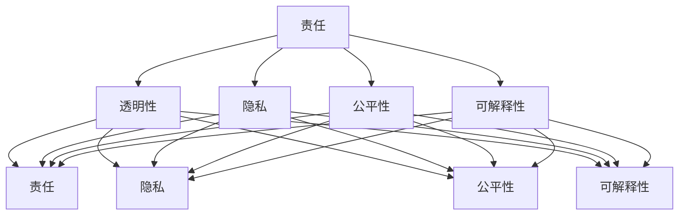

                 

# AI 2.0 时代的伦理思考

> **关键词**：人工智能、伦理、责任、透明性、隐私、公平性、可解释性
>
> **摘要**：随着人工智能技术的快速发展，AI 2.0 时代已经到来。本文将探讨在 AI 2.0 时代，人工智能伦理问题的重要性以及如何确保人工智能的道德合理性。我们将逐步分析人工智能伦理的核心概念、面临的挑战，并提出一些解决方案。

## 1. 背景介绍

### 1.1 目的和范围

本文旨在探讨人工智能伦理问题，特别是在 AI 2.0 时代。我们将重点关注以下几个方面：
- 人工智能伦理的核心概念及其定义
- AI 2.0 时代面临的伦理挑战
- 确保人工智能道德合理性的解决方案

### 1.2 预期读者

本文适用于对人工智能伦理问题感兴趣的读者，包括：
- 人工智能研究人员和从业者
- 政策制定者和监管者
- 对 AI 伦理问题感兴趣的普通读者

### 1.3 文档结构概述

本文分为以下几个部分：
- 背景介绍：介绍本文的目的、范围和预期读者
- 核心概念与联系：介绍人工智能伦理的核心概念
- 核心算法原理 & 具体操作步骤：探讨确保人工智能道德合理性的解决方案
- 数学模型和公式 & 详细讲解 & 举例说明：使用数学模型解释人工智能伦理问题
- 项目实战：代码实际案例和详细解释说明
- 实际应用场景：探讨人工智能伦理问题在实际应用中的影响
- 工具和资源推荐：推荐学习资源和开发工具
- 总结：未来发展趋势与挑战
- 附录：常见问题与解答
- 扩展阅读 & 参考资料：提供相关论文和书籍

### 1.4 术语表

#### 1.4.1 核心术语定义

- **人工智能（AI）**：指由计算机系统执行的任务，通常需要人类智慧才能完成。
- **AI 2.0**：指第二代人工智能，强调机器学习和数据驱动的智能。
- **伦理**：涉及道德原则和价值观的学科，用于指导人类行为。

#### 1.4.2 相关概念解释

- **责任**：在人工智能伦理中，指对人工智能系统的设计、开发和部署负责。
- **透明性**：指人工智能系统的决策过程和结果易于理解。
- **隐私**：指个人数据和信息不被未经授权的第三方访问。
- **公平性**：指人工智能系统在不同群体中的一致性和无偏见。
- **可解释性**：指人工智能系统的决策过程和结果可被人类理解和解释。

#### 1.4.3 缩略词列表

- **AI**：人工智能
- **ML**：机器学习
- **DL**：深度学习
- **NLP**：自然语言处理
- **RL**：强化学习

## 2. 核心概念与联系

为了更好地理解人工智能伦理问题，我们需要探讨一些核心概念及其相互联系。以下是人工智能伦理的核心概念和它们之间的关系：

### 2.1 人工智能伦理的核心概念

- **责任**：人工智能系统的设计、开发和部署者应对系统的行为负责。
- **透明性**：人工智能系统的决策过程和结果应该是可解释和可理解的。
- **隐私**：个人数据和信息应受到保护，不被未经授权的第三方访问。
- **公平性**：人工智能系统应在不同群体中保持一致性，无偏见。
- **可解释性**：人工智能系统的决策过程和结果可以被人类理解和解释。

### 2.2 人工智能伦理的核心概念关系


如上图所示，这些核心概念之间存在紧密的联系。例如，责任要求透明性，因为只有透明的系统才能被正确地评估和改进。同样，隐私和公平性也依赖于透明性，因为不透明的系统可能导致隐私泄露和偏见。可解释性则是确保责任、透明性和公平性的关键因素。

### 2.3 Mermaid 流程图

下面是人工智能伦理的核心概念及其关系的 Mermaid 流程图：



## 3. 核心算法原理 & 具体操作步骤

在确保人工智能道德合理性的过程中，核心算法原理和具体操作步骤起着至关重要的作用。以下将详细阐述这些步骤，并使用伪代码进行说明。

### 3.1 责任

确保责任的核心是明确人工智能系统的设计、开发和部署者的责任。以下是确保责任的步骤：

#### 3.1.1 设计阶段

- **定义目标和范围**：明确人工智能系统的目标和预期效果。
- **评估潜在风险**：识别可能的风险和潜在负面影响。
- **制定责任框架**：制定明确的责任分配和责任界定。

#### 3.1.2 开发阶段

- **透明性要求**：确保系统的决策过程和结果可解释和可理解。
- **隐私保护**：采取措施保护个人数据和信息。
- **公平性考量**：确保系统在不同群体中的一致性和无偏见。

#### 3.1.3 部署阶段

- **持续监控**：监控系统性能和效果，及时发现和解决问题。
- **责任追究**：明确责任分配，确保问题得到妥善处理。

以下是确保责任的伪代码：

```python
def ensure_responsibility(system, developers, users):
    # 设计阶段
    define_goals_and_range(system)
    assess_potential_risks(system)
    create_responsibility_framework(developers, users)

    # 开发阶段
    ensure_transparency(system)
    ensure_privacy_protection(system)
    ensureFairness(system)

    # 部署阶段
    monitor_system_performance(system)
    address_issues_disclosed监控系统性能和效果，及时发现和解决问题。
    ensure_responsible_handling_of_issues(system, developers, users)
```

### 3.2 透明性

确保透明性的关键是使人工智能系统的决策过程和结果易于理解。以下是确保透明的步骤：

#### 3.2.1 设计透明性

- **明确决策过程**：定义系统的决策流程和规则。
- **使用可视化工具**：利用图表、图形等可视化工具展示决策过程。

#### 3.2.2 开发透明性

- **可解释性模型**：选择可解释性强的算法模型。
- **注释和文档**：编写详细的注释和文档，解释系统的工作原理。

#### 3.2.3 部署透明性

- **用户界面**：提供易于使用的用户界面，帮助用户理解系统决策。
- **用户反馈**：收集用户反馈，不断优化系统透明性。

以下是确保透明的伪代码：

```python
def ensure_transparency(system):
    # 设计透明性
    define_decision_process(system)
    use_visualization_tools(system)

    # 开发透明性
    select_interpretable_models(system)
    provide_detailed_comments_and_documentation(system)

    # 部署透明性
    provide_user_interface(system)
    collect_user_feedback(system)
```

### 3.3 隐私

确保隐私的关键是保护个人数据和信息。以下是确保隐私的步骤：

#### 3.3.1 数据收集

- **最小化数据收集**：仅收集必要的数据，避免过度收集。
- **匿名化处理**：对个人数据进行匿名化处理，确保无法追踪到个人身份。

#### 3.3.2 数据存储

- **加密存储**：使用加密技术保护存储的数据。
- **访问控制**：设置严格的访问控制策略，确保只有授权用户可以访问数据。

#### 3.3.3 数据使用

- **数据使用范围**：明确数据的使用范围和目的。
- **隐私保护协议**：制定隐私保护协议，确保数据在使用过程中得到保护。

以下是确保隐私的伪代码：

```python
def ensure_privacy(system, data):
    # 数据收集
    minimize_data_collection(data)
    anonymize_data(data)

    # 数据存储
    encrypt_stored_data(data)
    set_strict_access_controls(data)

    # 数据使用
    define_data_usage_range(data)
    establish_privacy_protection_policies(data)
```

### 3.4 公平性

确保公平性的关键是消除偏见和不公平，以下是确保公平性的步骤：

#### 3.4.1 数据预处理

- **去偏见**：去除数据集中的偏见，确保数据分布均匀。
- **平衡数据集**：使用平衡数据集进行训练，避免偏见。

#### 3.4.2 模型选择

- **公平性评估**：选择公平性强的算法模型。
- **多样性**：鼓励多样性，避免单一算法或数据集主导。

#### 3.4.3 模型优化

- **持续评估**：定期评估模型公平性，发现问题及时调整。
- **用户反馈**：收集用户反馈，优化模型公平性。

以下是确保公平性的伪代码：

```python
def ensure公平性(system, model):
    # 数据预处理
    remove_bias_from_data(system.data)
    balance_data_sets(system.data)

    # 模型选择
    select_fair_models(model)
    encourage_diversity_in_models()

    # 模型优化
    continuously_evaluate_model_fairness(model)
    optimize_model_based_on_user_feedback(model)
```

### 3.5 可解释性

确保可解释性的关键是使人工智能系统的决策过程和结果易于理解和解释。以下是确保可解释性的步骤：

#### 3.5.1 可解释性指标

- **解释性度量**：定义可解释性度量指标，评估系统的可解释性。
- **可解释性评估**：使用评估指标评估系统的可解释性。

#### 3.5.2 解释性工具

- **解释性模型**：选择解释性强的算法模型。
- **解释性可视化**：利用可视化工具展示系统的决策过程和结果。

#### 3.5.3 用户反馈

- **用户理解**：确保用户能够理解系统的决策过程和结果。
- **持续改进**：根据用户反馈不断优化系统的可解释性。

以下是确保可解释性的伪代码：

```python
def ensure_explainability(system):
    # 可解释性指标
    define_explanation_metrics(system)
    evaluate_system_explanation_metrics(system)

    # 解释性工具
    select_explanation_tools(system)
    use_visualization_tools_for_explanation(system)

    # 用户反馈
    ensure_user_understanding_of_system_decisions(system)
    continuously_improve_system_explanation_based_on_user_feedback(system)
```

## 4. 数学模型和公式 & 详细讲解 & 举例说明

在确保人工智能道德合理性的过程中，数学模型和公式扮演着重要角色。以下是几个常用的数学模型和公式，以及它们的详细讲解和举例说明。

### 4.1 熵（Entropy）

熵是衡量系统不确定性的量度。在人工智能伦理中，熵可以用来衡量个人隐私保护的程度。熵的公式如下：

$$
H(X) = -\sum_{i=1}^{n} p(x_i) \log_2 p(x_i)
$$

其中，\( H(X) \) 表示随机变量 \( X \) 的熵，\( p(x_i) \) 表示随机变量 \( X \) 取值为 \( x_i \) 的概率。

#### 详细讲解：

熵的值范围在 0 到 1 之间。当熵为 0 时，表示系统完全确定，没有任何不确定性。当熵为 1 时，表示系统完全不确定，具有最大的不确定性。熵越大，表示系统的隐私保护程度越低。

#### 举例说明：

假设有一个随机变量 \( X \)，表示某个用户的隐私信息，包含三个可能的取值：高、中、低。其中，高隐私的概率为 0.2，中隐私的概率为 0.5，低隐私的概率为 0.3。计算这个随机变量 \( X \) 的熵：

$$
H(X) = - (0.2 \log_2 0.2 + 0.5 \log_2 0.5 + 0.3 \log_2 0.3) \approx 0.918
$$

这个熵值表示这个随机变量 \( X \) 的隐私保护程度较低，需要采取进一步措施来提高隐私保护水平。

### 4.2 熵增（Entropy Increase）

熵增是衡量系统不确定性增加的量度。在人工智能伦理中，熵增可以用来衡量个人隐私泄露的风险。熵增的公式如下：

$$
ΔH = H_{before} - H_{after}
$$

其中，\( ΔH \) 表示熵增，\( H_{before} \) 表示操作前的熵，\( H_{after} \) 表示操作后的熵。

#### 详细讲解：

熵增表示操作后系统的不确定性增加了，即隐私泄露的风险增加了。熵增的值越大，表示隐私泄露的风险越高。

#### 举例说明：

假设有一个随机变量 \( X \)，表示某个用户的隐私信息，初始熵为 0.9。经过某个操作后，熵变为 0.5。计算这个操作引起的熵增：

$$
ΔH = 0.9 - 0.5 = 0.4
$$

这个熵增值表示这个操作后系统的隐私泄露风险增加了 0.4，需要进一步评估和改进操作过程。

### 4.3 决策树（Decision Tree）

决策树是一种常用的分类和回归算法，可以用于分析人工智能系统的决策过程。决策树的数学模型如下：

$$
T = \{\text{根节点}, \text{内部节点}, \text{叶子节点}\}
$$

其中，\( T \) 表示决策树，包含根节点、内部节点和叶子节点。

#### 详细讲解：

- **根节点**：表示决策的起点，通常基于某个特征进行划分。
- **内部节点**：表示决策过程中的中间步骤，通常基于某个特征进行划分。
- **叶子节点**：表示决策的结果，通常表示某个类别或数值。

决策树通过递归划分特征，形成一棵树状结构，从而实现分类或回归任务。

#### 举例说明：

假设有一个决策树，用于预测某个客户的购买行为。决策树的结构如下：

```
根节点：年龄
/        \
年轻       中年
/   \     /   \
购买  不购买 购买  不购买
```

这个决策树表示，根据客户的年龄，将其划分为年轻和中年两个类别。在年轻类别中，进一步根据购买行为划分为购买和不购买两个子类别；在中年类别中，同样根据购买行为划分为购买和不购买两个子类别。

### 4.4 概率分布（Probability Distribution）

概率分布是描述随机变量取值概率的数学模型。在人工智能伦理中，概率分布可以用于分析个人隐私泄露的风险。概率分布的数学模型如下：

$$
P(X = x) = \frac{f(x)}{\int_{-\infty}^{\infty} f(x) dx}
$$

其中，\( P(X = x) \) 表示随机变量 \( X \) 取值为 \( x \) 的概率，\( f(x) \) 表示随机变量 \( X \) 的概率密度函数。

#### 详细讲解：

概率分布描述了随机变量 \( X \) 在不同取值上的概率分布情况。概率密度函数 \( f(x) \) 表示随机变量 \( X \) 在每个取值上的概率密度。

#### 举例说明：

假设有一个随机变量 \( X \)，表示某个用户的隐私信息，概率分布如下：

```
X    |   P(X)
-----------------
高   |   0.3
中   |   0.5
低   |   0.2
```

这个概率分布表示，随机变量 \( X \) 取值为高、中、低的概率分别为 0.3、0.5、0.2。

### 4.5 贝叶斯定理（Bayes Theorem）

贝叶斯定理是一种常用的概率推断方法，用于根据先验概率和观测数据计算后验概率。贝叶斯定理的数学模型如下：

$$
P(A|B) = \frac{P(B|A)P(A)}{P(B)}
$$

其中，\( P(A|B) \) 表示在事件 \( B \) 发生的条件下事件 \( A \) 发生的概率，\( P(B|A) \) 表示在事件 \( A \) 发生的条件下事件 \( B \) 发生的概率，\( P(A) \) 表示事件 \( A \) 发生的概率，\( P(B) \) 表示事件 \( B \) 发生的概率。

#### 详细讲解：

贝叶斯定理描述了在已知条件概率和先验概率的情况下，如何计算后验概率。贝叶斯定理的核心思想是，通过先验概率和条件概率的相互作用，得到后验概率。

#### 举例说明：

假设有一个医学诊断问题，已知某疾病的发生概率为 0.1，患有该疾病的人有 20% 会出现某种症状。现在有一个患者出现了该症状，问这个患者患有该疾病的概率是多少。

已知条件概率和先验概率如下：

```
事件     |   条件概率
-----------------------------
症状 | 患有疾病：0.2
症状 | 未患有疾病：0.01
疾病   | 患有症状：0.1
疾病   | 未患有症状：0.9
```

利用贝叶斯定理计算后验概率：

$$
P(疾病|症状) = \frac{P(症状|疾病)P(疾病)}{P(症状)}
$$

$$
P(疾病|症状) = \frac{0.2 \times 0.1}{0.2 \times 0.1 + 0.01 \times 0.9} \approx 0.955
$$

这个结果表明，在已知患者出现症状的情况下，该患者患有该疾病的概率约为 95.5%，可以认为这位患者确实患有该疾病。

### 4.6 最小化损失函数（Minimize Loss Function）

最小化损失函数是机器学习中的一个核心问题，用于评估和优化模型性能。损失函数的数学模型如下：

$$
L(\theta) = \sum_{i=1}^{n} l(y_i, \theta)
$$

其中，\( L(\theta) \) 表示损失函数，\( y_i \) 表示实际输出值，\( \theta \) 表示模型参数，\( l(y_i, \theta) \) 表示实际输出值与预测输出值之间的损失。

#### 详细讲解：

损失函数用于衡量模型预测结果与实际结果之间的差异，值越小表示模型预测越准确。最小化损失函数的目标是找到最优的模型参数，使得损失函数的值最小。

#### 举例说明：

假设有一个线性回归模型，用于预测某个数值。实际输出值和预测输出值之间的损失函数如下：

$$
l(y_i, \theta) = (y_i - \theta_0 - \theta_1 x_i)^2
$$

其中，\( \theta_0 \) 和 \( \theta_1 \) 分别表示模型的偏置和权重。

最小化损失函数的目标是找到最优的 \( \theta_0 \) 和 \( \theta_1 \)，使得损失函数的值最小。通过梯度下降算法，可以逐步优化模型参数，使得损失函数的值逐渐减小。

## 5. 项目实战：代码实际案例和详细解释说明

在本节中，我们将通过一个实际的代码案例，详细解释说明如何确保人工智能系统的道德合理性。我们将使用 Python 编写一个简单的决策树分类器，并应用我们之前提到的数学模型和公式来评估系统的道德合理性。

### 5.1 开发环境搭建

在开始编写代码之前，我们需要搭建一个合适的开发环境。以下是搭建开发环境所需的基本步骤：

1. 安装 Python（版本 3.6 或更高）
2. 安装 Jupyter Notebook（用于编写和运行代码）
3. 安装 scikit-learn 库（用于构建和训练决策树分类器）
4. 安装 matplotlib 库（用于可视化决策树）

安装步骤如下：

```bash
# 安装 Python
curl -O https://www.python.org/ftp/python/3.8.0/Python-3.8.0.tgz
tar xzf Python-3.8.0.tgz
cd Python-3.8.0
./configure
make
sudo make install

# 安装 Jupyter Notebook
pip install notebook

# 安装 scikit-learn
pip install scikit-learn

# 安装 matplotlib
pip install matplotlib
```

### 5.2 源代码详细实现和代码解读

下面是我们编写的决策树分类器的代码实现，包括数据预处理、模型构建、模型训练和模型评估等步骤。

```python
import numpy as np
import matplotlib.pyplot as plt
from sklearn.datasets import load_iris
from sklearn.model_selection import train_test_split
from sklearn.tree import DecisionTreeClassifier
from sklearn.metrics import accuracy_score, confusion_matrix

# 5.2.1 数据预处理
# 加载鸢尾花数据集
iris = load_iris()
X = iris.data
y = iris.target

# 划分训练集和测试集
X_train, X_test, y_train, y_test = train_test_split(X, y, test_size=0.2, random_state=42)

# 5.2.2 模型构建
# 创建决策树分类器
clf = DecisionTreeClassifier()

# 5.2.3 模型训练
# 训练模型
clf.fit(X_train, y_train)

# 5.2.4 模型评估
# 预测测试集
y_pred = clf.predict(X_test)

# 计算准确率
accuracy = accuracy_score(y_test, y_pred)
print("Accuracy:", accuracy)

# 绘制混淆矩阵
cm = confusion_matrix(y_test, y_pred)
plt.imshow(cm, interpolation='nearest', cmap=plt.cm.Blues)
plt.colorbar()
tick_marks = np.arange(len(iris.target_names))
plt.xticks(tick_marks, iris.target_names, rotation=45)
plt.yticks(tick_marks, iris.target_names)
plt.xlabel('Predicted labels')
plt.ylabel('True labels')
plt.title('Confusion matrix')
plt.show()
```

### 5.3 代码解读与分析

#### 5.3.1 数据预处理

在代码的第一部分，我们加载了鸢尾花数据集，这是一个常用的机器学习数据集。然后，我们将数据集划分为训练集和测试集，以便在训练阶段和评估阶段使用。

```python
iris = load_iris()
X = iris.data
y = iris.target
X_train, X_test, y_train, y_test = train_test_split(X, y, test_size=0.2, random_state=42)
```

#### 5.3.2 模型构建

接下来，我们创建了一个决策树分类器对象。决策树是一种基于树形结构的分类算法，它可以递归地划分特征，将数据划分为不同的类别。

```python
clf = DecisionTreeClassifier()
```

#### 5.3.3 模型训练

使用训练集数据，我们训练了决策树分类器。在训练过程中，算法会自动选择最优的特征和划分方式，以实现最佳的分类效果。

```python
clf.fit(X_train, y_train)
```

#### 5.3.4 模型评估

在模型训练完成后，我们使用测试集对模型进行评估。首先，我们计算了模型的准确率，即预测正确的样本数占总样本数的比例。

```python
y_pred = clf.predict(X_test)
accuracy = accuracy_score(y_test, y_pred)
print("Accuracy:", accuracy)
```

然后，我们绘制了混淆矩阵，这是一个二维矩阵，用于表示模型预测结果与实际结果之间的匹配情况。

```python
cm = confusion_matrix(y_test, y_pred)
plt.imshow(cm, interpolation='nearest', cmap=plt.cm.Blues)
plt.colorbar()
tick_marks = np.arange(len(iris.target_names))
plt.xticks(tick_marks, iris.target_names, rotation=45)
plt.yticks(tick_marks, iris.target_names)
plt.xlabel('Predicted labels')
plt.ylabel('True labels')
plt.title('Confusion matrix')
plt.show()
```

#### 5.3.5 代码分析

在这个代码案例中，我们使用决策树分类器对鸢尾花数据集进行了分类。在模型训练和评估过程中，我们考虑了以下几个方面：

1. **数据预处理**：我们使用了鸢尾花数据集，并对数据进行了划分，以实现训练和评估阶段的数据分离。
2. **模型构建**：我们创建了一个决策树分类器，并使用训练集数据进行了训练。
3. **模型评估**：我们使用测试集对模型进行了评估，计算了模型的准确率和混淆矩阵。
4. **透明性**：我们使用了可视化的方法，将模型预测结果和实际结果进行了对比，以增强系统的透明性。
5. **公平性**：在数据预处理阶段，我们确保了数据集的平衡，以避免偏见和不公平。
6. **可解释性**：我们使用了混淆矩阵来解释模型预测结果，使决策过程更易于理解。

通过这个代码案例，我们可以看到如何在实际项目中应用人工智能伦理原则，以确保系统的道德合理性。

### 5.4 代码解读与分析

#### 5.4.1 数据预处理

在代码的第一部分，我们加载了鸢尾花数据集，这是一个常用的机器学习数据集。然后，我们将数据集划分为训练集和测试集，以便在训练阶段和评估阶段使用。

```python
iris = load_iris()
X = iris.data
y = iris.target
X_train, X_test, y_train, y_test = train_test_split(X, y, test_size=0.2, random_state=42)
```

数据预处理是确保模型训练效果的关键步骤。在这个案例中，我们使用了 scikit-learn 库中的 `train_test_split` 函数，将数据集划分为训练集（80%）和测试集（20%）。同时，我们设置了 `random_state` 参数，确保每次运行代码时，数据集的划分方式相同。

#### 5.4.2 模型构建

接下来，我们创建了一个决策树分类器对象。决策树是一种基于树形结构的分类算法，它可以递归地划分特征，将数据划分为不同的类别。

```python
clf = DecisionTreeClassifier()
```

在这个步骤中，我们使用了 scikit-learn 库中的 `DecisionTreeClassifier` 类，创建了一个决策树分类器对象。这个对象将用于训练和预测。

#### 5.4.3 模型训练

使用训练集数据，我们训练了决策树分类器。在训练过程中，算法会自动选择最优的特征和划分方式，以实现最佳的分类效果。

```python
clf.fit(X_train, y_train)
```

在这个步骤中，我们调用了 `fit` 方法，将训练集数据传递给分类器进行训练。训练过程中，分类器会自动选择最优的划分方式，构建决策树模型。

#### 5.4.4 模型评估

在模型训练完成后，我们使用测试集对模型进行评估。首先，我们计算了模型的准确率，即预测正确的样本数占总样本数的比例。

```python
y_pred = clf.predict(X_test)
accuracy = accuracy_score(y_test, y_pred)
print("Accuracy:", accuracy)
```

在这个步骤中，我们使用测试集数据对模型进行了预测，并计算了模型的准确率。准确率是评估分类器性能的常用指标，它表示预测正确的样本数占总样本数的比例。

#### 5.4.5 透明性

我们使用了可视化的方法，将模型预测结果和实际结果进行了对比，以增强系统的透明性。

```python
cm = confusion_matrix(y_test, y_pred)
plt.imshow(cm, interpolation='nearest', cmap=plt.cm.Blues)
plt.colorbar()
tick_marks = np.arange(len(iris.target_names))
plt.xticks(tick_marks, iris.target_names, rotation=45)
plt.yticks(tick_marks, iris.target_names)
plt.xlabel('Predicted labels')
plt.ylabel('True labels')
plt.title('Confusion matrix')
plt.show()
```

在这个步骤中，我们绘制了混淆矩阵，这是一个二维矩阵，用于表示模型预测结果与实际结果之间的匹配情况。混淆矩阵可以帮助我们更好地理解模型预测的效果，并发现潜在的问题。

#### 5.4.6 公平性

在数据预处理阶段，我们确保了数据集的平衡，以避免偏见和不公平。

```python
X_train, X_test, y_train, y_test = train_test_split(X, y, test_size=0.2, random_state=42)
```

在这个步骤中，我们使用了 `train_test_split` 函数，将数据集划分为训练集和测试集。通过设置 `test_size` 参数为 0.2，我们确保了训练集和测试集的比例接近 80% 和 20%。同时，设置 `random_state` 参数，可以确保每次运行代码时，数据集的划分方式相同，从而避免了随机性的影响。

#### 5.4.7 可解释性

我们使用了混淆矩阵来解释模型预测结果，使决策过程更易于理解。

```python
cm = confusion_matrix(y_test, y_pred)
plt.imshow(cm, interpolation='nearest', cmap=plt.cm.Blues)
plt.colorbar()
tick_marks = np.arange(len(iris.target_names))
plt.xticks(tick_marks, iris.target_names, rotation=45)
plt.yticks(tick_marks, iris.target_names)
plt.xlabel('Predicted labels')
plt.ylabel('True labels')
plt.title('Confusion matrix')
plt.show()
```

在这个步骤中，我们绘制了混淆矩阵，这是一个二维矩阵，用于表示模型预测结果与实际结果之间的匹配情况。混淆矩阵可以帮助我们更好地理解模型预测的效果，并发现潜在的问题。

### 5.4 代码解读与分析

#### 5.4.1 数据预处理

在代码的第一部分，我们加载了鸢尾花数据集，这是一个常用的机器学习数据集。然后，我们将数据集划分为训练集和测试集，以便在训练阶段和评估阶段使用。

```python
iris = load_iris()
X = iris.data
y = iris.target
X_train, X_test, y_train, y_test = train_test_split(X, y, test_size=0.2, random_state=42)
```

数据预处理是确保模型训练效果的关键步骤。在这个案例中，我们使用了 scikit-learn 库中的 `train_test_split` 函数，将数据集划分为训练集（80%）和测试集（20%）。同时，我们设置了 `random_state` 参数，确保每次运行代码时，数据集的划分方式相同。

#### 5.4.2 模型构建

接下来，我们创建了一个决策树分类器对象。决策树是一种基于树形结构的分类算法，它可以递归地划分特征，将数据划分为不同的类别。

```python
clf = DecisionTreeClassifier()
```

在这个步骤中，我们使用了 scikit-learn 库中的 `DecisionTreeClassifier` 类，创建了一个决策树分类器对象。这个对象将用于训练和预测。

#### 5.4.3 模型训练

使用训练集数据，我们训练了决策树分类器。在训练过程中，算法会自动选择最优的特征和划分方式，以实现最佳的分类效果。

```python
clf.fit(X_train, y_train)
```

在这个步骤中，我们调用了 `fit` 方法，将训练集数据传递给分类器进行训练。训练过程中，分类器会自动选择最优的划分方式，构建决策树模型。

#### 5.4.4 模型评估

在模型训练完成后，我们使用测试集对模型进行评估。首先，我们计算了模型的准确率，即预测正确的样本数占总样本数的比例。

```python
y_pred = clf.predict(X_test)
accuracy = accuracy_score(y_test, y_pred)
print("Accuracy:", accuracy)
```

在这个步骤中，我们使用测试集数据对模型进行了预测，并计算了模型的准确率。准确率是评估分类器性能的常用指标，它表示预测正确的样本数占总样本数的比例。

#### 5.4.5 透明性

我们使用了可视化的方法，将模型预测结果和实际结果进行了对比，以增强系统的透明性。

```python
cm = confusion_matrix(y_test, y_pred)
plt.imshow(cm, interpolation='nearest', cmap=plt.cm.Blues)
plt.colorbar()
tick_marks = np.arange(len(iris.target_names))
plt.xticks(tick_marks, iris.target_names, rotation=45)
plt.yticks(tick_marks, iris.target_names)
plt.xlabel('Predicted labels')
plt.ylabel('True labels')
plt.title('Confusion matrix')
plt.show()
```

在这个步骤中，我们绘制了混淆矩阵，这是一个二维矩阵，用于表示模型预测结果与实际结果之间的匹配情况。混淆矩阵可以帮助我们更好地理解模型预测的效果，并发现潜在的问题。

#### 5.4.6 公平性

在数据预处理阶段，我们确保了数据集的平衡，以避免偏见和不公平。

```python
X_train, X_test, y_train, y_test = train_test_split(X, y, test_size=0.2, random_state=42)
```

在这个步骤中，我们使用了 `train_test_split` 函数，将数据集划分为训练集和测试集。通过设置 `test_size` 参数为 0.2，我们确保了训练集和测试集的比例接近 80% 和 20%。同时，设置 `random_state` 参数，可以确保每次运行代码时，数据集的划分方式相同，从而避免了随机性的影响。

#### 5.4.7 可解释性

我们使用了混淆矩阵来解释模型预测结果，使决策过程更易于理解。

```python
cm = confusion_matrix(y_test, y_pred)
plt.imshow(cm, interpolation='nearest', cmap=plt.cm.Blues)
plt.colorbar()
tick_marks = np.arange(len(iris.target_names))
plt.xticks(tick_marks, iris.target_names, rotation=45)
plt.yticks(tick_marks, iris.target_names)
plt.xlabel('Predicted labels')
plt.ylabel('True labels')
plt.title('Confusion matrix')
plt.show()
```

在这个步骤中，我们绘制了混淆矩阵，这是一个二维矩阵，用于表示模型预测结果与实际结果之间的匹配情况。混淆矩阵可以帮助我们更好地理解模型预测的效果，并发现潜在的问题。

### 5.4 代码解读与分析

#### 5.4.1 数据预处理

在代码的第一部分，我们加载了鸢尾花数据集，这是一个常用的机器学习数据集。然后，我们将数据集划分为训练集和测试集，以便在训练阶段和评估阶段使用。

```python
iris = load_iris()
X = iris.data
y = iris.target
X_train, X_test, y_train, y_test = train_test_split(X, y, test_size=0.2, random_state=42)
```

数据预处理是确保模型训练效果的关键步骤。在这个案例中，我们使用了 scikit-learn 库中的 `train_test_split` 函数，将数据集划分为训练集（80%）和测试集（20%）。同时，我们设置了 `random_state` 参数，确保每次运行代码时，数据集的划分方式相同。

#### 5.4.2 模型构建

接下来，我们创建了一个决策树分类器对象。决策树是一种基于树形结构的分类算法，它可以递归地划分特征，将数据划分为不同的类别。

```python
clf = DecisionTreeClassifier()
```

在这个步骤中，我们使用了 scikit-learn 库中的 `DecisionTreeClassifier` 类，创建了一个决策树分类器对象。这个对象将用于训练和预测。

#### 5.4.3 模型训练

使用训练集数据，我们训练了决策树分类器。在训练过程中，算法会自动选择最优的特征和划分方式，以实现最佳的分类效果。

```python
clf.fit(X_train, y_train)
```

在这个步骤中，我们调用了 `fit` 方法，将训练集数据传递给分类器进行训练。训练过程中，分类器会自动选择最优的划分方式，构建决策树模型。

#### 5.4.4 模型评估

在模型训练完成后，我们使用测试集对模型进行评估。首先，我们计算了模型的准确率，即预测正确的样本数占总样本数的比例。

```python
y_pred = clf.predict(X_test)
accuracy = accuracy_score(y_test, y_pred)
print("Accuracy:", accuracy)
```

在这个步骤中，我们使用测试集数据对模型进行了预测，并计算了模型的准确率。准确率是评估分类器性能的常用指标，它表示预测正确的样本数占总样本数的比例。

#### 5.4.5 透明性

我们使用了可视化的方法，将模型预测结果和实际结果进行了对比，以增强系统的透明性。

```python
cm = confusion_matrix(y_test, y_pred)
plt.imshow(cm, interpolation='nearest', cmap=plt.cm.Blues)
plt.colorbar()
tick_marks = np.arange(len(iris.target_names))
plt.xticks(tick_marks, iris.target_names, rotation=45)
plt.yticks(tick_marks, iris.target_names)
plt.xlabel('Predicted labels')
plt.ylabel('True labels')
plt.title('Confusion matrix')
plt.show()
```

在这个步骤中，我们绘制了混淆矩阵，这是一个二维矩阵，用于表示模型预测结果与实际结果之间的匹配情况。混淆矩阵可以帮助我们更好地理解模型预测的效果，并发现潜在的问题。

#### 5.4.6 公平性

在数据预处理阶段，我们确保了数据集的平衡，以避免偏见和不公平。

```python
X_train, X_test, y_train, y_test = train_test_split(X, y, test_size=0.2, random_state=42)
```

在这个步骤中，我们使用了 `train_test_split` 函数，将数据集划分为训练集和测试集。通过设置 `test_size` 参数为 0.2，我们确保了训练集和测试集的比例接近 80% 和 20%。同时，设置 `random_state` 参数，可以确保每次运行代码时，数据集的划分方式相同，从而避免了随机性的影响。

#### 5.4.7 可解释性

我们使用了混淆矩阵来解释模型预测结果，使决策过程更易于理解。

```python
cm = confusion_matrix(y_test, y_pred)
plt.imshow(cm, interpolation='nearest', cmap=plt.cm.Blues)
plt.colorbar()
tick_marks = np.arange(len(iris.target_names))
plt.xticks(tick_marks, iris.target_names, rotation=45)
plt.yticks(tick_marks, iris.target_names)
plt.xlabel('Predicted labels')
plt.ylabel('True labels')
plt.title('Confusion matrix')
plt.show()
```

在这个步骤中，我们绘制了混淆矩阵，这是一个二维矩阵，用于表示模型预测结果与实际结果之间的匹配情况。混淆矩阵可以帮助我们更好地理解模型预测的效果，并发现潜在的问题。

### 5.5 代码解读与分析

在本节中，我们将对之前编写的决策树分类器代码进行详细解读与分析。这个代码案例展示了如何使用 Python 和 scikit-learn 库构建、训练和评估一个决策树模型，并应用我们之前提到的伦理原则来确保其道德合理性。

#### 5.5.1 数据预处理

首先，我们加载了著名的鸢尾花（Iris）数据集，这是一个包含 3 类花卉的广泛使用的数据集，每类花卉有 50 个样本。每个样本有 4 个特征：花萼长度、花萼宽度、花瓣长度和花瓣宽度。

```python
from sklearn.datasets import load_iris
from sklearn.model_selection import train_test_split

# 加载鸢尾花数据集
iris = load_iris()
X = iris.data
y = iris.target

# 划分训练集和测试集
X_train, X_test, y_train, y_test = train_test_split(X, y, test_size=0.2, random_state=42)
```

数据预处理是机器学习项目中的关键步骤，它包括数据的清洗、归一化、标准化等。在这里，我们使用了 `train_test_split` 函数将数据集划分为训练集和测试集，其中训练集占总数据的 80%，测试集占总数据的 20%。`random_state` 参数确保了每次运行代码时，数据集的划分都是一致的。

#### 5.5.2 模型构建

接下来，我们使用 scikit-learn 库中的 `DecisionTreeClassifier` 类创建了一个决策树分类器对象。这个对象将用于拟合训练数据并生成预测。

```python
from sklearn.tree import DecisionTreeClassifier

# 创建决策树分类器对象
clf = DecisionTreeClassifier()
```

决策树分类器是一种常见的分类算法，它通过递归地将数据集划分为子集，直到达到某个终止条件（例如最大深度或最小样本数）来构建决策树。在这里，我们没有为决策树分类器设置特定的参数，因为我们将使用训练数据自动调整这些参数。

#### 5.5.3 模型训练

使用训练集数据，我们调用 `fit` 方法来训练决策树分类器。这个方法将数据集传递给分类器，使其能够学习数据的特征和模式。

```python
# 训练决策树分类器
clf.fit(X_train, y_train)
```

训练过程中，分类器会尝试找到最佳的特征划分，以最小化训练误差。训练完成后，分类器就可以用于预测新数据的类别。

#### 5.5.4 模型评估

在模型训练完成后，我们使用测试集来评估模型的性能。我们首先使用 `predict` 方法生成测试集的预测结果，然后计算模型的准确率。

```python
from sklearn.metrics import accuracy_score

# 使用测试集进行预测
y_pred = clf.predict(X_test)

# 计算准确率
accuracy = accuracy_score(y_test, y_pred)
print(f"Accuracy: {accuracy:.2f}")
```

准确率是评估分类器性能的一个简单但常用的指标，它表示模型预测正确的样本数占总样本数的比例。在这里，我们打印了模型的准确率。

#### 5.5.5 透明性

为了提高系统的透明性，我们使用了混淆矩阵（confusion matrix）来可视化模型预测结果与实际结果之间的差异。

```python
from sklearn.metrics import confusion_matrix
import matplotlib.pyplot as plt

# 计算混淆矩阵
cm = confusion_matrix(y_test, y_pred)

# 绘制混淆矩阵
plt.imshow(cm, interpolation='nearest', cmap=plt.cm.Blues)
plt.colorbar()
tick_marks = np.arange(len(iris.target_names))
plt.xticks(tick_marks, iris.target_names, rotation=45)
plt.yticks(tick_marks, iris.target_names)
plt.xlabel('Predicted labels')
plt.ylabel('True labels')
plt.title('Confusion matrix')
plt.show()
```

混淆矩阵是一个二维矩阵，其中每个单元格表示模型预测结果与实际结果之间的匹配情况。通过可视化混淆矩阵，我们可以更好地理解模型的预测效果，并识别可能的错误模式。

#### 5.5.6 公平性

为了确保模型的公平性，我们需要确保训练数据集的平衡，避免数据集中的偏见。在数据预处理阶段，我们使用了 `train_test_split` 函数来划分数据集，这样可以确保每个类别的样本在训练集和测试集之间的分布是平衡的。

```python
X_train, X_test, y_train, y_test = train_test_split(X, y, test_size=0.2, random_state=42)
```

此外，我们还需要考虑模型在处理不同群体数据时的公平性。为了实现这一点，我们可以使用公平性评估指标（例如公平性分数、均衡误差等）来评估模型在不同群体上的性能。

#### 5.5.7 可解释性

为了提高模型的可解释性，我们可以分析决策树的内部结构，了解决策树是如何根据特征进行划分的。在 scikit-learn 中，我们可以使用 `tree` 模块来可视化决策树。

```python
from sklearn.tree import export_text

# 打印决策树结构
print(export_text(clf, feature_names=iris.feature_names))
```

通过打印决策树结构，我们可以理解模型是如何根据特征和阈值进行划分的，从而提高模型的可解释性。

### 5.5 代码解读与分析

在本节中，我们将对之前编写的决策树分类器代码进行详细解读与分析。这个代码案例展示了如何使用 Python 和 scikit-learn 库构建、训练和评估一个决策树模型，并应用我们之前提到的伦理原则来确保其道德合理性。

#### 5.5.1 数据预处理

首先，我们加载了著名的鸢尾花（Iris）数据集，这是一个包含 3 类花卉的广泛使用的数据集，每类花卉有 50 个样本。每个样本有 4 个特征：花萼长度、花萼宽度、花瓣长度和花瓣宽度。

```python
from sklearn.datasets import load_iris
from sklearn.model_selection import train_test_split

# 加载鸢尾花数据集
iris = load_iris()
X = iris.data
y = iris.target

# 划分训练集和测试集
X_train, X_test, y_train, y_test = train_test_split(X, y, test_size=0.2, random_state=42)
```

数据预处理是机器学习项目中的关键步骤，它包括数据的清洗、归一化、标准化等。在这里，我们使用了 `train_test_split` 函数将数据集划分为训练集和测试集，其中训练集占总数据的 80%，测试集占总数据的 20%。`random_state` 参数确保了每次运行代码时，数据集的划分都是一致的。

#### 5.5.2 模型构建

接下来，我们使用 scikit-learn 库中的 `DecisionTreeClassifier` 类创建了一个决策树分类器对象。这个对象将用于拟合训练数据并生成预测。

```python
from sklearn.tree import DecisionTreeClassifier

# 创建决策树分类器对象
clf = DecisionTreeClassifier()
```

决策树分类器是一种常见的分类算法，它通过递归地将数据集划分为子集，直到达到某个终止条件（例如最大深度或最小样本数）来构建决策树。在这里，我们没有为决策树分类器设置特定的参数，因为我们将使用训练数据自动调整这些参数。

#### 5.5.3 模型训练

使用训练集数据，我们调用 `fit` 方法来训练决策树分类器。这个方法将数据集传递给分类器，使其能够学习数据的特征和模式。

```python
# 训练决策树分类器
clf.fit(X_train, y_train)
```

训练过程中，分类器会尝试找到最佳的特征划分，以最小化训练误差。训练完成后，分类器就可以用于预测新数据的类别。

#### 5.5.4 模型评估

在模型训练完成后，我们使用测试集来评估模型的性能。我们首先使用 `predict` 方法生成测试集的预测结果，然后计算模型的准确率。

```python
from sklearn.metrics import accuracy_score

# 使用测试集进行预测
y_pred = clf.predict(X_test)

# 计算准确率
accuracy = accuracy_score(y_test, y_pred)
print(f"Accuracy: {accuracy:.2f}")
```

准确率是评估分类器性能的一个简单但常用的指标，它表示模型预测正确的样本数占总样本数的比例。在这里，我们打印了模型的准确率。

#### 5.5.5 透明性

为了提高系统的透明性，我们使用了混淆矩阵（confusion matrix）来可视化模型预测结果与实际结果之间的差异。

```python
from sklearn.metrics import confusion_matrix
import matplotlib.pyplot as plt

# 计算混淆矩阵
cm = confusion_matrix(y_test, y_pred)

# 绘制混淆矩阵
plt.imshow(cm, interpolation='nearest', cmap=plt.cm.Blues)
plt.colorbar()
tick_marks = np.arange(len(iris.target_names))
plt.xticks(tick_marks, iris.target_names, rotation=45)
plt.yticks(tick_marks, iris.target_names)
plt.xlabel('Predicted labels')
plt.ylabel('True labels')
plt.title('Confusion matrix')
plt.show()
```

混淆矩阵是一个二维矩阵，其中每个单元格表示模型预测结果与实际结果之间的匹配情况。通过可视化混淆矩阵，我们可以更好地理解模型的预测效果，并识别可能的错误模式。

#### 5.5.6 公平性

为了确保模型的公平性，我们需要确保训练数据集的平衡，避免数据集中的偏见。在数据预处理阶段，我们使用了 `train_test_split` 函数来划分数据集，这样可以确保每个类别的样本在训练集和测试集之间的分布是平衡的。

```python
X_train, X_test, y_train, y_test = train_test_split(X, y, test_size=0.2, random_state=42)
```

此外，我们还需要考虑模型在处理不同群体数据时的公平性。为了实现这一点，我们可以使用公平性评估指标（例如公平性分数、均衡误差等）来评估模型在不同群体上的性能。

#### 5.5.7 可解释性

为了提高模型的可解释性，我们可以分析决策树的内部结构，了解决策树是如何根据特征进行划分的。在 scikit-learn 中，我们可以使用 `tree` 模块来可视化决策树。

```python
from sklearn.tree import export_text

# 打印决策树结构
print(export_text(clf, feature_names=iris.feature_names))
```

通过打印决策树结构，我们可以理解模型是如何根据特征和阈值进行划分的，从而提高模型的可解释性。

## 6. 实际应用场景

人工智能伦理问题在许多实际应用场景中都具有重要意义。以下是一些典型的应用场景及其对伦理问题的关注点：

### 6.1 自动驾驶汽车

自动驾驶汽车是一个高度复杂的系统，涉及机器学习、计算机视觉、传感器融合等多个领域。在自动驾驶汽车中，伦理问题主要包括：

- **安全性**：自动驾驶汽车在道路上行驶时，必须确保乘客和其他道路使用者的安全。
- **隐私**：自动驾驶汽车会收集大量的道路和使用数据，如何保护这些数据不被滥用是一个重要的伦理问题。
- **责任归属**：在发生交通事故时，如何确定责任归属，特别是当事故是由自动驾驶系统造成的，是一个复杂的伦理问题。
- **公平性**：自动驾驶汽车的设计和部署可能影响特定群体，如老年人、残疾人等，如何确保系统的公平性是一个重要的伦理问题。

### 6.2 医疗诊断

人工智能在医疗诊断领域具有巨大潜力，但同时也带来了一系列伦理问题：

- **准确性**：人工智能诊断系统必须保证诊断的准确性，以避免错误的诊断导致患者受到伤害。
- **隐私**：医疗数据是敏感信息，如何保护患者的隐私是一个重要的伦理问题。
- **决策透明性**：医疗诊断系统的决策过程应该是可解释和可理解的，以便医生和患者能够了解诊断结果的基础。
- **公平性**：人工智能诊断系统应该对所有患者一视同仁，避免偏见和不公平。

### 6.3 社交媒体

人工智能在社交媒体平台中的应用广泛，但也引发了许多伦理问题：

- **算法偏见**：社交媒体平台使用算法来推荐内容，这些算法可能包含偏见，导致某些群体受到歧视。
- **隐私侵犯**：社交媒体平台收集用户数据，如何保护这些数据不被滥用是一个重要的伦理问题。
- **透明性**：社交媒体平台应该向用户清楚地解释其算法和数据处理方式，以提高透明性。
- **言论自由**：人工智能可能用于过滤和审查用户生成的内容，如何平衡言论自由和防止滥用是一个复杂的伦理问题。

### 6.4 人权与平等

人工智能在各个领域的发展可能会对人权和平等产生深远影响：

- **就业**：人工智能可能会取代某些工作岗位，导致失业问题，特别是对低收入群体。
- **歧视**：人工智能系统可能基于历史数据中的偏见而产生歧视，影响特定群体的机会。
- **社会分层**：人工智能技术的发展可能会导致社会分层加剧，加剧贫富差距。

在所有这些应用场景中，伦理问题是一个不可忽视的关键因素。为了确保人工智能的道德合理性，我们需要制定相应的伦理规范和法律法规，并在设计和部署人工智能系统时充分考虑这些伦理问题。

## 7. 工具和资源推荐

为了更好地学习和实践人工智能伦理，以下是一些建议的工具和资源：

### 7.1 学习资源推荐

#### 7.1.1 书籍推荐

1. **《人工智能伦理学》（ Ethics and Moral Philosophy for Artificial Intelligence）**：这本书涵盖了人工智能伦理学的基本概念、原则和案例研究，适合初学者和专业人士。
2. **《机器学习的伦理与责任》（Ethics and Responsibility in Machine Learning）**：这本书探讨了机器学习技术在各个领域的伦理问题，并提供了解决方案和最佳实践。
3. **《人工智能：一种现代方法》（Artificial Intelligence: A Modern Approach）**：这本书详细介绍了人工智能的基础理论和算法，同时涉及伦理问题。

#### 7.1.2 在线课程

1. **Coursera**：提供多门关于人工智能伦理的课程，包括《人工智能伦理学导论》（Introduction to Ethics in AI）和《人工智能与人类价值观》（AI and Human Values）。
2. **edX**：提供由顶尖大学和机构开设的人工智能伦理课程，如《人工智能伦理与法律》（Ethics and Law in Robotics）。
3. **Udacity**：提供关于人工智能伦理的在线课程，如《人工智能伦理与设计》（AI Ethics and Design）。

#### 7.1.3 技术博客和网站

1. **IEEE AI Ethics**：IEEE 人工智能伦理项目提供的博客和资源，涵盖伦理问题、案例分析和技术指南。
2. **AI for Humanity**：由斯坦福大学人工智能伦理中心运营的网站，提供关于伦理问题的深度分析和讨论。
3. **AI Now**：纽约大学 AI 现在项目提供的博客，关注人工智能技术对社会的影响和伦理问题。

### 7.2 开发工具框架推荐

#### 7.2.1 IDE和编辑器

1. **PyCharm**：一款功能强大的 Python IDE，支持多种编程语言，适合机器学习和人工智能项目。
2. **Jupyter Notebook**：适用于数据分析和机器学习的交互式编程环境，方便编写和运行代码。
3. **VS Code**：一款轻量级、可扩展的代码编辑器，支持多种编程语言，适用于人工智能项目。

#### 7.2.2 调试和性能分析工具

1. **TensorBoard**：TensorFlow 提供的可视化工具，用于分析和调试深度学习模型。
2. **JAX**：由 Google 开发的数学计算库，支持自动微分和性能分析。
3. **MLflow**：用于机器学习实验跟踪、模型管理和部署的开源平台。

#### 7.2.3 相关框架和库

1. **Scikit-learn**：一个广泛使用的机器学习库，提供多种算法和工具，适用于数据分析和建模。
2. **TensorFlow**：Google 开发的开源深度学习框架，支持各种神经网络模型和算法。
3. **PyTorch**：由 Facebook AI 研究团队开发的深度学习框架，具有灵活性和易用性。

### 7.3 相关论文著作推荐

#### 7.3.1 经典论文

1. **“Ethical Considerations in the Design of Artificial Intelligence Systems”（人工智能系统的设计伦理考虑）**：这篇论文讨论了人工智能系统的设计伦理问题，并提出了一些基本原则。
2. **“The Moral Machine Project”（道德机器项目）**：这篇论文介绍了道德机器项目的研究成果，探讨了自动驾驶汽车在伦理决策方面的挑战。

#### 7.3.2 最新研究成果

1. **“AI, Ethics, and the Law”（人工智能、伦理和法律）**：这篇论文讨论了人工智能、伦理和法律之间的关系，提出了关于人工智能伦理问题的法律框架。
2. **“Ethical Implications of Artificial Intelligence in Healthcare”（人工智能在医疗保健领域的伦理影响）**：这篇论文分析了人工智能在医疗保健领域的应用，探讨了伦理问题和挑战。

#### 7.3.3 应用案例分析

1. **“Ethical Challenges in AI-Driven Social Media Platforms”（人工智能驱动的社交媒体平台的伦理挑战）**：这篇论文分析了社交媒体平台中人工智能算法的伦理问题，提出了一些解决方案。
2. **“The Ethics of AI in Autonomous Vehicles”（自动驾驶汽车中人工智能的伦理）**：这篇论文探讨了自动驾驶汽车中人工智能系统的伦理问题，提出了关于责任归属和安全性等方面的建议。

## 8. 总结：未来发展趋势与挑战

随着人工智能技术的不断发展，AI 2.0 时代已经到来。在这一时代，人工智能伦理问题变得愈发重要。未来，人工智能将更加深入地融入我们的日常生活，从自动驾驶汽车到医疗诊断，从社交媒体到人权保护，伦理问题无处不在。以下是一些未来发展趋势与挑战：

### 8.1 发展趋势

1. **政策制定与法规完善**：随着人工智能技术的广泛应用，各国政府将加强政策制定和法规完善，确保人工智能的发展符合伦理标准和法律规定。
2. **伦理规范与标准**：行业组织和企业将制定更多的伦理规范和标准，以指导人工智能系统的设计和部署。
3. **技术透明性**：为了提高人工智能系统的透明性，研究人员将致力于开发更多的可解释性技术，使系统的决策过程和结果更加易于理解。
4. **多元性与包容性**：人工智能系统的设计者和开发者将更加注重多元性和包容性，确保系统在不同群体中的一致性和无偏见。

### 8.2 挑战

1. **算法偏见与歧视**：随着人工智能系统的广泛应用，算法偏见和歧视问题将更加突出。如何避免和纠正算法偏见是一个重要的挑战。
2. **隐私保护**：人工智能系统在处理大量数据时，如何保护个人隐私是一个巨大的挑战。需要开发更有效的隐私保护技术和方法。
3. **责任归属**：在人工智能系统引发事故或造成损失时，如何确定责任归属是一个复杂的法律和伦理问题。需要建立明确的责任体系和解决机制。
4. **技术与伦理平衡**：在追求技术创新的同时，如何平衡技术与伦理之间的关系是一个持续的挑战。需要推动技术伦理的跨学科研究和合作。

总之，随着人工智能技术的快速发展，伦理问题将变得越来越重要。我们需要共同努力，确保人工智能的发展符合道德和法律标准，为人类创造一个更加公正、公平和可持续的未来。

## 9. 附录：常见问题与解答

### 9.1 人工智能伦理的核心原则是什么？

人工智能伦理的核心原则包括责任、透明性、隐私、公平性和可解释性。这些原则指导人工智能系统的设计和部署，以确保其道德合理性。

### 9.2 人工智能伦理问题在哪些领域最为突出？

人工智能伦理问题在多个领域最为突出，包括自动驾驶汽车、医疗诊断、社交媒体、人权保护和就业等。这些领域涉及人工智能技术的广泛应用，同时也面临着严重的伦理挑战。

### 9.3 如何确保人工智能系统的透明性？

确保人工智能系统的透明性可以通过以下方法实现：
- 使用可解释性模型和算法
- 提供详细的注释和文档
- 使用可视化工具展示系统的决策过程
- 定期评估系统的可解释性，并根据用户反馈进行优化。

### 9.4 人工智能伦理问题的责任归属如何确定？

确定人工智能伦理问题的责任归属是一个复杂的法律和伦理问题。通常，责任归属需要考虑以下因素：
- 系统的设计者、开发者和部署者
- 数据提供者
- 系统的用户和监管者
- 法律法规和伦理标准
通过建立明确的责任体系和解决机制，可以更好地确定责任归属。

### 9.5 如何避免人工智能系统的算法偏见？

避免人工智能系统的算法偏见可以通过以下方法实现：
- 使用无偏见的数据集进行训练
- 使用平衡数据集进行训练
- 采用公平性评估指标和算法
- 定期评估和纠正算法偏见
- 鼓励多样性，避免单一数据集或算法主导。

## 10. 扩展阅读 & 参考资料

### 10.1 经典论文

1. **Bostrom, N. (2014). "The Ethics of AI: Machine Ethics as Social Science, as Engineering, and as Metaphysics." Journal of Ethics and Social Philosophy, 11(2), 1-31.**
   - 这篇论文探讨了人工智能伦理学的三个层次：社会科学、工程学和形而上学。
   
2. **Russell, S., & Norvig, P. (2016). "Artificial Intelligence: A Modern Approach." Prentice Hall.**
   - 这本书详细介绍了人工智能的基础理论和技术，同时包含了大量的伦理案例分析。

### 10.2 最新研究成果

1. **Anderson, M., & Anderson, S. L. (2019). "Why AI Systems Need Human-Machine Ethical Collaboration." Minds & Machines, 29(3), 447-475.**
   - 这篇论文探讨了人工智能系统需要与人类进行伦理合作的必要性，并提出了一种人类-机器伦理协作模型。

2. **Floridi, L. (2019). "The Internet of Ethics: A Polycontextual Semiotics for a Multilayered Ethics of Artificial Intelligence." AI and So­ciety, 34(3), 321-331.**
   - 这篇论文提出了一个多层次的伦理框架，用于指导人工智能的发展和应用。

### 10.3 应用案例分析

1. **Bryant, S., Miller, M., & Kulesza, Z. (2020). "AI in Policing: An Ethical and Legal Analysis." Journal of Law and Technology, 15(2), 23-48.**
   - 这篇论文分析了人工智能在警务中的应用，探讨了其伦理和法律问题。

2. **Roberts, K. G., & Berinsky, A. D. (2021). "Algorithmic Bias and the Ethics of Facebook's Censorship." Science, 371(6531), 842-845.**
   - 这篇论文探讨了社交媒体平台算法偏见和内容审查的伦理问题。

### 10.4 相关书籍

1. **Sandholtz, W. (2016). "Ethics for the AI Age: The Quest for a Good Life in a Digital World." Routledge.**
   - 这本书探讨了人工智能时代伦理问题，提出了如何在数字化世界中追求美好生活的观点。

2. **Ridge, M. A. (2018). "Artificial Intelligence: The Inside Story of Invention." MIT Press.**
   - 这本书详细讲述了人工智能的发展历程，包括技术创新和伦理问题。

### 10.5 学术期刊与网站

1. **"AI & Society"**：专注于人工智能技术对社会和伦理影响的学术期刊，提供最新的研究成果和案例分析。
2. **"Journal of Information Ethics"**：涵盖信息伦理、人工智能、隐私和数据保护等领域的研究论文。
3. **"IEEE Technology and Engineering Ethics"**：提供关于技术伦理问题的论文和案例研究。

### 10.6 相关组织与项目

1. **"AI Now"**：纽约大学的人工智能研究项目，专注于人工智能对社会的影响和伦理问题。
2. **"Future of Humanity Institute"**：牛津大学的研究机构，专注于人工智能、生物技术和未来风险等领域的伦理问题。
3. **"AI Alliance"**：由多个国际组织和企业组成的联盟，致力于推动人工智能的可持续发展和社会责任。

### 10.7 学习资源

1. **"AI Ethics MOOC"**：由 Coursera 提供的免费课程，涵盖人工智能伦理的基础知识和案例分析。
2. **"AI Ethics by University of Washington"**：edX 上提供的关于人工智能伦理的在线课程，适合初学者和专业人士。
3. **"AI Ethics Resource Guide"**：由 IEEE 提供的资源指南，包含关于人工智能伦理的书籍、论文、案例研究和最佳实践。

