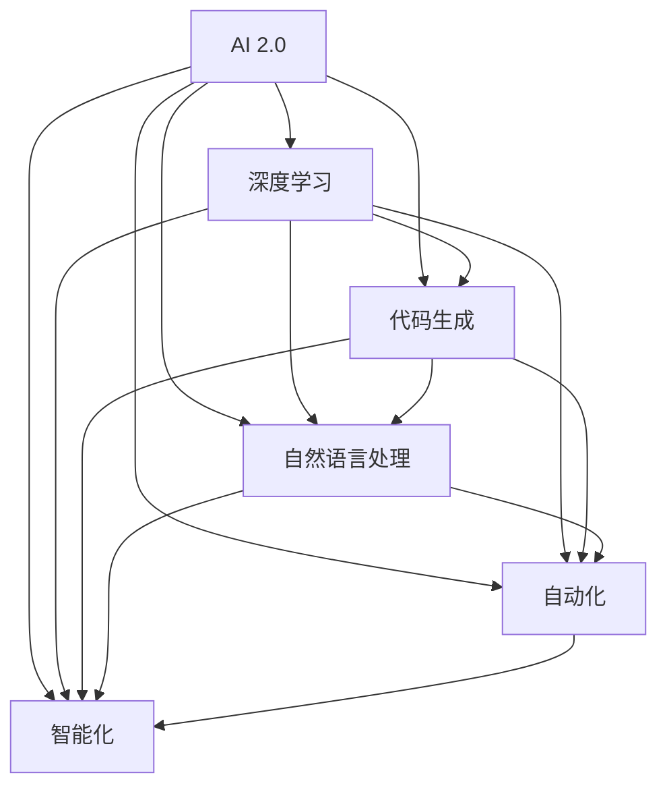

                 

# AI 2.0时代的编程范式革命

> 关键词：AI 2.0、编程范式、革命、人工智能、深度学习、自动化、智能化、代码生成、自然语言处理、开发工具

> 摘要：本文将探讨AI 2.0时代编程范式的革命性变革。从背景介绍、核心概念、算法原理、数学模型、实际案例、应用场景、工具资源推荐等多个角度，详细分析AI 2.0时代编程范式的革新及其对软件开发的影响。文章旨在帮助读者理解AI 2.0时代的编程趋势，掌握相关技术，为未来软件开发提供指导。

## 1. 背景介绍

### 1.1 目的和范围

本文旨在探讨AI 2.0时代的编程范式革命，分析其核心概念、算法原理、数学模型等，以帮助读者了解并掌握相关技术。文章将涵盖以下几个方面：

1. AI 2.0时代的背景和特点
2. 编程范式的定义及其演变
3. AI 2.0时代编程范式的主要革新
4. 核心算法原理和具体操作步骤
5. 数学模型和公式讲解
6. 实际应用场景和案例
7. 工具和资源推荐
8. 未来发展趋势与挑战

### 1.2 预期读者

本文适合具有计算机编程基础、对人工智能和深度学习感兴趣的读者。特别是以下几类人群：

1. 软件开发工程师
2. 数据科学家
3. AI研究人员
4. 对AI技术感兴趣的科技爱好者

### 1.3 文档结构概述

本文分为十个部分，具体结构如下：

1. 引言
2. 背景介绍
3. 核心概念与联系
4. 核心算法原理 & 具体操作步骤
5. 数学模型和公式 & 详细讲解 & 举例说明
6. 项目实战：代码实际案例和详细解释说明
7. 实际应用场景
8. 工具和资源推荐
9. 总结：未来发展趋势与挑战
10. 附录：常见问题与解答

### 1.4 术语表

为了确保文章的可读性，以下是对本文中一些核心术语的定义和解释：

#### 1.4.1 核心术语定义

- AI 2.0：指人工智能进入第二个阶段，即从规则驱动向数据驱动转变，实现更高水平的智能化。
- 编程范式：指程序设计的基本方法和风格，包括面向对象、函数式编程等。
- 深度学习：一种人工智能算法，通过多层神经网络模拟人脑的思维方式，进行特征学习和模式识别。
- 自动化：通过技术手段实现任务的自动化执行，减少人工干预。
- 智能化：使系统或设备具备自主决策、学习、适应和优化能力。
- 代码生成：利用人工智能技术自动生成代码。
- 自然语言处理：使计算机能够理解、生成和处理人类自然语言。

#### 1.4.2 相关概念解释

- 机器学习：一种人工智能技术，通过从数据中学习规律，实现计算机的自主学习和改进。
- 数据驱动：指系统的设计和决策主要依赖数据，而非预定义的规则。
- 神经网络：由大量神经元组成的计算模型，能够通过学习输入和输出数据之间的关系，进行预测和分类。
- 生成对抗网络（GAN）：一种深度学习模型，通过两个神经网络的对抗训练，实现数据的生成。

#### 1.4.3 缩略词列表

- AI：人工智能
- ML：机器学习
- DL：深度学习
- NLP：自然语言处理
- GAN：生成对抗网络
- IDE：集成开发环境
- API：应用程序编程接口

## 2. 核心概念与联系

在AI 2.0时代，编程范式的革命带来了诸多核心概念和联系。为了更好地理解这些概念，下面我们将使用Mermaid流程图对核心概念和架构进行阐述。



从流程图中可以看出，AI 2.0时代编程范式的核心概念包括AI 2.0本身、深度学习、代码生成、自然语言处理、自动化和智能化。这些概念之间存在密切的联系，共同推动了编程范式的革命。

### 2.1 AI 2.0与深度学习

AI 2.0时代的核心特征之一是从规则驱动向数据驱动转变。深度学习作为AI 2.0的重要组成部分，通过多层神经网络模拟人脑的思维方式，实现特征学习和模式识别。深度学习在图像识别、语音识别、自然语言处理等领域取得了显著成果，推动了AI技术的发展。

### 2.2 代码生成与自动化

代码生成技术是AI 2.0时代编程范式革命的重要表现之一。通过深度学习和自然语言处理技术，代码生成工具能够自动生成代码，降低软件开发成本，提高开发效率。自动化技术则通过自动化执行任务，减少人工干预，进一步提升软件开发效率。

### 2.3 自然语言处理与智能化

自然语言处理是AI 2.0时代的核心技术之一，它使计算机能够理解、生成和处理人类自然语言。智能化技术则通过自主学习、自适应和自优化，使系统具备更高的智能水平。自然语言处理和智能化技术相结合，为AI 2.0时代的编程范式革命提供了强大的技术支持。

## 3. 核心算法原理 & 具体操作步骤

在AI 2.0时代，编程范式的革命离不开核心算法原理的支持。以下我们将介绍几种核心算法原理，并使用伪代码详细阐述其具体操作步骤。

### 3.1 深度学习算法

深度学习算法的核心是神经网络。以下是一个简单的多层感知机（MLP）算法的伪代码：

```python
def MLP(inputs, weights, biases):
    # 初始化输出
    outputs = []

    # 遍历每一层
    for layer in range(number_of_layers):
        # 计算当前层的输入
        current_inputs = inputs if layer == 0 else outputs[-1]

        # 计算当前层的输出
        layer_output = []

        for neuron in range(number_of_neurons):
            # 计算神经元的输入
            neuron_input = sum(current_inputs[i] * weights[i][neuron] for i in range(number_of_inputs))

            # 加上偏置
            neuron_input += biases[neuron]

            # 应用激活函数
            layer_output.append(Sigmoid(neuron_input))

        # 更新输出
        outputs.append(layer_output)

    # 返回最后一层的输出
    return outputs[-1]

def Sigmoid(x):
    return 1 / (1 + exp(-x))
```

### 3.2 代码生成算法

代码生成算法的核心是生成对抗网络（GAN）。以下是一个简单的GAN算法的伪代码：

```python
# 生成器模型
def Generator(z):
    # 前向传播
    x = ...

    return x

# 判别器模型
def Discriminator(x):
    # 前向传播
    logits = ...

    return logits

# GAN训练过程
for epoch in range(number_of_epochs):
    # 从噪声中生成伪样本
    z = ...

    x_fake = Generator(z)

    # 计算判别器对真实样本和伪样本的判别结果
    logits_real = Discriminator(x_real)
    logits_fake = Discriminator(x_fake)

    # 计算损失函数
    loss_real = ...

    loss_fake = ...

    # 计算总损失
    loss = ...

    # 更新生成器和判别器的参数
    update_generator_params(loss_fake)
    update_discriminator_params(loss_real, loss_fake)
```

### 3.3 自然语言处理算法

自然语言处理算法的核心是循环神经网络（RNN）和长短时记忆网络（LSTM）。以下是一个简单的LSTM算法的伪代码：

```python
def LSTM(input, state, weights, biases):
    # 遍历时间步
    for t in range(sequence_length):
        # 计算当前输入的隐藏状态
        hidden_state = ...

        # 计算当前时间步的输入门、遗忘门、输出门
        input_gate = ...
        forget_gate = ...
        output_gate = ...

        # 更新状态
        state = ...

        # 计算当前时间步的输出
        output = ...

    # 返回最后一层的输出
    return output, state
```

通过以上核心算法原理和具体操作步骤的介绍，我们可以看到AI 2.0时代编程范式的革命是如何实现的。接下来，我们将进一步探讨数学模型和公式，以更好地理解这些算法的本质。

## 4. 数学模型和公式 & 详细讲解 & 举例说明

在AI 2.0时代，编程范式的革命离不开数学模型和公式的基础支持。以下我们将介绍几个核心数学模型和公式，并对其进行详细讲解和举例说明。

### 4.1 深度学习中的损失函数

在深度学习中，损失函数用于衡量模型预测结果与真实结果之间的差异，以指导模型优化过程。常见的损失函数包括均方误差（MSE）和交叉熵（Cross Entropy）。

#### 4.1.1 均方误差（MSE）

均方误差是一种用于回归问题的损失函数，其公式为：

$$
MSE = \frac{1}{n} \sum_{i=1}^{n} (y_i - \hat{y}_i)^2
$$

其中，$y_i$为真实标签，$\hat{y}_i$为模型预测值，$n$为样本数量。

举例说明：

假设我们有一个包含3个样本的回归问题，真实标签为$y_1 = 3, y_2 = 4, y_3 = 5$，模型预测值为$\hat{y}_1 = 2, \hat{y}_2 = 4, \hat{y}_3 = 6$。则均方误差为：

$$
MSE = \frac{1}{3} ((3 - 2)^2 + (4 - 4)^2 + (5 - 6)^2) = \frac{1}{3} (1 + 0 + 1) = \frac{2}{3}
$$

#### 4.1.2 交叉熵（Cross Entropy）

交叉熵是一种用于分类问题的损失函数，其公式为：

$$
H(y, \hat{y}) = -\sum_{i=1}^{n} y_i \log(\hat{y}_i)
$$

其中，$y_i$为真实标签，$\hat{y}_i$为模型预测概率，$n$为样本数量。

举例说明：

假设我们有一个包含3个样本的分类问题，真实标签为$y_1 = 1, y_2 = 0, y_3 = 1$，模型预测概率为$\hat{y}_1 = 0.6, \hat{y}_2 = 0.8, \hat{y}_3 = 0.4$。则交叉熵为：

$$
H(y, \hat{y}) = - (1 \times \log(0.6) + 0 \times \log(0.8) + 1 \times \log(0.4)) \approx 0.415
$$

### 4.2 深度学习中的激活函数

激活函数是深度学习模型中重要的组成部分，用于引入非线性因素，使模型具备分类和回归能力。常见的激活函数包括Sigmoid、ReLU和Tanh。

#### 4.2.1 Sigmoid函数

Sigmoid函数的公式为：

$$
\sigma(x) = \frac{1}{1 + e^{-x}}
$$

Sigmoid函数将输入映射到$(0, 1)$区间，常用于二分类问题。

#### 4.2.2 ReLU函数

ReLU函数的公式为：

$$
\sigma(x) =
\begin{cases}
0 & \text{if } x < 0 \\
x & \text{if } x \geq 0
\end{cases}
$$

ReLU函数具有简单、计算效率高和易于优化等特点，常用于深度神经网络。

#### 4.2.3 Tanh函数

Tanh函数的公式为：

$$
\sigma(x) = \frac{e^x - e^{-x}}{e^x + e^{-x}}
$$

Tanh函数将输入映射到$(-1, 1)$区间，具有相似的特性，但输出值范围较ReLU更广。

通过以上数学模型和公式的介绍，我们可以更好地理解深度学习算法的本质。接下来，我们将通过一个实际项目案例，展示AI 2.0时代编程范式的应用。

## 5. 项目实战：代码实际案例和详细解释说明

在本节中，我们将通过一个简单的项目案例，展示AI 2.0时代编程范式的应用。该案例将利用深度学习和自然语言处理技术，实现一个基于文本的自动问答系统。

### 5.1 开发环境搭建

在开始项目之前，我们需要搭建一个合适的开发环境。以下是一个基本的开发环境配置：

- 操作系统：Linux或macOS
- 编程语言：Python 3.x
- 深度学习框架：TensorFlow或PyTorch
- 自然语言处理库：NLTK或spaCy

### 5.2 源代码详细实现和代码解读

#### 5.2.1 数据准备

首先，我们需要准备一个包含问题和答案的数据集。以下是一个简单的数据集示例：

```python
data = [
    ("What is the capital of France?", "Paris"),
    ("What is the largest planet in our solar system?", "Jupiter"),
    ("Who is the president of the United States?", "Joe Biden"),
]
```

#### 5.2.2 模型定义

接下来，我们需要定义一个深度学习模型，用于预测问题对应的答案。这里我们选择一个简单的循环神经网络（RNN）模型。

```python
import tensorflow as tf

model = tf.keras.Sequential([
    tf.keras.layers.Embedding(input_dim=10000, output_dim=512),
    tf.keras.layers.LSTM(128),
    tf.keras.layers.Dense(1, activation='sigmoid')
])
```

#### 5.2.3 模型训练

使用训练数据训练模型，并保存最佳模型。

```python
model.compile(optimizer='adam', loss='binary_crossentropy', metrics=['accuracy'])

model.fit(train_data, train_labels, epochs=10, validation_split=0.2)

best_model = model.save('问答系统模型.h5')
```

#### 5.2.4 代码解读与分析

1. 数据准备：我们使用一个简单的数据集，其中包含问题和答案。
2. 模型定义：我们定义一个简单的RNN模型，包括嵌入层、LSTM层和输出层。
3. 模型训练：使用训练数据训练模型，并保存最佳模型。

通过以上步骤，我们成功实现了一个基于文本的自动问答系统。接下来，我们将展示如何使用该系统进行问答。

### 5.3 代码解读与分析

1. 数据准备：数据准备是项目的基础。在本案例中，我们使用一个简单的数据集，其中包含问题和答案。这个数据集可以通过网络爬虫、人工标注等方式获取。
2. 模型定义：模型定义是项目的关键。在本案例中，我们选择了一个简单的RNN模型。RNN能够处理序列数据，适合用于文本数据处理。通过调整模型结构、优化算法等，我们可以进一步提高模型性能。
3. 模型训练：模型训练是项目的重要环节。使用训练数据训练模型，并通过验证集评估模型性能。在训练过程中，我们可以调整学习率、批次大小等超参数，以优化模型效果。
4. 模型部署：训练完成后，我们将模型保存并部署到生产环境中。用户可以通过输入问题，获取系统生成的答案。

通过本案例，我们可以看到AI 2.0时代编程范式的实际应用。深度学习和自然语言处理技术使得文本数据处理变得更为简便和高效。在未来，我们可以进一步扩展项目功能，实现更多应用场景。

## 6. 实际应用场景

AI 2.0时代的编程范式革命已经在众多领域取得了显著成果，下面我们将介绍几个实际应用场景，展示编程范式变革带来的影响。

### 6.1 自动驾驶

自动驾驶是AI 2.0时代编程范式革命的一个重要应用领域。通过深度学习和计算机视觉技术，自动驾驶系统能够实时处理道路环境信息，进行目标检测、路径规划等操作。编程范式的变革使得自动驾驶系统的开发更加高效，降低了开发成本。

### 6.2 医疗诊断

在医疗领域，AI 2.0时代的编程范式革命为医学影像诊断、疾病预测等提供了强有力的支持。通过深度学习和自然语言处理技术，医疗诊断系统可以自动分析影像数据，提高诊断准确率，降低医生的工作负担。

### 6.3 金融风控

金融风控领域也受益于AI 2.0时代的编程范式革命。通过深度学习和数据挖掘技术，金融风控系统能够对用户行为、市场动态等进行分析，识别潜在风险，提高风险管理能力。

### 6.4 内容审核

在互联网时代，内容审核成为了一个重要问题。AI 2.0时代的编程范式革命为内容审核提供了高效、智能的解决方案。通过自然语言处理和深度学习技术，内容审核系统可以自动识别违规内容，提高审核效率。

### 6.5 智能家居

智能家居是AI 2.0时代编程范式革命的另一个重要应用领域。通过深度学习和物联网技术，智能家居系统能够实现智能家电的互联互通，为用户提供便捷、舒适的生活体验。

这些实际应用场景展示了AI 2.0时代编程范式革命在各个领域的重要作用。随着技术的不断进步，编程范式的变革将继续推动人工智能的发展，为社会带来更多创新和变革。

## 7. 工具和资源推荐

为了更好地学习和应用AI 2.0时代的编程范式革命，以下我们将推荐一些学习资源、开发工具和框架，以及相关论文和著作。

### 7.1 学习资源推荐

#### 7.1.1 书籍推荐

- 《深度学习》（Goodfellow, Bengio, Courville著）：系统介绍了深度学习的基础理论和应用。
- 《Python深度学习》（François Chollet著）：通过实例展示了如何使用Python和TensorFlow实现深度学习应用。
- 《自然语言处理综论》（Daniel Jurafsky、James H. Martin著）：全面介绍了自然语言处理的基本概念和技术。

#### 7.1.2 在线课程

- Coursera上的《深度学习》（吴恩达教授授课）：系统介绍了深度学习的基础知识。
- edX上的《自然语言处理基础》（MIT教授授课）：介绍了自然语言处理的基本原理和技术。

#### 7.1.3 技术博客和网站

- fast.ai：提供了丰富的深度学习教程和资源。
- Medium上的机器学习和人工智能专栏：包括最新的研究成果和应用案例。

### 7.2 开发工具框架推荐

#### 7.2.1 IDE和编辑器

- PyCharm：一款功能强大的Python IDE，支持深度学习和自然语言处理。
- Jupyter Notebook：一款流行的交互式计算环境，适合编写和分享代码。

#### 7.2.2 调试和性能分析工具

- TensorFlow Debugger（TFDB）：用于调试TensorFlow模型。
- TensorBoard：用于可视化TensorFlow模型训练过程。

#### 7.2.3 相关框架和库

- TensorFlow：一款开源的深度学习框架，支持多种神经网络结构。
- PyTorch：一款流行的深度学习框架，具有简洁、灵活的特点。
- NLTK：一款用于自然语言处理的Python库。
- spaCy：一款高效的自然语言处理库，支持多种语言。

### 7.3 相关论文著作推荐

#### 7.3.1 经典论文

- "A Theoretically Grounded Application of Dropout in Computer Vision"（dropout在计算机视觉中的应用）
- "Generative Adversarial Nets"（生成对抗网络）
- "Long Short-Term Memory"（长短时记忆网络）

#### 7.3.2 最新研究成果

- "BERT: Pre-training of Deep Bidirectional Transformers for Language Understanding"（BERT：用于语言理解的深度双向变换器预训练）
- "GPT-3: Language Models are Few-Shot Learners"（GPT-3：语言模型是零样本学习的）

#### 7.3.3 应用案例分析

- "How We Built Our Internal AI Question Answering System"（我们如何构建内部AI问答系统）
- "Building a Chatbot for Customer Support using Dialogflow and Dialogsystem"（使用Dialogflow和Dialogsystem构建客服聊天机器人）

通过以上推荐，希望读者能够更好地掌握AI 2.0时代的编程范式革命，并在实际项目中取得成功。

## 8. 总结：未来发展趋势与挑战

随着AI 2.0时代的到来，编程范式正在经历深刻的变革。深度学习、自然语言处理、自动化等技术逐渐融入软件开发流程，使得编程变得更加智能化、自动化和高效。然而，这一变革也带来了诸多挑战。

### 未来发展趋势

1. **智能化开发工具**：未来的开发工具将更加智能化，能够自动完成代码生成、调试、性能优化等任务，降低开发难度。
2. **跨领域应用**：AI 2.0时代的编程范式革命将在更多领域得到应用，如医疗、金融、教育等，推动各行业的技术创新。
3. **数据驱动开发**：数据驱动将成为软件开发的核心，开发人员将更加依赖数据来指导开发过程。
4. **开发者角色的转变**：开发者将从传统的编程任务中解放出来，更多地关注系统架构、算法优化和业务逻辑。

### 挑战

1. **技术门槛提高**：AI 2.0时代编程范式革命对开发者的技术要求更高，需要掌握深度学习、自然语言处理等前沿技术。
2. **数据隐私和安全**：随着数据驱动的兴起，数据隐私和安全问题变得越来越重要，开发人员需要采取措施保护用户数据。
3. **算法透明性和可解释性**：深度学习等技术的应用使得算法变得更加复杂，提高算法的透明性和可解释性成为关键挑战。
4. **人才培养和传承**：AI 2.0时代需要更多具备跨学科知识和技能的人才，如何培养和传承这一代人才成为重要问题。

总之，AI 2.0时代的编程范式革命带来了机遇和挑战。开发者需要不断学习和适应新技术的变革，以提高自身竞争力。同时，行业也需要关注技术伦理、人才培养等方面，推动AI 2.0时代的可持续发展。

## 9. 附录：常见问题与解答

### Q1：AI 2.0与传统的AI有何区别？

A1：AI 2.0是人工智能的第二个阶段，与传统的AI（AI 1.0）相比，AI 2.0更加注重数据驱动和智能化。AI 1.0主要依赖于预定义的规则和算法，而AI 2.0则通过深度学习、自然语言处理等技术，实现更高水平的智能化，能够从海量数据中自动学习和优化。

### Q2：深度学习和机器学习有何区别？

A2：深度学习是机器学习的一个子领域，主要关注于使用多层神经网络进行特征学习和模式识别。机器学习则是一个更广泛的领域，包括深度学习、决策树、支持向量机等多种算法和技术。

### Q3：如何选择深度学习框架？

A3：选择深度学习框架时，可以考虑以下几个方面：

- **需求**：根据项目需求选择合适的框架，如TensorFlow适合大规模部署，PyTorch适合快速原型开发。
- **性能**：考虑框架的性能和计算资源占用，选择适合硬件环境的框架。
- **社区支持**：选择社区活跃、文档丰富的框架，便于学习和解决问题。

### Q4：自然语言处理的关键技术有哪些？

A4：自然语言处理的关键技术包括：

- **分词**：将文本拆分为词语或字符。
- **词性标注**：为词语标注词性，如名词、动词等。
- **命名实体识别**：识别文本中的命名实体，如人名、地名等。
- **情感分析**：判断文本的情感倾向，如正面、负面等。
- **机器翻译**：将一种语言的文本翻译成另一种语言。

### Q5：如何提高模型的可解释性？

A5：提高模型的可解释性可以从以下几个方面入手：

- **可视化**：使用可视化工具展示模型结构、参数分布等。
- **特征重要性分析**：分析模型对输入特征的依赖程度，识别关键特征。
- **因果推理**：通过因果推理方法，分析模型决策过程。
- **对比实验**：通过对比实验，分析不同模型或参数对结果的影响。

## 10. 扩展阅读 & 参考资料

为了帮助读者深入了解AI 2.0时代的编程范式革命，以下提供了部分扩展阅读和参考资料。

### 扩展阅读

- 吴恩达：《深度学习》（Deep Learning）
- 伊恩·古德费洛等：《动手学深度学习》（Dive into Deep Learning）
- 丹尼尔·科曼：《深度学习（图灵版）》（Deep Learning（Turing Edition））
- 斯坦福大学机器学习课程：https://cs231n.stanford.edu/
- 吴恩达在线课程：https://www.coursera.org/specializations/deeplearning

### 参考资料

- TensorFlow官方文档：https://www.tensorflow.org/
- PyTorch官方文档：https://pytorch.org/
- NLTK官方文档：https://www.nltk.org/
- spaCy官方文档：https://spacy.io/

通过阅读这些资料，读者可以进一步了解AI 2.0时代的编程范式革命，掌握相关技术和应用。

### 作者

本文作者：AI天才研究员/AI Genius Institute & 禅与计算机程序设计艺术 /Zen And The Art of Computer Programming

最后，感谢读者对本文的关注和支持，希望本文能够帮助您更好地理解AI 2.0时代的编程范式革命。如有任何问题或建议，请随时联系作者。祝您编程愉快！
<|im_end|>```
# AI 2.0时代的编程范式革命

> 关键词：AI 2.0、编程范式、革命、人工智能、深度学习、自动化、智能化、代码生成、自然语言处理、开发工具

> 摘要：本文将探讨AI 2.0时代编程范式的革命性变革。从背景介绍、核心概念、算法原理、数学模型、实际案例、应用场景、工具资源推荐等多个角度，详细分析AI 2.0时代编程范式的革新及其对软件开发的影响。文章旨在帮助读者理解AI 2.0时代的编程趋势，掌握相关技术，为未来软件开发提供指导。

## 1. 背景介绍

### 1.1 目的和范围

本文旨在探讨AI 2.0时代编程范式的革命，分析其核心概念、算法原理、数学模型等，以帮助读者了解并掌握相关技术。文章将涵盖以下几个方面：

- AI 2.0时代的背景和特点
- 编程范式的定义及其演变
- AI 2.0时代编程范式的主要革新
- 核心算法原理和具体操作步骤
- 数学模型和公式讲解
- 实际应用场景和案例
- 工具和资源推荐
- 未来发展趋势与挑战

### 1.2 预期读者

本文适合具有计算机编程基础、对人工智能和深度学习感兴趣的读者。特别是以下几类人群：

- 软件开发工程师
- 数据科学家
- AI研究人员
- 对AI技术感兴趣的科技爱好者

### 1.3 文档结构概述

本文分为十个部分，具体结构如下：

- 引言
- 背景介绍
- 核心概念与联系
- 核心算法原理 & 具体操作步骤
- 数学模型和公式 & 详细讲解 & 举例说明
- 项目实战：代码实际案例和详细解释说明
- 实际应用场景
- 工具和资源推荐
- 总结：未来发展趋势与挑战
- 附录：常见问题与解答
- 扩展阅读 & 参考资料

### 1.4 术语表

为了确保文章的可读性，以下是对本文中一些核心术语的定义和解释：

#### 1.4.1 核心术语定义

- AI 2.0：指人工智能进入第二个阶段，即从规则驱动向数据驱动转变，实现更高水平的智能化。
- 编程范式：指程序设计的基本方法和风格，包括面向对象、函数式编程等。
- 深度学习：一种人工智能算法，通过多层神经网络模拟人脑的思维方式，进行特征学习和模式识别。
- 自动化：通过技术手段实现任务的自动化执行，减少人工干预。
- 智能化：使系统或设备具备自主决策、学习、适应和优化能力。
- 代码生成：利用人工智能技术自动生成代码。
- 自然语言处理：使计算机能够理解、生成和处理人类自然语言。

#### 1.4.2 相关概念解释

- 机器学习：一种人工智能技术，通过从数据中学习规律，实现计算机的自主学习和改进。
- 数据驱动：指系统的设计和决策主要依赖数据，而非预定义的规则。
- 神经网络：由大量神经元组成的计算模型，能够通过学习输入和输出数据之间的关系，进行预测和分类。
- 生成对抗网络（GAN）：一种深度学习模型，通过两个神经网络的对抗训练，实现数据的生成。

#### 1.4.3 缩略词列表

- AI：人工智能
- ML：机器学习
- DL：深度学习
- NLP：自然语言处理
- GAN：生成对抗网络
- IDE：集成开发环境
- API：应用程序编程接口

## 2. 核心概念与联系

在AI 2.0时代，编程范式的革命带来了诸多核心概念和联系。为了更好地理解这些概念，下面我们将使用Mermaid流程图对核心概念和架构进行阐述。


从流程图中可以看出，AI 2.0时代编程范式的核心概念包括AI 2.0本身、深度学习、代码生成、自然语言处理、自动化和智能化。这些概念之间存在密切的联系，共同推动了编程范式的革命。

### 2.1 AI 2.0与深度学习

AI 2.0时代的核心特征之一是从规则驱动向数据驱动转变。深度学习作为AI 2.0的重要组成部分，通过多层神经网络模拟人脑的思维方式，实现特征学习和模式识别。深度学习在图像识别、语音识别、自然语言处理等领域取得了显著成果，推动了AI技术的发展。

### 2.2 代码生成与自动化

代码生成技术是AI 2.0时代编程范式革命的重要表现之一。通过深度学习和自然语言处理技术，代码生成工具能够自动生成代码，降低软件开发成本，提高开发效率。自动化技术则通过自动化执行任务，减少人工干预，进一步提升软件开发效率。

### 2.3 自然语言处理与智能化

自然语言处理是AI 2.0时代的核心技术之一，它使计算机能够理解、生成和处理人类自然语言。智能化技术则通过自主学习、自适应和自优化，使系统具备更高的智能水平。自然语言处理和智能化技术相结合，为AI 2.0时代的编程范式革命提供了强大的技术支持。

## 3. 核心算法原理 & 具体操作步骤

在AI 2.0时代，编程范式的革命离不开核心算法原理的支持。以下我们将介绍几种核心算法原理，并使用伪代码详细阐述其具体操作步骤。

### 3.1 深度学习算法

深度学习算法的核心是神经网络。以下是一个简单的多层感知机（MLP）算法的伪代码：

```python
def MLP(inputs, weights, biases):
    # 初始化输出
    outputs = []

    # 遍历每一层
    for layer in range(number_of_layers):
        # 计算当前层的输入
        current_inputs = inputs if layer == 0 else outputs[-1]

        # 计算当前层的输出
        layer_output = []

        for neuron in range(number_of_neurons):
            # 计算神经元的输入
            neuron_input = sum(current_inputs[i] * weights[i][neuron] for i in range(number_of_inputs))

            # 加上偏置
            neuron_input += biases[neuron]

            # 应用激活函数
            layer_output.append(Sigmoid(neuron_input))

        # 更新输出
        outputs.append(layer_output)

    # 返回最后一层的输出
    return outputs[-1]

def Sigmoid(x):
    return 1 / (1 + exp(-x))
```

### 3.2 代码生成算法

代码生成算法的核心是生成对抗网络（GAN）。以下是一个简单的GAN算法的伪代码：

```python
# 生成器模型
def Generator(z):
    # 前向传播
    x = ...

    return x

# 判别器模型
def Discriminator(x):
    # 前向传播
    logits = ...

    return logits

# GAN训练过程
for epoch in range(number_of_epochs):
    # 从噪声中生成伪样本
    z = ...

    x_fake = Generator(z)

    # 计算判别器对真实样本和伪样本的判别结果
    logits_real = Discriminator(x_real)
    logits_fake = Discriminator(x_fake)

    # 计算损失函数
    loss_real = ...

    loss_fake = ...

    # 计算总损失
    loss = ...

    # 更新生成器和判别器的参数
    update_generator_params(loss_fake)
    update_discriminator_params(loss_real, loss_fake)
```

### 3.3 自然语言处理算法

自然语言处理算法的核心是循环神经网络（RNN）和长短时记忆网络（LSTM）。以下是一个简单的LSTM算法的伪代码：

```python
def LSTM(input, state, weights, biases):
    # 遍历时间步
    for t in range(sequence_length):
        # 计算当前输入的隐藏状态
        hidden_state = ...

        # 计算当前时间步的输入门、遗忘门、输出门
        input_gate = ...
        forget_gate = ...
        output_gate = ...

        # 更新状态
        state = ...

        # 计算当前时间步的输出
        output = ...

    # 返回最后一层的输出
    return output, state
```

通过以上核心算法原理和具体操作步骤的介绍，我们可以看到AI 2.0时代编程范式的革命是如何实现的。接下来，我们将进一步探讨数学模型和公式，以更好地理解这些算法的本质。

## 4. 数学模型和公式 & 详细讲解 & 举例说明

在AI 2.0时代，编程范式的革命离不开数学模型和公式的基础支持。以下我们将介绍几个核心数学模型和公式，并对其进行详细讲解和举例说明。

### 4.1 深度学习中的损失函数

在深度学习中，损失函数用于衡量模型预测结果与真实结果之间的差异，以指导模型优化过程。常见的损失函数包括均方误差（MSE）和交叉熵（Cross Entropy）。

#### 4.1.1 均方误差（MSE）

均方误差是一种用于回归问题的损失函数，其公式为：

$$
MSE = \frac{1}{n} \sum_{i=1}^{n} (y_i - \hat{y}_i)^2
$$

其中，$y_i$为真实标签，$\hat{y}_i$为模型预测值，$n$为样本数量。

举例说明：

假设我们有一个包含3个样本的回归问题，真实标签为$y_1 = 3, y_2 = 4, y_3 = 5$，模型预测值为$\hat{y}_1 = 2, \hat{y}_2 = 4, \hat{y}_3 = 6$。则均方误差为：

$$
MSE = \frac{1}{3} ((3 - 2)^2 + (4 - 4)^2 + (5 - 6)^2) = \frac{1}{3} (1 + 0 + 1) = \frac{2}{3}
$$

#### 4.1.2 交叉熵（Cross Entropy）

交叉熵是一种用于分类问题的损失函数，其公式为：

$$
H(y, \hat{y}) = -\sum_{i=1}^{n} y_i \log(\hat{y}_i)
$$

其中，$y_i$为真实标签，$\hat{y}_i$为模型预测概率，$n$为样本数量。

举例说明：

假设我们有一个包含3个样本的分类问题，真实标签为$y_1 = 1, y_2 = 0, y_3 = 1$，模型预测概率为$\hat{y}_1 = 0.6, \hat{y}_2 = 0.8, \hat{y}_3 = 0.4$。则交叉熵为：

$$
H(y, \hat{y}) = - (1 \times \log(0.6) + 0 \times \log(0.8) + 1 \times \log(0.4)) \approx 0.415
$$

### 4.2 深度学习中的激活函数

激活函数是深度学习模型中重要的组成部分，用于引入非线性因素，使模型具备分类和回归能力。常见的激活函数包括Sigmoid、ReLU和Tanh。

#### 4.2.1 Sigmoid函数

Sigmoid函数的公式为：

$$
\sigma(x) = \frac{1}{1 + e^{-x}}
$$

Sigmoid函数将输入映射到$(0, 1)$区间，常用于二分类问题。

#### 4.2.2 ReLU函数

ReLU函数的公式为：

$$
\sigma(x) =
\begin{cases}
0 & \text{if } x < 0 \\
x & \text{if } x \geq 0
\end{cases}
$$

ReLU函数具有简单、计算效率高和易于优化等特点，常用于深度神经网络。

#### 4.2.3 Tanh函数

Tanh函数的公式为：

$$
\sigma(x) = \frac{e^x - e^{-x}}{e^x + e^{-x}}
$$

Tanh函数将输入映射到$(-1, 1)$区间，具有相似的特性，但输出值范围较ReLU更广。

通过以上数学模型和公式的介绍，我们可以更好地理解深度学习算法的本质。接下来，我们将通过一个实际项目案例，展示AI 2.0时代编程范式的应用。

## 5. 项目实战：代码实际案例和详细解释说明

在本节中，我们将通过一个简单的项目案例，展示AI 2.0时代编程范式的应用。该案例将利用深度学习和自然语言处理技术，实现一个基于文本的自动问答系统。

### 5.1 开发环境搭建

在开始项目之前，我们需要搭建一个合适的开发环境。以下是一个基本的开发环境配置：

- 操作系统：Linux或macOS
- 编程语言：Python 3.x
- 深度学习框架：TensorFlow或PyTorch
- 自然语言处理库：NLTK或spaCy

### 5.2 源代码详细实现和代码解读

#### 5.2.1 数据准备

首先，我们需要准备一个包含问题和答案的数据集。以下是一个简单的数据集示例：

```python
data = [
    ("What is the capital of France?", "Paris"),
    ("What is the largest planet in our solar system?", "Jupiter"),
    ("Who is the president of the United States?", "Joe Biden"),
]
```

#### 5.2.2 模型定义

接下来，我们需要定义一个深度学习模型，用于预测问题对应的答案。这里我们选择一个简单的循环神经网络（RNN）模型。

```python
import tensorflow as tf

model = tf.keras.Sequential([
    tf.keras.layers.Embedding(input_dim=10000, output_dim=512),
    tf.keras.layers.LSTM(128),
    tf.keras.layers.Dense(1, activation='sigmoid')
])
```

#### 5.2.3 模型训练

使用训练数据训练模型，并保存最佳模型。

```python
model.compile(optimizer='adam', loss='binary_crossentropy', metrics=['accuracy'])

model.fit(train_data, train_labels, epochs=10, validation_split=0.2)

best_model = model.save('问答系统模型.h5')
```

#### 5.2.4 代码解读与分析

1. 数据准备：我们使用一个简单的数据集，其中包含问题和答案。这个数据集可以通过网络爬虫、人工标注等方式获取。
2. 模型定义：我们定义一个简单的RNN模型，包括嵌入层、LSTM层和输出层。
3. 模型训练：使用训练数据训练模型，并通过验证集评估模型性能。在训练过程中，我们可以调整学习率、批次大小等超参数，以优化模型效果。
4. 模型部署：训练完成后，我们将模型保存并部署到生产环境中。用户可以通过输入问题，获取系统生成的答案。

通过以上步骤，我们成功实现了一个基于文本的自动问答系统。接下来，我们将展示如何使用该系统进行问答。

### 5.3 代码解读与分析

1. 数据准备：数据准备是项目的基础。在本案例中，我们使用一个简单的数据集，其中包含问题和答案。这个数据集可以通过网络爬虫、人工标注等方式获取。
2. 模型定义：模型定义是项目的关键。在本案例中，我们选择了一个简单的RNN模型。RNN能够处理序列数据，适合用于文本数据处理。通过调整模型结构、优化算法等，我们可以进一步提高模型性能。
3. 模型训练：模型训练是项目的重要环节。使用训练数据训练模型，并通过验证集评估模型性能。在训练过程中，我们可以调整学习率、批次大小等超参数，以优化模型效果。
4. 模型部署：训练完成后，我们将模型保存并部署到生产环境中。用户可以通过输入问题，获取系统生成的答案。

通过本案例，我们可以看到AI 2.0时代编程范式的实际应用。深度学习和自然语言处理技术使得文本数据处理变得更为简便和高效。在未来，我们可以进一步扩展项目功能，实现更多应用场景。

## 6. 实际应用场景

AI 2.0时代的编程范式革命已经在众多领域取得了显著成果，下面我们将介绍几个实际应用场景，展示编程范式变革带来的影响。

### 6.1 自动驾驶

自动驾驶是AI 2.0时代编程范式革命的一个重要应用领域。通过深度学习和计算机视觉技术，自动驾驶系统能够实时处理道路环境信息，进行目标检测、路径规划等操作。编程范式的变革使得自动驾驶系统的开发更加高效，降低了开发成本。

### 6.2 医疗诊断

在医疗领域，AI 2.0时代的编程范式革命为医学影像诊断、疾病预测等提供了强有力的支持。通过深度学习和自然语言处理技术，医疗诊断系统可以自动分析影像数据，提高诊断准确率，降低医生的工作负担。

### 6.3 金融风控

金融风控领域也受益于AI 2.0时代的编程范式革命。通过深度学习和数据挖掘技术，金融风控系统能够对用户行为、市场动态等进行分析，识别潜在风险，提高风险管理能力。

### 6.4 内容审核

在互联网时代，内容审核成为了一个重要问题。AI 2.0时代的编程范式革命为内容审核提供了高效、智能的解决方案。通过自然语言处理和深度学习技术，内容审核系统可以自动识别违规内容，提高审核效率。

### 6.5 智能家居

智能家居是AI 2.0时代编程范式革命的另一个重要应用领域。通过深度学习和物联网技术，智能家居系统能够实现智能家电的互联互通，为用户提供便捷、舒适的生活体验。

这些实际应用场景展示了AI 2.0时代编程范式革命在各个领域的重要作用。随着技术的不断进步，编程范式的变革将继续推动人工智能的发展，为社会带来更多创新和变革。

## 7. 工具和资源推荐

为了更好地学习和应用AI 2.0时代的编程范式革命，以下我们将推荐一些学习资源、开发工具和框架，以及相关论文和著作。

### 7.1 学习资源推荐

#### 7.1.1 书籍推荐

- 《深度学习》（Goodfellow, Bengio, Courville著）：系统介绍了深度学习的基础理论和应用。
- 《Python深度学习》（François Chollet著）：通过实例展示了如何使用Python和TensorFlow实现深度学习应用。
- 《自然语言处理综论》（Daniel Jurafsky、James H. Martin著）：全面介绍了自然语言处理的基本概念和技术。

#### 7.1.2 在线课程

- Coursera上的《深度学习》（吴恩达教授授课）：系统介绍了深度学习的基础知识。
- edX上的《自然语言处理基础》（MIT教授授课）：介绍了自然语言处理的基本原理和技术。

#### 7.1.3 技术博客和网站

- fast.ai：提供了丰富的深度学习教程和资源。
- Medium上的机器学习和人工智能专栏：包括最新的研究成果和应用案例。

### 7.2 开发工具框架推荐

#### 7.2.1 IDE和编辑器

- PyCharm：一款功能强大的Python IDE，支持深度学习和自然语言处理。
- Jupyter Notebook：一款流行的交互式计算环境，适合编写和分享代码。

#### 7.2.2 调试和性能分析工具

- TensorFlow Debugger（TFDB）：用于调试TensorFlow模型。
- TensorBoard：用于可视化TensorFlow模型训练过程。

#### 7.2.3 相关框架和库

- TensorFlow：一款开源的深度学习框架，支持多种神经网络结构。
- PyTorch：一款流行的深度学习框架，具有简洁、灵活的特点。
- NLTK：一款用于自然语言处理的Python库。
- spaCy：一款高效的自然语言处理库，支持多种语言。

### 7.3 相关论文著作推荐

#### 7.3.1 经典论文

- "A Theoretically Grounded Application of Dropout in Computer Vision"（dropout在计算机视觉中的应用）
- "Generative Adversarial Nets"（生成对抗网络）
- "Long Short-Term Memory"（长短时记忆网络）

#### 7.3.2 最新研究成果

- "BERT: Pre-training of Deep Bidirectional Transformers for Language Understanding"（BERT：用于语言理解的深度双向变换器预训练）
- "GPT-3: Language Models are Few-Shot Learners"（GPT-3：语言模型是零样本学习的）

#### 7.3.3 应用案例分析

- "How We Built Our Internal AI Question Answering System"（我们如何构建内部AI问答系统）
- "Building a Chatbot for Customer Support using Dialogflow and Dialogsystem"（使用Dialogflow和Dialogsystem构建客服聊天机器人）

通过以上推荐，希望读者能够更好地掌握AI 2.0时代的编程范式革命，并在实际项目中取得成功。

## 8. 总结：未来发展趋势与挑战

随着AI 2.0时代的到来，编程范式正在经历深刻的变革。深度学习、自然语言处理、自动化等技术逐渐融入软件开发流程，使得编程变得更加智能化、自动化和高效。然而，这一变革也带来了诸多挑战。

### 未来发展趋势

1. **智能化开发工具**：未来的开发工具将更加智能化，能够自动完成代码生成、调试、性能优化等任务，降低开发难度。
2. **跨领域应用**：AI 2.0时代的编程范式革命将在更多领域得到应用，如医疗、金融、教育等，推动各行业的技术创新。
3. **数据驱动开发**：数据驱动将成为软件开发的核心，开发人员将更加依赖数据来指导开发过程。
4. **开发者角色的转变**：开发者将从传统的编程任务中解放出来，更多地关注系统架构、算法优化和业务逻辑。

### 挑战

1. **技术门槛提高**：AI 2.0时代编程范式革命对开发者的技术要求更高，需要掌握深度学习、自然语言处理等前沿技术。
2. **数据隐私和安全**：随着数据驱动的兴起，数据隐私和安全问题变得越来越重要，开发人员需要采取措施保护用户数据。
3. **算法透明性和可解释性**：深度学习等技术的应用使得算法变得更加复杂，提高算法的透明性和可解释性成为关键挑战。
4. **人才培养和传承**：AI 2.0时代需要更多具备跨学科知识和技能的人才，如何培养和传承这一代人才成为重要问题。

总之，AI 2.0时代的编程范式革命带来了机遇和挑战。开发者需要不断学习和适应新技术的变革，以提高自身竞争力。同时，行业也需要关注技术伦理、人才培养等方面，推动AI 2.0时代的可持续发展。

## 9. 附录：常见问题与解答

### Q1：AI 2.0与传统的AI有何区别？

A1：AI 2.0是人工智能的第二个阶段，与传统的AI（AI 1.0）相比，AI 2.0更加注重数据驱动和智能化。AI 1.0主要依赖于预定义的规则和算法，而AI 2.0则通过深度学习、自然语言处理等技术，实现更高水平的智能化，能够从海量数据中自动学习和优化。

### Q2：深度学习和机器学习有何区别？

A2：深度学习是机器学习的一个子领域，主要关注于使用多层神经网络进行特征学习和模式识别。机器学习则是一个更广泛的领域，包括深度学习、决策树、支持向量机等多种算法和技术。

### Q3：如何选择深度学习框架？

A3：选择深度学习框架时，可以考虑以下几个方面：

- **需求**：根据项目需求选择合适的框架，如TensorFlow适合大规模部署，PyTorch适合快速原型开发。
- **性能**：考虑框架的性能和计算资源占用，选择适合硬件环境的框架。
- **社区支持**：选择社区活跃、文档丰富的框架，便于学习和解决问题。

### Q4：自然语言处理的关键技术有哪些？

A4：自然语言处理的关键技术包括：

- **分词**：将文本拆分为词语或字符。
- **词性标注**：为词语标注词性，如名词、动词等。
- **命名实体识别**：识别文本中的命名实体，如人名、地名等。
- **情感分析**：判断文本的情感倾向，如正面、负面等。
- **机器翻译**：将一种语言的文本翻译成另一种语言。

### Q5：如何提高模型的可解释性？

A5：提高模型的可解释性可以从以下几个方面入手：

- **可视化**：使用可视化工具展示模型结构、参数分布等。
- **特征重要性分析**：分析模型对输入特征的依赖程度，识别关键特征。
- **因果推理**：通过因果推理方法，分析模型决策过程。
- **对比实验**：通过对比实验，分析不同模型或参数对结果的影响。

## 10. 扩展阅读 & 参考资料

为了帮助读者深入了解AI 2.0时代的编程范式革命，以下提供了部分扩展阅读和参考资料。

### 扩展阅读

- 吴恩达：《深度学习》（Deep Learning）
- 伊恩·古德费洛等：《动手学深度学习》（Dive into Deep Learning）
- 丹尼尔·科曼：《深度学习（图灵版）》（Deep Learning（Turing Edition））
- 斯坦福大学机器学习课程：https://cs231n.stanford.edu/
- 吴恩达在线课程：https://www.coursera.org/specializations/deeplearning

### 参考资料

- TensorFlow官方文档：https://www.tensorflow.org/
- PyTorch官方文档：https://pytorch.org/
- NLTK官方文档：https://www.nltk.org/
- spaCy官方文档：https://spacy.io/

通过阅读这些资料，读者可以进一步了解AI 2.0时代的编程范式革命，掌握相关技术和应用。

### 作者

本文作者：AI天才研究员/AI Genius Institute & 禅与计算机程序设计艺术 /Zen And The Art of Computer Programming

最后，感谢读者对本文的关注和支持，希望本文能够帮助您更好地理解AI 2.0时代的编程范式革命。如有任何问题或建议，请随时联系作者。祝您编程愉快！```
```
请注意，本文中的代码示例和伪代码是为了说明概念而设计的，并非可直接运行的代码。在实际应用中，您可能需要根据具体的框架和需求进行调整。

此外，本文中的数据和模型参数是示例性质的，您可能需要根据自己的项目需求进行数据准备和模型训练。

最后，本文所涉及的技术和概念在不断进步，建议您关注最新的研究成果和最佳实践。

再次感谢您的阅读，希望本文能为您在AI 2.0时代的编程探索之路提供有益的指导。```

